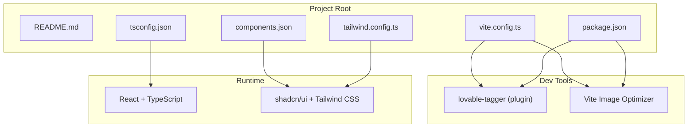
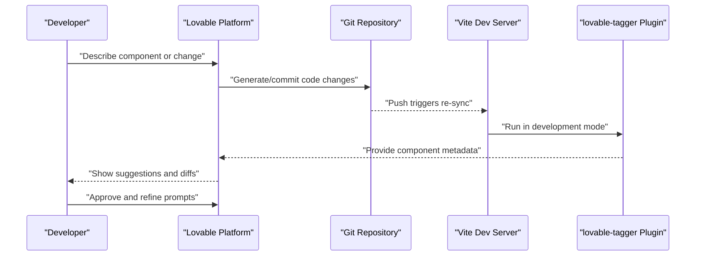
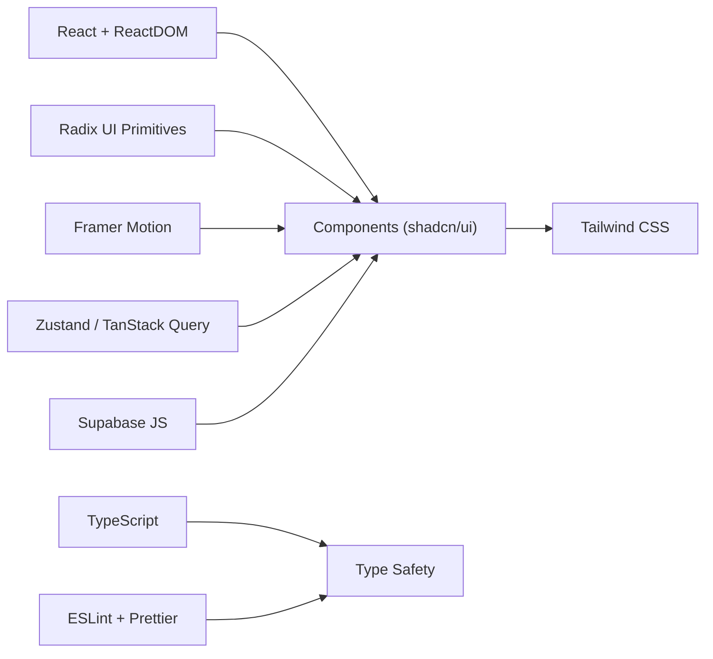

# AI-Assisted Development

<cite>
**Referenced Files in This Document**
- [README.md](file://README.md)
- [package.json](file://package.json)
- [vite.config.ts](file://vite.config.ts)
- [components.json](file://components.json)
- [tailwind.config.ts](file://tailwind.config.ts)
- [tsconfig.json](file://tsconfig.json)
</cite>

## Table of Contents
1. [Introduction](#introduction)
2. [Project Structure](#project-structure)
3. [Core Components](#core-components)
4. [Architecture Overview](#architecture-overview)
5. [Detailed Component Analysis](#detailed-component-analysis)
6. [Dependency Analysis](#dependency-analysis)
7. [Performance Considerations](#performance-considerations)
8. [Troubleshooting Guide](#troubleshooting-guide)
9. [Conclusion](#conclusion)
10. [Appendices](#appendices)

## Introduction
This document explains how to leverage AI-assisted development through the Lovable platform integration in this project. It covers the AI development workflow, including component tagging, prompt-driven code generation, and automated development assistance. It also documents the integration with the Lovable platform, the component metadata system, and practical guidance for configuring AI development tools, understanding AI suggestions, maintaining code quality, and troubleshooting common issues.

## Project Structure
This project is a Vite + React + TypeScript application configured for rapid iteration and AI collaboration. The Lovable platform integrates via a Vite plugin that tags UI components during development, enabling AI to understand and suggest improvements to your component library. The project’s configuration files define the build pipeline, component metadata, and tooling that supports AI-assisted authoring.

**Diagram sources**
- [vite.config.ts:1-43](file://vite.config.ts#L1-L43)
- [package.json:1-95](file://package.json#L1-L95)
- [components.json:1-21](file://components.json#L1-L21)
- [tailwind.config.ts:1-97](file://tailwind.config.ts#L1-L97)
- [tsconfig.json:1-24](file://tsconfig.json#L1-L24)

**Section sources**
- [README.md:1-74](file://README.md#L1-L74)
- [package.json:1-95](file://package.json#L1-L95)
- [vite.config.ts:1-43](file://vite.config.ts#L1-L43)
- [components.json:1-21](file://components.json#L1-L21)
- [tailwind.config.ts:1-97](file://tailwind.config.ts#L1-L97)
- [tsconfig.json:1-24](file://tsconfig.json#L1-L24)

## Core Components
- Lovable Platform Integration
  - The project is designed for AI-assisted development via Lovable. Changes made in Lovable are committed back to this repository automatically, and local edits synchronize to Lovable. This enables a seamless prompt-driven development loop.
  - The Lovable Project URL is embedded in the README; replace the placeholder with your actual project ID to access the AI editor.

- AI Development Workflow
  - Prompt-driven creation: Describe UI components or pages in natural language; Lovable generates code aligned with your stack (React, shadcn/ui, Tailwind).
  - Iterative refinement: Use follow-up prompts to adjust styles, behavior, accessibility, and responsiveness.
  - Automated assistance: Lovable suggests component reuse, refactors, and best practices based on your component library and Tailwind configuration.

- Component Tagging and Metadata
  - The lovable-tagger plugin is activated in development mode to annotate UI components. This metadata helps Lovable understand component boundaries, props, and relationships, improving suggestion accuracy.
  - shadcn/ui and Tailwind metadata are centralized in components.json and tailwind.config.ts, ensuring consistent design tokens and component aliases.

- Build and Dev Tooling
  - Vite handles fast HMR and builds with optimized chunking.
  - Additional image optimization is configured for assets.
  - TypeScript and ESLint support enforce code quality and type safety.

**Section sources**
- [README.md:1-74](file://README.md#L1-L74)
- [vite.config.ts:1-43](file://vite.config.ts#L1-L43)
- [components.json:1-21](file://components.json#L1-L21)
- [tailwind.config.ts:1-97](file://tailwind.config.ts#L1-L97)
- [package.json:1-95](file://package.json#L1-L95)

## Architecture Overview
The AI-assisted development architecture centers on the Lovable platform and the Vite build pipeline. During development, the lovable-tagger plugin annotates components, enabling Lovable to propose targeted changes. The project’s configuration ensures consistent component semantics and styling, which Lovable uses to generate accurate, maintainable code.

**Diagram sources**
- [README.md:1-74](file://README.md#L1-L74)
- [vite.config.ts:1-43](file://vite.config.ts#L1-L43)
- [package.json:1-95](file://package.json#L1-L95)

## Detailed Component Analysis

### Lovable Platform Integration
- Purpose: Enable AI-driven development and collaboration.
- Behavior:
  - Editing in Lovable commits changes to the repository automatically.
  - Local edits sync to Lovable, keeping both environments consistent.
  - The project README provides step-by-step instructions for cloning, installing dependencies, and starting the dev server.

Best practices:
- Keep the Lovable Project URL updated to your live project.
- Use the README’s setup steps to ensure a smooth local-to-cloud workflow.

**Section sources**
- [README.md:1-74](file://README.md#L1-L74)

### Component Tagging Pipeline
- Purpose: Provide AI with structured metadata about UI components.
- Implementation:
  - The lovable-tagger plugin is registered in Vite and enabled in development mode.
  - The plugin scans React components and attaches metadata used by Lovable to understand component structure and relationships.

How it helps AI:
- Accurate suggestions for component composition and prop usage.
- Improved context-aware refactoring and reuse recommendations.

**Section sources**
- [vite.config.ts:1-43](file://vite.config.ts#L1-L43)

### Component Metadata System (shadcn/ui + Tailwind)
- Purpose: Centralize component design tokens and aliases for consistent AI suggestions.
- Configuration highlights:
  - components.json defines style, TSX usage, Tailwind config path, base color, and aliases for components, utils, ui, lib, hooks.
  - tailwind.config.ts extends design tokens, animations, and content scanning paths to include pages, components, app, and src.

Impact on AI:
- Ensures Lovable understands your design system, enabling accurate suggestions for colors, spacing, typography, and motion.
- Content globs help Lovable discover components across the project.

**Section sources**
- [components.json:1-21](file://components.json#L1-L21)
- [tailwind.config.ts:1-97](file://tailwind.config.ts#L1-L97)

### Build and Dev Tooling
- Purpose: Provide a fast, reliable development environment that supports AI-assisted authoring.
- Highlights:
  - Vite dev server with HMR and host/port configuration.
  - Manual chunking for vendor, UI, and Supabase bundles.
  - Image optimization for performance.
  - TypeScript path aliases configured for clean imports.

How it supports AI:
- Fast reloads enable rapid iteration on AI-generated code.
- Clear module resolution reduces ambiguity for AI when suggesting imports or refactors.

**Section sources**
- [vite.config.ts:1-43](file://vite.config.ts#L1-L43)
- [tsconfig.json:1-24](file://tsconfig.json#L1-L24)
- [package.json:1-95](file://package.json#L1-L95)

## Dependency Analysis
The project’s dependencies include React, shadcn/ui, Tailwind CSS, and supporting libraries. These influence how Lovable interprets and generates UI code.

**Diagram sources**
- [package.json:1-95](file://package.json#L1-L95)

**Section sources**
- [package.json:1-95](file://package.json#L1-L95)

## Performance Considerations
- Component tagging overhead is limited to development mode, minimizing production impact.
- Vite’s chunking strategy separates vendor, UI, and service-specific code, improving load performance.
- Image optimization reduces asset sizes without sacrificing quality.
- Tailwind’s content scanning targets only relevant directories, reducing unnecessary CSS generation.

[No sources needed since this section provides general guidance]

## Troubleshooting Guide
Common issues and resolutions:

- Lovable changes not reflecting locally
  - Ensure the repository is cloned and the dev server is running per the README steps.
  - Verify that the Lovable Project URL is correct and accessible.

- AI suggestions look inconsistent with design system
  - Confirm components.json and tailwind.config.ts are properly configured and reflect your design tokens.
  - Re-run the dev server after updating Tailwind content globs or component aliases.

- Component tagging not working
  - Confirm the lovable-tagger plugin is enabled in development mode.
  - Check that Vite is running and that the plugin runs during dev.

- Build or lint errors after AI-generated code
  - Run the lint script and fix reported issues.
  - Align imports and types with tsconfig path aliases.

**Section sources**
- [README.md:1-74](file://README.md#L1-L74)
- [vite.config.ts:1-43](file://vite.config.ts#L1-L43)
- [components.json:1-21](file://components.json#L1-L21)
- [tailwind.config.ts:1-97](file://tailwind.config.ts#L1-L97)
- [package.json:1-95](file://package.json#L1-L95)

## Conclusion
This project is configured for AI-assisted development through the Lovable platform. By combining component tagging, prompt-driven generation, and a robust design system, developers can iterate quickly while maintaining consistency. Use the provided configuration files and workflows to maximize the effectiveness of AI suggestions, keep code quality high, and troubleshoot common integration issues.

[No sources needed since this section summarizes without analyzing specific files]

## Appendices

### Practical AI-Assisted Development Examples
- Generate a new form component
  - Prompt Lovable to create a form using shadcn/ui components with specific fields and validation.
  - Review AI suggestions, approve changes, and refine prompts for layout or behavior.

- Optimize existing components
  - Ask Lovable to improve accessibility, responsiveness, or performance of a component.
  - Merge approved changes and verify with the dev server.

- Accelerate development cycles
  - Use Lovable to scaffold pages or dashboards, then iterate with follow-up prompts for styling and interactions.

[No sources needed since this section provides general guidance]