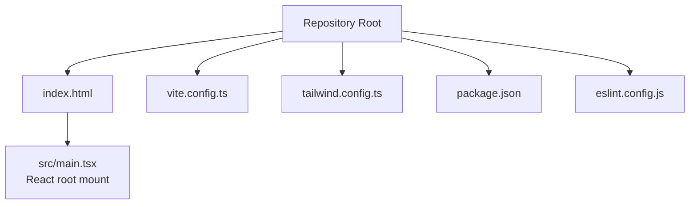
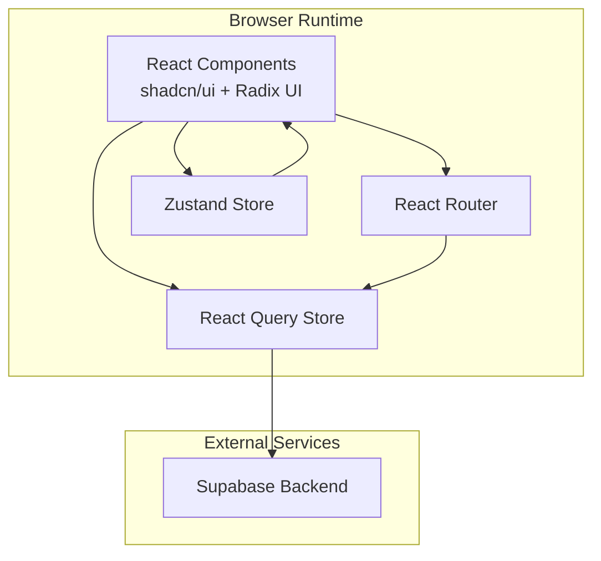
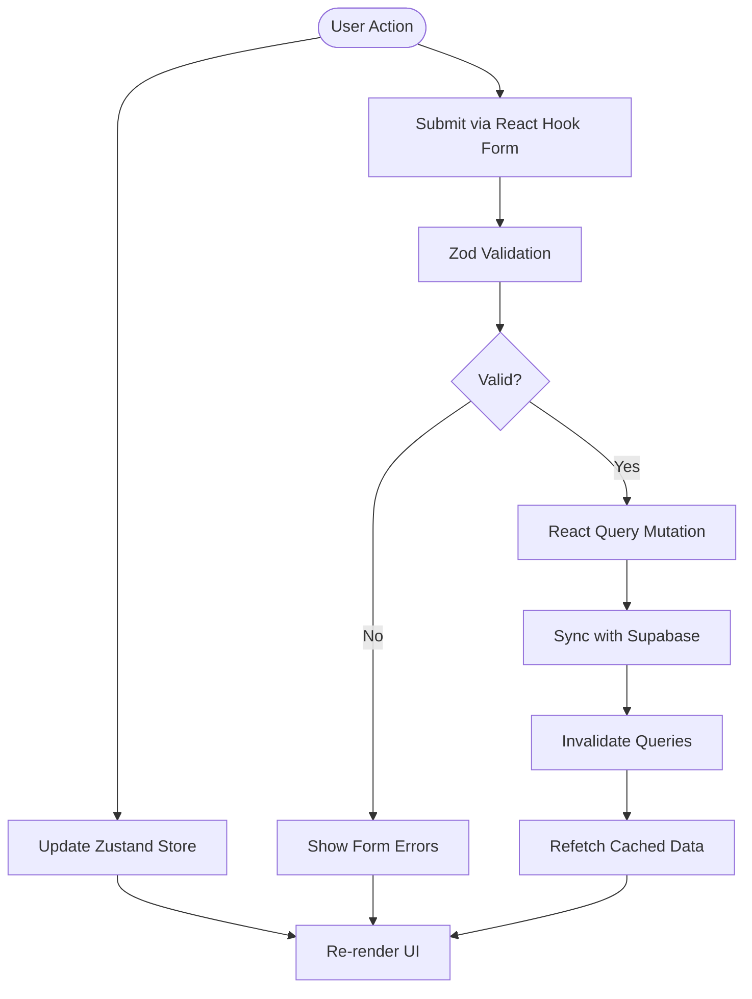
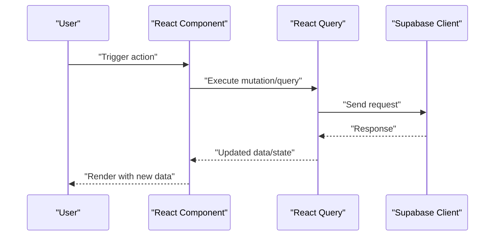
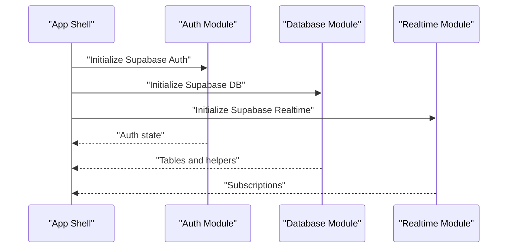
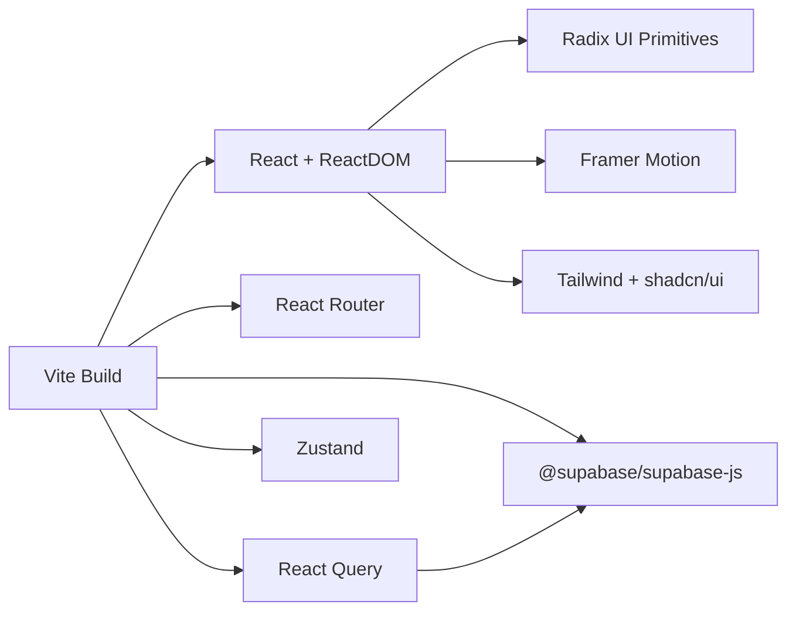

# Application Architecture

<cite>
**Referenced Files in This Document**
- [README.md](file://README.md)
- [package.json](file://package.json)
- [index.html](file://index.html)
- [vite.config.ts](file://vite.config.ts)
- [tailwind.config.ts](file://tailwind.config.ts)
- [eslint.config.js](file://eslint.config.js)
</cite>

## Table of Contents
1. [Introduction](#introduction)
2. [Project Structure](#project-structure)
3. [Core Components](#core-components)
4. [Architecture Overview](#architecture-overview)
5. [Detailed Component Analysis](#detailed-component-analysis)
6. [Dependency Analysis](#dependency-analysis)
7. [Performance Considerations](#performance-considerations)
8. [Troubleshooting Guide](#troubleshooting-guide)
9. [Conclusion](#conclusion)
10. [Appendices](#appendices)

## Introduction
This document describes the application architecture for the Ryland project. It focuses on the frontend stack built with React, TypeScript, Vite, and supporting libraries, and explains how the UI integrates with external services through Supabase. The document covers high-level design, component composition, state management patterns, data flows, build and tooling choices, and deployment considerations.

## Project Structure
The repository is a minimal frontend project scaffolded with Vite and React. The runtime entry point mounts the React application into the DOM via a script tag in the HTML document. Build-time configuration defines aliases, chunking strategy, and development server settings. Styling is configured through Tailwind CSS, and linting is enforced with ESLint and TypeScript rules.

**Diagram sources**
- [index.html:47-48](file://index.html#L47-L48)
- [vite.config.ts:1-43](file://vite.config.ts#L1-L43)
- [tailwind.config.ts:1-97](file://tailwind.config.ts#L1-L97)
- [package.json:1-95](file://package.json#L1-L95)
- [eslint.config.js:1-27](file://eslint.config.js#L1-L27)

**Section sources**
- [README.md:53-61](file://README.md#L53-L61)
- [index.html:1-51](file://index.html#L1-L51)
- [vite.config.ts:1-43](file://vite.config.ts#L1-L43)
- [tailwind.config.ts:1-97](file://tailwind.config.ts#L1-L97)
- [package.json:1-95](file://package.json#L1-L95)
- [eslint.config.js:1-27](file://eslint.config.js#L1-L27)

## Core Components
- Frontend framework: React with TypeScript for type safety and developer productivity.
- Build system: Vite for fast development server and optimized production builds.
- UI primitives and animations: Radix UI primitives, Framer Motion, shadcn/ui components, and Tailwind CSS utilities.
- Routing: React Router for navigation.
- State and caching: React Query for server state caching and synchronization; Zustand for lightweight client-side state.
- Forms: React Hook Form with Zod resolvers for form validation.
- Media and UX: Embla Carousel for carousels, React Day Picker for date selection, Sonner for notifications, Next Themes for theme switching.
- Backend integration: Supabase JS client for authentication, database, and real-time features.
- Tooling: ESLint with TypeScript rules, Vitest for unit testing, PostCSS/Tailwind for styling, and SWC-based React plugin for fast JSX transforms.

Key integration patterns:
- Supabase SDK is used to connect to backend services (authentication, database, storage, real-time).
- React Query manages server state and caching, coordinating with Supabase APIs.
- Zustand stores ephemeral UI state and small slices of application state.
- React Router orchestrates navigation and route-level data fetching via React Query.

**Section sources**
- [README.md:53-61](file://README.md#L53-L61)
- [package.json:15-69](file://package.json#L15-L69)
- [package.json:71-92](file://package.json#L71-L92)

## Architecture Overview
The application follows a component-based React architecture with clear separation of concerns:
- UI layer: Presentational and composite components using shadcn/ui and Radix UI primitives styled with Tailwind.
- State layer: React Query for server state and caching; Zustand for local UI state.
- Navigation layer: React Router for routing and route-level data loading.
- Integration layer: Supabase client for authentication, database, and real-time subscriptions.
- Build and tooling: Vite for bundling, ESLint for code quality, Vitest for tests, and Tailwind for styling.

[No sources needed since this diagram shows conceptual architecture, not a direct code mapping]

## Detailed Component Analysis

### Component Composition Patterns
- Composition over inheritance: UI components are composed from smaller building blocks (Radix UI primitives) and styled with Tailwind utilities.
- Container/presentational pattern: Data-fetching and caching are handled by container components (often route-level) while presentational components focus on rendering.
- Feature-based grouping: Components are organized by feature domains (e.g., forms, navigation, modals) and reused across routes.

### State Management
- React Query: Centralized cache for server data, background synchronization, and optimistic updates. Ideal for CRUD operations and real-time-like behavior via polling or subscriptions.
- Zustand: Lightweight store for UI state (theme, modal visibility, form drafts) and small application slices that do not require server synchronization.
- React Hook Form + Zod: Strongly typed form state with validation, integrated with React Query for submission flows.

[No sources needed since this diagram shows conceptual state flow, not a direct code mapping]

### Data Flows Between UI Components and Supabase
- Authentication: Supabase Auth SDK handles sign-in/sign-up, session persistence, and token refresh. UI components conditionally render based on auth state managed by React Query and Zustand.
- Database operations: Supabase client performs queries and mutations; React Query caches results and exposes loading/error states to components.
- Real-time: Supabase Realtime enables live updates; React Query can be configured to update cache on incoming events.

[No sources needed since this diagram shows conceptual data flow, not a direct code mapping]

### Integration Patterns with Supabase
- Client initialization: Supabase client is configured with project credentials and exposed as a singleton for use across components.
- Authentication flow: Redirect-based flows or popup-based flows depending on UX needs; session state is persisted and normalized by React Query.
- Database access: Typed queries/mutations using Supabase helpers; errors are normalized and surfaced to UI via React Query and form libraries.
- Real-time subscriptions: Subscriptions are established per route or component lifecycle and cleaned up on unmount.

[No sources needed since this diagram shows conceptual integration, not a direct code mapping]

## Dependency Analysis
The project’s dependency graph centers on React, React Router, React Query, and Supabase. Vite’s Rollup configuration groups major vendor libraries into separate chunks to optimize caching and loading.

**Diagram sources**
- [vite.config.ts:32-41](file://vite.config.ts#L32-L41)
- [package.json:15-69](file://package.json#L15-L69)

**Section sources**
- [vite.config.ts:32-41](file://vite.config.ts#L32-L41)
- [package.json:15-69](file://package.json#L15-L69)

## Performance Considerations
- Chunk splitting: Vendor chunks for React, UI libraries, and Supabase reduce repeated downloads and improve caching.
- Image optimization: Vite Image Optimizer reduces payload sizes for images during build.
- Dev server: Host and port are configured for efficient local iteration; HMR overlay disabled to minimize noise.
- CSS scanning: Tailwind scans component paths to purge unused styles in production builds.
- State caching: React Query’s cache minimizes redundant network requests and improves perceived performance.

[No sources needed since this section provides general guidance]

## Troubleshooting Guide
- Development server issues: Verify Vite server host/port and HMR settings; confirm the React plugin is enabled.
- Build failures: Check chunk splitting configuration and ensure all dependencies are installed.
- Lint errors: Review ESLint TypeScript rules and React Hooks configurations; adjust rules as needed.
- Styling problems: Confirm Tailwind content paths match component locations and that the animate plugin is loaded.
- Supabase connectivity: Validate project credentials and network access; ensure proper initialization order.

**Section sources**
- [vite.config.ts:8-25](file://vite.config.ts#L8-L25)
- [eslint.config.js:7-26](file://eslint.config.js#L7-L26)
- [tailwind.config.ts:3-5](file://tailwind.config.ts#L3-L5)
- [package.json:6-14](file://package.json#L6-L14)

## Conclusion
Ryland adopts a modern, component-based React architecture with strong typing, efficient build tooling, and robust integration with Supabase. The combination of React Router, React Query, and Zustand provides a clean separation of concerns for navigation, server state, and local UI state. The build configuration emphasizes performance through chunking and image optimization, while Tailwind and shadcn/ui enable rapid UI development with consistent design tokens.

## Appendices

### Deployment Topology
- Static hosting: The built assets are served statically; configure a CDN or static host for production.
- Custom domain: Configure DNS and SSL via platform controls to serve the site under a custom domain.
- Environment isolation: Keep environment-specific Supabase credentials out of client bundles; use secure backend endpoints for sensitive operations.

[No sources needed since this section provides general guidance]

### Infrastructure Requirements
- Node.js and npm for local development and CI/CD pipelines.
- Supabase project with authentication, database, and storage configured.
- Optional: Real-time subscriptions enabled; consider connection limits and scaling tiers.

[No sources needed since this section provides general guidance]