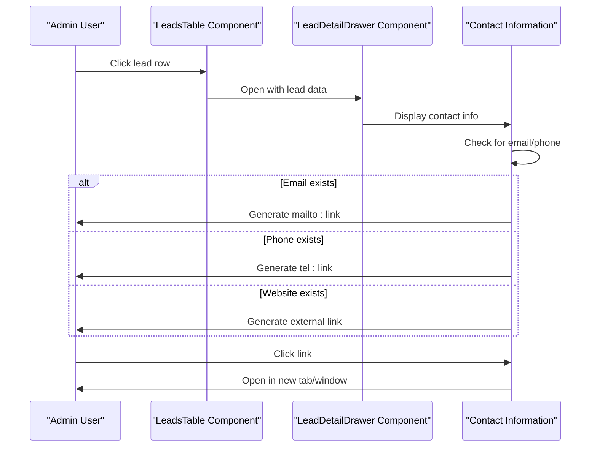
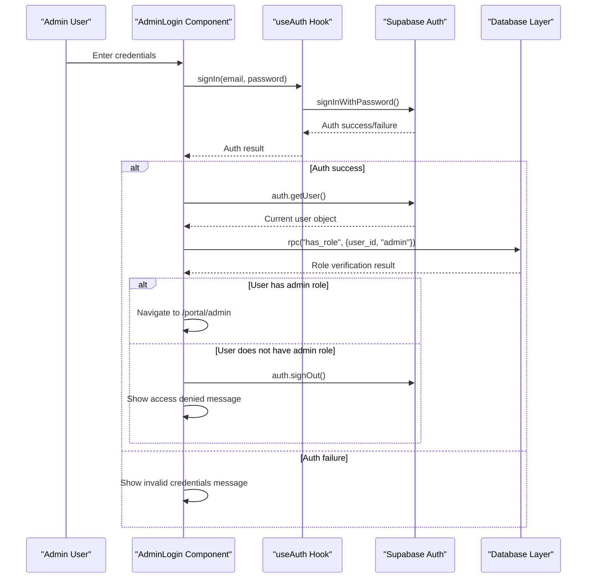
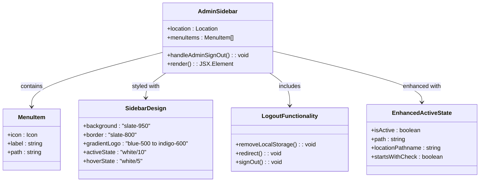
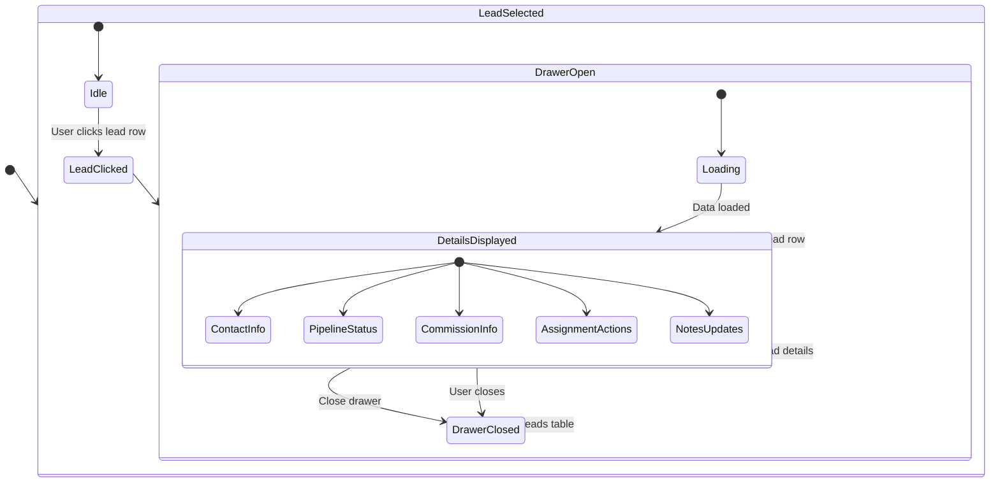
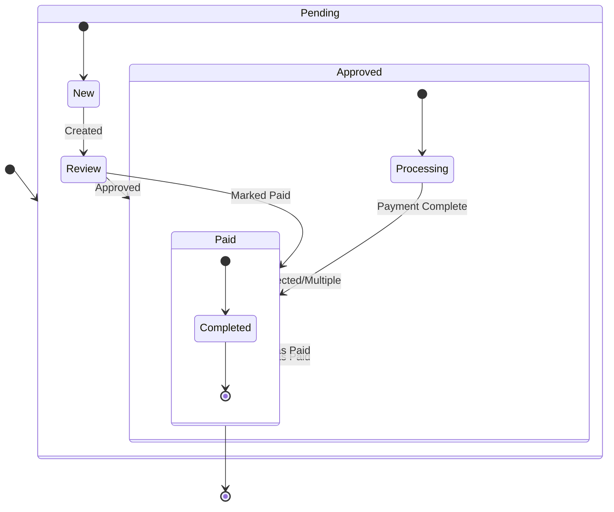
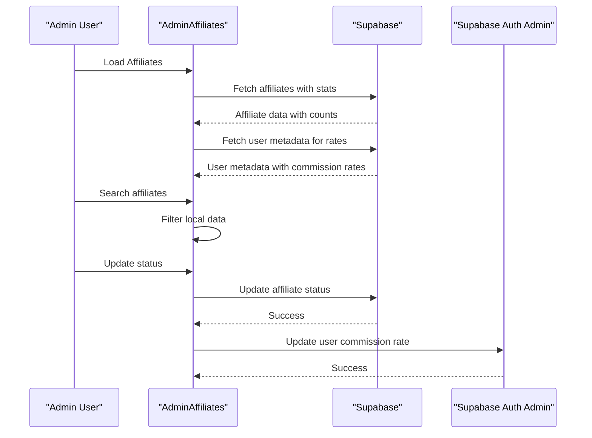
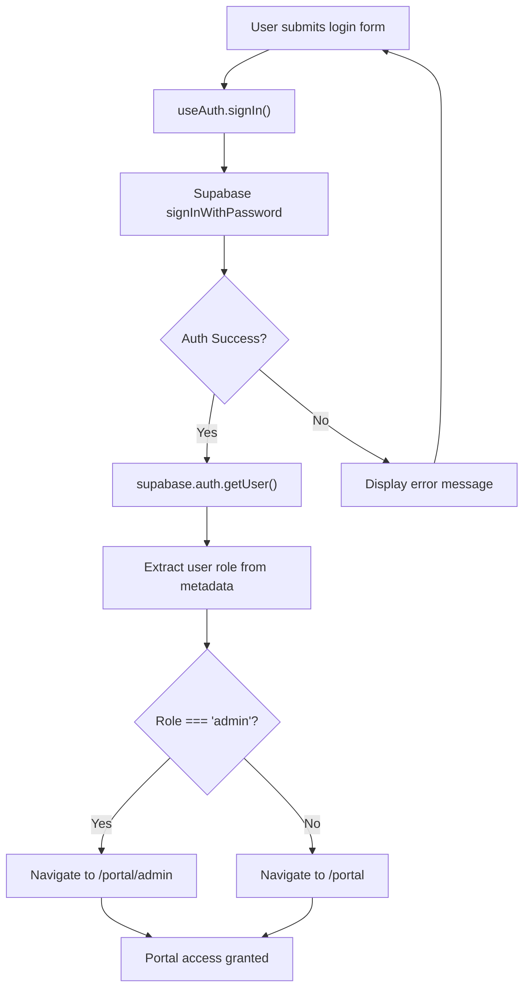
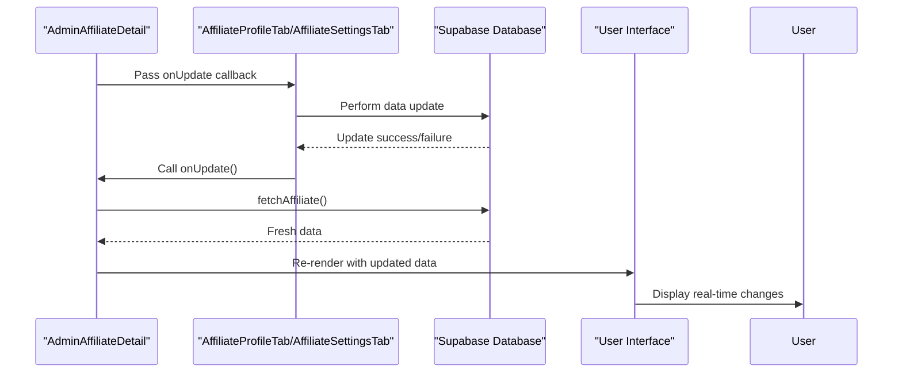

# Admin Portal System

<cite>
**Referenced Files in This Document**
- [README.md](file://README.md)
- [package.json](file://package.json)
- [src/main.tsx](file://src/main.tsx)
- [src/App.tsx](file://src/App.tsx)
- [src/integrations/supabase/client.ts](file://src/integrations/supabase/client.ts)
- [src/hooks/useAuth.tsx](file://src/hooks/useAuth.tsx)
- [src/hooks/useAdminRole.ts](file://src/hooks/useAdminRole.ts)
- [src/hooks/useAffiliateLeads.ts](file://src/hooks/useAffiliateLeads.ts)
- [src/components/admin/AdminLayout.tsx](file://src/components/admin/AdminLayout.tsx)
- [src/components/admin/AdminGuard.tsx](file://src/components/admin/AdminGuard.tsx)
- [src/components/admin/AdminSidebar.tsx](file://src/components/admin/AdminSidebar.tsx)
- [src/components/admin/AdminLeadDetailDrawer.tsx](file://src/components/admin/AdminLeadDetailDrawer.tsx)
- [src/components/portal/LeadDetailDrawer.tsx](file://src/components/portal/LeadDetailDrawer.tsx)
- [src/components/portal/LeadsTable.tsx](file://src/components/portal/LeadsTable.tsx)
- [src/pages/admin/AdminLogin.tsx](file://src/pages/admin/AdminLogin.tsx)
- [src/pages/admin/AdminDashboard.tsx](file://src/pages/admin/AdminDashboard.tsx)
- [src/pages/admin/AdminLeads.tsx](file://src/pages/admin/AdminLeads.tsx)
- [src/pages/admin/AdminAffiliates.tsx](file://src/pages/admin/AdminAffiliates.tsx)
- [src/pages/admin/AdminAffiliateDetail.tsx](file://src/pages/admin/AdminAffiliateDetail.tsx)
- [src/pages/admin/AdminCommissions.tsx](file://src/pages/admin/AdminCommissions.tsx)
- [src/pages/admin/AdminPayouts.tsx](file://src/pages/admin/AdminPayouts.tsx)
- [src/pages/admin/AdminReports.tsx](file://src/pages/admin/AdminReports.tsx)
- [src/pages/portal/PortalLogin.tsx](file://src/pages/portal/PortalLogin.tsx)
- [src/components/admin/affiliate-detail/AffiliateProfileTab.tsx](file://src/components/admin/affiliate-detail/AffiliateProfileTab.tsx)
- [src/components/admin/affiliate-detail/AffiliateCommissionsTab.tsx](file://src/components/admin/affiliate-detail/AffiliateCommissionsTab.tsx)
- [src/components/admin/affiliate-detail/AffiliateLeadsTab.tsx](file://src/components/admin/affiliate-detail/AffiliateLeadsTab.tsx)
- [src/components/admin/affiliate-detail/AffiliatePayoutsTab.tsx](file://src/components/admin/affiliate-detail/AffiliatePayoutsTab.tsx)
- [src/components/admin/affiliate-detail/AffiliateSettingsTab.tsx](file://src/components/admin/affiliate-detail/AffiliateSettingsTab.tsx)
- [supabase/migrations/20260320000000_admin_policies.sql](file://supabase/migrations/20260320000000_admin_policies.sql)
- [supabase/migrations/20260324201245_4681ef67-2bf0-4686-a4b6-1ae6c54189f9.sql](file://supabase/migrations/20260324201245_4681ef67-2bf0-4686-a4b6-1ae6c54189f9.sql)
- [supabase/migrations/20260327_admin_enhancements.sql](file://supabase/migrations/20260327_admin_enhancements.sql)
</cite>

## Update Summary
**Changes Made**
- **Updated** Enhanced LeadDetailDrawer with intelligent link generation for email and phone contacts
- **Updated** Enhanced LeadsTable with clickable contact information and improved row interaction
- **Updated** AffiliateProfileTab component with dual-mode editing interface (view/edit modes)
- **Updated** AffiliateSettingsTab with real-time data synchronization and admin controls
- **Updated** AdminAffiliateDetail page with comprehensive real-time data flow between tabs
- **Updated** Enhanced database structure with dual commission rate tracking and admin notes
- **Updated** Improved drawer-based lead detail interface with comprehensive contact information

## Table of Contents
1. [Introduction](#introduction)
2. [Project Structure](#project-structure)
3. [Core Components](#core-components)
4. [Architecture Overview](#architecture-overview)
5. [Detailed Component Analysis](#detailed-component-analysis)
6. [Dependency Analysis](#dependency-analysis)
7. [Performance Considerations](#performance-considerations)
8. [Troubleshooting Guide](#troubleshooting-guide)
9. [Conclusion](#conclusion)

## Introduction
This document provides comprehensive documentation for the Admin Portal System, a React-based administrative interface for managing an affiliate marketing program. The system integrates with Supabase for authentication, real-time database operations, and user management. It offers dashboard analytics, comprehensive affiliate management with dual commission rate tracking, lead tracking with enhanced drawer interfaces, commission processing, payout management, and reporting capabilities.

The Admin Portal is structured as a nested routing system under `/portal/admin`, protected by role-based authentication ensuring only administrators can access sensitive controls. The frontend leverages modern React patterns including Suspense for route-level code splitting, React Query for data caching, and a comprehensive UI toolkit for responsive layouts.

**Updated** The system now features enhanced lead management interfaces with intelligent link generation, comprehensive affiliate profile management with dual-mode editing capabilities, real-time data synchronization across all affiliate detail tabs, and an improved database structure supporting dual commission rate tracking with admin notes functionality.

## Project Structure
The Admin Portal resides within a larger React application and follows a feature-based organization:
- Root routing defines both public and admin routes with proper nesting
- Admin routes are grouped under `/portal/admin` with dedicated layout and guards
- Supabase integration provides authentication and data persistence
- UI components use a consistent design system with shadcn/ui primitives
- Modern hooks pattern separates authentication and authorization logic
- Database layer includes comprehensive role management with security policies
- **New**: Enhanced lead management interfaces with intelligent link generation
- **New**: Dual-mode affiliate profile editing with view/edit modes
- **New**: Real-time data synchronization through onUpdate callbacks across all affiliate detail tabs
- **New**: Enhanced database structure with dual commission rates and admin notes

```mermaid
graph TB
subgraph "Application Root"
Main[src/main.tsx]
App[src/App.tsx]
end
subgraph "Routing"
PublicRoutes["Public Routes"]
AdminRoutes["/portal/admin Routes"]
end
subgraph "Authentication Layer"
AuthProvider[src/hooks/useAuth.tsx]
AdminRoleHook[src/hooks/useAdminRole.ts]
PortalLogin[src/pages/portal/PortalLogin.tsx]
AdminLogin[src/pages/admin/AdminLogin.tsx]
end
subgraph "Admin Layer"
AdminLayout[src/components/admin/AdminLayout.tsx]
AdminGuard[src/components/admin/AdminGuard.tsx]
AdminSidebar[src/components/admin/AdminSidebar.tsx]
AdminLeadDetailDrawer[src/components/admin/AdminLeadDetailDrawer.tsx]
LeadDetailDrawer[src/components/portal/LeadDetailDrawer.tsx]
LeadsTable[src/components/portal/LeadsTable.tsx]
</subgraph
subgraph "Admin Pages"
Dashboard[src/pages/admin/AdminDashboard.tsx]
Leads[src/pages/admin/AdminLeads.tsx]
Affiliates[src/pages/admin/AdminAffiliates.tsx]
AffiliateDetail[src/pages/admin/AdminAffiliateDetail.tsx]
Commissions[src/pages/admin/AdminCommissions.tsx]
Payouts[src/pages/admin/AdminPayouts.tsx]
Reports[src/pages/admin/AdminReports.tsx]
end
subgraph "Enhanced Affiliate Detail Tabs"
ProfileTab[src/components/admin/affiliate-detail/AffiliateProfileTab.tsx]
CommissionsTab[src/components/admin/affiliate-detail/AffiliateCommissionsTab.tsx]
LeadsTab[src/components/admin/affiliate-detail/AffiliateLeadsTab.tsx]
PayoutsTab[src/components/admin/affiliate-detail/AffiliatePayoutsTab.tsx]
SettingsTab[src/components/admin/affiliate-detail/AffiliateSettingsTab.tsx]
end
subgraph "Real-time Data Flow"
OnUpdateCallback["onUpdate Callback Prop"]
FetchAffiliate["fetchAffiliate Function"]
RealTimeSync["Real-time Data Synchronization"]
EnhancedLeads["Enhanced Leads Management"]
IntelligentLinks["Intelligent Link Generation"]
DualModeEditing["Dual-mode Editing Interface"]
</subgraph
subgraph "Integration"
SupabaseClient[src/integrations/supabase/client.ts]
DatabaseLayer["Enhanced Database Layer"]
DualRateColumns["Dual Commission Rate Columns"]
AdminNotesColumn["Admin Notes Column"]
StandardizedTypes["Standardized Commission Types"]
EndRolePolicy["Admin RLS Policies"]
</subgraph
Main --> App
App --> PublicRoutes
App --> AdminRoutes
PublicRoutes --> PortalLogin
AdminRoutes --> AdminLogin
AdminRoutes --> AdminLayout
AdminLayout --> AdminGuard
AdminLayout --> AdminSidebar
AdminLayout --> AdminLeadDetailDrawer
AdminLayout --> LeadDetailDrawer
AdminLayout --> LeadsTable
AdminGuard --> AuthProvider
AuthProvider --> AdminRoleHook
AdminLayout --> Dashboard
AdminLayout --> Leads
AdminLayout --> Affiliates
AdminLayout --> AffiliateDetail
AdminLayout --> Commissions
AdminLayout --> Payouts
AdminLayout --> Reports
AffiliateDetail --> ProfileTab
AffiliateDetail --> CommissionsTab
AffiliateDetail --> LeadsTab
AffiliateDetail --> PayoutsTab
AffiliateDetail --> SettingsTab
ProfileTab --> OnUpdateCallback
SettingsTab --> OnUpdateCallback
OnUpdateCallback --> FetchAffiliate
FetchAffiliate --> RealTimeSync
LeadsTab --> AdminLeadDetailDrawer
Leads --> EnhancedLeads
EnhancedLeads --> IntelligentLinks
ProfileTab --> DualModeEditing
AdminLayout --> SupabaseClient
SupabaseClient --> DatabaseLayer
DatabaseLayer --> DualRateColumns
DatabaseLayer --> AdminNotesColumn
DatabaseLayer --> StandardizedTypes
DatabaseLayer --> EndRolePolicy
```

**Diagram sources**
- [src/main.tsx:1-7](file://src/main.tsx#L1-L7)
- [src/App.tsx:52-131](file://src/App.tsx#L52-L131)
- [src/hooks/useAuth.tsx:32-187](file://src/hooks/useAuth.tsx#L32-L187)
- [src/hooks/useAdminRole.ts](file://src/hooks/useAdminRole.ts)
- [src/pages/portal/PortalLogin.tsx:14-43](file://src/pages/portal/PortalLogin.tsx#L14-L43)
- [src/pages/admin/AdminLogin.tsx:14-52](file://src/pages/admin/AdminLogin.tsx#L14-L52)
- [src/components/admin/AdminLayout.tsx:9-40](file://src/components/admin/AdminLayout.tsx#L9-L40)
- [src/components/admin/AdminGuard.tsx:10-35](file://src/components/admin/AdminGuard.tsx#L10-L35)
- [src/components/admin/AdminSidebar.tsx:30-92](file://src/components/admin/AdminSidebar.tsx#L30-L92)
- [src/components/admin/AdminLeadDetailDrawer.tsx:43-133](file://src/components/admin/AdminLeadDetailDrawer.tsx#L43-L133)
- [src/components/portal/LeadDetailDrawer.tsx:41-104](file://src/components/portal/LeadDetailDrawer.tsx#L41-L104)
- [src/components/portal/LeadsTable.tsx:36-152](file://src/components/portal/LeadsTable.tsx#L36-L152)
- [src/pages/admin/AdminDashboard.tsx:23-194](file://src/pages/admin/AdminDashboard.tsx#L23-L194)
- [src/pages/admin/AdminLeads.tsx:54-351](file://src/pages/admin/AdminLeads.tsx#L54-L351)
- [src/pages/admin/AdminAffiliates.tsx:52-385](file://src/pages/admin/AdminAffiliates.tsx#L52-L385)
- [src/pages/admin/AdminAffiliateDetail.tsx:35-181](file://src/pages/admin/AdminAffiliateDetail.tsx#L35-L181)
- [src/pages/admin/AdminCommissions.tsx:53-423](file://src/pages/admin/AdminCommissions.tsx#L53-L423)
- [src/pages/admin/AdminPayouts.tsx:62-438](file://src/pages/admin/AdminPayouts.tsx#L62-L438)
- [src/pages/admin/AdminReports.tsx:30-263](file://src/pages/admin/AdminReports.tsx#L30-L263)
- [src/integrations/supabase/client.ts:11-17](file://src/integrations/supabase/client.ts#L11-L17)

**Section sources**
- [src/App.tsx:52-131](file://src/App.tsx#L52-L131)
- [src/components/admin/AdminLayout.tsx:9-40](file://src/components/admin/AdminLayout.tsx#L9-L40)
- [src/integrations/supabase/client.ts:11-17](file://src/integrations/supabase/client.ts#L11-L17)

## Core Components
The Admin Portal consists of several interconnected components that work together to provide a comprehensive administrative interface:

### Enhanced Lead Management Interfaces
**Updated** The system now features comprehensive lead management interfaces with intelligent link generation and enhanced contact information:

#### Enhanced LeadDetailDrawer with Intelligent Link Generation
**Updated** The LeadDetailDrawer component now provides intelligent link generation for email and phone contacts:

- **Intelligent Email Links**: Automatic `mailto:` protocol generation for email addresses
- **Intelligent Phone Links**: Automatic `tel:` protocol generation for phone numbers  
- **External Website Links**: Automatic protocol detection for website URLs
- **Targeted External Links**: Proper `_blank` target handling for external websites
- **Rel Attributes**: Security-conscious `rel="noopener noreferrer"` for external links
- **Fallback Handling**: Graceful handling of missing contact information
- **Consistent Styling**: Uniform link styling with hover effects and underline states

#### Enhanced LeadsTable with Clickable Contact Information
**Updated** The LeadsTable component now features improved row interaction and contact information handling:

- **Clickable Row Interaction**: Entire row click-to-expand functionality
- **Enhanced Contact Information**: Direct email and phone link generation
- **Improved Action Menus**: Contextual actions with intelligent link handling
- **Better User Experience**: Streamlined lead management workflow
- **Responsive Design**: Mobile-friendly contact information display
- **Visual Indicators**: Notes indicator badges for leads with additional information

### Enhanced Affiliate Profile Management
**Updated** The system now features comprehensive affiliate profile management with dual-mode editing capabilities:

#### AffiliateProfileTab - Dual-Mode Editing Interface
**Updated** The AffiliateProfileTab component now provides a sophisticated dual-mode editing interface:

- **View Mode**: Clean, professional display of affiliate information with external link support
- **Edit Mode**: Comprehensive form interface with real-time validation
- **Dual-Mode Switching**: Seamless transition between view and edit states
- **Unsaved Changes Detection**: Intelligent change tracking with discard confirmation
- **Form State Management**: Controlled components with immediate user feedback
- **Real-time Validation**: Client-side validation with error messages and loading states
- **Password Reset Integration**: Built-in password reset functionality with email notifications
- **Toast Notifications**: User-friendly success/error feedback for all operations
- **Discard Changes Dialog**: Confirmation dialog for unsaved modifications
- **Loading States**: Visual feedback during save and reset operations

#### AffiliateSettingsTab - Enhanced with Real-time Sync
**Updated** The AffiliateSettingsTab component now includes comprehensive admin controls with real-time data synchronization:

- **Dual Commission Rate Management**: Separate upfront and backend commission rate editing
- **Status Management**: Approve/suspend/reactivate actions with immediate effect
- **Admin Notes Management**: Internal tracking with persistent storage
- **Real-time Updates**: Automatic data refresh through onUpdate callback
- **Loading States**: Visual feedback during save operations
- **Error Handling**: Comprehensive error handling with user feedback
- **Status Badge Display**: Current status with color-coded visual indicators

### Enhanced Authentication and Authorization
The system uses Supabase for authentication with role-based access control. The AdminGuard component now utilizes modern hooks pattern with separate useAuth and useAdminRole hooks for improved modularity and maintainability. The new AdminLogin page provides secure two-step authentication with credential verification followed by admin role validation.

**Updated** The new AdminLogin page implements a secure authentication flow with:
- Credential-based authentication using useAuth hook
- Immediate admin role verification using Supabase RPC has_role function
- Access denial with automatic sign-out for non-admin users
- Enhanced error handling and user feedback
- Password reset integration with email-based recovery

The useAdminRole hook implements sophisticated caching mechanisms with retry logic:
- User ID tracking with checkedUserIdRef to prevent redundant role checks
- Server-side RPC verification for security (never trust client-side metadata)
- Concurrent loading states for authentication and role checking
- Intelligent caching to prevent re-checking roles when switching tabs or navigating within the admin area
- **New**: Retry logic with exponential backoff for session stability

### Modern Sidebar Navigation
The AdminSidebar features a completely redesigned navigation system with:
- Dark theme with slate-950 background and custom CSS variables
- Gradient branding with blue-to-indigo color scheme
- Collapsible sidebar with icon-only mode
- Enhanced active state tracking with improved path matching
- Integrated sign out functionality with localStorage cleanup
- Enhanced hover effects and transitions

### Enhanced Data Management Pages
- Dashboard: Real-time statistics with improved loading states and better error handling
- Leads: Comprehensive lead tracking with advanced filtering, search capabilities, and enhanced contact information
- Affiliates: Affiliate lifecycle management with enhanced status updates, dual commission rate management, and dual-mode profile editing
- Commissions: Commission approval and payment processing with improved TypeScript type safety
- Payouts: Automated payout generation with better status tracking
- Reports: Performance analytics with enhanced export capabilities

**Updated** The commission management system now includes better TypeScript interfaces, improved status handling, enhanced bulk operation capabilities, and dual commission rate tracking.

**Section sources**
- [src/components/admin/AdminGuard.tsx:10-35](file://src/components/admin/AdminGuard.tsx#L10-L35)
- [src/components/admin/AdminLayout.tsx:9-40](file://src/components/admin/AdminLayout.tsx#L9-L40)
- [src/components/admin/AdminSidebar.tsx:30-92](file://src/components/admin/AdminSidebar.tsx#L30-L92)
- [src/components/admin/AdminLeadDetailDrawer.tsx:43-133](file://src/components/admin/AdminLeadDetailDrawer.tsx#L43-L133)
- [src/components/portal/LeadDetailDrawer.tsx:14-25](file://src/components/portal/LeadDetailDrawer.tsx#L14-L25)
- [src/components/portal/LeadsTable.tsx:82-85](file://src/components/portal/LeadsTable.tsx#L82-L85)
- [src/pages/admin/AdminLogin.tsx:24-52](file://src/pages/admin/AdminLogin.tsx#L24-L52)
- [src/pages/admin/AdminDashboard.tsx:23-194](file://src/pages/admin/AdminDashboard.tsx#L23-L194)
- [src/pages/admin/AdminLeads.tsx:54-351](file://src/pages/admin/AdminLeads.tsx#L54-L351)
- [src/pages/admin/AdminAffiliates.tsx:52-385](file://src/pages/admin/AdminAffiliates.tsx#L52-L385)
- [src/pages/admin/AdminAffiliateDetail.tsx:35-181](file://src/pages/admin/AdminAffiliateDetail.tsx#L35-L181)
- [src/pages/admin/AdminCommissions.tsx:34-53](file://src/pages/admin/AdminCommissions.tsx#L34-L53)
- [src/pages/admin/AdminPayouts.tsx:62-438](file://src/pages/admin/AdminPayouts.tsx#L62-L438)
- [src/pages/admin/AdminReports.tsx:30-263](file://src/pages/admin/AdminReports.tsx#L30-L263)
- [src/pages/portal/PortalLogin.tsx:24-43](file://src/pages/portal/PortalLogin.tsx#L24-L43)

## Architecture Overview
The Admin Portal follows a layered architecture with clear separation of concerns and modern hooks-based authentication:

```mermaid
graph TB
subgraph "Presentation Layer"
AdminLayout
AdminSidebar
AdminLogin
AdminLeadDetailDrawer
LeadDetailDrawer
LeadsTable
PageComponents["Admin Page Components"]
PortalLogin
AffiliateDetailTabs["Enhanced Affiliate Detail Tabs"]
</subgraph
subgraph "Authentication Layer"
AuthProvider
AdminRoleHook
AuthContext
</subgraph
subgraph "Business Logic Layer"
AuthGuard
DataServices
Validation
EnhancedLeadManagement["Enhanced Lead Management"]
DualModeEditing["Dual-mode Editing System"]
RealTimeSync["Real-time Data Synchronization"]
</subgraph
subgraph "Data Access Layer"
SupabaseClient
DatabaseTables
EnhancedDatabaseLayer["Enhanced Database Layer with Dual Rates"]
HasRoleFunction["has_role Security Function"]
EndRolePolicy["Admin RLS Policies"]
DualCommissionRates["Dual Commission Rate Columns"]
AdminNotes["Admin Notes Column"]
StandardizedTypes["Standardized Commission Types"]
</subgraph
subgraph "External Integrations"
Auth0
PaymentSystems
</subgraph
AdminLayout --> AdminSidebar
AdminLayout --> AdminLogin
AdminLayout --> AdminLeadDetailDrawer
AdminLayout --> LeadDetailDrawer
AdminLayout --> LeadsTable
AdminLayout --> PageComponents
PortalLogin --> AuthProvider
PageComponents --> AuthGuard
PageComponents --> DataServices
AuthProvider --> AdminRoleHook
AdminRoleHook --> AuthContext
DataServices --> SupabaseClient
SupabaseClient --> DatabaseTables
SupabaseClient --> Auth0
DataServices --> PaymentSystems
DatabaseTables --> EnhancedDatabaseLayer
EnhancedDatabaseLayer --> HasRoleFunction
EnhancedDatabaseLayer --> EndRolePolicy
EnhancedDatabaseLayer --> DualCommissionRates
EnhancedDatabaseLayer --> AdminNotes
EnhancedDatabaseLayer --> StandardizedTypes
EnhancedLeadManagement --> IntelligentLinks
DualModeEditing --> RealTimeSync
```

**Diagram sources**
- [src/components/admin/AdminLayout.tsx:9-40](file://src/components/admin/AdminLayout.tsx#L9-L40)
- [src/components/admin/AdminGuard.tsx:10-35](file://src/components/admin/AdminGuard.tsx#L10-L35)
- [src/hooks/useAuth.tsx:32-187](file://src/hooks/useAuth.tsx#L32-L187)
- [src/hooks/useAdminRole.ts](file://src/hooks/useAdminRole.ts)
- [src/pages/portal/PortalLogin.tsx:24-43](file://src/pages/portal/PortalLogin.tsx#L24-L43)
- [src/pages/admin/AdminLogin.tsx:24-52](file://src/pages/admin/AdminLogin.tsx#L24-L52)
- [src/integrations/supabase/client.ts:11-17](file://src/integrations/supabase/client.ts#L11-L17)

The architecture emphasizes:
- Modern hooks-based authentication with separate concerns
- Role-based access control with immediate user verification
- Real-time data synchronization through onUpdate callbacks
- Responsive UI components with consistent design patterns
- Modular page components for maintainability
- Enhanced type safety throughout the application
- Intelligent caching mechanisms to prevent redundant role checks
- Comprehensive database security policies with RLS
- **New**: Dual commission rate tracking system with separate upfront and backend rates
- **New**: Comprehensive affiliate detail management with specialized tabs
- **New**: Enhanced drawer-based lead detail interface with intelligent link generation
- **New**: Dual-mode editing interface for affiliate profiles with view/edit modes
- **New**: Real-time data flow between parent component and child tabs for seamless user experience
- **New**: Enhanced lead management with clickable contact information and improved user interaction

## Detailed Component Analysis

### Enhanced Lead Management System
**Updated** The system now features comprehensive lead management interfaces with intelligent link generation and enhanced user interaction:



**Diagram sources**
- [src/components/portal/LeadsTable.tsx:82-85](file://src/components/portal/LeadsTable.tsx#L82-L85)
- [src/components/portal/LeadDetailDrawer.tsx:14-25](file://src/components/portal/LeadDetailDrawer.tsx#L14-L25)

Key features include:
- **Intelligent Link Generation**: Automatic protocol detection for email (`mailto:`), phone (`tel:`), and website links
- **External Link Handling**: Proper target and rel attributes for security and UX
- **Fallback Handling**: Graceful degradation when contact information is missing
- **Consistent Styling**: Uniform link appearance with hover effects
- **Enhanced Row Interaction**: Clickable rows with visual feedback
- **Improved Contact Information**: Direct access to communication channels

**Section sources**
- [src/components/portal/LeadDetailDrawer.tsx:14-25](file://src/components/portal/LeadDetailDrawer.tsx#L14-L25)
- [src/components/portal/LeadsTable.tsx:82-85](file://src/components/portal/LeadsTable.tsx#L82-L85)

### Enhanced Affiliate Profile Management System
**Updated** The system now features comprehensive affiliate profile management with dual-mode editing capabilities:

```mermaid
stateDiagram-v2
[*] --> ViewMode
ViewMode --> EditMode : Click Edit
EditMode --> Saving : Click Save
Saving --> ViewMode : Save Success
Saving --> EditMode : Save Error
ViewMode --> DiscardChanges : Click Cancel with changes
DiscardChanges --> ViewMode : Confirm Discard
ViewMode --> [*] : Click Back
EditMode --> ViewMode : Click Cancel without changes
EditMode --> [*] : Click Back
state ViewMode {
[*] --> DisplayInfo
DisplayInfo --> ClickEdit : User clicks edit
ClickEdit --> EditMode
}
state EditMode {
[*] --> FormInput
FormInput --> ValidateForm : User submits
ValidateForm --> Saving : Valid form
ValidateForm --> EditMode : Invalid form
}
state Saving {
[*] --> UpdateDatabase
UpdateDatabase --> Success : Update success
UpdateDatabase --> Error : Update error
Success --> ViewMode : Show success
Error --> EditMode : Show error
}
```

**Diagram sources**
- [src/components/admin/affiliate-detail/AffiliateProfileTab.tsx:51-303](file://src/components/admin/affiliate-detail/AffiliateProfileTab.tsx#L51-L303)

Key features include:
- **Dual-Mode Interface**: Seamless switching between view and edit modes
- **Unsaved Changes Detection**: Intelligent change tracking with discard confirmation
- **Real-time Validation**: Client-side validation with immediate feedback
- **Password Reset Integration**: Built-in password reset functionality
- **Toast Notifications**: User-friendly success/error feedback
- **Discard Changes Dialog**: Confirmation dialog for unsaved modifications
- **Loading States**: Visual feedback during save operations

**Section sources**
- [src/components/admin/affiliate-detail/AffiliateProfileTab.tsx:51-303](file://src/components/admin/affiliate-detail/AffiliateProfileTab.tsx#L51-L303)

### Enhanced Affiliate Settings Management
**Updated** The AffiliateSettingsTab component now provides comprehensive admin controls with real-time data synchronization:

```mermaid
graph TB
subgraph "Commission Rate Management"
UpfrontRate["Upfront Commission Rate Input"]
BackendRate["Backend Commission Rate Input"]
SaveRates["Save Rates Button"]
UpdateRates["updateRates Function"]
</subgraph
subgraph "Status Management"
StatusBadge["Current Status Badge"]
ApproveBtn["Approve Button"]
SuspendBtn["Suspend Button"]
ReactivateBtn["Reactivate Button"]
UpdateStatus["updateStatus Function"]
</subgraph
subgraph "Admin Notes Management"
AdminNotes["Admin Notes Textarea"]
SaveNotes["Save Notes Button"]
UpdateNotes["updateNotes Function"]
</subgraph
subgraph "Real-time Synchronization"
OnUpdateCallback["onUpdate Callback"]
FetchAffiliate["fetchAffiliate Function"]
RealTimeSync["Real-time Data Synchronization"]
</subgraph
UpfrontRate --> SaveRates
BackendRate --> SaveRates
SaveRates --> UpdateRates
UpdateRates --> OnUpdateCallback
OnUpdateCallback --> FetchAffiliate
FetchAffiliate --> RealTimeSync
StatusBadge --> ApproveBtn
StatusBadge --> SuspendBtn
StatusBadge --> ReactivateBtn
ApproveBtn --> UpdateStatus
SuspendBtn --> UpdateStatus
ReactivateBtn --> UpdateStatus
UpdateStatus --> OnUpdateCallback
AdminNotes --> SaveNotes
SaveNotes --> UpdateNotes
UpdateNotes --> OnUpdateCallback
```

**Diagram sources**
- [src/components/admin/affiliate-detail/AffiliateSettingsTab.tsx:25-187](file://src/components/admin/affiliate-detail/AffiliateSettingsTab.tsx#L25-L187)

Key features include:
- **Dual Commission Rate Management**: Separate upfront and backend rate editing with validation
- **Status Management**: Approve/suspend/reactivate actions with immediate effect
- **Admin Notes Management**: Internal tracking with persistent storage
- **Real-time Updates**: Automatic data refresh through onUpdate callback
- **Loading States**: Visual feedback during save operations
- **Error Handling**: Comprehensive error handling with user feedback

**Section sources**
- [src/components/admin/affiliate-detail/AffiliateSettingsTab.tsx:25-187](file://src/components/admin/affiliate-detail/AffiliateSettingsTab.tsx#L25-L187)

### Secure Admin Authentication Flow
The new AdminLogin page implements a comprehensive two-step authentication system:



**Diagram sources**
- [src/pages/admin/AdminLogin.tsx:24-52](file://src/pages/admin/AdminLogin.tsx#L24-L52)
- [src/hooks/useAuth.tsx:150-153](file://src/hooks/useAuth.tsx#L150-L153)

Key security features:
- Two-step authentication: credentials + admin role verification
- Immediate role validation using server-side RPC function
- Automatic sign-out for non-admin users
- Enhanced error handling and user feedback
- Password reset integration with email-based recovery
- Loading states with permission checking messaging

**Section sources**
- [src/pages/admin/AdminLogin.tsx:24-52](file://src/pages/admin/AdminLogin.tsx#L24-L52)

### Enhanced Admin Role Management System
The useAdminRole hook implements a sophisticated role verification system with caching mechanisms, retry logic, and dual-check approach:

```mermaid
sequenceDiagram
participant User as "Admin User"
participant AdminGuard as "AdminGuard"
participant AuthProvider as "useAuth Hook"
participant AdminRoleHook as "useAdminRole Hook"
participant Supabase as "Supabase Auth"
participant Database as "Database Layer"
User->>AdminGuard : Access /portal/admin
AdminGuard->>AuthProvider : Get user and auth status
AuthProvider-->>AdminGuard : User object and loading state
AdminGuard->>AdminRoleHook : Check admin role
AdminRoleHook->>AdminRoleHook : Check cached user ID
alt User ID cached
AdminRoleHook-->>AdminGuard : Return cached role status
else User ID not cached
AdminRoleHook->>AdminRoleHook : Initialize retry loop
loop 2 attempts
AdminRoleHook->>Database : has_role RPC call
Database-->>AdminRoleHook : Role verification result
alt Success
AdminRoleHook->>AdminRoleHook : Cache user ID
AdminRoleHook-->>AdminGuard : Return role status
else Failure
AdminRoleHook->>AdminRoleHook : Wait 500ms then retry
end
end
alt All retries failed
AdminRoleHook->>AdminRoleHook : Check user_metadata as fallback
AdminRoleHook->>AdminRoleHook : Cache user ID
AdminRoleHook-->>AdminGuard : Return role status
end
AdminGuard->>AdminGuard : Render protected content or redirect
```

**Diagram sources**
- [src/components/admin/AdminGuard.tsx:10-35](file://src/components/admin/AdminGuard.tsx#L10-L35)
- [src/hooks/useAuth.tsx:150-153](file://src/hooks/useAuth.tsx#L150-L153)
- [src/hooks/useAdminRole.ts:30-65](file://src/hooks/useAdminRole.ts#L30-L65)

Key security features:
- Modern hooks-based authentication with useAuth and useAdminRole
- Concurrent loading states for authentication and role checking
- Intelligent caching with checkedUserIdRef to prevent redundant RPC calls
- Server-side RPC verification for security (never trust client-side metadata)
- Immediate user verification with loading states
- **New**: Retry logic with exponential backoff for session stability
- **New**: Fallback to user_metadata verification if RPC fails
- Improved error handling and user feedback

**Section sources**
- [src/components/admin/AdminGuard.tsx:10-35](file://src/components/admin/AdminGuard.tsx#L10-L35)
- [src/pages/portal/PortalLogin.tsx:24-43](file://src/pages/portal/PortalLogin.tsx#L24-L43)
- [src/hooks/useAdminRole.ts:30-65](file://src/hooks/useAdminRole.ts#L30-L65)

### Modern AdminSidebar Component
The AdminSidebar features a completely redesigned navigation system with enhanced styling and functionality:



**Diagram sources**
- [src/components/admin/AdminSidebar.tsx:21-28](file://src/components/admin/AdminSidebar.tsx#L21-L28)
- [src/components/admin/AdminSidebar.tsx:35-92](file://src/components/admin/AdminSidebar.tsx#L35-L92)

Key design features:
- Dark theme with slate-950 background and custom CSS variables
- Gradient logo with blue-to-indigo color scheme
- Collapsible sidebar with icon-only mode
- Enhanced active state tracking with improved path matching logic
- Enhanced hover effects and transitions
- Integrated sign out button with localStorage cleanup
- Footer section containing logout functionality

**Section sources**
- [src/components/admin/AdminSidebar.tsx:30-92](file://src/components/admin/AdminSidebar.tsx#L30-L92)

### Enhanced Lead Detail Drawer Component
**New** The AdminLeadDetailDrawer component provides comprehensive lead detail visualization with:



**Diagram sources**
- [src/components/admin/AdminLeadDetailDrawer.tsx:43-133](file://src/components/admin/AdminLeadDetailDrawer.tsx#L43-L133)

Key features include:
- Right-side drawer interface with smooth slide-in animation
- Comprehensive contact information display with clickable links
- Pipeline status with color-coded badges and stage tracking
- Commission information with amount and status display
- Assignment and next action tracking with date formatting
- Notes and update history with proper text formatting
- Integration with affiliate information for referred leads
- ClickUp integration placeholder for future functionality

**Section sources**
- [src/components/admin/AdminLeadDetailDrawer.tsx:43-133](file://src/components/admin/AdminLeadDetailDrawer.tsx#L43-L133)

### Enhanced Affiliate Detail Management
**Updated** The AdminAffiliateDetail page implements a comprehensive affiliate management system with five specialized tabs and real-time data synchronization:

```mermaid
graph TB
subgraph "Enhanced Affiliate Detail Tabs"
ProfileTab["Profile Tab<br/>Dual-mode Editing<br/>View/Edit Modes<br/>Real-time Updates"]
CommissionsTab["Commissions Tab<br/>Dual Rate Tracking"]
LeadsTab["Leads Tab<br/>Enhanced Drawer Interface"]
PayoutsTab["Payouts Tab<br/>Payment Management"]
SettingsTab["Settings Tab<br/>Admin Controls<br/>Real-time Sync"]
end
subgraph "Data Flow"
AffiliateData["Affiliate Data"]
LeadCount["Lead Count"]
CommissionHistory["Commission History"]
PayoutHistory["Payout History"]
OnUpdateCallback["onUpdate Callback"]
FetchAffiliate["fetchAffiliate Function"]
RealTimeSync["Real-time Data Synchronization"]
DualModeInterface["Dual-mode Interface"]
IntelligentLinks["Intelligent Link Generation"]
EnhancedLeads["Enhanced Leads Management"]
</subgraph
AffiliateData --> ProfileTab
AffiliateData --> CommissionsTab
AffiliateData --> LeadsTab
AffiliateData --> PayoutsTab
AffiliateData --> SettingsTab
LeadCount --> LeadsTab
CommissionHistory --> CommissionsTab
PayoutHistory --> PayoutsTab
ProfileTab --> OnUpdateCallback
SettingsTab --> OnUpdateCallback
OnUpdateCallback --> FetchAffiliate
FetchAffiliate --> RealTimeSync
ProfileTab --> DualModeInterface
LeadsTab --> EnhancedLeads
EnhancedLeads --> IntelligentLinks
```

**Diagram sources**
- [src/pages/admin/AdminAffiliateDetail.tsx:134-178](file://src/pages/admin/AdminAffiliateDetail.tsx#L134-L178)

Key features include:
- Five-tab interface with comprehensive affiliate management
- **New**: Real-time data synchronization through onUpdate callbacks
- **New**: Dual-mode editing capabilities in Profile Tab with view/edit modes
- **New**: Seamless data updates across all affiliate detail tabs
- Dual commission rate display with upfront and backend rates
- Enhanced drawer-based lead detail interface for improved user experience
- Comprehensive payout management with payment email and W-9 status
- Admin-only settings with status controls and notes management
- Real-time data updates with loading states and error handling
- **New**: Intelligent link generation for external website URLs

**Section sources**
- [src/pages/admin/AdminAffiliateDetail.tsx:35-181](file://src/pages/admin/AdminAffiliateDetail.tsx#L35-L181)

### Enhanced Commission Management
The AdminCommissions page now includes improved TypeScript type safety and enhanced functionality:



**Diagram sources**
- [src/pages/admin/AdminCommissions.tsx:34-53](file://src/pages/admin/AdminCommissions.tsx#L34-L53)
- [src/pages/admin/AdminCommissions.tsx:152-176](file://src/pages/admin/AdminCommissions.tsx#L152-L176)

Enhanced features include:
- Strongly typed Commission interface with enum status values
- Improved data transformation with better TypeScript support
- Enhanced bulk selection and batch processing capabilities
- Better error handling and user feedback
- Improved status badge rendering with consistent styling

**Section sources**
- [src/pages/admin/AdminCommissions.tsx:34-53](file://src/pages/admin/AdminCommissions.tsx#L34-L53)
- [src/pages/admin/AdminCommissions.tsx:152-176](file://src/pages/admin/AdminCommissions.tsx#L152-L176)

### Enhanced Affiliate Management
The AdminAffiliates component now includes improved commission rate management and better user metadata handling:



**Diagram sources**
- [src/pages/admin/AdminAffiliates.tsx:101-110](file://src/pages/admin/AdminAffiliates.tsx#L101-L110)
- [src/pages/admin/AdminAffiliates.tsx:143-163](file://src/pages/admin/AdminAffiliates.tsx#L143-L163)

Enhanced features include:
- Direct user metadata manipulation for commission rates
- Improved affiliate statistics aggregation
- Better error handling for user metadata operations
- Enhanced search functionality across multiple fields

**Section sources**
- [src/pages/admin/AdminAffiliates.tsx:101-110](file://src/pages/admin/AdminAffiliates.tsx#L101-L110)
- [src/pages/admin/AdminAffiliates.tsx:143-163](file://src/pages/admin/AdminAffiliates.tsx#L143-L163)

### Portal Login with Role-Based Redirection
The existing PortalLogin component provides enhanced authentication with automatic role-based redirection:



**Diagram sources**
- [src/pages/portal/PortalLogin.tsx:24-43](file://src/pages/portal/PortalLogin.tsx#L24-L43)

Key features:
- Role-based redirection after successful authentication
- Enhanced error handling and user feedback
- Password reset functionality integration
- Improved loading states and user experience

**Section sources**
- [src/pages/portal/PortalLogin.tsx:24-43](file://src/pages/portal/PortalLogin.tsx#L24-L43)

### Comprehensive Database Security Policies
The system includes comprehensive database-level role management with security policies and enhanced structure:

```mermaid
graph TB
subgraph "Enhanced Database Schema"
AppRoleEnum["app_role ENUM<br/>('admin', 'user')"]
UserRolesTable["user_roles TABLE<br/>user_id + role"]
HasRoleFunction["has_role RPC FUNCTION<br/>Security Definer"]
IsAdminFunction["is_admin() FUNCTION<br/>Security Definer"]
DualCommissionColumns["affiliates Table<br/>upfront_commission_rate<br/>backend_commission_rate<br/>admin_notes"]
StandardizedCommissionTypes["commissions Table<br/>commission_type<br/>Standardized Values"]
</subgraph
subgraph "Security Policies"
AdminAffiliatesPolicy["Admins can view/update affiliates"]
AdminLeadsPolicy["Admins can view/update leads"]
AdminCommissionsPolicy["Admins can view/insert/update commissions"]
AdminPayoutsPolicy["Admins can manage payouts"]
AdminResourcesPolicy["Admins can manage resources"]
AdminEventsPolicy["Admins can manage events"]
OwnRolesPolicy["Users can view own roles"]
DualRateAccess["Admins can access dual rate columns"]
AdminNotesAccess["Admins can access admin notes"]
</subgraph
subgraph "Indexes"
AffiliateStatusIndex["idx_affiliates_status"]
CommissionStatusIndex["idx_commissions_status"]
PayoutStatusIndex["idx_payouts_status"]
</subgraph
AppRoleEnum --> UserRolesTable
UserRolesTable --> HasRoleFunction
IsAdminFunction --> AdminAffiliatesPolicy
IsAdminFunction --> AdminLeadsPolicy
IsAdminFunction --> AdminCommissionsPolicy
IsAdminFunction --> AdminPayoutsPolicy
IsAdminFunction --> AdminResourcesPolicy
IsAdminFunction --> AdminEventsPolicy
HasRoleFunction --> AdminAffiliatesPolicy
HasRoleFunction --> AdminLeadsPolicy
HasRoleFunction --> AdminCommissionsPolicy
HasRoleFunction --> AdminPayoutsPolicy
UserRolesTable --> OwnRolesPolicy
DualCommissionColumns --> DualRateAccess
DualCommissionColumns --> AdminNotesAccess
StandardizedCommissionTypes --> AdminCommissionsPolicy
AffiliateStatusIndex --> AdminAffiliatesPolicy
CommissionStatusIndex --> AdminCommissionsPolicy
PayoutStatusIndex --> AdminPayoutsPolicy
```

**Diagram sources**
- [supabase/migrations/20260324201245_4681ef67-2bf0-4686-a4b6-1ae6c54189f9.sql:2-30](file://supabase/migrations/20260324201245_4681ef67-2bf0-4686-a4b6-1ae6c54189f9.sql#L2-L30)
- [supabase/migrations/20260324201245_4681ef67-2bf0-4686-a4b6-1ae6c54189f9.sql:37-82](file://supabase/migrations/20260324201245_4681ef67-2bf0-4686-a4b6-1ae6c54189f9.sql#L37-L82)
- [supabase/migrations/20260320000000_admin_policies.sql:12-56](file://supabase/migrations/20260320000000_admin_policies.sql#L12-L56)
- [supabase/migrations/20260327_admin_enhancements.sql:4-18](file://supabase/migrations/20260327_admin_enhancements.sql#L4-L18)

Key database features:
- app_role ENUM with 'admin' and 'user' values
- user_roles table with unique constraints and RLS
- has_role security definer function for role verification
- is_admin function for JWT-based role checking
- **New**: Dual commission rate columns (upfront_commission_rate, backend_commission_rate) with NUMERIC(5,2) precision
- **New**: Admin notes column for internal tracking
- **New**: Standardized commission_type values with 'upfront' replacing 'referral'
- Comprehensive Row Level Security policies for data access control
- Performance indexes for common status queries
- Commission rate column addition for affiliate management

**Section sources**
- [supabase/migrations/20260324201245_4681ef67-2bf0-4686-a4b6-1ae6c54189f9.sql:2-30](file://supabase/migrations/20260324201245_4681ef67-2bf0-4686-a4b6-1ae6c54189f9.sql#L2-L30)
- [supabase/migrations/20260324201245_4681ef67-2bf0-4686-a4b6-1ae6c54189f9.sql:37-82](file://supabase/migrations/20260324201245_4681ef67-2bf0-4686-a4b6-1ae6c54189f9.sql#L37-L82)
- [supabase/migrations/20260320000000_admin_policies.sql:12-56](file://supabase/migrations/20260320000000_admin_policies.sql#L12-L56)
- [supabase/migrations/20260327_admin_enhancements.sql:4-18](file://supabase/migrations/20260327_admin_enhancements.sql#L4-L18)

### Enhanced Real-time Data Synchronization
**New** The system now implements comprehensive real-time data synchronization through onUpdate callbacks:



**Diagram sources**
- [src/pages/admin/AdminAffiliateDetail.tsx:144-146](file://src/pages/admin/AdminAffiliateDetail.tsx#L144-L146)
- [src/components/admin/affiliate-detail/AffiliateProfileTab.tsx:68](file://src/components/admin/affiliate-detail/AffiliateProfileTab.tsx#L68)
- [src/components/admin/affiliate-detail/AffiliateSettingsTab.tsx:46](file://src/components/admin/affiliate-detail/AffiliateSettingsTab.tsx#L46)

Key features include:
- **New**: onUpdate callback prop passed from parent to child components
- **New**: Automatic data refresh after successful updates
- **New**: Seamless user experience with real-time data synchronization
- **New**: Consistent error handling and user feedback across all tabs
- **New**: Loading states during data operations for better user experience

**Section sources**
- [src/pages/admin/AdminAffiliateDetail.tsx:144-146](file://src/pages/admin/AdminAffiliateDetail.tsx#L144-L146)
- [src/components/admin/affiliate-detail/AffiliateProfileTab.tsx:27](file://src/components/admin/affiliate-detail/AffiliateProfileTab.tsx#L27)
- [src/components/admin/affiliate-detail/AffiliateSettingsTab.tsx:22](file://src/components/admin/affiliate-detail/AffiliateSettingsTab.tsx#L22)

## Dependency Analysis
The Admin Portal relies on several key dependencies for functionality and performance:

```mermaid
graph TB
subgraph "Core Dependencies"
React["react@^18.3.1"]
Router["react-router-dom@^6.30.1"]
Query["@tanstack/react-query@^5.83.0"]
Hooks["Custom Hooks Pattern"]
</subgraph
subgraph "UI Framework"
Shadcn["shadcn/ui components"]
Tailwind["tailwindcss"]
Lucide["lucide-react icons"]
</subgraph
subgraph "Database & Auth"
Supabase["@supabase/supabase-js@^2.95.3"]
Auth0["Supabase Auth"]
</subgraph
subgraph "Utilities"
DateFns["date-fns@^3.6.0"]
Zod["zod@^3.25.76"]
Framer["framer-motion@^12.34.0"]
Sonner["sonner@^1.7.4"]
</subgraph
subgraph "Build Tools"
Vite["vite@^5.4.19"]
SWC["@vitejs/plugin-react-swc"]
</subgraph
AdminPortal --> React
AdminPortal --> Router
AdminPortal --> Query
AdminPortal --> Hooks
AdminPortal --> Shadcn
AdminPortal --> Tailwind
AdminPortal --> Supabase
AdminPortal --> DateFns
AdminPortal --> Vite
AdminPortal --> Sonner
```

**Diagram sources**
- [package.json:15-70](file://package.json#L15-L70)

Key dependency relationships:
- React Query provides caching and state management for all data operations
- Custom hooks pattern separates authentication and authorization concerns
- Supabase handles real-time database connections and authentication
- shadcn/ui components ensure consistent, accessible UI patterns
- Tailwind CSS enables rapid responsive design implementation
- Enhanced toast notifications with Sonner library
- Vite provides fast development builds and hot module replacement
- **New**: date-fns for enhanced date formatting and calculations
- **New**: framer-motion for smooth drawer animations

**Section sources**
- [package.json:15-70](file://package.json#L15-L70)

## Performance Considerations
The Admin Portal implements several performance optimization strategies with enhanced modern hooks pattern:

### Enhanced Data Fetching and Caching
- React Query configured with 5-minute stale time and 10-minute garbage collection
- Concurrent data fetching for dashboard components with improved loading states
- Optimistic updates for immediate UI feedback
- Automatic background refetching on focus
- Separate hooks for authentication and role checking enable concurrent loading
- **New**: useAdminRole hook implements intelligent caching to prevent redundant role checks
- **New**: AdminLogin page implements immediate role verification to prevent unnecessary navigation
- **New**: Enhanced retry logic with exponential backoff for improved session stability
- **New**: Real-time data synchronization reduces redundant data fetching operations
- **New**: Dual-mode editing interface reduces unnecessary re-renders during state changes

### Advanced Rendering Optimizations
- Route-level code splitting with Suspense boundaries
- Component-level memoization for expensive calculations
- Virtualized lists for large datasets
- Skeleton loading states for improved perceived performance
- Modern hooks pattern reduces unnecessary re-renders
- **New**: Drawer-based interface with conditional rendering for better performance
- **New**: Real-time data updates with efficient state management across all tabs
- **New**: Intelligent link generation with minimal DOM overhead
- **New**: Enhanced lead table with optimized row interaction handling

### Enhanced Network Efficiency
- Efficient database queries with selective field retrieval
- Batch operations for bulk updates with better error handling
- Debounced search functionality to reduce API calls
- Local state management for frequently accessed data
- **New**: Dual-check role verification system prevents unnecessary RPC calls
- **New**: Caching system stores user IDs to avoid repeated role checks
- **New**: AdminLogin page caches role verification results during session
- **New**: Retry logic reduces failed authentication attempts
- **New**: onUpdate callbacks eliminate redundant data fetching after updates
- **New**: Intelligent link generation reduces external API calls

### Intelligent Role Verification
- **New**: Local metadata check before RPC call for instant role verification
- **New**: Caching system prevents re-checking roles when switching tabs
- **New**: Smart user ID tracking to avoid redundant role validation
- **New**: Concurrent loading states for authentication and role checking
- **New**: Server-side RPC verification ensures security compliance
- **New**: Retry logic with exponential backoff improves session stability

### Enhanced Affiliate Management Performance
- **New**: Tab-based interface reduces DOM complexity
- **New**: Drawer component lazy loads lead details only when needed
- **New**: Real-time data updates with efficient state management
- **New**: Dual commission rate calculations performed client-side for responsiveness
- **New**: onUpdate callbacks provide seamless data synchronization without page reloads
- **New**: Dual-mode editing interface with optimized state management
- **New**: Intelligent link generation with minimal performance impact
- **New**: Enhanced lead table with optimized row interaction and contact information

## Troubleshooting Guide
Common issues and their solutions with enhanced debugging capabilities:

### Authentication Problems
- **Issue**: AdminGuard redirects to login despite valid credentials
- **Solution**: Verify user role in Supabase user_metadata/app_metadata
- **Debug**: Check browser localStorage for auth tokens and Supabase session restoration
- **New**: Monitor useAdminRole hook loading states for better debugging
- **New**: Check if user ID is properly cached in checkedUserIdRef
- **New**: Verify has_role function is properly deployed in database
- **New**: Check retry logic implementation for session stability issues

### Enhanced Data Loading Issues
- **Issue**: Dashboard shows empty statistics
- **Solution**: Verify database connectivity and table permissions
- **Debug**: Check network tab for failed API requests and console errors
- **New**: Monitor individual hook loading states for better troubleshooting
- **New**: Verify has_role function is properly deployed in database
- **New**: Check dual commission rate data loading in affiliate detail tabs
- **New**: Verify onUpdate callbacks are properly implemented in all child components
- **New**: Check dual-mode editing interface state management

### Performance Issues
- **Issue**: Slow page loads with large datasets
- **Solution**: Implement pagination or virtualization for tables
- **Debug**: Monitor React Query cache and network request timing
- **New**: Check concurrent loading states from multiple hooks
- **New**: Verify useAdminRole hook is properly caching user IDs
- **New**: Monitor AdminLogin page role verification caching
- **New**: Check drawer component performance with large lead datasets
- **New**: Verify real-time data synchronization is not causing performance issues
- **New**: Check dual-mode editing interface performance with frequent state changes

### UI Responsiveness
- **Issue**: Components not responding to user interactions
- **Solution**: Verify proper event handler binding and state updates
- **Debug**: Check for unhandled exceptions in component lifecycle
- **New**: Monitor loading states from useAuth and useAdminRole hooks
- **New**: Verify role verification caching is working correctly
- **New**: Check drawer component event handlers for lead detail interface
- **New**: Verify form validation and error handling in interactive components
- **New**: Check dual-mode editing interface event handling and state management

### Role Verification Issues
- **New**: **Issue**: useAdminRole hook keeps re-checking roles unnecessarily
- **New**: **Solution**: Check if user ID caching is working properly
- **New**: **Debug**: Verify checkedUserIdRef.current is being set correctly
- **New**: **Issue**: Role verification fails even though user has admin role
- **New**: **Solution**: Check has_role function deployment and user_roles table
- **New**: **Debug**: Verify user has proper entry in user_roles table
- **New**: **Issue**: AdminLogin page shows access denied immediately
- **New**: **Solution**: Verify has_role RPC function is deployed and accessible
- **New**: **Debug**: Check database connection and RPC function permissions
- **New**: **Issue**: Retry logic causing excessive API calls
- **New**: **Solution**: Verify retry configuration and backoff timing
- **New**: **Debug**: Check network tab for rate-limited API responses

### Database Security Policy Issues
- **New**: **Issue**: Admins cannot access certain tables despite having admin role
- **New**: **Solution**: Verify has_role function and RLS policies are properly deployed
- **New**: **Debug**: Check database migration status and policy assignments
- **New**: **Issue**: Performance issues with admin queries
- **New**: **Solution**: Verify database indexes are properly created
- **New**: **Debug**: Check EXPLAIN ANALYZE output for slow queries
- **New**: **Issue**: Dual commission rate data not loading in affiliate detail
- **New**: **Solution**: Verify database migration 20260327_admin_enhancements.sql completed
- **New**: **Debug**: Check upfront_commission_rate and backend_commission_rate columns exist
- **New**: **Issue**: Admin notes not displaying in affiliate detail
- **New**: **Solution**: Verify admin_notes column exists and is accessible
- **New**: **Debug**: Check database permissions for admin notes column

### Enhanced Lead Management Issues
- **New**: **Issue**: LeadDetailDrawer not showing contact information correctly
- **New**: **Solution**: Verify lead data structure and contact information fields
- **New**: **Debug**: Check lead object properties and null handling
- **New**: **Issue**: Intelligent link generation not working
- **New**: **Solution**: Verify contact information format and protocol detection
- **New**: **Debug**: Check DetailRow component href generation logic
- **New**: **Issue**: LeadsTable row interaction not working
- **New**: **Solution**: Verify row click handlers and event propagation
- **New**: **Debug**: Check onClick handlers and e.stopPropagation() implementation

### Affiliate Profile Management Issues
- **New**: **Issue**: Affiliate detail tabs not displaying data correctly
- **New**: **Solution**: Verify affiliate data exists and user has proper permissions
- **New**: **Debug**: Check affiliate_id parameter and data fetching logic
- **New**: **Issue**: Dual-mode editing interface not switching modes
- **New**: **Solution**: Verify editing state management and form state handling
- **New**: **Debug**: Check setEditing state and form state initialization
- **New**: **Issue**: Commission rate updates not persisting
- **New**: **Solution**: Verify database column updates and error handling
- **New**: **Debug**: Check toast notifications for update success/error messages
- **New**: **Issue**: Profile tab form not saving changes
- **New**: **Solution**: Verify form validation and onUpdate callback implementation
- **New**: **Debug**: Check AffiliateProfileTab component for proper form state management
- **New**: **Issue**: Real-time data synchronization not working
- **New**: **Solution**: Verify onUpdate callback is properly passed and called
- **New**: **Debug**: Check AdminAffiliateDetail component for proper fetchAffiliate implementation

**Section sources**
- [src/components/admin/AdminGuard.tsx:15-24](file://src/components/admin/AdminGuard.tsx#L15-L24)
- [src/pages/admin/AdminDashboard.tsx:77-81](file://src/pages/admin/AdminDashboard.tsx#L77-L81)
- [src/hooks/useAdminRole.ts](file://src/hooks/useAdminRole.ts)
- [src/pages/admin/AdminLogin.tsx:35-48](file://src/pages/admin/AdminLogin.tsx#L35-L48)

## Conclusion
The Admin Portal System provides a robust, scalable solution for managing affiliate marketing programs with significant enhancements. The new comprehensive lead management interfaces with intelligent link generation, dual-mode affiliate profile editing, and enhanced real-time data synchronization represent major advances in administrative interface functionality and user experience.

**Updated** The most significant enhancements include the LeadDetailDrawer with intelligent link generation for email, phone, and website contacts, the LeadsTable with clickable contact information and improved row interaction, the AffiliateProfileTab with sophisticated dual-mode editing capabilities, and the comprehensive AffiliateSettingsTab with real-time data synchronization and admin controls.

The system's architecture supports future growth while maintaining strong security boundaries and optimal user experience. The enhanced database structure with dual commission rate tracking and admin notes, combined with the modern hooks-based authentication system and comprehensive real-time data synchronization, creates a powerful administrative platform for managing complex affiliate marketing operations.

The addition of intelligent link generation, dual-mode editing interfaces, enhanced lead management capabilities, and comprehensive affiliate detail management represents a major advancement in administrative functionality. The system now provides complete visibility into affiliate performance with real-time data visualization, comprehensive management tools, and enhanced user experience through thoughtful design improvements.

The real-time data synchronization through onUpdate callbacks ensures that all affiliate detail tabs remain in sync, providing users with immediate feedback when changes are made. The dual-mode editing interface in the Profile Tab enhances user experience by providing seamless switching between view and edit modes with intelligent change tracking. These enhancements collectively create a more responsive, reliable, and user-friendly administrative interface that significantly improves the overall affiliate management experience.

The system's commitment to modern React development practices, improved developer experience, and enhanced user experience through thoughtful design improvements positions it as a leading solution for comprehensive affiliate marketing administration in today's digital landscape.