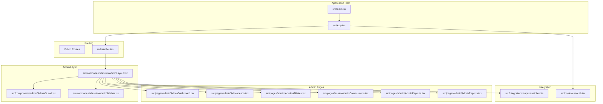
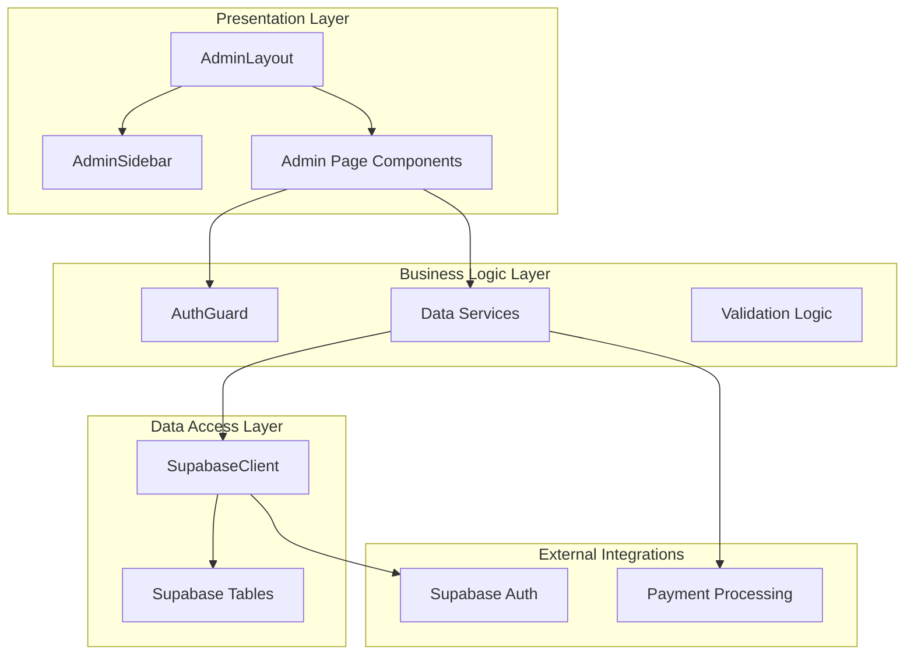
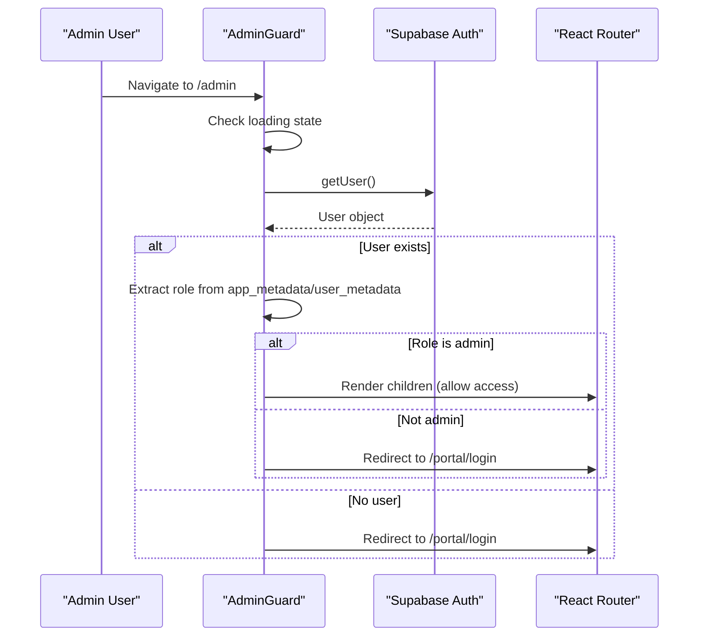
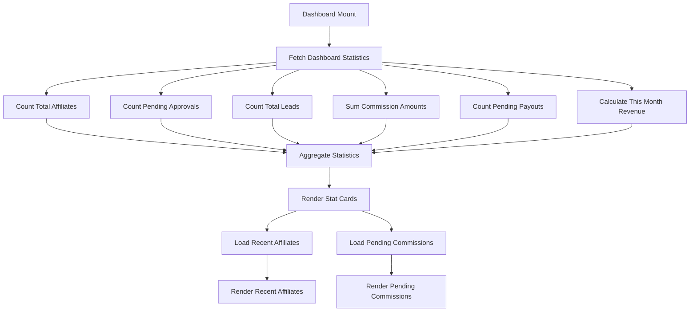
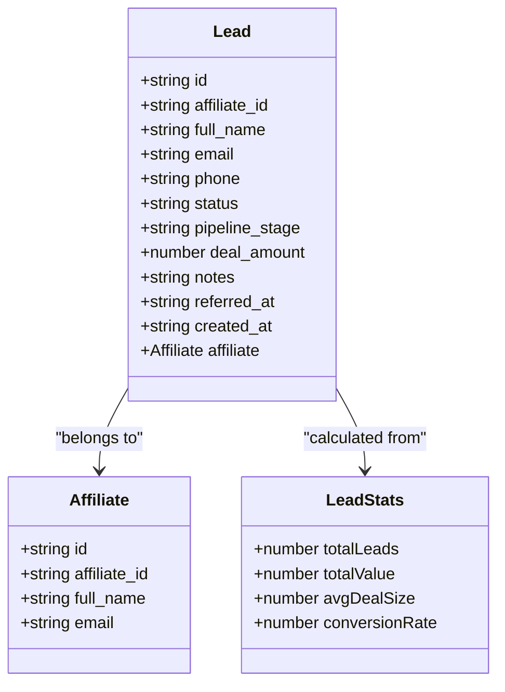
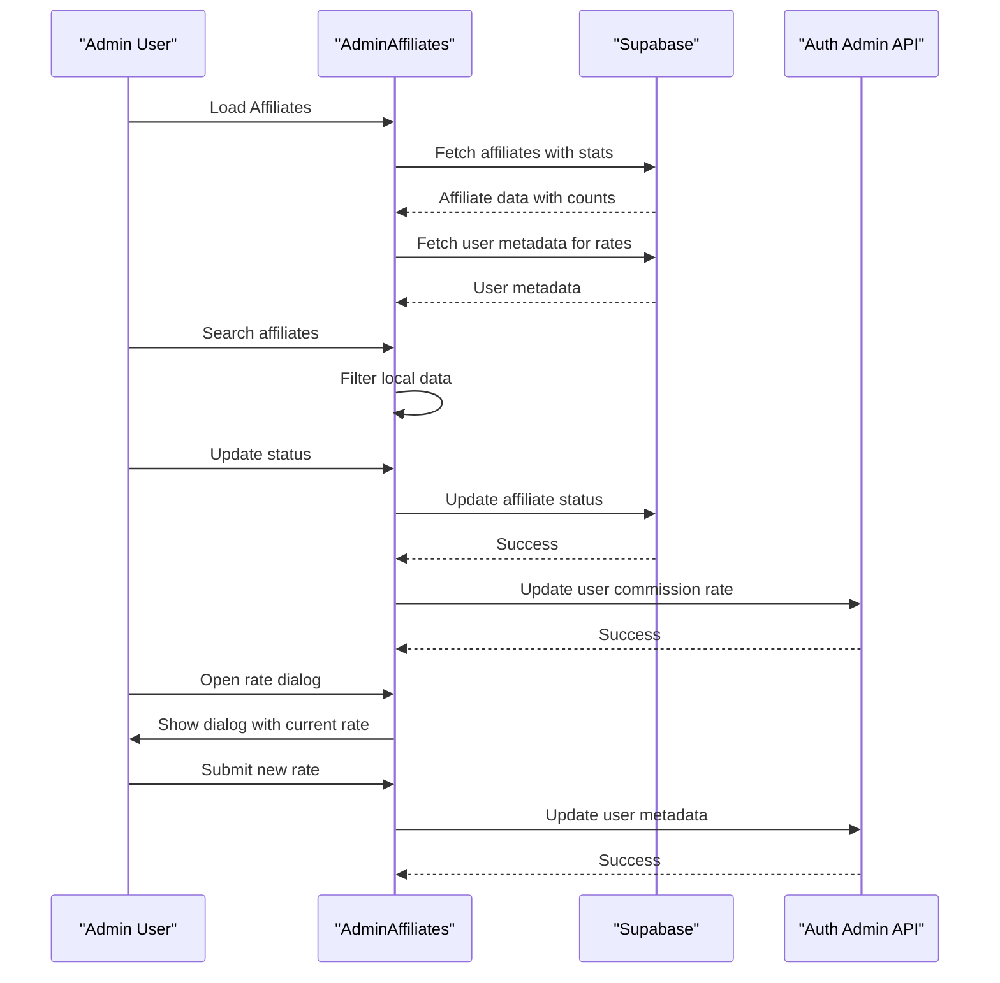
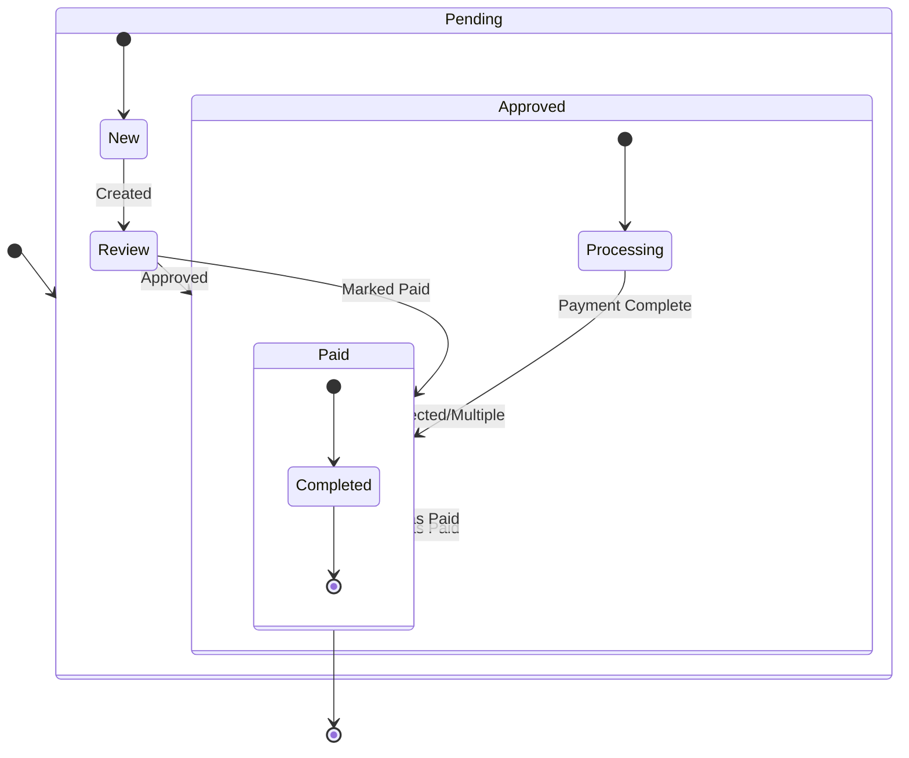
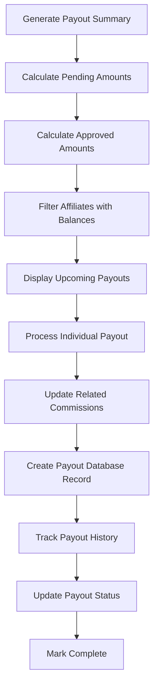
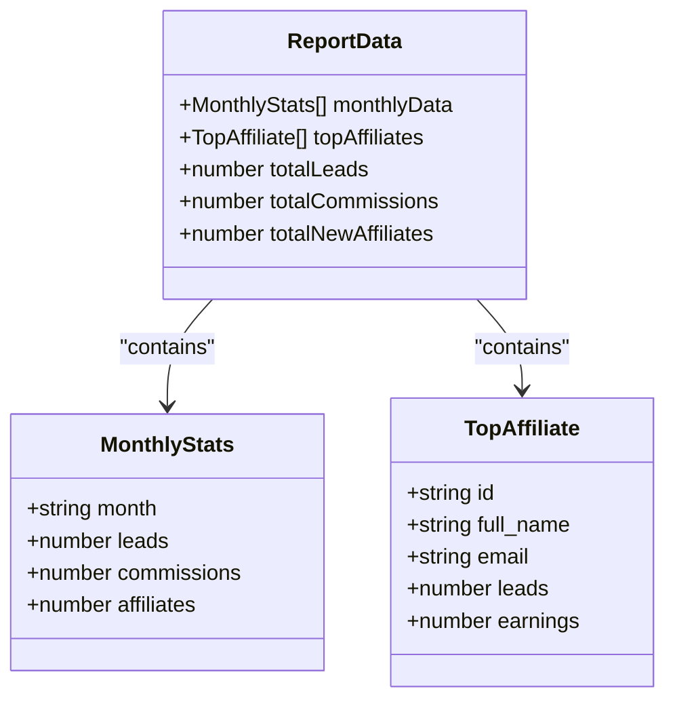

# Admin Portal System

<cite>
**Referenced Files in This Document**
- [README.md](file://README.md)
- [package.json](file://package.json)
- [src/main.tsx](file://src/main.tsx)
- [src/App.tsx](file://src/App.tsx)
- [src/integrations/supabase/client.ts](file://src/integrations/supabase/client.ts)
- [src/hooks/useAuth.tsx](file://src/hooks/useAuth.tsx)
- [src/components/admin/AdminLayout.tsx](file://src/components/admin/AdminLayout.tsx)
- [src/components/admin/AdminGuard.tsx](file://src/components/admin/AdminGuard.tsx)
- [src/components/admin/AdminSidebar.tsx](file://src/components/admin/AdminSidebar.tsx)
- [src/pages/admin/AdminDashboard.tsx](file://src/pages/admin/AdminDashboard.tsx)
- [src/pages/admin/AdminLeads.tsx](file://src/pages/admin/AdminLeads.tsx)
- [src/pages/admin/AdminAffiliates.tsx](file://src/pages/admin/AdminAffiliates.tsx)
- [src/pages/admin/AdminCommissions.tsx](file://src/pages/admin/AdminCommissions.tsx)
- [src/pages/admin/AdminPayouts.tsx](file://src/pages/admin/AdminPayouts.tsx)
- [src/pages/admin/AdminReports.tsx](file://src/pages/admin/AdminReports.tsx)
</cite>

## Table of Contents
1. [Introduction](#introduction)
2. [Project Structure](#project-structure)
3. [Core Components](#core-components)
4. [Architecture Overview](#architecture-overview)
5. [Detailed Component Analysis](#detailed-component-analysis)
6. [Dependency Analysis](#dependency-analysis)
7. [Performance Considerations](#performance-considerations)
8. [Troubleshooting Guide](#troubleshooting-guide)
9. [Conclusion](#conclusion)

## Introduction
This document provides comprehensive documentation for the Admin Portal System, a React-based administrative interface for managing an affiliate marketing program. The system integrates with Supabase for authentication, real-time database operations, and user management. It offers dashboard analytics, affiliate management, lead tracking, commission processing, payout management, and reporting capabilities.

The Admin Portal is structured as a nested routing system under `/admin`, protected by role-based authentication ensuring only administrators can access sensitive controls. The frontend leverages modern React patterns including Suspense for route-level code splitting, React Query for data caching, and a comprehensive UI toolkit for responsive layouts.

## Project Structure
The Admin Portal resides within a larger React application and follows a feature-based organization:
- Root routing defines both public and admin routes
- Admin routes are grouped under `/admin` with dedicated layout and guards
- Supabase integration provides authentication and data persistence
- UI components use a consistent design system with shadcn/ui primitives

**Diagram sources**
- [src/main.tsx:1-7](file://src/main.tsx#L1-L7)
- [src/App.tsx:52-131](file://src/App.tsx#L52-L131)
- [src/components/admin/AdminLayout.tsx:10-50](file://src/components/admin/AdminLayout.tsx#L10-L50)
- [src/components/admin/AdminGuard.tsx:10-63](file://src/components/admin/AdminGuard.tsx#L10-L63)
- [src/components/admin/AdminSidebar.tsx:32-73](file://src/components/admin/AdminSidebar.tsx#L32-L73)
- [src/pages/admin/AdminDashboard.tsx:23-194](file://src/pages/admin/AdminDashboard.tsx#L23-L194)
- [src/pages/admin/AdminLeads.tsx:54-351](file://src/pages/admin/AdminLeads.tsx#L54-L351)
- [src/pages/admin/AdminAffiliates.tsx:52-385](file://src/pages/admin/AdminAffiliates.tsx#L52-L385)
- [src/pages/admin/AdminCommissions.tsx:53-423](file://src/pages/admin/AdminCommissions.tsx#L53-L423)
- [src/pages/admin/AdminPayouts.tsx:62-438](file://src/pages/admin/AdminPayouts.tsx#L62-L438)
- [src/pages/admin/AdminReports.tsx:30-263](file://src/pages/admin/AdminReports.tsx#L30-L263)
- [src/integrations/supabase/client.ts:11-17](file://src/integrations/supabase/client.ts#L11-L17)
- [src/hooks/useAuth.tsx:32-187](file://src/hooks/useAuth.tsx#L32-L187)

**Section sources**
- [src/App.tsx:52-131](file://src/App.tsx#L52-L131)
- [src/components/admin/AdminLayout.tsx:10-50](file://src/components/admin/AdminLayout.tsx#L10-L50)
- [src/integrations/supabase/client.ts:11-17](file://src/integrations/supabase/client.ts#L11-L17)

## Core Components
The Admin Portal consists of several interconnected components that work together to provide a comprehensive administrative interface:

### Authentication and Authorization
The system uses Supabase for authentication with role-based access control. The AdminGuard component enforces admin-only access, while the AuthProvider manages user sessions and affiliate data retrieval.

### Layout and Navigation
The AdminLayout provides a responsive sidebar navigation with collapsible sections, top bar with notifications, and content area for page rendering. The AdminSidebar displays menu items with active state tracking.

### Data Management Pages
- Dashboard: Real-time statistics and recent activity monitoring
- Leads: Comprehensive lead tracking with filtering and search capabilities
- Affiliates: Affiliate lifecycle management with status updates
- Commissions: Commission approval and payment processing
- Payouts: Automated payout generation and payment tracking
- Reports: Performance analytics and export capabilities

**Section sources**
- [src/components/admin/AdminGuard.tsx:10-63](file://src/components/admin/AdminGuard.tsx#L10-L63)
- [src/components/admin/AdminLayout.tsx:10-50](file://src/components/admin/AdminLayout.tsx#L10-L50)
- [src/components/admin/AdminSidebar.tsx:32-73](file://src/components/admin/AdminSidebar.tsx#L32-L73)
- [src/pages/admin/AdminDashboard.tsx:23-194](file://src/pages/admin/AdminDashboard.tsx#L23-L194)
- [src/pages/admin/AdminLeads.tsx:54-351](file://src/pages/admin/AdminLeads.tsx#L54-L351)
- [src/pages/admin/AdminAffiliates.tsx:52-385](file://src/pages/admin/AdminAffiliates.tsx#L52-L385)
- [src/pages/admin/AdminCommissions.tsx:53-423](file://src/pages/admin/AdminCommissions.tsx#L53-L423)
- [src/pages/admin/AdminPayouts.tsx:62-438](file://src/pages/admin/AdminPayouts.tsx#L62-L438)
- [src/pages/admin/AdminReports.tsx:30-263](file://src/pages/admin/AdminReports.tsx#L30-L263)

## Architecture Overview
The Admin Portal follows a layered architecture with clear separation of concerns:

**Diagram sources**
- [src/components/admin/AdminLayout.tsx:10-50](file://src/components/admin/AdminLayout.tsx#L10-L50)
- [src/components/admin/AdminGuard.tsx:10-63](file://src/components/admin/AdminGuard.tsx#L10-L63)
- [src/integrations/supabase/client.ts:11-17](file://src/integrations/supabase/client.ts#L11-L17)

The architecture emphasizes:
- Role-based access control with immediate user verification
- Real-time data synchronization through Supabase
- Responsive UI components with consistent design patterns
- Modular page components for maintainability

## Detailed Component Analysis

### AdminGuard Component
The AdminGuard serves as the primary security mechanism for the Admin Portal, implementing role-based access control:

**Diagram sources**
- [src/components/admin/AdminGuard.tsx:14-45](file://src/components/admin/AdminGuard.tsx#L14-L45)

Key security features:
- Immediate user verification on route access
- Support for both `app_metadata` and `user_metadata` role storage
- Localhost bypass for development testing
- Loading state management during authentication checks

**Section sources**
- [src/components/admin/AdminGuard.tsx:10-63](file://src/components/admin/AdminGuard.tsx#L10-L63)

### Dashboard Analytics
The Admin Dashboard aggregates key performance indicators from multiple data sources:

**Diagram sources**
- [src/pages/admin/AdminDashboard.tsx:27-85](file://src/pages/admin/AdminDashboard.tsx#L27-L85)
- [src/pages/admin/AdminDashboard.tsx:207-219](file://src/pages/admin/AdminDashboard.tsx#L207-L219)
- [src/pages/admin/AdminDashboard.tsx:263-276](file://src/pages/admin/AdminDashboard.tsx#L263-L276)

The dashboard implements:
- Concurrent data fetching for optimal performance
- Currency formatting for financial metrics
- Trend indicators with directional arrows
- Skeleton loading states for improved UX

**Section sources**
- [src/pages/admin/AdminDashboard.tsx:23-194](file://src/pages/admin/AdminDashboard.tsx#L23-L194)

### Lead Management System
The AdminLeads page provides comprehensive lead tracking with advanced filtering capabilities:

**Diagram sources**
- [src/pages/admin/AdminLeads.tsx:34-52](file://src/pages/admin/AdminLeads.tsx#L34-L52)
- [src/pages/admin/AdminLeads.tsx:59-64](file://src/pages/admin/AdminLeads.tsx#L59-L64)

Advanced features include:
- Multi-field search across lead, affiliate, and contact information
- Status-based filtering with visual badges
- Real-time statistics calculation
- Pipeline stage visualization
- Contact action buttons for direct communication

**Section sources**
- [src/pages/admin/AdminLeads.tsx:54-351](file://src/pages/admin/AdminLeads.tsx#L54-L351)

### Affiliate Management
The AdminAffiliates component handles the complete affiliate lifecycle:

**Diagram sources**
- [src/pages/admin/AdminAffiliates.tsx:63-121](file://src/pages/admin/AdminAffiliates.tsx#L63-L121)
- [src/pages/admin/AdminAffiliates.tsx:123-141](file://src/pages/admin/AdminAffiliates.tsx#L123-L141)
- [src/pages/admin/AdminAffiliates.tsx:143-163](file://src/pages/admin/AdminAffiliates.tsx#L143-L163)

Key functionality:
- Real-time status updates with visual indicators
- Commission rate management through user metadata
- Integrated search and filtering
- Bulk action capabilities
- Detailed affiliate information display

**Section sources**
- [src/pages/admin/AdminAffiliates.tsx:52-385](file://src/pages/admin/AdminAffiliates.tsx#L52-L385)

### Commission Processing
The AdminCommissions page manages the financial workflow from lead conversion to payment:

**Diagram sources**
- [src/pages/admin/AdminCommissions.tsx:150-174](file://src/pages/admin/AdminCommissions.tsx#L150-L174)

The commission system supports:
- Bulk selection and batch processing
- Status tracking with visual indicators
- Automatic payout date recording
- Integration with affiliate payment workflows
- Detailed audit trail through created_at timestamps

**Section sources**
- [src/pages/admin/AdminCommissions.tsx:53-423](file://src/pages/admin/AdminCommissions.tsx#L53-L423)

### Payout Management
The AdminPayouts component automates the payout generation and tracking process:

**Diagram sources**
- [src/pages/admin/AdminPayouts.tsx:128-173](file://src/pages/admin/AdminPayouts.tsx#L128-L173)
- [src/pages/admin/AdminPayouts.tsx:175-202](file://src/pages/admin/AdminPayouts.tsx#L175-L202)

Automated features:
- Automatic calculation of pending and approved commission amounts
- Batch payout creation for multiple affiliates
- Integration with commission status updates
- Comprehensive payout history tracking
- Status-based action controls (process, mark paid, failed)

**Section sources**
- [src/pages/admin/AdminPayouts.tsx:62-438](file://src/pages/admin/AdminPayouts.tsx#L62-L438)

### Reporting and Analytics
The AdminReports page provides comprehensive performance insights:

**Diagram sources**
- [src/pages/admin/AdminReports.tsx:23-28](file://src/pages/admin/AdminReports.tsx#L23-L28)
- [src/pages/admin/AdminReports.tsx:52-82](file://src/pages/admin/AdminReports.tsx#L52-L82)

Reporting capabilities:
- Configurable time range analysis (3, 6, 12 months)
- Monthly performance breakdown with visual indicators
- Top-performing affiliate ranking
- Export functionality for external reporting
- Summary statistics with trend analysis

**Section sources**
- [src/pages/admin/AdminReports.tsx:30-263](file://src/pages/admin/AdminReports.tsx#L30-L263)

## Dependency Analysis
The Admin Portal relies on several key dependencies for functionality and performance:

```mermaid
graph TB
subgraph "Core Dependencies"
React["react@^18.3.1"]
Router["react-router-dom@^6.30.1"]
Query["@tanstack/react-query@^5.83.0"]
end
subgraph "UI Framework"
Shadcn["shadcn/ui components"]
Tailwind["tailwindcss"]
Lucide["lucide-react icons"]
end
subgraph "Database & Auth"
Supabase["@supabase/supabase-js@^2.95.3"]
Auth0["Supabase Auth"]
end
subgraph "Utilities"
DateFns["date-fns@^3.6.0"]
Zod["zod@^3.25.76"]
Framer["framer-motion@^12.34.0"]
end
subgraph "Build Tools"
Vite["vite@^5.4.19"]
SWC["@vitejs/plugin-react-swc"]
end
AdminPortal --> React
AdminPortal --> Router
AdminPortal --> Query
AdminPortal --> Shadcn
AdminPortal --> Tailwind
AdminPortal --> Supabase
AdminPortal --> DateFns
AdminPortal --> Vite
```

**Diagram sources**
- [package.json:15-70](file://package.json#L15-L70)

Key dependency relationships:
- React Query provides caching and state management for all data operations
- Supabase handles real-time database connections and authentication
- shadcn/ui components ensure consistent, accessible UI patterns
- Tailwind CSS enables rapid responsive design implementation
- Vite provides fast development builds and hot module replacement

**Section sources**
- [package.json:15-70](file://package.json#L15-L70)

## Performance Considerations
The Admin Portal implements several performance optimization strategies:

### Data Fetching and Caching
- React Query configured with 5-minute stale time and 10-minute garbage collection
- Concurrent data fetching for dashboard components
- Optimistic updates for immediate UI feedback
- Automatic background refetching on focus

### Rendering Optimizations
- Route-level code splitting with Suspense boundaries
- Component-level memoization for expensive calculations
- Virtualized lists for large datasets
- Skeleton loading states for improved perceived performance

### Network Efficiency
- Efficient database queries with selective field retrieval
- Batch operations for bulk updates
- Debounced search functionality to reduce API calls
- Local state management for frequently accessed data

## Troubleshooting Guide
Common issues and their solutions:

### Authentication Problems
- **Issue**: AdminGuard redirects to login despite valid credentials
- **Solution**: Verify user role in Supabase user_metadata/app_metadata
- **Debug**: Check browser localStorage for auth tokens and Supabase session restoration

### Data Loading Issues
- **Issue**: Dashboard shows empty statistics
- **Solution**: Verify database connectivity and table permissions
- **Debug**: Check network tab for failed API requests and console errors

### Performance Issues
- **Issue**: Slow page loads with large datasets
- **Solution**: Implement pagination or virtualization for tables
- **Debug**: Monitor React Query cache and network request timing

### UI Responsiveness
- **Issue**: Components not responding to user interactions
- **Solution**: Verify proper event handler binding and state updates
- **Debug**: Check for unhandled exceptions in component lifecycle

**Section sources**
- [src/components/admin/AdminGuard.tsx:47-62](file://src/components/admin/AdminGuard.tsx#L47-L62)
- [src/pages/admin/AdminDashboard.tsx:77-81](file://src/pages/admin/AdminDashboard.tsx#L77-L81)

## Conclusion
The Admin Portal System provides a robust, scalable solution for managing affiliate marketing programs. Its architecture emphasizes security through role-based access control, performance through efficient data management, and maintainability through modular component design. The integration with Supabase ensures real-time data synchronization and reliable authentication, while the React-based frontend delivers a responsive, accessible user experience.

Key strengths include comprehensive reporting capabilities, automated payout processing, and intuitive management interfaces for all aspects of affiliate program administration. The system's modular design allows for easy extension and customization to meet evolving business requirements.