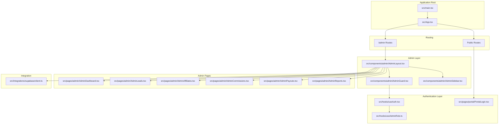
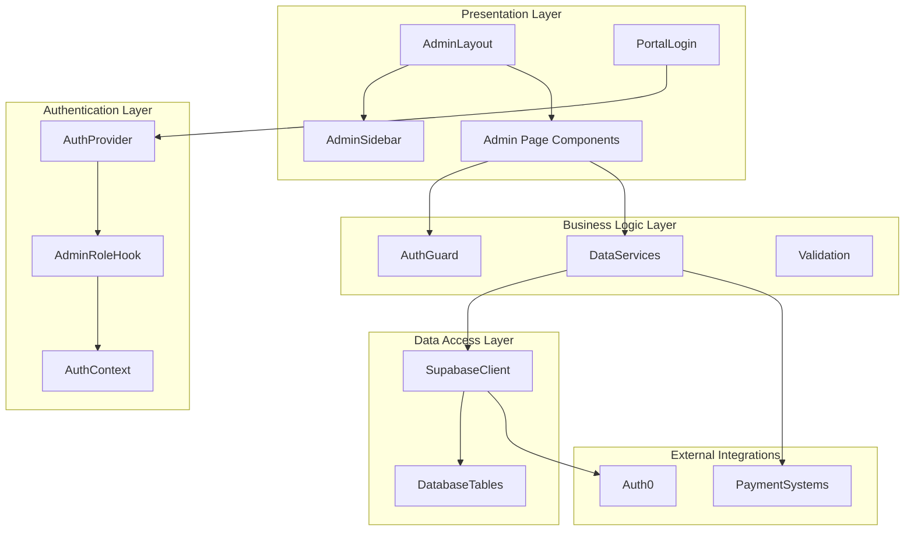
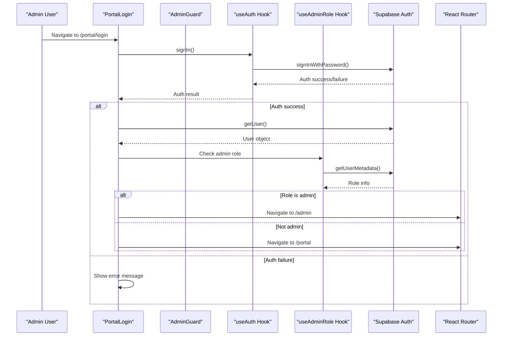
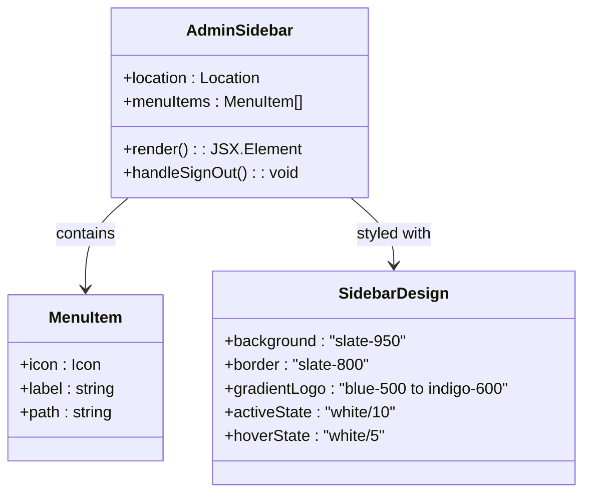
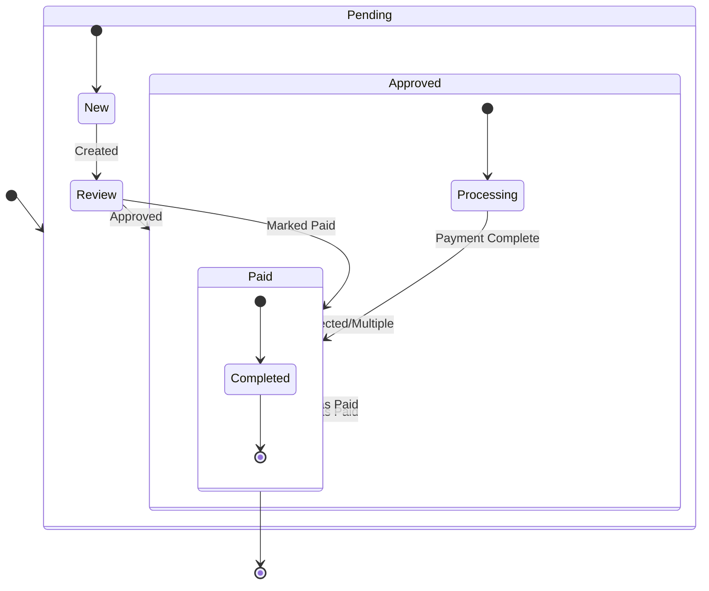
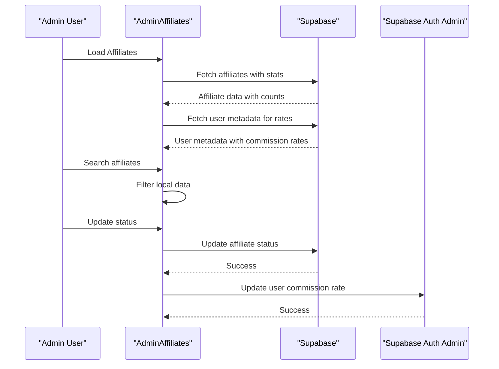
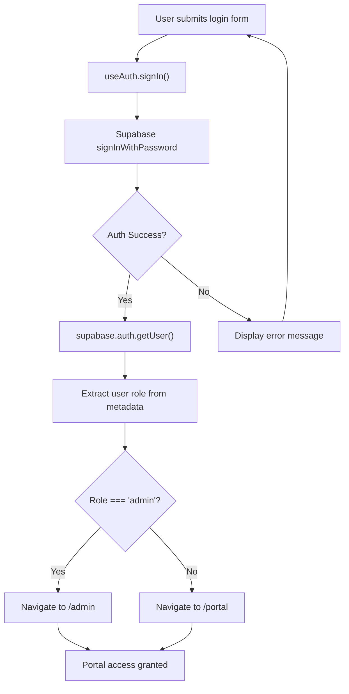

# Admin Portal System

<cite>
**Referenced Files in This Document**
- [README.md](file://README.md)
- [package.json](file://package.json)
- [src/main.tsx](file://src/main.tsx)
- [src/App.tsx](file://src/App.tsx)
- [src/integrations/supabase/client.ts](file://src/integrations/supabase/client.ts)
- [src/hooks/useAuth.tsx](file://src/hooks/useAuth.tsx)
- [src/hooks/useAdminRole.ts](file://src/hooks/useAdminRole.ts)
- [src/components/admin/AdminLayout.tsx](file://src/components/admin/AdminLayout.tsx)
- [src/components/admin/AdminGuard.tsx](file://src/components/admin/AdminGuard.tsx)
- [src/components/admin/AdminSidebar.tsx](file://src/components/admin/AdminSidebar.tsx)
- [src/pages/admin/AdminDashboard.tsx](file://src/pages/admin/AdminDashboard.tsx)
- [src/pages/admin/AdminLeads.tsx](file://src/pages/admin/AdminLeads.tsx)
- [src/pages/admin/AdminAffiliates.tsx](file://src/pages/admin/AdminAffiliates.tsx)
- [src/pages/admin/AdminCommissions.tsx](file://src/pages/admin/AdminCommissions.tsx)
- [src/pages/admin/AdminPayouts.tsx](file://src/pages/admin/AdminPayouts.tsx)
- [src/pages/admin/AdminReports.tsx](file://src/pages/admin/AdminReports.tsx)
- [src/pages/portal/PortalLogin.tsx](file://src/pages/portal/PortalLogin.tsx)
</cite>

## Update Summary
**Changes Made**
- Updated AdminGuard component to use modern hooks pattern with separate useAuth and useAdminRole hooks
- Enhanced AdminSidebar with new modern design featuring gradient branding and improved styling
- Improved commission management with better TypeScript type safety and enhanced status handling
- Added new portal login system with role-based redirection functionality
- Updated architecture to reflect new hook-based authentication system

## Table of Contents
1. [Introduction](#introduction)
2. [Project Structure](#project-structure)
3. [Core Components](#core-components)
4. [Architecture Overview](#architecture-overview)
5. [Detailed Component Analysis](#detailed-component-analysis)
6. [Dependency Analysis](#dependency-analysis)
7. [Performance Considerations](#performance-considerations)
8. [Troubleshooting Guide](#troubleshooting-guide)
9. [Conclusion](#conclusion)

## Introduction
This document provides comprehensive documentation for the Admin Portal System, a React-based administrative interface for managing an affiliate marketing program. The system integrates with Supabase for authentication, real-time database operations, and user management. It offers dashboard analytics, affiliate management, lead tracking, commission processing, payout management, and reporting capabilities.

The Admin Portal is structured as a nested routing system under `/admin`, protected by role-based authentication ensuring only administrators can access sensitive controls. The frontend leverages modern React patterns including Suspense for route-level code splitting, React Query for data caching, and a comprehensive UI toolkit for responsive layouts.

**Updated** The system now features enhanced security with modern hooks-based authentication, improved user experience through redesigned sidebar navigation, and better type safety throughout the commission management system.

## Project Structure
The Admin Portal resides within a larger React application and follows a feature-based organization:
- Root routing defines both public and admin routes
- Admin routes are grouped under `/admin` with dedicated layout and guards
- Supabase integration provides authentication and data persistence
- UI components use a consistent design system with shadcn/ui primitives
- Modern hooks pattern separates authentication and authorization logic

**Diagram sources**
- [src/main.tsx:1-7](file://src/main.tsx#L1-L7)
- [src/App.tsx:52-131](file://src/App.tsx#L52-L131)
- [src/hooks/useAuth.tsx:32-187](file://src/hooks/useAuth.tsx#L32-L187)
- [src/hooks/useAdminRole.ts](file://src/hooks/useAdminRole.ts)
- [src/pages/portal/PortalLogin.tsx:14-43](file://src/pages/portal/PortalLogin.tsx#L14-L43)
- [src/components/admin/AdminLayout.tsx:9-40](file://src/components/admin/AdminLayout.tsx#L9-L40)
- [src/components/admin/AdminGuard.tsx:10-35](file://src/components/admin/AdminGuard.tsx#L10-L35)
- [src/components/admin/AdminSidebar.tsx:30-92](file://src/components/admin/AdminSidebar.tsx#L30-L92)
- [src/pages/admin/AdminDashboard.tsx:23-194](file://src/pages/admin/AdminDashboard.tsx#L23-L194)
- [src/pages/admin/AdminLeads.tsx:54-351](file://src/pages/admin/AdminLeads.tsx#L54-L351)
- [src/pages/admin/AdminAffiliates.tsx:52-385](file://src/pages/admin/AdminAffiliates.tsx#L52-L385)
- [src/pages/admin/AdminCommissions.tsx:53-423](file://src/pages/admin/AdminCommissions.tsx#L53-L423)
- [src/pages/admin/AdminPayouts.tsx:62-438](file://src/pages/admin/AdminPayouts.tsx#L62-L438)
- [src/pages/admin/AdminReports.tsx:30-263](file://src/pages/admin/AdminReports.tsx#L30-L263)
- [src/integrations/supabase/client.ts:11-17](file://src/integrations/supabase/client.ts#L11-L17)

**Section sources**
- [src/App.tsx:52-131](file://src/App.tsx#L52-L131)
- [src/components/admin/AdminLayout.tsx:9-40](file://src/components/admin/AdminLayout.tsx#L9-L40)
- [src/integrations/supabase/client.ts:11-17](file://src/integrations/supabase/client.ts#L11-L17)

## Core Components
The Admin Portal consists of several interconnected components that work together to provide a comprehensive administrative interface:

### Enhanced Authentication and Authorization
The system uses Supabase for authentication with role-based access control. The AdminGuard component now utilizes modern hooks pattern with separate useAuth and useAdminRole hooks for improved modularity and maintainability. The PortalLogin page provides role-based redirection after successful authentication.

### Modern Sidebar Navigation
The AdminSidebar features a completely redesigned navigation system with:
- Dark theme with slate-950 background and custom CSS variables
- Gradient branding with blue-to-indigo color scheme
- Collapsible sidebar with icon-only mode
- Active state tracking with data attributes
- Sign out functionality integrated into footer

### Enhanced Data Management Pages
- Dashboard: Real-time statistics with improved loading states and better error handling
- Leads: Comprehensive lead tracking with advanced filtering and search capabilities
- Affiliates: Affiliate lifecycle management with enhanced status updates and commission rate management
- Commissions: Commission approval and payment processing with improved TypeScript type safety
- Payouts: Automated payout generation with better status tracking
- Reports: Performance analytics with enhanced export capabilities

**Updated** The commission management system now includes better TypeScript interfaces, improved status handling, and enhanced bulk operation capabilities.

**Section sources**
- [src/components/admin/AdminGuard.tsx:10-35](file://src/components/admin/AdminGuard.tsx#L10-L35)
- [src/components/admin/AdminLayout.tsx:9-40](file://src/components/admin/AdminLayout.tsx#L9-L40)
- [src/components/admin/AdminSidebar.tsx:30-92](file://src/components/admin/AdminSidebar.tsx#L30-L92)
- [src/pages/admin/AdminDashboard.tsx:23-194](file://src/pages/admin/AdminDashboard.tsx#L23-L194)
- [src/pages/admin/AdminLeads.tsx:54-351](file://src/pages/admin/AdminLeads.tsx#L54-L351)
- [src/pages/admin/AdminAffiliates.tsx:52-385](file://src/pages/admin/AdminAffiliates.tsx#L52-L385)
- [src/pages/admin/AdminCommissions.tsx:34-53](file://src/pages/admin/AdminCommissions.tsx#L34-L53)
- [src/pages/admin/AdminPayouts.tsx:62-438](file://src/pages/admin/AdminPayouts.tsx#L62-L438)
- [src/pages/admin/AdminReports.tsx:30-263](file://src/pages/admin/AdminReports.tsx#L30-L263)
- [src/pages/portal/PortalLogin.tsx:24-43](file://src/pages/portal/PortalLogin.tsx#L24-L43)

## Architecture Overview
The Admin Portal follows a layered architecture with clear separation of concerns and modern hooks-based authentication:

**Diagram sources**
- [src/components/admin/AdminLayout.tsx:9-40](file://src/components/admin/AdminLayout.tsx#L9-L40)
- [src/components/admin/AdminGuard.tsx:10-35](file://src/components/admin/AdminGuard.tsx#L10-L35)
- [src/hooks/useAuth.tsx:32-187](file://src/hooks/useAuth.tsx#L32-L187)
- [src/hooks/useAdminRole.ts](file://src/hooks/useAdminRole.ts)
- [src/pages/portal/PortalLogin.tsx:24-43](file://src/pages/portal/PortalLogin.tsx#L24-L43)
- [src/integrations/supabase/client.ts:11-17](file://src/integrations/supabase/client.ts#L11-L17)

The architecture emphasizes:
- Modern hooks-based authentication with separate concerns
- Role-based access control with immediate user verification
- Real-time data synchronization through Supabase
- Responsive UI components with consistent design patterns
- Modular page components for maintainability
- Enhanced type safety throughout the application

## Detailed Component Analysis

### Enhanced AdminGuard Component
The AdminGuard serves as the primary security mechanism for the Admin Portal, now utilizing modern hooks for improved performance and maintainability:

**Diagram sources**
- [src/pages/portal/PortalLogin.tsx:24-43](file://src/pages/portal/PortalLogin.tsx#L24-L43)
- [src/components/admin/AdminGuard.tsx:10-35](file://src/components/admin/AdminGuard.tsx#L10-L35)
- [src/hooks/useAuth.tsx:150-153](file://src/hooks/useAuth.tsx#L150-L153)
- [src/hooks/useAdminRole.ts](file://src/hooks/useAdminRole.ts)

Key security features:
- Modern hooks-based authentication with useAuth and useAdminRole
- Concurrent loading states for authentication and role checking
- Improved error handling and user feedback
- Role-based redirection after successful login
- Loading spinner with permission checking message

**Section sources**
- [src/components/admin/AdminGuard.tsx:10-35](file://src/components/admin/AdminGuard.tsx#L10-L35)
- [src/pages/portal/PortalLogin.tsx:24-43](file://src/pages/portal/PortalLogin.tsx#L24-L43)

### Modern AdminSidebar Component
The AdminSidebar features a completely redesigned navigation system with enhanced styling and functionality:

**Diagram sources**
- [src/components/admin/AdminSidebar.tsx:21-28](file://src/components/admin/AdminSidebar.tsx#L21-L28)
- [src/components/admin/AdminSidebar.tsx:35-92](file://src/components/admin/AdminSidebar.tsx#L35-L92)

Key design features:
- Dark theme with slate-950 background and custom CSS variables
- Gradient logo with blue-to-indigo color scheme
- Collapsible sidebar with icon-only mode
- Active state tracking with data attributes
- Enhanced hover effects and transitions
- Sign out button integrated into footer section

**Section sources**
- [src/components/admin/AdminSidebar.tsx:30-92](file://src/components/admin/AdminSidebar.tsx#L30-L92)

### Enhanced Commission Management
The AdminCommissions page now includes improved TypeScript type safety and enhanced functionality:

**Diagram sources**
- [src/pages/admin/AdminCommissions.tsx:34-53](file://src/pages/admin/AdminCommissions.tsx#L34-L53)
- [src/pages/admin/AdminCommissions.tsx:152-176](file://src/pages/admin/AdminCommissions.tsx#L152-L176)

Enhanced features include:
- Strongly typed Commission interface with enum status values
- Improved data transformation with better TypeScript support
- Enhanced bulk selection and batch processing capabilities
- Better error handling and user feedback
- Improved status badge rendering with consistent styling

**Section sources**
- [src/pages/admin/AdminCommissions.tsx:34-53](file://src/pages/admin/AdminCommissions.tsx#L34-L53)
- [src/pages/admin/AdminCommissions.tsx:152-176](file://src/pages/admin/AdminCommissions.tsx#L152-L176)

### Enhanced Affiliate Management
The AdminAffiliates component now includes improved commission rate management and better user metadata handling:

**Diagram sources**
- [src/pages/admin/AdminAffiliates.tsx:101-110](file://src/pages/admin/AdminAffiliates.tsx#L101-L110)
- [src/pages/admin/AdminAffiliates.tsx:143-163](file://src/pages/admin/AdminAffiliates.tsx#L143-L163)

Enhanced features include:
- Direct user metadata manipulation for commission rates
- Improved affiliate statistics aggregation
- Better error handling for user metadata operations
- Enhanced search functionality across multiple fields

**Section sources**
- [src/pages/admin/AdminAffiliates.tsx:101-110](file://src/pages/admin/AdminAffiliates.tsx#L101-L110)
- [src/pages/admin/AdminAffiliates.tsx:143-163](file://src/pages/admin/AdminAffiliates.tsx#L143-L163)

### Portal Login with Role-Based Redirection
The new PortalLogin component provides enhanced authentication with automatic role-based redirection:

**Diagram sources**
- [src/pages/portal/PortalLogin.tsx:24-43](file://src/pages/portal/PortalLogin.tsx#L24-L43)

Key features:
- Role-based redirection after successful authentication
- Enhanced error handling and user feedback
- Password reset functionality integration
- Improved loading states and user experience

**Section sources**
- [src/pages/portal/PortalLogin.tsx:24-43](file://src/pages/portal/PortalLogin.tsx#L24-L43)

## Dependency Analysis
The Admin Portal relies on several key dependencies for functionality and performance:

```mermaid
graph TB
subgraph "Core Dependencies"
React["react@^18.3.1"]
Router["react-router-dom@^6.30.1"]
Query["@tanstack/react-query@^5.83.0"]
Hooks["Custom Hooks Pattern"]
end
subgraph "UI Framework"
Shadcn["shadcn/ui components"]
Tailwind["tailwindcss"]
Lucide["lucide-react icons"]
end
subgraph "Database & Auth"
Supabase["@supabase/supabase-js@^2.95.3"]
Auth0["Supabase Auth"]
end
subgraph "Utilities"
DateFns["date-fns@^3.6.0"]
Zod["zod@^3.25.76"]
Framer["framer-motion@^12.34.0"]
Sonner["sonner@^1.7.4"]
end
subgraph "Build Tools"
Vite["vite@^5.4.19"]
SWC["@vitejs/plugin-react-swc"]
end
AdminPortal --> React
AdminPortal --> Router
AdminPortal --> Query
AdminPortal --> Hooks
AdminPortal --> Shadcn
AdminPortal --> Tailwind
AdminPortal --> Supabase
AdminPortal --> DateFns
AdminPortal --> Vite
AdminPortal --> Sonner
```

**Diagram sources**
- [package.json:15-70](file://package.json#L15-L70)

Key dependency relationships:
- React Query provides caching and state management for all data operations
- Custom hooks pattern separates authentication and authorization concerns
- Supabase handles real-time database connections and authentication
- shadcn/ui components ensure consistent, accessible UI patterns
- Tailwind CSS enables rapid responsive design implementation
- Enhanced toast notifications with Sonner library
- Vite provides fast development builds and hot module replacement

**Section sources**
- [package.json:15-70](file://package.json#L15-L70)

## Performance Considerations
The Admin Portal implements several performance optimization strategies with enhanced modern hooks pattern:

### Enhanced Data Fetching and Caching
- React Query configured with 5-minute stale time and 10-minute garbage collection
- Concurrent data fetching for dashboard components with improved loading states
- Optimistic updates for immediate UI feedback
- Automatic background refetching on focus
- Separate hooks for authentication and role checking enable concurrent loading

### Advanced Rendering Optimizations
- Route-level code splitting with Suspense boundaries
- Component-level memoization for expensive calculations
- Virtualized lists for large datasets
- Skeleton loading states for improved perceived performance
- Modern hooks pattern reduces unnecessary re-renders

### Enhanced Network Efficiency
- Efficient database queries with selective field retrieval
- Batch operations for bulk updates with better error handling
- Debounced search functionality to reduce API calls
- Local state management for frequently accessed data
- Improved authentication flow with concurrent loading states

## Troubleshooting Guide
Common issues and their solutions with enhanced debugging capabilities:

### Authentication Problems
- **Issue**: AdminGuard redirects to login despite valid credentials
- **Solution**: Verify user role in Supabase user_metadata/app_metadata
- **Debug**: Check browser localStorage for auth tokens and Supabase session restoration
- **New**: Monitor useAdminRole hook loading states for better debugging

### Enhanced Data Loading Issues
- **Issue**: Dashboard shows empty statistics
- **Solution**: Verify database connectivity and table permissions
- **Debug**: Check network tab for failed API requests and console errors
- **New**: Monitor individual hook loading states for better troubleshooting

### Performance Issues
- **Issue**: Slow page loads with large datasets
- **Solution**: Implement pagination or virtualization for tables
- **Debug**: Monitor React Query cache and network request timing
- **New**: Check concurrent loading states from multiple hooks

### UI Responsiveness
- **Issue**: Components not responding to user interactions
- **Solution**: Verify proper event handler binding and state updates
- **Debug**: Check for unhandled exceptions in component lifecycle
- **New**: Monitor loading states from useAuth and useAdminRole hooks

**Section sources**
- [src/components/admin/AdminGuard.tsx:15-24](file://src/components/admin/AdminGuard.tsx#L15-L24)
- [src/pages/admin/AdminDashboard.tsx:77-81](file://src/pages/admin/AdminDashboard.tsx#L77-L81)

## Conclusion
The Admin Portal System provides a robust, scalable solution for managing affiliate marketing programs with significant enhancements. The new modern hooks-based architecture improves maintainability and performance, while the enhanced sidebar design provides a better user experience. The improved commission management system offers better type safety and functionality, and the new portal login system provides seamless role-based redirection.

Key strengths include comprehensive reporting capabilities, automated payout processing, intuitive management interfaces, and enhanced security through modern authentication patterns. The system's modular design with separate authentication and authorization hooks allows for easy extension and customization to meet evolving business requirements.

The recent updates demonstrate a commitment to modern React development practices, improved developer experience, and enhanced user experience through thoughtful design improvements.