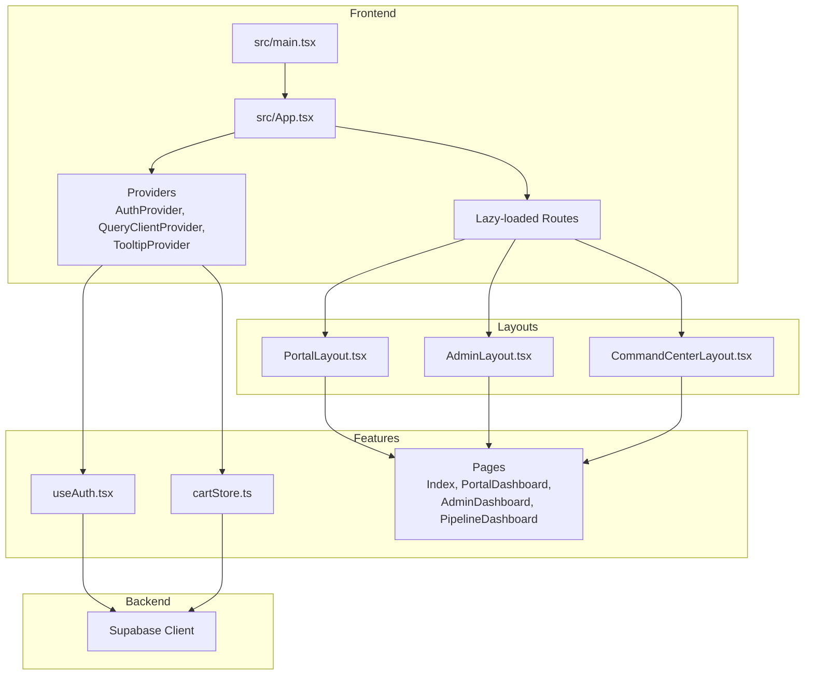
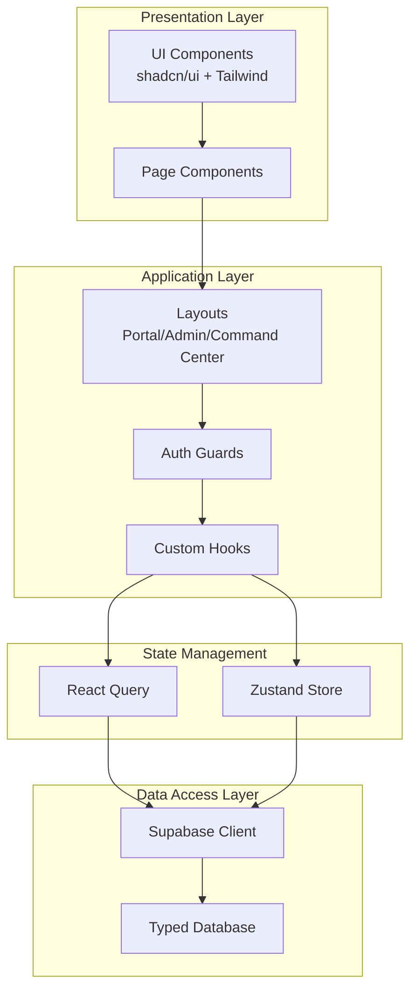
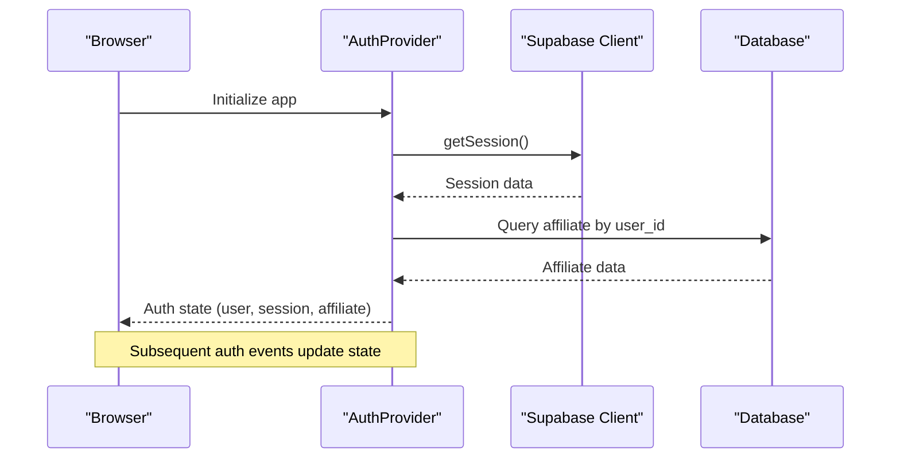
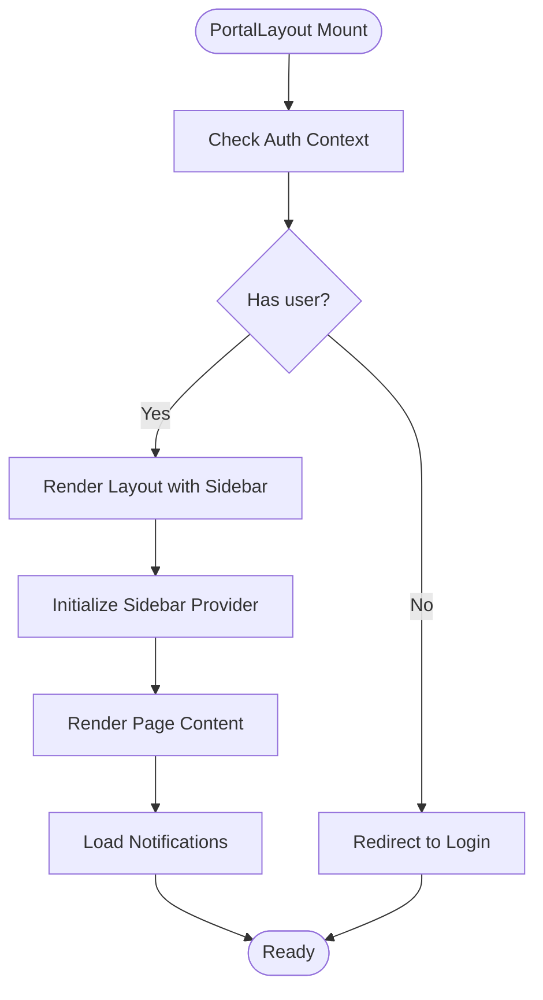
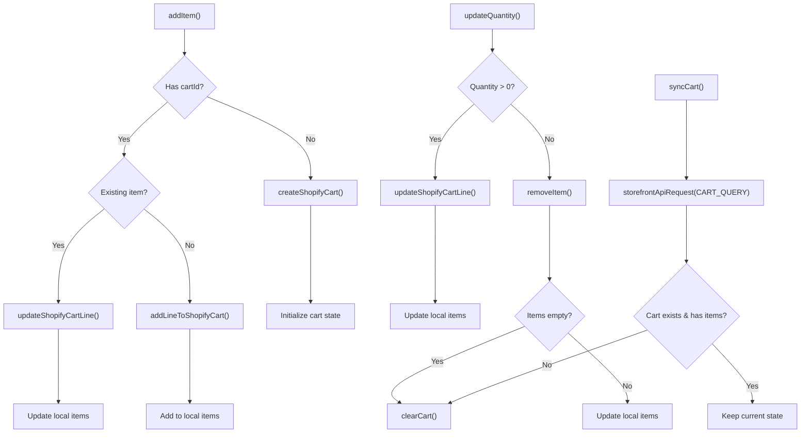
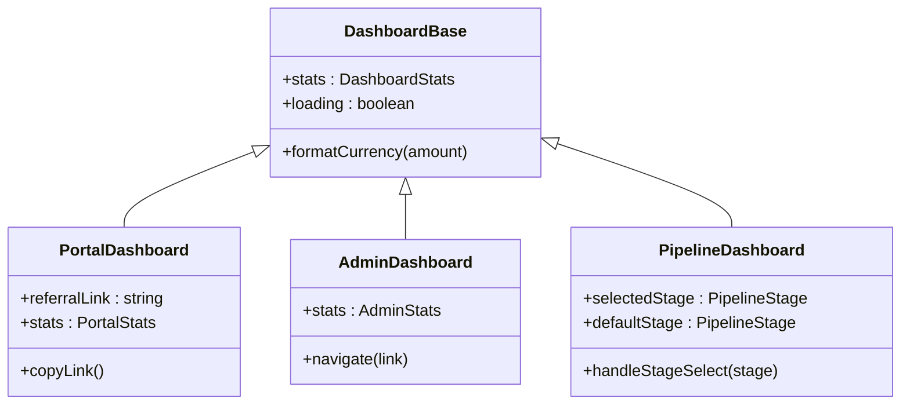
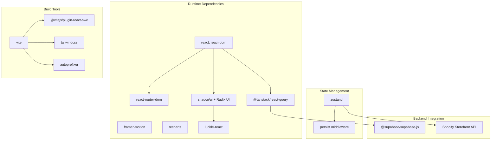

# Application Management System

<cite>
**Referenced Files in This Document**
- [README.md](file://README.md)
- [package.json](file://package.json)
- [vite.config.ts](file://vite.config.ts)
- [src/main.tsx](file://src/main.tsx)
- [src/App.tsx](file://src/App.tsx)
- [src/components/portal/PortalLayout.tsx](file://src/components/portal/PortalLayout.tsx)
- [src/components/admin/AdminLayout.tsx](file://src/components/admin/AdminLayout.tsx)
- [src/components/command-center/CommandCenterLayout.tsx](file://src/components/command-center/CommandCenterLayout.tsx)
- [src/hooks/useAuth.tsx](file://src/hooks/useAuth.tsx)
- [src/stores/cartStore.ts](file://src/stores/cartStore.ts)
- [src/pages/Index.tsx](file://src/pages/Index.tsx)
- [src/pages/portal/PortalDashboard.tsx](file://src/pages/portal/PortalDashboard.tsx)
- [src/pages/admin/AdminDashboard.tsx](file://src/pages/admin/AdminDashboard.tsx)
- [src/pages/command-center/PipelineDashboard.tsx](file://src/pages/command-center/PipelineDashboard.tsx)
- [src/integrations/supabase/client.ts](file://src/integrations/supabase/client.ts)
</cite>

## Table of Contents
1. [Introduction](#introduction)
2. [Project Structure](#project-structure)
3. [Core Components](#core-components)
4. [Architecture Overview](#architecture-overview)
5. [Detailed Component Analysis](#detailed-component-analysis)
6. [Dependency Analysis](#dependency-analysis)
7. [Performance Considerations](#performance-considerations)
8. [Troubleshooting Guide](#troubleshooting-guide)
9. [Conclusion](#conclusion)

## Introduction
This document describes the Application Management System for Ryland Partners, a comprehensive platform combining business credit education, funding solutions, and affiliate/partner management. The system integrates frontend React components with backend Supabase services, supporting three primary user contexts: public visitors, affiliate partners, administrators, and command center operators. It emphasizes responsive design, real-time data synchronization, and scalable commerce capabilities through Shopify integration.

## Project Structure
The project follows a feature-based React architecture with clear separation of concerns:
- Frontend entry point initializes routing, global providers, and lazy-loaded routes
- Three distinct layout systems for portal (affiliates), admin, and command center
- Supabase integration for authentication and database operations
- Zustand-based cart store for Shopify commerce
- Vite build configuration with code splitting and image optimization

**Diagram sources**
- [src/main.tsx:1-7](file://src/main.tsx#L1-L7)
- [src/App.tsx:1-180](file://src/App.tsx#L1-L180)
- [src/components/portal/PortalLayout.tsx:1-51](file://src/components/portal/PortalLayout.tsx#L1-L51)
- [src/components/admin/AdminLayout.tsx:1-50](file://src/components/admin/AdminLayout.tsx#L1-L50)
- [src/components/command-center/CommandCenterLayout.tsx:1-50](file://src/components/command-center/CommandCenterLayout.tsx#L1-L50)
- [src/hooks/useAuth.tsx:1-238](file://src/hooks/useAuth.tsx#L1-L238)
- [src/stores/cartStore.ts:1-179](file://src/stores/cartStore.ts#L1-L179)

**Section sources**
- [README.md:1-74](file://README.md#L1-L74)
- [package.json:1-96](file://package.json#L1-L96)
- [vite.config.ts:1-43](file://vite.config.ts#L1-L43)
- [src/main.tsx:1-7](file://src/main.tsx#L1-L7)
- [src/App.tsx:1-180](file://src/App.tsx#L1-L180)

## Core Components
- Authentication Provider: Centralized user/session management with Supabase, including affiliate data retrieval and automatic session persistence
- Layout Systems: Three specialized layouts (portal, admin, command center) with shared sidebar and guard mechanisms
- Data Layer: React Query for caching and background synchronization, with Supabase as the primary data source
- Commerce Store: Zustand-based cart store with Shopify integration for product management and checkout
- Routing: React Router with lazy-loaded routes and suspense boundaries for optimal performance

**Section sources**
- [src/hooks/useAuth.tsx:1-238](file://src/hooks/useAuth.tsx#L1-L238)
- [src/components/portal/PortalLayout.tsx:1-51](file://src/components/portal/PortalLayout.tsx#L1-L51)
- [src/components/admin/AdminLayout.tsx:1-50](file://src/components/admin/AdminLayout.tsx#L1-L50)
- [src/components/command-center/CommandCenterLayout.tsx:1-50](file://src/components/command-center/CommandCenterLayout.tsx#L1-L50)
- [src/stores/cartStore.ts:1-179](file://src/stores/cartStore.ts#L1-L179)
- [src/App.tsx:77-86](file://src/App.tsx#L77-L86)

## Architecture Overview
The system employs a layered architecture:
- Presentation Layer: React components organized by feature and role
- Application Layer: Layouts, guards, and page components
- Data Access Layer: Supabase client with typed database definitions
- State Management: React Query for server state, Zustand for client state
- Build and Deployment: Vite with code splitting and optimized asset delivery

**Diagram sources**
- [src/App.tsx:1-180](file://src/App.tsx#L1-L180)
- [src/hooks/useAuth.tsx:1-238](file://src/hooks/useAuth.tsx#L1-L238)
- [src/stores/cartStore.ts:1-179](file://src/stores/cartStore.ts#L1-L179)
- [src/integrations/supabase/client.ts:1-17](file://src/integrations/supabase/client.ts#L1-L17)

## Detailed Component Analysis

### Authentication and Authorization
The authentication system provides seamless user sessions with affiliate integration:
- Initial session detection from localStorage
- Supabase session management with automatic token refresh
- Affiliate profile resolution via database queries
- Guarded routes for portal, admin, and command center access

**Diagram sources**
- [src/hooks/useAuth.tsx:87-195](file://src/hooks/useAuth.tsx#L87-L195)
- [src/integrations/supabase/client.ts:11-17](file://src/integrations/supabase/client.ts#L11-L17)

**Section sources**
- [src/hooks/useAuth.tsx:1-238](file://src/hooks/useAuth.tsx#L1-L238)
- [src/App.tsx:169-177](file://src/App.tsx#L169-L177)

### Portal Layout and Navigation
The portal layout provides a persistent sidebar and responsive navigation for affiliate users:
- Welcome messaging with affiliate name
- Notification bell integration
- Persistent sidebar with trigger controls
- Suspense boundary for page transitions

**Diagram sources**
- [src/components/portal/PortalLayout.tsx:11-50](file://src/components/portal/PortalLayout.tsx#L11-L50)

**Section sources**
- [src/components/portal/PortalLayout.tsx:1-51](file://src/components/portal/PortalLayout.tsx#L1-L51)
- [src/components/admin/AdminLayout.tsx:1-50](file://src/components/admin/AdminLayout.tsx#L1-L50)
- [src/components/command-center/CommandCenterLayout.tsx:1-50](file://src/components/command-center/CommandCenterLayout.tsx#L1-L50)

### Commerce Cart Management
The cart system integrates with Shopify for product management:
- Local storage persistence with selective serialization
- Line item operations (add, update, remove)
- Checkout URL generation and management
- Error handling for cart invalidation scenarios

**Diagram sources**
- [src/stores/cartStore.ts:67-170](file://src/stores/cartStore.ts#L67-L170)

**Section sources**
- [src/stores/cartStore.ts:1-179](file://src/stores/cartStore.ts#L1-L179)

### Dashboard Components
The system provides role-specific dashboards with real-time analytics:

#### Portal Dashboard
- Affiliate performance metrics (total earned, pipeline leads, next payout date)
- Automated referral link generation with copy functionality
- Quick navigation to leads and commissions

#### Admin Dashboard
- Comprehensive affiliate program metrics (total affiliates, pending approvals, total leads)
- Revenue tracking and trend analysis
- Recent activity monitoring for affiliates and pending commissions

#### Command Center Pipeline Dashboard
- Real-time client pipeline visualization across defined stages
- Stage-specific drill-down capabilities
- Performance indicators (active clients, overdue counts, funded metrics)

**Diagram sources**
- [src/pages/portal/PortalDashboard.tsx:14-174](file://src/pages/portal/PortalDashboard.tsx#L14-L174)
- [src/pages/admin/AdminDashboard.tsx:24-325](file://src/pages/admin/AdminDashboard.tsx#L24-L325)
- [src/pages/command-center/PipelineDashboard.tsx:63-168](file://src/pages/command-center/PipelineDashboard.tsx#L63-L168)

**Section sources**
- [src/pages/portal/PortalDashboard.tsx:1-175](file://src/pages/portal/PortalDashboard.tsx#L1-L175)
- [src/pages/admin/AdminDashboard.tsx:1-325](file://src/pages/admin/AdminDashboard.tsx#L1-L325)
- [src/pages/command-center/PipelineDashboard.tsx:1-169](file://src/pages/command-center/PipelineDashboard.tsx#L1-L169)

### Routing and Navigation
The application uses React Router with sophisticated route organization:
- Public routes for marketing and informational pages
- Protected portal routes with lazy loading
- Admin routes with role-based access control
- Command center routes for operational workflows
- Suspense boundaries for smooth page transitions

**Section sources**
- [src/App.tsx:94-167](file://src/App.tsx#L94-L167)
- [src/App.tsx:169-177](file://src/App.tsx#L169-L177)

## Dependency Analysis
The project leverages modern React ecosystem dependencies with strategic separation:

**Diagram sources**
- [package.json:15-71](file://package.json#L15-L71)
- [vite.config.ts:16-25](file://vite.config.ts#L16-L25)

**Section sources**
- [package.json:1-96](file://package.json#L1-L96)
- [vite.config.ts:1-43](file://vite.config.ts#L1-L43)

## Performance Considerations
- Code splitting: Vite configuration separates vendor, UI, and Supabase bundles for optimal loading
- Lazy loading: Routes use dynamic imports with suspense boundaries
- Caching: React Query configured with sensible stale/retry policies
- Local state: Zustand store persists only essential cart data
- Image optimization: Built-in Vite plugin optimizes PNG/JPG/WebP assets
- Strict mode compatibility: Auth provider handles initialization cancellation gracefully

## Troubleshooting Guide
Common issues and resolutions:
- Authentication failures: Verify Supabase environment variables and localStorage permissions
- Cart synchronization errors: Check Shopify API credentials and cart existence
- Route rendering issues: Ensure proper Suspense boundaries around lazy components
- Build configuration problems: Validate Vite aliases and plugin configurations
- Database connection issues: Confirm Supabase URL and API keys are correctly set

**Section sources**
- [src/hooks/useAuth.tsx:87-195](file://src/hooks/useAuth.tsx#L87-L195)
- [src/stores/cartStore.ts:155-170](file://src/stores/cartStore.ts#L155-L170)
- [vite.config.ts:26-41](file://vite.config.ts#L26-L41)

## Conclusion
The Application Management System provides a robust foundation for managing business credit education, affiliate partnerships, and operational workflows. Its modular architecture, comprehensive authentication system, and integrated commerce capabilities position it for scalable growth while maintaining excellent user experience across all touchpoints.