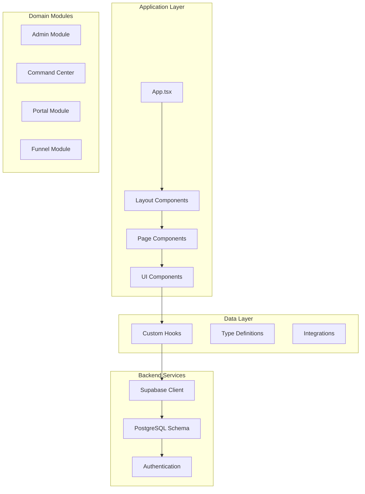
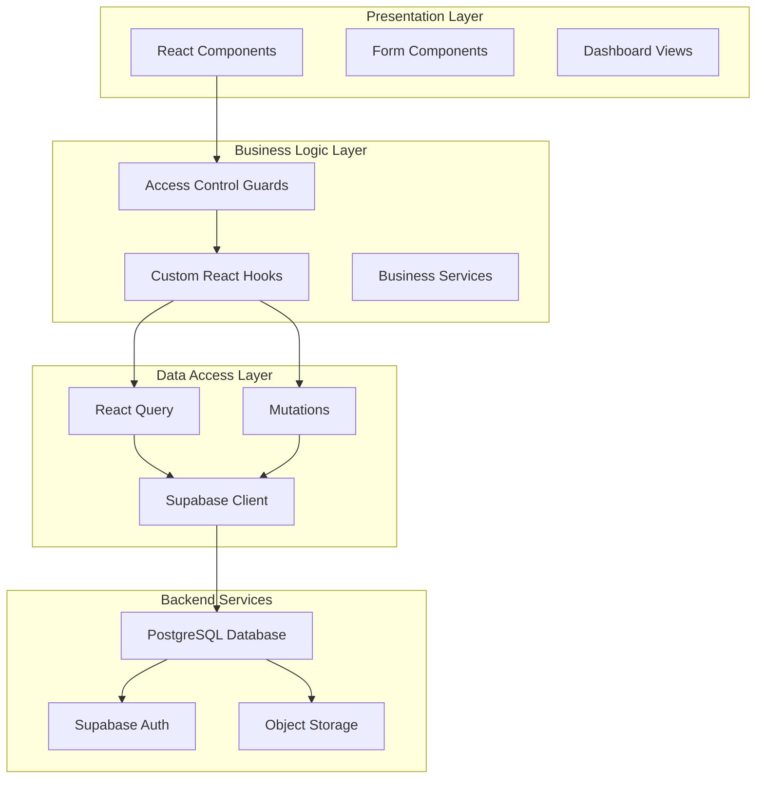
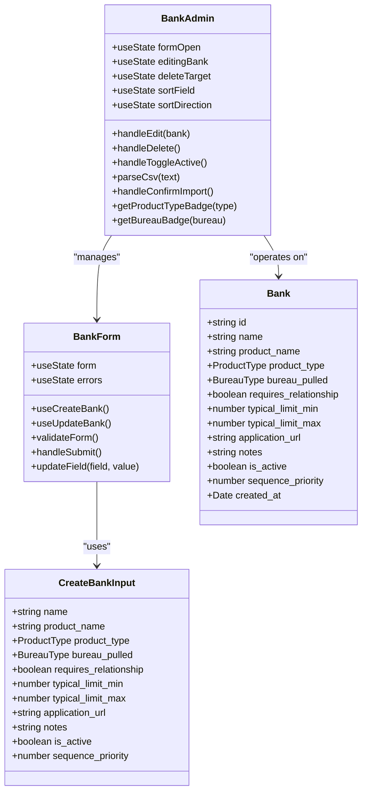
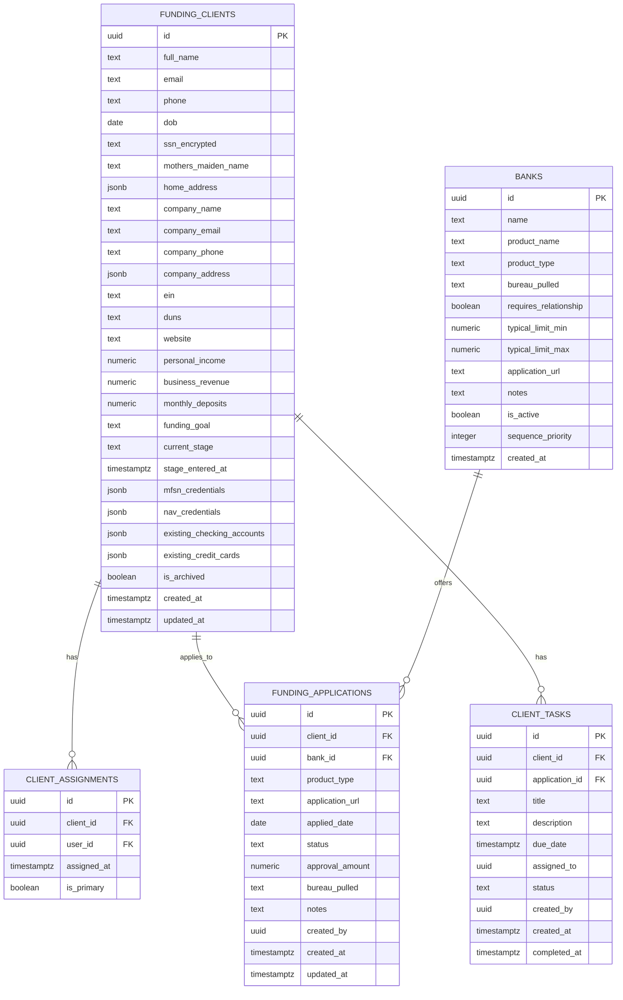
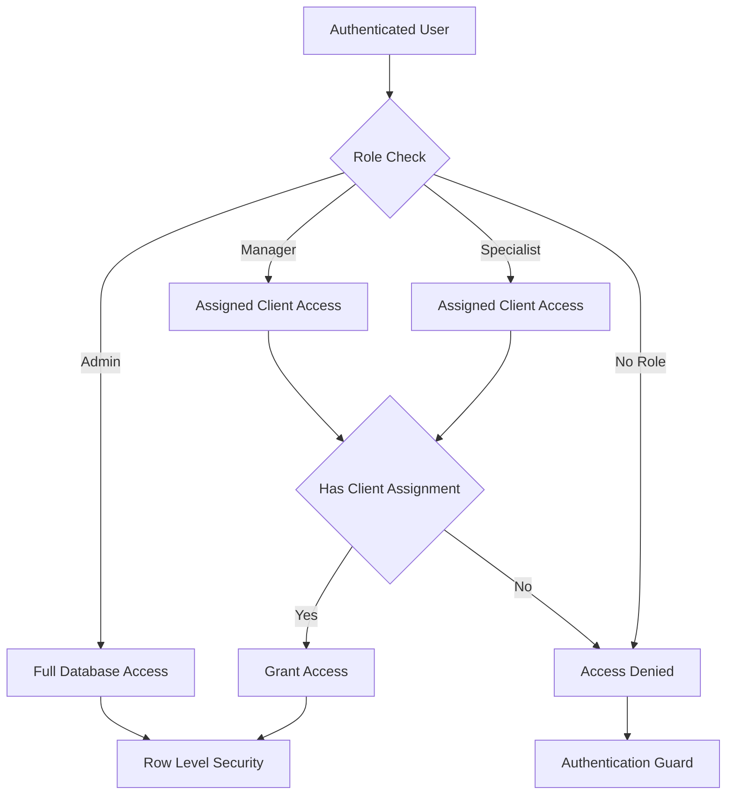

# Bank Administration System

<cite>
**Referenced Files in This Document**
- [README.md](file://README.md)
- [package.json](file://package.json)
- [src/App.tsx](file://src/App.tsx)
- [src/pages/admin/AdminDashboard.tsx](file://src/pages/admin/AdminDashboard.tsx)
- [src/pages/command-center/BankAdmin.tsx](file://src/pages/command-center/BankAdmin.tsx)
- [src/components/admin/AdminLayout.tsx](file://src/components/admin/AdminLayout.tsx)
- [src/components/command-center/CommandCenterLayout.tsx](file://src/components/command-center/CommandCenterLayout.tsx)
- [src/hooks/useBanksAdmin.ts](file://src/hooks/useBanksAdmin.ts)
- [src/components/command-center/bank-admin/BankForm.tsx](file://src/components/command-center/bank-admin/BankForm.tsx)
- [src/components/admin/AdminGuard.tsx](file://src/components/admin/AdminGuard.tsx)
- [src/components/command-center/CommandCenterGuard.tsx](file://src/components/command-center/CommandCenterGuard.tsx)
- [src/hooks/useCommandCenterRole.ts](file://src/hooks/useCommandCenterRole.ts)
- [src/types/command-center.ts](file://src/types/command-center.ts)
- [src/types/leads.ts](file://src/types/leads.ts)
- [supabase/migrations/20260330000000_command_center_schema.sql](file://supabase/migrations/20260330000000_command_center_schema.sql)
- [supabase/migrations/20260320000000_admin_policies.sql](file://supabase/migrations/20260320000000_admin_policies.sql)
- [src/integrations/supabase/types.ts](file://src/integrations/supabase/types.ts)
</cite>

## Table of Contents
1. [Introduction](#introduction)
2. [Project Structure](#project-structure)
3. [Core Components](#core-components)
4. [Architecture Overview](#architecture-overview)
5. [Detailed Component Analysis](#detailed-component-analysis)
6. [Dependency Analysis](#dependency-analysis)
7. [Performance Considerations](#performance-considerations)
8. [Troubleshooting Guide](#troubleshooting-guide)
9. [Conclusion](#conclusion)

## Introduction
The Bank Administration System is a comprehensive financial operations platform built with modern web technologies. It provides two primary operational areas: an administrative dashboard for managing affiliate programs and a command center for financial operations management. The system leverages Supabase for backend services, React Query for state management, and a comprehensive UI toolkit for user interfaces.

The platform serves multiple user roles including administrators, managers, specialists, and affiliate partners, each with distinct access permissions and capabilities. The system manages critical financial operations including bank administration, client funding workflows, commission tracking, and real-time monitoring dashboards.

## Project Structure
The project follows a modular React architecture with clear separation of concerns across different functional domains:



**Diagram sources**
- [src/App.tsx:1-180](file://src/App.tsx#L1-L180)
- [src/components/admin/AdminLayout.tsx:1-50](file://src/components/admin/AdminLayout.tsx#L1-L50)
- [src/components/command-center/CommandCenterLayout.tsx:1-50](file://src/components/command-center/CommandCenterLayout.tsx#L1-L50)

**Section sources**
- [README.md:1-74](file://README.md#L1-L74)
- [package.json:1-96](file://package.json#L1-L96)
- [src/App.tsx:1-180](file://src/App.tsx#L1-L180)

## Core Components

### Administrative Dashboard System
The administrative dashboard provides comprehensive oversight of the affiliate program ecosystem, featuring real-time analytics and management capabilities.

**Key Features:**
- Real-time dashboard statistics with affiliate metrics
- Recent activity monitoring
- Pending commission tracking
- Comprehensive affiliate management interface
- Role-based access control

**Section sources**
- [src/pages/admin/AdminDashboard.tsx:1-325](file://src/pages/admin/AdminDashboard.tsx#L1-L325)
- [src/components/admin/AdminGuard.tsx:1-36](file://src/components/admin/AdminGuard.tsx#L1-L36)

### Command Center Operations
The command center serves as the operational hub for financial management, providing tools for bank administration, client management, and funding workflows.

**Core Functionalities:**
- Bank master list management with CSV import capabilities
- Real-time client pipeline monitoring
- Funding application tracking
- Bureau status management
- Task assignment and workflow coordination

**Section sources**
- [src/pages/command-center/BankAdmin.tsx:1-568](file://src/pages/command-center/BankAdmin.tsx#L1-L568)
- [src/components/command-center/CommandCenterGuard.tsx:1-92](file://src/components/command-center/CommandCenterGuard.tsx#L1-L92)

### Data Management Infrastructure
The system implements robust data management through React Query hooks and Supabase integration, providing efficient caching, real-time updates, and optimistic UI patterns.

**Data Management Features:**
- Centralized bank management with CRUD operations
- Bulk import capabilities for bank data
- Real-time synchronization with backend services
- Optimistic updates and error handling
- Type-safe database operations

**Section sources**
- [src/hooks/useBanksAdmin.ts:1-267](file://src/hooks/useBanksAdmin.ts#L1-L267)
- [src/components/command-center/bank-admin/BankForm.tsx:1-426](file://src/components/command-center/bank-admin/BankForm.tsx#L1-L426)

## Architecture Overview

The system employs a multi-layered architecture with clear separation between presentation, business logic, and data access layers:



**Diagram sources**
- [src/App.tsx:77-86](file://src/App.tsx#L77-L86)
- [src/hooks/useBanksAdmin.ts:172-244](file://src/hooks/useBanksAdmin.ts#L172-L244)
- [src/components/admin/AdminGuard.tsx:10-35](file://src/components/admin/AdminGuard.tsx#L10-L35)

The architecture implements several key design patterns:

**Role-Based Access Control (RBAC):**
- Hierarchical permission system with admin, manager, and specialist roles
- Dynamic role checking with database integration
- Real-time access validation

**Data Flow Patterns:**
- Unidirectional data flow with React Query state management
- Optimistic updates with rollback capabilities
- Centralized error handling and user feedback

**Section sources**
- [src/hooks/useCommandCenterRole.ts:1-118](file://src/hooks/useCommandCenterRole.ts#L1-L118)
- [supabase/migrations/20260330000000_command_center_schema.sql:296-300](file://supabase/migrations/20260330000000_command_center_schema.sql#L296-L300)

## Detailed Component Analysis

### Bank Administration Component

The bank administration system provides comprehensive management capabilities for financial institution data:



**Diagram sources**
- [src/pages/command-center/BankAdmin.tsx:74-568](file://src/pages/command-center/BankAdmin.tsx#L74-L568)
- [src/components/command-center/bank-admin/BankForm.tsx:64-426](file://src/components/command-center/bank-admin/BankForm.tsx#L64-L426)
- [src/hooks/useBanksAdmin.ts:8-29](file://src/hooks/useBanksAdmin.ts#L8-L29)

**Section sources**
- [src/pages/command-center/BankAdmin.tsx:74-568](file://src/pages/command-center/BankAdmin.tsx#L74-L568)
- [src/components/command-center/bank-admin/BankForm.tsx:64-426](file://src/components/command-center/bank-admin/BankForm.tsx#L64-L426)
- [src/hooks/useBanksAdmin.ts:1-267](file://src/hooks/useBanksAdmin.ts#L1-L267)

### Data Model Architecture

The system implements a comprehensive data model optimized for financial operations:



**Diagram sources**
- [supabase/migrations/20260330000000_command_center_schema.sql:37-142](file://supabase/migrations/20260330000000_command_center_schema.sql#L37-L142)

**Section sources**
- [supabase/migrations/20260330000000_command_center_schema.sql:1-800](file://supabase/migrations/20260330000000_command_center_schema.sql#L1-L800)
- [src/types/command-center.ts:22-106](file://src/types/command-center.ts#L22-L106)

### Security and Access Control

The system implements comprehensive security measures through Supabase Row Level Security (RLS):



**Diagram sources**
- [src/components/admin/AdminGuard.tsx:10-35](file://src/components/admin/AdminGuard.tsx#L10-L35)
- [src/components/command-center/CommandCenterGuard.tsx:10-91](file://src/components/command-center/CommandCenterGuard.tsx#L10-L91)

**Section sources**
- [src/components/admin/AdminGuard.tsx:1-36](file://src/components/admin/AdminGuard.tsx#L1-L36)
- [src/components/command-center/CommandCenterGuard.tsx:1-92](file://src/components/command-center/CommandCenterGuard.tsx#L1-L92)
- [supabase/migrations/20260330000000_command_center_schema.sql:296-300](file://supabase/migrations/20260330000000_command_center_schema.sql#L296-L300)

## Dependency Analysis

The system maintains clean dependency relationships through strategic module organization:

```mermaid
graph LR
subgraph "Core Dependencies"
React[React 18.3.1]
TS[TypeScript 5.8.3]
Supabase[@supabase/supabase-js 2.95.3]
Query[@tanstack/react-query 5.83.0]
end
subgraph "UI Framework"
Radix[Radix UI]
Shadcn[Shadcn/UI]
Tailwind[Tailwind CSS]
Lucide[lucide-react]
end
subgraph "State Management"
Zustand[Zustand 5.0.11]
HookForm[React Hook Form]
Zod[Zod 3.25.76]
end
subgraph "Utilities"
DateFns[date-fns 3.6.0]
Framer[framer-motion 12.34.0]
Sonner[sonner 1.7.4]
end
React --> Supabase
React --> Query
Query --> Supabase
UI --> Radix
UI --> Shadcn
State --> Zustand
State --> HookForm
Utilities --> DateFns
Utilities --> Framer
```

**Diagram sources**
- [package.json:15-70](file://package.json#L15-L70)

**Section sources**
- [package.json:1-96](file://package.json#L1-L96)

## Performance Considerations

The system implements several performance optimization strategies:

**Caching Strategy:**
- React Query provides intelligent caching with 5-minute stale time
- Automatic garbage collection after 10 minutes
- Optimistic updates for immediate UI feedback
- Retry mechanisms for transient failures

**Data Loading Optimization:**
- Lazy loading for route components to reduce initial bundle size
- Skeleton loaders for improved perceived performance
- Efficient database indexing on frequently queried columns
- Pagination support for large datasets

**Network Optimization:**
- Minimal re-renders through proper state management
- Debounced search and filter operations
- Efficient Supabase queries with selective field retrieval
- Real-time subscription management

## Troubleshooting Guide

### Common Issues and Solutions

**Authentication and Authorization Problems:**
- Verify user metadata contains proper role information
- Check Supabase authentication configuration
- Ensure database migration has been applied successfully
- Validate JWT token structure and claims

**Database Connection Issues:**
- Confirm Supabase project URL and API key configuration
- Verify network connectivity to Supabase services
- Check database service availability and health
- Review connection limits and rate limiting

**Performance Issues:**
- Monitor React Query cache effectiveness
- Check database query performance and indexing
- Verify component rendering optimization
- Review network request patterns and caching

**Section sources**
- [src/components/command-center/CommandCenterGuard.tsx:30-64](file://src/components/command-center/CommandCenterGuard.tsx#L30-L64)
- [src/hooks/useCommandCenterRole.ts:93-111](file://src/hooks/useCommandCenterRole.ts#L93-L111)

## Conclusion

The Bank Administration System represents a sophisticated financial operations platform that successfully combines modern web technologies with robust backend services. The system's architecture demonstrates excellent separation of concerns, comprehensive security implementation, and scalable data management capabilities.

Key strengths of the system include:

**Technical Excellence:**
- Clean, modular architecture with clear component boundaries
- Comprehensive type safety throughout the codebase
- Robust error handling and user feedback systems
- Efficient state management with React Query

**Operational Capabilities:**
- Multi-role access control with granular permissions
- Real-time data synchronization and updates
- Comprehensive reporting and analytics capabilities
- Flexible data import/export functionality

**Scalability and Maintainability:**
- Well-structured codebase supporting future enhancements
- Extensive testing infrastructure with Vitest
- Clear documentation and development guidelines
- Modular design enabling easy feature additions

The system provides a solid foundation for financial operations management while maintaining flexibility for future growth and feature expansion. Its implementation of modern React patterns, comprehensive security measures, and efficient data management establishes it as a reliable platform for enterprise-level financial operations.