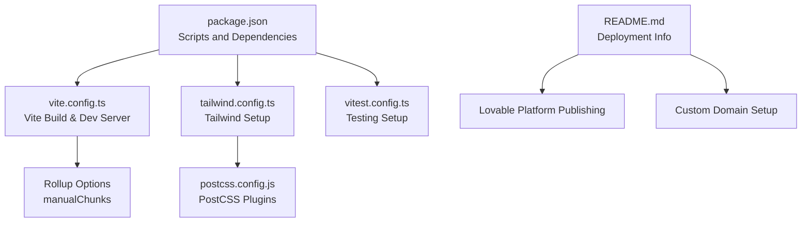
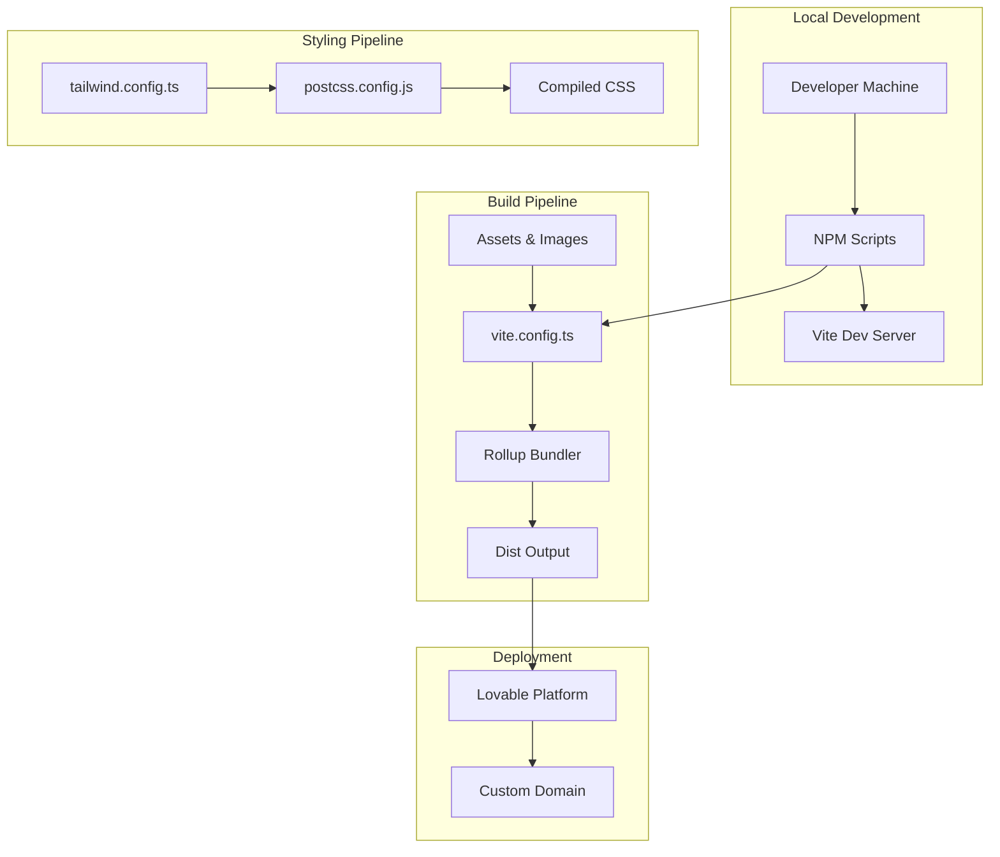
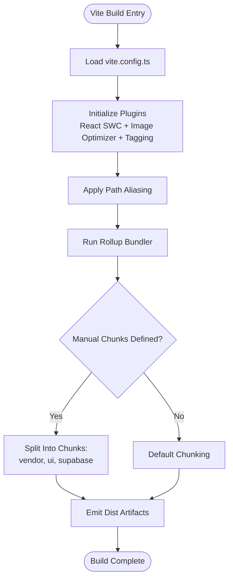
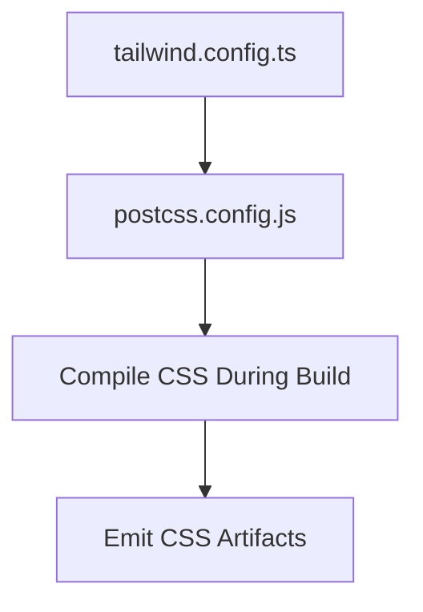
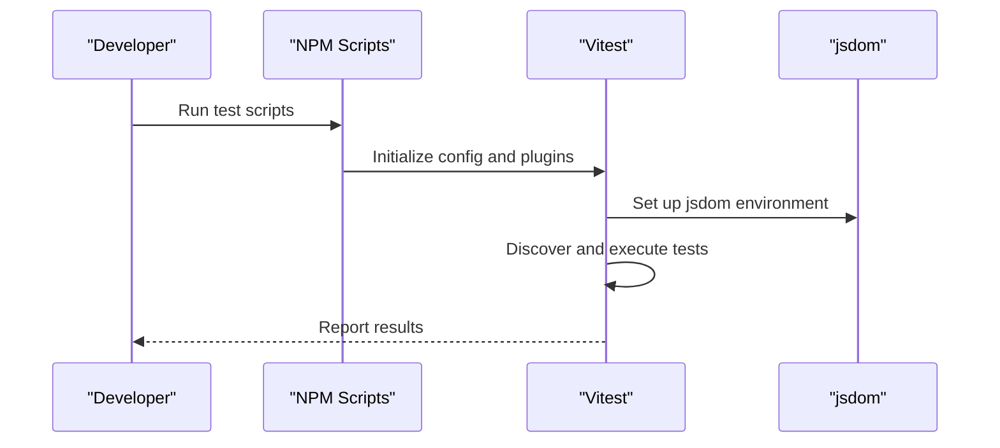
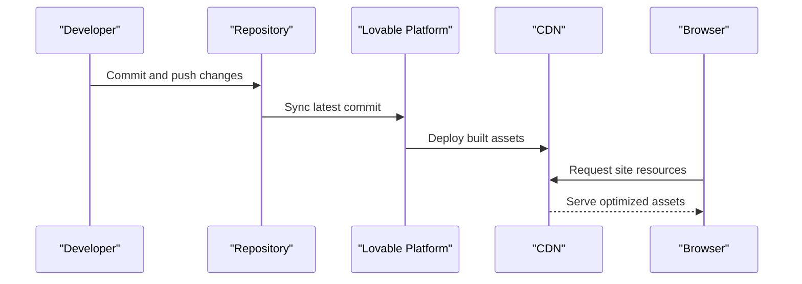
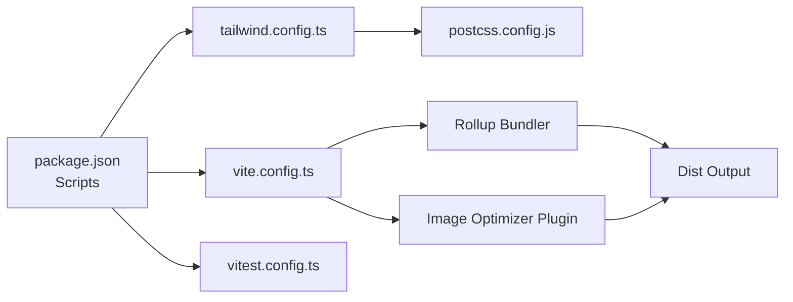

# Build & Deployment

<cite>
**Referenced Files in This Document**
- [README.md](file://README.md)
- [package.json](file://package.json)
- [vite.config.ts](file://vite.config.ts)
- [tailwind.config.ts](file://tailwind.config.ts)
- [postcss.config.js](file://postcss.config.js)
- [vitest.config.ts](file://vitest.config.ts)
</cite>

## Table of Contents
1. [Introduction](#introduction)
2. [Project Structure](#project-structure)
3. [Core Components](#core-components)
4. [Architecture Overview](#architecture-overview)
5. [Detailed Component Analysis](#detailed-component-analysis)
6. [Dependency Analysis](#dependency-analysis)
7. [Performance Considerations](#performance-considerations)
8. [Troubleshooting Guide](#troubleshooting-guide)
9. [Conclusion](#conclusion)
10. [Appendices](#appendices)

## Introduction
This section documents the build configuration and deployment strategies for the Ryland application. It explains the production build process, asset optimization, and bundle analysis capabilities enabled by the current setup. It also covers deployment options via the Lovable platform, custom domain configuration, and CI/CD integration approaches. Additional topics include build optimization techniques, code splitting strategies, performance monitoring, security considerations, SSL certificate management, and deployment health monitoring.

## Project Structure
Ryland is a Vite-based React application configured with TypeScript, Tailwind CSS, and optional testing via Vitest. The repository includes:
- A Vite configuration that defines development server behavior, plugin usage, path aliases, and Rollup code splitting.
- Tailwind CSS configuration for styling and content scanning.
- PostCSS configuration enabling Tailwind and Autoprefixer.
- Test configuration for Vitest with a jsdom environment.
- Scripts for development, production builds, previews, linting, and testing.

**Diagram sources**
- [package.json:1-95](file://package.json#L1-L95)
- [vite.config.ts:1-43](file://vite.config.ts#L1-L43)
- [tailwind.config.ts:1-97](file://tailwind.config.ts#L1-L97)
- [postcss.config.js:1-7](file://postcss.config.js#L1-L7)
- [vitest.config.ts:1-17](file://vitest.config.ts#L1-L17)
- [README.md:63-74](file://README.md#L63-L74)

**Section sources**
- [README.md:1-74](file://README.md#L1-L74)
- [package.json:1-95](file://package.json#L1-L95)
- [vite.config.ts:1-43](file://vite.config.ts#L1-L43)
- [tailwind.config.ts:1-97](file://tailwind.config.ts#L1-L97)
- [postcss.config.js:1-7](file://postcss.config.js#L1-L7)
- [vitest.config.ts:1-17](file://vitest.config.ts#L1-L17)

## Core Components
- Vite configuration controls development server settings, plugin activation, image optimization, and code splitting via Rollup manual chunks.
- Tailwind CSS configuration defines content paths, color tokens, animations, and plugins.
- PostCSS configuration enables Tailwind and Autoprefixer during the build pipeline.
- Test configuration sets up Vitest with jsdom and project aliases.
- Package scripts orchestrate development, production builds, previews, linting, and testing.

Key build and deployment implications:
- Production builds are executed via the Vite build script, which leverages Rollup for bundling and code splitting.
- Image optimization is enabled through a dedicated Vite plugin with configurable quality settings.
- Code splitting is explicitly configured to separate vendor libraries, UI motion libraries, and Supabase client code into distinct chunks.

**Section sources**
- [package.json:6-14](file://package.json#L6-L14)
- [vite.config.ts:8-42](file://vite.config.ts#L8-L42)
- [tailwind.config.ts:3-96](file://tailwind.config.ts#L3-L96)
- [postcss.config.js:1-7](file://postcss.config.js#L1-L7)
- [vitest.config.ts:5-16](file://vitest.config.ts#L5-L16)

## Architecture Overview
The build and deployment architecture centers on Vite for bundling and development, with Tailwind CSS and PostCSS for styling, and optional Vitest for testing. Lovable provides hosting and publishing, while custom domains can be attached through the platform’s settings.

**Diagram sources**
- [vite.config.ts:8-42](file://vite.config.ts#L8-L42)
- [tailwind.config.ts:3-96](file://tailwind.config.ts#L3-L96)
- [postcss.config.js:1-7](file://postcss.config.js#L1-L7)
- [README.md:63-74](file://README.md#L63-L74)

## Detailed Component Analysis

### Vite Build Configuration
- Development server:
  - Host binding, port, and HMR overlay settings are defined for local iteration.
- Plugins:
  - React SWC plugin for fast JSX/TSX transforms.
  - Conditional component tagging plugin for development.
  - Image optimizer plugin with per-format quality settings.
- Path aliasing:
  - Alias for the src directory improves import readability.
- Code splitting:
  - Manual chunk groups isolate major vendor libraries, UI motion libraries, and Supabase client code.

**Diagram sources**
- [vite.config.ts:8-42](file://vite.config.ts#L8-L42)

**Section sources**
- [vite.config.ts:8-42](file://vite.config.ts#L8-L42)

### Tailwind CSS and PostCSS
- Tailwind configuration:
  - Content paths scan components, pages, app, and src directories.
  - Theme extensions include color palettes, border radius, keyframes, and animations.
  - Plugin integration for animations.
- PostCSS configuration:
  - Enables Tailwind and Autoprefixer for vendor-prefixed CSS.

**Diagram sources**
- [tailwind.config.ts:3-96](file://tailwind.config.ts#L3-L96)
- [postcss.config.js:1-7](file://postcss.config.js#L1-L7)

**Section sources**
- [tailwind.config.ts:3-96](file://tailwind.config.ts#L3-L96)
- [postcss.config.js:1-7](file://postcss.config.js#L1-L7)

### Testing Configuration
- Vitest is configured with a jsdom environment, global setup files, and project aliases.
- Tests are included from the src directory using tsx patterns.

**Diagram sources**
- [vitest.config.ts:5-16](file://vitest.config.ts#L5-L16)

**Section sources**
- [vitest.config.ts:5-16](file://vitest.config.ts#L5-L16)

### Deployment to Lovable Platform
- Publishing:
  - The project can be published directly from the Lovable dashboard under the Share -> Publish action.
- Custom domain:
  - Custom domains can be connected via Project > Settings > Domains.

**Diagram sources**
- [README.md:63-74](file://README.md#L63-L74)

**Section sources**
- [README.md:63-74](file://README.md#L63-L74)

### Bundle Analysis and Asset Optimization
- Code splitting:
  - Vendor chunk isolates core React libraries and routing.
  - UI chunk groups motion and query libraries.
  - Supabase chunk isolates database/client dependencies.
- Asset optimization:
  - Image optimization plugin applies quality settings per format during build.
- Bundle analysis:
  - Use the built-in Rollup analyzer or external tools to inspect chunk sizes and dependencies after building.

Practical steps:
- Run the production build script to generate dist artifacts.
- Inspect the emitted chunks and their sizes.
- Adjust manual chunk boundaries or lazy-load routes/components to reduce initial payload.

**Section sources**
- [vite.config.ts:31-41](file://vite.config.ts#L31-L41)
- [vite.config.ts:19-24](file://vite.config.ts#L19-L24)

### CI/CD Integration
Recommended approach:
- Trigger builds on commits to main or release branches.
- Use NPM scripts to run linting, tests, and production builds.
- Publish to Lovable or deploy the dist folder to a static host.
- Configure branch protection and pre-deploy checks to ensure quality gates.

Example workflow outline:
- Checkout code
- Install dependencies
- Run lint and tests
- Build production assets
- Upload artifacts or deploy to Lovable

[No sources needed since this section provides general guidance]

### Environment Variables and Configuration
- The project does not define explicit environment variable files in the repository snapshot.
- For environment-specific values (e.g., API keys, endpoints), configure them in the Lovable dashboard or your chosen deployment platform.
- Keep secrets out of the repository and inject them at build or runtime as supported by the platform.

[No sources needed since this section provides general guidance]

### Security Considerations and SSL
- SSL/TLS:
  - Lovable manages SSL certificates for published projects and custom domains.
- Secrets management:
  - Store sensitive configuration in platform-managed secrets or environment variables.
- CSP and headers:
  - Configure appropriate Content Security Policies and security headers at the platform level if customization is available.

[No sources needed since this section provides general guidance]

### Monitoring Deployment Health
- Health checks:
  - Use platform-provided metrics and logs to monitor uptime and errors.
- Performance monitoring:
  - Track bundle sizes, Largest Contentful Paint (LCP), First Input Delay (FID), and other Core Web Vitals post-deployment.
- Rollback procedures:
  - Maintain versioned releases and enable quick rollback to previous builds if issues arise.

[No sources needed since this section provides general guidance]

## Dependency Analysis
The build pipeline depends on Vite, Rollup, Tailwind CSS, PostCSS, and optional plugins. The following diagram highlights key relationships among configuration files and scripts.

**Diagram sources**
- [package.json:6-14](file://package.json#L6-L14)
- [vite.config.ts:8-42](file://vite.config.ts#L8-L42)
- [tailwind.config.ts:3-96](file://tailwind.config.ts#L3-L96)
- [postcss.config.js:1-7](file://postcss.config.js#L1-L7)
- [vitest.config.ts:5-16](file://vitest.config.ts#L5-L16)

**Section sources**
- [package.json:6-14](file://package.json#L6-L14)
- [vite.config.ts:8-42](file://vite.config.ts#L8-L42)
- [tailwind.config.ts:3-96](file://tailwind.config.ts#L3-L96)
- [postcss.config.js:1-7](file://postcss.config.js#L1-L7)
- [vitest.config.ts:5-16](file://vitest.config.ts#L5-L16)

## Performance Considerations
- Code splitting:
  - Maintain manual chunk groups to keep initial bundles small.
  - Consider dynamic imports for route-level lazy loading.
- Asset optimization:
  - Tune image quality settings to balance fidelity and bundle size.
- CSS:
  - Tailwind’s purgeable content scanning reduces CSS size; ensure all content paths remain accurate.
- Build caching:
  - Enable incremental builds and cache-friendly hashing strategies in Vite.

[No sources needed since this section provides general guidance]

## Troubleshooting Guide
Common issues and resolutions:
- Build failures due to missing environment variables:
  - Ensure required variables are set in the platform’s environment configuration.
- Slow builds:
  - Review chunk groupings and remove unnecessary dependencies from vendor chunks.
- Styling inconsistencies:
  - Verify Tailwind content paths and PostCSS plugin order.
- Test failures:
  - Confirm jsdom setup and mock external dependencies appropriately.

[No sources needed since this section provides general guidance]

## Conclusion
Ryland’s build and deployment setup leverages Vite for efficient bundling, Tailwind CSS for styling, and optional testing with Vitest. The Lovable platform simplifies publishing and custom domain configuration. By applying code splitting, asset optimization, and CI/CD automation, teams can maintain fast, reliable deployments. Security and monitoring should be integrated at the platform level to ensure safe and observable operations.

## Appendices
- Practical deployment examples:
  - Local preview: run the preview script to serve the production build locally before publishing.
  - Automated deployments: integrate NPM scripts into your CI/CD provider to trigger builds and publish to Lovable on successful checks.
- Environment variable configuration:
  - Define variables in the Lovable project settings or equivalent platform UI.
- SSL and custom domains:
  - Connect domains via the platform’s domain settings; SSL is managed by the platform.

[No sources needed since this section provides general guidance]