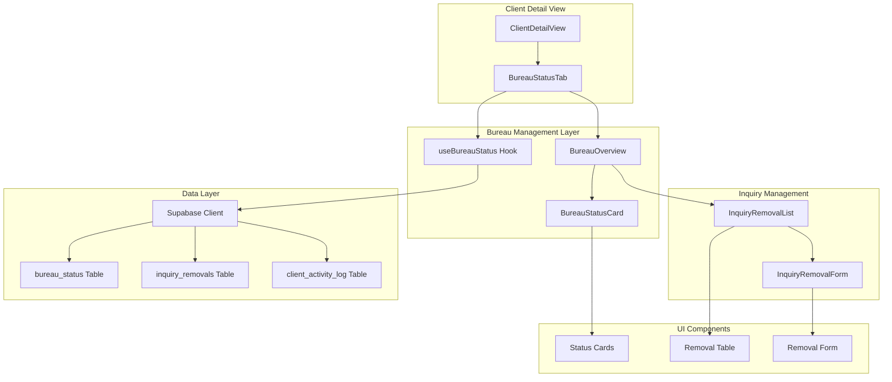
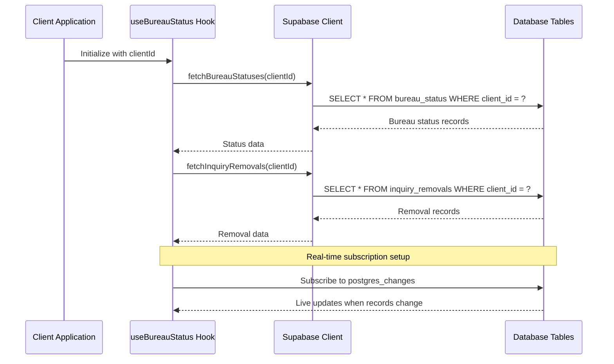
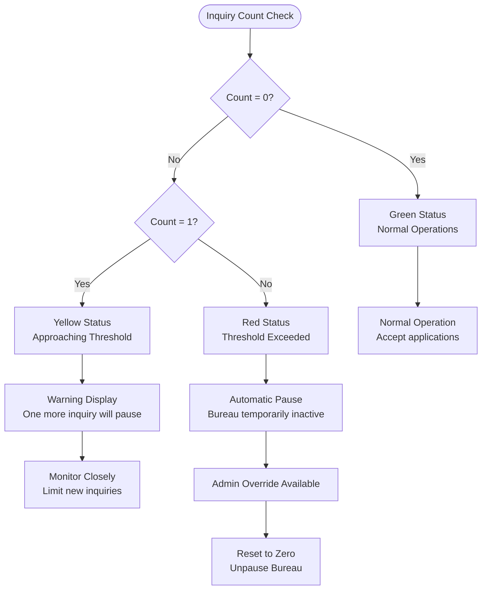
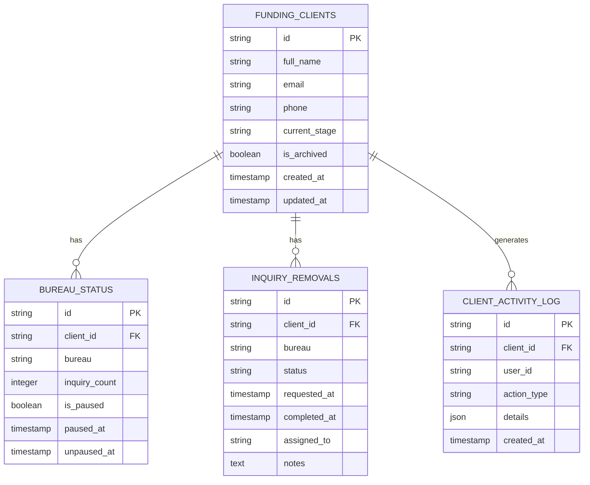
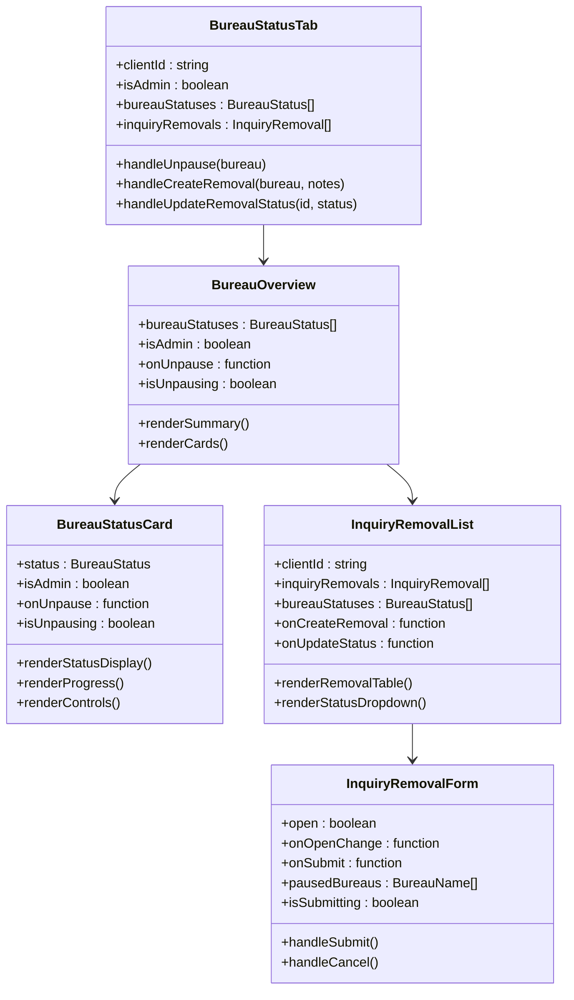
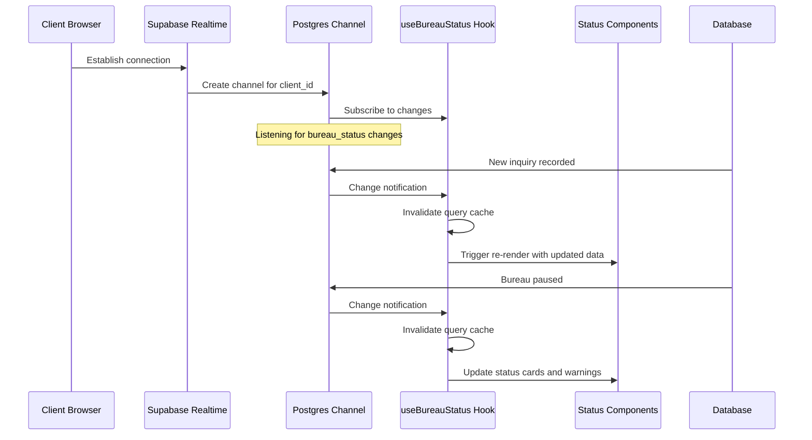
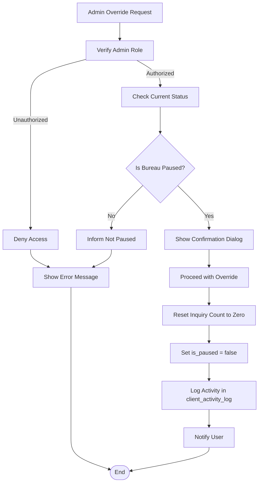
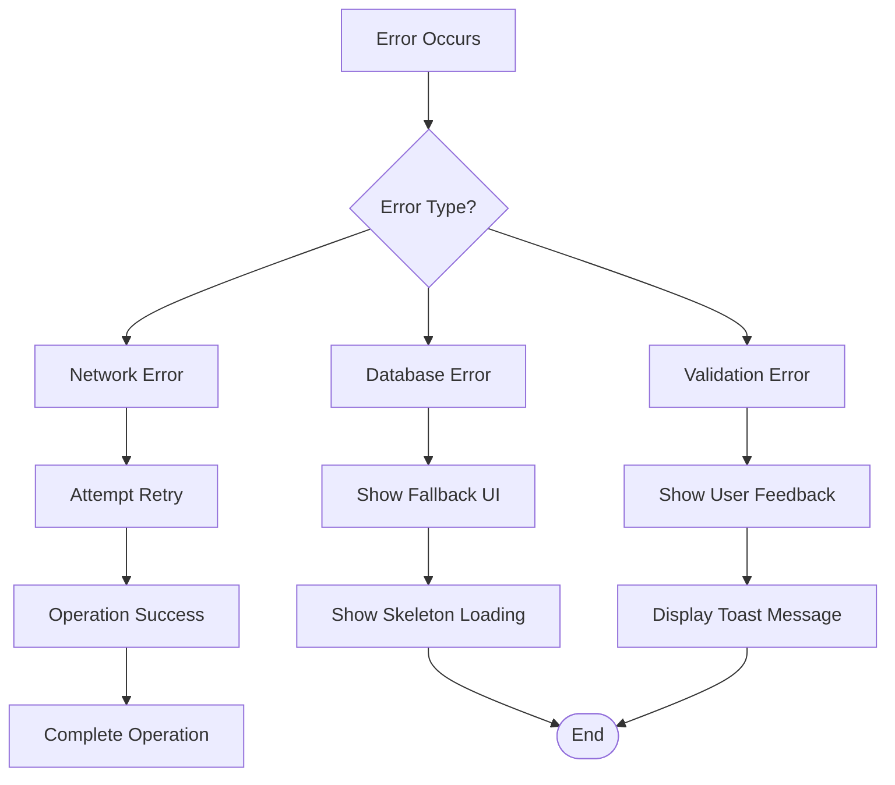

# Bureau Status System

<cite>
**Referenced Files in This Document**
- [useBureauStatus.ts](file://src/hooks/useBureauStatus.ts)
- [BureauStatusCard.tsx](file://src/components/command-center/bureau/BureauStatusCard.tsx)
- [BureauOverview.tsx](file://src/components/command-center/bureau/BureauOverview.tsx)
- [BureauStatusTab.tsx](file://src/components/command-center/client-detail/BureauStatusTab.tsx)
- [InquiryRemovalList.tsx](file://src/components/command-center/bureau/InquiryRemovalList.tsx)
- [InquiryRemovalForm.tsx](file://src/components/command-center/bureau/InquiryRemovalForm.tsx)
- [ClientDetailView.tsx](file://src/pages/command-center/ClientDetailView.tsx)
- [types.ts](file://src/integrations/supabase/types.ts)
</cite>

## Table of Contents
1. [Introduction](#introduction)
2. [System Architecture](#system-architecture)
3. [Core Components](#core-components)
4. [Data Model](#data-model)
5. [User Interface Components](#user-interface-components)
6. [Real-time Updates](#real-time-updates)
7. [Administrative Features](#administrative-features)
8. [Integration Points](#integration-points)
9. [Error Handling](#error-handling)
10. [Performance Considerations](#performance-considerations)
11. [Troubleshooting Guide](#troubleshooting-guide)
12. [Conclusion](#conclusion)

## Introduction

The Bureau Status System is a comprehensive credit bureau monitoring and management solution integrated into the Ryland funding platform. This system tracks credit inquiry counts across the three major credit bureaus (Experian, Equifax, and TransUnion) and provides automated controls to prevent excessive inquiries that could negatively impact clients' credit scores.

The system operates on a threshold-based approach where each bureau maintains an inquiry count that triggers automatic pausing when the limit is reached. Administrators can override these pauses when necessary, and the system provides comprehensive audit trails through activity logging.

## System Architecture

The Bureau Status System follows a modular architecture with clear separation of concerns between data fetching, UI presentation, and administrative controls.

**Diagram sources**
- [ClientDetailView.tsx:1-224](file://src/pages/command-center/ClientDetailView.tsx#L1-L224)
- [useBureauStatus.ts:278-385](file://src/hooks/useBureauStatus.ts#L278-L385)
- [BureauOverview.tsx:14-72](file://src/components/command-center/bureau/BureauOverview.tsx#L14-L72)

## Core Components

### Data Fetching and State Management

The system centers around the `useBureauStatus` custom React hook, which provides comprehensive state management for bureau status monitoring and control.

**Diagram sources**
- [useBureauStatus.ts:282-326](file://src/hooks/useBureauStatus.ts#L282-L326)

**Section sources**
- [useBureauStatus.ts:278-385](file://src/hooks/useBureauStatus.ts#L278-L385)

### Status Monitoring and Threshold Management

The system implements a sophisticated threshold-based monitoring system with three distinct states:

**Diagram sources**
- [useBureauStatus.ts:388-392](file://src/hooks/useBureauStatus.ts#L388-L392)
- [BureauStatusCard.tsx:49-50](file://src/components/command-center/bureau/BureauStatusCard.tsx#L49-L50)

**Section sources**
- [useBureauStatus.ts:24-25](file://src/hooks/useBureauStatus.ts#L24-L25)
- [BureauStatusCard.tsx:49-63](file://src/components/command-center/bureau/BureauStatusCard.tsx#L49-L63)

## Data Model

The system relies on three primary database tables that work together to manage bureau status and inquiry removal processes.

**Diagram sources**
- [types.ts:1157-1276](file://src/integrations/supabase/types.ts#L1157-L1276)

### Bureau Status Records

Each client maintains three separate bureau status records, one for each credit bureau. These records track inquiry counts, pause states, and timestamps for transparency and auditability.

### Inquiry Removal Requests

The system manages inquiry removal requests through a structured workflow with three status states: Requested, InProgress, and Completed. Each request creates associated tasks and activity logs for complete traceability.

**Section sources**
- [types.ts:1157-1276](file://src/integrations/supabase/types.ts#L1157-L1276)

## User Interface Components

### Bureau Status Overview

The system presents a comprehensive dashboard showing the current status of all three bureaus with clear visual indicators and actionable controls.

**Diagram sources**
- [BureauStatusTab.tsx:14-182](file://src/components/command-center/client-detail/BureauStatusTab.tsx#L14-L182)
- [BureauOverview.tsx:14-72](file://src/components/command-center/bureau/BureauOverview.tsx#L14-L72)
- [BureauStatusCard.tsx:39-211](file://src/components/command-center/bureau/BureauStatusCard.tsx#L39-L211)

**Section sources**
- [BureauStatusTab.tsx:14-182](file://src/components/command-center/client-detail/BureauStatusTab.tsx#L14-L182)
- [BureauOverview.tsx:14-72](file://src/components/command-center/bureau/BureauOverview.tsx#L14-L72)
- [BureauStatusCard.tsx:39-211](file://src/components/command-center/bureau/BureauStatusCard.tsx#L39-L211)

### Visual Status Indicators

The system uses a color-coded status system to immediately communicate bureau health:

- **Green**: Normal operation (0 inquiries)
- **Yellow**: Approaching threshold (1 inquiry)
- **Red**: Threshold exceeded (≥2 inquiries)

**Section sources**
- [BureauStatusCard.tsx:53-63](file://src/components/command-center/bureau/BureauStatusCard.tsx#L53-L63)
- [useBureauStatus.ts:388-392](file://src/hooks/useBureauStatus.ts#L388-L392)

## Real-time Updates

The system leverages Supabase's real-time capabilities to provide instant updates when bureau statuses change.

**Diagram sources**
- [useBureauStatus.ts:303-326](file://src/hooks/useBureauStatus.ts#L303-L326)

**Section sources**
- [useBureauStatus.ts:303-326](file://src/hooks/useBureauStatus.ts#L303-L326)

## Administrative Features

### Admin Override System

Administrators have the ability to override automatic bureau pauses when justified circumstances require immediate action.

**Diagram sources**
- [BureauStatusCard.tsx:157-190](file://src/components/command-center/bureau/BureauStatusCard.tsx#L157-L190)
- [useBureauStatus.ts:119-159](file://src/hooks/useBureauStatus.ts#L119-L159)

**Section sources**
- [BureauStatusCard.tsx:157-190](file://src/components/command-center/bureau/BureauStatusCard.tsx#L157-L190)
- [useBureauStatus.ts:119-159](file://src/hooks/useBureauStatus.ts#L119-L159)

### Inquiry Removal Workflow

The system provides a complete workflow for managing inquiry removal requests from creation to completion.

**Section sources**
- [InquiryRemovalList.tsx:52-192](file://src/components/command-center/bureau/InquiryRemovalList.tsx#L52-L192)
- [InquiryRemovalForm.tsx:33-159](file://src/components/command-center/bureau/InquiryRemovalForm.tsx#L33-L159)

## Integration Points

### Supabase Authentication and Authorization

The system integrates with Supabase's authentication system to provide role-based access control for administrative features.

**Section sources**
- [BureauStatusTab.tsx:18-21](file://src/components/command-center/client-detail/BureauStatusTab.tsx#L18-L21)
- [types.ts:1316-1322](file://src/integrations/supabase/types.ts#L1316-L1322)

### Client Detail Integration

The bureau status system is seamlessly integrated into the broader client management interface, providing comprehensive client information in a unified view.

**Section sources**
- [ClientDetailView.tsx:177-183](file://src/pages/command-center/ClientDetailView.tsx#L177-L183)

## Error Handling

The system implements comprehensive error handling across all components to ensure robust operation under various failure scenarios.

**Diagram sources**
- [BureauStatusTab.tsx:137-148](file://src/components/command-center/client-detail/BureauStatusTab.tsx#L137-L148)

**Section sources**
- [BureauStatusTab.tsx:104-148](file://src/components/command-center/client-detail/BureauStatusTab.tsx#L104-L148)
- [useBureauStatus.ts:47-49](file://src/hooks/useBureauStatus.ts#L47-L49)

## Performance Considerations

### Optimized Data Fetching

The system uses React Query for efficient data caching and synchronization, minimizing unnecessary network requests while maintaining real-time updates.

### Lazy Loading Implementation

Components implement skeleton loading states during initial data fetch to provide responsive user experience while data loads asynchronously.

### Memory Management

The system properly cleans up Supabase subscriptions and React Query cache invalidations to prevent memory leaks and ensure optimal performance.

## Troubleshooting Guide

### Common Issues and Solutions

**Bureau Status Not Updating**
- Verify real-time subscription is active
- Check database connectivity
- Ensure proper client ID is passed to hooks

**Admin Override Not Working**
- Verify user has admin role
- Check Supabase authentication state
- Review console for permission errors

**Inquiry Removal Form Disabled**
- Confirm bureaus are properly paused
- Verify form validation passes
- Check for pending mutations

**Section sources**
- [useBureauStatus.ts:303-326](file://src/hooks/useBureauStatus.ts#L303-L326)
- [BureauStatusTab.tsx:38-57](file://src/components/command-center/client-detail/BureauStatusTab.tsx#L38-L57)

## Conclusion

The Bureau Status System provides a robust, scalable solution for managing credit bureau interactions within the Ryland funding platform. Through its threshold-based monitoring, comprehensive administrative controls, and real-time updates, the system ensures responsible credit inquiry management while maintaining operational flexibility for administrators.

The modular architecture enables easy maintenance and future enhancements, while the comprehensive error handling and performance optimizations ensure reliable operation in production environments. The system successfully balances automation with human oversight, providing the right level of control for different operational scenarios.