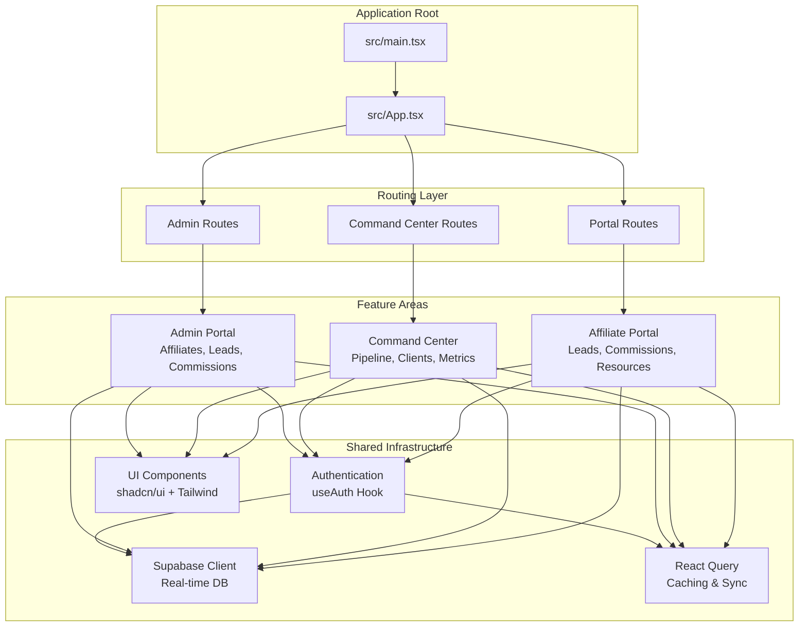
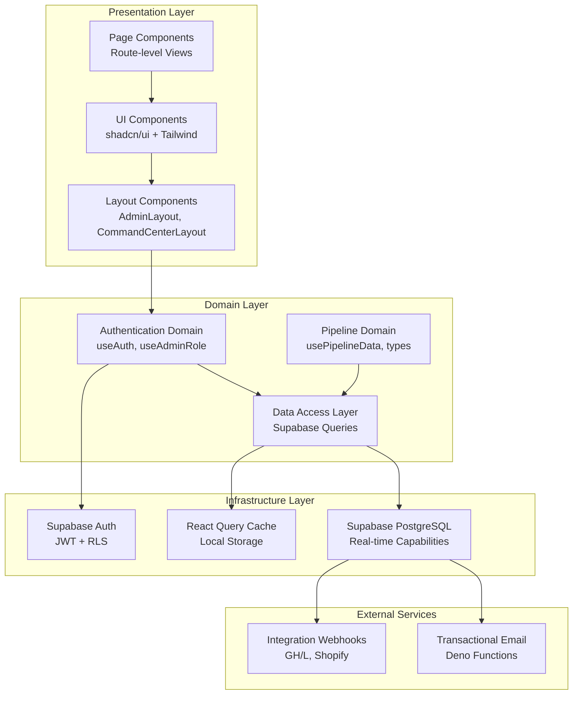
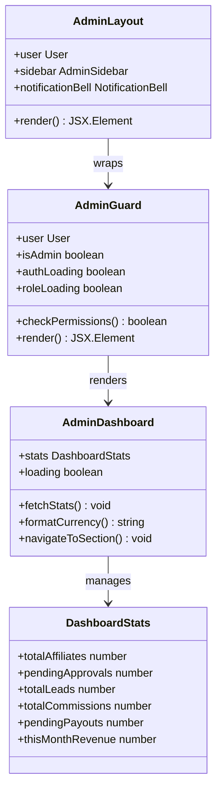
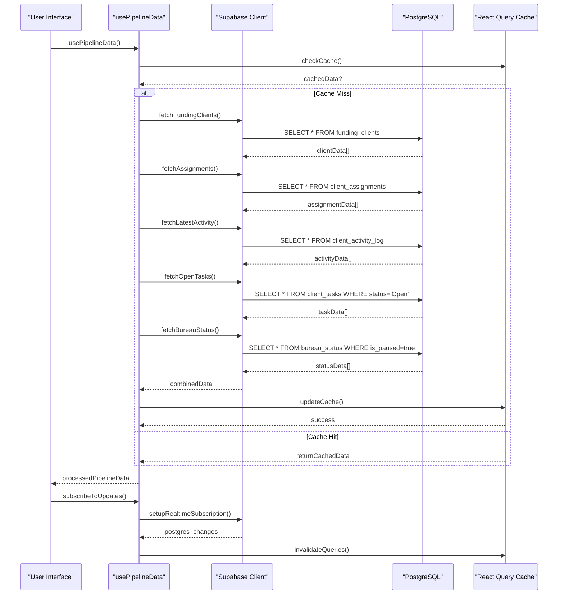
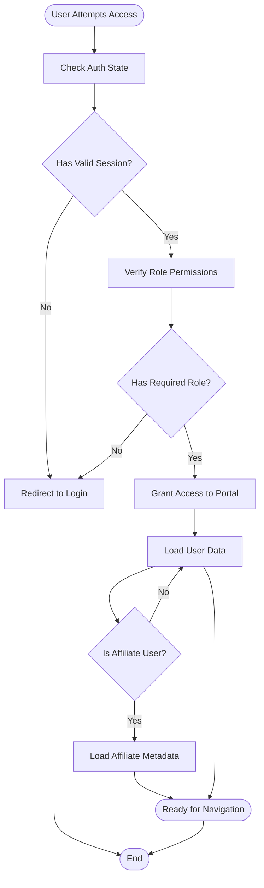
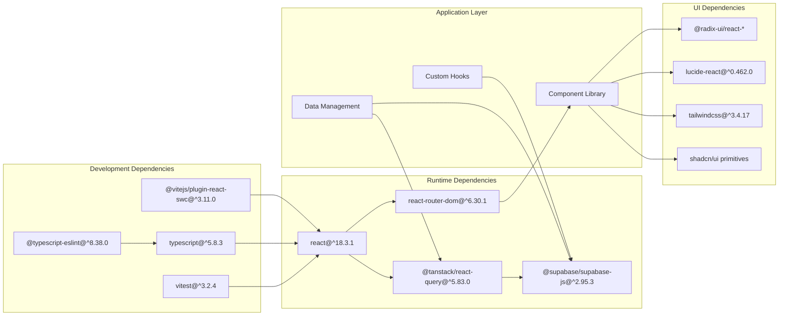

# Client Administration System

<cite>
**Referenced Files in This Document**
- [README.md](file://README.md)
- [package.json](file://package.json)
- [src/App.tsx](file://src/App.tsx)
- [src/main.tsx](file://src/main.tsx)
- [src/integrations/supabase/client.ts](file://src/integrations/supabase/client.ts)
- [src/components/admin/AdminLayout.tsx](file://src/components/admin/AdminLayout.tsx)
- [src/pages/admin/AdminDashboard.tsx](file://src/pages/admin/AdminDashboard.tsx)
- [src/hooks/useAdminRole.ts](file://src/hooks/useAdminRole.ts)
- [src/components/command-center/CommandCenterLayout.tsx](file://src/components/command-center/CommandCenterLayout.tsx)
- [src/pages/command-center/PipelineDashboard.tsx](file://src/pages/command-center/PipelineDashboard.tsx)
- [src/hooks/useAuth.tsx](file://src/hooks/useAuth.tsx)
- [src/components/admin/AdminGuard.tsx](file://src/components/admin/AdminGuard.tsx)
- [src/hooks/usePipelineData.ts](file://src/hooks/usePipelineData.ts)
- [src/types/command-center.ts](file://src/types/command-center.ts)
- [src/lib/utils.ts](file://src/lib/utils.ts)
</cite>

## Table of Contents
1. [Introduction](#introduction)
2. [Project Structure](#project-structure)
3. [Core Components](#core-components)
4. [Architecture Overview](#architecture-overview)
5. [Detailed Component Analysis](#detailed-component-analysis)
6. [Dependency Analysis](#dependency-analysis)
7. [Performance Considerations](#performance-considerations)
8. [Troubleshooting Guide](#troubleshooting-guide)
9. [Conclusion](#conclusion)

## Introduction
This document describes the Client Administration System, a comprehensive web application built with modern React and TypeScript technologies. The system provides three primary operational areas:
- Admin Portal: Centralized administration for affiliates, leads, commissions, payouts, and reports.
- Command Center: Real-time client pipeline management with stage tracking, overdue monitoring, and team coordination.
- Affiliate Portal: Self-service dashboard for affiliates to manage leads, commissions, and resources.

The application leverages Supabase for authentication and real-time database capabilities, React Query for data fetching and caching, and a modular component architecture with shadcn/ui and Tailwind CSS for consistent UI design.

## Project Structure
The project follows a feature-based organization with clear separation between admin, command center, and portal functionalities. Key directories include:
- src/components: Reusable UI components organized by functional area (admin, command-center, portal, ui)
- src/pages: Route-level page components for each major feature area
- src/hooks: Custom React hooks for authentication, data fetching, and business logic
- src/types: TypeScript type definitions for shared data structures
- src/integrations: Third-party service integrations (Supabase)
- src/lib: Utility functions and shared helpers

**Diagram sources**
- [src/main.tsx:1-7](file://src/main.tsx#L1-L7)
- [src/App.tsx:1-180](file://src/App.tsx#L1-L180)

**Section sources**
- [README.md:1-74](file://README.md#L1-L74)
- [package.json:1-96](file://package.json#L1-L96)

## Core Components
The system is built around several core components that handle routing, authentication, data management, and UI presentation:

### Authentication System
The authentication system provides secure access control across all portals using Supabase Auth. It includes:
- Centralized AuthProvider managing user sessions and state
- Role-based access control with admin and command center permissions
- Automatic session persistence and token refresh
- Affiliate metadata integration for extended user profiles

### Data Management Layer
The data management system utilizes React Query for efficient caching and synchronization:
- Real-time data subscriptions with Supabase Postgres changes
- Optimistic updates and automatic cache invalidation
- Stale-while-revalidate caching strategy
- Type-safe data fetching with TypeScript interfaces

### UI Component Architecture
The UI follows a component-driven approach with:
- Modular, reusable components organized by feature area
- Consistent design system using shadcn/ui primitives
- Responsive layouts with Tailwind CSS utility classes
- Loading states and skeleton components for improved UX

**Section sources**
- [src/hooks/useAuth.tsx:1-238](file://src/hooks/useAuth.tsx#L1-L238)
- [src/integrations/supabase/client.ts:1-17](file://src/integrations/supabase/client.ts#L1-L17)
- [src/hooks/usePipelineData.ts:1-386](file://src/hooks/usePipelineData.ts#L1-L386)

## Architecture Overview
The system employs a layered architecture with clear separation of concerns:

**Diagram sources**
- [src/App.tsx:77-86](file://src/App.tsx#L77-L86)
- [src/hooks/useAuth.tsx:32-229](file://src/hooks/useAuth.tsx#L32-L229)
- [src/hooks/usePipelineData.ts:93-329](file://src/hooks/usePipelineData.ts#L93-L329)

The architecture emphasizes:
- **Separation of Concerns**: Clear boundaries between presentation, domain, and infrastructure layers
- **Real-time Updates**: Supabase Postgres changes enable live data synchronization
- **Type Safety**: Comprehensive TypeScript definitions ensure compile-time safety
- **Performance**: Intelligent caching and selective re-rendering minimize unnecessary computations

## Detailed Component Analysis

### Admin Portal System
The Admin Portal provides comprehensive oversight of the affiliate ecosystem:

**Diagram sources**
- [src/components/admin/AdminLayout.tsx:11-49](file://src/components/admin/AdminLayout.tsx#L11-L49)
- [src/components/admin/AdminGuard.tsx:10-35](file://src/components/admin/AdminGuard.tsx#L10-L35)
- [src/pages/admin/AdminDashboard.tsx:15-325](file://src/pages/admin/AdminDashboard.tsx#L15-L325)

The Admin Dashboard aggregates key performance indicators:
- **Affiliate Analytics**: Total count, pending approvals, and status distribution
- **Lead Management**: Comprehensive lead tracking across all affiliates
- **Commission Tracking**: Revenue totals, pending payouts, and monthly performance
- **Recent Activity**: Quick access to recent affiliates and pending commissions

**Section sources**
- [src/components/admin/AdminLayout.tsx:1-50](file://src/components/admin/AdminLayout.tsx#L1-L50)
- [src/components/admin/AdminGuard.tsx:1-36](file://src/components/admin/AdminGuard.tsx#L1-L36)
- [src/pages/admin/AdminDashboard.tsx:1-325](file://src/pages/admin/AdminDashboard.tsx#L1-L325)

### Command Center Pipeline System
The Command Center provides real-time visibility into the client funding pipeline:

**Diagram sources**
- [src/hooks/usePipelineData.ts:93-329](file://src/hooks/usePipelineData.ts#L93-L329)
- [src/pages/command-center/PipelineDashboard.tsx:63-169](file://src/pages/command-center/PipelineDashboard.tsx#L63-L169)

The pipeline system processes multiple data sources to create comprehensive client insights:
- **Stage Distribution**: Real-time client counts across all pipeline stages
- **Overdue Monitoring**: Automated overdue detection based on stage timing thresholds
- **Team Assignment**: Visual representation of client-team relationships
- **Next Actions**: Priority task identification for each client

**Section sources**
- [src/hooks/usePipelineData.ts:1-386](file://src/hooks/usePipelineData.ts#L1-L386)
- [src/pages/command-center/PipelineDashboard.tsx:1-169](file://src/pages/command-center/PipelineDashboard.tsx#L1-L169)
- [src/types/command-center.ts:1-106](file://src/types/command-center.ts#L1-L106)

### Authentication and Authorization Flow
The authentication system ensures secure access across all portals:

**Diagram sources**
- [src/hooks/useAuth.tsx:87-195](file://src/hooks/useAuth.tsx#L87-L195)
- [src/hooks/useAdminRole.ts:11-65](file://src/hooks/useAdminRole.ts#L11-L65)

The authentication flow includes:
- **Session Initialization**: Automatic session restoration from localStorage
- **Role Verification**: Multi-layered permission checking with retries
- **Affiliate Integration**: Extended user profiles for affiliate-specific data
- **Real-time Updates**: Auth state changes propagate across the application

**Section sources**
- [src/hooks/useAuth.tsx:1-238](file://src/hooks/useAuth.tsx#L1-L238)
- [src/hooks/useAdminRole.ts:1-69](file://src/hooks/useAdminRole.ts#L1-L69)

## Dependency Analysis
The system maintains clean dependency relationships through strategic use of modern React patterns:

**Diagram sources**
- [package.json:15-71](file://package.json#L15-L71)
- [package.json:72-94](file://package.json#L72-L94)

Key dependency characteristics:
- **Minimal Core**: Lean runtime dependencies focused on essential functionality
- **Modular UI**: Component library decoupled from framework specifics
- **Type Safety**: Comprehensive TypeScript integration across all layers
- **Testing Infrastructure**: Modern testing stack with Vitest and React Testing Library

**Section sources**
- [package.json:1-96](file://package.json#L1-L96)

## Performance Considerations
The system implements several performance optimization strategies:

### Caching Strategy
- **Smart Cache Invalidation**: React Query handles automatic cache updates via Supabase realtime subscriptions
- **Selective Refetching**: Different stale times for various data types (30s for pipeline, 5min for static data)
- **Memory Management**: Configured garbage collection time (10 minutes) prevents memory leaks

### Rendering Optimization
- **Component Memoization**: useMemo and useCallback hooks prevent unnecessary re-renders
- **Lazy Loading**: Route-based code splitting reduces initial bundle size
- **Skeleton States**: Loading placeholders improve perceived performance during data fetches

### Network Efficiency
- **Batched Queries**: Single requests combine related data fetching operations
- **Conditional Loading**: Data only fetched when components are mounted and user has appropriate permissions
- **Retry Logic**: Intelligent retry mechanisms handle transient network failures

## Troubleshooting Guide
Common issues and their solutions:

### Authentication Problems
- **Symptom**: Users cannot access protected routes
- **Cause**: Session expiration or role verification failure
- **Solution**: Check browser localStorage for Supabase tokens, verify user metadata roles, and ensure proper AuthProvider wrapping

### Data Loading Issues
- **Symptom**: Pipeline data not updating in real-time
- **Cause**: Supabase realtime subscription failure or cache corruption
- **Solution**: Verify Supabase connection, check network connectivity, and clear React Query cache

### Performance Degradation
- **Symptom**: Slow page loads or excessive re-renders
- **Cause**: Unoptimized component rendering or excessive data fetching
- **Solution**: Review component memoization, optimize query keys, and implement proper loading states

**Section sources**
- [src/hooks/useAuth.tsx:197-222](file://src/hooks/useAuth.tsx#L197-L222)
- [src/hooks/usePipelineData.ts:306-326](file://src/hooks/usePipelineData.ts#L306-L326)

## Conclusion
The Client Administration System represents a robust, scalable solution for managing client relationships and affiliate programs. Its architecture balances modern development practices with practical business requirements, providing:

- **Comprehensive Functionality**: Three distinct operational areas serving different stakeholder needs
- **Real-time Capabilities**: Live data synchronization ensures accurate, up-to-date information
- **Security Focus**: Multi-layered authentication and authorization protect sensitive data
- **Developer Experience**: Clean architecture, comprehensive type safety, and modern tooling support rapid development

The system's modular design enables easy extension and maintenance while its performance optimizations ensure smooth operation under real-world conditions. Future enhancements could include advanced reporting capabilities, expanded integration points, and enhanced analytics dashboards.