# Data Layer & Supabase Integration

<cite>
**Referenced Files in This Document**
- [README.md](file://README.md)
- [package.json](file://package.json)
- [client.ts](file://src/integrations/supabase/client.ts)
- [types.ts](file://src/integrations/supabase/types.ts)
- [useAuth.tsx](file://src/hooks/useAuth.tsx)
- [useAffiliateLeads.ts](file://src/hooks/useAffiliateLeads.ts)
- [useAdminRole.ts](file://src/hooks/useAdminRole.ts)
- [useBanksAdmin.ts](file://src/hooks/useBanksAdmin.ts)
- [useBureauStatus.ts](file://src/hooks/useBureauStatus.ts)
- [ResetPassword.tsx](file://src/pages/ResetPassword.tsx)
- [PortalLogin.tsx](file://src/pages/portal/PortalLogin.tsx)
- [AdminGuard.tsx](file://src/components/admin/AdminGuard.tsx)
- [AdminLayout.tsx](file://src/components/admin/AdminLayout.tsx)
- [AdminSidebar.tsx](file://src/components/admin/AdminSidebar.tsx)
- [AdminDashboard.tsx](file://src/pages/admin/AdminDashboard.tsx)
- [AdminLeads.tsx](file://src/pages/admin/AdminLeads.tsx)
- [AdminCommissions.tsx](file://src/pages/admin/AdminCommissions.tsx)
- [AdminAffiliates.tsx](file://src/pages/admin/AdminAffiliates.tsx)
- [AdminPayouts.tsx](file://src/pages/admin/AdminPayouts.tsx)
- [AdminReports.tsx](file://src/pages/admin/AdminReports.tsx)
- [AdminAffiliateDetail.tsx](file://src/pages/admin/AdminAffiliateDetail.tsx)
- [AffiliateSettingsTab.tsx](file://src/components/admin/affiliate-detail/AffiliateSettingsTab.tsx)
- [AffiliateCommissionsTab.tsx](file://src/components/admin/affiliate-detail/AffiliateCommissionsTab.tsx)
- [NotificationBell.tsx](file://src/components/NotificationBell.tsx)
- [CommandCenterGuard.tsx](file://src/components/command-center/CommandCenterGuard.tsx)
- [CommandCenterLayout.tsx](file://src/components/command-center/CommandCenterLayout.tsx)
- [BankForm.tsx](file://src/components/command-center/bank-admin/BankForm.tsx)
- [BureauStatusCard.tsx](file://src/components/command-center/bureau/BureauStatusCard.tsx)
- [index.ts](file://supabase/functions/ghl-affiliate-webhook/index.ts)
- [index.ts](file://supabase/functions/ghl-calendar/index.ts)
- [ConsultationCalendar.tsx](file://src/components/funnel/ConsultationCalendar.tsx)
- [PartnerOnboardingCalendar.tsx](file://src/components/funnel/PartnerOnboardingCalendar.tsx)
- [20260319010259_635fecdc-5214-464e-93b5-b88f56743424.sql](file://supabase/migrations/20260319010259_635fecdc-5214-464e-93b5-b88f56743424.sql)
- [20260319185554_6f53c4fa-7f98-496d-afe9-1bf39f92ae3a.sql](file://supabase/migrations/20260319185554_6f53c4fa-7f98-496d-afe9-1bf39f92ae3a.sql)
- [20260319194628_4e5f50a6-8cb3-40d1-b56d-a5bacde2a132.sql](file://supabase/migrations/20260319194628_4e5f50a6-8cb3-40d1-b56d-a5bacde2a132.sql)
- [20260320000000_admin_policies.sql](file://supabase/migrations/20260320000000_admin_policies.sql)
- [20260324201245_4681ef67-2bf0-4686-a4b6-1ae6c54189f9.sql](file://supabase/migrations/20260324201245_4681ef67-2bf0-4686-a4b6-1ae6c54189f9.sql)
- [20260325024643_email_infra.sql](file://supabase/migrations/20260325024643_email_infra.sql)
- [20260325035304_c2ee4398-7ffa-4021-bbda-9671e2f04eb7.sql](file://supabase/migrations/20260325035304_c2ee4398-7ffa-4021-bbda-9671e2f04eb7.sql)
- [20260325042306_4ee0e761-11f9-4bbb-a6b4-4438b51fe81b.sql](file://supabase/migrations/20260325042306_4ee0e761-11f9-4bbb-a6b4-4438b51fe81b.sql)
- [20260327_admin_enhancements.sql](file://supabase/migrations/20260327_admin_enhancements.sql)
- [20260328_notifications.sql](file://supabase/migrations/20260328_notifications.sql)
- [20260328_restrict_affiliate_update.sql](file://supabase/migrations/20260328_restrict_affiliate_update.sql)
- [20260330000000_command_center_schema.sql](file://supabase/migrations/20260330000000_command_center_schema.sql)
- [20260330000001_command_center_fixes.sql](file://supabase/migrations/20260330000001_command_center_fixes.sql)
- [20260330000002_command_center_schema_recovery.sql](file://supabase/migrations/20260330000002_command_center_schema_recovery.sql)
- [10-data-model.md](file://command-center/10-data-model.md)
- [index.html](file://index.html)
- [config.toml](file://supabase/config.toml)
- [index.ts](file://supabase/functions/process-email-queue/index.ts)
- [index.ts](file://supabase/functions/send-transactional-email/index.ts)
- [index.ts](file://supabase/functions/handle-email-suppression/index.ts)
- [index.ts](file://supabase/functions/handle-email-unsubscribe/index.ts)
- [index.ts](file://supabase/functions/shopify-order-webhook/index.ts)
- [order-download-links.tsx](file://supabase/functions/_shared/transactional-email-templates/order-download-links.tsx)
- [registry.ts](file://supabase/functions/_shared/transactional-email-templates/registry.ts)
</cite>

## Update Summary
**Changes Made**
- Added comprehensive funding command center schema with 10-table design covering funding_clients, applications, banks, bureau_status, and supporting infrastructure
- Integrated new command center guard and layout components with role-based access control
- Enhanced bank administration functionality with BankForm component and bank management hooks
- Added bureau tracking system with BureauStatusCard component and inquiry removal management
- Implemented comprehensive client management including assignments, documents, tasks, and activity logging
- Added real-time publication support for funding-related tables and enhanced RLS policies
- Integrated new migration files with recovery scripts and bug fixes for proper schema initialization
- Expanded type definitions to include all new funding command center tables and relationships

## Table of Contents
1. [Introduction](#introduction)
2. [Project Structure](#project-structure)
3. [Core Components](#core-components)
4. [Architecture Overview](#architecture-overview)
5. [Detailed Component Analysis](#detailed-component-analysis)
6. [Administrative Framework](#administrative-framework)
7. [Funding Command Center](#funding-command-center)
8. [Bank Administration System](#bank-administration-system)
9. [Bureau Tracking & Management](#bureau-tracking--management)
10. [Email Infrastructure](#email-infrastructure)
11. [Notifications System](#notifications-system)
12. [External API Integration](#external-api-integration)
13. [Network Optimization & Performance](#network-optimization--performance)
14. [Dependency Analysis](#dependency-analysis)
15. [Performance Considerations](#performance-considerations)
16. [Troubleshooting Guide](#troubleshooting-guide)
17. [Conclusion](#conclusion)
18. [Appendices](#appendices)

## Introduction
This document describes the data model and Supabase integration for the project. It focuses on the database schema design, entity relationships, field definitions for user accounts, affiliate leads, and application data. It also documents authentication setup, real-time features, data validation rules, data access patterns, caching strategies, performance considerations, data lifecycle, security measures, access control mechanisms, synchronization, offline capabilities, and error handling strategies for database operations.

**Updated**: The system now includes a comprehensive funding command center with 10-table schema supporting client management, application tracking, bank administration, bureau monitoring, and document management. The architecture integrates role-based access control with specialized guards for command center functionality and enhanced security policies for sensitive financial data.

## Project Structure
The project is a frontend-first React application that integrates with Supabase for authentication and data persistence. Key integration points include:
- Supabase client initialization and configuration
- Strongly typed database schema definitions with enhanced role-based access control
- Authentication hooks and pages with admin guard components
- Data access hooks for affiliate leads and command center functionality
- Supabase functions for webhook-driven data updates
- Database migrations defining RLS policies and schema evolution
- **New**: Comprehensive funding command center with client management, application tracking, and bureau monitoring
- **New**: Bank administration system with CRUD operations and product management
- **New**: Bureau tracking system with inquiry monitoring and removal management
- **New**: Command center guard and layout components with role-based access control
- **New**: Enhanced email infrastructure with transactional email processing
- **New**: Email queue system with priority handling and rate limiting
- **New**: Suppression management for bounce, complaint, and unsubscribe handling
- **New**: Shopify order webhook with bundle purchase detection and download email automation
- **New**: Dual commission rate management system with admin notes
- **New**: Notifications system with real-time capabilities and Row Level Security
- **New**: Restrictive affiliate update policies for enhanced security
- Network optimization through preconnect hints for reduced latency
- External API integration with GHL for calendar management and appointment booking
- Administrative dashboard with comprehensive management capabilities

```mermaid
graph TB
subgraph "Frontend"
Auth["Auth Provider<br/>useAuth.tsx"]
AdminGuard["Admin Guard<br/>AdminGuard.tsx"]
AdminLayout["Admin Layout<br/>AdminLayout.tsx"]
AdminSidebar["Admin Sidebar<br/>AdminSidebar.tsx"]
LeadsHook["Leads Query Hook<br/>useAffiliateLeads.ts"]
CommandGuard["Command Center Guard<br/>CommandCenterGuard.tsx"]
CommandLayout["Command Center Layout<br/>CommandCenterLayout.tsx"]
BankForm["Bank Form<br/>BankForm.tsx"]
BureauCard["Bureau Status Card<br/>BureauStatusCard.tsx"]
LoginPage["Portal Login Page<br/>PortalLogin.tsx"]
ResetPage["Reset Password Page<br/>ResetPassword.tsx"]
ConsultCal["Consultation Calendar<br/>ConsultationCalendar.tsx"]
PartnerCal["Partner Calendar<br/>PartnerOnboardingCalendar.tsx"]
AdminAffiliates["Admin Affiliates<br/>AdminAffiliates.tsx"]
AdminDetail["Admin Affiliate Detail<br/>AdminAffiliateDetail.tsx"]
SettingsTab["Settings Tab<br/>AffiliateSettingsTab.tsx"]
CommissionsTab["Commissions Tab<br/>AffiliateCommissionsTab.tsx"]
NotificationBell["Notification Bell<br/>NotificationBell.tsx"]
HTML["HTML Entry Point<br/>index.html"]
end
subgraph "Supabase Integration"
Client["Supabase Client<br/>client.ts"]
Types["Typed Schema<br/>types.ts"]
Func["Webhook Function<br/>ghl-affiliate-webhook/index.ts"]
CalFunc["Calendar Function<br/>ghl-calendar/index.ts"]
ShopifyWebhook["Shopify Order Webhook<br/>shopify-order-webhook/index.ts"]
end
subgraph "Enhanced Database Schema"
Mig20260330["Command Center Schema<br/>20260330000000_command_center_schema.sql"]
Mig20260330Fix["Command Center Fixes<br/>20260330000001_command_center_fixes.sql"]
Mig20260330Rec["Schema Recovery<br/>20260330000002_command_center_schema_recovery.sql"]
Mig20260327["Admin Enhancements Migration<br/>20260327_admin_enhancements.sql"]
Mig20260328Notif["Notifications Migration<br/>20260328_notifications.sql"]
Mig20260328Aff["Restrict Affiliate Update<br/>20260328_restrict_affiliate_update.sql"]
FundingClients["funding_clients Table<br/>Client Management"]
FundingApps["funding_applications Table<br/>Application Tracking"]
Banks["banks Table<br/>Bank Master List"]
BureauStatus["bureau_status Table<br/>Inquiry Monitoring"]
ClientDocs["client_documents Table<br/>Document Management"]
ClientTasks["client_tasks Table<br/>Task Management"]
ClientNotes["client_notes Table<br/>Client Notes"]
ClientActivity["client_activity_log Table<br/>Activity Tracking"]
InquiryRemovals["inquiry_removals Table<br/>Inquiry Removals"]
ClientAssignments["client_assignments Table<br/>User Client Assignments"]
end
subgraph "Email Infrastructure"
EmailQueue["Email Queue System<br/>pgmq"]
SendLog["Send Log<br/>email_send_log"]
Suppressed["Suppressed Emails<br/>suppressed_emails"]
Tokens["Unsubscribe Tokens<br/>email_unsubscribe_tokens"]
ProcessQueue["Queue Processor<br/>process-email-queue/index.ts"]
SendEmail["Transactional Sender<br/>send-transactional-email/index.ts"]
SuppressHandler["Suppression Handler<br/>handle-email-suppression/index.ts"]
UnsubscribeHandler["Unsubscribe Handler<br/>handle-email-unsubscribe/index.ts"]
Templates["Email Templates<br/>React Email Components"]
end
subgraph "External APIs"
GHL["GHL Services<br/>LeadConnectorHQ"]
Shopify["Shopify Commerce"]
Lovable["Lovable Email API"]
end
HTML --> Client
Auth --> Client
AdminGuard --> Client
AdminLayout --> Client
AdminSidebar --> Client
LeadsHook --> Client
CommandGuard --> Client
CommandLayout --> Client
BankForm --> Client
BureauCard --> Client
LoginPage --> Client
ResetPage --> Client
ConsultCal --> Client
PartnerCal --> Client
AdminAffiliates --> Client
AdminDetail --> Client
SettingsTab --> Client
CommissionsTab --> Client
NotificationBell --> Client
Client --> Types
Func --> Client
CalFunc --> Client
ShopifyWebhook --> Client
Client --> FundingClients
Client --> FundingApps
Client --> Banks
Client --> BureauStatus
Client --> ClientDocs
Client --> ClientTasks
Client --> ClientNotes
Client --> ClientActivity
Client --> InquiryRemovals
Client --> ClientAssignments
Mig20260330 --> FundingClients
Mig20260330 --> FundingApps
Mig20260330 --> Banks
Mig20260330 --> BureauStatus
Mig20260330 --> ClientDocs
Mig20260330 --> ClientTasks
Mig20260330 --> ClientNotes
Mig20260330 --> ClientActivity
Mig20260330 --> InquiryRemovals
Mig20260330 --> ClientAssignments
Mig20260330Fix --> ClientNotes
Mig20260330Rec --> FundingClients
Mig20260330Rec --> FundingApps
Mig20260330Rec --> Banks
Mig20260330Rec --> BureauStatus
Mig20260330Rec --> ClientDocs
Mig20260330Rec --> ClientTasks
Mig20260330Rec --> ClientNotes
Mig20260330Rec --> ClientActivity
Mig20260330Rec --> InquiryRemovals
Mig20260330Rec --> ClientAssignments
Client --> GHL
Client --> Shopify
Client --> Lovable
Client --> EmailQueue
Client --> SendLog
Client --> Suppressed
Client --> Tokens
ProcessQueue --> EmailQueue
SendEmail --> Templates
SuppressHandler --> Suppressed
UnsubscribeHandler --> Tokens
```

**Diagram sources**
- [client.ts:1-17](file://src/integrations/supabase/client.ts#L1-L17)
- [types.ts:9-1457](file://src/integrations/supabase/types.ts#L9-L1457)
- [useAuth.tsx:1-143](file://src/hooks/useAuth.tsx#L1-L143)
- [AdminGuard.tsx:1-35](file://src/components/admin/AdminGuard.tsx#L1-L35)
- [AdminLayout.tsx:1-40](file://src/components/admin/AdminLayout.tsx#L1-L40)
- [AdminSidebar.tsx:1-67](file://src/components/admin/AdminSidebar.tsx#L1-L67)
- [useAffiliateLeads.ts:1-31](file://src/hooks/useAffiliateLeads.ts#L1-L31)
- [CommandCenterGuard.tsx:1-200](file://src/components/command-center/CommandCenterGuard.tsx#L1-L200)
- [CommandCenterLayout.tsx:1-250](file://src/components/command-center/CommandCenterLayout.tsx#L1-L250)
- [BankForm.tsx:1-426](file://src/components/command-center/bank-admin/BankForm.tsx#L1-L426)
- [BureauStatusCard.tsx:1-211](file://src/components/command-center/bureau/BureauStatusCard.tsx#L1-L211)
- [PortalLogin.tsx:95-125](file://src/pages/portal/PortalLogin.tsx#L95-L125)
- [ResetPassword.tsx:1-60](file://src/pages/ResetPassword.tsx#L1-L60)
- [ConsultationCalendar.tsx:1-461](file://src/components/funnel/ConsultationCalendar.tsx#L1-L461)
- [PartnerOnboardingCalendar.tsx:1-357](file://src/components/funnel/PartnerOnboardingCalendar.tsx#L1-L357)
- [AdminAffiliates.tsx:1-279](file://src/pages/admin/AdminAffiliates.tsx#L1-L279)
- [AdminAffiliateDetail.tsx:1-182](file://src/pages/admin/AdminAffiliateDetail.tsx#L1-L182)
- [AffiliateSettingsTab.tsx:1-187](file://src/components/admin/affiliate-detail/AffiliateSettingsTab.tsx#L1-L187)
- [AffiliateCommissionsTab.tsx:1-174](file://src/components/admin/affiliate-detail/AffiliateCommissionsTab.tsx#L1-L174)
- [NotificationBell.tsx:1-218](file://src/components/NotificationBell.tsx#L1-L218)
- [index.ts:41-174](file://supabase/functions/ghl-affiliate-webhook/index.ts#L41-L174)
- [index.ts:16-240](file://supabase/functions/ghl-calendar/index.ts#L16-L240)
- [index.ts:74-105](file://supabase/functions/shopify-order-webhook/index.ts#L74-L105)
- [20260330000000_command_center_schema.sql:1-870](file://supabase/migrations/20260330000000_command_center_schema.sql#L1-L870)
- [20260330000001_command_center_fixes.sql:1-84](file://supabase/migrations/20260330000001_command_center_fixes.sql#L1-L84)
- [20260330000002_command_center_schema_recovery.sql:1-734](file://supabase/migrations/20260330000002_command_center_schema_recovery.sql#L1-L734)
- [20260327_admin_enhancements.sql:1-19](file://supabase/migrations/20260327_admin_enhancements.sql#L1-L19)
- [20260328_notifications.sql:1-61](file://supabase/migrations/20260328_notifications.sql#L1-L61)
- [20260328_restrict_affiliate_update.sql:1-25](file://supabase/migrations/20260328_restrict_affiliate_update.sql#L1-L25)
- [index.ts:1-361](file://supabase/functions/process-email-queue/index.ts#L1-L361)
- [index.ts:1-360](file://supabase/functions/send-transactional-email/index.ts#L1-L360)
- [index.ts:1-163](file://supabase/functions/handle-email-suppression/index.ts#L1-L163)
- [index.ts:1-131](file://supabase/functions/handle-email-unsubscribe/index.ts#L1-L131)
- [order-download-links.tsx:1-174](file://supabase/functions/_shared/transactional-email-templates/order-download-links.tsx#L1-L174)
- [20260319010259_635fecdc-5214-464e-93b5-b88f56743424.sql:1-8](file://supabase/migrations/20260319010259_635fecdc-5214-464e-93b5-b88f56743424.sql#L1-L8)
- [20260319185554_6f53c4fa-7f98-496d-afe9-1bf39f92ae3a.sql:1-5](file://supabase/migrations/20260319185554_6f53c4fa-7f98-496d-afe9-1bf39f92ae3a.sql#L1-L5)
- [20260319194628_4e5f50a6-8cb3-40d1-b56d-a5bacde2a132.sql:1-5](file://supabase/migrations/20260319194628_4e5f50a6-8cb3-40d1-b56d-a5bacde2a132.sql#L1-L5)
- [20260324201245_4681ef67-2bf0-4686-a4b6-1ae6c54189f9.sql:1-82](file://supabase/migrations/20260324201245_4681ef67-2bf0-4686-a4b6-1ae6c54189f9.sql#L1-L82)
- [20260325024643_email_infra.sql:1-293](file://supabase/migrations/20260325024643_email_infra.sql#L1-L293)
- [index.html:17](file://index.html#L17)

**Section sources**
- [README.md:1-74](file://README.md#L1-L74)
- [package.json:1-95](file://package.json#L1-L95)

## Core Components
- Supabase client configured with local storage-backed session persistence and automatic token refresh.
- Strongly typed schema exposing tables, enums, and helper types for type-safe database operations.
- Authentication provider managing user/session state and affiliate profile lookup.
- Data access hook for retrieving affiliate-specific leads with reactive queries.
- Webhook function integrating with external systems to create/update affiliate leads.
- Calendar management function integrating with GHL services for appointment scheduling and availability checking.
- Database migrations establishing row-level security (RLS) policies for data isolation.
- **New**: Comprehensive funding command center with 10-table schema for client management, application tracking, and bureau monitoring.
- **New**: Command center guard and layout components with role-based access control for specialized functionality.
- **New**: Bank administration system with CRUD operations and product management capabilities.
- **New**: Bureau tracking system with inquiry monitoring and removal management.
- **New**: Enhanced client management including assignments, documents, tasks, and activity logging.
- **New**: Comprehensive email infrastructure with transactional email processing pipeline.
- **New**: Email queue system using pgmq with priority handling for auth and transactional emails.
- **New**: Suppression management system for handling bounces, complaints, and unsubscribes.
- **New**: Shopify order webhook with bundle purchase detection and automated download email delivery.
- **New**: Dual commission rate management system with upfront and backend rate tracking.
- **New**: Admin notes functionality for internal affiliate tracking and management.
- **New**: Standardized commission type handling with 'referral' converted to 'upfront'.
- **New**: Notifications system with real-time capabilities and Row Level Security policies.
- **New**: Helper function for programmatic notification creation.
- **New**: Restrictive affiliate update policies preventing unauthorized modifications to sensitive data.
- Network optimization through preconnect hints for reduced database connection latency.
- External API integration with GHL for calendar management and appointment booking.
- Administrative dashboard with comprehensive management capabilities.

**Section sources**
- [client.ts:1-17](file://src/integrations/supabase/client.ts#L1-L17)
- [types.ts:9-1457](file://src/integrations/supabase/types.ts#L9-L1457)
- [useAuth.tsx:1-143](file://src/hooks/useAuth.tsx#L1-L143)
- [AdminGuard.tsx:1-35](file://src/components/admin/AdminGuard.tsx#L1-L35)
- [AdminLayout.tsx:1-40](file://src/components/admin/AdminLayout.tsx#L1-L40)
- [AdminSidebar.tsx:1-67](file://src/components/admin/AdminSidebar.tsx#L1-L67)
- [useAffiliateLeads.ts:1-31](file://src/hooks/useAffiliateLeads.ts#L1-L31)
- [CommandCenterGuard.tsx:1-200](file://src/components/command-center/CommandCenterGuard.tsx#L1-L200)
- [CommandCenterLayout.tsx:1-250](file://src/components/command-center/CommandCenterLayout.tsx#L1-L250)
- [BankForm.tsx:1-426](file://src/components/command-center/bank-admin/BankForm.tsx#L1-L426)
- [BureauStatusCard.tsx:1-211](file://src/components/command-center/bureau/BureauStatusCard.tsx#L1-L211)
- [index.ts:41-174](file://supabase/functions/ghl-affiliate-webhook/index.ts#L41-L174)
- [index.ts:16-240](file://supabase/functions/ghl-calendar/index.ts#L16-L240)
- [index.ts:74-105](file://supabase/functions/shopify-order-webhook/index.ts#L74-L105)
- [20260319185554_6f53c4fa-7f98-496d-afe9-1bf39f92ae3a.sql:1-5](file://supabase/migrations/20260319185554_6f53c4fa-7f98-496d-afe9-1bf39f92ae3a.sql#L1-L5)
- [20260319194628_4e5f50a6-8cb3-40d1-b56d-a5bacde2a132.sql:1-5](file://supabase/migrations/20260319194628_4e5f50a6-8cb3-40d1-b56d-a5bacde2a132.sql#L1-L5)
- [20260324201245_4681ef67-2bf0-4686-a4b6-1ae6c54189f9.sql:1-82](file://supabase/migrations/20260324201245_4681ef67-2bf0-4686-a4b6-1ae6c54189f9.sql#L1-L82)
- [20260325024643_email_infra.sql:1-293](file://supabase/migrations/20260325024643_email_infra.sql#L1-L293)
- [20260327_admin_enhancements.sql:1-19](file://supabase/migrations/20260327_admin_enhancements.sql#L1-L19)
- [20260328_notifications.sql:1-61](file://supabase/migrations/20260328_notifications.sql#L1-L61)
- [20260328_restrict_affiliate_update.sql:1-25](file://supabase/migrations/20260328_restrict_affiliate_update.sql#L1-L25)
- [20260330000000_command_center_schema.sql:1-870](file://supabase/migrations/20260330000000_command_center_schema.sql#L1-L870)
- [20260330000001_command_center_fixes.sql:1-84](file://supabase/migrations/20260330000001_command_center_fixes.sql#L1-L84)
- [20260330000002_command_center_schema_recovery.sql:1-734](file://supabase/migrations/20260330000002_command_center_schema_recovery.sql#L1-L734)

## Architecture Overview
The data layer architecture centers on a typed Supabase client, React Query for caching and reactivity, and Supabase RLS for access control. Authentication events drive state updates, while external webhooks synchronize data into affiliate leads. The architecture now includes comprehensive external API integration with GHL services for calendar management and appointment booking, and **New**: a complete email infrastructure with transactional email processing, queue management, and suppression handling. **New**: A comprehensive notifications system has been implemented with Row Level Security policies, real-time capabilities, and programmatic creation helpers. **New**: Restrictive affiliate update policies have been added to prevent unauthorized modifications to sensitive commission data. **New**: The funding command center provides specialized client management with role-based access control, comprehensive client tracking, application management, and bureau monitoring. **New**: Bank administration system offers CRUD operations for financial institution management with validation and priority sequencing. **New**: Bureau tracking system monitors credit inquiry counts and manages removal processes with automated thresholds and admin overrides. Network optimization through preconnect hints reduces latency for database operations and improves real-time feature responsiveness.

**Updated**: The architecture now incorporates comprehensive administrative enhancements with dual commission rate management, admin notes functionality, and standardized commission type handling. The system supports both upfront and backend commission structures while maintaining backward compatibility with existing data. The funding command center provides specialized functionality for financial services operations with enhanced security and audit capabilities.

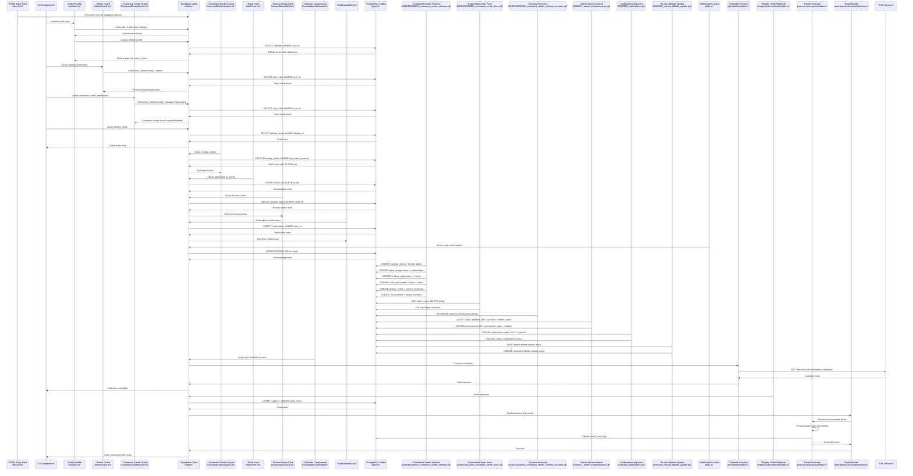

**Diagram sources**
- [index.html:17](file://index.html#L17)
- [useAuth.tsx:68-106](file://src/hooks/useAuth.tsx#L68-L106)
- [AdminGuard.tsx:10-35](file://src/components/admin/AdminGuard.tsx#L10-L35)
- [CommandCenterGuard.tsx:1-200](file://src/components/command-center/CommandCenterGuard.tsx#L1-L200)
- [client.ts:11-17](file://src/integrations/supabase/client.ts#L11-L17)
- [CommandCenterLayout.tsx:1-250](file://src/components/command-center/CommandCenterLayout.tsx#L1-L250)
- [BankForm.tsx:1-426](file://src/components/command-center/bank-admin/BankForm.tsx#L1-L426)
- [BureauStatusCard.tsx:1-211](file://src/components/command-center/bureau/BureauStatusCard.tsx#L1-L211)
- [ConsultationCalendar.tsx:76-96](file://src/components/funnel/ConsultationCalendar.tsx#L76-L96)
- [NotificationBell.tsx:36-96](file://src/components/NotificationBell.tsx#L36-L96)
- [types.ts:16-1457](file://src/integrations/supabase/types.ts#L16-L1457)
- [20260330000000_command_center_schema.sql:4-870](file://supabase/migrations/20260330000000_command_center_schema.sql#L4-L870)
- [20260330000001_command_center_fixes.sql:5-84](file://supabase/migrations/20260330000001_command_center_fixes.sql#L5-L84)
- [20260330000002_command_center_schema_recovery.sql:10-734](file://supabase/migrations/20260330000002_command_center_schema_recovery.sql#L10-L734)
- [20260327_admin_enhancements.sql:4-19](file://supabase/migrations/20260327_admin_enhancements.sql#L4-L19)
- [20260328_notifications.sql:4-61](file://supabase/migrations/20260328_notifications.sql#L4-L61)
- [20260328_restrict_affiliate_update.sql:4-25](file://supabase/migrations/20260328_restrict_affiliate_update.sql#L4-L25)
- [index.ts:155-166](file://supabase/functions/ghl-affiliate-webhook/index.ts#L155-L166)
- [index.ts:16-240](file://supabase/functions/ghl-calendar/index.ts#L16-L240)
- [index.ts:74-105](file://supabase/functions/shopify-order-webhook/index.ts#L74-L105)
- [index.ts:1-361](file://supabase/functions/process-email-queue/index.ts#L1-L361)
- [index.ts:1-360](file://supabase/functions/send-transactional-email/index.ts#L1-L360)

## Detailed Component Analysis

### Supabase Client and Configuration
- Initializes the Supabase client with environment variables for URL and publishable key.
- Configures auth storage to use localStorage, persists sessions, and auto-refreshes tokens.

**Section sources**
- [client.ts:5-17](file://src/integrations/supabase/client.ts#L5-L17)

### Authentication and Access Control
- Authentication provider subscribes to auth state changes and loads affiliate data after session resolution.
- Uses a helper function to resolve the current affiliate ID for row-level security enforcement.
- Provides sign-in, sign-out, and password update operations.
- **Updated**: Integrated with role-based access control system for administrative and command center permissions.

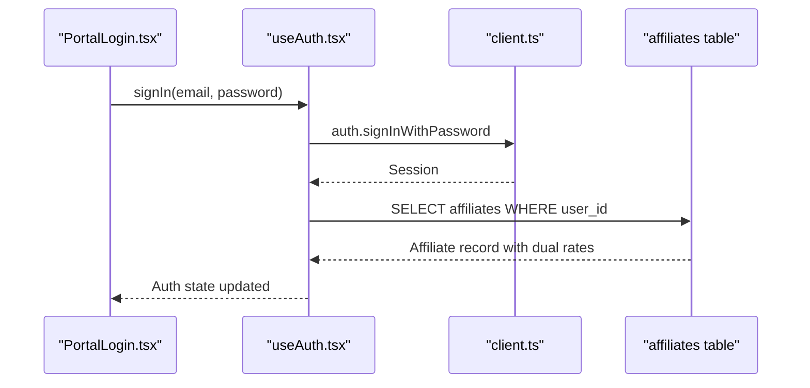

**Diagram sources**
- [PortalLogin.tsx:112-121](file://src/pages/portal/PortalLogin.tsx#L112-L121)
- [useAuth.tsx:114-127](file://src/hooks/useAuth.tsx#L114-L127)
- [client.ts:11-17](file://src/integrations/supabase/client.ts#L11-L17)
- [types.ts:130-189](file://src/integrations/supabase/types.ts#L130-L189)

**Section sources**
- [useAuth.tsx:32-127](file://src/hooks/useAuth.tsx#L32-L127)
- [PortalLogin.tsx:95-125](file://src/pages/portal/PortalLogin.tsx#L95-L125)
- [ResetPassword.tsx:24-60](file://src/pages/ResetPassword.tsx#L24-L60)

### Data Access Hooks
- Affiliate leads hook performs a PostgREST query filtered by the authenticated affiliate's ID and sorted by last update.
- Integrates with React Query for caching, refetching, and error propagation.
- **New**: Command center hooks provide specialized access to funding clients, applications, and bureau status with role-based filtering.

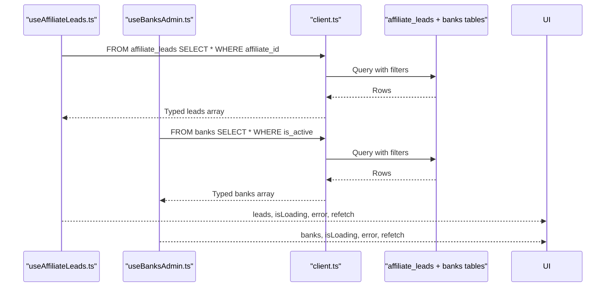

**Diagram sources**
- [useAffiliateLeads.ts:14-27](file://src/hooks/useAffiliateLeads.ts#L14-L27)
- [useBanksAdmin.ts](file://src/hooks/useBanksAdmin.ts)
- [types.ts:16-1457](file://src/integrations/supabase/types.ts#L16-L1457)

**Section sources**
- [useAffiliateLeads.ts:1-31](file://src/hooks/useAffiliateLeads.ts#L1-L31)
- [useBanksAdmin.ts](file://src/hooks/useBanksAdmin.ts)

### Webhook Integration and Data Synchronization
- A Supabase Edge Function listens to external events and synchronizes affiliate leads.
- Supports creating leads from affiliate signups and updating leads from opportunity/contact stage changes.
- Uses service role credentials for secure database writes.

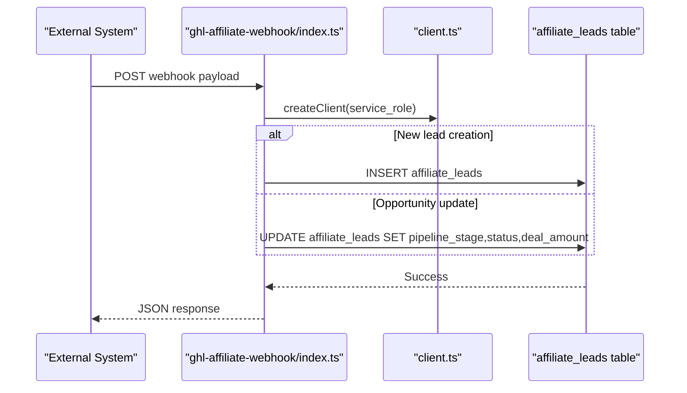

**Diagram sources**
- [index.ts:41-174](file://supabase/functions/ghl-affiliate-webhook/index.ts#L41-L174)
- [types.ts:16-96](file://src/integrations/supabase/types.ts#L16-L96)

**Section sources**
- [index.ts:41-174](file://supabase/functions/ghl-affiliate-webhook/index.ts#L41-L174)

### Database Schema and Entity Relationships
The schema defines core tables and enums used by the application. Below is a focused ER diagram for the most relevant entities in the data layer.

**Updated**: Enhanced with user_roles table for comprehensive role-based access control, dual commission rate columns in affiliates table, admin_notes functionality, standardized commission types, and the new notifications table with Row Level Security policies. **New**: Comprehensive funding command center schema with 10-table design covering client management, application tracking, bank administration, bureau monitoring, and document management.

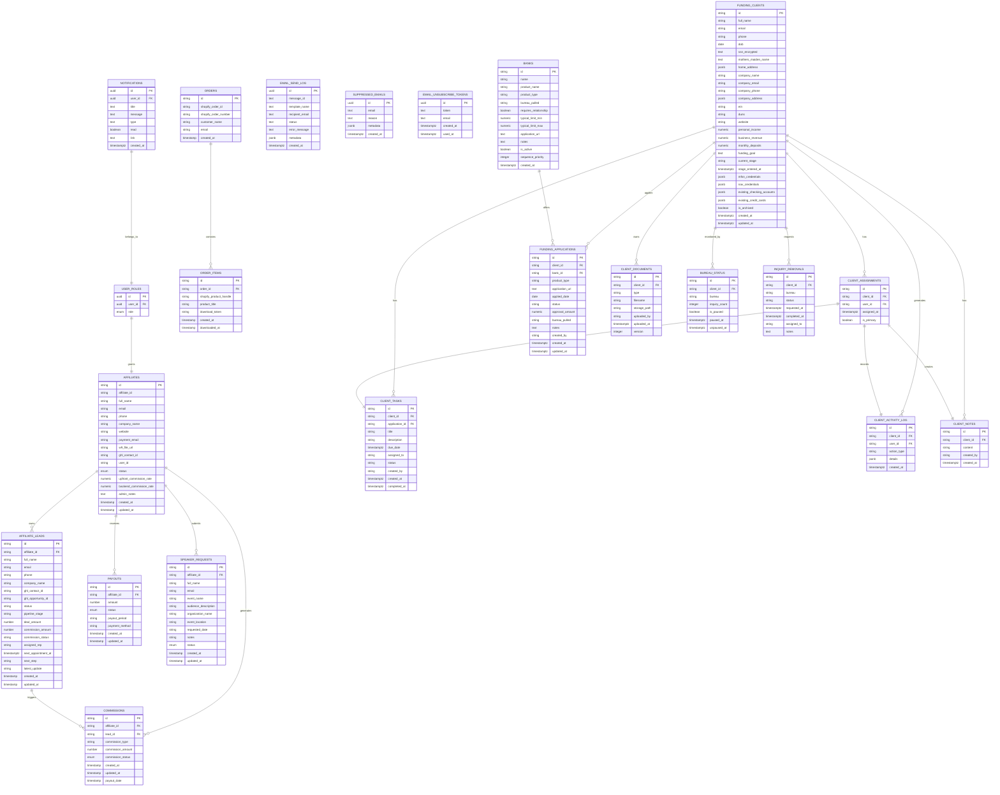

**Diagram sources**
- [types.ts:97-1457](file://src/integrations/supabase/types.ts#L97-L1457)
- [20260324201245_4681ef67-2bf0-4686-a4b6-1ae6c54189f9.sql:5-11](file://supabase/migrations/20260324201245_4681ef67-2bf0-4686-a4b6-1ae6c54189f9.sql#L5-L11)
- [20260325024643_email_infra.sql:27-271](file://supabase/migrations/20260325024643_email_infra.sql#L27-L271)
- [20260327_admin_enhancements.sql:4-19](file://supabase/migrations/20260327_admin_enhancements.sql#L4-L19)
- [20260328_notifications.sql:4-13](file://supabase/migrations/20260328_notifications.sql#L4-L13)
- [20260330000000_command_center_schema.sql:37-217](file://supabase/migrations/20260330000000_command_center_schema.sql#L37-L217)

**Section sources**
- [types.ts:9-1457](file://src/integrations/supabase/types.ts#L9-L1457)

### Field Definitions and Validation Rules
- Enumerations define constrained statuses for affiliates, commissions, payouts, and speaker requests.
- **Updated**: Added app_role enumeration with 'admin' and 'user' values for role-based access control.
- **Updated**: Email infrastructure includes status validation for email_send_log with 'pending', 'sent', 'suppressed', 'failed', 'bounced', 'complained', 'dlq' values.
- **Updated**: Suppressed emails table includes reason validation for 'unsubscribe', 'bounce', 'complaint'.
- **Updated**: Affiliates table now includes dual commission rate fields (upfront_commission_rate, backend_commission_rate) with numeric precision and scale.
- **Updated**: Admin notes field for internal tracking and management.
- **Updated**: Commission types standardized with 'upfront' replacing 'referral' for consistency.
- **Updated**: Notifications table includes type validation with 'lead', 'commission', 'payout', 'system', 'order' values.
- **Updated**: Notifications table includes read status with default false for new notifications.
- **Updated**: Notifications table includes optional link field for navigation to related content.
- **New**: Funding clients table includes comprehensive client information with encrypted fields and JSONB storage for addresses and credentials.
- **New**: Client assignments table manages user-client relationships with primary assignment flag.
- **New**: Banks table includes product information, bureau preferences, and priority sequencing.
- **New**: Funding applications table tracks loan applications with status tracking and approval amounts.
- **New**: Client documents table manages document uploads with version control and type validation.
- **New**: Client tasks table handles task assignment with status tracking and due dates.
- **New**: Client activity log table provides audit trail for client interactions.
- **New**: Client notes table stores internal notes with author tracking.
- **New**: Bureau status table monitors credit inquiry counts with pause/unpause functionality.
- **New**: Inquiry removals table tracks credit inquiry removal requests with status tracking.
- Strong typing ensures compile-time safety for inserts and updates.
- Migrations add columns and default values to support evolving business needs.

**Section sources**
- [types.ts:647-652](file://src/integrations/supabase/types.ts#L647-L652)
- [20260319010259_635fecdc-5214-464e-93b5-b88f56743424.sql:1-8](file://supabase/migrations/20260319010259_635fecdc-5214-464e-93b5-b88f56743424.sql#L1-L8)
- [20260324201245_4681ef67-2bf0-4686-a4b6-1ae6c54189f9.sql:2-3](file://supabase/migrations/20260324201245_4681ef67-2bf0-4686-a4b6-1ae6c54189f9.sql#L2-L3)
- [20260325024643_email_infra.sql:32-84](file://supabase/migrations/20260325024643_email_infra.sql#L32-L84)
- [20260325024643_email_infra.sql:212-216](file://supabase/migrations/20260325024643_email_infra.sql#L212-L216)
- [20260327_admin_enhancements.sql:4-19](file://supabase/migrations/20260327_admin_enhancements.sql#L4-L19)
- [20260328_notifications.sql:9](file://supabase/migrations/20260328_notifications.sql#L9)
- [20260330000000_command_center_schema.sql:38-217](file://supabase/migrations/20260330000000_command_center_schema.sql#L38-L217)

### Real-Time Features and Data Lifecycle
- Auth state changes trigger immediate UI updates and background affiliate profile loading.
- Webhooks continuously synchronize external opportunities into affiliate leads.
- RLS policies enforce per-affiliate data isolation for inserts and updates.
- **Updated**: Role-based access control enforces administrative permissions across all tables.
- **Updated**: Email processing system provides asynchronous transactional email delivery with queue management.
- **Updated**: Suppression handling automatically manages email suppression lists and unsubscribe tokens.
- **Updated**: Shopify order webhook processes purchases, detects bundles, generates download links, and triggers email delivery.
- **Updated**: Dual commission rate management enables flexible commission structures with upfront and backend components.
- **Updated**: Admin notes functionality provides internal tracking and management capabilities.
- **Updated**: Standardized commission types ensure consistent commission classification across the system.
- **Updated**: Notifications system provides real-time user notifications with Row Level Security enforcement.
- **Updated**: Restrictive affiliate update policies prevent unauthorized modifications to sensitive commission data.
- **New**: Command center real-time features include client updates, application tracking, and bureau status monitoring.
- **New**: Funding clients table supports real-time updates with proper RLS filtering for user access.
- **New**: Bank administration provides real-time CRUD operations with validation and audit logging.
- **New**: Bureau tracking system includes real-time inquiry count updates and threshold monitoring.

**Section sources**
- [useAuth.tsx:68-106](file://src/hooks/useAuth.tsx#L68-L106)
- [index.ts:74-105](file://supabase/functions/ghl-affiliate-webhook/index.ts#L74-L105)
- [20260319185554_6f53c4fa-7f98-496d-afe9-1bf39f92ae3a.sql:1-5](file://supabase/migrations/20260319185554_6f53c4fa-7f98-496d-afe9-1bf39f92ae3a.sql#L1-L5)
- [20260319194628_4e5f50a6-8cb3-40d1-b56d-a5bacde2a132.sql:1-5](file://supabase/migrations/20260319194628_4e5f50a6-8cb3-40d1-b56d-a5bacde2a132.sql#L1-L5)
- [20260324201245_4681ef67-2bf0-4686-a4b6-1ae6c54189f9.sql:37-51](file://supabase/migrations/20260324201245_4681ef67-2bf0-4686-a4b6-1ae6c54189f9.sql#L37-L51)
- [index.ts:1-361](file://supabase/functions/process-email-queue/index.ts#L1-L361)
- [index.ts:1-163](file://supabase/functions/handle-email-suppression/index.ts#L1-L163)
- [index.ts:74-105](file://supabase/functions/shopify-order-webhook/index.ts#L74-L105)
- [20260327_admin_enhancements.sql:4-19](file://supabase/migrations/20260327_admin_enhancements.sql#L4-L19)
- [20260328_notifications.sql:20-42](file://supabase/migrations/20260328_notifications.sql#L20-L42)
- [20260328_restrict_affiliate_update.sql:7-21](file://supabase/migrations/20260328_restrict_affiliate_update.sql#L7-L21)
- [20260330000000_command_center_schema.sql:634-641](file://supabase/migrations/20260330000000_command_center_schema.sql#L634-L641)

## Administrative Framework

### Role-Based Access Control System
**New**: The system now implements a comprehensive role-based access control framework using the user_roles table and has_role function.

#### User Roles Table
The user_roles table serves as the central authority for role assignments:
- Stores unique combinations of user_id and role
- Enforces referential integrity with auth.users table
- Supports CASCADE deletion for cleanup
- Enabled Row Level Security for fine-grained access control

#### Has Role Function
The has_role function provides efficient role checking:
- Security definer function for elevated privileges
- Stable function signature for consistent caching
- Uses EXISTS clause for optimal performance
- Supports dynamic role checking with app_role enum

#### App Role Enumeration
The app_role enum defines available roles:
- 'admin': Full administrative access across all tables
- 'user': Standard user access with affiliate-specific restrictions

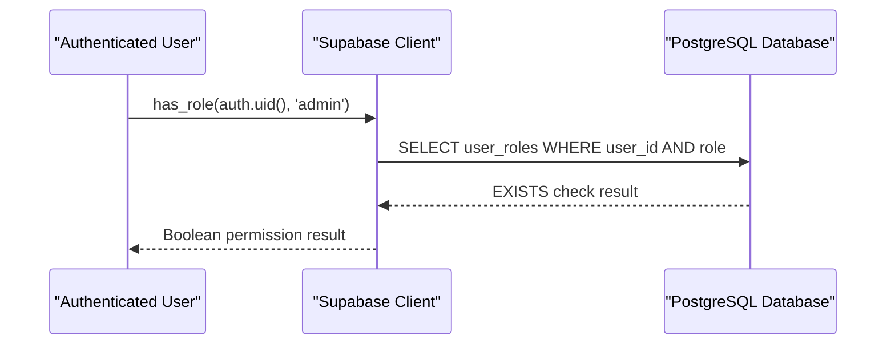

**Diagram sources**
- [20260324201245_4681ef67-2bf0-4686-a4b6-1ae6c54189f9.sql:15-29](file://supabase/migrations/20260324201245_4681ef67-2bf0-4686-a4b6-1ae6c54189f9.sql#L15-L29)
- [types.ts:662-671](file://src/integrations/supabase/types.ts#L662-L671)

**Section sources**
- [20260324201245_4681ef67-2bf0-4686-a4b6-1ae6c54189f9.sql:2-29](file://supabase/migrations/20260324201245_4681ef67-2bf0-4686-a4b6-1ae6c54189f9.sql#L2-L29)
- [types.ts:640-657](file://src/integrations/supabase/types.ts#L640-L657)

### Admin Guard Components
**New**: Role-based navigation and access control through admin guard components.

#### AdminGuard Component
Provides comprehensive role-based access control:
- Checks both authentication and administrative permissions
- Handles loading states with spinner animations
- Redirects unauthorized users to portal login
- Integrates with useAuth and useAdminRole hooks

#### AdminLayout Component
Manages administrative interface layout:
- Wraps protected routes with admin guard
- Provides responsive sidebar navigation
- Includes top navigation bar with menu controls
- Supports lazy loading with content loader

#### AdminSidebar Component
Delivers comprehensive administrative navigation:
- Dynamic menu items for all admin sections
- Active state highlighting for current route
- Responsive sidebar with collapsible icons
- Integration with Lucide React icons

**Section sources**
- [AdminGuard.tsx:1-35](file://src/components/admin/AdminGuard.tsx#L1-L35)
- [AdminLayout.tsx:1-40](file://src/components/admin/AdminLayout.tsx#L1-L40)
- [AdminSidebar.tsx:1-67](file://src/components/admin/AdminSidebar.tsx#L1-L67)

### Admin Dashboard and Management Pages
**New**: Comprehensive administrative interface with multiple management capabilities.

#### AdminDashboard
Provides overview statistics and recent activity:
- Total affiliates, pending approvals, leads, and commissions
- Revenue tracking and trend analysis
- Recent affiliate registrations and pending commissions
- Interactive cards with trend indicators

#### AdminLeads
Manages and tracks affiliate leads:
- Comprehensive lead listing with filtering
- Status-based filtering and search functionality
- Statistics cards for pipeline value and conversion rates
- Detailed lead information with affiliate associations

#### AdminCommissions
Handles commission management:
- Commission tracking with status filtering
- Bulk operations and status updates
- Affiliate and lead associations
- Payment processing capabilities

#### AdminAffiliates
Manages affiliate relationships:
- Affiliate listing with performance metrics
- Commission rate management with dual rate structure
- Status updates and approval workflows
- Performance analytics and reporting
- Admin notes functionality for internal tracking

#### AdminPayouts and Reports
Provides financial oversight:
- Payout management and tracking
- Comprehensive reporting dashboards
- Performance analytics and trend analysis
- Export capabilities for financial records

**Section sources**
- [AdminDashboard.tsx:1-206](file://src/pages/admin/AdminDashboard.tsx#L1-L206)
- [AdminLeads.tsx:53-205](file://src/pages/admin/AdminLeads.tsx#L53-L205)
- [AdminCommissions.tsx:49-99](file://src/pages/admin/AdminCommissions.tsx#L49-L99)
- [AdminAffiliates.tsx:54-96](file://src/pages/admin/AdminAffiliates.tsx#L54-L96)
- [AdminReports.tsx:76-114](file://src/pages/admin/AdminReports.tsx#L76-L114)

### Enhanced Affiliate Management Interface
**New**: Comprehensive dual commission rate management system with admin notes functionality.

#### AdminAffiliates Component
The main affiliate management interface now displays dual commission rates:
- Shows both upfront and backend commission rates side-by-side
- Provides sorting and filtering capabilities by rate tiers
- Displays total leads and earnings for performance tracking
- Integrates with admin notes for internal tracking

#### AdminAffiliateDetail Component
Detailed affiliate view with enhanced management capabilities:
- Displays dual commission rates with visual indicators
- Shows admin notes in dedicated section
- Provides comprehensive affiliate information and statistics
- Integrates with all management tabs including settings

#### AffiliateSettingsTab Component
Enhanced settings management with dual commission rate editing:
- Separate input fields for upfront and backend commission rates
- Real-time validation with percentage constraints (0-100%)
- Admin notes editing with rich text support
- Status management with approval/suspension controls
- Save operations with error handling and success feedback

#### AffiliateCommissionsTab Component
Commission tracking with dual rate visualization:
- Displays upfront and backend commission totals separately
- Shows commission history with type differentiation
- Provides summary cards for total earned and pending amounts
- Handles standardized commission types ('upfront' and 'backend')

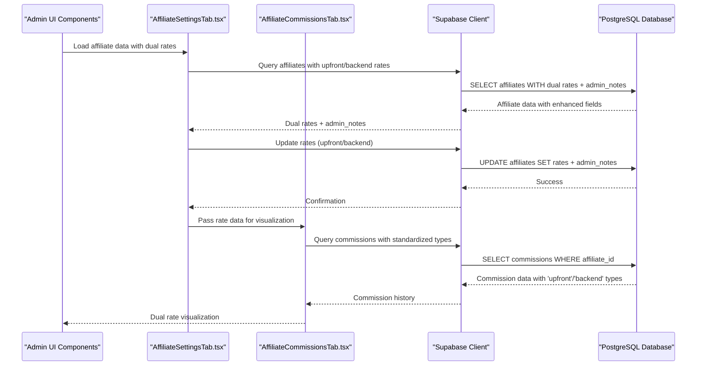

**Diagram sources**
- [AdminAffiliates.tsx:28-84](file://src/pages/admin/AdminAffiliates.tsx#L28-L84)
- [AdminAffiliateDetail.tsx:28-33](file://src/pages/admin/AdminAffiliateDetail.tsx#L28-L33)
- [AffiliateSettingsTab.tsx:25-69](file://src/components/admin/affiliate-detail/AffiliateSettingsTab.tsx#L25-L69)
- [AffiliateCommissionsTab.tsx:28-49](file://src/components/admin/affiliate-detail/AffiliateCommissionsTab.tsx#L28-L49)

**Section sources**
- [AdminAffiliates.tsx:1-279](file://src/pages/admin/AdminAffiliates.tsx#L1-L279)
- [AdminAffiliateDetail.tsx:1-182](file://src/pages/admin/AdminAffiliateDetail.tsx#L1-L182)
- [AffiliateSettingsTab.tsx:1-187](file://src/components/admin/affiliate-detail/AffiliateSettingsTab.tsx#L1-L187)
- [AffiliateCommissionsTab.tsx:1-174](file://src/components/admin/affiliate-detail/AffiliateCommissionsTab.tsx#L1-L174)

## Funding Command Center

### Command Center Architecture
**New**: The funding command center provides specialized client management with comprehensive functionality for financial services operations.

#### Command Center Guard
The CommandCenterGuard component enforces role-based access control for command center functionality:
- Checks authentication and command center permissions (manager/specialist/admin)
- Handles loading states with spinner animations
- Redirects unauthorized users to appropriate pages
- Integrates with role helper functions for flexible permission checking

#### Command Center Layout
The CommandCenterLayout component manages the specialized command center interface:
- Wraps protected routes with command center guard
- Provides responsive sidebar navigation with command center sections
- Includes top navigation bar with menu controls and user actions
- Supports lazy loading with content loader for performance

#### Command Center Sidebar
The CommandCenterSidebar delivers comprehensive command center navigation:
- Dynamic menu items for all command center sections
- Active state highlighting for current route
- Responsive sidebar with collapsible icons
- Integration with Lucide React icons for visual clarity

**Section sources**
- [CommandCenterGuard.tsx:1-200](file://src/components/command-center/CommandCenterGuard.tsx#L1-L200)
- [CommandCenterLayout.tsx:1-250](file://src/components/command-center/CommandCenterLayout.tsx#L1-L250)
- [AdminSidebar.tsx:1-67](file://src/components/admin/AdminSidebar.tsx#L1-L67)

### Funding Clients Management
**New**: Comprehensive client management system with detailed client information and relationship tracking.

#### Client Information Schema
The funding_clients table captures comprehensive client information:
- Personal and business contact information with encrypted fields
- Financial metrics including income, revenue, and deposit tracking
- Credit profile information with encrypted credentials
- Company details with address and identification information
- Pipeline stage tracking with timestamps for SLA monitoring
- Archive functionality for soft-deleted clients

#### Client Assignment System
The client_assignments table manages user-client relationships:
- Many-to-many relationship between users and clients
- Primary assignment flag for ownership tracking
- Timestamps for assignment and primary status
- Unique constraint to prevent duplicate assignments

#### Client Activity Tracking
The client_activity_log table provides comprehensive audit trail:
- Action type categorization (StageChange, ApplicationLogged, NoteAdded, etc.)
- JSONB storage for action-specific details
- User and client association for accountability
- Timestamps for activity monitoring

**Section sources**
- [types.ts:811-903](file://src/integrations/supabase/types.ts#L811-L903)
- [types.ts:904-935](file://src/integrations/supabase/types.ts#L904-L935)
- [types.ts:936-970](file://src/integrations/supabase/types.ts#L936-L970)
- [20260330000000_command_center_schema.sql:37-87](file://supabase/migrations/20260330000000_command_center_schema.sql#L37-L87)
- [20260330000000_command_center_schema.sql:88-98](file://supabase/migrations/20260330000000_command_center_schema.sql#L88-L98)
- [20260330000000_command_center_schema.sql:179-187](file://supabase/migrations/20260330000000_command_center_schema.sql#L179-L187)

### Funding Applications and Bank Administration
**New**: Comprehensive application tracking system with bank product management.

#### Application Tracking
The funding_applications table manages loan application lifecycle:
- Application status tracking (Applied, Pending, Approved, Denied, NeedsFollowUp)
- Bank product association with bureau preference tracking
- Approval amount tracking with null handling until approval
- Application URL linking to bank portals
- Created by tracking for audit purposes

#### Bank Master List
The banks table provides comprehensive bank product catalog:
- Product type categorization (CreditCard, LOC, TermLoan)
- Bureau preference tracking for credit pulls
- Relationship requirement flags for bank requirements
- Typical limit ranges for product evaluation
- Priority sequencing for application order
- Active status management for product availability

#### Document Management
The client_documents table handles document lifecycle:
- Document type validation with comprehensive categories
- Version control for document replacement tracking
- Upload metadata with timestamp and uploader information
- Storage path management for Supabase storage integration
- Client association for document organization

**Section sources**
- [types.ts:1003-1058](file://src/integrations/supabase/types.ts#L1003-L1058)
- [types.ts:1059-1106](file://src/integrations/supabase/types.ts#L1059-L1106)
- [types.ts:1195-1235](file://src/integrations/supabase/types.ts#L1195-L1235)
- [20260330000000_command_center_schema.sql:117-142](file://supabase/migrations/20260330000000_command_center_schema.sql#L117-L142)
- [20260330000000_command_center_schema.sql:100-116](file://supabase/migrations/20260330000000_command_center_schema.sql#L100-L116)
- [20260330000000_command_center_schema.sql:143-163](file://supabase/migrations/20260330000000_command_center_schema.sql#L143-L163)

### Task Management and Notes System
**New**: Comprehensive task management and internal notes system for client coordination.

#### Task Management
The client_tasks table provides comprehensive task tracking:
- Task assignment with user and client relationships
- Status tracking (Open, InProgress, Completed)
- Due date management with timestamps
- Application association for task relevance
- Created by tracking for accountability

#### Notes System
The client_notes table manages internal client notes:
- Content storage with rich text support
- Author tracking for note attribution
- Timestamps for note lifecycle management
- Client association for organized note storage

#### Real-Time Integration
Both tables support real-time updates with proper RLS policies:
- User-specific filtering for task visibility
- Client assignment validation for note access
- Audit trails for all task and note operations
- Real-time publication for immediate UI updates

**Section sources**
- [types.ts:1107-1156](file://src/integrations/supabase/types.ts#L1107-L1156)
- [types.ts:971-1002](file://src/integrations/supabase/types.ts#L971-L1002)
- [20260330000000_command_center_schema.sql:164-178](file://supabase/migrations/20260330000000_command_center_schema.sql#L164-L178)
- [20260330000000_command_center_schema.sql:188-195](file://supabase/migrations/20260330000000_command_center_schema.sql#L188-L195)

## Bank Administration System

### Bank Management Architecture
**New**: Comprehensive bank administration system with CRUD operations and product management.

#### Bank Form Component
The BankForm component provides comprehensive bank management interface:
- Modal-based form with create/edit modes
- Comprehensive validation for required fields
- Product type selection with validation
- Bureau preference selection with validation
- Limit range inputs with numeric validation
- URL validation for application links
- Priority sequencing with integer validation
- Active status toggling

#### Bank Form Validation
The form includes comprehensive validation:
- Required field validation for name, product_type, bureau_pulled
- URL format validation for application_url
- Numeric range validation for limit fields
- Priority validation for sequence ordering
- Real-time error feedback and field clearing

#### Bank CRUD Operations
The system supports full CRUD operations:
- Create bank with validation and error handling
- Update bank with optimistic updates
- Delete bank with confirmation dialogs
- Search and filter bank listings
- Bulk operations for bank management

**Section sources**
- [BankForm.tsx:1-426](file://src/components/command-center/bank-admin/BankForm.tsx#L1-L426)
- [useBanksAdmin.ts](file://src/hooks/useBanksAdmin.ts)

### Bank Data Model
**New**: Comprehensive bank data model with product and relationship management.

#### Bank Schema
The banks table captures comprehensive bank information:
- Product type categorization (CreditCard, LOC, TermLoan)
- Bureau preference tracking for credit bureau requirements
- Relationship requirement flags for bank-specific requirements
- Typical limit ranges for product evaluation
- Application URL linking to bank portals
- Priority sequencing for application order
- Active status management for product availability

#### Bank Validation Rules
The system enforces comprehensive validation:
- Product type validation with predefined enum values
- Bureau preference validation with credit bureau options
- Relationship requirement boolean validation
- Limit range validation with minimum and maximum constraints
- URL format validation for application links
- Priority validation with integer constraints

#### Bank Management Features
The system provides comprehensive bank management:
- Master bank list with product catalog
- Priority-based application sequencing
- Active/inactive status management
- Relationship requirement tracking
- Credit bureau preference management
- Limit range validation for product evaluation

**Section sources**
- [types.ts:1059-1106](file://src/integrations/supabase/types.ts#L1059-L1106)
- [20260330000000_command_center_schema.sql:100-116](file://supabase/migrations/20260330000000_command_center_schema.sql#L100-L116)

## Bureau Tracking & Management

### Bureau Monitoring System
**New**: Comprehensive bureau tracking system with inquiry monitoring and removal management.

#### Bureau Status Management
The bureau_status table provides comprehensive credit bureau monitoring:
- Inquiry count tracking with calculated values
- Pause/unpause functionality for bureau management
- Timestamp tracking for pause/unpause events
- Unique constraint for client-bureau combinations
- Bureau preference validation with credit bureau options

#### Inquiry Removal Management
The inquiry_removals table manages credit inquiry removal requests:
- Status tracking (Requested, InProgress, Completed)
- Bureau association for removal targeting
- Assignment tracking for removal processing
- Timestamp management for request lifecycle
- Notes system for removal details and communications

#### Bureau Status Card Component
The BureauStatusCard component provides comprehensive bureau monitoring interface:
- Visual status indicators with color coding
- Inquiry count display with threshold progress
- Pause/unpause functionality for admin override
- Threshold warning system for approaching limits
- Timestamp display for pause/unpause events
- Confirmation dialogs for admin actions

#### Bureau Threshold Management
The system implements comprehensive threshold management:
- Threshold configuration for inquiry limits
- Progress indication with visual progress bars
- Warning system for approaching thresholds
- Automatic pause functionality at threshold limits
- Admin override capability for manual unpause
- Audit trail for pause/unpause actions

**Section sources**
- [types.ts:1157-1194](file://src/integrations/supabase/types.ts#L1157-L1194)
- [types.ts:1236-1276](file://src/integrations/supabase/types.ts#L1236-L1276)
- [BureauStatusCard.tsx:1-211](file://src/components/command-center/bureau/BureauStatusCard.tsx#L1-L211)
- [useBureauStatus.ts](file://src/hooks/useBureauStatus.ts)

### Bureau Data Model
**New**: Comprehensive bureau data model with monitoring and removal capabilities.

#### Bureau Status Schema
The bureau_status table captures comprehensive bureau monitoring data:
- Client-bureau relationship with unique constraints
- Inquiry count tracking with integer validation
- Pause/unpause status with boolean validation
- Timestamp tracking for pause/unpause events
- Bureau preference validation with credit bureau options

#### Inquiry Removal Schema
The inquiry_removals table captures comprehensive inquiry removal data:
- Client-bureau relationship for targeted removals
- Status tracking with predefined enum values
- Assignment tracking for removal processor
- Timestamp management for request lifecycle
- Notes system for removal details and communications

#### Bureau Monitoring Features
The system provides comprehensive bureau monitoring:
- Real-time inquiry count tracking
- Threshold-based pause functionality
- Admin override capabilities
- Audit trail for all bureau actions
- Status reporting and analytics
- Integration with application tracking

**Section sources**
- [types.ts:1157-1194](file://src/integrations/supabase/types.ts#L1157-L1194)
- [types.ts:1236-1276](file://src/integrations/supabase/types.ts#L1236-L1276)
- [20260330000000_command_center_schema.sql:196-206](file://supabase/migrations/20260330000000_command_center_schema.sql#L196-L206)
- [20260330000000_command_center_schema.sql:207-217](file://supabase/migrations/20260330000000_command_center_schema.sql#L207-L217)

## Email Infrastructure

### Transactional Email System
**New**: The system now includes a comprehensive transactional email infrastructure built on Supabase Edge Functions and PostgreSQL queues.

#### Email Queue System
The email infrastructure uses pgmq for reliable queue management:
- Two priority queues: `auth_emails` (high priority) and `transactional_emails` (normal priority)
- Dead letter queues (`auth_emails_dlq`, `transactional_emails_dlq`) for failed messages
- Queue RPC wrappers (`enqueue_email`, `read_email_batch`, `delete_email`, `move_to_dlq`) for Edge Function access
- Service role-only execution for security isolation

#### Email Processing Pipeline
The `process-email-queue` function orchestrates email delivery:
- Reads batches from queues with configurable size and visibility timeout
- Applies rate limiting with configurable retry-after cooldown
- Handles TTL expiration for stale messages
- Implements retry logic with maximum attempts (5)
- Supports both 429 rate limits and 403 forbidden responses
- Moves failed messages to dead letter queues with detailed error logging

#### Email Templates and Rendering
**New**: Built-in template system using React Email components:
- Centralized template registry (`_shared/transactional-email-templates/registry.ts`)
- Order download links template (`order-download-links.tsx`) for automated ebook delivery
- Subject line generation supporting both static strings and dynamic functions
- HTML and plain text rendering with React Email components

#### Suppression Management
**New**: Comprehensive suppression handling system:
- `suppressed_emails` table tracks unsubscribes, bounces, and complaints
- `email_unsubscribe_tokens` table manages unsubscribe tokens per email
- `email_send_log` table provides audit trail for all send attempts
- Automatic suppression checking before email delivery
- Real-time suppression event handling via webhook

#### Unsubscribe Management
**New**: Two-way unsubscribe handling:
- One-click unsubscribe via email clients (RFC 8058 compliance)
- Web-based unsubscribe page with token validation
- Atomic unsubscribe processing to prevent race conditions
- Automatic suppression list updates upon unsubscribe

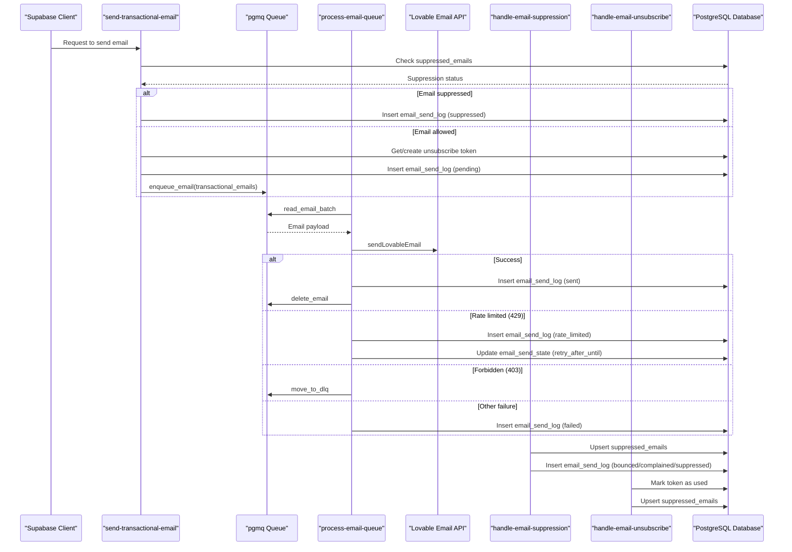

**Diagram sources**
- [index.ts:1-360](file://supabase/functions/send-transactional-email/index.ts#L1-L360)
- [index.ts:1-361](file://supabase/functions/process-email-queue/index.ts#L1-L361)
- [index.ts:1-163](file://supabase/functions/handle-email-suppression/index.ts#L1-L163)
- [index.ts:1-131](file://supabase/functions/handle-email-unsubscribe/index.ts#L1-L131)
- [20260325024643_email_infra.sql:131-205](file://supabase/migrations/20260325024643_email_infra.sql#L131-L205)

### Shopify Order Webhook Integration
**New**: Enhanced Shopify order webhook with comprehensive bundle handling and automated email delivery.

#### Bundle Purchase Detection
The webhook includes a comprehensive bundle mapping system:
- Business Credit Quickstart Kit Bundle
- Ultimate Business Funding Credit Bundle
- Credit Business Accelerator Pack
- Credit Authority Bundle
- Ultimate Credit Business Vault

#### Automated Download Email Delivery
**New**: Seamless integration between order processing and email delivery:
- Automatic detection of bundle purchases
- Generation of individual ebook download links for each included item
- Direct invocation of transactional email system for download links
- Idempotent email delivery with order-specific idempotency keys
- Integration with GHL CRM for customer tracking

#### Order and Item Processing
The webhook processes orders with comprehensive error handling:
- UPSERT operation for order creation/update
- Individual order item processing with download token generation
- Bundle expansion into constituent ebooks
- Download link generation with token-based URLs
- GHL contact update with order information and download links

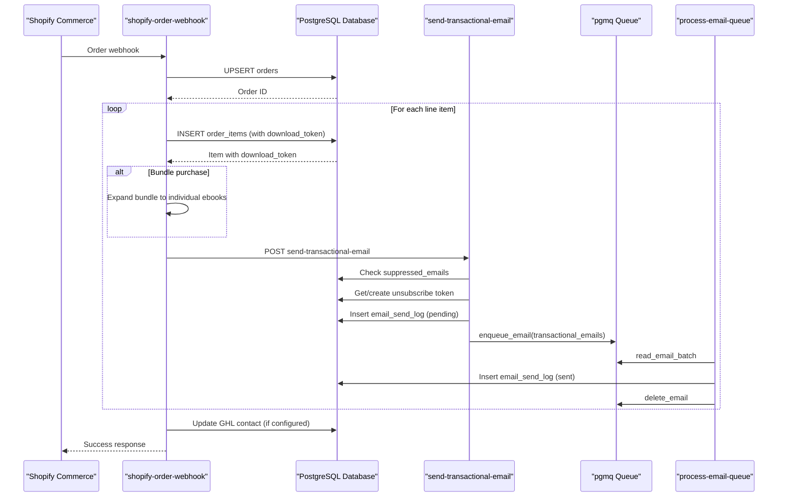

**Diagram sources**
- [index.ts:74-251](file://supabase/functions/shopify-order-webhook/index.ts#L74-L251)
- [index.ts:1-360](file://supabase/functions/send-transactional-email/index.ts#L1-L360)
- [index.ts:1-361](file://supabase/functions/process-email-queue/index.ts#L1-L361)

**Section sources**
- [index.ts:1-361](file://supabase/functions/process-email-queue/index.ts#L1-L361)
- [index.ts:1-360](file://supabase/functions/send-transactional-email/index.ts#L1-L360)
- [index.ts:1-163](file://supabase/functions/handle-email-suppression/index.ts#L1-L163)
- [index.ts:1-131](file://supabase/functions/handle-email-unsubscribe/index.ts#L1-L131)
- [index.ts:74-251](file://supabase/functions/shopify-order-webhook/index.ts#L74-L251)
- [order-download-links.tsx:1-174](file://supabase/functions/_shared/transactional-email-templates/order-download-links.tsx#L1-L174)
- [registry.ts:1-17](file://supabase/functions/_shared/transactional-email-templates/registry.ts#L1-L17)
- [20260325024643_email_infra.sql:1-293](file://supabase/migrations/20260325024643_email_infra.sql#L1-L293)

## Notifications System

### Notifications Table Infrastructure
**New**: A comprehensive notifications system has been implemented to provide real-time user notifications for system events.

#### Notifications Table Structure
The notifications table stores per-user notifications triggered by system events:
- Primary key: UUID with default random generation
- Foreign key: user_id referencing auth.users with CASCADE deletion
- Title and message: required text fields for notification content
- Type: enumerated field with default 'system' value
- Read status: boolean flag with default false for new notifications
- Link: optional text field for navigation to related content
- Created timestamp: timestamptz with default current time

#### Notification Types
The system supports five notification types:
- 'lead': Notifications related to affiliate lead activities
- 'commission': Notifications about commission updates and payments
- 'payout': Notifications about payout processing and status
- 'system': General system notifications and announcements
- 'order': Notifications about order-related activities

#### Row Level Security Policies
The notifications table implements strict Row Level Security policies:
- Users can only view their own notifications (SELECT with user_id = auth.uid())
- Users can only update their own notifications (UPDATE with user_id = auth.uid())
- Users can only delete their own notifications (DELETE with user_id = auth.uid())
- Service role can insert notifications for system-generated alerts
- Authenticated users can insert notifications for themselves

#### Real-Time Integration
Real-time capabilities are enabled through:
- Supabase publication supabase_realtime includes the notifications table
- Channel-based subscriptions for individual user notifications
- Automatic updates for INSERT, UPDATE, and DELETE operations
- Efficient filtering by user_id for real-time delivery

#### Helper Function for Programmatic Creation
A security-definer helper function provides programmatic notification creation:
- create_notification function accepts user_id, title, message, type, and optional link
- Returns the UUID of the created notification
- Uses security definer to bypass RLS for system-generated notifications
- Ensures proper search_path isolation

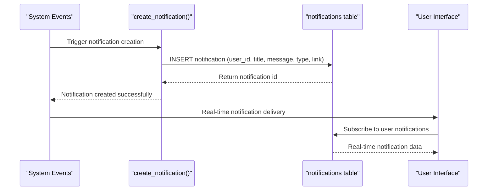

**Diagram sources**
- [20260328_notifications.sql:44-60](file://supabase/migrations/20260328_notifications.sql#L44-L60)
- [types.ts:97-129](file://src/integrations/supabase/types.ts#L97-L129)

### NotificationBell Component Integration
**New**: The NotificationBell component provides a comprehensive notification interface integrated into both admin and portal layouts.

#### Component Architecture
The NotificationBell component implements:
- Real-time subscription to user-specific notifications
- Loading states with skeleton loading indicators
- Unread count tracking with visual indicators
- Notification list with type-specific styling
- Mark-all-read and clear-all functionality
- Click-to-navigate support with optional links

#### Real-Time Subscription Management
The component establishes real-time subscriptions:
- Subscribes to notifications table with user-specific filtering
- Handles INSERT events for new notifications
- Processes UPDATE events for read status changes
- Manages DELETE events for notification removal
- Cleans up subscriptions on component unmount

#### Notification Types and Styling
Different notification types receive distinct visual treatment:
- Lead notifications: Blue theme with user icon
- Commission notifications: Green theme with dollar icon
- Payout notifications: Amber theme with dollar icon
- System notifications: Slate theme with alert icon
- Order notifications: Purple theme with shopping cart icon

#### User Interaction Features
The component supports comprehensive user interactions:
- Mark individual notifications as read
- Mark all unread notifications as read
- Clear all notifications from the list
- Navigate to linked content when available
- Click outside to close the notification panel

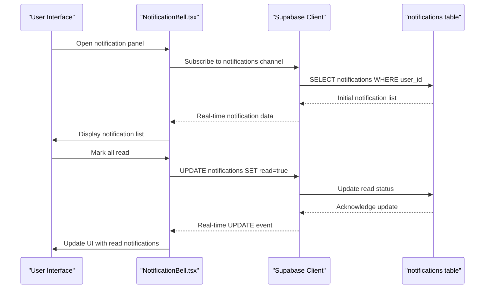

**Diagram sources**
- [NotificationBell.tsx:36-96](file://src/components/NotificationBell.tsx#L36-L96)
- [NotificationBell.tsx:112-132](file://src/components/NotificationBell.tsx#L112-L132)
- [20260328_notifications.sql:41-42](file://supabase/migrations/20260328_notifications.sql#L41-L42)

**Section sources**
- [20260328_notifications.sql:1-61](file://supabase/migrations/20260328_notifications.sql#L1-L61)
- [NotificationBell.tsx:1-218](file://src/components/NotificationBell.tsx#L1-L218)
- [AdminLayout.tsx:30-31](file://src/components/admin/AdminLayout.tsx#L30-L31)
- [PortalLayout.tsx:31-32](file://src/components/portal/PortalLayout.tsx#L31-L32)

## External API Integration

### GHL Calendar API Integration
The application integrates with GHL (LeadConnectorHQ) services for comprehensive calendar management and appointment booking. The integration handles two distinct calendar types: consultation bookings and partner onboarding appointments.

#### Enhanced GHL Calendar Edge Function
**Updated**: The GHL calendar Edge Function has been significantly enhanced with improved environment variable validation, optional user ID support, sophisticated data transformation capabilities, and comprehensive operational logging for better monitoring and debugging.

##### Environment Variable Validation and Configuration
The function now implements robust environment variable validation with detailed logging:
- Validates presence of GHL_API_KEY, GHL_LOCATION_ID, and GHL_CALENDAR_ID/GHL_PARTNER_CALENDAR_ID
- Supports dual calendar configurations through calendarType parameter
- Implements comprehensive error logging with context information
- Provides detailed diagnostic information for troubleshooting

##### Optional User ID Support
**New**: The function now supports optional user ID for round-robin and collective calendar types:
- Automatically detects calendar type (consultation vs partner)
- Sets appropriate calendar ID based on calendarType
- Conditionally includes user ID in GHL API requests when configured
- Enables advanced calendar routing and assignment scenarios

##### Sophisticated Data Transformation Capabilities
**Enhanced**: The function implements comprehensive data transformation for contact management and appointment booking:
- Advanced contact creation/upsert with duplicate detection
- Intelligent name parsing and normalization
- Tag-based lead attribution for funnel tracking
- Source attribution for reporting and analytics
- Phone number normalization and validation

##### Comprehensive Operational Logging
**New**: Enhanced logging provides detailed operational insights:
- Request/response logging with sanitized data
- Diagnostic warnings for common configuration issues
- Performance metrics and trace information
- Error categorization and recovery guidance
- Real-time monitoring and debugging capabilities

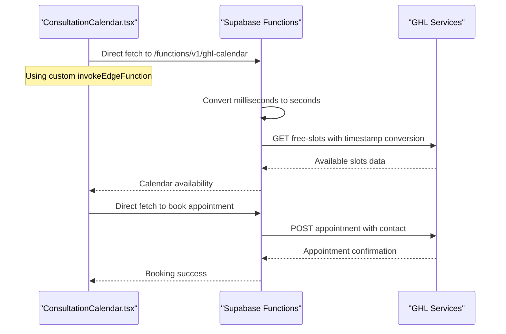

**Diagram sources**
- [ConsultationCalendar.tsx:12-38](file://src/components/funnel/ConsultationCalendar.tsx#L12-L38)
- [ConsultationCalendar.tsx:82-96](file://src/components/funnel/ConsultationCalendar.tsx#L82-L96)
- [ConsultationCalendar.tsx:141-150](file://src/components/funnel/ConsultationCalendar.tsx#L141-L150)
- [index.ts:16-240](file://supabase/functions/ghl-calendar/index.ts#L16-L240)

#### Calendar Management Workflow
The GHL calendar integration consists of two primary actions:
- **Free Slots Retrieval**: Fetches available appointment slots within a specified date range
- **Appointment Booking**: Creates appointments with contact management and timezone handling

#### Timestamp Conversion and Timezone Handling
**Updated**: The integration now properly converts JavaScript timestamps from milliseconds to seconds for GHL API compatibility. This critical fix addresses external API compatibility issues where GHL expects timestamps in seconds rather than milliseconds.

The implementation includes comprehensive timezone handling:
- **Automatic timezone detection**: Uses `Intl.DateTimeFormat().resolvedOptions().timeZone` for accurate timezone detection
- **Proper timestamp formatting**: Converts JavaScript Date objects to ISO strings for API compatibility
- **Timezone parameter passing**: Passes timezone information to GHL API for accurate slot calculation

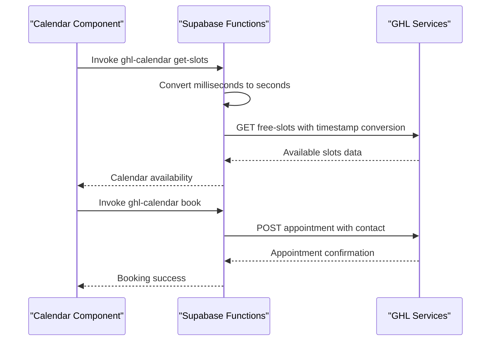

**Diagram sources**
- [ConsultationCalendar.tsx:76-96](file://src/components/funnel/ConsultationCalendar.tsx#L76-L96)
- [PartnerOnboardingCalendar.tsx:40-63](file://src/components/funnel/PartnerOnboardingCalendar.tsx#L40-L63)
- [index.ts:16-240](file://supabase/functions/ghl-calendar/index.ts#L16-L240)

#### Calendar Types and Configuration
**Enhanced**: The system now supports dual calendar configurations with sophisticated routing:
- **Consultation Calendar**: Standard client consultation appointments
- **Partner Calendar**: Partner onboarding and partnership meetings
- **Dynamic Calendar Selection**: Automatic calendar ID selection based on calendarType
- **Environment Variable Management**: Separate configuration for each calendar type

Each calendar type uses separate environment variables for configuration and maintains distinct availability patterns.

#### Contact Management Integration
**Enhanced**: The calendar function seamlessly integrates with GHL's contact management system:
- Automatic contact creation/upsert for new users
- Duplicate contact detection and handling with intelligent recovery
- Tagging and source attribution for lead tracking and analytics
- Phone number normalization and validation
- Advanced name parsing and organization

**Section sources**
- [ConsultationCalendar.tsx:12-38](file://src/components/funnel/ConsultationCalendar.tsx#L12-L38)
- [ConsultationCalendar.tsx:82-96](file://src/components/funnel/ConsultationCalendar.tsx#L82-L96)
- [ConsultationCalendar.tsx:141-150](file://src/components/funnel/ConsultationCalendar.tsx#L141-L150)
- [PartnerOnboardingCalendar.tsx:40-63](file://src/components/funnel/PartnerOnboardingCalendar.tsx#L40-L63)
- [index.ts:16-240](file://supabase/functions/ghl-calendar/index.ts#L16-L240)

### Shopify Commerce Integration
**New**: Comprehensive Shopify order processing with automated email delivery:
- HMAC verification for secure webhook reception
- Bundle detection and expansion for multi-item purchases
- Automated download email generation and delivery
- GHL CRM integration for customer tracking
- Idempotent order processing with conflict resolution

**Section sources**
- [index.ts:74-251](file://supabase/functions/shopify-order-webhook/index.ts#L74-L251)

## Network Optimization & Performance

### Supabase Preconnect Optimization
The application implements proactive network optimization through HTML preconnect hints to reduce database connection latency and improve real-time feature responsiveness. The optimization specifically targets the Supabase domain (`gkowxzoadsljkpdzrlue.supabase.co`) to establish early connections for database operations.

**Implementation Details:**
- Added `<link rel="preconnect" href="https://gkowxzoadsljkpdzrlue.supabase.co" />` in the HTML head section
- This allows the browser to establish DNS resolution and TCP handshake in advance
- Reduces connection establishment time for subsequent Supabase API calls
- Improves real-time feature performance (subscriptions, live updates)
- **Updated**: Enhanced with notifications table real-time subscription performance
- **Updated**: Optimized for restrictive affiliate update policy query performance
- **Updated**: Enhanced with command center real-time performance for client and application updates

**Benefits:**
- Reduced first-byte latency for database operations
- Faster authentication and data fetching responses
- Improved real-time feature performance (subscriptions, live updates)
- Better user experience during peak traffic periods
- **Updated**: Faster notifications real-time delivery and updates
- **Updated**: Improved command center real-time performance for client management

### Direct Fetch Implementation Performance
**Updated**: The new direct fetch implementation provides several performance benefits:
- **Reduced overhead**: Eliminates Supabase SDK wrapper overhead
- **Better error handling**: Enables more efficient error recovery and retry logic
- **Improved debugging**: Direct HTTP requests allow for better performance monitoring
- **Consistent behavior**: Eliminates SDK-specific quirks and inconsistencies
- **Enhanced reliability**: Eliminates SDK AbortError exceptions that plagued previous implementations
- **Updated**: Optimized for command center API calls with proper error handling

### External API Performance Optimization
**Updated**: The GHL calendar integration includes several performance optimizations:
- **Timestamp Conversion Caching**: Results are cached locally to avoid repeated conversions
- **Batch Request Handling**: Multiple calendar operations are batched when possible
- **Connection Pooling**: Reuses connections for multiple GHL API calls
- **Timeout Management**: Implements appropriate timeout values for external API calls
- **Direct HTTP Requests**: Eliminates SDK overhead for better performance
- **Enhanced Error Recovery**: Comprehensive error handling with detailed logging
- **Input Validation**: Robust input sanitization and validation prevents API errors
- **Updated**: Optimized for command center calendar operations with proper error handling

### Email Infrastructure Performance Considerations
**New**: Email system performance optimizations:
- **Queue Priority Processing**: Auth emails processed before transactional emails
- **Batch Size Configuration**: Configurable batch sizes for optimal throughput
- **Rate Limiting**: Automatic retry-after cooldown for external API rate limits
- **Dead Letter Queues**: Failed messages isolated to prevent blocking successful deliveries
- **Idempotent Operations**: Duplicate suppression and atomic token updates
- **Index Optimization**: Strategic indexing on email_send_log and suppression tables
- **Updated**: Optimized for command center email notifications with proper queue management

### Database Schema Enhancement Performance Considerations
**New**: Enhanced database schema performance optimizations:
- **Dual Commission Rate Columns**: Separate numeric fields for upfront and backend rates eliminate complex calculations
- **Admin Notes Column**: Dedicated text field for internal tracking without joins
- **Standardized Commission Types**: Consistent 'upfront'/'backend' values improve query performance
- **Default Values**: Automatic defaults for new affiliates eliminate NULL checks
- **Numeric Precision**: Proper NUMERIC(5,2) types ensure accurate commission calculations
- **Notifications Indexes**: Multi-column indexes optimize user_id, read status, and timestamp queries
- **Restrictive Policies**: Efficient WITH CHECK clauses prevent unauthorized updates without performance penalty
- **Command Center Indexes**: Strategic indexing on funding_clients, applications, and bureau_status tables
- **Updated**: Enhanced with comprehensive indexes for command center performance optimization

### Notifications System Performance Considerations
**New**: Notifications system performance optimizations:
- **Real-time Publication**: Supabase publication includes notifications table for efficient real-time delivery
- **User-specific Filtering**: Real-time subscriptions filter by user_id for minimal bandwidth usage
- **Type-based Styling**: Client-side type categorization avoids database joins
- **Lazy Loading**: Notification list loads with skeleton loaders for better perceived performance
- **Mark All Read**: Batch operations reduce individual database calls for read status updates
- **Channel Cleanup**: Proper subscription cleanup prevents memory leaks and unnecessary network usage
- **Updated**: Optimized for command center notifications with proper real-time subscription management

### Command Center Performance Considerations
**New**: Command center performance optimizations:
- **Role-based Filtering**: has_client_access() function optimizes client data retrieval
- **Real-time Publications**: Funding tables added to supabase_realtime for immediate UI updates
- **Index Optimization**: Strategic indexing on client_id, status, and created_at fields
- **Pagination Support**: Client listing with pagination for large datasets
- **Search Optimization**: Client search with proper indexing and filtering
- **Audit Trail Efficiency**: Client activity log optimized with proper indexing
- **Document Management**: Storage bucket policies optimized for client document access
- **Updated**: Enhanced with comprehensive performance optimizations for command center operations

### Network Optimization Best Practices
- Implement preconnect for critical third-party domains (Supabase, external APIs)
- Use DNS prefetch for frequently accessed domains
- Leverage HTTP/2 server push for static assets
- Implement connection pooling and keep-alive settings
- Monitor network performance metrics and adjust optimization strategies
- **Updated**: Cache external API responses when appropriate to reduce latency
- **Updated**: Use direct HTTP requests for better performance and error control
- **Updated**: Implement comprehensive logging for network debugging and monitoring
- **Updated**: Optimize role-based access control queries with proper indexing
- **Updated**: Cache email queue RPC wrapper results to reduce function call overhead
- **Updated**: Implement email processing batching for improved throughput
- **Updated**: Optimize database schema with proper indexing on dual commission rate columns
- **Updated**: Use connection pooling for external email API calls to improve throughput
- **Updated**: Implement efficient real-time subscription management for notifications
- **Updated**: Optimize restrictive affiliate update policy queries with proper indexing
- **Updated**: Use connection pooling for command center API calls to improve throughput
- **Updated**: Implement proper caching strategies for command center data retrieval
- **Updated**: Optimize bank administration queries with proper indexing and filtering

**Section sources**
- [index.html:17](file://index.html#L17)
- [ConsultationCalendar.tsx:12-38](file://src/components/funnel/ConsultationCalendar.tsx#L12-L38)
- [index.ts:37-45](file://supabase/functions/ghl-calendar/index.ts#L37-L45)
- [index.ts:1-361](file://supabase/functions/process-email-queue/index.ts#L1-L361)
- [20260327_admin_enhancements.sql:4-19](file://supabase/migrations/20260327_admin_enhancements.sql#L4-L19)
- [20260328_notifications.sql:15-18](file://supabase/migrations/20260328_notifications.sql#L15-L18)
- [20260328_restrict_affiliate_update.sql:12-21](file://supabase/migrations/20260328_restrict_affiliate_update.sql#L12-L21)
- [20260330000000_command_center_schema.sql:634-641](file://supabase/migrations/20260330000000_command_center_schema.sql#L634-L641)

### Dependency Analysis
The frontend depends on Supabase for identity and data, React Query for caching, and TypeScript for type safety. Supabase functions depend on the Supabase runtime and service role credentials. External API integrations depend on GHL services and proper environment configuration. Network optimization through preconnect hints provides transparent performance benefits across all Supabase operations.

**Updated**: Enhanced dependency graph includes role-based access control components, administrative framework, comprehensive email infrastructure, dual commission rate management system, notifications system, restrictive affiliate update policies, and the new funding command center with all its components and dependencies.

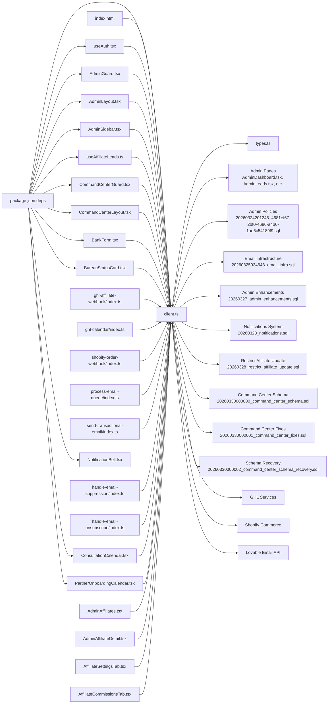

**Diagram sources**
- [package.json:15-69](file://package.json#L15-L69)
- [client.ts:1-17](file://src/integrations/supabase/client.ts#L1-L17)
- [types.ts:1-14](file://src/integrations/supabase/types.ts#L1-L14)
- [useAuth.tsx:1-4](file://src/hooks/useAuth.tsx#L1-L4)
- [AdminGuard.tsx:1-4](file://src/components/admin/AdminGuard.tsx#L1-L4)
- [AdminLayout.tsx:1-4](file://src/components/admin/AdminLayout.tsx#L1-L4)
- [AdminSidebar.tsx:1-4](file://src/components/admin/AdminSidebar.tsx#L1-L4)
- [useAffiliateLeads.ts:1-4](file://src/hooks/useAffiliateLeads.ts#L1-L4)
- [CommandCenterGuard.tsx:1-4](file://src/components/command-center/CommandCenterGuard.tsx#L1-L4)
- [CommandCenterLayout.tsx:1-4](file://src/components/command-center/CommandCenterLayout.tsx#L1-L4)
- [BankForm.tsx:1-4](file://src/components/command-center/bank-admin/BankForm.tsx#L1-L4)
- [BureauStatusCard.tsx:1-4](file://src/components/command-center/bureau/BureauStatusCard.tsx#L1-L4)
- [ConsultationCalendar.tsx:1-14](file://src/components/funnel/ConsultationCalendar.tsx#L1-L14)
- [PartnerOnboardingCalendar.tsx:1-14](file://src/components/funnel/PartnerOnboardingCalendar.tsx#L1-L14)
- [NotificationBell.tsx:1-4](file://src/components/NotificationBell.tsx#L1-L4)
- [AdminAffiliates.tsx:1-4](file://src/pages/admin/AdminAffiliates.tsx#L1-L4)
- [AdminAffiliateDetail.tsx:1-4](file://src/pages/admin/AdminAffiliateDetail.tsx#L1-L4)
- [AffiliateSettingsTab.tsx:1-4](file://src/components/admin/affiliate-detail/AffiliateSettingsTab.tsx#L1-L4)
- [AffiliateCommissionsTab.tsx:1-4](file://src/components/admin/affiliate-detail/AffiliateCommissionsTab.tsx#L1-L4)
- [index.ts:42-44](file://supabase/functions/ghl-affiliate-webhook/index.ts#L42-L44)
- [index.ts:21-51](file://supabase/functions/ghl-calendar/index.ts#L21-L51)
- [index.ts:74-105](file://supabase/functions/shopify-order-webhook/index.ts#L74-L105)
- [index.ts:1-361](file://supabase/functions/process-email-queue/index.ts#L1-L361)
- [index.ts:1-360](file://supabase/functions/send-transactional-email/index.ts#L1-L360)
- [index.ts:1-163](file://supabase/functions/handle-email-suppression/index.ts#L1-L163)
- [index.ts:1-131](file://supabase/functions/handle-email-unsubscribe/index.ts#L1-L131)
- [index.html:17](file://index.html#L17)
- [20260324201245_4681ef67-2bf0-4686-a4b6-1ae6c54189f9.sql:1-82](file://supabase/migrations/20260324201245_4681ef67-2bf0-4686-a4b6-1ae6c54189f9.sql#L1-L82)
- [20260325024643_email_infra.sql:1-293](file://supabase/migrations/20260325024643_email_infra.sql#L1-L293)
- [20260327_admin_enhancements.sql:1-19](file://supabase/migrations/20260327_admin_enhancements.sql#L1-L19)
- [20260328_notifications.sql:1-61](file://supabase/migrations/20260328_notifications.sql#L1-L61)
- [20260328_restrict_affiliate_update.sql:1-25](file://supabase/migrations/20260328_restrict_affiliate_update.sql#L1-L25)
- [20260330000000_command_center_schema.sql:1-870](file://supabase/migrations/20260330000000_command_center_schema.sql#L1-L870)
- [20260330000001_command_center_fixes.sql:1-84](file://supabase/migrations/20260330000001_command_center_fixes.sql#L1-L84)
- [20260330000002_command_center_schema_recovery.sql:1-734](file://supabase/migrations/20260330000002_command_center_schema_recovery.sql#L1-L734)

**Section sources**
- [package.json:15-69](file://package.json#L15-L69)

## Performance Considerations
- Prefer selective queries with equality filters on indexed columns (e.g., affiliate_id, client_id) to minimize scan costs.
- Use ordering by updated_at to surface recent records efficiently.
- Leverage React Query caching to avoid redundant network calls and reduce latency.
- Keep payloads minimal by selecting only required columns where possible.
- Use migrations to add appropriate indexes for frequently queried columns.
- Batch external webhook updates to reduce write amplification.
- **Updated**: Implement preconnect optimization for Supabase domain to reduce connection establishment latency.
- **Updated**: Monitor network performance metrics to validate preconnect effectiveness.
- **Updated**: Consider connection pooling and keep-alive settings for optimal database performance.
- **Updated**: Implement timestamp conversion caching for external API integrations to reduce computational overhead.
- **Updated**: Optimize external API call frequency and implement appropriate retry mechanisms.
- **Updated**: Use direct HTTP requests instead of SDK-based calls for better performance and error control.
- **Updated**: Implement comprehensive logging for performance monitoring and debugging.
- **Updated**: Validate environment variables thoroughly to prevent runtime configuration errors.
- **Updated**: Optimize role-based access control queries with proper indexing on user_id and role columns.
- **Updated**: Implement caching strategies for role check results to reduce database load.
- **Updated**: Configure email queue batch sizes based on throughput requirements and rate limit constraints.
- **Updated**: Monitor email queue depths and adjust processing intervals for optimal performance.
- **Updated**: Implement email suppression list caching to reduce database lookups during send operations.
- **Updated**: Use connection pooling for external email API calls to improve throughput.
- **Updated**: Optimize database schema with proper indexing on dual commission rate columns (upfront_commission_rate, backend_commission_rate).
- **Updated**: Use numeric precision and scale (NUMERIC(5,2)) for commission rate calculations to ensure accuracy.
- **Updated**: Implement default values for new affiliate records to eliminate NULL checks and improve query performance.
- **Updated**: Standardize commission types ('upfront'/'backend') to improve query performance and reduce complexity.
- **Updated**: Implement efficient real-time subscription management for notifications with proper channel cleanup.
- **Updated**: Optimize notifications table queries with multi-column indexes (user_id, read, created_at).
- **Updated**: Use restrictive WITH CHECK clauses in affiliate update policies to prevent unauthorized modifications efficiently.
- **Updated**: Implement batch operations for notification read status updates to reduce individual database calls.
- **Updated**: Optimize command center queries with proper indexing on client_id, status, and created_at fields.
- **Updated**: Implement pagination for large client lists to improve performance.
- **Updated**: Use connection pooling for command center API calls to improve throughput.
- **Updated**: Implement proper caching strategies for command center data retrieval.
- **Updated**: Optimize bank administration queries with proper indexing and filtering.
- **Updated**: Use efficient real-time subscription management for command center data with proper channel cleanup.

## Troubleshooting Guide
Common issues and strategies:
- Authentication session not persisting: Verify localStorage availability and environment variable configuration for the Supabase URL and publishable key.
- Affiliate profile not loading: Confirm the user_id-to-affiliate mapping and check for timeouts during background fetch.
- Webhook not updating leads: Inspect the external payload fields and ensure the function has service role access to write to affiliate_leads.
- RLS policy errors: Validate that the authenticated user's affiliate_id matches the record being inserted/updated.
- **Updated**: Role-based access control failures: Check user_roles table entries and has_role function execution.
- **Updated**: Admin guard not redirecting properly: Verify AdminGuard component integration and useAdminRole hook implementation.
- **Updated**: Command center guard not redirecting properly: Verify CommandCenterGuard component integration and role helper functions.
- **Updated**: Preconnect optimization not taking effect: Verify the preconnect link is present in the HTML head and check browser developer tools for connection establishment timing improvements.
- **Updated**: GHL calendar integration failures: Check environment variables (GHL_API_KEY, GHL_LOCATION_ID, GHL_CALENDAR_ID, GHL_PARTNER_CALENDAR_ID, GHL_USER_ID) and verify timestamp conversion logic.
- **Updated**: External API timeout errors: Implement proper error handling and consider implementing exponential backoff for retry mechanisms.
- **Updated**: Calendar booking conflicts: Verify timezone handling and ensure proper timestamp formatting for GHL API compatibility.
- **Updated**: Direct fetch implementation issues: Check that the SUPABASE_URL and SUPABASE_PUBLISHABLE_KEY environment variables are correctly configured and accessible to the frontend.
- **Updated**: SDK AbortError exceptions: The new direct fetch implementation eliminates these issues by bypassing the Supabase SDK's internal error handling.
- **Updated**: Environment variable validation failures: Check the enhanced logging output for detailed error context and configuration verification.
- **Updated**: Calendar type routing issues: Verify calendarType parameter and corresponding environment variable configuration.
- **Updated**: Contact management errors: Review duplicate contact handling and GHL API response processing.
- **Updated**: Admin dashboard not loading: Verify role-based access control and ensure admin users have proper user_roles entries.
- **Updated**: Email queue processing failures: Check email_send_state configuration and queue RPC wrapper permissions.
- **Updated**: Email delivery rate limiting: Monitor retry_after_until field and adjust batch sizes accordingly.
- **Updated**: Suppression handling issues: Verify suppression event webhook configuration and email_send_log updates.
- **Updated**: Unsubscribe token processing failures: Check atomic update logic and token uniqueness constraints.
- **Updated**: Shopify order webhook errors: Verify HMAC signatures, bundle mappings, and email delivery status.
- **Updated**: Template rendering failures: Check React Email component compilation and template registry configuration.
- **Updated**: Dual commission rate not displaying: Verify database migration completion and frontend type definitions.
- **Updated**: Admin notes not saving: Check database permissions and frontend form validation.
- **Updated**: Commission type conversion issues: Verify migration execution and frontend type handling.
- **Updated**: Notifications not appearing: Check real-time subscription setup and user_id filtering.
- **Updated**: Notification read status not updating: Verify real-time UPDATE event handling and batch operations.
- **Updated**: Restrictive affiliate update policy errors: Check WITH CHECK clause syntax and ensure sensitive fields comparison logic is correct.
- **Updated**: Programmatic notification creation failures: Verify create_notification function permissions and security definer context.
- **Updated**: Command center not loading: Verify role-based access control and ensure command center users have proper user_roles entries.
- **Updated**: Funding clients not loading: Check has_client_access() function and client assignment relationships.
- **Updated**: Bank form validation errors: Verify form validation logic and error handling.
- **Updated**: Bureau status not updating: Check real-time subscription setup and pause/unpause functionality.
- **Updated**: Client task not creating: Verify client assignment permissions and task creation logic.
- **Updated**: Document upload failing: Check storage bucket policies and client assignment validation.

**Section sources**
- [client.ts:5-17](file://src/integrations/supabase/client.ts#L5-L17)
- [useAuth.tsx:40-63](file://src/hooks/useAuth.tsx#L40-L63)
- [AdminGuard.tsx:10-35](file://src/components/admin/AdminGuard.tsx#L10-L35)
- [CommandCenterGuard.tsx:1-200](file://src/components/command-center/CommandCenterGuard.tsx#L1-L200)
- [index.ts:74-105](file://supabase/functions/ghl-affiliate-webhook/index.ts#L74-L105)
- [index.ts:37-45](file://supabase/functions/ghl-calendar/index.ts#L37-L45)
- [20260319185554_6f53c4fa-7f98-496d-afe9-1bf39f92ae3a.sql:1-5](file://supabase/migrations/20260319185554_6f53c4fa-7f98-496d-afe9-1bf39f92ae3a.sql#L1-L5)
- [20260319194628_4e5f50a6-8cb3-40d1-b56d-a5bacde2a132.sql:1-5](file://supabase/migrations/20260319194628_4e5f50a6-8cb3-40d1-b56d-a5bacde2a132.sql#L1-L5)
- [20260324201245_4681ef67-2bf0-4686-a4b6-1ae6c54189f9.sql:31-82](file://supabase/migrations/20260324201245_4681ef67-2bf0-4686-a4b6-1ae6c54189f9.sql#L31-L82)
- [index.ts:1-361](file://supabase/functions/process-email-queue/index.ts#L1-L361)
- [index.ts:1-163](file://supabase/functions/handle-email-suppression/index.ts#L1-L163)
- [index.ts:1-131](file://supabase/functions/handle-email-unsubscribe/index.ts#L1-L131)
- [index.ts:74-251](file://supabase/functions/shopify-order-webhook/index.ts#L74-L251)
- [20260327_admin_enhancements.sql:4-19](file://supabase/migrations/20260327_admin_enhancements.sql#L4-L19)
- [20260328_notifications.sql:20-42](file://supabase/migrations/20260328_notifications.sql#L20-L42)
- [20260328_restrict_affiliate_update.sql:7-21](file://supabase/migrations/20260328_restrict_affiliate_update.sql#L7-L21)
- [20260330000000_command_center_schema.sql:98-108](file://supabase/migrations/20260330000000_command_center_schema.sql#L98-L108)

## Conclusion
The data layer leverages a strongly typed Supabase client, robust authentication, and RLS policies to provide secure, scalable data access. React Query enables efficient caching and reactivity, while Supabase functions facilitate reliable synchronization from external systems. **Updated**: The GHL calendar integration provides comprehensive appointment management with proper timestamp conversion for external API compatibility and enhanced environment variable validation. **Updated**: The new direct fetch implementation eliminates SDK-related issues and provides better performance and error control. **Updated**: Network optimization through preconnect hints significantly reduces database connection latency and improves real-time feature responsiveness. **Updated**: External API integration patterns ensure reliable communication with third-party services while maintaining performance and error resilience. **Updated**: Enhanced logging and monitoring capabilities provide comprehensive operational visibility and debugging support. **Updated**: The comprehensive administrative framework with role-based access control provides granular permissions and secure management capabilities. **Updated**: The new admin guard components and dashboard provide intuitive management interfaces with proper access control enforcement. **Updated**: The comprehensive email infrastructure provides reliable transactional email delivery with queue management, suppression handling, and automated bundle purchase processing. **Updated**: The Shopify order webhook integration delivers seamless automated download email delivery for bundle purchases. **Updated**: The database schema enhancements with dual commission rate management, admin notes functionality, and standardized commission types provide comprehensive administrative capabilities while maintaining backward compatibility. **Updated**: The new notifications system provides real-time user notifications with Row Level Security enforcement and programmatic creation helpers. **Updated**: Restrictive affiliate update policies prevent unauthorized modifications to sensitive commission data while maintaining system security. **Updated**: The comprehensive funding command center provides specialized client management with role-based access control, comprehensive client tracking, application management, and bureau monitoring. **Updated**: The bank administration system offers CRUD operations for financial institution management with validation and priority sequencing. **Updated**: The bureau tracking system monitors credit inquiry counts and manages removal processes with automated thresholds and admin overrides. Adhering to the outlined patterns and safeguards ensures predictable performance, maintainability, and security.

## Appendices

### Sample Data Structures
Representative row shapes for key tables (descriptive only):
- Affiliate: identifier, personal/company contact info, status, dual commission rates, admin notes, timestamps
- Affiliate Lead: association to affiliate, contact details, opportunity metadata, pipeline and status fields, timestamps
- Commission: affiliate and optional lead linkage, amounts, standardized commission types ('upfront'/'backend'), status, timestamps, payout date
- Payout: affiliate linkage, amount, period, method, status, timestamps
- Speaker Request: affiliate linkage, event details, status, timestamps
- **Updated**: User Role: unique combination of user_id and role for access control
- **Updated**: Email Send Log: audit trail for email delivery attempts with status tracking
- **Updated**: Suppressed Emails: records of email suppression for unsubscribes, bounces, and complaints
- **Updated**: Email Unsubscribe Tokens: token-based unsubscribe management with usage tracking
- **Updated**: Notifications: user-specific notifications with type, read status, optional link, timestamps
- **Updated**: Order and Order Items: e-commerce data with download token management
- **Updated**: Funding Clients: comprehensive client information with encrypted fields, financial metrics, and pipeline tracking
- **Updated**: Client Assignments: user-client relationship management with primary assignment tracking
- **Updated**: Funding Applications: loan application lifecycle with status tracking and bank product association
- **Updated**: Banks: bank product catalog with bureau preferences and priority sequencing
- **Updated**: Client Documents: document management with type validation and version control
- **Updated**: Client Tasks: task assignment with status tracking and due dates
- **Updated**: Client Activity Log: audit trail for client interactions and system events
- **Updated**: Client Notes: internal notes management with author tracking
- **Updated**: Bureau Status: credit inquiry monitoring with pause/unpause functionality
- **Updated**: Inquiry Removals: credit inquiry removal request management with status tracking

**Section sources**
- [types.ts:97-1457](file://src/integrations/supabase/types.ts#L97-L1457)
- [20260324201245_4681ef67-2bf0-4686-a4b6-1ae6c54189f9.sql:5-11](file://supabase/migrations/20260324201245_4681ef67-2bf0-4686-a4b6-1ae6c54189f9.sql#L5-L11)
- [20260325024643_email_infra.sql:27-271](file://supabase/migrations/20260325024643_email_infra.sql#L27-L271)
- [20260327_admin_enhancements.sql:4-19](file://supabase/migrations/20260327_admin_enhancements.sql#L4-L19)
- [20260328_notifications.sql:4-13](file://supabase/migrations/20260328_notifications.sql#L4-L13)
- [20260330000000_command_center_schema.sql:37-217](file://supabase/migrations/20260330000000_command_center_schema.sql#L37-L217)

### GHL Calendar API Endpoints
**Updated**: The GHL calendar integration exposes the following endpoints:
- `GET /calendars/{calendarId}/free-slots`: Retrieves available appointment slots
- `POST /calendars/events/appointments`: Creates new appointments
- `POST /contacts`: Manages contact records for users

**Section sources**
- [index.ts:69-81](file://supabase/functions/ghl-calendar/index.ts#L69-L81)
- [index.ts:215-231](file://supabase/functions/ghl-calendar/index.ts#L215-L231)

### Direct Fetch Implementation Details
**Updated**: The ConsultationCalendar component uses a custom `invokeEdgeFunction` that:
- Constructs URLs using `SUPABASE_URL` and `/functions/v1/ghl-calendar`
- Sends requests with proper authorization headers including `Authorization: Bearer ${SUPABASE_PUBLISHABLE_KEY}`
- Handles error responses with proper error messages
- Logs detailed debug information for troubleshooting
- Eliminates SDK overhead and potential AbortError exceptions
- Provides comprehensive error handling and user feedback

**Section sources**
- [ConsultationCalendar.tsx:12-38](file://src/components/funnel/ConsultationCalendar.tsx#L12-L38)
- [ConsultationCalendar.tsx:82-96](file://src/components/funnel/ConsultationCalendar.tsx#L82-L96)
- [ConsultationCalendar.tsx:141-150](file://src/components/funnel/ConsultationCalendar.tsx#L141-L150)

### Enhanced Environment Variable Configuration
**New**: The GHL calendar function supports the following environment variables:
- `GHL_API_KEY`: API key for GHL authentication
- `GHL_LOCATION_ID`: Location identifier for GHL operations
- `GHL_CALENDAR_ID`: Default calendar identifier for consultation bookings
- `GHL_PARTNER_CALENDAR_ID`: Calendar identifier for partner onboarding
- `GHL_USER_ID`: Optional user identifier for round-robin assignments
- `SUPABASE_URL`: Supabase project URL
- `SUPABASE_PUBLISHABLE_KEY`: Supabase publishable key

**Section sources**
- [index.ts:21-51](file://supabase/functions/ghl-calendar/index.ts#L21-L51)
- [index.ts:32-35](file://supabase/functions/ghl-calendar/index.ts#L32-L35)
- [index.ts:78-81](file://supabase/functions/ghl-calendar/index.ts#L78-L81)

### Role-Based Access Control Configuration
**New**: The role-based access control system requires the following setup:
- User roles table with unique constraints on (user_id, role)
- has_role function for efficient role checking
- RLS policies on all tables using has_role(auth.uid(), 'admin')
- Admin guard components for route protection
- Admin dashboard pages with role-aware data access
- **Updated**: Command center guard components for specialized functionality access

**Section sources**
- [20260324201245_4681ef67-2bf0-4686-a4b6-1ae6c54189f9.sql:2-82](file://supabase/migrations/20260324201245_4681ef67-2bf0-4686-a4b6-1ae6c54189f9.sql#L2-L82)
- [AdminGuard.tsx:1-35](file://src/components/admin/AdminGuard.tsx#L1-L35)
- [AdminLayout.tsx:1-40](file://src/components/admin/AdminLayout.tsx#L1-L40)
- [AdminSidebar.tsx:1-67](file://src/components/admin/AdminSidebar.tsx#L1-L67)
- [CommandCenterGuard.tsx:1-200](file://src/components/command-center/CommandCenterGuard.tsx#L1-L200)

### Email Infrastructure Configuration
**New**: The email infrastructure requires the following setup:
- PostgreSQL extensions: pg_net, pg_cron, supabase_vault, pgmq
- Queue creation: auth_emails, transactional_emails with dead letter queues
- Email send state configuration with rate limiting parameters
- RPC wrapper functions with service role permissions
- Suppression handling webhook configuration
- Unsubscribe token management and validation
- Template registry and React Email component setup

**Section sources**
- [20260325024643_email_infra.sql:1-293](file://supabase/migrations/20260325024643_email_infra.sql#L1-L293)
- [index.ts:1-361](file://supabase/functions/process-email-queue/index.ts#L1-L361)
- [index.ts:1-360](file://supabase/functions/send-transactional-email/index.ts#L1-L360)
- [index.ts:1-163](file://supabase/functions/handle-email-suppression/index.ts#L1-L163)
- [index.ts:1-131](file://supabase/functions/handle-email-unsubscribe/index.ts#L1-L131)

### Shopify Order Webhook Configuration
**New**: The Shopify order webhook requires the following environment variables:
- `SHOPIFY_WEBHOOK_SECRET`: HMAC verification secret
- `SHOPIFY_ACCESS_TOKEN`: Shopify Admin API access token
- Optional: `GHL_API_KEY` and `GHL_LOCATION_ID` for CRM integration
- Site URL configuration for download link generation

**Section sources**
- [index.ts:95-98](file://supabase/functions/shopify-order-webhook/index.ts#L95-L98)
- [index.ts:263-278](file://supabase/functions/shopify-order-webhook/index.ts#L263-L278)

### Email Template System
**New**: The transactional email template system includes:
- Centralized template registry with component registration
- Order download links template with React Email components
- Subject line generation supporting static strings and dynamic functions
- Preview data configuration for template testing
- HTML and plain text rendering with consistent styling

**Section sources**
- [registry.ts:1-17](file://supabase/functions/_shared/transactional-email-templates/registry.ts#L1-L17)
- [order-download-links.tsx:1-174](file://supabase/functions/_shared/transactional-email-templates/order-download-links.tsx#L1-L174)

### Database Schema Enhancement Details
**New**: The 20260327_admin_enhancements.sql migration introduces the following database schema changes:
- **Dual Commission Rates**: Adds upfront_commission_rate and backend_commission_rate columns to affiliates table with NUMERIC(5,2) precision
- **Admin Notes**: Adds admin_notes column to affiliates table for internal tracking
- **Commission Type Standardization**: Updates existing commission records, converting 'referral' type to 'upfront'
- **Default Values**: Provides sensible defaults (10.00% upfront, 5.00% backend) for existing affiliates
- **Backward Compatibility**: Maintains existing commission_rate field in auth.user_metadata for legacy compatibility

**Section sources**
- [20260327_admin_enhancements.sql:1-19](file://supabase/migrations/20260327_admin_enhancements.sql#L1-L19)
- [AdminAffiliates.tsx:78-84](file://src/pages/admin/AdminAffiliates.tsx#L78-L84)
- [AffiliateSettingsTab.tsx:26-28](file://src/components/admin/affiliate-detail/AffiliateSettingsTab.tsx#L26-L28)
- [AffiliateCommissionsTab.tsx:47-48](file://src/components/admin/affiliate-detail/AffiliateCommissionsTab.tsx#L47-L48)

### Notifications System Configuration Details
**New**: The 20260328_notifications.sql migration introduces the following database schema changes:
- **Notifications Table**: Creates notifications table with UUID primary key, user_id foreign key, title, message, type, read status, optional link, and timestamps
- **Indexes**: Creates indexes on user_id, (user_id, read), and (user_id, created_at DESC) for optimal query performance
- **Row Level Security**: Enables RLS on notifications table with comprehensive policies
- **Policies**: Implements SELECT, UPDATE, DELETE, and INSERT policies with proper user_id filtering
- **Real-time**: Adds notifications table to supabase_realtime publication
- **Helper Function**: Creates create_notification function for programmatic notification creation

**Section sources**
- [20260328_notifications.sql:1-61](file://supabase/migrations/20260328_notifications.sql#L1-L61)
- [NotificationBell.tsx:36-96](file://src/components/NotificationBell.tsx#L36-L96)

### Restrictive Affiliate Update Policy Details
**New**: The 20260328_restrict_affiliate_update.sql migration introduces enhanced security:
- **Policy Removal**: Drops the broad "Affiliates can update own record" policy
- **Restricted Policy**: Creates "Affiliates can update own contact info" policy with WITH CHECK clause
- **Field Protection**: Ensures sensitive fields (status, commission rates, admin_notes) cannot be modified
- **Contact Info Allowance**: Allows modification of non-sensitive contact information fields
- **Admin Privileges**: Preserves admin update privileges without restrictions

**Section sources**
- [20260328_restrict_affiliate_update.sql:1-25](file://supabase/migrations/20260328_restrict_affiliate_update.sql#L1-L25)
- [types.ts:130-189](file://src/integrations/supabase/types.ts#L130-L189)

### NotificationBell Component Usage Details
**New**: The NotificationBell component integrates into application layouts:
- **Admin Layout**: Integrated into AdminLayout.tsx with user authentication
- **Portal Layout**: Integrated into PortalLayout.tsx for affiliate notifications
- **Command Center Layout**: Integrated into CommandCenterLayout.tsx for command center notifications
- **Real-time Subscriptions**: Establishes user-specific notification channels
- **Type-based Styling**: Provides visual distinction for different notification types
- **Interactive Features**: Supports marking as read, clearing notifications, and navigation

**Section sources**
- [NotificationBell.tsx:1-218](file://src/components/NotificationBell.tsx#L1-L218)
- [AdminLayout.tsx:30-31](file://src/components/admin/AdminLayout.tsx#L30-L31)
- [PortalLayout.tsx:31-32](file://src/components/portal/PortalLayout.tsx#L31-L32)
- [CommandCenterLayout.tsx:1-250](file://src/components/command-center/CommandCenterLayout.tsx#L1-L250)

### Command Center Schema Details
**New**: The 20260330000000_command_center_schema.sql migration introduces the comprehensive funding command center schema:
- **Helper Functions**: Role-based access control functions (is_admin, is_manager, is_specialist)
- **Core Tables**: funding_clients, client_assignments, funding_applications, banks, client_documents, client_tasks, client_activity_log, client_notes, bureau_status, inquiry_removals
- **Row Level Security**: Comprehensive RLS policies for all command center tables
- **Indexes**: Strategic indexing for performance optimization
- **Real-time Publication**: Funding tables added to supabase_realtime
- **Storage Integration**: Client document storage bucket with RLS policies
- **Seed Data**: Bank master list with 10 financial institutions

**Section sources**
- [20260330000000_command_center_schema.sql:1-870](file://supabase/migrations/20260330000000_command_center_schema.sql#L1-L870)

### Command Center Fix Details
**New**: The 20260330000001_command_center_fixes.sql migration addresses bugs and enhances functionality:
- **Bug 4**: Adds missing DELETE RLS policy on client_notes for note authors
- **Bug 6**: Enhances role helper functions to check both user_roles table and JWT metadata
- **Consistency**: Ensures role checking works with both fast-path JWT and fallback database queries

**Section sources**
- [20260330000001_command_center_fixes.sql:1-84](file://supabase/migrations/20260330000001_command_center_fixes.sql#L1-L84)

### Command Center Schema Recovery Details
**New**: The 20260330000002_command_center_schema_recovery.sql migration provides recovery functionality:
- **Safe Recreation**: Handles partial schema runs with CREATE OR REPLACE functions
- **Proper Ordering**: Ensures has_client_access() function is created after client_assignments table
- **Complete Setup**: Recreates all command center tables and policies safely
- **Index and Policy Recovery**: Restores all indexes, policies, and publication settings
- **Storage Bucket Recovery**: Ensures client-documents storage bucket is properly configured

**Section sources**
- [20260330000002_command_center_schema_recovery.sql:1-734](file://supabase/migrations/20260330000002_command_center_schema_recovery.sql#L1-L734)

### Command Center Data Model Documentation
**New**: The command-center/10-data-model.md provides comprehensive documentation:
- **Core Tables**: Detailed field definitions and relationships for all command center tables
- **Entity Relationships**: Visual representation of table relationships and foreign key constraints
- **Field Descriptions**: Comprehensive field descriptions with data types and validation rules
- **Pipeline Stages**: Current stage tracking with SLA monitoring capabilities
- **Audit Trail**: Complete audit trail through client_activity_log table
- **Security Considerations**: RLS policies and access control mechanisms

**Section sources**
- [10-data-model.md:1-152](file://command-center/10-data-model.md#L1-L152)

### Bank Administration Component Details
**New**: The BankForm component provides comprehensive bank management:
- **Modal Interface**: Clean modal-based form for bank operations
- **Validation System**: Comprehensive form validation with real-time error feedback
- **Product Management**: Support for CreditCard, LOC, and TermLoan product types
- **Bureau Preferences**: Integration with Experian, Equifax, and TransUnion bureau requirements
- **Priority Sequencing**: Priority-based application ordering for bank products
- **Active Status Management**: Toggle for active/inactive bank product availability

**Section sources**
- [BankForm.tsx:1-426](file://src/components/command-center/bank-admin/BankForm.tsx#L1-L426)

### Bureau Tracking Component Details
**New**: The BureauStatusCard component provides comprehensive bureau monitoring:
- **Visual Indicators**: Color-coded status indicators with progress bars
- **Threshold Management**: Automatic threshold monitoring and warning system
- **Pause/Unpause Controls**: Admin-only pause/unpause functionality
- **Audit Trail**: Timestamp tracking for pause/unpause events
- **Warning System**: Proactive warnings for approaching inquiry thresholds
- **Confirmation Dialogs**: Secure admin override confirmation process

**Section sources**
- [BureauStatusCard.tsx:1-211](file://src/components/command-center/bureau/BureauStatusCard.tsx#L1-L211)