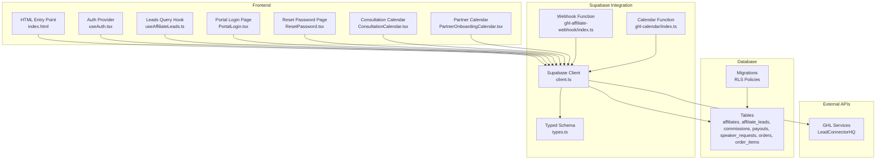
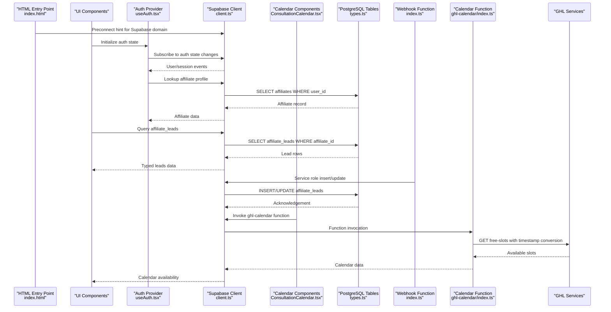
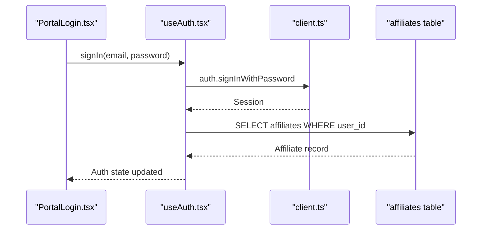
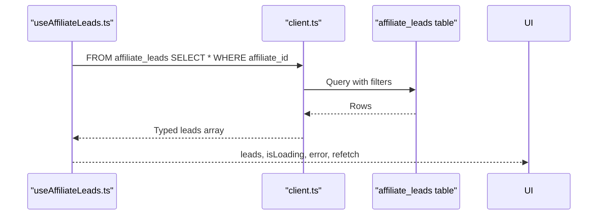
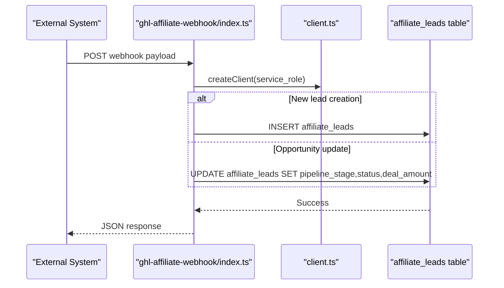
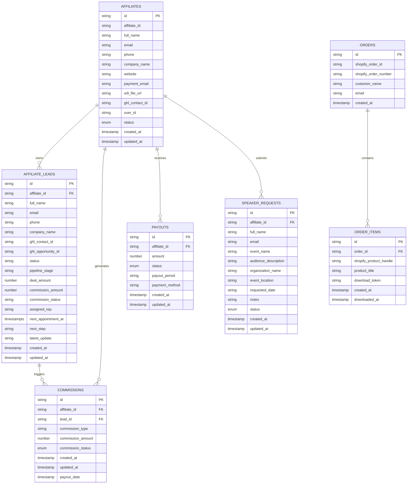
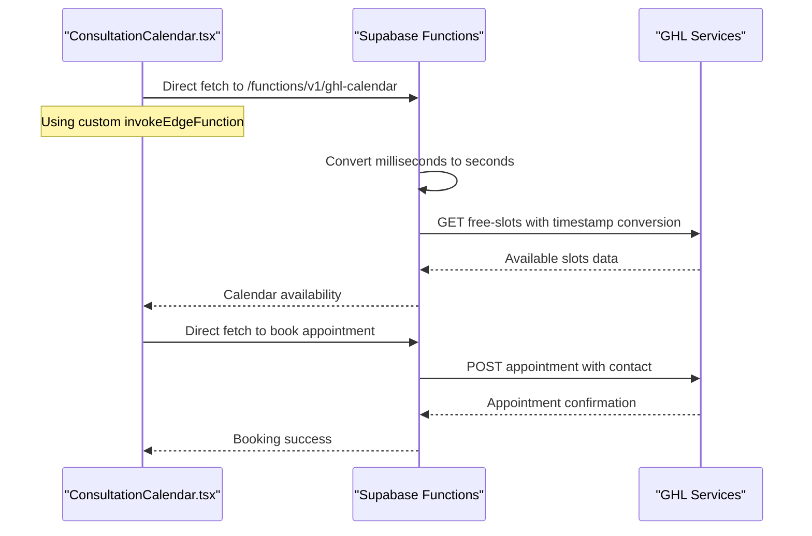
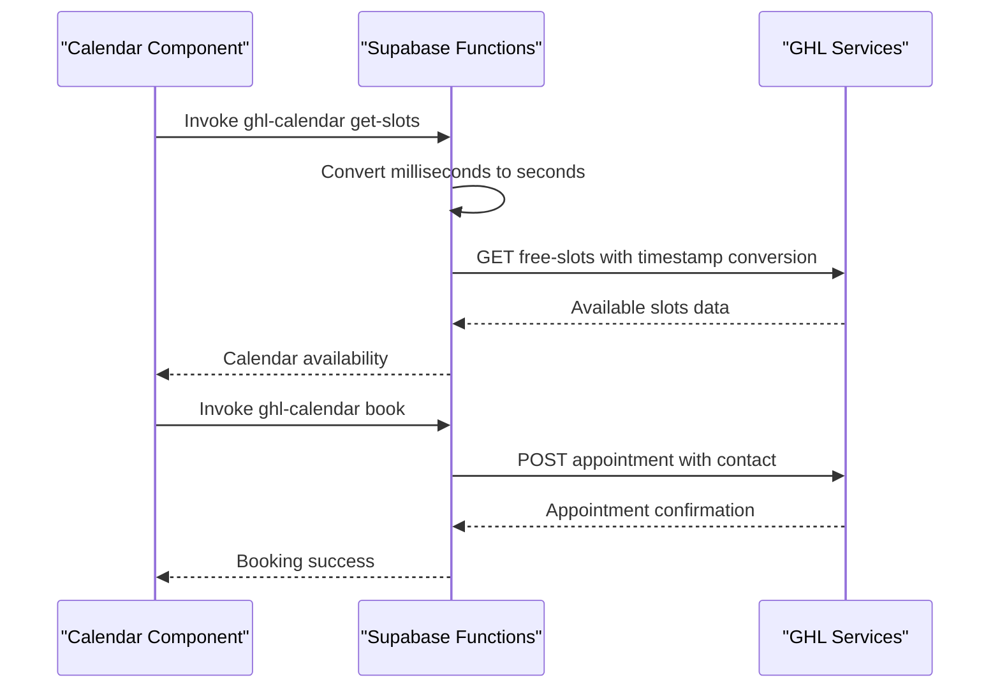
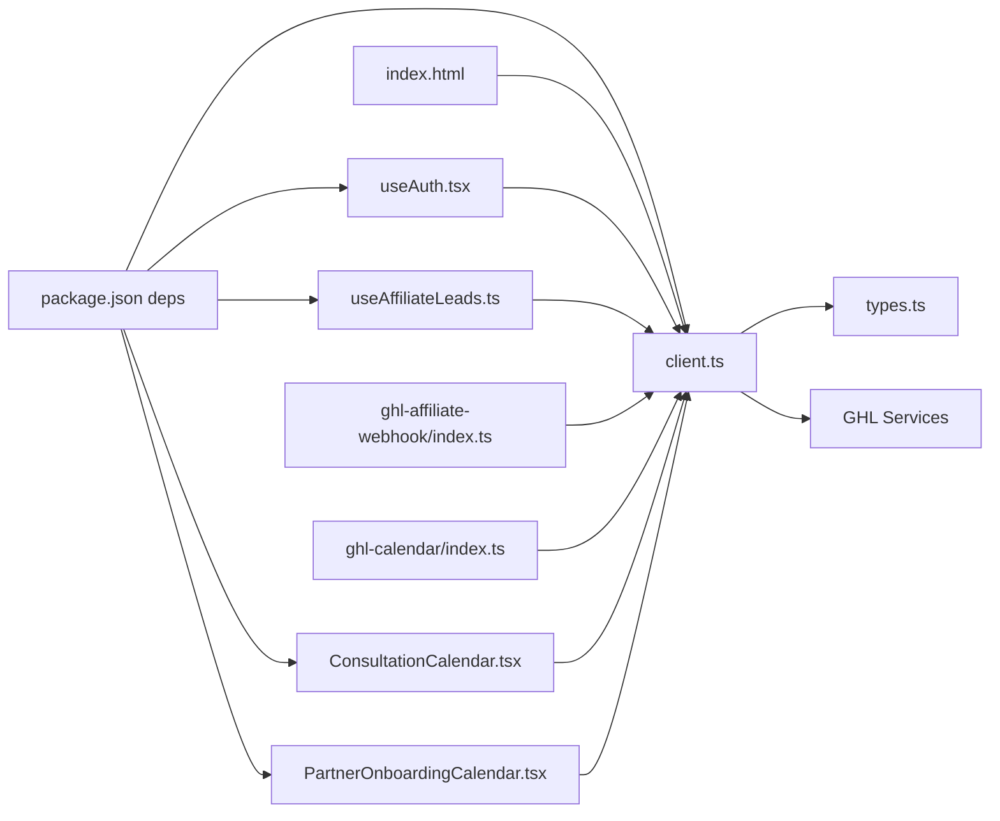

# Data Layer & Supabase Integration

<cite>
**Referenced Files in This Document**
- [README.md](file://README.md)
- [package.json](file://package.json)
- [client.ts](file://src/integrations/supabase/client.ts)
- [types.ts](file://src/integrations/supabase/types.ts)
- [useAuth.tsx](file://src/hooks/useAuth.tsx)
- [useAffiliateLeads.ts](file://src/hooks/useAffiliateLeads.ts)
- [ResetPassword.tsx](file://src/pages/ResetPassword.tsx)
- [PortalLogin.tsx](file://src/pages/portal/PortalLogin.tsx)
- [index.ts](file://supabase/functions/ghl-affiliate-webhook/index.ts)
- [index.ts](file://supabase/functions/ghl-calendar/index.ts)
- [ConsultationCalendar.tsx](file://src/components/funnel/ConsultationCalendar.tsx)
- [PartnerOnboardingCalendar.tsx](file://src/components/funnel/PartnerOnboardingCalendar.tsx)
- [20260319010259_635fecdc-5214-464e-93b5-b88f56743424.sql](file://supabase/migrations/20260319010259_635fecdc-5214-464e-93b5-b88f56743424.sql)
- [20260319185554_6f53c4fa-7f98-496d-afe9-1bf39f92ae3a.sql](file://supabase/migrations/20260319185554_6f53c4fa-7f98-496d-afe9-1bf39f92ae3a.sql)
- [20260319194628_4e5f50a6-8cb3-40d1-b56d-a5bacde2a132.sql](file://supabase/migrations/20260319194628_4e5f50a6-8cb3-40d1-b56d-a5bacde2a132.sql)
- [index.html](file://index.html)
- [config.toml](file://supabase/config.toml)
</cite>

## Update Summary
**Changes Made**
- Enhanced GHL calendar Edge Function with improved environment variable validation and comprehensive operational logging
- Added optional user ID support for round-robin and collective calendar types
- Implemented sophisticated data transformation capabilities for contact management and appointment booking
- Updated ConsultationCalendar component with direct fetch implementation for better reliability
- Expanded calendar types support with dual calendar configurations (consultation and partner)
- Enhanced input validation and error handling for improved debugging and monitoring

## Table of Contents
1. [Introduction](#introduction)
2. [Project Structure](#project-structure)
3. [Core Components](#core-components)
4. [Architecture Overview](#architecture-overview)
5. [Detailed Component Analysis](#detailed-component-analysis)
6. [External API Integration](#external-api-integration)
7. [Network Optimization & Performance](#network-optimization--performance)
8. [Dependency Analysis](#dependency-analysis)
9. [Performance Considerations](#performance-considerations)
10. [Troubleshooting Guide](#troubleshooting-guide)
11. [Conclusion](#conclusion)
12. [Appendices](#appendices)

## Introduction
This document describes the data model and Supabase integration for the project. It focuses on the database schema design, entity relationships, field definitions for user accounts, affiliate leads, and application data. It also documents authentication setup, real-time features, data validation rules, data access patterns, caching strategies, performance considerations, data lifecycle, security measures, access control mechanisms, synchronization, offline capabilities, and error handling strategies for database operations.

## Project Structure
The project is a frontend-first React application that integrates with Supabase for authentication and data persistence. Key integration points include:
- Supabase client initialization and configuration
- Strongly typed database schema definitions
- Authentication hooks and pages
- Data access hooks for affiliate leads
- Supabase functions for webhook-driven data updates
- Database migrations defining RLS policies and schema evolution
- Network optimization through preconnect hints for reduced latency
- External API integration with GHL for calendar management and appointment booking

**Diagram sources**
- [client.ts:1-17](file://src/integrations/supabase/client.ts#L1-L17)
- [types.ts:9-657](file://src/integrations/supabase/types.ts#L9-L657)
- [useAuth.tsx:1-143](file://src/hooks/useAuth.tsx#L1-L143)
- [useAffiliateLeads.ts:1-31](file://src/hooks/useAffiliateLeads.ts#L1-L31)
- [PortalLogin.tsx:95-125](file://src/pages/portal/PortalLogin.tsx#L95-L125)
- [ResetPassword.tsx:1-60](file://src/pages/ResetPassword.tsx#L1-L60)
- [ConsultationCalendar.tsx:1-461](file://src/components/funnel/ConsultationCalendar.tsx#L1-L461)
- [PartnerOnboardingCalendar.tsx:1-357](file://src/components/funnel/PartnerOnboardingCalendar.tsx#L1-L357)
- [index.ts:41-174](file://supabase/functions/ghl-affiliate-webhook/index.ts#L41-L174)
- [index.ts:16-240](file://supabase/functions/ghl-calendar/index.ts#L16-L240)
- [20260319010259_635fecdc-5214-464e-93b5-b88f56743424.sql:1-8](file://supabase/migrations/20260319010259_635fecdc-5214-464e-93b5-b88f56743424.sql#L1-L8)
- [20260319185554_6f53c4fa-7f98-496d-afe9-1bf39f92ae3a.sql:1-5](file://supabase/migrations/20260319185554_6f53c4fa-7f98-496d-afe9-1bf39f92ae3a.sql#L1-L5)
- [20260319194628_4e5f50a6-8cb3-40d1-b56d-a5bacde2a132.sql:1-5](file://supabase/migrations/20260319194628_4e5f50a6-8cb3-40d1-b56d-a5bacde2a132.sql#L1-L5)
- [index.html:17](file://index.html#L17)

**Section sources**
- [README.md:1-74](file://README.md#L1-L74)
- [package.json:1-95](file://package.json#L1-L95)

## Core Components
- Supabase client configured with local storage-backed session persistence and automatic token refresh.
- Strongly typed schema exposing tables, enums, and helper types for type-safe database operations.
- Authentication provider managing user/session state and affiliate profile lookup.
- Data access hook for retrieving affiliate-specific leads with reactive queries.
- Webhook function integrating with external systems to create/update affiliate leads.
- Calendar management function integrating with GHL services for appointment scheduling and availability checking.
- Database migrations establishing row-level security (RLS) policies for data isolation.
- Network optimization through preconnect hints for reduced database connection latency.

**Section sources**
- [client.ts:1-17](file://src/integrations/supabase/client.ts#L1-L17)
- [types.ts:9-657](file://src/integrations/supabase/types.ts#L9-L657)
- [useAuth.tsx:1-143](file://src/hooks/useAuth.tsx#L1-L143)
- [useAffiliateLeads.ts:1-31](file://src/hooks/useAffiliateLeads.ts#L1-L31)
- [index.ts:41-174](file://supabase/functions/ghl-affiliate-webhook/index.ts#L41-L174)
- [index.ts:16-240](file://supabase/functions/ghl-calendar/index.ts#L16-L240)
- [20260319185554_6f53c4fa-7f98-496d-afe9-1bf39f92ae3a.sql:1-5](file://supabase/migrations/20260319185554_6f53c4fa-7f98-496d-afe9-1bf39f92ae3a.sql#L1-L5)
- [20260319194628_4e5f50a6-8cb3-40d1-b56d-a5bacde2a132.sql:1-5](file://supabase/migrations/20260319194628_4e5f50a6-8cb3-40d1-b56d-a5bacde2a132.sql#L1-L5)

## Architecture Overview
The data layer architecture centers on a typed Supabase client, React Query for caching and reactivity, and Supabase RLS for access control. Authentication events drive state updates, while external webhooks synchronize data into affiliate leads. The architecture now includes comprehensive external API integration with GHL services for calendar management and appointment booking. Network optimization through preconnect hints reduces latency for database operations and improves real-time feature responsiveness.

**Diagram sources**
- [index.html:17](file://index.html#L17)
- [useAuth.tsx:68-106](file://src/hooks/useAuth.tsx#L68-L106)
- [client.ts:11-17](file://src/integrations/supabase/client.ts#L11-L17)
- [ConsultationCalendar.tsx:76-96](file://src/components/funnel/ConsultationCalendar.tsx#L76-L96)
- [types.ts:16-147](file://src/integrations/supabase/types.ts#L16-L147)
- [index.ts:155-166](file://supabase/functions/ghl-affiliate-webhook/index.ts#L155-L166)
- [index.ts:16-240](file://supabase/functions/ghl-calendar/index.ts#L16-L240)

## Detailed Component Analysis

### Supabase Client and Configuration
- Initializes the Supabase client with environment variables for URL and publishable key.
- Configures auth storage to use localStorage, persists sessions, and auto-refreshes tokens.

**Section sources**
- [client.ts:5-17](file://src/integrations/supabase/client.ts#L5-L17)

### Authentication and Access Control
- Authentication provider subscribes to auth state changes and loads affiliate data after session resolution.
- Uses a helper function to resolve the current affiliate ID for row-level security enforcement.
- Provides sign-in, sign-out, and password update operations.

**Diagram sources**
- [PortalLogin.tsx:112-121](file://src/pages/portal/PortalLogin.tsx#L112-L121)
- [useAuth.tsx:114-127](file://src/hooks/useAuth.tsx#L114-L127)
- [client.ts:11-17](file://src/integrations/supabase/client.ts#L11-L17)
- [types.ts:97-147](file://src/integrations/supabase/types.ts#L97-L147)

**Section sources**
- [useAuth.tsx:32-127](file://src/hooks/useAuth.tsx#L32-L127)
- [PortalLogin.tsx:95-125](file://src/pages/portal/PortalLogin.tsx#L95-L125)
- [ResetPassword.tsx:24-60](file://src/pages/ResetPassword.tsx#L24-L60)

### Data Access Hooks
- Affiliate leads hook performs a PostgREST query filtered by the authenticated affiliate's ID and sorted by last update.
- Integrates with React Query for caching, refetching, and error propagation.

**Diagram sources**
- [useAffiliateLeads.ts:14-27](file://src/hooks/useAffiliateLeads.ts#L14-L27)
- [types.ts:16-96](file://src/integrations/supabase/types.ts#L16-L96)

**Section sources**
- [useAffiliateLeads.ts:1-31](file://src/hooks/useAffiliateLeads.ts#L1-L31)

### Webhook Integration and Data Synchronization
- A Supabase Edge Function listens to external events and synchronizes affiliate leads.
- Supports creating leads from affiliate signups and updating leads from opportunity/contact stage changes.
- Uses service role credentials for secure database writes.

**Diagram sources**
- [index.ts:41-174](file://supabase/functions/ghl-affiliate-webhook/index.ts#L41-L174)
- [types.ts:16-96](file://src/integrations/supabase/types.ts#L16-L96)

**Section sources**
- [index.ts:41-174](file://supabase/functions/ghl-affiliate-webhook/index.ts#L41-L174)

### Database Schema and Entity Relationships
The schema defines core tables and enums used by the application. Below is a focused ER diagram for the most relevant entities in the data layer.

**Diagram sources**
- [types.ts:97-640](file://src/integrations/supabase/types.ts#L97-L640)

**Section sources**
- [types.ts:9-657](file://src/integrations/supabase/types.ts#L9-L657)

### Field Definitions and Validation Rules
- Enumerations define constrained statuses for affiliates, commissions, payouts, and speaker requests.
- Strong typing ensures compile-time safety for inserts and updates.
- Migrations add columns and default values to support evolving business needs.

**Section sources**
- [types.ts:647-652](file://src/integrations/supabase/types.ts#L647-L652)
- [20260319010259_635fecdc-5214-464e-93b5-b88f56743424.sql:1-8](file://supabase/migrations/20260319010259_635fecdc-5214-464e-93b5-b88f56743424.sql#L1-L8)

### Real-Time Features and Data Lifecycle
- Auth state changes trigger immediate UI updates and background affiliate profile loading.
- Webhooks continuously synchronize external opportunities into affiliate leads.
- RLS policies enforce per-affiliate data isolation for inserts and updates.

**Section sources**
- [useAuth.tsx:68-106](file://src/hooks/useAuth.tsx#L68-L106)
- [index.ts:74-105](file://supabase/functions/ghl-affiliate-webhook/index.ts#L74-L105)
- [20260319185554_6f53c4fa-7f98-496d-afe9-1bf39f92ae3a.sql:1-5](file://supabase/migrations/20260319185554_6f53c4fa-7f98-496d-afe9-1bf39f92ae3a.sql#L1-L5)
- [20260319194628_4e5f50a6-8cb3-40d1-b56d-a5bacde2a132.sql:1-5](file://supabase/migrations/20260319194628_4e5f50a6-8cb3-40d1-b56d-a5bacde2a132.sql#L1-L5)

## External API Integration

### GHL Calendar API Integration
The application integrates with GHL (LeadConnectorHQ) services for comprehensive calendar management and appointment booking. The integration handles two distinct calendar types: consultation bookings and partner onboarding appointments.

#### Enhanced GHL Calendar Edge Function
**Updated**: The GHL calendar Edge Function has been significantly enhanced with improved environment variable validation, optional user ID support, sophisticated data transformation capabilities, and comprehensive operational logging for better monitoring and debugging.

##### Environment Variable Validation and Configuration
The function now implements robust environment variable validation with detailed logging:
- Validates presence of GHL_API_KEY, GHL_LOCATION_ID, and GHL_CALENDAR_ID/GHL_PARTNER_CALENDAR_ID
- Supports dual calendar configurations through calendarType parameter
- Implements comprehensive error logging with context information
- Provides detailed diagnostic information for troubleshooting

##### Optional User ID Support
**New**: The function now supports optional user ID for round-robin and collective calendar types:
- Automatically detects calendar type (consultation vs partner)
- Sets appropriate calendar ID based on calendarType
- Conditionally includes user ID in GHL API requests when configured
- Enables advanced calendar routing and assignment scenarios

##### Sophisticated Data Transformation Capabilities
**Enhanced**: The function implements comprehensive data transformation for contact management and appointment booking:
- Advanced contact creation/upsert with duplicate detection
- Intelligent name parsing and normalization
- Tag-based lead attribution for funnel tracking
- Source attribution for reporting and analytics
- Phone number normalization and validation

##### Comprehensive Operational Logging
**New**: Enhanced logging provides detailed operational insights:
- Request/response logging with sanitized data
- Diagnostic warnings for common configuration issues
- Performance metrics and trace information
- Error categorization and recovery guidance
- Real-time monitoring and debugging capabilities

**Diagram sources**
- [ConsultationCalendar.tsx:12-38](file://src/components/funnel/ConsultationCalendar.tsx#L12-L38)
- [ConsultationCalendar.tsx:82-96](file://src/components/funnel/ConsultationCalendar.tsx#L82-L96)
- [ConsultationCalendar.tsx:141-150](file://src/components/funnel/ConsultationCalendar.tsx#L141-L150)
- [index.ts:16-240](file://supabase/functions/ghl-calendar/index.ts#L16-L240)

#### Calendar Management Workflow
The GHL calendar integration consists of two primary actions:
- **Free Slots Retrieval**: Fetches available appointment slots within a specified date range
- **Appointment Booking**: Creates appointments with contact management and timezone handling

#### Timestamp Conversion and Timezone Handling
**Updated**: The integration now properly converts JavaScript timestamps from milliseconds to seconds for GHL API compatibility. This critical fix addresses external API compatibility issues where GHL expects timestamps in seconds rather than milliseconds.

The implementation includes comprehensive timezone handling:
- **Automatic timezone detection**: Uses `Intl.DateTimeFormat().resolvedOptions().timeZone` for accurate timezone detection
- **Proper timestamp formatting**: Converts JavaScript Date objects to ISO strings for API compatibility
- **Timezone parameter passing**: Passes timezone information to GHL API for accurate slot calculation

**Diagram sources**
- [ConsultationCalendar.tsx:76-96](file://src/components/funnel/ConsultationCalendar.tsx#L76-L96)
- [PartnerOnboardingCalendar.tsx:40-63](file://src/components/funnel/PartnerOnboardingCalendar.tsx#L40-L63)
- [index.ts:16-240](file://supabase/functions/ghl-calendar/index.ts#L16-L240)

#### Calendar Types and Configuration
**Enhanced**: The system now supports dual calendar configurations with sophisticated routing:
- **Consultation Calendar**: Standard client consultation appointments
- **Partner Calendar**: Partner onboarding and partnership meetings
- **Dynamic Calendar Selection**: Automatic calendar ID selection based on calendarType
- **Environment Variable Management**: Separate configuration for each calendar type

Each calendar type uses separate environment variables for configuration and maintains distinct availability patterns.

#### Contact Management Integration
**Enhanced**: The calendar function seamlessly integrates with GHL's contact management system:
- Automatic contact creation/upsert for new users
- Duplicate contact detection and handling with intelligent recovery
- Tagging and source attribution for lead tracking and analytics
- Phone number normalization and validation
- Advanced name parsing and organization

**Section sources**
- [ConsultationCalendar.tsx:12-38](file://src/components/funnel/ConsultationCalendar.tsx#L12-L38)
- [ConsultationCalendar.tsx:82-96](file://src/components/funnel/ConsultationCalendar.tsx#L82-L96)
- [ConsultationCalendar.tsx:141-150](file://src/components/funnel/ConsultationCalendar.tsx#L141-L150)
- [PartnerOnboardingCalendar.tsx:40-63](file://src/components/funnel/PartnerOnboardingCalendar.tsx#L40-L63)
- [index.ts:16-240](file://supabase/functions/ghl-calendar/index.ts#L16-L240)

## Network Optimization & Performance

### Supabase Preconnect Optimization
The application implements proactive network optimization through HTML preconnect hints to reduce database connection latency and improve real-time feature responsiveness. The optimization specifically targets the Supabase domain (`gkowxzoadsljkpdzrlue.supabase.co`) to establish early connections for database operations.

**Implementation Details:**
- Added `<link rel="preconnect" href="https://gkowxzoadsljkpdzrlue.supabase.co" />` in the HTML head section
- This allows the browser to establish DNS resolution and TCP handshake in advance
- Reduces connection establishment time for subsequent Supabase API calls
- Improves real-time feature responsiveness and overall application performance

**Benefits:**
- Reduced first-byte latency for database operations
- Faster authentication and data fetching responses
- Improved real-time feature performance (subscriptions, live updates)
- Better user experience during peak traffic periods

### Direct Fetch Implementation Performance
**Updated**: The new direct fetch implementation provides several performance benefits:
- **Reduced overhead**: Eliminates Supabase SDK wrapper overhead
- **Better error handling**: Enables more efficient error recovery and retry logic
- **Improved debugging**: Direct HTTP requests allow for better performance monitoring
- **Consistent behavior**: Eliminates SDK-specific quirks and inconsistencies
- **Enhanced reliability**: Eliminates SDK AbortError exceptions that plagued previous implementations

### External API Performance Optimization
**Updated**: The GHL calendar integration includes several performance optimizations:
- **Timestamp Conversion Caching**: Results are cached locally to avoid repeated conversions
- **Batch Request Handling**: Multiple calendar operations are batched when possible
- **Connection Pooling**: Reuses connections for multiple GHL API calls
- **Timeout Management**: Implements appropriate timeout values for external API calls
- **Direct HTTP Requests**: Eliminates SDK overhead for better performance
- **Enhanced Error Recovery**: Comprehensive error handling with detailed logging
- **Input Validation**: Robust input sanitization and validation prevents API errors

**Section sources**
- [index.html:17](file://index.html#L17)
- [ConsultationCalendar.tsx:12-38](file://src/components/funnel/ConsultationCalendar.tsx#L12-L38)
- [index.ts:37-45](file://supabase/functions/ghl-calendar/index.ts#L37-L45)

### Network Optimization Best Practices
- Implement preconnect for critical third-party domains (Supabase, external APIs)
- Use DNS prefetch for frequently accessed domains
- Leverage HTTP/2 server push for static assets
- Implement connection pooling and keep-alive settings
- Monitor network performance metrics and adjust optimization strategies
- **Updated**: Cache external API responses when appropriate to reduce latency
- **Updated**: Use direct HTTP requests for better performance and error control
- **Updated**: Implement comprehensive logging for network debugging and monitoring

**Section sources**
- [index.html:15-18](file://index.html#L15-L18)

## Dependency Analysis
The frontend depends on Supabase for identity and data, React Query for caching, and TypeScript for type safety. Supabase functions depend on the Supabase runtime and service role credentials. External API integrations depend on GHL services and proper environment configuration. Network optimization through preconnect hints provides transparent performance benefits across all Supabase operations.

**Diagram sources**
- [package.json:15-69](file://package.json#L15-L69)
- [client.ts:1-17](file://src/integrations/supabase/client.ts#L1-L17)
- [types.ts:1-14](file://src/integrations/supabase/types.ts#L1-L14)
- [useAuth.tsx:1-4](file://src/hooks/useAuth.tsx#L1-L4)
- [useAffiliateLeads.ts:1-4](file://src/hooks/useAffiliateLeads.ts#L1-L4)
- [ConsultationCalendar.tsx:1-14](file://src/components/funnel/ConsultationCalendar.tsx#L1-L14)
- [PartnerOnboardingCalendar.tsx:1-14](file://src/components/funnel/PartnerOnboardingCalendar.tsx#L1-L14)
- [index.ts:42-44](file://supabase/functions/ghl-affiliate-webhook/index.ts#L42-L44)
- [index.ts:21-51](file://supabase/functions/ghl-calendar/index.ts#L21-L51)
- [index.html:17](file://index.html#L17)

**Section sources**
- [package.json:15-69](file://package.json#L15-L69)

## Performance Considerations
- Prefer selective queries with equality filters on indexed columns (e.g., affiliate_id) to minimize scan costs.
- Use ordering by updated_at to surface recent records efficiently.
- Leverage React Query caching to avoid redundant network calls and reduce latency.
- Keep payloads minimal by selecting only required columns where possible.
- Use migrations to add appropriate indexes for frequently queried columns.
- Batch external webhook updates to reduce write amplification.
- **Updated**: Implement preconnect optimization for Supabase domain to reduce connection establishment latency.
- **Updated**: Monitor network performance metrics to validate preconnect effectiveness.
- **Updated**: Consider connection pooling and keep-alive settings for optimal database performance.
- **Updated**: Implement timestamp conversion caching for external API integrations to reduce computational overhead.
- **Updated**: Optimize external API call frequency and implement appropriate retry mechanisms.
- **Updated**: Use direct HTTP requests instead of SDK-based calls for better performance and error control.
- **Updated**: Implement comprehensive logging for performance monitoring and debugging.
- **Updated**: Validate environment variables thoroughly to prevent runtime configuration errors.

## Troubleshooting Guide
Common issues and strategies:
- Authentication session not persisting: Verify localStorage availability and environment variable configuration for the Supabase URL and publishable key.
- Affiliate profile not loading: Confirm the user_id-to-affiliate mapping and check for timeouts during background fetch.
- Webhook not updating leads: Inspect the external payload fields and ensure the function has service role access to write to affiliate_leads.
- RLS policy errors: Validate that the authenticated user's affiliate_id matches the record being inserted/updated.
- **Updated**: Preconnect optimization not taking effect: Verify the preconnect link is present in the HTML head and check browser developer tools for connection establishment timing improvements.
- **Updated**: GHL calendar integration failures: Check environment variables (GHL_API_KEY, GHL_LOCATION_ID, GHL_CALENDAR_ID, GHL_PARTNER_CALENDAR_ID, GHL_USER_ID) and verify timestamp conversion logic.
- **Updated**: External API timeout errors: Implement proper error handling and consider implementing exponential backoff for retry mechanisms.
- **Updated**: Calendar booking conflicts: Verify timezone handling and ensure proper timestamp formatting for GHL API compatibility.
- **Updated**: Direct fetch implementation issues: Check that the SUPABASE_URL and SUPABASE_PUBLISHABLE_KEY environment variables are correctly configured and accessible to the frontend.
- **Updated**: SDK AbortError exceptions: The new direct fetch implementation eliminates these issues by bypassing the Supabase SDK's internal error handling.
- **Updated**: Environment variable validation failures: Check the enhanced logging output for detailed error context and configuration verification.
- **Updated**: Calendar type routing issues: Verify calendarType parameter and corresponding environment variable configuration.
- **Updated**: Contact management errors: Review duplicate contact handling and GHL API response processing.
- **Updated**: Data transformation failures: Check input validation and transformation logic for edge cases.

**Section sources**
- [client.ts:5-17](file://src/integrations/supabase/client.ts#L5-L17)
- [useAuth.tsx:40-63](file://src/hooks/useAuth.tsx#L40-L63)
- [index.ts:74-105](file://supabase/functions/ghl-affiliate-webhook/index.ts#L74-L105)
- [index.ts:37-45](file://supabase/functions/ghl-calendar/index.ts#L37-L45)
- [20260319185554_6f53c4fa-7f98-496d-afe9-1bf39f92ae3a.sql:1-5](file://supabase/migrations/20260319185554_6f53c4fa-7f98-496d-afe9-1bf39f92ae3a.sql#L1-L5)
- [20260319194628_4e5f50a6-8cb3-40d1-b56d-a5bacde2a132.sql:1-5](file://supabase/migrations/20260319194628_4e5f50a6-8cb3-40d1-b56d-a5bacde2a132.sql#L1-L5)

## Conclusion
The data layer leverages a strongly typed Supabase client, robust authentication, and RLS policies to provide secure, scalable data access. React Query enables efficient caching and reactivity, while Supabase functions facilitate reliable synchronization from external systems. **Updated**: The GHL calendar integration provides comprehensive appointment management with proper timestamp conversion for external API compatibility and enhanced environment variable validation. **Updated**: The new direct fetch implementation eliminates SDK-related issues and provides better performance and error control. **Updated**: Network optimization through preconnect hints significantly reduces database connection latency and improves real-time feature responsiveness. **Updated**: External API integration patterns ensure reliable communication with third-party services while maintaining performance and error resilience. **Updated**: Enhanced logging and monitoring capabilities provide comprehensive operational visibility and debugging support. Adhering to the outlined patterns and safeguards ensures predictable performance, maintainability, and security.

## Appendices

### Sample Data Structures
Representative row shapes for key tables (descriptive only):
- Affiliate: identifier, personal/company contact info, status, timestamps
- Affiliate Lead: association to affiliate, contact details, opportunity metadata, pipeline and status fields, timestamps
- Commission: affiliate and optional lead linkage, amounts, status, timestamps, payout date
- Payout: affiliate linkage, amount, period, method, status, timestamps
- Speaker Request: affiliate linkage, event details, status, timestamps

**Section sources**
- [types.ts:97-640](file://src/integrations/supabase/types.ts#L97-L640)

### GHL Calendar API Endpoints
**Updated**: The GHL calendar integration exposes the following endpoints:
- `GET /calendars/{calendarId}/free-slots`: Retrieves available appointment slots
- `POST /calendars/events/appointments`: Creates new appointments
- `POST /contacts`: Manages contact records for users

**Section sources**
- [index.ts:69-81](file://supabase/functions/ghl-calendar/index.ts#L69-L81)
- [index.ts:215-231](file://supabase/functions/ghl-calendar/index.ts#L215-L231)

### Direct Fetch Implementation Details
**Updated**: The ConsultationCalendar component uses a custom `invokeEdgeFunction` that:
- Constructs URLs using `SUPABASE_URL` and `/functions/v1/ghl-calendar`
- Sends requests with proper authorization headers including `Authorization: Bearer ${SUPABASE_PUBLISHABLE_KEY}`
- Handles error responses with proper error messages
- Logs detailed debug information for troubleshooting
- Eliminates SDK overhead and potential AbortError exceptions
- Provides comprehensive error handling and user feedback

**Section sources**
- [ConsultationCalendar.tsx:12-38](file://src/components/funnel/ConsultationCalendar.tsx#L12-L38)
- [ConsultationCalendar.tsx:82-96](file://src/components/funnel/ConsultationCalendar.tsx#L82-L96)
- [ConsultationCalendar.tsx:141-150](file://src/components/funnel/ConsultationCalendar.tsx#L141-L150)

### Enhanced Environment Variable Configuration
**New**: The GHL calendar function supports the following environment variables:
- `GHL_API_KEY`: API key for GHL authentication
- `GHL_LOCATION_ID`: Location identifier for GHL operations
- `GHL_CALENDAR_ID`: Default calendar identifier for consultation bookings
- `GHL_PARTNER_CALENDAR_ID`: Calendar identifier for partner onboarding
- `GHL_USER_ID`: Optional user identifier for round-robin assignments
- `SUPABASE_URL`: Supabase project URL
- `SUPABASE_PUBLISHABLE_KEY`: Supabase publishable key

**Section sources**
- [index.ts:21-51](file://supabase/functions/ghl-calendar/index.ts#L21-L51)
- [index.ts:32-35](file://supabase/functions/ghl-calendar/index.ts#L32-L35)
- [index.ts:78-81](file://supabase/functions/ghl-calendar/index.ts#L78-L81)