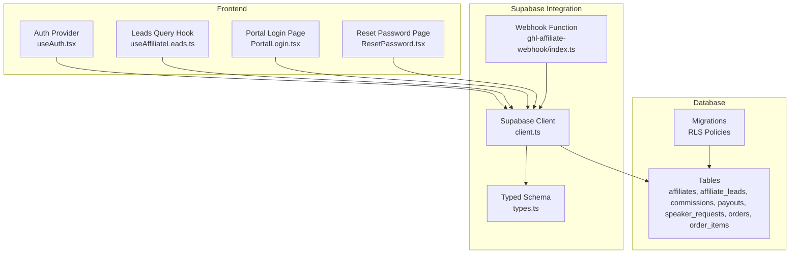
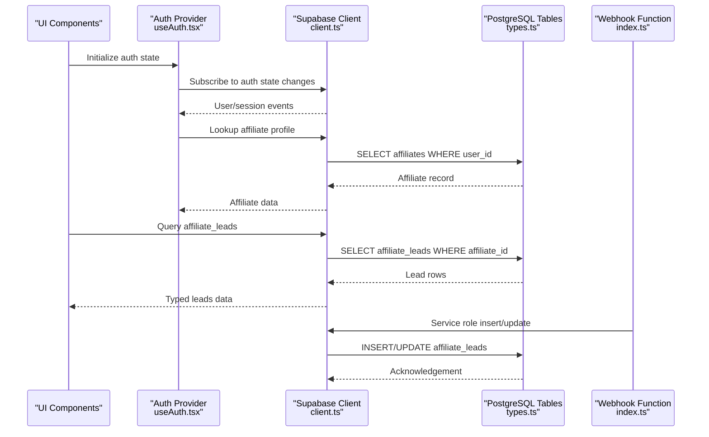
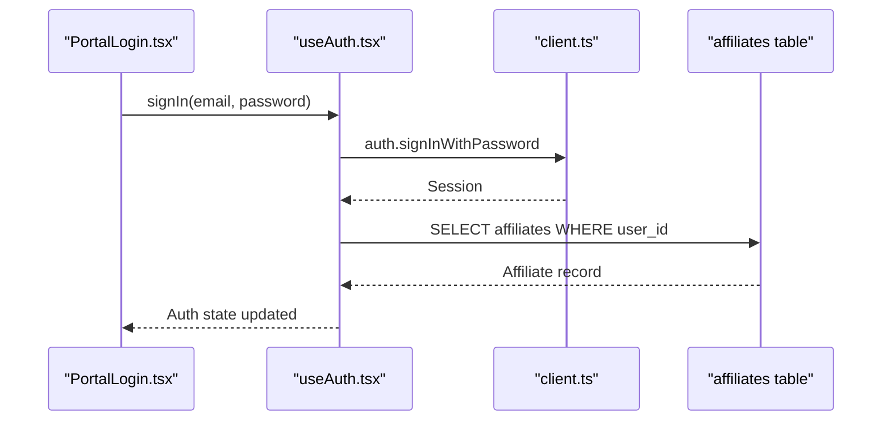
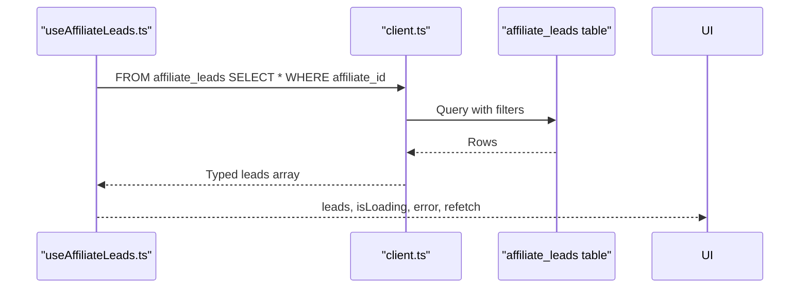
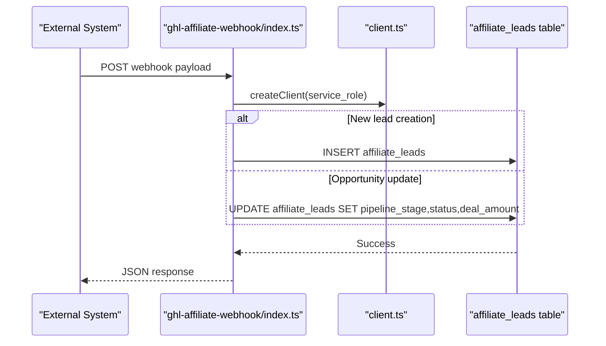
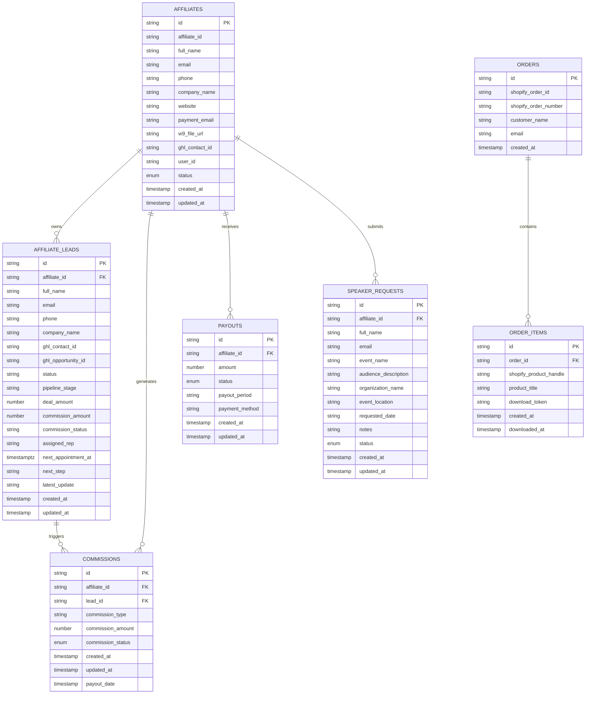
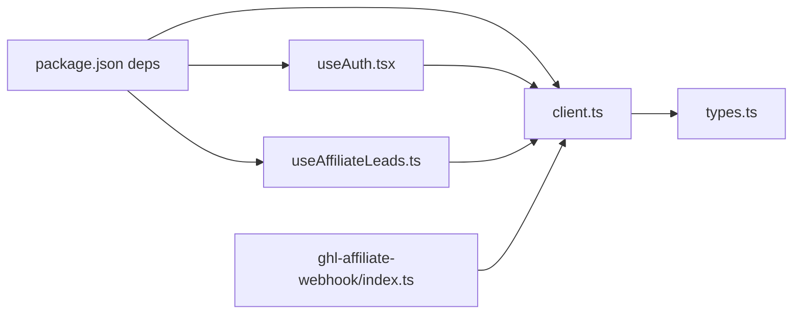

# Data Layer & Supabase Integration

<cite>
**Referenced Files in This Document**
- [README.md](file://README.md)
- [package.json](file://package.json)
- [client.ts](file://src/integrations/supabase/client.ts)
- [types.ts](file://src/integrations/supabase/types.ts)
- [useAuth.tsx](file://src/hooks/useAuth.tsx)
- [useAffiliateLeads.ts](file://src/hooks/useAffiliateLeads.ts)
- [ResetPassword.tsx](file://src/pages/ResetPassword.tsx)
- [PortalLogin.tsx](file://src/pages/portal/PortalLogin.tsx)
- [index.ts](file://supabase/functions/ghl-affiliate-webhook/index.ts)
- [20260319010259_635fecdc-5214-464e-93b5-b88f56743424.sql](file://supabase/migrations/20260319010259_635fecdc-5214-464e-93b5-b88f56743424.sql)
- [20260319185554_6f53c4fa-7f98-496d-afe9-1bf39f92ae3a.sql](file://supabase/migrations/20260319185554_6f53c4fa-7f98-496d-afe9-1bf39f92ae3a.sql)
- [20260319194628_4e5f50a6-8cb3-40d1-b56d-a5bacde2a132.sql](file://supabase/migrations/20260319194628_4e5f50a6-8cb3-40d1-b56d-a5bacde2a132.sql)
</cite>

## Table of Contents
1. [Introduction](#introduction)
2. [Project Structure](#project-structure)
3. [Core Components](#core-components)
4. [Architecture Overview](#architecture-overview)
5. [Detailed Component Analysis](#detailed-component-analysis)
6. [Dependency Analysis](#dependency-analysis)
7. [Performance Considerations](#performance-considerations)
8. [Troubleshooting Guide](#troubleshooting-guide)
9. [Conclusion](#conclusion)
10. [Appendices](#appendices)

## Introduction
This document describes the data model and Supabase integration for the project. It focuses on the database schema design, entity relationships, field definitions for user accounts, affiliate leads, and application data. It also documents authentication setup, real-time features, data validation rules, data access patterns, caching strategies, performance considerations, data lifecycle, security measures, access control mechanisms, synchronization, offline capabilities, and error handling strategies for database operations.

## Project Structure
The project is a frontend-first React application that integrates with Supabase for authentication and data persistence. Key integration points include:
- Supabase client initialization and configuration
- Strongly typed database schema definitions
- Authentication hooks and pages
- Data access hooks for affiliate leads
- Supabase functions for webhook-driven data updates
- Database migrations defining RLS policies and schema evolution

**Diagram sources**
- [client.ts:1-17](file://src/integrations/supabase/client.ts#L1-L17)
- [types.ts:9-657](file://src/integrations/supabase/types.ts#L9-L657)
- [useAuth.tsx:1-143](file://src/hooks/useAuth.tsx#L1-L143)
- [useAffiliateLeads.ts:1-31](file://src/hooks/useAffiliateLeads.ts#L1-L31)
- [PortalLogin.tsx:95-125](file://src/pages/portal/PortalLogin.tsx#L95-L125)
- [ResetPassword.tsx:1-60](file://src/pages/ResetPassword.tsx#L1-L60)
- [index.ts:41-174](file://supabase/functions/ghl-affiliate-webhook/index.ts#L41-L174)
- [20260319010259_635fecdc-5214-464e-93b5-b88f56743424.sql:1-8](file://supabase/migrations/20260319010259_635fecdc-5214-464e-93b5-b88f56743424.sql#L1-L8)
- [20260319185554_6f53c4fa-7f98-496d-afe9-1bf39f92ae3a.sql:1-5](file://supabase/migrations/20260319185554_6f53c4fa-7f98-496d-afe9-1bf39f92ae3a.sql#L1-L5)
- [20260319194628_4e5f50a6-8cb3-40d1-b56d-a5bacde2a132.sql:1-5](file://supabase/migrations/20260319194628_4e5f50a6-8cb3-40d1-b56d-a5bacde2a132.sql#L1-L5)

**Section sources**
- [README.md:1-74](file://README.md#L1-L74)
- [package.json:1-95](file://package.json#L1-L95)

## Core Components
- Supabase client configured with local storage-backed session persistence and automatic token refresh.
- Strongly typed schema exposing tables, enums, and helper types for type-safe database operations.
- Authentication provider managing user/session state and affiliate profile lookup.
- Data access hook for retrieving affiliate-specific leads with reactive queries.
- Webhook function integrating with external systems to create/update affiliate leads.
- Database migrations establishing row-level security (RLS) policies for data isolation.

**Section sources**
- [client.ts:1-17](file://src/integrations/supabase/client.ts#L1-L17)
- [types.ts:9-657](file://src/integrations/supabase/types.ts#L9-L657)
- [useAuth.tsx:1-143](file://src/hooks/useAuth.tsx#L1-L143)
- [useAffiliateLeads.ts:1-31](file://src/hooks/useAffiliateLeads.ts#L1-L31)
- [index.ts:41-174](file://supabase/functions/ghl-affiliate-webhook/index.ts#L41-L174)
- [20260319185554_6f53c4fa-7f98-496d-afe9-1bf39f92ae3a.sql:1-5](file://supabase/migrations/20260319185554_6f53c4fa-7f98-496d-afe9-1bf39f92ae3a.sql#L1-L5)
- [20260319194628_4e5f50a6-8cb3-40d1-b56d-a5bacde2a132.sql:1-5](file://supabase/migrations/20260319194628_4e5f50a6-8cb3-40d1-b56d-a5bacde2a132.sql#L1-L5)

## Architecture Overview
The data layer architecture centers on a typed Supabase client, React Query for caching and reactivity, and Supabase RLS for access control. Authentication events drive state updates, while external webhooks synchronize data into affiliate leads.

**Diagram sources**
- [useAuth.tsx:68-106](file://src/hooks/useAuth.tsx#L68-L106)
- [client.ts:11-17](file://src/integrations/supabase/client.ts#L11-L17)
- [types.ts:16-147](file://src/integrations/supabase/types.ts#L16-L147)
- [index.ts:155-166](file://supabase/functions/ghl-affiliate-webhook/index.ts#L155-L166)

## Detailed Component Analysis

### Supabase Client and Configuration
- Initializes the Supabase client with environment variables for URL and publishable key.
- Configures auth storage to use localStorage, persists sessions, and auto-refreshes tokens.

**Section sources**
- [client.ts:5-17](file://src/integrations/supabase/client.ts#L5-L17)

### Authentication and Access Control
- Authentication provider subscribes to auth state changes and loads affiliate data after session resolution.
- Uses a helper function to resolve the current affiliate ID for row-level security enforcement.
- Provides sign-in, sign-out, and password update operations.

**Diagram sources**
- [PortalLogin.tsx:112-121](file://src/pages/portal/PortalLogin.tsx#L112-L121)
- [useAuth.tsx:114-127](file://src/hooks/useAuth.tsx#L114-L127)
- [client.ts:11-17](file://src/integrations/supabase/client.ts#L11-L17)
- [types.ts:97-147](file://src/integrations/supabase/types.ts#L97-L147)

**Section sources**
- [useAuth.tsx:32-127](file://src/hooks/useAuth.tsx#L32-L127)
- [PortalLogin.tsx:95-125](file://src/pages/portal/PortalLogin.tsx#L95-L125)
- [ResetPassword.tsx:24-60](file://src/pages/ResetPassword.tsx#L24-L60)

### Data Access Hooks
- Affiliate leads hook performs a PostgREST query filtered by the authenticated affiliate’s ID and sorted by last update.
- Integrates with React Query for caching, refetching, and error propagation.

**Diagram sources**
- [useAffiliateLeads.ts:14-27](file://src/hooks/useAffiliateLeads.ts#L14-L27)
- [types.ts:16-96](file://src/integrations/supabase/types.ts#L16-L96)

**Section sources**
- [useAffiliateLeads.ts:1-31](file://src/hooks/useAffiliateLeads.ts#L1-L31)

### Webhook Integration and Data Synchronization
- A Supabase Edge Function listens to external events and synchronizes affiliate leads.
- Supports creating leads from affiliate signups and updating leads from opportunity/contact stage changes.
- Uses service role credentials for secure database writes.

**Diagram sources**
- [index.ts:41-174](file://supabase/functions/ghl-affiliate-webhook/index.ts#L41-L174)
- [types.ts:16-96](file://src/integrations/supabase/types.ts#L16-L96)

**Section sources**
- [index.ts:41-174](file://supabase/functions/ghl-affiliate-webhook/index.ts#L41-L174)

### Database Schema and Entity Relationships
The schema defines core tables and enums used by the application. Below is a focused ER diagram for the most relevant entities in the data layer.

**Diagram sources**
- [types.ts:97-640](file://src/integrations/supabase/types.ts#L97-L640)

**Section sources**
- [types.ts:9-657](file://src/integrations/supabase/types.ts#L9-L657)

### Field Definitions and Validation Rules
- Enumerations define constrained statuses for affiliates, commissions, payouts, and speaker requests.
- Strong typing ensures compile-time safety for inserts and updates.
- Migrations add columns and default values to support evolving business needs.

**Section sources**
- [types.ts:647-652](file://src/integrations/supabase/types.ts#L647-L652)
- [20260319010259_635fecdc-5214-464e-93b5-b88f56743424.sql:1-8](file://supabase/migrations/20260319010259_635fecdc-5214-464e-93b5-b88f56743424.sql#L1-L8)

### Real-Time Features and Data Lifecycle
- Auth state changes trigger immediate UI updates and background affiliate profile loading.
- Webhooks continuously synchronize external opportunities into affiliate leads.
- RLS policies enforce per-affiliate data isolation for inserts and updates.

**Section sources**
- [useAuth.tsx:68-106](file://src/hooks/useAuth.tsx#L68-L106)
- [index.ts:74-105](file://supabase/functions/ghl-affiliate-webhook/index.ts#L74-L105)
- [20260319185554_6f53c4fa-7f98-496d-afe9-1bf39f92ae3a.sql:1-5](file://supabase/migrations/20260319185554_6f53c4fa-7f98-496d-afe9-1bf39f92ae3a.sql#L1-L5)
- [20260319194628_4e5f50a6-8cb3-40d1-b56d-a5bacde2a132.sql:1-5](file://supabase/migrations/20260319194628_4e5f50a6-8cb3-40d1-b56d-a5bacde2a132.sql#L1-L5)

## Dependency Analysis
The frontend depends on Supabase for identity and data, React Query for caching, and TypeScript for type safety. Supabase functions depend on the Supabase runtime and service role credentials.

**Diagram sources**
- [package.json:15-69](file://package.json#L15-L69)
- [client.ts:1-17](file://src/integrations/supabase/client.ts#L1-L17)
- [types.ts:1-14](file://src/integrations/supabase/types.ts#L1-L14)
- [useAuth.tsx:1-4](file://src/hooks/useAuth.tsx#L1-L4)
- [useAffiliateLeads.ts:1-4](file://src/hooks/useAffiliateLeads.ts#L1-L4)
- [index.ts:42-44](file://supabase/functions/ghl-affiliate-webhook/index.ts#L42-L44)

**Section sources**
- [package.json:15-69](file://package.json#L15-L69)

## Performance Considerations
- Prefer selective queries with equality filters on indexed columns (e.g., affiliate_id) to minimize scan costs.
- Use ordering by updated_at to surface recent records efficiently.
- Leverage React Query caching to avoid redundant network calls and reduce latency.
- Keep payloads minimal by selecting only required columns where possible.
- Use migrations to add appropriate indexes for frequently queried columns.
- Batch external webhook updates to reduce write amplification.

## Troubleshooting Guide
Common issues and strategies:
- Authentication session not persisting: Verify localStorage availability and environment variable configuration for the Supabase URL and publishable key.
- Affiliate profile not loading: Confirm the user_id-to-affiliate mapping and check for timeouts during background fetch.
- Webhook not updating leads: Inspect the external payload fields and ensure the function has service role access to write to affiliate_leads.
- RLS policy errors: Validate that the authenticated user’s affiliate_id matches the record being inserted/updated.

**Section sources**
- [client.ts:5-17](file://src/integrations/supabase/client.ts#L5-L17)
- [useAuth.tsx:40-63](file://src/hooks/useAuth.tsx#L40-L63)
- [index.ts:74-105](file://supabase/functions/ghl-affiliate-webhook/index.ts#L74-L105)
- [20260319185554_6f53c4fa-7f98-496d-afe9-1bf39f92ae3a.sql:1-5](file://supabase/migrations/20260319185554_6f53c4fa-7f98-496d-afe9-1bf39f92ae3a.sql#L1-L5)
- [20260319194628_4e5f50a6-8cb3-40d1-b56d-a5bacde2a132.sql:1-5](file://supabase/migrations/20260319194628_4e5f50a6-8cb3-40d1-b56d-a5bacde2a132.sql#L1-L5)

## Conclusion
The data layer leverages a strongly typed Supabase client, robust authentication, and RLS policies to provide secure, scalable data access. React Query enables efficient caching and reactivity, while Supabase functions facilitate reliable synchronization from external systems. Adhering to the outlined patterns and safeguards ensures predictable performance, maintainability, and security.

## Appendices

### Sample Data Structures
Representative row shapes for key tables (descriptive only):
- Affiliate: identifier, personal/company contact info, status, timestamps
- Affiliate Lead: association to affiliate, contact details, opportunity metadata, pipeline and status fields, timestamps
- Commission: affiliate and optional lead linkage, amounts, status, timestamps, payout date
- Payout: affiliate linkage, amount, period, method, status, timestamps
- Speaker Request: affiliate linkage, event details, status, timestamps

**Section sources**
- [types.ts:97-640](file://src/integrations/supabase/types.ts#L97-L640)