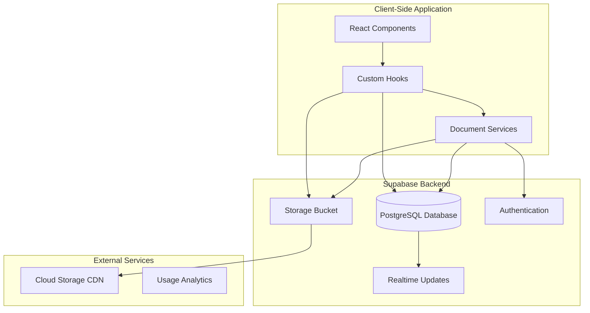
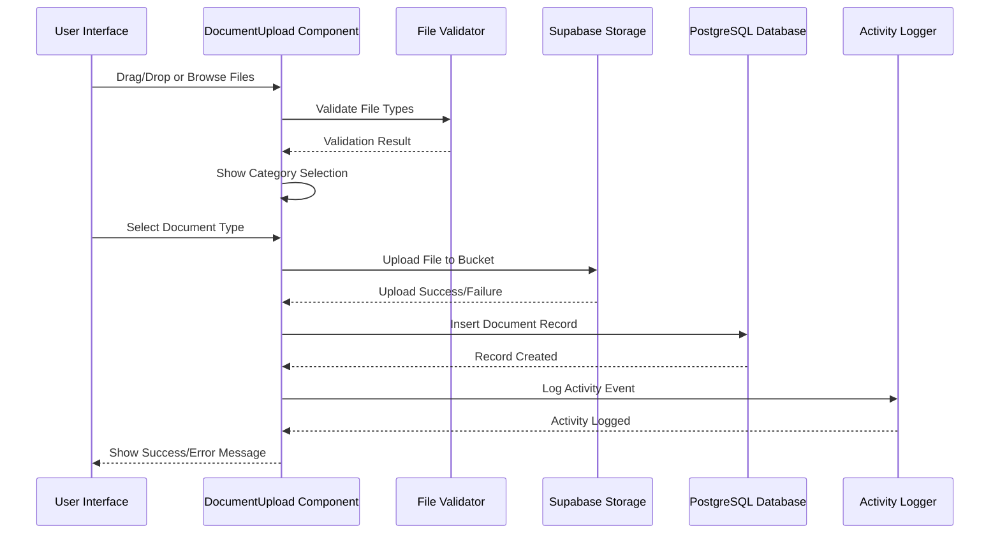
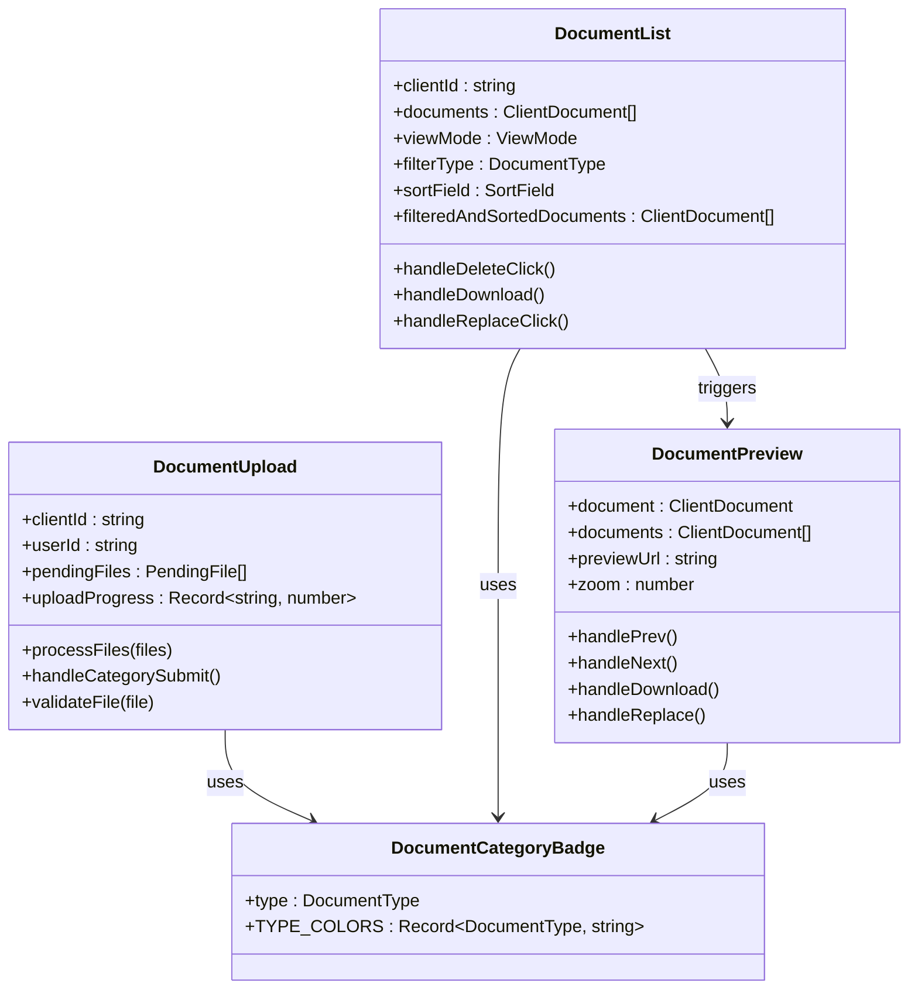
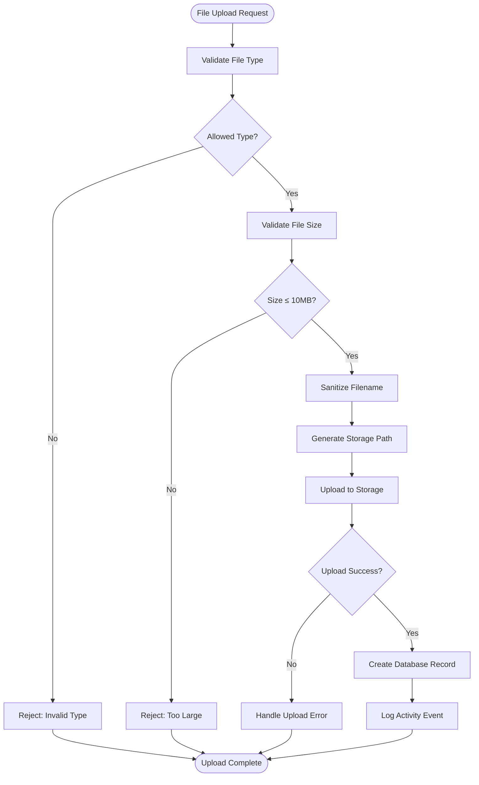
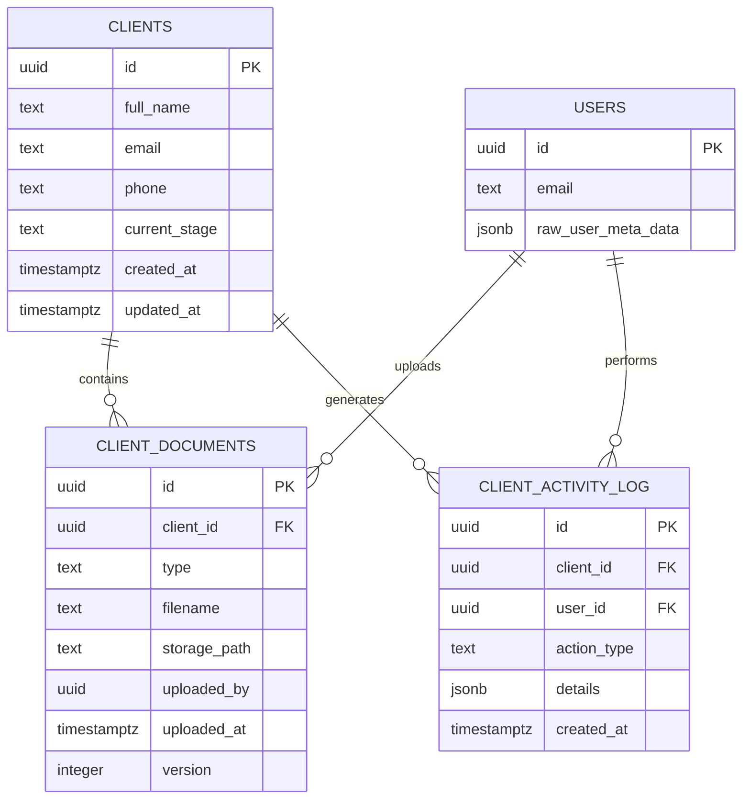
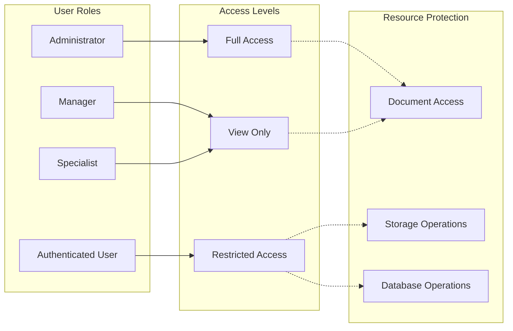
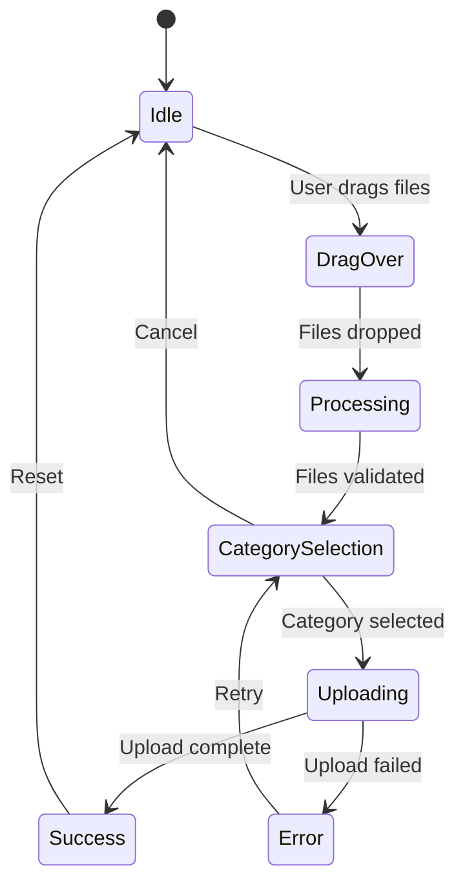
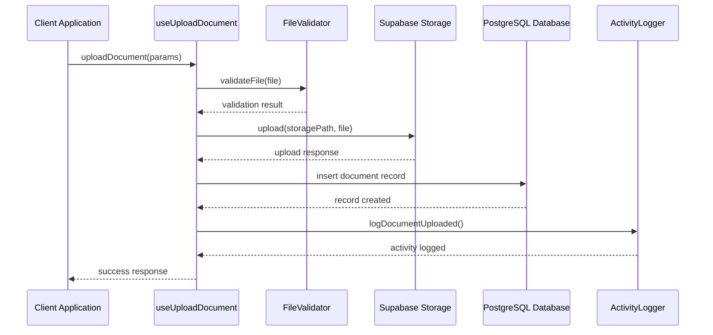
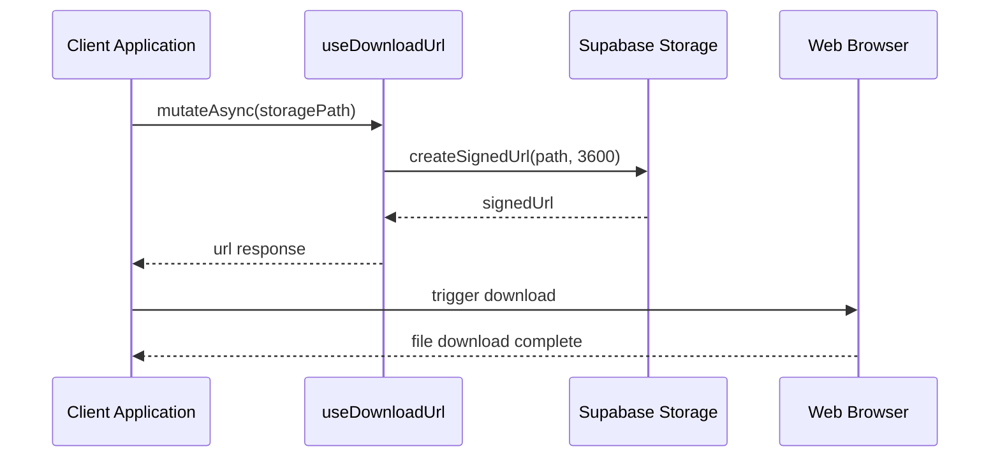

# Document Management System

<cite>
**Referenced Files in This Document**
- [README.md](file://README.md)
- [package.json](file://package.json)
- [DocumentUpload.tsx](file://src/components/command-center/documents/DocumentUpload.tsx)
- [DocumentList.tsx](file://src/components/command-center/documents/DocumentList.tsx)
- [DocumentPreview.tsx](file://src/components/command-center/documents/DocumentPreview.tsx)
- [DocumentCategoryBadge.tsx](file://src/components/command-center/documents/DocumentCategoryBadge.tsx)
- [useClientDocuments.ts](file://src/hooks/useClientDocuments.ts)
- [client.ts](file://src/integrations/supabase/client.ts)
- [20260330000000_command_center_schema.sql](file://supabase/migrations/20260330000000_command_center_schema.sql)
- [20260330000002_command_center_schema_recovery.sql](file://supabase/migrations/20260330000002_command_center_schema_recovery.sql)
- [DocumentsTab.tsx](file://src/components/command-center/client-detail/DocumentsTab.tsx)
- [ClientDetailView.tsx](file://src/pages/command-center/ClientDetailView.tsx)
</cite>

## Table of Contents
1. [Introduction](#introduction)
2. [System Architecture](#system-architecture)
3. [Core Components](#core-components)
4. [Document Management Features](#document-management-features)
5. [Supabase Integration](#supabase-integration)
6. [Security Model](#security-model)
7. [User Interface Components](#user-interface-components)
8. [Data Flow Analysis](#data-flow-analysis)
9. [Performance Considerations](#performance-considerations)
10. [Troubleshooting Guide](#troubleshooting-guide)
11. [Conclusion](#conclusion)

## Introduction

The Document Management System is a comprehensive solution built for the Ryland funding platform that enables secure document upload, storage, retrieval, and management for client records. This system integrates seamlessly with the Command Center interface, providing financial professionals with robust document handling capabilities while maintaining strict security and compliance standards.

The system leverages modern web technologies including React, TypeScript, Supabase, and a sophisticated client-side architecture to deliver a seamless document management experience. It supports multiple document types, version control, real-time updates, and comprehensive access controls tailored for financial services environments.

## System Architecture

The Document Management System follows a modular, component-based architecture designed for scalability and maintainability:

**Diagram sources**
- [DocumentUpload.tsx:1-312](file://src/components/command-center/documents/DocumentUpload.tsx#L1-L312)
- [useClientDocuments.ts:1-456](file://src/hooks/useClientDocuments.ts#L1-L456)
- [client.ts:1-17](file://src/integrations/supabase/client.ts#L1-L17)

The architecture consists of three main layers:
- **Presentation Layer**: React components handling user interactions
- **Business Logic Layer**: Custom hooks managing document operations
- **Data Access Layer**: Supabase integration for storage and database operations

## Core Components

### Document Upload System

The upload system provides a comprehensive file upload interface with drag-and-drop support, progress tracking, and validation:

**Diagram sources**
- [DocumentUpload.tsx:109-155](file://src/components/command-center/documents/DocumentUpload.tsx#L109-L155)
- [useClientDocuments.ts:114-189](file://src/hooks/useClientDocuments.ts#L114-L189)

### Document Management Interface

The document management interface offers multiple views and filtering capabilities:

**Diagram sources**
- [DocumentUpload.tsx:40-312](file://src/components/command-center/documents/DocumentUpload.tsx#L40-L312)
- [DocumentList.tsx:72-588](file://src/components/command-center/documents/DocumentList.tsx#L72-L588)
- [DocumentPreview.tsx:42-417](file://src/components/command-center/documents/DocumentPreview.tsx#L42-L417)
- [DocumentCategoryBadge.tsx:20-41](file://src/components/command-center/documents/DocumentCategoryBadge.tsx#L20-L41)

**Section sources**
- [DocumentUpload.tsx:1-312](file://src/components/command-center/documents/DocumentUpload.tsx#L1-L312)
- [DocumentList.tsx:1-588](file://src/components/command-center/documents/DocumentList.tsx#L1-L588)
- [DocumentPreview.tsx:1-417](file://src/components/command-center/documents/DocumentPreview.tsx#L1-L417)
- [DocumentCategoryBadge.tsx:1-41](file://src/components/command-center/documents/DocumentCategoryBadge.tsx#L1-L41)

## Document Management Features

### Supported Document Types

The system supports seven distinct document categories, each with specific validation rules and display characteristics:

| Document Type | Description | File Extensions | Color Theme |
|---------------|-------------|-----------------|-------------|
| DriverLicense | Driver's license documents | PDF, PNG, JPG, JPEG, GIF, WEBP | Blue |
| SSNCard | Social Security Number cards | PDF, PNG, JPG, JPEG, GIF, WEBP | Red |
| TaxReturn | Tax return documents | PDF, PNG, JPG, JPEG, GIF, WEBP | Purple |
| BankStatement | Financial institution statements | PDF, PNG, JPG, JPEG, GIF, WEBP | Green |
| ArticlesOfOrganization | Business formation documents | PDF, PNG, JPG, JPEG, GIF, WEBP | Amber |
| EINLetter | Employer Identification Number documents | PDF, PNG, JPG, JPEG, GIF, WEBP | Teal |
| Other | Miscellaneous documents | PDF, PNG, JPG, JPEG, GIF, WEBP | Slate |

### File Validation and Security

The system implements comprehensive file validation to ensure security and compatibility:

**Diagram sources**
- [useClientDocuments.ts:73-87](file://src/hooks/useClientDocuments.ts#L73-L87)
- [useClientDocuments.ts:114-189](file://src/hooks/useClientDocuments.ts#L114-L189)

### Version Control System

The document management system implements a robust version control mechanism:

- **Automatic Versioning**: Each replacement creates a new version with incrementing version numbers
- **Version History**: Complete audit trail of all document versions
- **Rollback Capability**: Ability to access previous versions
- **Metadata Tracking**: Timestamps, user information, and change descriptions

**Section sources**
- [useClientDocuments.ts:250-351](file://src/hooks/useClientDocuments.ts#L250-L351)
- [useClientDocuments.ts:309-350](file://src/hooks/useClientDocuments.ts#L309-L350)

## Supabase Integration

### Database Schema Design

The system utilizes a normalized database schema optimized for document management:

**Diagram sources**
- [20260330000000_command_center_schema.sql:143-187](file://supabase/migrations/20260330000000_command_center_schema.sql#L143-L187)

### Storage Configuration

The system uses Supabase Storage with dedicated bucket configuration:

- **Bucket Name**: `client-documents`
- **Access Control**: Private storage requiring authentication
- **File Size Limit**: 10MB per document
- **Supported Formats**: PDF, PNG, JPG, JPEG, GIF, WEBP
- **Path Structure**: `{client_id}/{document_type}/{timestamp}-{sanitized_filename}`

**Section sources**
- [client.ts:1-17](file://src/integrations/supabase/client.ts#L1-L17)
- [useClientDocuments.ts:127-130](file://src/hooks/useClientDocuments.ts#L127-L130)

## Security Model

### Role-Based Access Control

The system implements a multi-layered security model based on user roles:

### Row-Level Security Policies

The database enforces strict row-level security policies:

- **Administrators**: Full access to all client documents
- **Managers/Specialists**: Access only to clients they are assigned to
- **Storage Policies**: Files stored with client-specific paths
- **Activity Logging**: Comprehensive audit trail of all operations

**Section sources**
- [20260330000000_command_center_schema.sql:354-394](file://supabase/migrations/20260330000000_command_center_schema.sql#L354-L394)
- [20260330000000_command_center_schema.sql:774-833](file://supabase/migrations/20260330000000_command_center_schema.sql#L774-L833)

## User Interface Components

### Document Upload Component

The upload component provides an intuitive drag-and-drop interface with comprehensive feedback:

**Diagram sources**
- [DocumentUpload.tsx:40-163](file://src/components/command-center/documents/DocumentUpload.tsx#L40-L163)

### Document List Interface

The document list offers flexible viewing modes with advanced filtering:

- **Grid View**: Visual thumbnail representation with metadata
- **List View**: Detailed table format with sortable columns
- **Filtering**: By document type, date range, and status
- **Sorting**: Multiple criteria including upload date, type, and name
- **Actions**: Preview, download, replace, and delete operations

### Document Preview System

The preview system supports multiple file formats with specialized handling:

- **PDF Documents**: Embedded viewer with navigation controls
- **Image Files**: Zoom functionality with pan controls
- **Other Formats**: Direct download option with file type indicators

**Section sources**
- [DocumentList.tsx:397-588](file://src/components/command-center/documents/DocumentList.tsx#L397-L588)
- [DocumentPreview.tsx:221-417](file://src/components/command-center/documents/DocumentPreview.tsx#L221-L417)

## Data Flow Analysis

### Upload Process Flow

The document upload process follows a structured workflow ensuring data integrity and security:

**Diagram sources**
- [useClientDocuments.ts:114-189](file://src/hooks/useClientDocuments.ts#L114-L189)

### Download Process Flow

The download system implements secure temporary URLs with expiration:

**Diagram sources**
- [useClientDocuments.ts:354-364](file://src/hooks/useClientDocuments.ts#L354-L364)

**Section sources**
- [useClientDocuments.ts:1-456](file://src/hooks/useClientDocuments.ts#L1-L456)

## Performance Considerations

### Caching Strategy

The system implements intelligent caching mechanisms:

- **Query Caching**: React Query manages automatic caching of document lists
- **Storage Optimization**: CDN integration for improved download performance
- **Memory Management**: Efficient cleanup of file handles and temporary URLs
- **Lazy Loading**: Preview components load on demand

### Scalability Features

- **Database Indexing**: Strategic indexes on frequently queried columns
- **Pagination Support**: Built-in pagination for large document collections
- **Connection Pooling**: Optimized database connection management
- **Storage Optimization**: Efficient file organization and retrieval

## Troubleshooting Guide

### Common Issues and Solutions

**Upload Failures**
- **Symptom**: Files rejected during upload
- **Causes**: Invalid file type, size exceeded, network timeout
- **Solutions**: Verify file format and size, check network connectivity, retry operation

**Download Issues**
- **Symptom**: Download links expire or fail
- **Causes**: URL expiration, storage permissions, browser restrictions
- **Solutions**: Generate new download link, verify user permissions, check browser settings

**Access Denied Errors**
- **Symptom**: Cannot view or modify documents
- **Causes**: Insufficient permissions, role restrictions, client assignment issues
- **Solutions**: Verify user role, check client assignment, contact administrator

**Performance Problems**
- **Symptom**: Slow loading or response times
- **Causes**: Network latency, large file sizes, database queries
- **Solutions**: Optimize file sizes, implement caching, review database indexes

**Section sources**
- [useClientDocuments.ts:191-248](file://src/hooks/useClientDocuments.ts#L191-L248)
- [useClientDocuments.ts:354-364](file://src/hooks/useClientDocuments.ts#L354-L364)

## Conclusion

The Document Management System represents a comprehensive solution for handling sensitive financial documents in a secure, scalable, and user-friendly manner. The system successfully balances functionality with security, providing financial professionals with the tools they need to efficiently manage client documentation while maintaining compliance with industry standards.

Key strengths of the system include its robust security model, comprehensive validation mechanisms, intuitive user interface, and seamless integration with the broader Command Center ecosystem. The modular architecture ensures maintainability and extensibility for future enhancements.

The implementation demonstrates best practices in modern web development, leveraging React hooks, TypeScript type safety, and Supabase for a reliable and efficient document management solution tailored specifically for the financial services industry.