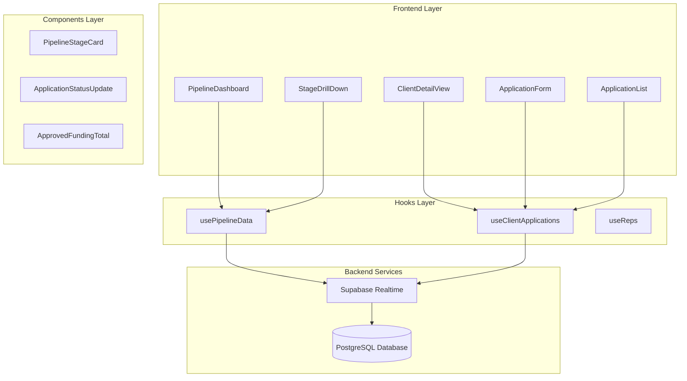
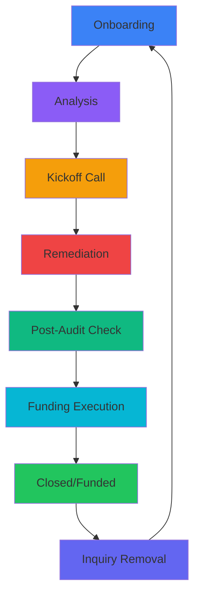
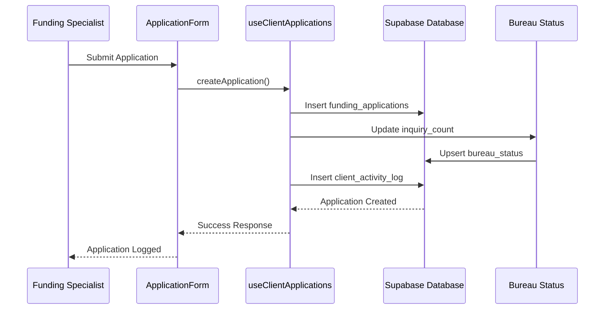
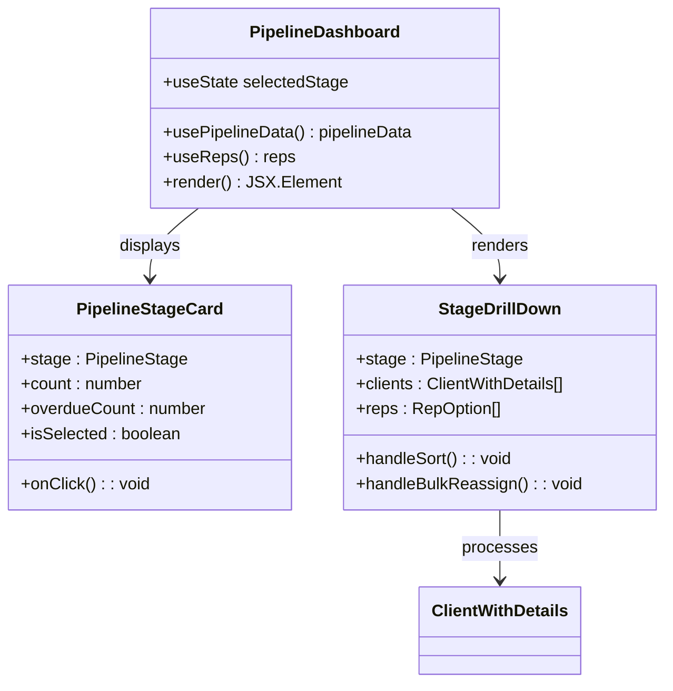
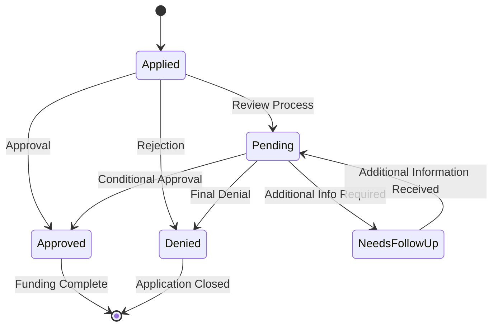
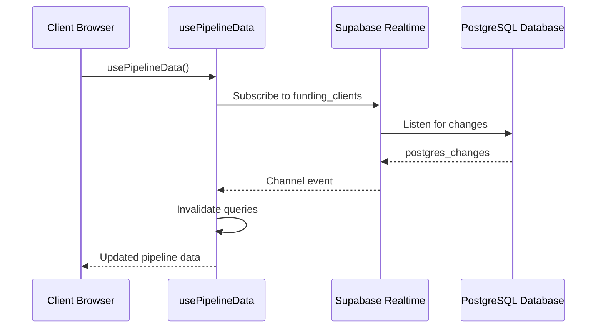
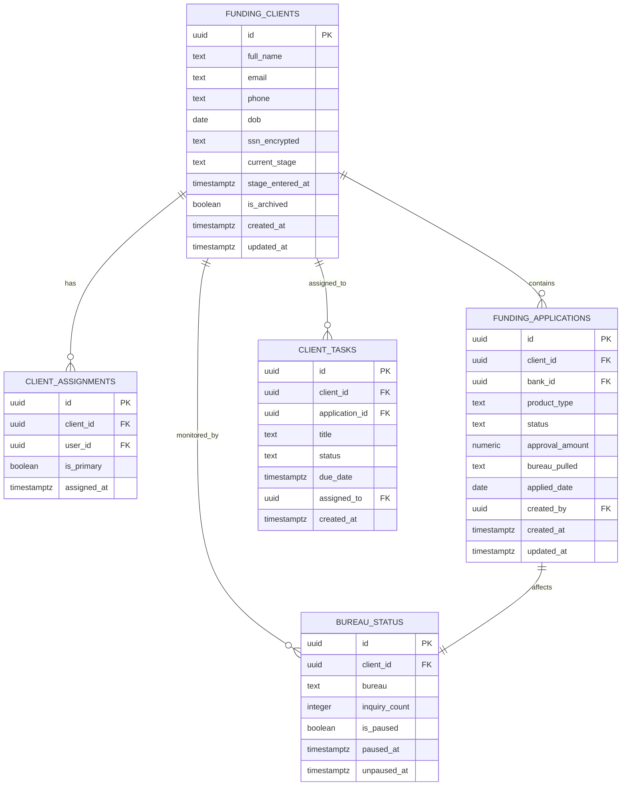

# Funding Pipeline Management

<cite>
**Referenced Files in This Document**
- [PipelineDashboard.tsx](file://src/pages/command-center/PipelineDashboard.tsx)
- [PipelineStageCard.tsx](file://src/components/command-center/pipeline/PipelineStageCard.tsx)
- [StageDrillDown.tsx](file://src/components/command-center/pipeline/StageDrillDown.tsx)
- [usePipelineData.ts](file://src/hooks/usePipelineData.ts)
- [command-center.ts](file://src/types/command-center.ts)
- [useClientApplications.ts](file://src/hooks/useClientApplications.ts)
- [ApplicationForm.tsx](file://src/components/command-center/applications/ApplicationForm.tsx)
- [ApplicationList.tsx](file://src/components/command-center/applications/ApplicationList.tsx)
- [ApplicationStatusUpdate.tsx](file://src/components/command-center/applications/ApplicationStatusUpdate.tsx)
- [ApprovedFundingTotal.tsx](file://src/components/command-center/applications/ApprovedFundingTotal.tsx)
- [ClientDetailView.tsx](file://src/pages/command-center/ClientDetailView.tsx)
- [20260330000000_command_center_schema.sql](file://supabase/migrations/20260330000000_command_center_schema.sql)
</cite>

## Table of Contents
1. [Introduction](#introduction)
2. [System Architecture](#system-architecture)
3. [Core Components](#core-components)
4. [Pipeline Management](#pipeline-management)
5. [Application Management](#application-management)
6. [Real-time Data Flow](#real-time-data-flow)
7. [Database Schema](#database-schema)
8. [Performance Considerations](#performance-considerations)
9. [Troubleshooting Guide](#troubleshooting-guide)
10. [Conclusion](#conclusion)

## Introduction

The Funding Pipeline Management system is a comprehensive client relationship management platform designed for financial services organizations. This system tracks clients through a structured funding pipeline with eight distinct stages, manages loan applications, monitors bureau status, and provides real-time analytics for funding operations.

The platform enables funding specialists and managers to oversee client progression from initial onboarding through final funding, while maintaining compliance with credit bureau regulations and managing application workflows efficiently.

## System Architecture

The Funding Pipeline Management system follows a modern React-based architecture with Supabase as the backend service, implementing real-time data synchronization and comprehensive client management capabilities.

**Diagram sources**
- [PipelineDashboard.tsx:63-168](file://src/pages/command-center/PipelineDashboard.tsx#L63-L168)
- [usePipelineData.ts:93-329](file://src/hooks/usePipelineData.ts#L93-L329)
- [useClientApplications.ts:484-549](file://src/hooks/useClientApplications.ts#L484-L549)

## Core Components

### Pipeline Management System

The pipeline management system organizes clients through eight distinct stages, each representing a specific phase in the funding process:

**Diagram sources**
- [command-center.ts:11-20](file://src/types/command-center.ts#L11-L20)

Each stage is represented by dedicated UI components that provide visual indicators and status tracking for client progression.

**Section sources**
- [command-center.ts:1-106](file://src/types/command-center.ts#L1-L106)
- [PipelineStageCard.tsx:25-85](file://src/components/command-center/pipeline/PipelineStageCard.tsx#L25-L85)

### Client Application Management

The application management system handles the complete lifecycle of funding applications, from submission to approval tracking:

**Diagram sources**
- [useClientApplications.ts:240-383](file://src/hooks/useClientApplications.ts#L240-L383)
- [ApplicationForm.tsx:110-124](file://src/components/command-center/applications/ApplicationForm.tsx#L110-L124)

**Section sources**
- [useClientApplications.ts:10-614](file://src/hooks/useClientApplications.ts#L10-L614)
- [ApplicationForm.tsx:1-396](file://src/components/command-center/applications/ApplicationForm.tsx#L1-L396)

## Pipeline Management

### Pipeline Dashboard

The Pipeline Dashboard serves as the central monitoring interface, displaying real-time client distribution across all pipeline stages with interactive filtering capabilities.

**Diagram sources**
- [PipelineDashboard.tsx:63-168](file://src/pages/command-center/PipelineDashboard.tsx#L63-L168)
- [PipelineStageCard.tsx:87-142](file://src/components/command-center/pipeline/PipelineStageCard.tsx#L87-L142)
- [StageDrillDown.tsx:108-516](file://src/components/command-center/pipeline/StageDrillDown.tsx#L108-L516)

### Stage Drill-down Functionality

The Stage Drill-down component provides detailed client information for each pipeline stage, enabling bulk operations and comprehensive client management:

**Section sources**
- [PipelineDashboard.tsx:1-169](file://src/pages/command-center/PipelineDashboard.tsx#L1-L169)
- [StageDrillDown.tsx:1-516](file://src/components/command-center/pipeline/StageDrillDown.tsx#L1-L516)

## Application Management

### Application Lifecycle Tracking

The application management system provides comprehensive tracking of funding applications through five distinct status states:

**Diagram sources**
- [useClientApplications.ts:11-16](file://src/hooks/useClientApplications.ts#L11-L16)

### Bureau Status Management

The system integrates with credit bureau systems to track inquiry counts and manage bureau pausing based on regulatory thresholds:

**Section sources**
- [useClientApplications.ts:225-237](file://src/hooks/useClientApplications.ts#L225-L237)
- [ApplicationForm.tsx:126-133](file://src/components/command-center/applications/ApplicationForm.tsx#L126-L133)

## Real-time Data Flow

The system implements real-time data synchronization using Supabase's realtime capabilities to ensure all stakeholders have access to current pipeline information.

**Diagram sources**
- [usePipelineData.ts:306-326](file://src/hooks/usePipelineData.ts#L306-L326)

**Section sources**
- [usePipelineData.ts:1-386](file://src/hooks/usePipelineData.ts#L1-L386)

## Database Schema

The database schema supports comprehensive funding pipeline management with strict row-level security policies and real-time publication capabilities.

**Diagram sources**
- [20260330000000_command_center_schema.sql:37-217](file://supabase/migrations/20260330000000_command_center_schema.sql#L37-L217)

**Section sources**
- [20260330000000_command_center_schema.sql:1-870](file://supabase/migrations/20260330000000_command_center_schema.sql#L1-L870)

## Performance Considerations

The system implements several performance optimization strategies:

- **Query Caching**: React Query provides automatic caching with configurable stale times
- **Real-time Subscriptions**: Efficient channel-based updates minimize unnecessary data transfers
- **Index Optimization**: Strategic database indexing on frequently queried columns
- **Lazy Loading**: Component-level loading states prevent blocking UI updates

**Section sources**
- [usePipelineData.ts:303](file://src/hooks/usePipelineData.ts#L303)
- [useClientApplications.ts:516-548](file://src/hooks/useClientApplications.ts#L516-L548)

## Troubleshooting Guide

### Common Issues and Solutions

**Pipeline Data Not Loading**
- Verify Supabase connection and authentication
- Check network connectivity to Supabase realtime service
- Ensure proper RLS policies are configured

**Application Submission Failures**
- Validate bank selection and bureau status
- Check approval amount formatting for approved applications
- Verify user permissions for application creation

**Real-time Updates Not Working**
- Confirm Supabase realtime publication is enabled
- Check browser console for websocket connection errors
- Verify database triggers are properly configured

**Section sources**
- [usePipelineData.ts:105-107](file://src/hooks/usePipelineData.ts#L105-L107)
- [useClientApplications.ts:263-265](file://src/hooks/useClientApplications.ts#L263-L265)

## Conclusion

The Funding Pipeline Management system provides a robust, scalable solution for financial services organizations requiring comprehensive client relationship management. The system's real-time capabilities, comprehensive application tracking, and integrated bureau management make it an essential tool for modern funding operations.

The modular architecture ensures maintainability and extensibility, while the real-time data synchronization provides stakeholders with current insights into client progression through the funding pipeline. The integration with credit bureau systems ensures compliance with regulatory requirements while maintaining operational efficiency.