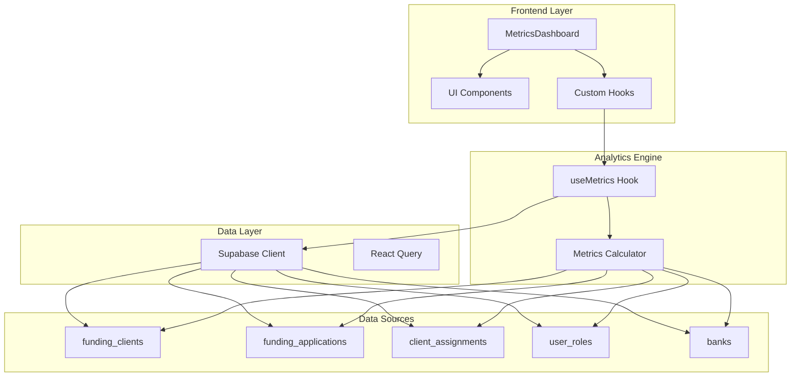
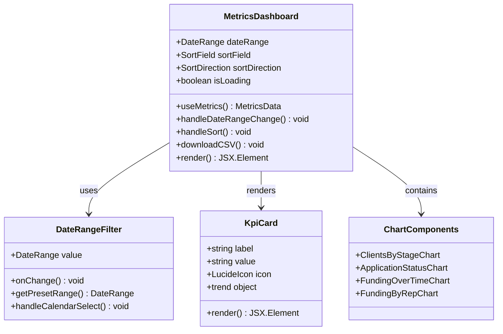
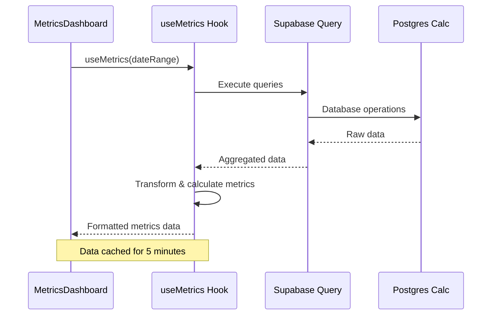
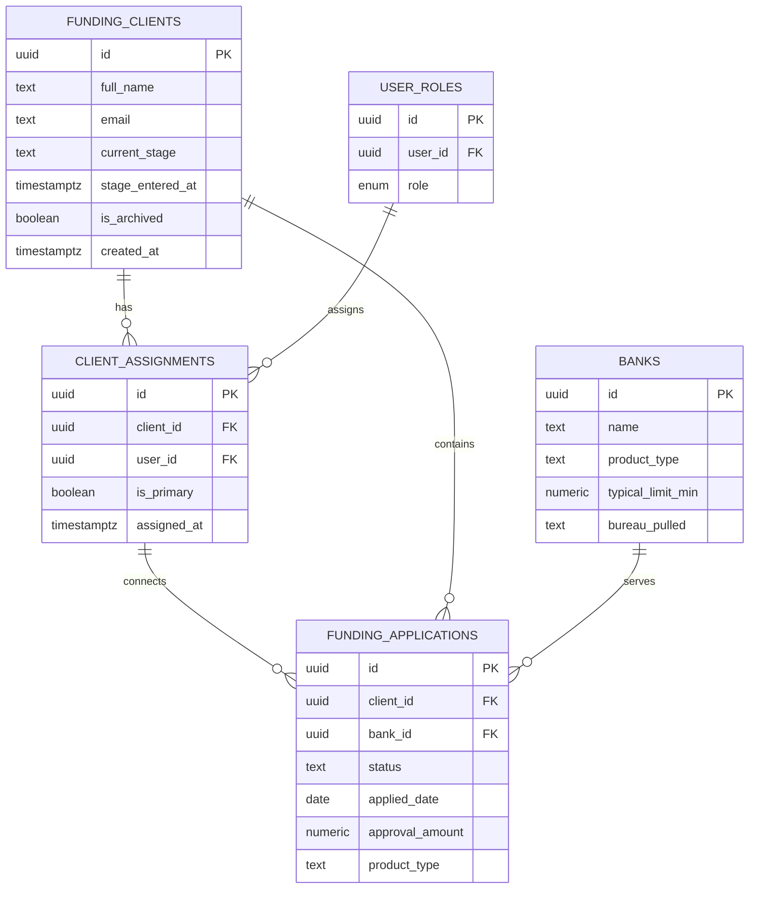
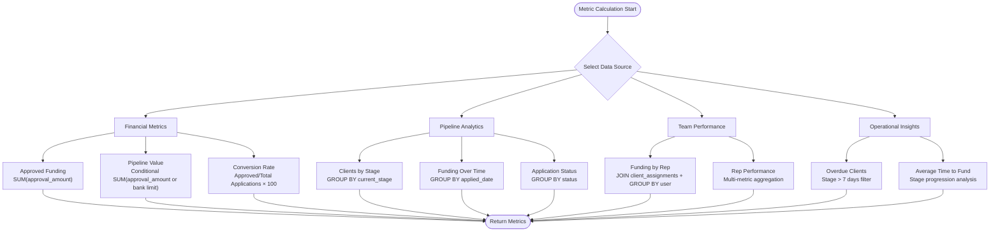
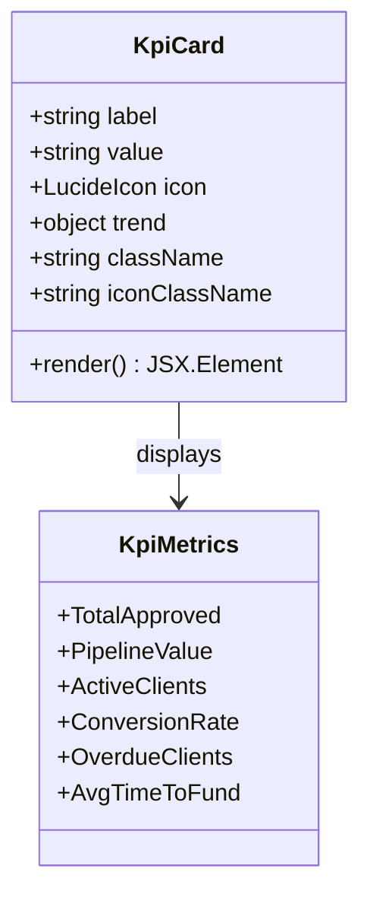
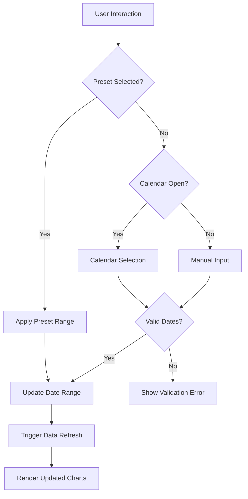
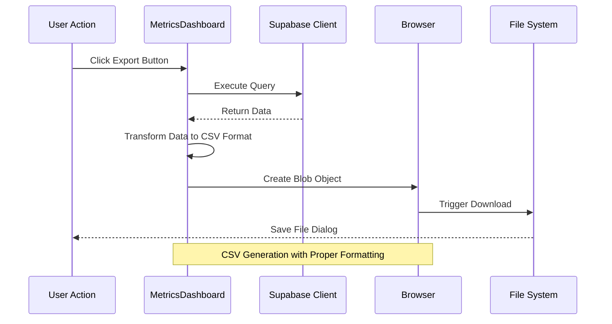
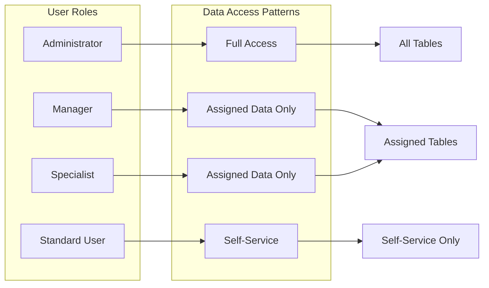

# Metrics Dashboard System

<cite>
**Referenced Files in This Document**
- [MetricsDashboard.tsx](file://src/pages/command-center/MetricsDashboard.tsx)
- [useMetrics.ts](file://src/hooks/useMetrics.ts)
- [KpiCard.tsx](file://src/components/command-center/metrics/KpiCard.tsx)
- [ClientsByStageChart.tsx](file://src/components/command-center/metrics/ClientsByStageChart.tsx)
- [ApplicationStatusChart.tsx](file://src/components/command-center/metrics/ApplicationStatusChart.tsx)
- [FundingOverTimeChart.tsx](file://src/components/command-center/metrics/FundingOverTimeChart.tsx)
- [FundingByRepChart.tsx](file://src/components/command-center/metrics/FundingByRepChart.tsx)
- [DateRangeFilter.tsx](file://src/components/command-center/metrics/DateRangeFilter.tsx)
- [client.ts](file://src/integrations/supabase/client.ts)
- [20260330000000_command_center_schema.sql](file://supabase/migrations/20260330000000_command_center_schema.sql)
- [20260324201245_4681ef67-2bf0-4686-a4b6-1ae6c54189f9.sql](file://supabase/migrations/20260324201245_4681ef67-2bf0-4686-a4b6-1ae6c54189f9.sql)
- [package.json](file://package.json)
</cite>

## Table of Contents
1. [Introduction](#introduction)
2. [System Architecture](#system-architecture)
3. [Core Components](#core-components)
4. [Data Model](#data-model)
5. [Metrics Calculation Engine](#metrics-calculation-engine)
6. [Visualization Components](#visualization-components)
7. [User Interface Components](#user-interface-components)
8. [Data Export Functionality](#data-export-functionality)
9. [Security and Access Control](#security-and-access-control)
10. [Performance Considerations](#performance-considerations)
11. [Troubleshooting Guide](#troubleshooting-guide)
12. [Conclusion](#conclusion)

## Introduction

The Metrics Dashboard System is a comprehensive analytics platform designed for the Ryland funding management system. This system provides real-time insights into client pipeline performance, funding metrics, and team productivity through an intuitive dashboard interface. Built with React, TypeScript, and Supabase, the dashboard enables command center operators to monitor key performance indicators, track client progression through various stages, and analyze funding trends over time.

The system aggregates data from multiple sources including client records, application statuses, funding approvals, and team assignments to deliver actionable insights for decision-making. It features interactive charts, customizable date range filtering, and CSV export capabilities for comprehensive reporting.

## System Architecture

The Metrics Dashboard System follows a modern React architecture with clear separation of concerns:

**Diagram sources**
- [MetricsDashboard.tsx:75-545](file://src/pages/command-center/MetricsDashboard.tsx#L75-L545)
- [useMetrics.ts:84-555](file://src/hooks/useMetrics.ts#L84-L555)

The architecture consists of several key layers:

- **Presentation Layer**: React components that render the dashboard interface
- **State Management**: React Query for data fetching and caching
- **Data Access**: Supabase client for database operations
- **Business Logic**: Custom hooks that calculate metrics and transform data
- **Data Storage**: PostgreSQL database with row-level security

**Section sources**
- [MetricsDashboard.tsx:1-546](file://src/pages/command-center/MetricsDashboard.tsx#L1-L546)
- [useMetrics.ts:1-566](file://src/hooks/useMetrics.ts#L1-L566)

## Core Components

### Metrics Dashboard Container

The main dashboard component serves as the central orchestrator, managing state, coordinating data fetching, and rendering the complete analytics interface.

**Diagram sources**
- [MetricsDashboard.tsx:75-545](file://src/pages/command-center/MetricsDashboard.tsx#L75-L545)
- [DateRangeFilter.tsx:59-143](file://src/components/command-center/metrics/DateRangeFilter.tsx#L59-L143)
- [KpiCard.tsx:17-65](file://src/components/command-center/metrics/KpiCard.tsx#L17-L65)

### Custom Hook Architecture

The `useMetrics` hook encapsulates all data fetching and calculation logic, providing a clean interface for the dashboard component.

**Diagram sources**
- [useMetrics.ts:557-563](file://src/hooks/useMetrics.ts#L557-L563)
- [MetricsDashboard.tsx:86-86](file://src/pages/command-center/MetricsDashboard.tsx#L86-L86)

**Section sources**
- [MetricsDashboard.tsx:75-545](file://src/pages/command-center/MetricsDashboard.tsx#L75-L545)
- [useMetrics.ts:84-555](file://src/hooks/useMetrics.ts#L84-L555)

## Data Model

The system operates on a well-defined relational data model optimized for funding pipeline analytics:

**Diagram sources**
- [20260330000000_command_center_schema.sql:37-142](file://supabase/migrations/20260330000000_command_center_schema.sql#L37-L142)
- [20260324201245_4681ef67-2bf0-4686-a4b6-1ae6c54189f9.sql:5-11](file://supabase/migrations/20260324201245_4681ef67-2bf0-4686-a4b6-1ae6c54189f9.sql#L5-L11)

### Key Tables and Relationships

The data model supports complex analytical queries through carefully designed relationships:

- **funding_clients**: Central table containing client information and pipeline stage tracking
- **client_assignments**: Many-to-many relationship between clients and team members
- **funding_applications**: Tracks application lifecycle with status monitoring
- **banks**: Master data for funding products and limits
- **user_roles**: Role-based access control for team member assignments

**Section sources**
- [20260330000000_command_center_schema.sql:37-142](file://supabase/migrations/20260330000000_command_center_schema.sql#L37-L142)
- [20260324201245_4681ef67-2bf0-4686-a4b6-1ae6c54189f9.sql:5-11](file://supabase/migrations/20260324201245_4681ef67-2bf0-4686-a4b6-1ae6c54189f9.sql#L5-L11)

## Metrics Calculation Engine

The metrics engine performs sophisticated aggregations across multiple database tables to generate comprehensive analytics:

### Core Metric Categories

| Metric Category | Purpose | Data Sources | Calculation Method |
|----------------|---------|--------------|-------------------|
| **Financial Metrics** | Funding totals, pipeline value, conversion rates | funding_applications, banks | SQL aggregation with conditional logic |
| **Pipeline Analytics** | Client distribution, stage progression | funding_clients, client_assignments | Client-side grouping and counting |
| **Team Performance** | Individual rep productivity, assignment metrics | client_assignments, user_roles | Multi-table joins with aggregation |
| **Operational Insights** | Overdue clients, time metrics | funding_clients, funding_applications | Date-based filtering and calculations |

### Advanced Calculations

The system implements several complex analytical calculations:

**Diagram sources**
- [useMetrics.ts:84-555](file://src/hooks/useMetrics.ts#L84-L555)

### Data Transformation Pipeline

The metrics engine transforms raw database data through multiple processing stages:

1. **Initial Query**: Fetch base datasets with appropriate filters
2. **Aggregation**: Perform SQL-level aggregations where possible
3. **Client-Side Processing**: Handle complex grouping and calculations
4. **Formatting**: Convert numbers to human-readable formats
5. **Optimization**: Cache results for improved performance

**Section sources**
- [useMetrics.ts:84-555](file://src/hooks/useMetrics.ts#L84-L555)

## Visualization Components

The dashboard employs a comprehensive suite of charting components built on Recharts:

### KPI Cards Component

**Diagram sources**
- [KpiCard.tsx:17-65](file://src/components/command-center/metrics/KpiCard.tsx#L17-L65)

### Interactive Chart Components

Each chart component handles specific visualization needs:

| Component | Chart Type | Data Format | Features |
|-----------|------------|-------------|----------|
| **ClientsByStageChart** | Bar Chart | Stage distribution | Color-coded stages, tooltips, sorting |
| **ApplicationStatusChart** | Pie Chart | Status distribution | Percentage calculations, legend |
| **FundingOverTimeChart** | Area Chart | Time series data | Currency formatting, responsive design |
| **FundingByRepChart** | Horizontal Bar Chart | Team performance | Sorting, gradient fills |

### Chart Customization

Charts implement consistent styling and interaction patterns:

- **Consistent Color Schemes**: Stage-specific colors for pipeline visualization
- **Responsive Design**: Charts adapt to different screen sizes
- **Interactive Tooltips**: Detailed information on hover
- **Loading States**: Skeleton loading for better UX
- **Empty State Handling**: Clear messaging when no data is available

**Section sources**
- [ClientsByStageChart.tsx:53-116](file://src/components/command-center/metrics/ClientsByStageChart.tsx#L53-L116)
- [ApplicationStatusChart.tsx:90-154](file://src/components/command-center/metrics/ApplicationStatusChart.tsx#L90-L154)
- [FundingOverTimeChart.tsx:58-138](file://src/components/command-center/metrics/FundingOverTimeChart.tsx#L58-L138)
- [FundingByRepChart.tsx:53-128](file://src/components/command-center/metrics/FundingByRepChart.tsx#L53-L128)

## User Interface Components

### Date Range Filter

The date range filter provides flexible temporal analysis capabilities:

**Diagram sources**
- [DateRangeFilter.tsx:59-143](file://src/components/command-center/metrics/DateRangeFilter.tsx#L59-L143)

### Data Export Functionality

The system provides comprehensive CSV export capabilities:

| Export Type | Data Source | Fields Included | Use Case |
|-------------|-------------|-----------------|----------|
| **Clients Export** | funding_clients + client_assignments | Basic client info, stage, days in stage, rep assignment | Client management reports |
| **Applications Export** | funding_applications + related tables | Application details, status, approval amounts | Funding analysis |
| **Performance Reports** | Aggregated metrics data | Team performance summaries | Executive reporting |

### Table Sorting and Filtering

The Rep Performance table implements advanced sorting capabilities:

- **Multi-column Sorting**: Click headers to sort by different metrics
- **Persistent Sort State**: Maintains sort preferences across sessions
- **Visual Indicators**: Clear icons show current sort direction
- **Type-aware Sorting**: Numbers sort numerically, text sorts alphabetically

**Section sources**
- [DateRangeFilter.tsx:59-143](file://src/components/command-center/metrics/DateRangeFilter.tsx#L59-L143)
- [MetricsDashboard.tsx:131-228](file://src/pages/command-center/MetricsDashboard.tsx#L131-L228)
- [MetricsDashboard.tsx:88-122](file://src/pages/command-center/MetricsDashboard.tsx#L88-L122)

## Data Export Functionality

The system provides robust data export capabilities through CSV generation:

### Export Process Architecture

**Diagram sources**
- [MetricsDashboard.tsx:131-228](file://src/pages/command-center/MetricsDashboard.tsx#L131-L228)

### Export Data Processing

The export functionality handles complex data transformations:

1. **Data Retrieval**: Executes optimized queries to fetch required records
2. **Relationship Resolution**: Joins related tables for comprehensive information
3. **User Mapping**: Resolves user IDs to display names using role assignments
4. **Format Conversion**: Converts dates, currencies, and numerical values
5. **CSV Generation**: Creates properly escaped CSV with headers
6. **Download Trigger**: Initiates browser download with appropriate filename

**Section sources**
- [MetricsDashboard.tsx:131-228](file://src/pages/command-center/MetricsDashboard.tsx#L131-L228)

## Security and Access Control

The system implements comprehensive security measures through Supabase's row-level security (RLS):

### Role-Based Access Control

### Security Implementation Details

The system enforces security through multiple layers:

- **Row-Level Security**: Policies restrict data access based on user roles
- **Client Assignment Validation**: Functions verify user access to specific clients
- **Role-Based Function Calls**: Specialized functions check administrative privileges
- **Real-Time Updates**: Supabase realtime publication ensures immediate security updates

### Access Control Tables

| Table | Purpose | Security Policy | Access Level |
|-------|---------|-----------------|--------------|
| **funding_clients** | Client records | Role-based filtering | Full/Admin |
| **client_assignments** | Team assignments | User self-service | Full/Admin |
| **funding_applications** | Application data | Role-based filtering | Full/Admin |
| **user_roles** | User permissions | Self-view only | Self-service |

**Section sources**
- [20260330000000_command_center_schema.sql:232-510](file://supabase/migrations/20260330000000_command_center_schema.sql#L232-L510)
- [20260324201245_4681ef67-2bf0-4686-a4b6-1ae6c54189f9.sql:15-29](file://supabase/migrations/20260324201245_4681ef67-2bf0-4686-a4b6-1ae6c54189f9.sql#L15-L29)

## Performance Considerations

### Caching Strategy

The system implements intelligent caching to optimize performance:

- **React Query Caching**: Automatic caching with 5-minute stale time
- **Client-Side Aggregation**: Complex calculations performed once per refresh
- **Index Optimization**: Strategic database indexing for frequently queried columns
- **Query Optimization**: Efficient SQL queries with appropriate filters

### Database Optimization

Performance optimizations include:

- **Indexed Columns**: Key columns for filtering and joining are indexed
- **Selective Loading**: Charts load only when visible in viewport
- **Pagination**: Large datasets are paginated to prevent timeouts
- **Connection Pooling**: Efficient database connection management

### Frontend Performance

Client-side optimizations:

- **Lazy Loading**: Charts and heavy components load on demand
- **Memoization**: Expensive calculations are memoized
- **Virtual Scrolling**: Large tables use virtual scrolling for performance
- **Debounced Queries**: Search and filter operations are debounced

## Troubleshooting Guide

### Common Issues and Solutions

| Issue | Symptoms | Solution |
|-------|----------|----------|
| **Slow Dashboard Load** | Long loading times, empty charts | Check network connectivity, verify database indexes |
| **Missing Data** | Incomplete charts, zero counts | Verify user permissions, check date range filters |
| **Export Failures** | Download errors, timeout messages | Reduce dataset size, check browser console for errors |
| **Chart Display Issues** | Blank charts, formatting errors | Clear browser cache, verify chart dependencies |

### Debugging Tools

Available debugging capabilities:

- **Console Logging**: Extensive logging for metric calculations
- **Network Monitoring**: Track API requests and response times
- **Database Query Logs**: Monitor SQL query performance
- **Error Boundaries**: Graceful error handling with user feedback

### Performance Monitoring

Key performance indicators to monitor:

- **Query Response Times**: Database operation durations
- **Chart Rendering Performance**: Component mount and update times
- **Memory Usage**: Client-side memory consumption
- **Network Bandwidth**: Data transfer volumes

**Section sources**
- [MetricsDashboard.tsx:186-189](file://src/pages/command-center/MetricsDashboard.tsx#L186-L189)
- [useMetrics.ts:557-563](file://src/hooks/useMetrics.ts#L557-L563)

## Conclusion

The Metrics Dashboard System represents a comprehensive solution for funding pipeline analytics, combining robust data modeling, sophisticated calculation engines, and intuitive visualization components. The system successfully balances performance, security, and usability while providing deep insights into operational metrics.

Key strengths of the system include:

- **Comprehensive Analytics**: Multi-dimensional metrics covering financial, operational, and team performance aspects
- **Flexible Data Access**: Role-based security with granular access controls
- **Rich Visualizations**: Interactive charts with consistent design patterns
- **Export Capabilities**: Comprehensive CSV export for external reporting
- **Performance Optimization**: Intelligent caching and query optimization

The modular architecture ensures maintainability and extensibility, allowing for future enhancements while maintaining system stability. The combination of Supabase backend services and React frontend components creates a scalable foundation for continued growth and feature expansion.