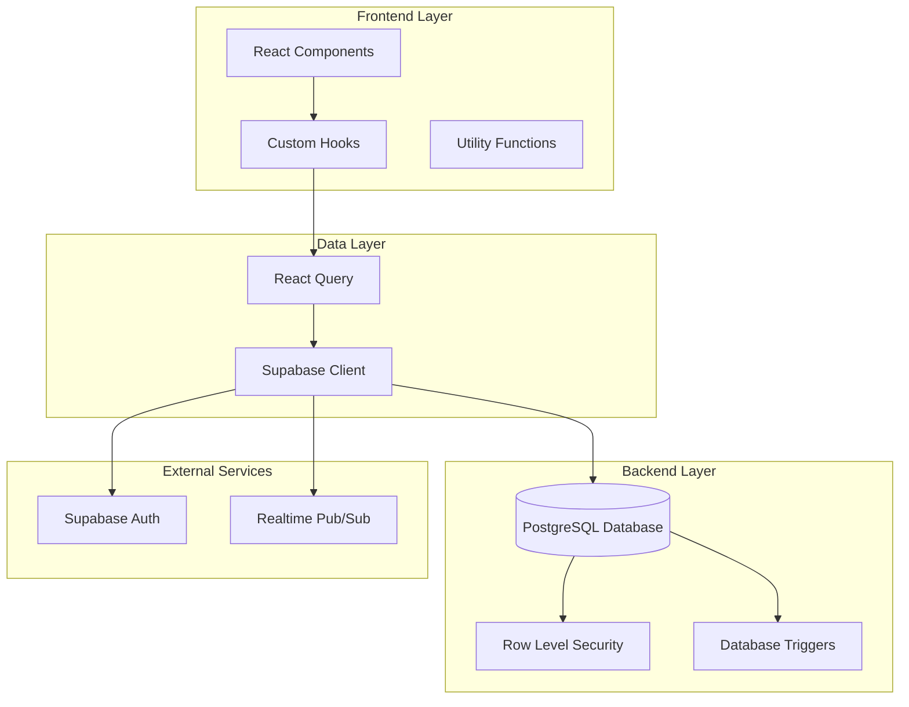
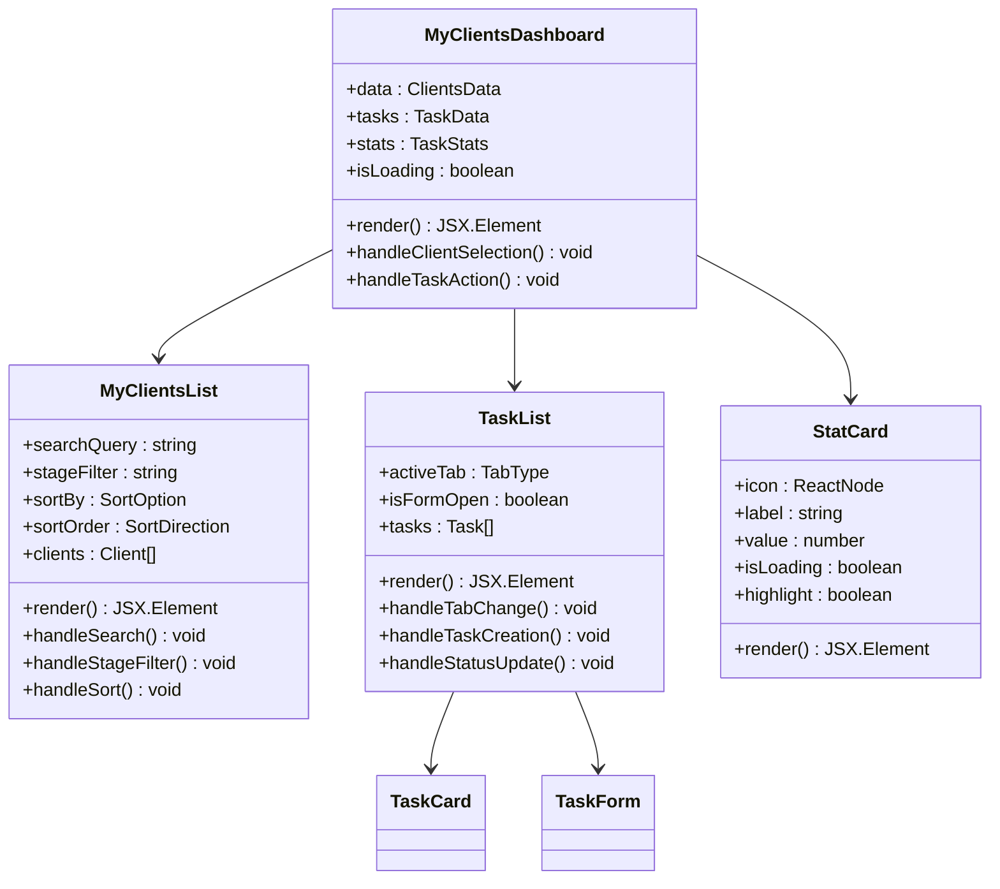
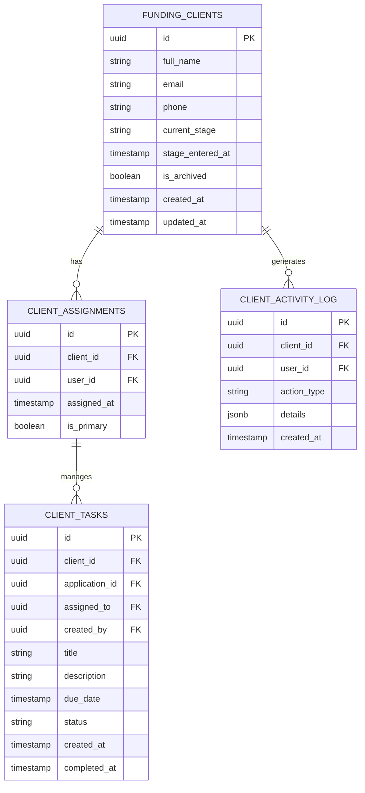
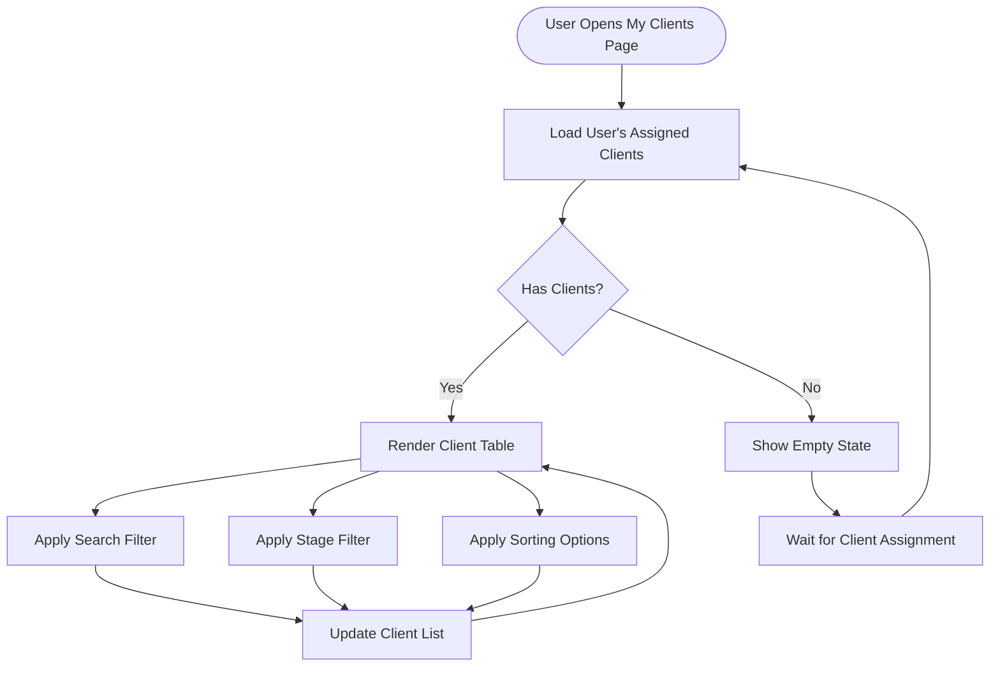
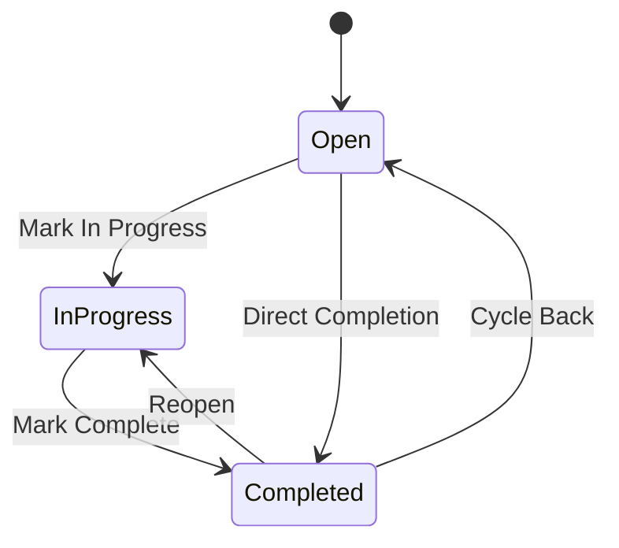
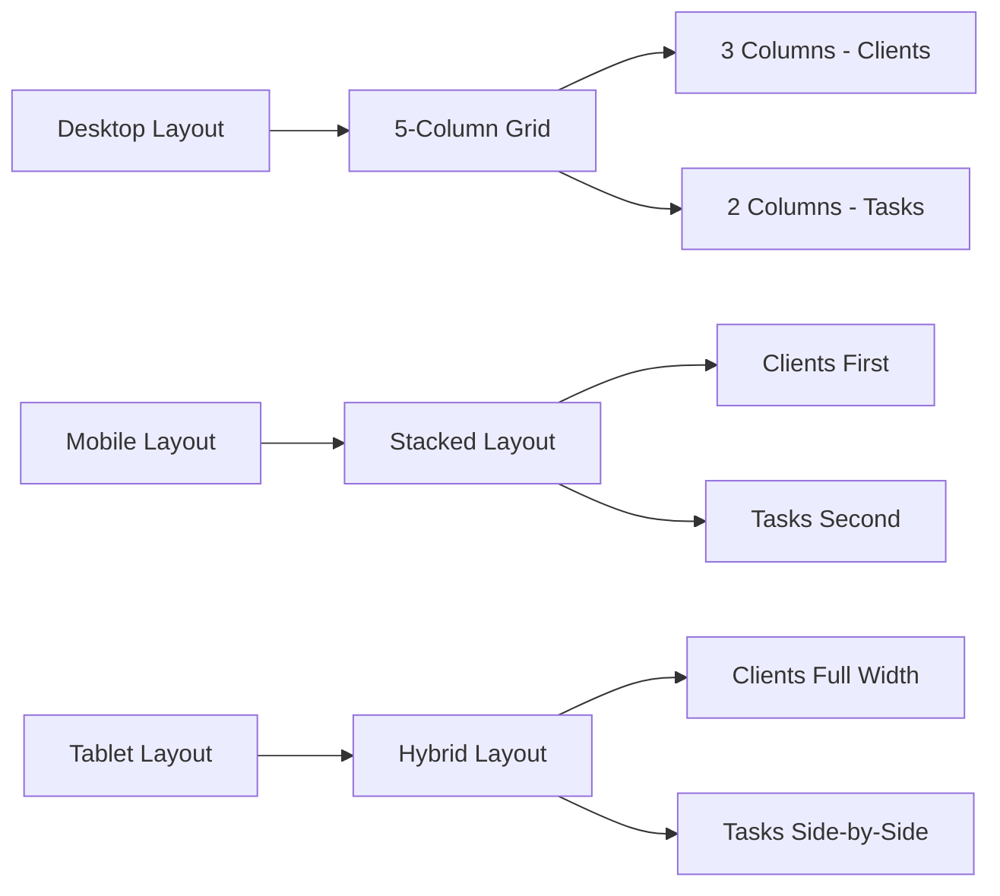

# My Clients & Tasks System

<cite>
**Referenced Files in This Document**
- [MyClientsList.tsx](file://src/components/command-center/my-clients/MyClientsList.tsx)
- [TaskCard.tsx](file://src/components/command-center/my-clients/TaskCard.tsx)
- [TaskForm.tsx](file://src/components/command-center/my-clients/TaskForm.tsx)
- [TaskList.tsx](file://src/components/command-center/my-clients/TaskList.tsx)
- [useMyClients.ts](file://src/hooks/useMyClients.ts)
- [useMyTasks.ts](file://src/hooks/useMyTasks.ts)
- [MyClients.tsx](file://src/pages/command-center/MyClients.tsx)
- [20260330000000_command_center_schema.sql](file://supabase/migrations/20260330000000_command_center_schema.sql)
- [types.ts](file://src/integrations/supabase/types.ts)
</cite>

## Table of Contents
1. [Introduction](#introduction)
2. [System Architecture](#system-architecture)
3. [Core Components](#core-components)
4. [Data Model](#data-model)
5. [Client Management](#client-management)
6. [Task Management](#task-management)
7. [User Interface Components](#user-interface-components)
8. [Integration Layer](#integration-layer)
9. [Performance Considerations](#performance-considerations)
10. [Security Implementation](#security-implementation)
11. [Troubleshooting Guide](#troubleshooting-guide)
12. [Conclusion](#conclusion)

## Introduction

The My Clients & Tasks System is a comprehensive client relationship management solution built for the Ryland funding platform. This system enables funding specialists and managers to efficiently manage their assigned clients and track daily tasks within a unified interface. The system integrates advanced filtering, sorting capabilities, real-time data synchronization, and comprehensive task management features.

The platform serves as a central hub where users can view their assigned clients, monitor client progress through various funding stages, and manage their daily workflow through an intuitive task management system. Built with modern React patterns and Supabase backend services, the system provides real-time collaboration capabilities and robust data security through row-level security policies.

## System Architecture

The My Clients & Tasks System follows a modern React architecture with a Supabase backend, implementing a clean separation of concerns through dedicated components, hooks, and services.

**Diagram sources**
- [MyClients.tsx:1-108](file://src/pages/command-center/MyClients.tsx#L1-L108)
- [useMyClients.ts:1-197](file://src/hooks/useMyClients.ts#L1-L197)
- [useMyTasks.ts:1-383](file://src/hooks/useMyTasks.ts#L1-L383)

The architecture implements several key design patterns:

- **Component-Based Architecture**: Modular React components with clear responsibilities
- **Hook-Based Data Management**: Custom hooks for data fetching, caching, and state management
- **Query-Based State Management**: React Query for server state synchronization
- **Type-Safe Database Operations**: TypeScript interfaces for database schema validation
- **Real-Time Updates**: Supabase realtime capabilities for live data synchronization

## Core Components

The system consists of several interconnected components that work together to provide a seamless user experience:

### Main Dashboard Component

The primary dashboard component orchestrates the entire system, combining client listings with task management in a responsive layout.

**Diagram sources**
- [MyClients.tsx:9-108](file://src/pages/command-center/MyClients.tsx#L9-L108)
- [MyClientsList.tsx:37-262](file://src/components/command-center/my-clients/MyClientsList.tsx#L37-L262)
- [TaskList.tsx:11-234](file://src/components/command-center/my-clients/TaskList.tsx#L11-L234)

**Section sources**
- [MyClients.tsx:1-108](file://src/pages/command-center/MyClients.tsx#L1-L108)
- [MyClientsList.tsx:1-262](file://src/components/command-center/my-clients/MyClientsList.tsx#L1-L262)
- [TaskList.tsx:1-234](file://src/components/command-center/my-clients/TaskList.tsx#L1-L234)

## Data Model

The system operates on a sophisticated relational data model designed to support complex client management scenarios in the funding industry.

**Diagram sources**
- [20260330000000_command_center_schema.sql:37-187](file://supabase/migrations/20260330000000_command_center_schema.sql#L37-L187)

### Client Assignment System

The client assignment mechanism ensures proper access control and data isolation:

- **Primary vs Secondary Assignments**: Distinction between primary and secondary client relationships
- **Automatic Assignment Creation**: Client assignments are automatically created when clients are assigned to specialists
- **Hierarchical Access Control**: Users can access clients they are assigned to, with administrative privileges for broader access

### Task Management Schema

The task system supports complex workflow scenarios with comprehensive tracking:

- **Multi-Stage Status Tracking**: Open, In Progress, and Completed task states
- **Client Association**: Tasks can be associated with specific clients for context
- **Due Date Management**: Sophisticated due date handling with overdue detection
- **Activity Logging**: Comprehensive audit trail for all task operations

**Section sources**
- [20260330000000_command_center_schema.sql:164-187](file://supabase/migrations/20260330000000_command_center_schema.sql#L164-L187)
- [types.ts:1107-1156](file://src/integrations/supabase/types.ts#L1107-L1156)

## Client Management

The client management system provides comprehensive functionality for tracking and managing client relationships throughout the funding process.

### Client Listing and Filtering

The system offers powerful client discovery and management capabilities:

**Diagram sources**
- [MyClientsList.tsx:43-48](file://src/components/command-center/my-clients/MyClientsList.tsx#L43-L48)

### Advanced Client Features

The client management system includes several sophisticated features:

- **Real-Time Stage Tracking**: Automatic calculation of days spent in current stage
- **Last Activity Monitoring**: Display of recent client actions and timestamps
- **Stage Color Coding**: Visual indicators for different client stages
- **Archived Client Filtering**: Automatic exclusion of archived clients from active lists

### Client Stage Management

The system tracks clients through eight distinct funding stages:

1. **Onboarding**: Initial client setup and information collection
2. **Analysis**: Credit analysis and risk assessment
3. **Kickoff Call**: Initial consultation and strategy discussion
4. **Remediation**: Credit repair and improvement activities
5. **Post-Audit Check**: Post-remediation verification
6. **Funding Execution**: Loan or funding arrangement execution
7. **Closed/Funded**: Deal completion and closure
8. **Inquiry Removal**: Specialized credit inquiry removal process

**Section sources**
- [MyClientsList.tsx:26-35](file://src/components/command-center/my-clients/MyClientsList.tsx#L26-L35)
- [useMyClients.ts:59-122](file://src/hooks/useMyClients.ts#L59-L122)

## Task Management

The task management system provides comprehensive workflow automation and tracking capabilities for funding specialists.

### Task Lifecycle Management

**Diagram sources**
- [TaskCard.tsx:54-61](file://src/components/command-center/my-clients/TaskCard.tsx#L54-L61)
- [useMyTasks.ts:298-311](file://src/hooks/useMyTasks.ts#L298-L311)

### Task Creation and Validation

The task creation process includes comprehensive validation and user experience enhancements:

- **Form Validation**: Zod-based validation for all task fields
- **Client Association**: Optional client selection with dynamic dropdown
- **Due Date Handling**: Interactive calendar with date validation
- **Auto-Focus Management**: Intelligent form field focus for improved UX

### Task Status Management

The system provides flexible task status management with automatic state transitions:

- **Status Cycling**: One-click status progression through task lifecycle
- **Overdue Detection**: Automatic overdue task identification and highlighting
- **Priority Indication**: Visual indicators for overdue and completed tasks
- **Client Integration**: Tasks can be linked to specific clients for context

### Task Statistics and Analytics

The system provides comprehensive task analytics through dedicated statistics hooks:

- **Daily Task Metrics**: Open, overdue, and completed task counts
- **Real-Time Updates**: Live statistics that update with task changes
- **Performance Insights**: Daily productivity metrics and trends

**Section sources**
- [TaskCard.tsx:1-187](file://src/components/command-center/my-clients/TaskCard.tsx#L1-L187)
- [TaskForm.tsx:1-251](file://src/components/command-center/my-clients/TaskForm.tsx#L1-L251)
- [TaskList.tsx:1-234](file://src/components/command-center/my-clients/TaskList.tsx#L1-L234)
- [useMyTasks.ts:120-167](file://src/hooks/useMyTasks.ts#L120-L167)

## User Interface Components

The system's user interface is built with a modern design system emphasizing usability and professional appearance.

### Responsive Layout Architecture

The interface adapts seamlessly across different screen sizes and devices:

**Diagram sources**
- [MyClients.tsx:56-66](file://src/pages/command-center/MyClients.tsx#L56-L66)

### Component Design Patterns

Each UI component follows established design patterns for consistency and maintainability:

- **Card-Based Design**: Consistent card layouts with proper spacing and typography
- **Interactive Elements**: Hover states, focus management, and keyboard navigation support
- **Loading States**: Comprehensive loading indicators and skeleton screens
- **Error Handling**: Graceful error states with user-friendly messaging

### Visual Design System

The system implements a comprehensive visual design system:

- **Color Palette**: Professional blue-based color scheme with semantic color coding
- **Typography Scale**: Clear hierarchy with appropriate font weights and sizes
- **Spacing System**: Consistent margin and padding scales throughout
- **Component Variants**: Extensive component variants for different contexts and states

**Section sources**
- [MyClients.tsx:79-108](file://src/pages/command-center/MyClients.tsx#L79-L108)
- [TaskCard.tsx:63-186](file://src/components/command-center/my-clients/TaskCard.tsx#L63-L186)

## Integration Layer

The system integrates multiple external services and internal systems to provide comprehensive functionality.

### Supabase Integration

The integration with Supabase provides several key capabilities:

- **Real-Time Data Synchronization**: Live updates for client and task data
- **Authentication Management**: Secure user authentication and session management
- **Database Abstraction**: Type-safe database operations with automatic schema validation
- **Storage Integration**: Secure file storage for client documents

### Authentication and Authorization

The system implements robust authentication and authorization mechanisms:

- **Role-Based Access Control**: Distinct permissions for administrators, managers, and specialists
- **Row-Level Security**: Fine-grained data access control at the database level
- **Automatic Policy Enforcement**: Security policies enforced through database triggers
- **Session Management**: Secure session handling with automatic refresh capabilities

### External Service Integrations

The system integrates with several external services for enhanced functionality:

- **Email Services**: Transactional email delivery for notifications and alerts
- **File Storage**: Secure cloud storage for client documents and files
- **Analytics**: Performance monitoring and user behavior analytics
- **Third-Party APIs**: Integration points for external services and data sources

**Section sources**
- [useMyClients.ts:29-65](file://src/hooks/useMyClients.ts#L29-L65)
- [useMyTasks.ts:37-83](file://src/hooks/useMyTasks.ts#L37-L83)

## Performance Considerations

The system is designed with performance optimization as a core consideration, implementing several strategies for efficient operation.

### Data Loading Strategies

The system employs sophisticated data loading and caching strategies:

- **Smart Caching**: Strategic caching with appropriate stale times for different data types
- **Lazy Loading**: Components load data only when needed, reducing initial load times
- **Pagination Support**: Efficient handling of large datasets with pagination
- **Background Sync**: Automatic background updates without blocking user interactions

### Optimized Data Fetching

Several optimization techniques are employed for efficient data retrieval:

- **Selective Field Loading**: Only required fields are fetched from the database
- **Query Optimization**: Efficient database queries with proper indexing
- **Batch Operations**: Multiple operations combined into single database calls
- **Debounced Searches**: Search operations are debounced to reduce database load

### Frontend Performance

The frontend implementation includes several performance optimizations:

- **Component Memoization**: React.memo usage for expensive components
- **Virtual Scrolling**: Large lists use virtual scrolling for smooth performance
- **Code Splitting**: Dynamic imports for lazy loading of heavy components
- **Bundle Optimization**: Tree shaking and dead code elimination

### Database Performance

The database layer is optimized for high-performance operations:

- **Index Optimization**: Strategic indexing for frequently queried fields
- **Query Optimization**: Efficient query patterns with proper joins and filters
- **Connection Pooling**: Optimized database connection management
- **Caching Strategies**: Multi-level caching for frequently accessed data

**Section sources**
- [useMyClients.ts:170-176](file://src/hooks/useMyClients.ts#L170-L176)
- [useMyTasks.ts:112-118](file://src/hooks/useMyTasks.ts#L112-L118)

## Security Implementation

The system implements comprehensive security measures at multiple layers to protect sensitive client data and ensure regulatory compliance.

### Database Security

The database layer implements multiple security measures:

- **Row-Level Security**: All tables have row-level security policies enabled
- **Access Control**: Fine-grained access control based on user roles and client assignments
- **Data Isolation**: Proper isolation between different users and client groups
- **Audit Trails**: Comprehensive logging of all data access and modifications

### Authentication Security

The authentication system provides robust security features:

- **Secure Sessions**: Session management with automatic expiration and renewal
- **Multi-Factor Authentication**: Support for additional authentication factors
- **Session Validation**: Regular validation of session integrity and user identity
- **Token Management**: Secure handling of authentication tokens and refresh cycles

### Data Protection

The system implements comprehensive data protection measures:

- **Encryption**: Sensitive data encryption at rest and in transit
- **Data Masking**: Display of sensitive information with appropriate masking
- **Access Logging**: Comprehensive logging of all data access attempts
- **Compliance**: Adherence to financial industry security standards

### Network Security

Network-level security measures protect against various threats:

- **HTTPS Enforcement**: All communications encrypted with TLS
- **CORS Policies**: Strict cross-origin resource sharing policies
- **Rate Limiting**: Protection against abuse and denial-of-service attacks
- **Input Validation**: Comprehensive validation of all user inputs

**Section sources**
- [20260330000000_command_center_schema.sql:221-452](file://supabase/migrations/20260330000000_command_center_schema.sql#L221-L452)

## Troubleshooting Guide

This section provides guidance for common issues and their solutions within the My Clients & Tasks System.

### Client Data Issues

**Problem**: Clients not appearing in the system
**Solution**: Verify user assignment to clients and check for archived status

**Problem**: Stage information not updating
**Solution**: Refresh the page and check database connectivity

**Problem**: Search functionality not working
**Solution**: Clear browser cache and verify search parameters

### Task Management Issues

**Problem**: Tasks not appearing in task list
**Solution**: Check task assignment and status filters

**Problem**: Task status not updating
**Solution**: Verify database connectivity and user permissions

**Problem**: Due date validation errors
**Solution**: Check date format and timezone settings

### Performance Issues

**Problem**: Slow page loading
**Solution**: Clear browser cache and check network connectivity

**Problem**: Data not refreshing
**Solution**: Force refresh and check for maintenance mode

**Problem**: Memory leaks in long sessions
**Solution**: Restart browser and clear local storage

### Authentication Issues

**Problem**: Login failures
**Solution**: Check credentials and network connectivity

**Problem**: Permission errors
**Solution**: Verify user role and client assignments

**Problem**: Session timeouts
**Solution**: Check browser settings and network stability

### Database Connectivity Issues

**Problem**: Cannot connect to database
**Solution**: Check Supabase service status and connection parameters

**Problem**: Data inconsistencies
**Solution**: Verify database integrity and check for concurrent access conflicts

**Problem**: Migration failures
**Solution**: Review migration logs and check database schema version

**Section sources**
- [useMyClients.ts:63-65](file://src/hooks/useMyClients.ts#L63-L65)
- [useMyTasks.ts:77-79](file://src/hooks/useMyTasks.ts#L77-L79)

## Conclusion

The My Clients & Tasks System represents a comprehensive solution for managing client relationships and daily workflows in the funding industry. The system successfully combines modern React development practices with robust backend services to provide a secure, scalable, and user-friendly platform.

Key achievements of the system include:

- **Comprehensive Client Management**: Advanced client tracking with stage management and activity monitoring
- **Robust Task System**: Flexible task management with status tracking and deadline enforcement
- **Security Excellence**: Multi-layered security implementation with proper access controls
- **Performance Optimization**: Carefully optimized for speed and efficiency across all components
- **User Experience**: Intuitive interface design with responsive layouts and comprehensive accessibility

The system's modular architecture ensures maintainability and extensibility, while the comprehensive testing and validation processes guarantee reliability and quality. The integration with Supabase provides a solid foundation for future growth and enhancement.

Future enhancements could include expanded reporting capabilities, advanced analytics features, mobile application development, and integration with additional third-party services to further enhance the client and task management experience.