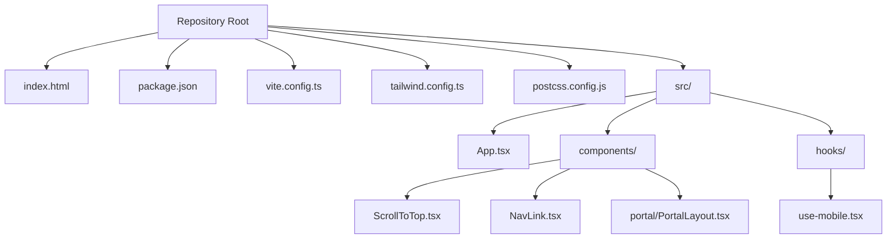
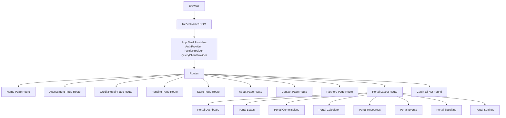
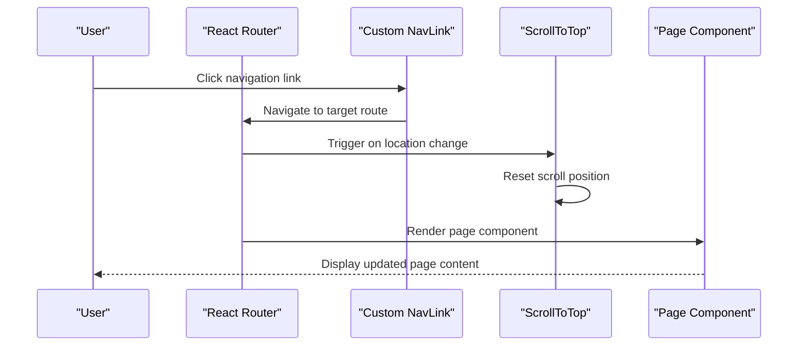
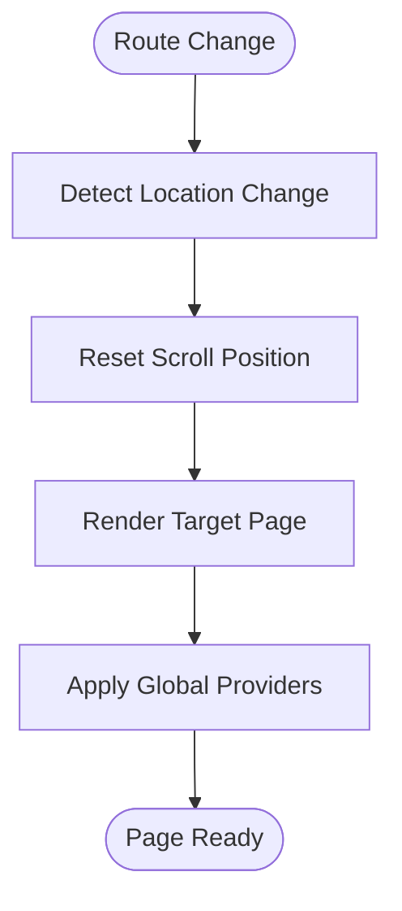
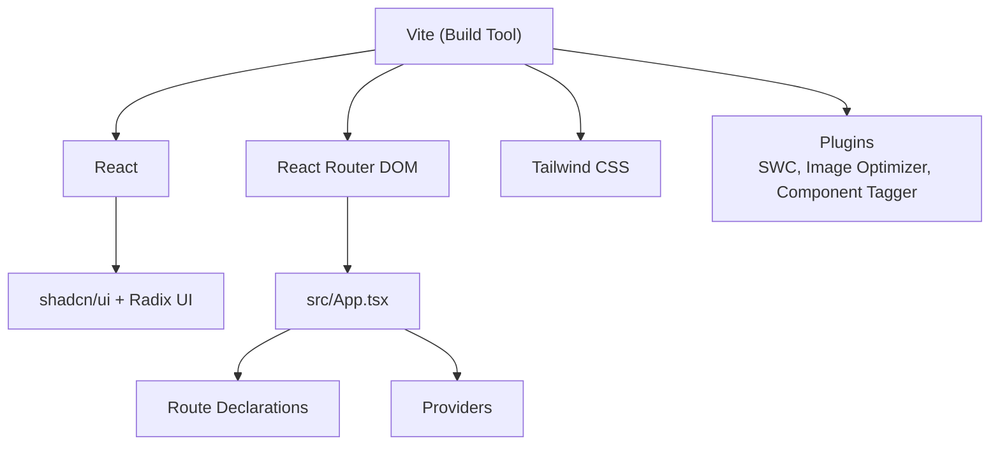

# Pages & Routing

<cite>
**Referenced Files in This Document**
- [README.md](file://README.md)
- [package.json](file://package.json)
- [index.html](file://index.html)
- [vite.config.ts](file://vite.config.ts)
- [tailwind.config.ts](file://tailwind.config.ts)
- [postcss.config.js](file://postcss.config.js)
- [src/App.tsx](file://src/App.tsx)
- [src/components/ScrollToTop.tsx](file://src/components/ScrollToTop.tsx)
- [src/components/NavLink.tsx](file://src/components/NavLink.tsx)
- [src/components/portal/PortalLayout.tsx](file://src/components/portal/PortalLayout.tsx)
- [src/hooks/use-mobile.tsx](file://src/hooks/use-mobile.tsx)
</cite>

## Table of Contents
1. [Introduction](#introduction)
2. [Project Structure](#project-structure)
3. [Core Components](#core-components)
4. [Architecture Overview](#architecture-overview)
5. [Detailed Component Analysis](#detailed-component-analysis)
6. [Dependency Analysis](#dependency-analysis)
7. [Performance Considerations](#performance-considerations)
8. [Troubleshooting Guide](#troubleshooting-guide)
9. [Conclusion](#conclusion)
10. [Appendices](#appendices)

## Introduction
This document describes the page structure and routing system for the Ryland application. It focuses on how static pages are organized, how routing is configured, navigation patterns, page lifecycle management, shared layouts, and page-specific functionality. It also provides practical guidance for adding new pages, handling transitions, optimizing performance, and addressing SEO and responsive design considerations.

The project is a React application built with Vite, TypeScript, React Router DOM, and Tailwind CSS. It leverages shadcn/ui primitives and Radix UI components for accessible UI patterns.

**Section sources**
- [README.md:53-61](file://README.md#L53-L61)
- [package.json:15-69](file://package.json#L15-L69)

## Project Structure
The repository provides a minimal but functional foundation for a modern React application. Key elements relevant to pages and routing include:
- Application entry and HTML template with SEO metadata and preloading
- Build configuration with Vite, including code-splitting strategies
- Tailwind CSS configuration supporting responsive design and animations
- Core routing and layout components under src/

**Diagram sources**
- [index.html:1-51](file://index.html#L1-L51)
- [vite.config.ts:1-43](file://vite.config.ts#L1-L43)
- [tailwind.config.ts:1-97](file://tailwind.config.ts#L1-L97)
- [postcss.config.js:1-7](file://postcss.config.js#L1-L7)
- [src/App.tsx:90-123](file://src/App.tsx#L90-L123)
- [src/components/ScrollToTop.tsx:1-14](file://src/components/ScrollToTop.tsx#L1-L14)
- [src/components/NavLink.tsx:1-28](file://src/components/NavLink.tsx#L1-L28)
- [src/components/portal/PortalLayout.tsx:1-28](file://src/components/portal/PortalLayout.tsx#L1-L28)
- [src/hooks/use-mobile.tsx:1-19](file://src/hooks/use-mobile.tsx#L1-L19)

**Section sources**
- [index.html:14-40](file://index.html#L14-L40)
- [vite.config.ts:31-41](file://vite.config.ts#L31-L41)
- [tailwind.config.ts:4-96](file://tailwind.config.ts#L4-L96)
- [postcss.config.js:1-7](file://postcss.config.js#L1-L7)
- [src/App.tsx:90-123](file://src/App.tsx#L90-L123)

## Core Components
This section outlines the core building blocks for pages and routing in the application.

- Routing and Layout Container
  - The application’s routes are declared centrally, including nested routes for a portal area and a catch-all fallback route. The router wraps the app with providers for authentication, theming, and data fetching.

- Navigation Utilities
  - A custom NavLink wrapper integrates with React Router’s NavLink while allowing explicit active/pending class names and Tailwind utility merging.
  - A ScrollToTop component ensures smooth navigation by resetting scroll position on route changes.

- Responsive Hook
  - A mobile detection hook enables responsive behavior across pages and components.

- Portal Layout
  - A dedicated layout composes a sidebar, top bar, and outlet for authenticated portal routes.

Implementation references:
- [src/App.tsx:90-123](file://src/App.tsx#L90-L123)
- [src/components/NavLink.tsx:1-28](file://src/components/NavLink.tsx#L1-L28)
- [src/components/ScrollToTop.tsx:1-14](file://src/components/ScrollToTop.tsx#L1-L14)
- [src/hooks/use-mobile.tsx:1-19](file://src/hooks/use-mobile.tsx#L1-L19)
- [src/components/portal/PortalLayout.tsx:1-28](file://src/components/portal/PortalLayout.tsx#L1-L28)

**Section sources**
- [src/App.tsx:90-123](file://src/App.tsx#L90-L123)
- [src/components/NavLink.tsx:1-28](file://src/components/NavLink.tsx#L1-L28)
- [src/components/ScrollToTop.tsx:1-14](file://src/components/ScrollToTop.tsx#L1-L14)
- [src/hooks/use-mobile.tsx:1-19](file://src/hooks/use-mobile.tsx#L1-L19)
- [src/components/portal/PortalLayout.tsx:1-28](file://src/components/portal/PortalLayout.tsx#L1-L28)

## Architecture Overview
The routing architecture centers around React Router DOM with a provider-based setup. Static pages are mapped to routes, and nested routes encapsulate portal-related functionality. Providers manage global state and UI behavior.

**Diagram sources**
- [src/App.tsx:90-123](file://src/App.tsx#L90-L123)

**Section sources**
- [src/App.tsx:90-123](file://src/App.tsx#L90-L123)

## Detailed Component Analysis

### Routing and Navigation Patterns
- Centralized Route Declaration
  - Routes are declared in a single location, enabling clear visibility of all pages and nested areas. Nested routes under a portal layout demonstrate structured access control and consistent UI scaffolding.
- Active/Pending States
  - The custom NavLink wrapper allows explicit styling for active and pending states, improving UX during navigation.
- Scroll Behavior
  - The ScrollToTop component resets scroll position on route changes, ensuring a consistent user experience across pages.

References:
- [src/App.tsx:90-123](file://src/App.tsx#L90-L123)
- [src/components/NavLink.tsx:1-28](file://src/components/NavLink.tsx#L1-L28)
- [src/components/ScrollToTop.tsx:1-14](file://src/components/ScrollToTop.tsx#L1-L14)

**Diagram sources**
- [src/components/NavLink.tsx:1-28](file://src/components/NavLink.tsx#L1-L28)
- [src/components/ScrollToTop.tsx:1-14](file://src/components/ScrollToTop.tsx#L1-L14)
- [src/App.tsx:90-123](file://src/App.tsx#L90-L123)

**Section sources**
- [src/App.tsx:90-123](file://src/App.tsx#L90-L123)
- [src/components/NavLink.tsx:1-28](file://src/components/NavLink.tsx#L1-L28)
- [src/components/ScrollToTop.tsx:1-14](file://src/components/ScrollToTop.tsx#L1-L14)

### Shared Layouts and Page Lifecycle
- Portal Layout
  - The portal layout composes a sidebar, top bar, and outlet. It is protected by an authentication guard and provides a consistent header and navigation for authenticated routes.
- Page Lifecycle Management
  - The ScrollToTop component runs on route changes, resetting scroll position. Providers set up global state and UI behavior, influencing how pages mount and update.

References:
- [src/components/portal/PortalLayout.tsx:1-28](file://src/components/portal/PortalLayout.tsx#L1-L28)
- [src/components/ScrollToTop.tsx:1-14](file://src/components/ScrollToTop.tsx#L1-L14)
- [src/App.tsx:113-123](file://src/App.tsx#L113-L123)

**Diagram sources**
- [src/components/ScrollToTop.tsx:1-14](file://src/components/ScrollToTop.tsx#L1-L14)
- [src/App.tsx:113-123](file://src/App.tsx#L113-L123)

**Section sources**
- [src/components/portal/PortalLayout.tsx:1-28](file://src/components/portal/PortalLayout.tsx#L1-L28)
- [src/components/ScrollToTop.tsx:1-14](file://src/components/ScrollToTop.tsx#L1-L14)
- [src/App.tsx:113-123](file://src/App.tsx#L113-L123)

### Implementing New Static Pages
To add a new static page (e.g., a new informational page):
1. Create a new component for the page under src/.
2. Add a route for the new page in the central route declaration, placing it before the catch-all route.
3. Optionally wrap the page in a shared layout if applicable.
4. Use the custom NavLink component for navigation to maintain consistent active/pending styles.

Reference:
- [src/App.tsx:90-123](file://src/App.tsx#L90-L123)
- [src/components/NavLink.tsx:1-28](file://src/components/NavLink.tsx#L1-L28)

**Section sources**
- [src/App.tsx:90-123](file://src/App.tsx#L90-L123)
- [src/components/NavLink.tsx:1-28](file://src/components/NavLink.tsx#L1-L28)

### Handling Page Transitions and Animations
- Scroll-to-top behavior is handled automatically on route changes.
- For advanced transitions, consider integrating a transition library with the router and applying motion variants in page components.

Reference:
- [src/components/ScrollToTop.tsx:1-14](file://src/components/ScrollToTop.tsx#L1-L14)

**Section sources**
- [src/components/ScrollToTop.tsx:1-14](file://src/components/ScrollToTop.tsx#L1-L14)

### SEO Considerations and Meta Tags
- The HTML template defines essential SEO metadata, including viewport, title, description, author, Open Graph, Twitter Card, and favicon.
- Keep the title and description aligned with each page’s purpose. For dynamic pages, integrate a head management solution to update meta tags per route.

References:
- [index.html:23-39](file://index.html#L23-L39)

**Section sources**
- [index.html:23-39](file://index.html#L23-L39)

### Responsive Design Patterns
- Tailwind CSS is configured to support responsive breakpoints and animations.
- The use-is-mobile hook detects mobile widths and can be used to adapt UI behavior.

References:
- [tailwind.config.ts:4-96](file://tailwind.config.ts#L4-L96)
- [src/hooks/use-mobile.tsx:1-19](file://src/hooks/use-mobile.tsx#L1-L19)

**Section sources**
- [tailwind.config.ts:4-96](file://tailwind.config.ts#L4-L96)
- [src/hooks/use-mobile.tsx:1-19](file://src/hooks/use-mobile.tsx#L1-L19)

## Dependency Analysis
The routing and page system relies on a small set of core dependencies and build-time optimizations.

**Diagram sources**
- [package.json:15-69](file://package.json#L15-L69)
- [vite.config.ts:16-25](file://vite.config.ts#L16-L25)
- [src/App.tsx:113-123](file://src/App.tsx#L113-L123)

**Section sources**
- [package.json:15-69](file://package.json#L15-L69)
- [vite.config.ts:16-25](file://vite.config.ts#L16-L25)
- [src/App.tsx:113-123](file://src/App.tsx#L113-L123)

## Performance Considerations
- Code splitting and chunking are configured to separate vendor libraries, UI libraries, and Supabase dependencies, reducing initial bundle size and improving load performance.
- Image optimization is enabled via a Vite plugin to reduce payload sizes for images.
- Provider setup occurs once at the shell level, minimizing re-renders across pages.

Recommendations:
- Lazy-load heavy page components using React.lazy and Suspense boundaries around route elements.
- Defer non-critical resources and leverage browser caching strategies.
- Monitor Largest Contentful Paint (LCP) and First Input Delay (FID) metrics post-deployment.

**Section sources**
- [vite.config.ts:31-41](file://vite.config.ts#L31-L41)
- [vite.config.ts:19-24](file://vite.config.ts#L19-L24)
- [src/App.tsx:113-123](file://src/App.tsx#L113-L123)

## Troubleshooting Guide
Common issues and resolutions:
- Navigation does not scroll to top after route change
  - Ensure the ScrollToTop component is mounted within the router context and that it receives location updates.
  - Reference: [src/components/ScrollToTop.tsx:1-14](file://src/components/ScrollToTop.tsx#L1-L14)
- Active/pending styles not applied to navigation links
  - Verify the custom NavLink wrapper is used consistently and that active/pending class names are provided.
  - Reference: [src/components/NavLink.tsx:1-28](file://src/components/NavLink.tsx#L1-L28)
- Portal layout not rendering for authenticated routes
  - Confirm the portal layout route is nested and guarded by an authentication mechanism.
  - Reference: [src/components/portal/PortalLayout.tsx:1-28](file://src/components/portal/PortalLayout.tsx#L1-L28)
- SEO metadata not updating per page
  - Integrate a head management solution to dynamically update meta tags for each route.
  - References: [index.html:23-39](file://index.html#L23-L39)

**Section sources**
- [src/components/ScrollToTop.tsx:1-14](file://src/components/ScrollToTop.tsx#L1-L14)
- [src/components/NavLink.tsx:1-28](file://src/components/NavLink.tsx#L1-L28)
- [src/components/portal/PortalLayout.tsx:1-28](file://src/components/portal/PortalLayout.tsx#L1-L28)
- [index.html:23-39](file://index.html#L23-L39)

## Conclusion
The Ryland application employs a clean, centralized routing architecture with shared layouts and navigation utilities. Providers establish a robust foundation for state and UI behavior, while responsive and performance configurations support scalable growth. By following the patterns outlined here—consistent route declarations, shared layouts, and SEO-aware meta management—you can reliably implement new pages, optimize performance, and deliver a seamless user experience across desktop and mobile devices.

[No sources needed since this section summarizes without analyzing specific files]

## Appendices
- Quick reference for adding a new static page:
  - Create the page component.
  - Register a route before the catch-all.
  - Use the custom NavLink for navigation.
  - Apply responsive utilities from Tailwind and the mobile hook where appropriate.

[No sources needed since this section provides general guidance]