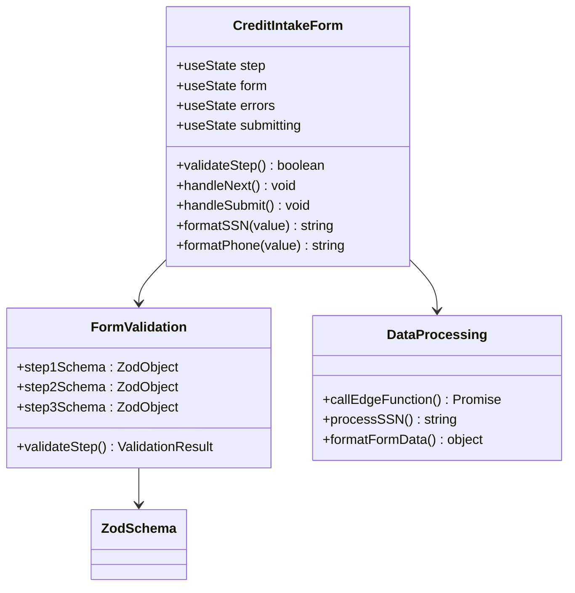
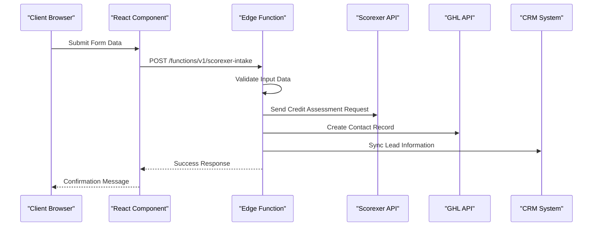
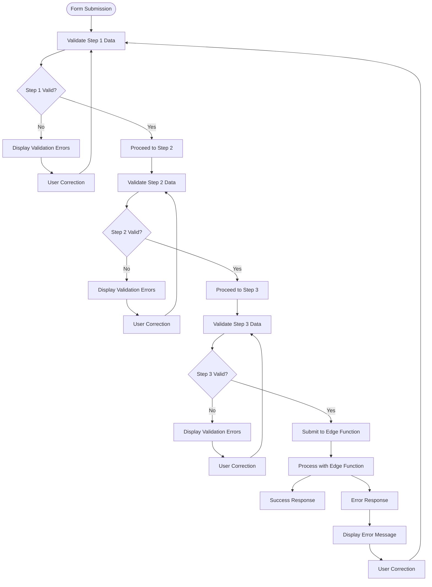
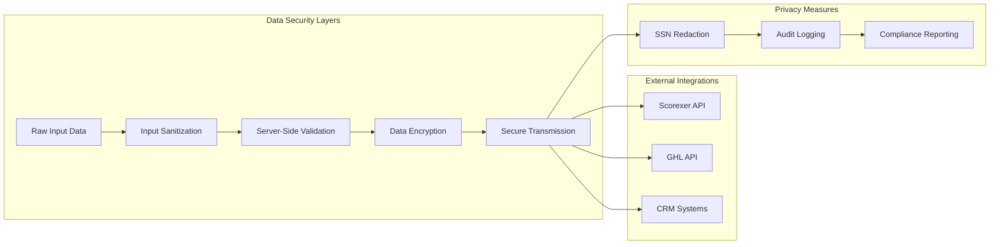
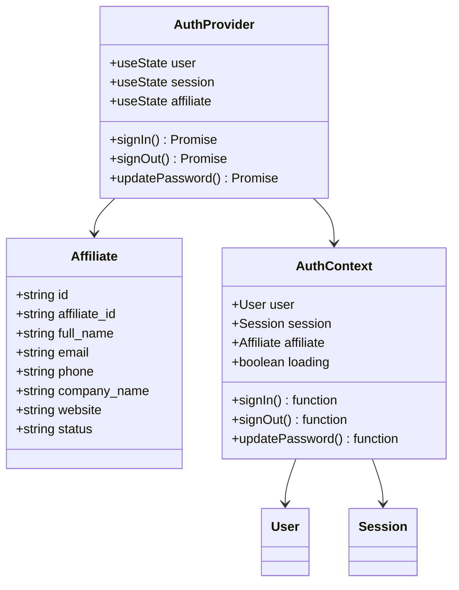
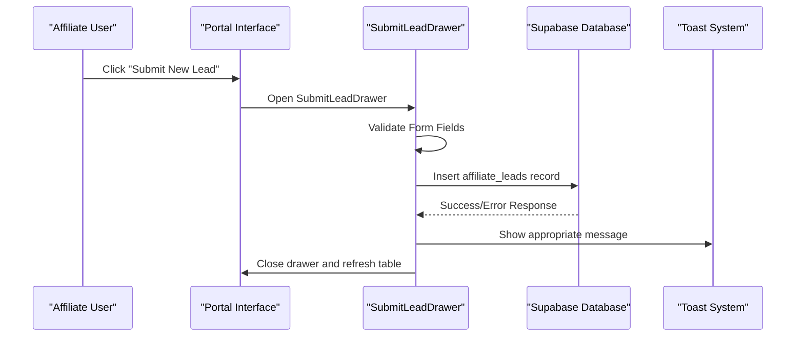
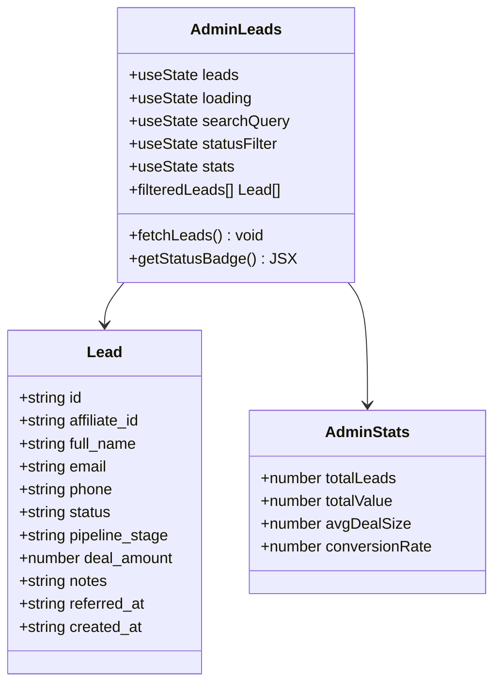

# Client Intake Form System

<cite>
**Referenced Files in This Document**
- [CreditIntake.tsx](file://src/pages/CreditIntake.tsx)
- [index.ts](file://supabase/functions/scorexer-intake/index.ts)
- [client.ts](file://src/integrations/supabase/client.ts)
- [leads.ts](file://src/types/leads.ts)
- [SubmitLeadDrawer.tsx](file://src/components/portal/SubmitLeadDrawer.tsx)
- [LeadsTable.tsx](file://src/components/portal/LeadsTable.tsx)
- [LeadDetailDrawer.tsx](file://src/components/portal/LeadDetailDrawer.tsx)
- [AdminLeads.tsx](file://src/pages/admin/AdminLeads.tsx)
- [useAuth.tsx](file://src/hooks/useAuth.tsx)
- [FunnelLeadMagnet.tsx](file://src/pages/funnel/FunnelLeadMagnet.tsx)
- [formatters.ts](file://src/utils/formatters.ts)
</cite>

## Table of Contents
1. [Introduction](#introduction)
2. [System Architecture](#system-architecture)
3. [Core Components](#core-components)
4. [Form Processing Workflow](#form-processing-workflow)
5. [Data Validation and Security](#data-validation-and-security)
6. [Integration Points](#integration-points)
7. [Portal Integration](#portal-integration)
8. [Administrative Features](#administrative-features)
9. [Performance Considerations](#performance-considerations)
10. [Troubleshooting Guide](#troubleshooting-guide)
11. [Conclusion](#conclusion)

## Introduction

The Client Intake Form System is a comprehensive web application component designed to collect client information for credit restoration services. This system provides a secure, multi-step form process that captures sensitive personal and financial information while maintaining strict privacy and compliance standards. The system integrates with external services including Scorexer for credit assessment and GHL (Get Human Life) for CRM synchronization.

The platform serves dual purposes: direct client intake for credit restoration services and affiliate lead management for partner referral programs. It features sophisticated form validation, real-time feedback, and seamless integration with backend services through Supabase Edge Functions.

## System Architecture

The Client Intake Form System follows a modern React-based architecture with serverless edge computing for sensitive data processing:

```mermaid
graph TB
subgraph "Frontend Layer"
CI[CredictIntake.tsx)
PPortal[Portal Components]
UI[UI Components]
end
subgraph "Backend Integration"
SF[Supabase Functions]
EF[Edge Function]
SC[Scorexer API]
GHL[GHL API]
end
subgraph "Data Layer"
SB[Supabase Database]
ST[Storage Buckets]
end
subgraph "External Services"
ZAP[Zapier Webhook]
CRM[CRM Systems]
end
CI --> SF
PPortal --> SB
SF --> EF
EF --> SC
EF --> GHL
EF --> ZAP
SB --> ST
GHL --> CRM
```

**Diagram sources**
- [CreditIntake.tsx:1-496](file://src/pages/CreditIntake.tsx#L1-L496)
- [index.ts:1-160](file://supabase/functions/scorexer-intake/index.ts#L1-L160)
- [client.ts:1-17](file://src/integrations/supabase/client.ts#L1-L17)

## Core Components

### Credit Intake Form Component

The primary intake form is implemented as a sophisticated multi-step wizard with advanced validation and user experience features:



**Diagram sources**
- [CreditIntake.tsx:48-67](file://src/pages/CreditIntake.tsx#L48-L67)
- [CreditIntake.tsx:102-122](file://src/pages/CreditIntake.tsx#L102-L122)

The form consists of three distinct steps:

1. **Personal Information**: Collects basic demographic data including names, email, phone, and date of birth
2. **Credit Information**: Handles sensitive SSN data with secure transmission and masking
3. **Address Information**: Captures complete mailing address details

**Section sources**
- [CreditIntake.tsx:75-496](file://src/pages/CreditIntake.tsx#L75-L496)

### Edge Function Processing

The system utilizes Supabase Edge Functions for secure, server-side processing of sensitive data:



**Diagram sources**
- [index.ts:16-160](file://supabase/functions/scorexer-intake/index.ts#L16-L160)
- [CreditIntake.tsx:20-31](file://src/pages/CreditIntake.tsx#L20-L31)

**Section sources**
- [index.ts:1-160](file://supabase/functions/scorexer-intake/index.ts#L1-L160)

## Form Processing Workflow

The intake form implements a sophisticated multi-step validation and processing workflow:



**Diagram sources**
- [CreditIntake.tsx:102-163](file://src/pages/CreditIntake.tsx#L102-L163)

The workflow ensures data integrity through progressive validation and provides immediate feedback to users during the intake process.

**Section sources**
- [CreditIntake.tsx:124-163](file://src/pages/CreditIntake.tsx#L124-L163)

## Data Validation and Security

### Client-Side Validation

The system implements comprehensive client-side validation using Zod schemas for each form step:

| Form Step | Validation Rules | Field Types |
|-----------|------------------|-------------|
| Personal Information | Names (1-50 chars), Email format, Phone (7-20 digits), DOB required | String, Email, Tel, Date |
| Credit Information | SSN format validation (9 digits), Credit monitoring selection | String, Selection |
| Address Information | Street (1-200), City (1-100), State selection, ZIP code | String, Select, String |

### Server-Side Security

The edge function provides additional security layers:



**Diagram sources**
- [index.ts:34-67](file://supabase/functions/scorexer-intake/index.ts#L34-L67)
- [index.ts:91-94](file://supabase/functions/scorexer-intake/index.ts#L91-L94)

**Section sources**
- [CreditIntake.tsx:48-67](file://src/pages/CreditIntake.tsx#L48-L67)
- [index.ts:21-67](file://supabase/functions/scorexer-intake/index.ts#L21-L67)

## Integration Points

### Supabase Authentication System

The system integrates with Supabase for secure authentication and session management:



**Diagram sources**
- [useAuth.tsx:17-28](file://src/hooks/useAuth.tsx#L17-L28)
- [useAuth.tsx:40-69](file://src/hooks/useAuth.tsx#L40-L69)

### External Service Integrations

The system integrates with multiple external services for comprehensive lead management:

| Service | Purpose | Integration Method |
|---------|---------|-------------------|
| Scorexer | Credit assessment and scoring | REST API with webhook |
| GHL (Get Human Life) | CRM and contact management | REST API with authentication |
| Zapier | Workflow automation | Webhook integration |
| Email Verification | Order lookup verification | Database storage |

**Section sources**
- [index.ts:113-152](file://supabase/functions/scorexer-intake/index.ts#L113-L152)
- [client.ts:11-17](file://src/integrations/supabase/client.ts#L11-L17)

## Portal Integration

### Affiliate Lead Management

The system provides comprehensive lead management capabilities for affiliate partners:



**Diagram sources**
- [SubmitLeadDrawer.tsx:26-56](file://src/components/portal/SubmitLeadDrawer.tsx#L26-L56)

### Lead Tracking and Analytics

The portal provides comprehensive lead tracking with real-time updates and administrative controls:

| Feature | Description | Implementation |
|---------|-------------|----------------|
| Lead Status Tracking | Real-time pipeline stage updates | Database with color-coded badges |
| Commission Management | Track affiliate commissions | Dedicated commission fields |
| Activity Logging | Lead interaction history | Timestamped updates |
| Export Capabilities | CSV export of lead data | Backend processing |

**Section sources**
- [LeadsTable.tsx:35-145](file://src/components/portal/LeadsTable.tsx#L35-L145)
- [LeadDetailDrawer.tsx:37-101](file://src/components/portal/LeadDetailDrawer.tsx#L37-L101)

## Administrative Features

### Admin Dashboard

The administrative interface provides comprehensive oversight of the entire lead management system:



**Diagram sources**
- [AdminLeads.tsx:54-155](file://src/pages/admin/AdminLeads.tsx#L54-L155)

**Section sources**
- [AdminLeads.tsx:1-351](file://src/pages/admin/AdminLeads.tsx#L1-L351)

## Performance Considerations

### Client-Side Optimizations

The system implements several performance optimizations:

- **Lazy Loading**: Components load only when needed
- **State Management**: Efficient state updates prevent unnecessary re-renders
- **Input Formatting**: Real-time formatting reduces validation overhead
- **Animation Optimization**: Framer Motion animations are hardware-accelerated

### Server-Side Efficiency

Edge functions provide optimal performance characteristics:

- **Cold Start Mitigation**: Functions remain warm during active periods
- **Parallel Processing**: Multiple external API calls occur concurrently
- **Response Caching**: Results cached where appropriate
- **Resource Cleanup**: Proper error handling prevents resource leaks

## Troubleshooting Guide

### Common Issues and Solutions

| Issue | Symptoms | Solution |
|-------|----------|----------|
| Form Validation Errors | Immediate error messages appear | Check field requirements and formats |
| Edge Function Failures | Generic error messages | Verify environment variables and API keys |
| Authentication Problems | Login failures or session timeouts | Check Supabase credentials and network connectivity |
| Integration Failures | External service errors | Review API endpoints and rate limits |

### Debugging Tools

The system includes comprehensive logging and debugging capabilities:

- **Console Logging**: Detailed server-side logs for troubleshooting
- **Error Boundaries**: Frontend error handling with user-friendly messages
- **Network Monitoring**: Real-time API call tracking
- **Performance Metrics**: Load time and resource usage monitoring

**Section sources**
- [index.ts:155-158](file://supabase/functions/scorexer-intake/index.ts#L155-L158)
- [useAuth.tsx:40-69](file://src/hooks/useAuth.tsx#L40-L69)

## Conclusion

The Client Intake Form System represents a comprehensive solution for capturing and processing client information in a secure, efficient, and scalable manner. The system successfully balances user experience with strict security requirements, providing a robust foundation for credit restoration services and affiliate lead management.

Key strengths of the system include its modular architecture, comprehensive validation layers, seamless external integrations, and administrative oversight capabilities. The implementation demonstrates best practices in modern web development while maintaining compliance with data protection and privacy regulations.

Future enhancements could include expanded integration capabilities, advanced analytics features, and additional customization options for different business scenarios.