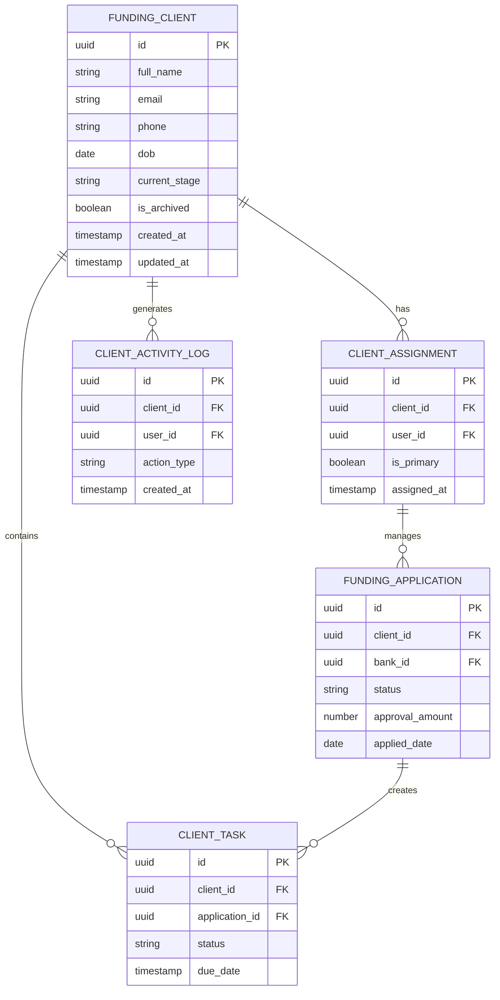
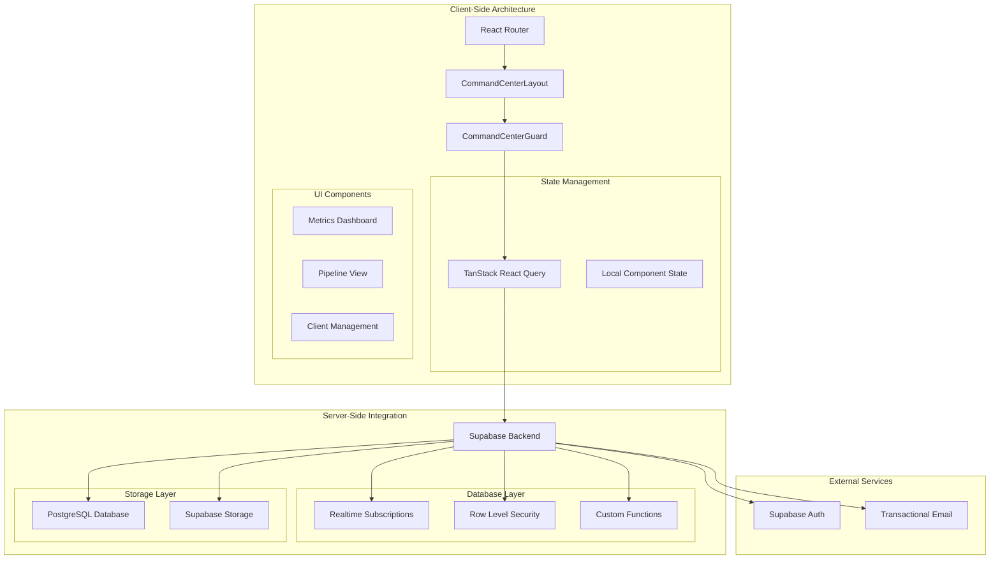
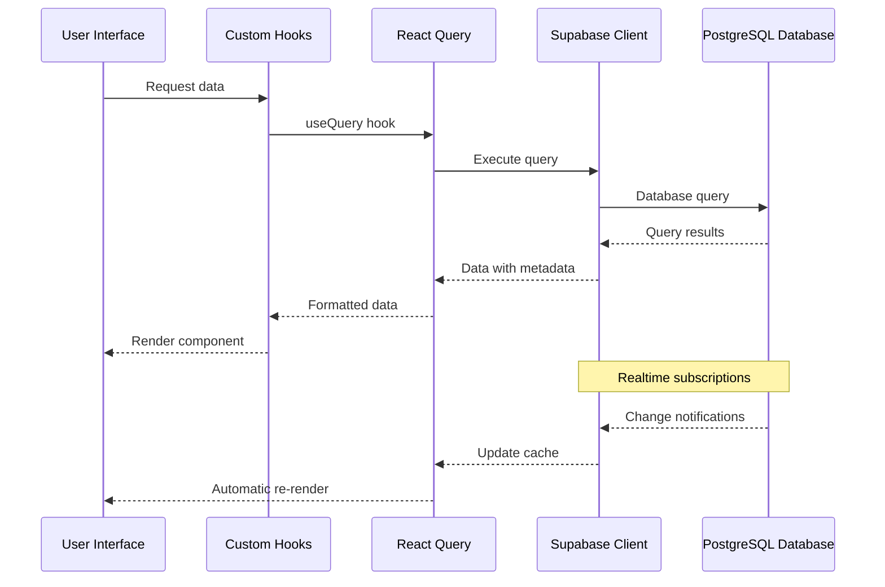
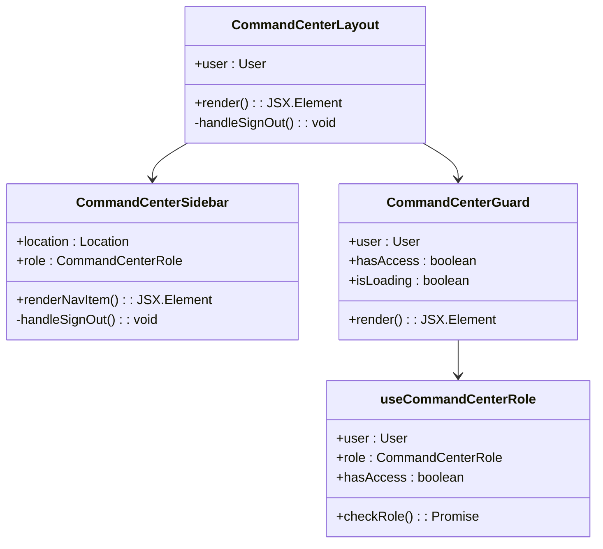
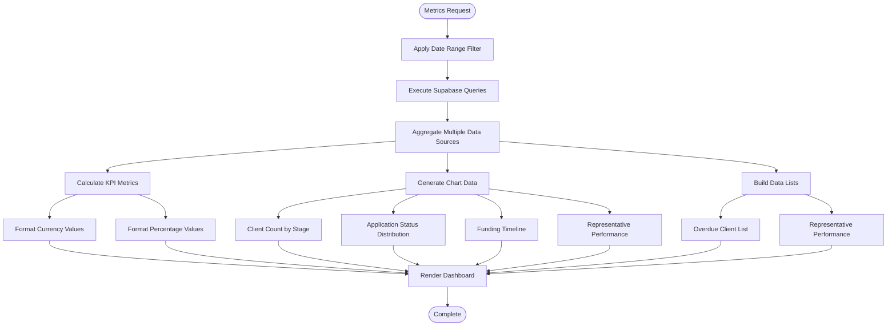
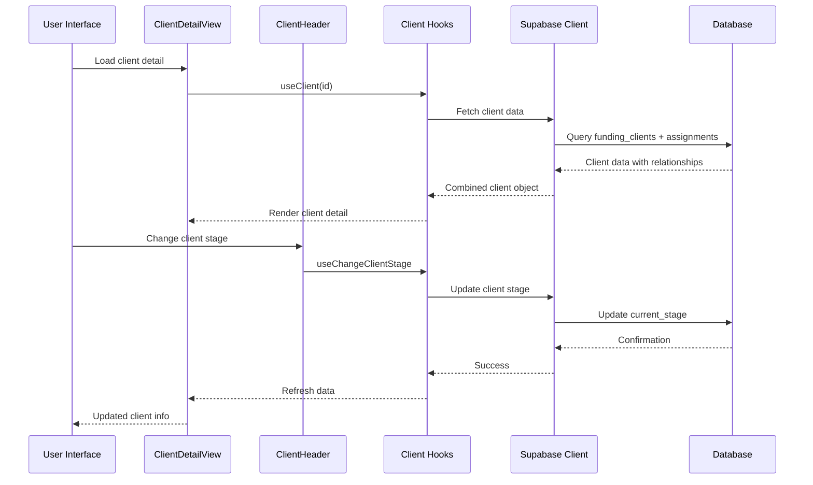
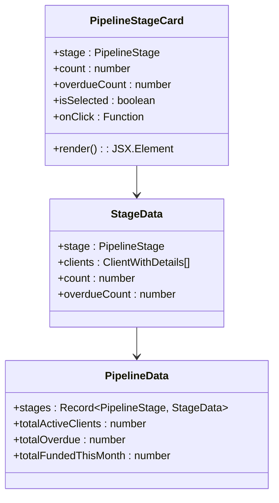
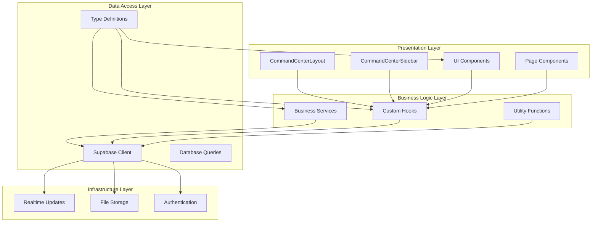
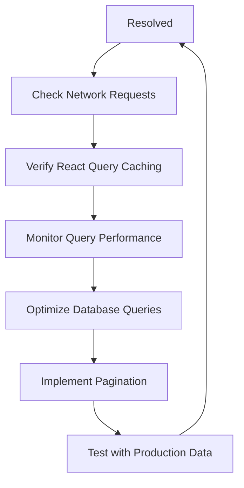

# Command Center System

<cite>
**Referenced Files in This Document**
- [command-center.ts](file://src/types/command-center.ts)
- [CommandCenterLayout.tsx](file://src/components/command-center/CommandCenterLayout.tsx)
- [CommandCenterSidebar.tsx](file://src/components/command-center/CommandCenterSidebar.tsx)
- [CommandCenterGuard.tsx](file://src/components/command-center/CommandCenterGuard.tsx)
- [useCommandCenterRole.ts](file://src/hooks/useCommandCenterRole.ts)
- [MetricsDashboard.tsx](file://src/pages/command-center/MetricsDashboard.tsx)
- [useMetrics.ts](file://src/hooks/useMetrics.ts)
- [PipelineStageCard.tsx](file://src/components/command-center/pipeline/PipelineStageCard.tsx)
- [MyClientsList.tsx](file://src/components/command-center/my-clients/MyClientsList.tsx)
- [MyClients.tsx](file://src/pages/command-center/MyClients.tsx)
- [useMyClients.ts](file://src/hooks/useMyClients.ts)
- [ClientHeader.tsx](file://src/components/command-center/client-detail/ClientHeader.tsx)
- [ClientDetailView.tsx](file://src/pages/command-center/ClientDetailView.tsx)
- [client.ts](file://src/integrations/supabase/client.ts)
- [20260330000000_command_center_schema.sql](file://supabase/migrations/20260330000000_command_center_schema.sql)
</cite>

## Table of Contents
1. [Introduction](#introduction)
2. [Project Structure](#project-structure)
3. [Core Components](#core-components)
4. [Architecture Overview](#architecture-overview)
5. [Detailed Component Analysis](#detailed-component-analysis)
6. [Dependency Analysis](#dependency-analysis)
7. [Performance Considerations](#performance-considerations)
8. [Troubleshooting Guide](#troubleshooting-guide)
9. [Conclusion](#conclusion)

## Introduction
The Command Center System is a comprehensive funding pipeline management platform built with React and Supabase. It provides real-time visibility into client funding workflows, enabling team members to track progress, manage client relationships, and monitor key performance indicators. The system implements role-based access control, automated data synchronization, and a modern dashboard interface designed for financial services operations.

The platform supports multiple user roles (admin, manager, specialist) with granular permissions, real-time data updates through Supabase Realtime, and comprehensive reporting capabilities. It integrates seamlessly with the broader Ryland ecosystem while maintaining separation of concerns through modular component architecture.

## Project Structure
The Command Center follows a feature-based organization pattern with clear separation between presentation, business logic, and data access layers:

```mermaid
graph TB
subgraph "Command Center Layer"
Layout[CommandCenterLayout]
Guard[CommandCenterGuard]
Sidebar[CommandCenterSidebar]
subgraph "Pages"
Metrics[MetricsDashboard]
MyClients[MyClients]
ClientDetail[ClientDetailView]
end
subgraph "Components"
Pipeline[PipelineStageCard]
MyClientsList[MyClientsList]
ClientHeader[ClientHeader]
end
subgraph "Hooks"
RoleHook[useCommandCenterRole]
MetricsHook[useMetrics]
MyClientsHook[useMyClients]
end
subgraph "Types"
Types[command-center.ts]
end
end
subgraph "Integration Layer"
SupabaseClient[supabase/client.ts]
DBSchema[20260330000000_command_center_schema.sql]
end
Layout --> Guard
Guard --> Sidebar
Guard --> Metrics
Guard --> MyClients
Guard --> ClientDetail
Metrics --> MetricsHook
MyClients --> MyClientsHook
ClientDetail --> ClientHeader
RoleHook --> Guard
MetricsHook --> SupabaseClient
MyClientsHook --> SupabaseClient
Types --> Layout
Types --> Components
Types --> Hooks
SupabaseClient --> DBSchema
```

**Diagram sources**
- [CommandCenterLayout.tsx:1-50](file://src/components/command-center/CommandCenterLayout.tsx#L1-L50)
- [CommandCenterGuard.tsx:1-92](file://src/components/command-center/CommandCenterGuard.tsx#L1-L92)
- [command-center.ts:1-106](file://src/types/command-center.ts#L1-L106)

**Section sources**
- [CommandCenterLayout.tsx:1-50](file://src/components/command-center/CommandCenterLayout.tsx#L1-L50)
- [CommandCenterSidebar.tsx:1-195](file://src/components/command-center/CommandCenterSidebar.tsx#L1-L195)
- [command-center.ts:1-106](file://src/types/command-center.ts#L1-L106)

## Core Components
The Command Center System consists of several interconnected components that work together to provide comprehensive funding pipeline management:

### Data Model Architecture
The system defines a comprehensive data model for funding operations with strict type safety and validation:



**Diagram sources**
- [command-center.ts:22-51](file://src/types/command-center.ts#L22-L51)
- [command-center.ts:53-66](file://src/types/command-center.ts#L53-L66)
- [command-center.ts:68-75](file://src/types/command-center.ts#L68-L75)

### Role-Based Access Control
The system implements a hierarchical permission model with three distinct roles:

| Role | Permissions | Access Level |
|------|-------------|--------------|
| **Admin** | Full system access, user management, administrative functions | Complete |
| **Manager** | View and modify assigned clients, manage team operations | Restricted |
| **Specialist** | View and update own assigned clients, basic operations | Limited |

**Section sources**
- [useCommandCenterRole.ts:1-118](file://src/hooks/useCommandCenterRole.ts#L1-L118)
- [20260330000000_command_center_schema.sql:88-98](file://supabase/migrations/20260330000000_command_center_schema.sql#L88-L98)

## Architecture Overview
The Command Center System employs a modern React architecture with Supabase integration for real-time data management:



**Diagram sources**
- [client.ts:1-17](file://src/integrations/supabase/client.ts#L1-L17)
- [CommandCenterGuard.tsx:10-92](file://src/components/command-center/CommandCenterGuard.tsx#L10-L92)

### Data Flow Architecture
The system implements a reactive data flow pattern optimized for real-time updates:



**Diagram sources**
- [useMetrics.ts:557-563](file://src/hooks/useMetrics.ts#L557-L563)
- [useMyClients.ts:170-176](file://src/hooks/useMyClients.ts#L170-L176)

**Section sources**
- [client.ts:1-17](file://src/integrations/supabase/client.ts#L1-L17)
- [useMetrics.ts:1-566](file://src/hooks/useMetrics.ts#L1-L566)
- [useMyClients.ts:1-197](file://src/hooks/useMyClients.ts#L1-L197)

## Detailed Component Analysis

### Command Center Layout System
The layout system provides a consistent interface foundation with responsive design and role-aware navigation:



**Diagram sources**
- [CommandCenterLayout.tsx:11-50](file://src/components/command-center/CommandCenterLayout.tsx#L11-L50)
- [CommandCenterSidebar.tsx:34-195](file://src/components/command-center/CommandCenterSidebar.tsx#L34-L195)
- [CommandCenterGuard.tsx:10-92](file://src/components/command-center/CommandCenterGuard.tsx#L10-L92)
- [useCommandCenterRole.ts:7-118](file://src/hooks/useCommandCenterRole.ts#L7-L118)

### Metrics Dashboard Implementation
The metrics dashboard provides comprehensive analytics through specialized chart components and data aggregation:



**Diagram sources**
- [MetricsDashboard.tsx:75-546](file://src/pages/command-center/MetricsDashboard.tsx#L75-L546)
- [useMetrics.ts:84-555](file://src/hooks/useMetrics.ts#L84-L555)

**Section sources**
- [MetricsDashboard.tsx:1-546](file://src/pages/command-center/MetricsDashboard.tsx#L1-L546)
- [useMetrics.ts:1-566](file://src/hooks/useMetrics.ts#L1-L566)

### Client Management System
The client management system provides comprehensive client lifecycle management with assignment tracking and activity monitoring:



**Diagram sources**
- [ClientDetailView.tsx:33-224](file://src/pages/command-center/ClientDetailView.tsx#L33-L224)
- [ClientHeader.tsx:57-205](file://src/components/command-center/client-detail/ClientHeader.tsx#L57-L205)

**Section sources**
- [ClientDetailView.tsx:1-224](file://src/pages/command-center/ClientDetailView.tsx#L1-L224)
- [ClientHeader.tsx:1-205](file://src/components/command-center/client-detail/ClientHeader.tsx#L1-L205)
- [useMyClients.ts:29-168](file://src/hooks/useMyClients.ts#L29-L168)

### Pipeline Management Components
The pipeline management system provides visual stage tracking with overdue indicators and interactive filtering:



**Diagram sources**
- [PipelineStageCard.tsx:17-142](file://src/components/command-center/pipeline/PipelineStageCard.tsx#L17-L142)
- [command-center.ts:85-97](file://src/types/command-center.ts#L85-L97)

**Section sources**
- [PipelineStageCard.tsx:1-142](file://src/components/command-center/pipeline/PipelineStageCard.tsx#L1-L142)
- [command-center.ts:1-106](file://src/types/command-center.ts#L1-L106)

## Dependency Analysis
The Command Center System exhibits strong modularity with clear dependency boundaries and minimal coupling between components:



**Diagram sources**
- [CommandCenterLayout.tsx:1-50](file://src/components/command-center/CommandCenterLayout.tsx#L1-L50)
- [client.ts:1-17](file://src/integrations/supabase/client.ts#L1-L17)
- [command-center.ts:1-106](file://src/types/command-center.ts#L1-L106)

### Component Coupling Analysis
The system maintains loose coupling through well-defined interfaces and dependency injection patterns:

| Component Category | Coupling Level | Dependencies | Benefits |
|-------------------|----------------|--------------|----------|
| **Layout Components** | Low | Minimal external dependencies | Highly reusable |
| **Hook Functions** | Medium | Supabase client, React Query | Testable business logic |
| **UI Components** | Low | Props-based communication | Easy to mock and test |
| **Type Definitions** | Minimal | None | Compile-time safety |

**Section sources**
- [CommandCenterSidebar.tsx:1-195](file://src/components/command-center/CommandCenterSidebar.tsx#L1-L195)
- [useCommandCenterRole.ts:1-118](file://src/hooks/useCommandCenterRole.ts#L1-L118)
- [client.ts:1-17](file://src/integrations/supabase/client.ts#L1-L17)

## Performance Considerations
The Command Center System implements several performance optimization strategies:

### Caching Strategy
- **React Query Caching**: Configured with 5-minute stale time for metrics data
- **Component-Level Caching**: Local state caching for filtered lists
- **Database Indexing**: Strategic indexes on frequently queried columns

### Data Loading Optimization
- **Parallel Queries**: Multiple data sources loaded concurrently
- **Pagination Support**: Large datasets paginated for better UX
- **Lazy Loading**: Components loaded on demand via React Suspense

### Real-Time Updates
- **Supabase Realtime**: Automatic UI updates without manual polling
- **Efficient Subscriptions**: Minimal subscription overhead
- **Smart Refetching**: Intelligent cache invalidation

## Troubleshooting Guide

### Authentication and Authorization Issues
Common access control problems and solutions:

| Issue | Symptoms | Solution |
|-------|----------|----------|
| **Database Setup Missing** | Error message about missing tables | Run database migrations |
| **Role Detection Failure** | Blank screen during role check | Verify user metadata setup |
| **Permission Denied** | Access denied message | Check user role assignment |
| **Session Expired** | Redirect to login page | Clear browser storage |

### Performance Issues
Performance-related troubleshooting steps:



**Diagram sources**
- [useMetrics.ts:557-563](file://src/hooks/useMetrics.ts#L557-L563)
- [useMyClients.ts:170-176](file://src/hooks/useMyClients.ts#L170-L176)

### Database Migration Issues
Migration-related troubleshooting:

**Section sources**
- [CommandCenterGuard.tsx:30-64](file://src/components/command-center/CommandCenterGuard.tsx#L30-L64)
- [20260330000000_command_center_schema.sql:1-800](file://supabase/migrations/20260330000000_command_center_schema.sql#L1-L800)

## Conclusion
The Command Center System represents a robust, scalable solution for funding pipeline management with strong architectural foundations. Its implementation demonstrates best practices in modern web development including:

- **Modular Design**: Clean separation of concerns with well-defined component boundaries
- **Type Safety**: Comprehensive TypeScript integration ensuring runtime reliability
- **Real-Time Capabilities**: Seamless integration with Supabase Realtime for immediate data updates
- **Security**: Multi-layered access control with role-based permissions
- **Performance**: Optimized data fetching with intelligent caching strategies

The system successfully balances functionality with maintainability, providing a solid foundation for future enhancements while maintaining excellent user experience. The comprehensive testing infrastructure and clear documentation make it accessible for ongoing development and support.