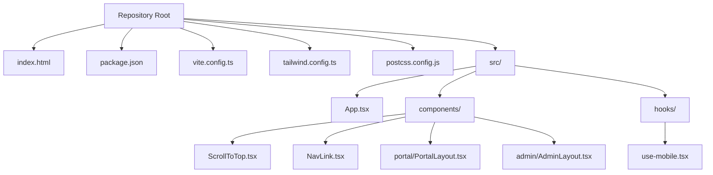
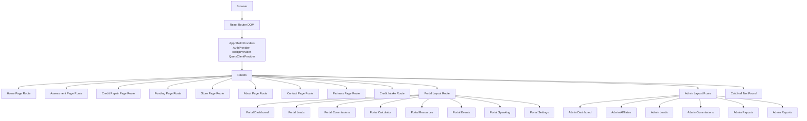
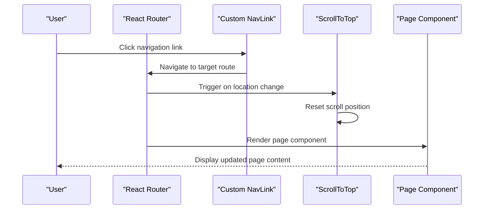
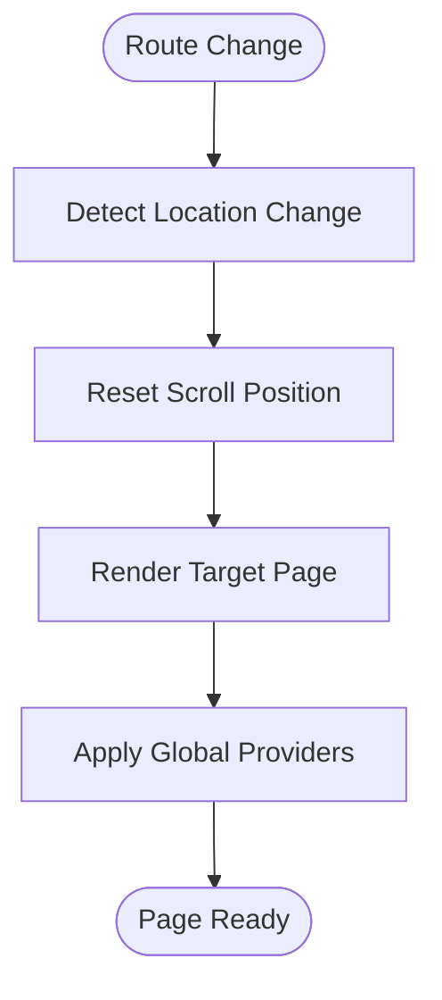
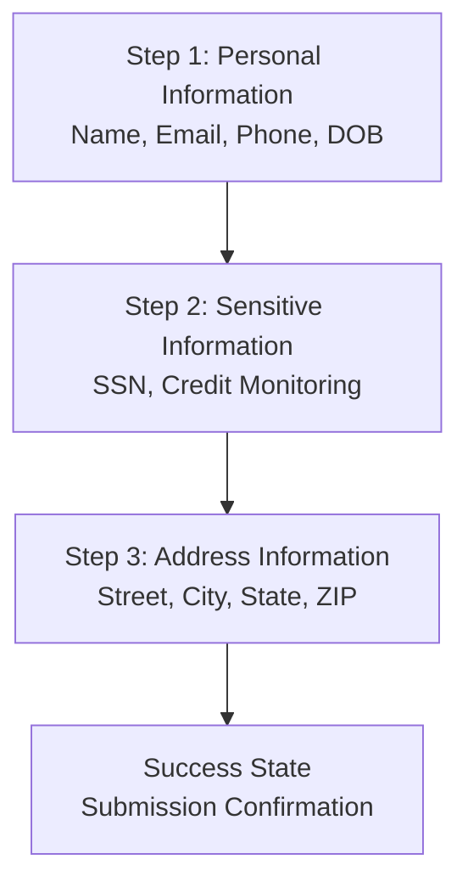
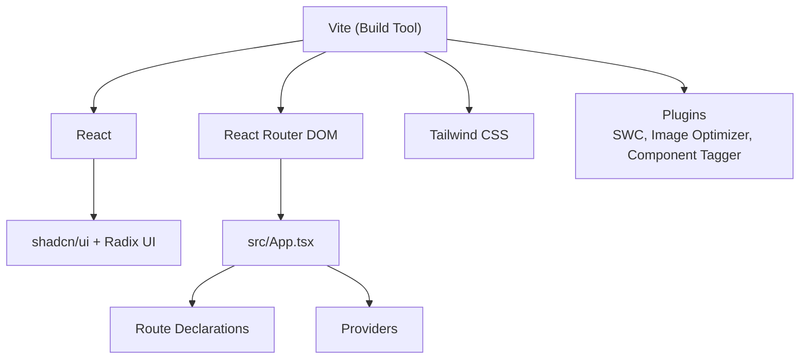

# Pages & Routing

<cite>
**Referenced Files in This Document**
- [README.md](file://README.md)
- [package.json](file://package.json)
- [index.html](file://index.html)
- [vite.config.ts](file://vite.config.ts)
- [tailwind.config.ts](file://tailwind.config.ts)
- [postcss.config.js](file://postcss.config.js)
- [src/App.tsx](file://src/App.tsx)
- [src/components/ScrollToTop.tsx](file://src/components/ScrollToTop.tsx)
- [src/components/NavLink.tsx](file://src/components/NavLink.tsx)
- [src/components/portal/PortalLayout.tsx](file://src/components/portal/PortalLayout.tsx)
- [src/components/portal/PortalSidebar.tsx](file://src/components/portal/PortalSidebar.tsx)
- [src/components/admin/AdminLayout.tsx](file://src/components/admin/AdminLayout.tsx)
- [src/components/admin/AdminSidebar.tsx](file://src/components/admin/AdminSidebar.tsx)
- [src/hooks/use-mobile.tsx](file://src/hooks/use-mobile.tsx)
- [src/pages/Assessment.tsx](file://src/pages/Assessment.tsx)
- [src/pages/CreditIntake.tsx](file://src/pages/CreditIntake.tsx)
- [src/lib/referralTracking.ts](file://src/lib/referralTracking.ts)
- [src/integrations/supabase/client.ts](file://src/integrations/supabase/client.ts)
- [supabase/functions/ghl-create-contact/index.ts](file://supabase/functions/ghl-create-contact/index.ts)
- [supabase/functions/ghl-affiliate-webhook/index.ts](file://supabase/functions/ghl-affiliate-webhook/index.ts)
- [supabase/functions/scorexer-intake/index.ts](file://supabase/functions/scorexer-intake/index.ts)
</cite>

## Update Summary
**Changes Made**
- Added comprehensive documentation for the new `/credit-intake` route and client intake form
- Updated routing architecture to include admin portal routes with dedicated admin layout and sidebar
- Enhanced portal navigation documentation with partner portal routes and authentication guards
- Added security considerations for sensitive data handling in the credit intake process
- Updated integration architecture to include Scorexer webhook integration and GHL CRM synchronization

## Table of Contents
1. [Introduction](#introduction)
2. [Project Structure](#project-structure)
3. [Core Components](#core-components)
4. [Architecture Overview](#architecture-overview)
5. [Detailed Component Analysis](#detailed-component-analysis)
6. [Dependency Analysis](#dependency-analysis)
7. [Performance Considerations](#performance-considerations)
8. [Troubleshooting Guide](#troubleshooting-guide)
9. [Conclusion](#conclusion)
10. [Appendices](#appendices)

## Introduction
This document describes the page structure and routing system for the Ryland application. It focuses on how static pages are organized, how routing is configured, navigation patterns, page lifecycle management, shared layouts, and page-specific functionality. It also provides practical guidance for adding new pages, handling transitions, optimizing performance, and addressing SEO and responsive design considerations.

The project is a React application built with Vite, TypeScript, React Router DOM, and Tailwind CSS. It leverages shadcn/ui primitives and Radix UI components for accessible UI patterns.

**Section sources**
- [README.md:53-61](file://README.md#L53-L61)
- [package.json:15-69](file://package.json#L15-L69)

## Project Structure
The repository provides a minimal but functional foundation for a modern React application. Key elements relevant to pages and routing include:
- Application entry and HTML template with SEO metadata and preloading
- Build configuration with Vite, including code-splitting strategies
- Tailwind CSS configuration supporting responsive design and animations
- Core routing and layout components under src/



**Diagram sources**
- [index.html:1-51](file://index.html#L1-L51)
- [vite.config.ts:1-43](file://vite.config.ts#L1-L43)
- [tailwind.config.ts:1-97](file://tailwind.config.ts#L1-L97)
- [postcss.config.js:1-7](file://postcss.config.js#L1-L7)
- [src/App.tsx:90-123](file://src/App.tsx#L90-L123)
- [src/components/ScrollToTop.tsx:1-14](file://src/components/ScrollToTop.tsx#L1-L14)
- [src/components/NavLink.tsx:1-28](file://src/components/NavLink.tsx#L1-L28)
- [src/components/portal/PortalLayout.tsx:1-28](file://src/components/portal/PortalLayout.tsx#L1-L28)
- [src/components/admin/AdminLayout.tsx:1-40](file://src/components/admin/AdminLayout.tsx#L1-L40)
- [src/hooks/use-mobile.tsx:1-19](file://src/hooks/use-mobile.tsx#L1-L19)

**Section sources**
- [index.html:14-40](file://index.html#L14-L40)
- [vite.config.ts:31-41](file://vite.config.ts#L31-L41)
- [tailwind.config.ts:4-96](file://tailwind.config.ts#L4-L96)
- [postcss.config.js:1-7](file://postcss.config.js#L1-L7)
- [src/App.tsx:90-123](file://src/App.tsx#L90-L123)

## Core Components
This section outlines the core building blocks for pages and routing in the application.

- Routing and Layout Container
  - The application's routes are declared centrally, including nested routes for portal areas and admin sections. The router wraps the app with providers for authentication, theming, and data fetching.

- Navigation Utilities
  - A custom NavLink wrapper integrates with React Router's NavLink while allowing explicit active/pending class names and Tailwind utility merging.
  - A ScrollToTop component ensures smooth navigation by resetting scroll position on route changes.

- Responsive Hook
  - A mobile detection hook enables responsive behavior across pages and components.

- Portal Layout
  - A dedicated layout composes a sidebar, top bar, and outlet for authenticated portal routes.

- Admin Layout
  - A dedicated admin layout provides secure access to administrative functions with role-based access control.

Implementation references:
- [src/App.tsx:90-123](file://src/App.tsx#L90-L123)
- [src/components/NavLink.tsx:1-28](file://src/components/NavLink.tsx#L1-L28)
- [src/components/ScrollToTop.tsx:1-14](file://src/components/ScrollToTop.tsx#L1-L14)
- [src/hooks/use-mobile.tsx:1-19](file://src/hooks/use-mobile.tsx#L1-L19)
- [src/components/portal/PortalLayout.tsx:1-28](file://src/components/portal/PortalLayout.tsx#L1-L28)
- [src/components/admin/AdminLayout.tsx:1-40](file://src/components/admin/AdminLayout.tsx#L1-L40)

**Section sources**
- [src/App.tsx:90-123](file://src/App.tsx#L90-L123)
- [src/components/NavLink.tsx:1-28](file://src/components/NavLink.tsx#L1-L28)
- [src/components/ScrollToTop.tsx:1-14](file://src/components/ScrollToTop.tsx#L1-L14)
- [src/hooks/use-mobile.tsx:1-19](file://src/hooks/use-mobile.tsx#L1-L19)
- [src/components/portal/PortalLayout.tsx:1-28](file://src/components/portal/PortalLayout.tsx#L1-L28)
- [src/components/admin/AdminLayout.tsx:1-40](file://src/components/admin/AdminLayout.tsx#L1-L40)

## Architecture Overview
The routing architecture centers around React Router DOM with a provider-based setup. Static pages are mapped to routes, and nested routes encapsulate portal-related functionality. Providers manage global state and UI behavior.



**Diagram sources**
- [src/App.tsx:90-123](file://src/App.tsx#L90-L123)

**Section sources**
- [src/App.tsx:90-123](file://src/App.tsx#L90-L123)

## Detailed Component Analysis

### Routing and Navigation Patterns
- Centralized Route Declaration
  - Routes are declared in a single location, enabling clear visibility of all pages and nested areas. Nested routes under portal and admin layouts demonstrate structured access control and consistent UI scaffolding.
- Active/Pending States
  - The custom NavLink wrapper allows explicit styling for active and pending states, improving UX during navigation.
- Scroll Behavior
  - The ScrollToTop component resets scroll position on route changes, ensuring a consistent user experience across pages.

References:
- [src/App.tsx:90-123](file://src/App.tsx#L90-L123)
- [src/components/NavLink.tsx:1-28](file://src/components/NavLink.tsx#L1-L28)
- [src/components/ScrollToTop.tsx:1-14](file://src/components/ScrollToTop.tsx#L1-L14)



**Diagram sources**
- [src/components/NavLink.tsx:1-28](file://src/components/NavLink.tsx#L1-L28)
- [src/components/ScrollToTop.tsx:1-14](file://src/components/ScrollToTop.tsx#L1-L14)
- [src/App.tsx:90-123](file://src/App.tsx#L90-L123)

**Section sources**
- [src/App.tsx:90-123](file://src/App.tsx#L90-L123)
- [src/components/NavLink.tsx:1-28](file://src/components/NavLink.tsx#L1-L28)
- [src/components/ScrollToTop.tsx:1-14](file://src/components/ScrollToTop.tsx#L1-L14)

### Shared Layouts and Page Lifecycle
- Portal Layout
  - The portal layout composes a sidebar, top bar, and outlet. It is protected by an authentication guard and provides a consistent header and navigation for authenticated routes.
- Admin Layout
  - The admin layout provides secure access to administrative functions with role-based access control and comprehensive navigation for admin operations.
- Page Lifecycle Management
  - The ScrollToTop component runs on route changes, resetting scroll position. Providers set up global state and UI behavior, influencing how pages mount and update.

References:
- [src/components/portal/PortalLayout.tsx:1-28](file://src/components/portal/PortalLayout.tsx#L1-L28)
- [src/components/admin/AdminLayout.tsx:1-40](file://src/components/admin/AdminLayout.tsx#L1-L40)
- [src/components/ScrollToTop.tsx:1-14](file://src/components/ScrollToTop.tsx#L1-L14)
- [src/App.tsx:113-123](file://src/App.tsx#L113-L123)



**Diagram sources**
- [src/components/ScrollToTop.tsx:1-14](file://src/components/ScrollToTop.tsx#L1-L14)
- [src/App.tsx:113-123](file://src/App.tsx#L113-L123)

**Section sources**
- [src/components/portal/PortalLayout.tsx:1-28](file://src/components/portal/PortalLayout.tsx#L1-L28)
- [src/components/admin/AdminLayout.tsx:1-40](file://src/components/admin/AdminLayout.tsx#L1-L40)
- [src/components/ScrollToTop.tsx:1-14](file://src/components/ScrollToTop.tsx#L1-L14)
- [src/App.tsx:113-123](file://src/App.tsx#L113-L123)

### Credit Intake Form Implementation
**Updated** The new `/credit-intake` route provides a comprehensive client intake form for Scorexer integration with multi-step validation and secure data handling.

#### Multi-Step Form Architecture
The credit intake form implements a sophisticated three-step process with progressive disclosure and real-time validation:



**Diagram sources**
- [src/pages/CreditIntake.tsx:75-163](file://src/pages/CreditIntake.tsx#L75-L163)

#### Security and Data Protection
The form implements strict security measures for handling sensitive information:

- **SSN Masking**: Secure Social Security Number input with toggle visibility and automatic formatting
- **Encrypted Transmission**: All sensitive data is transmitted over HTTPS to edge functions
- **No Database Storage**: SSN data is never stored in the database, only sent to Scorexer webhook
- **Input Validation**: Comprehensive Zod validation on both client and server side

#### Edge Function Integration
The credit intake form integrates with a dedicated Supabase Edge Function that handles the complete workflow:

```typescript
const result = await callEdgeFunction("scorexer-intake", {
  firstName: form.firstName,
  middleName: form.middleName || "",
  lastName: form.lastName,
  email: form.email,
  phone: form.phone,
  dob: form.dob,
  ssn: ssnDigits,
  creditMonitoring: form.creditMonitoring,
  street: form.street,
  city: form.city,
  state: form.state,
  zip: form.zip,
});
```

**Section sources**
- [src/pages/CreditIntake.tsx:75-163](file://src/pages/CreditIntake.tsx#L75-L163)
- [src/pages/CreditIntake.tsx:137-150](file://src/pages/CreditIntake.tsx#L137-L150)
- [supabase/functions/scorexer-intake/index.ts:72-110](file://supabase/functions/scorexer-intake/index.ts#L72-L110)

### Assessment Page Integration Architecture
**Updated** The Assessment page now uses a hybrid integration approach combining Supabase database operations with direct HTTP fetch calls to Supabase Edge Functions for GHL CRM synchronization.

#### Direct HTTP Fetch Implementation
The Assessment page implements a custom `callEdgeFunction` helper that bypasses the Supabase SDK to avoid AbortError issues:

```typescript
// Direct fetch helper to bypass Supabase SDK AbortError
const SUPABASE_URL = import.meta.env.VITE_SUPABASE_URL as string;
const SUPABASE_KEY = import.meta.env.VITE_SUPABASE_PUBLISHABLE_KEY as string;

async function callEdgeFunction(name: string, body: Record<string, unknown>) {
  const res = await fetch(`${SUPABASE_URL}/functions/v1/${name}`, {
    method: "POST",
    headers: {
      "Content-Type": "application/json",
      "Authorization": `Bearer ${SUPABASE_KEY}`,
      "apikey": SUPABASE_KEY,
    },
    body: JSON.stringify(body),
  });
  return res.json();
}
```

#### Parallel Processing Architecture
The Assessment page now implements parallel processing for improved user experience:

```typescript
// Fire DB insert + GHL sync in background — don't block UI
try {
  const insertPromise = supabase.from("assessment_leads").insert({
    // ... database fields
  });

  // Fire-and-forget: sync to GHL with affiliate attribution
  const refId = getReferralAffiliateId();
  const tags = ["assessment-lead", qualification];
  if (refId) {
    tags.push("Affiliate", `Affiliate - ${refId}`);
  }

  const ghlPromise = callEdgeFunction("ghl-create-contact", {
    // ... GHL contact data
  }).then((result) => {
    if (result?.error) console.error("GHL sync failed:", result.error);

    // If affiliate referral, also record the lead in the portal
    if (refId) {
      callEdgeFunction("ghl-affiliate-webhook", {
        type: "lead_referred",
        affiliate_id: refId,
        full_name: parsed.data.name,
        email: parsed.data.email,
        phone: parsed.data.phone,
      }).then((r) => {
        if (r?.error) console.error("Affiliate lead sync failed:", r.error);
      }).catch(() => {});
    }
  }).catch(() => {});

  // Run both in parallel, don't block
  Promise.allSettled([insertPromise, ghlPromise]).catch(() => {});
} catch {
  // Result is already shown — log silently
  console.error("Assessment background save failed");
}
```

#### Edge Function Integration
The system integrates with two key Supabase Edge Functions:

1. **GHL Contact Creation**: Creates or updates contacts in the LeadConnectorHQ CRM
2. **Affiliate Webhook**: Records affiliate lead referrals in the portal system

References:
- [src/pages/Assessment.tsx:25-40](file://src/pages/Assessment.tsx#L25-L40)
- [src/pages/Assessment.tsx:161-224](file://src/pages/Assessment.tsx#L161-L224)
- [src/lib/referralTracking.ts:28-44](file://src/lib/referralTracking.ts#L28-L44)
- [supabase/functions/ghl-create-contact/index.ts:16-133](file://supabase/functions/ghl-create-contact/index.ts#L16-L133)
- [supabase/functions/ghl-affiliate-webhook/index.ts:31-44](file://supabase/functions/ghl-affiliate-webhook/index.ts#L31-L44)

**Section sources**
- [src/pages/Assessment.tsx:25-40](file://src/pages/Assessment.tsx#L25-L40)
- [src/pages/Assessment.tsx:161-224](file://src/pages/Assessment.tsx#L161-L224)
- [src/lib/referralTracking.ts:28-44](file://src/lib/referralTracking.ts#L28-L44)
- [supabase/functions/ghl-create-contact/index.ts:16-133](file://supabase/functions/ghl-create-contact/index.ts#L16-L133)
- [supabase/functions/ghl-affiliate-webhook/index.ts:31-44](file://supabase/functions/ghl-affiliate-webhook/index.ts#L31-L44)

### Implementing New Static Pages
To add a new static page (e.g., a new informational page):
1. Create a new component for the page under src/.
2. Add a route for the new page in the central route declaration, placing it before the catch-all route.
3. Optionally wrap the page in a shared layout if applicable.
4. Use the custom NavLink component for navigation to maintain consistent active/pending styles.

Reference:
- [src/App.tsx:90-123](file://src/App.tsx#L90-L123)
- [src/components/NavLink.tsx:1-28](file://src/components/NavLink.tsx#L1-L28)

**Section sources**
- [src/App.tsx:90-123](file://src/App.tsx#L90-L123)
- [src/components/NavLink.tsx:1-28](file://src/components/NavLink.tsx#L1-L28)

### Handling Page Transitions and Animations
- Scroll-to-top behavior is handled automatically on route changes.
- For advanced transitions, consider integrating a transition library with the router and applying motion variants in page components.

Reference:
- [src/components/ScrollToTop.tsx:1-14](file://src/components/ScrollToTop.tsx#L1-L14)

**Section sources**
- [src/components/ScrollToTop.tsx:1-14](file://src/components/ScrollToTop.tsx#L1-L14)

### SEO Considerations and Meta Tags
- The HTML template defines essential SEO metadata, including viewport, title, description, author, Open Graph, Twitter Card, and favicon.
- Keep the title and description aligned with each page's purpose. For dynamic pages, integrate a head management solution to update meta tags per route.

References:
- [index.html:23-39](file://index.html#L23-L39)

**Section sources**
- [index.html:23-39](file://index.html#L23-L39)

### Responsive Design Patterns
- Tailwind CSS is configured to support responsive breakpoints and animations.
- The use-is-mobile hook detects mobile widths and can be used to adapt UI behavior.

References:
- [tailwind.config.ts:4-96](file://tailwind.config.ts#L4-L96)
- [src/hooks/use-mobile.tsx:1-19](file://src/hooks/use-mobile.tsx#L1-L19)

**Section sources**
- [tailwind.config.ts:4-96](file://tailwind.config.ts#L4-L96)
- [src/hooks/use-mobile.tsx:1-19](file://src/hooks/use-mobile.tsx#L1-L19)

### Authentication and Access Control
**Updated** The application now includes comprehensive authentication and access control mechanisms for different user types.

#### Portal Authentication
The portal system uses an AuthGuard component to protect authenticated routes:

```typescript
export default function AuthGuard({ children }: AuthGuardProps) {
  const { user, loading } = useAuth();
  
  if (loading) {
    return <div>Loading portal…</div>;
  }
  
  if (!user) {
    return <Navigate to="/portal/login" replace />;
  }
  
  return <>{children}</>;
}
```

#### Admin Access Control
The admin system provides role-based access with AdminGuard:

```typescript
export default function AdminGuard({ children }: AdminGuardProps) {
  const { user, loading: authLoading } = useAuth();
  const { isAdmin, isLoading: roleLoading } = useAdminRole();
  const loading = authLoading || (user ? roleLoading : false);

  if (!user) {
    return <Navigate to="/portal/login" replace />;
  }

  if (!isAdmin) {
    return <Navigate to="/portal/login" replace />;
  }

  return <>{children}</>;
}
```

**Section sources**
- [src/components/portal/AuthGuard.tsx:1-28](file://src/components/portal/AuthGuard.tsx#L1-L28)
- [src/components/admin/AdminGuard.tsx:1-35](file://src/components/admin/AdminGuard.tsx#L1-L35)

## Dependency Analysis
The routing and page system relies on a small set of core dependencies and build-time optimizations.



**Diagram sources**
- [package.json:15-69](file://package.json#L15-L69)
- [vite.config.ts:16-25](file://vite.config.ts#L16-L25)
- [src/App.tsx:113-123](file://src/App.tsx#L113-L123)

**Section sources**
- [package.json:15-69](file://package.json#L15-L69)
- [vite.config.ts:16-25](file://vite.config.ts#L16-L25)
- [src/App.tsx:113-123](file://src/App.tsx#L113-L123)

## Performance Considerations
- Code splitting and chunking are configured to separate vendor libraries, UI libraries, and Supabase dependencies, reducing initial bundle size and improving load performance.
- Image optimization is enabled via a Vite plugin to reduce payload sizes for images.
- Provider setup occurs once at the shell level, minimizing re-renders across pages.

**Updated** The Assessment page now implements parallel processing for improved performance:
- Database insertion and GHL synchronization run concurrently using Promise.allSettled
- Direct HTTP fetch bypasses Supabase SDK AbortError issues
- Affiliate lead tracking is fire-and-forget for non-blocking user experience

**Updated** The Credit Intake form implements efficient state management and validation:
- Zod schemas provide immediate client-side validation feedback
- Progressive disclosure reduces cognitive load and improves conversion rates
- Edge function integration minimizes server-side processing time

Recommendations:
- Lazy-load heavy page components using React.lazy and Suspense boundaries around route elements.
- Defer non-critical resources and leverage browser caching strategies.
- Monitor Largest Contentful Paint (LCP) and First Input Delay (FID) metrics post-deployment.
- Consider implementing retry logic for edge function calls in production environments.

**Section sources**
- [vite.config.ts:31-41](file://vite.config.ts#L31-L41)
- [vite.config.ts:19-24](file://vite.config.ts#L19-L24)
- [src/App.tsx:113-123](file://src/App.tsx#L113-L123)
- [src/pages/Assessment.tsx:161-224](file://src/pages/Assessment.tsx#L161-L224)
- [src/pages/CreditIntake.tsx:102-122](file://src/pages/CreditIntake.tsx#L102-L122)

## Troubleshooting Guide
Common issues and resolutions:
- Navigation does not scroll to top after route change
  - Ensure the ScrollToTop component is mounted within the router context and that it receives location updates.
  - Reference: [src/components/ScrollToTop.tsx:1-14](file://src/components/ScrollToTop.tsx#L1-L14)
- Active/pending styles not applied to navigation links
  - Verify the custom NavLink wrapper is used consistently and that active/pending class names are provided.
  - Reference: [src/components/NavLink.tsx:1-28](file://src/components/NavLink.tsx#L1-L28)
- Portal layout not rendering for authenticated routes
  - Confirm the portal layout route is nested and guarded by an authentication mechanism.
  - Reference: [src/components/portal/PortalLayout.tsx:1-28](file://src/components/portal/PortalLayout.tsx#L1-L28)
- Admin layout not rendering for authorized users
  - Verify the admin layout route is properly nested and guarded by AdminGuard.
  - Reference: [src/components/admin/AdminLayout.tsx:1-40](file://src/components/admin/AdminLayout.tsx#L1-L40)
- SEO metadata not updating per page
  - Integrate a head management solution to dynamically update meta tags for each route.
  - References: [index.html:23-39](file://index.html#L23-L39)
- **Assessment page GHL integration failures**
  - **Issue**: GHL synchronization errors or timeouts
  - **Solution**: Check edge function logs in Supabase dashboard, verify API keys are configured, ensure network connectivity to LeadConnectorHQ
  - Reference: [src/pages/Assessment.tsx:176-214](file://src/pages/Assessment.tsx#L176-L214)
- **Credit Intake form submission failures**
  - **Issue**: Scorexer webhook integration errors or SSN validation failures
  - **Solution**: Verify SCOREXER_ZAPIER_WEBHOOK_URL environment variable, check SSN formatting, ensure GHL API credentials are configured
  - Reference: [supabase/functions/scorexer-intake/index.ts:22-26](file://supabase/functions/scorexer-intake/index.ts#L22-L26)
- **Parallel processing not working**
  - **Issue**: Database insertion blocking while GHL sync processes
  - **Solution**: Verify Promise.allSettled implementation and ensure both promises are properly awaited
  - Reference: [src/pages/Assessment.tsx:216-217](file://src/pages/Assessment.tsx#L216-L217)
- **Affiliate lead tracking not recording**
  - **Issue**: Affiliate IDs not being captured or processed
  - **Solution**: Check localStorage for referral data, verify getReferralAffiliateId function, ensure affiliate webhook is configured
  - Reference: [src/lib/referralTracking.ts:28-44](file://src/lib/referralTracking.ts#L28-L44)

**Section sources**
- [src/components/ScrollToTop.tsx:1-14](file://src/components/ScrollToTop.tsx#L1-L14)
- [src/components/NavLink.tsx:1-28](file://src/components/NavLink.tsx#L1-L28)
- [src/components/portal/PortalLayout.tsx:1-28](file://src/components/portal/PortalLayout.tsx#L1-L28)
- [src/components/admin/AdminLayout.tsx:1-40](file://src/components/admin/AdminLayout.tsx#L1-L40)
- [index.html:23-39](file://index.html#L23-L39)
- [src/pages/Assessment.tsx:176-214](file://src/pages/Assessment.tsx#L176-L214)
- [src/pages/Assessment.tsx:216-217](file://src/pages/Assessment.tsx#L216-L217)
- [src/lib/referralTracking.ts:28-44](file://src/lib/referralTracking.ts#L28-L44)
- [supabase/functions/scorexer-intake/index.ts:22-26](file://supabase/functions/scorexer-intake/index.ts#L22-L26)

## Conclusion
The Ryland application employs a clean, centralized routing architecture with shared layouts and navigation utilities. Providers establish a robust foundation for state and UI behavior, while responsive and performance configurations support scalable growth. The Assessment page demonstrates advanced integration patterns with parallel processing capabilities that improve user experience while maintaining reliable data synchronization. The new Credit Intake form showcases comprehensive security measures and edge function integration for Scorexer webhook processing. The addition of admin portal functionality provides secure access control and comprehensive administrative capabilities. By following the patterns outlined here—consistent route declarations, shared layouts, SEO-aware meta management, robust integration architectures, and strong security practices—you can reliably implement new pages, optimize performance, and deliver a seamless user experience across desktop and mobile devices.

[No sources needed since this section summarizes without analyzing specific files]

## Appendices
- Quick reference for adding a new static page:
  - Create the page component.
  - Register a route before the catch-all.
  - Use the custom NavLink for navigation.
  - Apply responsive utilities from Tailwind and the mobile hook where appropriate.
- **Assessment page integration checklist**:
  - Verify Supabase Edge Functions are deployed and configured
  - Test parallel processing implementation with network throttling
  - Validate affiliate tracking integration
  - Monitor GHL API response codes and error handling
  - Implement proper error boundaries for edge function failures
- **Credit Intake form integration checklist**:
  - Verify SCOREXER_ZAPIER_WEBHOOK_URL environment variable is configured
  - Test SSN validation and formatting logic
  - Validate GHL API credentials for contact synchronization
  - Test multi-step form navigation and validation
  - Verify edge function error handling and logging
  - Test success state and user feedback mechanisms

[No sources needed since this section provides general guidance]