# Pages & Routing

<cite>
**Referenced Files in This Document**
- [README.md](file://README.md)
- [package.json](file://package.json)
- [index.html](file://index.html)
- [vite.config.ts](file://vite.config.ts)
- [tailwind.config.ts](file://tailwind.config.ts)
- [postcss.config.js](file://postcss.config.js)
- [src/App.tsx](file://src/App.tsx)
- [src/components/ScrollToTop.tsx](file://src/components/ScrollToTop.tsx)
- [src/components/NavLink.tsx](file://src/components/NavLink.tsx)
- [src/components/portal/PortalLayout.tsx](file://src/components/portal/PortalLayout.tsx)
- [src/components/portal/PortalSidebar.tsx](file://src/components/portal/PortalSidebar.tsx)
- [src/components/admin/AdminLayout.tsx](file://src/components/admin/AdminLayout.tsx)
- [src/components/admin/AdminSidebar.tsx](file://src/components/admin/AdminSidebar.tsx)
- [src/components/admin/AdminLeadDetailDrawer.tsx](file://src/components/admin/AdminLeadDetailDrawer.tsx)
- [src/components/admin/affiliate-detail/AffiliateProfileTab.tsx](file://src/components/admin/affiliate-detail/AffiliateProfileTab.tsx)
- [src/components/admin/affiliate-detail/AffiliateCommissionsTab.tsx](file://src/components/admin/affiliate-detail/AffiliateCommissionsTab.tsx)
- [src/components/admin/affiliate-detail/AffiliateLeadsTab.tsx](file://src/components/admin/affiliate-detail/AffiliateLeadsTab.tsx)
- [src/components/admin/affiliate-detail/AffiliatePayoutsTab.tsx](file://src/components/admin/affiliate-detail/AffiliatePayoutsTab.tsx)
- [src/components/admin/affiliate-detail/AffiliateSettingsTab.tsx](file://src/components/admin/affiliate-detail/AffiliateSettingsTab.tsx)
- [src/components/NotificationBell.tsx](file://src/components/NotificationBell.tsx)
- [src/hooks/use-mobile.tsx](file://src/hooks/use-mobile.tsx)
- [src/pages/Assessment.tsx](file://src/pages/Assessment.tsx)
- [src/pages/CreditIntake.tsx](file://src/pages/CreditIntake.tsx)
- [src/pages/ThankYou.tsx](file://src/pages/ThankYou.tsx)
- [src/pages/Unsubscribe.tsx](file://src/pages/Unsubscribe.tsx)
- [src/pages/ReferralRedirect.tsx](file://src/pages/ReferralRedirect.tsx)
- [src/pages/admin/AdminAffiliateDetail.tsx](file://src/pages/admin/AdminAffiliateDetail.tsx)
- [src/pages/admin/AdminAffiliates.tsx](file://src/pages/admin/AdminAffiliates.tsx)
- [src/pages/admin/AdminLeads.tsx](file://src/pages/admin/AdminLeads.tsx)
- [src/pages/admin/AdminCommissions.tsx](file://src/pages/admin/AdminCommissions.tsx)
- [src/lib/referralTracking.ts](file://src/lib/referralTracking.ts)
- [src/integrations/supabase/client.ts](file://src/integrations/supabase/client.ts)
- [supabase/functions/ghl-create-contact/index.ts](file://supabase/functions/ghl-create-contact/index.ts)
- [supabase/functions/ghl-affiliate-webhook/index.ts](file://supabase/functions/ghl-affiliate-webhook/index.ts)
- [supabase/functions/scorexer-intake/index.ts](file://supabase/functions/scorexer-intake/index.ts)
- [supabase/functions/fetch-order/index.ts](file://supabase/functions/fetch-order/index.ts)
- [supabase/functions/handle-email-unsubscribe/index.ts](file://supabase/functions/handle-email-unsubscribe/index.ts)
- [supabase/functions/download-ebook/index.ts](file://supabase/functions/download-ebook/index.ts)
</cite>

## Update Summary
**Changes Made**
- Added integrated notification bell system in AdminLayout for real-time notifications
- Enhanced AdminAffiliates page with improved sorting, commission rate display, and statistics
- Expanded AdminAffiliateDetail page with comprehensive tabbed interface (Profile, Commissions, Leads, Payouts, Settings)
- Implemented AdminLeadDetailDrawer for detailed lead information viewing
- Added comprehensive affiliate management functionality across all admin pages
- Enhanced admin navigation with improved user experience and accessibility

## Table of Contents
1. [Introduction](#introduction)
2. [Project Structure](#project-structure)
3. [Core Components](#core-components)
4. [Architecture Overview](#architecture-overview)
5. [Detailed Component Analysis](#detailed-component-analysis)
6. [Dependency Analysis](#dependency-analysis)
7. [Performance Considerations](#performance-considerations)
8. [Troubleshooting Guide](#troubleshooting-guide)
9. [Conclusion](#conclusion)
10. [Appendices](#appendices)

## Introduction
This document describes the page structure and routing system for the Ryland application. It focuses on how static pages are organized, how routing is configured, navigation patterns, page lifecycle management, shared layouts, and page-specific functionality. It also provides practical guidance for adding new pages, handling transitions, optimizing performance, and addressing SEO and responsive design considerations.

The project is a React application built with Vite, TypeScript, React Router DOM, and Tailwind CSS. It leverages shadcn/ui primitives and Radix UI components for accessible UI patterns.

**Section sources**
- [README.md:53-61](file://README.md#L53-L61)
- [package.json:15-69](file://package.json#L15-L69)

## Project Structure
The repository provides a minimal but functional foundation for a modern React application. Key elements relevant to pages and routing include:
- Application entry and HTML template with SEO metadata and preloading
- Build configuration with Vite, including code-splitting strategies
- Tailwind CSS configuration supporting responsive design and animations
- Core routing and layout components under src/
- Enhanced page structure with dedicated Thank You and Unsubscribe pages
- Comprehensive admin portal with affiliate management capabilities
- New ReferralRedirect route for clean referral URL structure
- Integrated notification system for real-time admin communications

```mermaid
graph TB
Root["Repository Root"] --> HTML["index.html"]
Root --> Pkg["package.json"]
Root --> ViteCfg["vite.config.ts"]
Root --> TailwindCfg["tailwind.config.ts"]
Root --> PostCSS["postcss.config.js"]
Root --> Src["src/"]
Src --> App["App.tsx"]
Src --> Comps["components/"]
Comps --> ScrollToTop["ScrollToTop.tsx"]
Comps --> NavLink["NavLink.tsx"]
Comps --> PortalLayout["portal/PortalLayout.tsx"]
Comps --> PortalSidebar["portal/PortalSidebar.tsx"]
Comps --> AdminLayout["admin/AdminLayout.tsx"]
Comps --> AdminLeadDetailDrawer["AdminLeadDetailDrawer.tsx"]
Comps --> NotificationBell["NotificationBell.tsx"]
Comps --> AffiliateDetailTabs["affiliate-detail/"]
Comps --> AffiliateDetailTabs --> ProfileTab["AffiliateProfileTab.tsx"]
Comps --> AffiliateDetailTabs --> CommissionsTab["AffiliateCommissionsTab.tsx"]
Comps --> AffiliateDetailTabs --> LeadsTab["AffiliateLeadsTab.tsx"]
Comps --> AffiliateDetailTabs --> PayoutsTab["AffiliatePayoutsTab.tsx"]
Comps --> AffiliateDetailTabs --> SettingsTab["AffiliateSettingsTab.tsx"]
Src --> Hooks["hooks/"]
Hooks --> UseMobile["use-mobile.tsx"]
Src --> Pages["pages/"]
Pages --> AdminPages["admin/"]
AdminPages --> AdminAffiliateDetail["AdminAffiliateDetail.tsx"]
AdminPages --> AdminAffiliates["AdminAffiliates.tsx"]
AdminPages --> AdminLeads["AdminLeads.tsx"]
AdminPages --> AdminCommissions["AdminCommissions.tsx"]
Pages --> ReferralRedirect["ReferralRedirect.tsx"]
Pages --> ThankYou["ThankYou.tsx"]
Pages --> Unsubscribe["Unsubscribe.tsx"]
```

**Diagram sources**
- [index.html:1-51](file://index.html#L1-L51)
- [vite.config.ts:1-43](file://vite.config.ts#L1-L43)
- [tailwind.config.ts:1-97](file://tailwind.config.ts#L1-L97)
- [postcss.config.js:1-7](file://postcss.config.js#L1-L7)
- [src/App.tsx:90-158](file://src/App.tsx#L90-L158)
- [src/components/ScrollToTop.tsx:1-14](file://src/components/ScrollToTop.tsx#L1-L14)
- [src/components/NavLink.tsx:1-28](file://src/components/NavLink.tsx#L1-L28)
- [src/components/portal/PortalLayout.tsx:1-28](file://src/components/portal/PortalLayout.tsx#L1-L28)
- [src/components/portal/PortalSidebar.tsx:1-133](file://src/components/portal/PortalSidebar.tsx#L1-L133)
- [src/components/admin/AdminLayout.tsx:1-50](file://src/components/admin/AdminLayout.tsx#L1-L50)
- [src/components/admin/AdminLeadDetailDrawer.tsx:1-134](file://src/components/admin/AdminLeadDetailDrawer.tsx#L1-L134)
- [src/components/NotificationBell.tsx:1-218](file://src/components/NotificationBell.tsx#L1-L218)
- [src/components/admin/affiliate-detail/AffiliateProfileTab.tsx:1-304](file://src/components/admin/affiliate-detail/AffiliateProfileTab.tsx#L1-L304)
- [src/components/admin/affiliate-detail/AffiliateCommissionsTab.tsx:1-174](file://src/components/admin/affiliate-detail/AffiliateCommissionsTab.tsx#L1-L174)
- [src/components/admin/affiliate-detail/AffiliateLeadsTab.tsx:1-133](file://src/components/admin/affiliate-detail/AffiliateLeadsTab.tsx#L1-L133)
- [src/components/admin/affiliate-detail/AffiliatePayoutsTab.tsx:1-155](file://src/components/admin/affiliate-detail/AffiliatePayoutsTab.tsx#L1-L155)
- [src/components/admin/affiliate-detail/AffiliateSettingsTab.tsx:1-187](file://src/components/admin/affiliate-detail/AffiliateSettingsTab.tsx#L1-L187)
- [src/hooks/use-mobile.tsx:1-19](file://src/hooks/use-mobile.tsx#L1-L19)
- [src/pages/ReferralRedirect.tsx:1-7](file://src/pages/ReferralRedirect.tsx#L1-L7)
- [src/pages/ThankYou.tsx:1-197](file://src/pages/ThankYou.tsx#L1-L197)
- [src/pages/Unsubscribe.tsx:1-119](file://src/pages/Unsubscribe.tsx#L1-L119)

**Section sources**
- [index.html:14-40](file://index.html#L14-L40)
- [vite.config.ts:31-41](file://vite.config.ts#L31-L41)
- [tailwind.config.ts:4-96](file://tailwind.config.ts#L4-L96)
- [postcss.config.js:1-7](file://postcss.config.js#L1-L7)
- [src/App.tsx:90-158](file://src/App.tsx#L90-L158)

## Core Components
This section outlines the core building blocks for pages and routing in the application.

- Routing and Layout Container
  - The application's routes are declared centrally, including nested routes for portal areas and admin sections. The router wraps the app with providers for authentication, theming, and data fetching.

- Navigation Utilities
  - A custom NavLink wrapper integrates with React Router's NavLink while allowing explicit active/pending class names and Tailwind utility merging.
  - A ScrollToTop component ensures smooth navigation by resetting scroll position on route changes.

- Responsive Hook
  - A mobile detection hook enables responsive behavior across pages and components.

- Portal Layout
  - A dedicated layout composes a sidebar, top bar, and outlet for authenticated portal routes.

- Admin Layout
  - A dedicated admin layout provides secure access to administrative functions with role-based access control and comprehensive navigation for admin operations.
  - **Updated** Now includes integrated NotificationBell component for real-time admin notifications.

- Enhanced Page Components
  - Thank You page with order processing and polling mechanisms
  - Unsubscribe page with token validation and email suppression handling
  - Referral redirect system for clean URL structure
  - Comprehensive admin portal with affiliate management capabilities
  - **Updated** Enhanced AdminAffiliates page with improved sorting and commission display
  - **Updated** Comprehensive AdminAffiliateDetail page with tabbed interface
  - **Updated** AdminLeadDetailDrawer for detailed lead information viewing

Implementation references:
- [src/App.tsx:90-158](file://src/App.tsx#L90-L158)
- [src/components/NavLink.tsx:1-28](file://src/components/NavLink.tsx#L1-L28)
- [src/components/ScrollToTop.tsx:1-14](file://src/components/ScrollToTop.tsx#L1-L14)
- [src/hooks/use-mobile.tsx:1-19](file://src/hooks/use-mobile.tsx#L1-L19)
- [src/components/portal/PortalLayout.tsx:1-28](file://src/components/portal/PortalLayout.tsx#L1-L28)
- [src/components/admin/AdminLayout.tsx:1-50](file://src/components/admin/AdminLayout.tsx#L1-L50)
- [src/components/NotificationBell.tsx:1-218](file://src/components/NotificationBell.tsx#L1-L218)
- [src/pages/ReferralRedirect.tsx:1-7](file://src/pages/ReferralRedirect.tsx#L1-L7)
- [src/pages/ThankYou.tsx:29-80](file://src/pages/ThankYou.tsx#L29-L80)
- [src/pages/Unsubscribe.tsx:10-56](file://src/pages/Unsubscribe.tsx#L10-L56)

**Section sources**
- [src/App.tsx:90-158](file://src/App.tsx#L90-L158)
- [src/components/NavLink.tsx:1-28](file://src/components/NavLink.tsx#L1-L28)
- [src/components/ScrollToTop.tsx:1-14](file://src/components/ScrollToTop.tsx#L1-L14)
- [src/hooks/use-mobile.tsx:1-19](file://src/hooks/use-mobile.tsx#L1-L19)
- [src/components/portal/PortalLayout.tsx:1-28](file://src/components/portal/PortalLayout.tsx#L1-L28)
- [src/components/admin/AdminLayout.tsx:1-50](file://src/components/admin/AdminLayout.tsx#L1-L50)
- [src/components/NotificationBell.tsx:1-218](file://src/components/NotificationBell.tsx#L1-L218)
- [src/pages/ReferralRedirect.tsx:1-7](file://src/pages/ReferralRedirect.tsx#L1-L7)
- [src/pages/ThankYou.tsx:29-80](file://src/pages/ThankYou.tsx#L29-L80)
- [src/pages/Unsubscribe.tsx:10-56](file://src/pages/Unsubscribe.tsx#L10-L56)

## Architecture Overview
The routing architecture centers around React Router DOM with a provider-based setup. Static pages are mapped to routes, and nested routes encapsulate portal-related functionality. Providers manage global state and UI behavior.

**Updated** The routing architecture now includes a new ReferralRedirect route that provides clean referral URL structure. The old PortalCalculator route has been removed from portal navigation. The admin layout now features an integrated notification bell system for real-time admin communications.

```mermaid
graph TB
Browser["Browser"] --> Router["React Router DOM"]
Router --> AppShell["App Shell Providers<br/>AuthProvider, TooltipProvider, QueryClientProvider"]
AppShell --> Routes["Routes"]
Routes --> Home["Home Page Route"]
Routes --> Assessment["Assessment Page Route"]
Routes --> CreditRepair["Credit Repair Page Route"]
Routes --> Funding["Funding Page Route"]
Routes --> Store["Store Page Route"]
Routes --> About["About Page Route"]
Routes --> Contact["Contact Page Route"]
Routes --> Partners["Partners Page Route"]
Routes --> CreditIntake["Credit Intake Route"]
Routes --> ThankYou["Thank You Route"]
Routes --> Unsubscribe["Unsubscribe Route"]
Routes --> ReferralRedirect["Referral Redirect Route<br/>/r/:ref -> /assessment?ref=:ref"]
Routes --> Portal["Portal Layout Route"]
Portal --> PortalIndex["Portal Dashboard"]
Portal --> PortalLeads["Portal Leads"]
Portal --> PortalCommissions["Portal Commissions"]
Portal --> PortalResources["Portal Resources"]
Portal --> PortalEvents["Portal Events"]
Portal --> PortalSpeaking["Portal Speaking"]
Portal --> PortalSettings["Portal Settings"]
Routes --> Admin["Admin Layout Route"]
Admin --> AdminIndex["Admin Dashboard"]
Admin --> AdminAffiliates["Admin Affiliates<br/>Enhanced with sorting & commission rates"]
Admin --> AdminAffiliateDetail["Admin Affiliate Detail<br/>Tabbed interface with 5 tabs"]
Admin --> AdminLeads["Admin Leads<br/>Enhanced with statistics & filters"]
Admin --> AdminCommissions["Admin Commissions<br/>New page for commission management"]
Admin --> AdminPayouts["Admin Payouts"]
Admin --> AdminReports["Admin Reports"]
Routes --> NotFound["Catch-all Not Found"]
```

**Diagram sources**
- [src/App.tsx:90-158](file://src/App.tsx#L90-L158)
- [src/pages/ReferralRedirect.tsx:1-7](file://src/pages/ReferralRedirect.tsx#L1-L7)

**Section sources**
- [src/App.tsx:90-158](file://src/App.tsx#L90-L158)
- [src/pages/ReferralRedirect.tsx:1-7](file://src/pages/ReferralRedirect.tsx#L1-L7)

## Detailed Component Analysis

### Routing and Navigation Patterns
- Centralized Route Declaration
  - Routes are declared in a single location, enabling clear visibility of all pages and nested areas. Nested routes under portal and admin layouts demonstrate structured access control and consistent UI scaffolding.
- Active/Pending States
  - The custom NavLink wrapper allows explicit styling for active and pending states, improving UX during navigation.
- Scroll Behavior
  - The ScrollToTop component resets scroll position on route changes, ensuring a consistent user experience across pages.

References:
- [src/App.tsx:90-158](file://src/App.tsx#L90-L158)
- [src/components/NavLink.tsx:1-28](file://src/components/NavLink.tsx#L1-L28)
- [src/components/ScrollToTop.tsx:1-14](file://src/components/ScrollToTop.tsx#L1-L14)

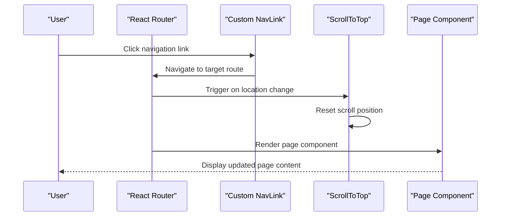

**Diagram sources**
- [src/components/NavLink.tsx:1-28](file://src/components/NavLink.tsx#L1-L28)
- [src/components/ScrollToTop.tsx:1-14](file://src/components/ScrollToTop.tsx#L1-L14)
- [src/App.tsx:90-158](file://src/App.tsx#L90-L158)

**Section sources**
- [src/App.tsx:90-158](file://src/App.tsx#L90-L158)
- [src/components/NavLink.tsx:1-28](file://src/components/NavLink.tsx#L1-L28)
- [src/components/ScrollToTop.tsx:1-14](file://src/components/ScrollToTop.tsx#L1-L14)

### Shared Layouts and Page Lifecycle
- Portal Layout
  - The portal layout composes a sidebar, top bar, and outlet. It is protected by an authentication guard and provides a consistent header and navigation for authenticated routes.
- Admin Layout
  - The admin layout provides secure access to administrative functions with role-based access control and comprehensive navigation for admin operations.
  - **Updated** Now includes integrated NotificationBell component that displays real-time notifications for admin users.
- Page Lifecycle Management
  - The ScrollToTop component runs on route changes, resetting scroll position. Providers set up global state and UI behavior, influencing how pages mount and update.

References:
- [src/components/portal/PortalLayout.tsx:1-28](file://src/components/portal/PortalLayout.tsx#L1-L28)
- [src/components/admin/AdminLayout.tsx:1-50](file://src/components/admin/AdminLayout.tsx#L1-L50)
- [src/components/ScrollToTop.tsx:1-14](file://src/components/ScrollToTop.tsx#L1-L14)
- [src/App.tsx:147-158](file://src/App.tsx#L147-L158)


**Diagram sources**
- [src/components/ScrollToTop.tsx:1-14](file://src/components/ScrollToTop.tsx#L1-L14)
- [src/App.tsx:147-158](file://src/App.tsx#L147-L158)

**Section sources**
- [src/components/portal/PortalLayout.tsx:1-28](file://src/components/portal/PortalLayout.tsx#L1-L28)
- [src/components/admin/AdminLayout.tsx:1-50](file://src/components/admin/AdminLayout.tsx#L1-L50)
- [src/components/ScrollToTop.tsx:1-14](file://src/components/ScrollToTop.tsx#L1-L14)
- [src/App.tsx:147-158](file://src/App.tsx#L147-L158)

### Referral Redirect System
**Updated** The application now includes a comprehensive referral redirect system that provides clean URL structure and enhanced attribution tracking.

#### ReferralRedirect Component
The new ReferralRedirect component provides a clean URL structure for referral links:

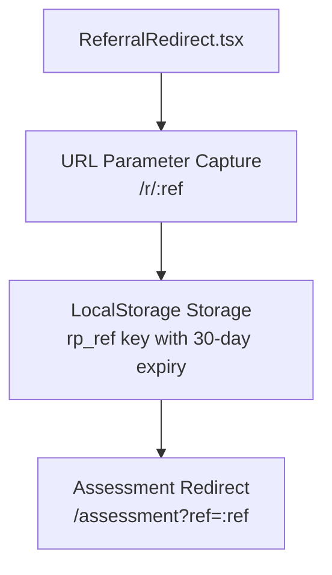

**Diagram sources**
- [src/pages/ReferralRedirect.tsx:1-7](file://src/pages/ReferralRedirect.tsx#L1-L7)
- [src/lib/referralTracking.ts:13-23](file://src/lib/referralTracking.ts#L13-L23)

#### Referral Tracking Integration
The referral system integrates seamlessly with the Assessment page and GHL CRM:

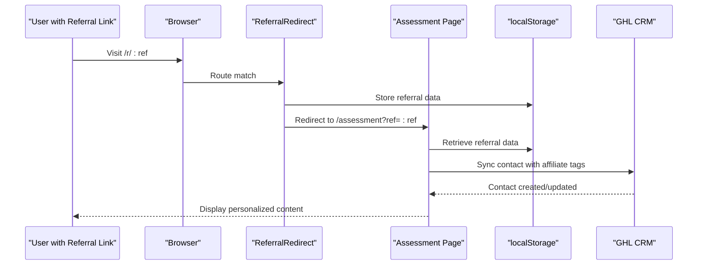

**Diagram sources**
- [src/pages/ReferralRedirect.tsx:1-7](file://src/pages/ReferralRedirect.tsx#L1-L7)
- [src/pages/Assessment.tsx:118-119](file://src/pages/Assessment.tsx#L118-L119)
- [src/lib/referralTracking.ts:28-44](file://src/lib/referralTracking.ts#L28-L44)

**Section sources**
- [src/pages/ReferralRedirect.tsx:1-7](file://src/pages/ReferralRedirect.tsx#L1-L7)
- [src/lib/referralTracking.ts:13-23](file://src/lib/referralTracking.ts#L13-L23)
- [src/lib/referralTracking.ts:28-44](file://src/lib/referralTracking.ts#L28-L44)
- [src/pages/Assessment.tsx:118-119](file://src/pages/Assessment.tsx#L118-L119)

### Portal Navigation Updates
**Updated** The portal navigation has been streamlined by removing the Calculator link, focusing on core functionality for partners.

#### PortalSidebar Navigation Structure
The portal sidebar now provides focused navigation for partner portal users:

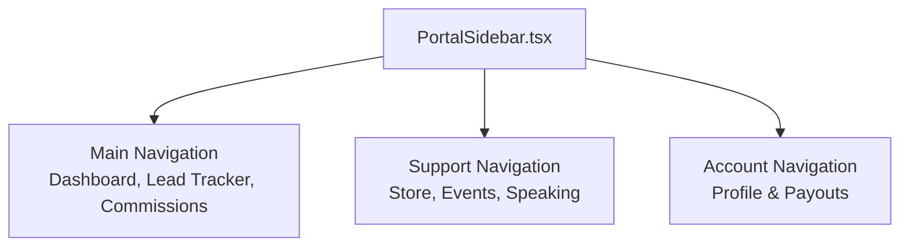

**Diagram sources**
- [src/components/portal/PortalSidebar.tsx:21-35](file://src/components/portal/PortalSidebar.tsx#L21-L35)

#### Removed Calculator Link
The Calculator link has been removed from portal navigation as it was moved to a separate component that is no longer routed:

```typescript
// Removed from portal navigation
{ title: "Calculator", url: "/portal/calculator", icon: Calculator },
```

**Section sources**
- [src/components/portal/PortalSidebar.tsx:21-35](file://src/components/portal/PortalSidebar.tsx#L21-L35)

### Enhanced Admin Portal Implementation

**Updated** The admin portal has been significantly enhanced with comprehensive affiliate management capabilities, new commission management features, improved lead tracking functionality, and integrated notification system.

#### AdminLayout with Notification Bell
The AdminLayout now includes an integrated NotificationBell component for real-time admin communications:

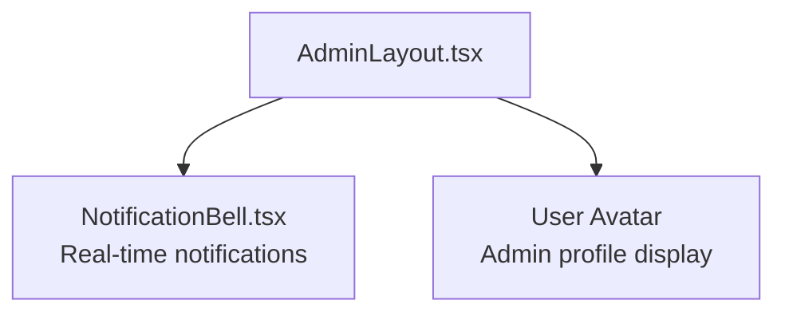

**Diagram sources**
- [src/components/admin/AdminLayout.tsx:30-35](file://src/components/admin/AdminLayout.tsx#L30-L35)
- [src/components/NotificationBell.tsx:30-45](file://src/components/NotificationBell.tsx#L30-L45)

#### AdminAffiliateDetail Page Architecture
The new AdminAffiliateDetail page provides a comprehensive affiliate management interface with five distinct tabs:

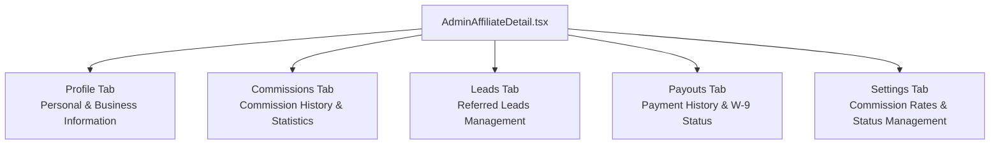

**Diagram sources**
- [src/pages/admin/AdminAffiliateDetail.tsx:144-178](file://src/pages/admin/AdminAffiliateDetail.tsx#L144-L178)
- [src/components/admin/affiliate-detail/AffiliateProfileTab.tsx:40-82](file://src/components/admin/affiliate-detail/AffiliateProfileTab.tsx#L40-L82)
- [src/components/admin/affiliate-detail/AffiliateCommissionsTab.tsx:28-174](file://src/components/admin/affiliate-detail/AffiliateCommissionsTab.tsx#L28-L174)
- [src/components/admin/affiliate-detail/AffiliateLeadsTab.tsx:40-133](file://src/components/admin/affiliate-detail/AffiliateLeadsTab.tsx#L40-L133)
- [src/components/admin/affiliate-detail/AffiliatePayoutsTab.tsx:27-155](file://src/components/admin/affiliate-detail/AffiliatePayoutsTab.tsx#L27-L155)
- [src/components/admin/affiliate-detail/AffiliateSettingsTab.tsx:25-187](file://src/components/admin/affiliate-detail/AffiliateSettingsTab.tsx#L25-L187)

#### AdminAffiliates Page Enhancements
The AdminAffiliates page now features improved sorting capabilities and enhanced commission rate display:

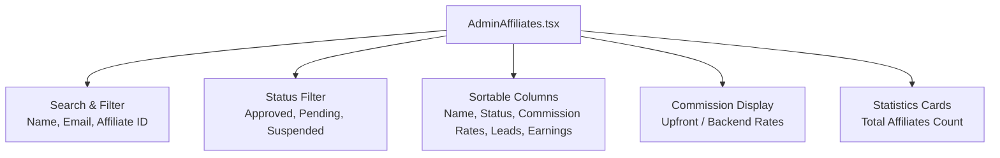

**Diagram sources**
- [src/pages/admin/AdminAffiliates.tsx:113-137](file://src/pages/admin/AdminAffiliates.tsx#L113-L137)
- [src/pages/admin/AdminAffiliates.tsx:204-223](file://src/pages/admin/AdminAffiliates.tsx#L204-L223)
- [src/pages/admin/AdminAffiliates.tsx:251-258](file://src/pages/admin/AdminAffiliates.tsx#L251-L258)

#### AdminLeads Page Improvements
The AdminLeads page now includes comprehensive statistics and enhanced data presentation:

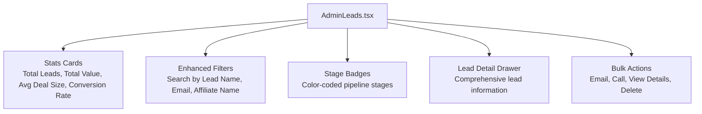

**Diagram sources**
- [src/pages/admin/AdminLeads.tsx:211-256](file://src/pages/admin/AdminLeads.tsx#L211-L256)
- [src/pages/admin/AdminLeads.tsx:181-193](file://src/pages/admin/AdminLeads.tsx#L181-L193)
- [src/pages/admin/AdminLeads.tsx:408-413](file://src/pages/admin/AdminLeads.tsx#L408-L413)

#### AdminCommissions Page
The new AdminCommissions page provides comprehensive commission management capabilities:

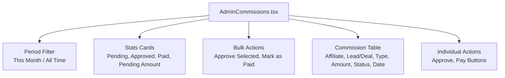

**Diagram sources**
- [src/pages/admin/AdminCommissions.tsx:234-250](file://src/pages/admin/AdminCommissions.tsx#L234-L250)
- [src/pages/admin/AdminCommissions.tsx:253-298](file://src/pages/admin/AdminCommissions.tsx#L253-L298)
- [src/pages/admin/AdminCommissions.tsx:301-322](file://src/pages/admin/AdminCommissions.tsx#L301-L322)
- [src/pages/admin/AdminCommissions.tsx:351-368](file://src/pages/admin/AdminCommissions.tsx#L351-L368)

#### AdminLeadDetailDrawer
The new AdminLeadDetailDrawer provides comprehensive lead information viewing with contact details, pipeline status, commission information, and assignment details:

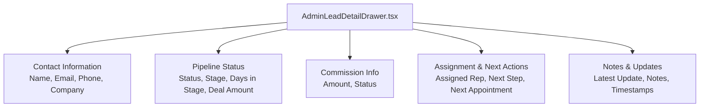

**Diagram sources**
- [src/components/admin/AdminLeadDetailDrawer.tsx:43-133](file://src/components/admin/AdminLeadDetailDrawer.tsx#L43-L133)

#### NotificationBell System
The integrated notification system provides real-time admin notifications with the following features:

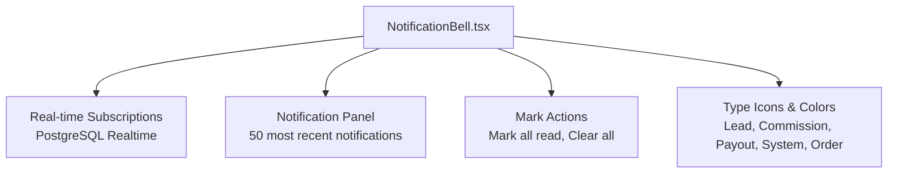

**Diagram sources**
- [src/components/NotificationBell.tsx:36-96](file://src/components/NotificationBell.tsx#L36-L96)
- [src/components/NotificationBell.tsx:150-214](file://src/components/NotificationBell.tsx#L150-L214)

**Section sources**
- [src/pages/admin/AdminAffiliateDetail.tsx:35-182](file://src/pages/admin/AdminAffiliateDetail.tsx#L35-L182)
- [src/pages/admin/AdminAffiliates.tsx:35-279](file://src/pages/admin/AdminAffiliates.tsx#L35-L279)
- [src/pages/admin/AdminLeads.tsx:77-416](file://src/pages/admin/AdminLeads.tsx#L77-L416)
- [src/pages/admin/AdminCommissions.tsx:57-466](file://src/pages/admin/AdminCommissions.tsx#L57-L466)
- [src/components/admin/AdminLeadDetailDrawer.tsx:1-134](file://src/components/admin/AdminLeadDetailDrawer.tsx#L1-L134)
- [src/components/NotificationBell.tsx:1-218](file://src/components/NotificationBell.tsx#L1-L218)

### Enhanced Thank You Page Implementation
**Updated** The Thank You page now features sophisticated order processing with polling mechanisms and integration with the fetch-order edge function for Shopify order synchronization.

#### Order Processing Architecture
The Thank You page implements a robust order validation and retrieval system with intelligent polling:

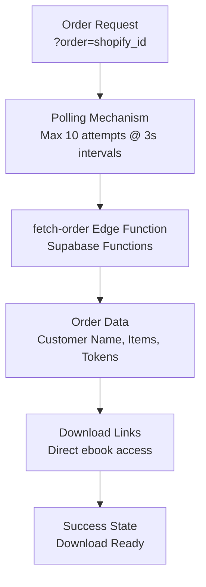

**Diagram sources**
- [src/pages/ThankYou.tsx:26-80](file://src/pages/ThankYou.tsx#L26-L80)
- [src/pages/ThankYou.tsx:44-80](file://src/pages/ThankYou.tsx#L44-L80)

#### Edge Function Integration
The Thank You page integrates with the fetch-order edge function for real-time order processing:

```typescript
const fetchOrder = async () => {
  try {
    const { data, error: fetchErr } = await supabase.functions.invoke(
      "fetch-order",
      { body: { shopify_order_id: orderId } }
    );

    if (fetchErr) throw fetchErr;

    if (data?.found && data.order) {
      setOrder(data.order as Order);
      setLoading(false);
      return;
    }

    // Order not found yet — webhook may still be processing
    pollCount.current += 1;
    if (pollCount.current < MAX_POLL_ATTEMPTS) {
      pollTimer.current = setTimeout(fetchOrder, POLL_INTERVAL_MS);
    } else {
      setError(
        "Your order is still being processed. Check your email shortly for download links."
      );
      setLoading(false);
    }
  } catch {
    setError("Something went wrong. Check your email for download links.");
    setLoading(false);
  }
};
```

#### Download Management System
The page provides direct download access through token-based URLs:

```typescript
const downloadUrl = (token: string) =>
  `${import.meta.env.VITE_SUPABASE_URL}/functions/v1/download-ebook?token=${token}`;
```

**Section sources**
- [src/pages/ThankYou.tsx:26-80](file://src/pages/ThankYou.tsx#L26-L80)
- [src/pages/ThankYou.tsx:44-80](file://src/pages/ThankYou.tsx#L44-L80)
- [src/pages/ThankYou.tsx:82-83](file://src/pages/ThankYou.tsx#L82-L83)
- [supabase/functions/fetch-order/index.ts](file://supabase/functions/fetch-order/index.ts)
- [supabase/functions/download-ebook/index.ts](file://supabase/functions/download-ebook/index.ts)

### Unsubscribe Page Implementation
**Updated** The new Unsubscribe page provides comprehensive email management with token-based validation and integration with the handle-email-unsubscribe edge function.

#### Token-Based Validation System
The Unsubscribe page implements a multi-state validation system:

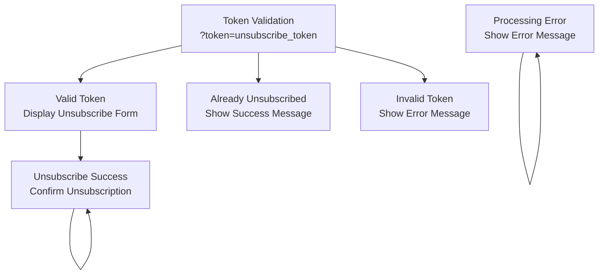

**Diagram sources**
- [src/pages/Unsubscribe.tsx:16-56](file://src/pages/Unsubscribe.tsx#L16-L56)

#### Email Suppression Integration
The Unsubscribe page integrates with the email suppression system:

```typescript
const validate = async () => {
  try {
    const supabaseUrl = import.meta.env.VITE_SUPABASE_URL;
    const anonKey = import.meta.env.VITE_SUPABASE_PUBLISHABLE_KEY;
    const res = await fetch(
      `${supabaseUrl}/functions/v1/handle-email-unsubscribe?token=${token}`,
      { headers: { apikey: anonKey } }
    );
    const data = await res.json();
    if (data.valid === true) setStatus("valid");
    else if (data.reason === "already_unsubscribed") setStatus("already");
    else setStatus("invalid");
  } catch {
    setStatus("invalid");
  }
};

const handleUnsubscribe = async () => {
  if (!token) return;
  setProcessing(true);
  try {
    const { data, error } = await supabase.functions.invoke("handle-email-unsubscribe", {
      body: { token },
    });
    if (error) throw error;
    if (data?.success) setStatus("success");
    else if (data?.reason === "already_unsubscribed") setStatus("already");
    else setStatus("error");
  } catch {
    setStatus("error");
  } finally {
    setProcessing(false);
  }
};
```

**Section sources**
- [src/pages/Unsubscribe.tsx:16-56](file://src/pages/Unsubscribe.tsx#L16-L56)
- [src/pages/Unsubscribe.tsx:40-56](file://src/pages/Unsubscribe.tsx#L40-L56)
- [supabase/functions/handle-email-unsubscribe/index.ts](file://supabase/functions/handle-email-unsubscribe/index.ts)

### Credit Intake Form Implementation
**Updated** The new `/credit-intake` route provides a comprehensive client intake form for Scorexer integration with multi-step validation and secure data handling.

#### Multi-Step Form Architecture
The credit intake form implements a sophisticated three-step process with progressive disclosure and real-time validation:

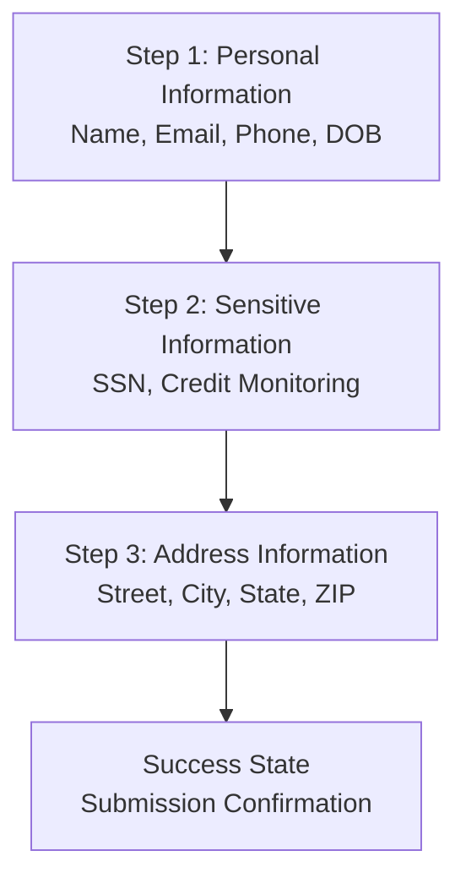

**Diagram sources**
- [src/pages/CreditIntake.tsx:75-163](file://src/pages/CreditIntake.tsx#L75-L163)

#### Security and Data Protection
The form implements strict security measures for handling sensitive information:

- **SSN Masking**: Secure Social Security Number input with toggle visibility and automatic formatting
- **Encrypted Transmission**: All sensitive data is transmitted over HTTPS to edge functions
- **No Database Storage**: SSN data is never stored in the database, only sent to Scorexer webhook
- **Input Validation**: Comprehensive Zod validation on both client and server side

#### Edge Function Integration
The credit intake form integrates with a dedicated Supabase Edge Function that handles the complete workflow:

```typescript
const result = await callEdgeFunction("scorexer-intake", {
  firstName: form.firstName,
  middleName: form.middleName || "",
  lastName: form.lastName,
  email: form.email,
  phone: form.phone,
  dob: form.dob,
  ssn: ssnDigits,
  creditMonitoring: form.creditMonitoring,
  street: form.street,
  city: form.city,
  state: form.state,
  zip: form.zip,
});
```

**Section sources**
- [src/pages/CreditIntake.tsx:75-163](file://src/pages/CreditIntake.tsx#L75-L163)
- [src/pages/CreditIntake.tsx:137-150](file://src/pages/CreditIntake.tsx#L137-L150)
- [supabase/functions/scorexer-intake/index.ts:72-110](file://supabase/functions/scorexer-intake/index.ts#L72-L110)

### Assessment Page Integration Architecture
**Updated** The Assessment page now uses a hybrid integration approach combining Supabase database operations with direct HTTP fetch calls to Supabase Edge Functions for GHL CRM synchronization.

#### Direct HTTP Fetch Implementation
The Assessment page implements a custom `callEdgeFunction` helper that bypasses the Supabase SDK to avoid AbortError issues:

```typescript
// Direct fetch helper to bypass Supabase SDK AbortError
const SUPABASE_URL = import.meta.env.VITE_SUPABASE_URL as string;
const SUPABASE_KEY = import.meta.env.VITE_SUPABASE_PUBLISHABLE_KEY as string;

async function callEdgeFunction(name: string, body: Record<string, unknown>) {
  const res = await fetch(`${SUPABASE_URL}/functions/v1/${name}`, {
    method: "POST",
    headers: {
      "Content-Type": "application/json",
      "Authorization": `Bearer ${SUPABASE_KEY}`,
      "apikey": SUPABASE_KEY,
    },
    body: JSON.stringify(body),
  });
  return res.json();
}
```

#### Parallel Processing Architecture
The Assessment page now implements parallel processing for improved user experience:

```typescript
// Fire DB insert + GHL sync in background — don't block UI
try {
  const insertPromise = supabase.from("assessment_leads").insert({
    // ... database fields
  });

  // Fire-and-forget: sync to GHL with affiliate attribution
  const refId = getReferralAffiliateId();
  const tags = ["assessment-lead", qualification];
  if (refId) {
    tags.push("Affiliate", `Affiliate - ${refId}`);
  }

  const ghlPromise = callEdgeFunction("ghl-create-contact", {
    // ... GHL contact data
  }).then((result) => {
    if (result?.error) console.error("GHL sync failed:", result.error);

    // If affiliate referral, also record the lead in the portal
    if (refId) {
      callEdgeFunction("ghl-affiliate-webhook", {
        type: "lead_referred",
        affiliate_id: refId,
        full_name: parsed.data.name,
        email: parsed.data.email,
        phone: parsed.data.phone,
      }).then((r) => {
        if (r?.error) console.error("Affiliate lead sync failed:", r.error);
      }).catch(() => {});
    }
  }).catch(() => {});

  // Run both in parallel, don't block
  Promise.allSettled([insertPromise, ghlPromise]).catch(() => {});
} catch {
  // Result is already shown — log silently
  console.error("Assessment background save failed");
}
```

#### Edge Function Integration
The system integrates with two key Supabase Edge Functions:

1. **GHL Contact Creation**: Creates or updates contacts in the LeadConnectorHQ CRM
2. **Affiliate Webhook**: Records affiliate lead referrals in the portal system

References:
- [src/pages/Assessment.tsx:25-40](file://src/pages/Assessment.tsx#L25-L40)
- [src/pages/Assessment.tsx:161-224](file://src/pages/Assessment.tsx#L161-L224)
- [src/lib/referralTracking.ts:28-44](file://src/lib/referralTracking.ts#L28-L44)
- [supabase/functions/ghl-create-contact/index.ts:16-133](file://supabase/functions/ghl-create-contact/index.ts#L16-L133)
- [supabase/functions/ghl-affiliate-webhook/index.ts:31-44](file://supabase/functions/ghl-affiliate-webhook/index.ts#L31-L44)

**Section sources**
- [src/pages/Assessment.tsx:25-40](file://src/pages/Assessment.tsx#L25-L40)
- [src/pages/Assessment.tsx:161-224](file://src/pages/Assessment.tsx#L161-L224)
- [src/lib/referralTracking.ts:28-44](file://src/lib/referralTracking.ts#L28-L44)
- [supabase/functions/ghl-create-contact/index.ts:16-133](file://supabase/functions/ghl-create-contact/index.ts#L16-L133)
- [supabase/functions/ghl-affiliate-webhook/index.ts:31-44](file://supabase/functions/ghl-affiliate-webhook/index.ts#L31-L44)

### Implementing New Static Pages
To add a new static page (e.g., a new informational page):
1. Create a new component for the page under src/.
2. Add a route for the new page in the central route declaration, placing it before the catch-all route.
3. Optionally wrap the page in a shared layout if applicable.
4. Use the custom NavLink component for navigation to maintain consistent active/pending styles.

Reference:
- [src/App.tsx:90-158](file://src/App.tsx#L90-L158)
- [src/components/NavLink.tsx:1-28](file://src/components/NavLink.tsx#L1-L28)

**Section sources**
- [src/App.tsx:90-158](file://src/App.tsx#L90-L158)
- [src/components/NavLink.tsx:1-28](file://src/components/NavLink.tsx#L1-L28)

### Handling Page Transitions and Animations
- Scroll-to-top behavior is handled automatically on route changes.
- For advanced transitions, consider integrating a transition library with the router and applying motion variants in page components.

Reference:
- [src/components/ScrollToTop.tsx:1-14](file://src/components/ScrollToTop.tsx#L1-L14)

**Section sources**
- [src/components/ScrollToTop.tsx:1-14](file://src/components/ScrollToTop.tsx#L1-L14)

### SEO Considerations and Meta Tags
- The HTML template defines essential SEO metadata, including viewport, title, description, author, Open Graph, Twitter Card, and favicon.
- Keep the title and description aligned with each page's purpose. For dynamic pages, integrate a head management solution to update meta tags per route.

References:
- [index.html:23-39](file://index.html#L23-L39)
- [src/pages/ThankYou.tsx:87-90](file://src/pages/ThankYou.tsx#L87-L90)
- [src/pages/Unsubscribe.tsx:60](file://src/pages/Unsubscribe.tsx#L60)

**Section sources**
- [index.html:23-39](file://index.html#L23-L39)
- [src/pages/ThankYou.tsx:87-90](file://src/pages/ThankYou.tsx#L87-L90)
- [src/pages/Unsubscribe.tsx:60](file://src/pages/Unsubscribe.tsx#L60)

### Responsive Design Patterns
- Tailwind CSS is configured to support responsive breakpoints and animations.
- The use-mobile hook detects mobile widths and can be used to adapt UI behavior.

References:
- [tailwind.config.ts:4-96](file://tailwind.config.ts#L4-L96)
- [src/hooks/use-mobile.tsx:1-19](file://src/hooks/use-mobile.tsx#L1-L19)

**Section sources**
- [tailwind.config.ts:4-96](file://tailwind.config.ts#L4-L96)
- [src/hooks/use-mobile.tsx:1-19](file://src/hooks/use-mobile.tsx#L1-L19)

### Authentication and Access Control
**Updated** The application now includes comprehensive authentication and access control mechanisms for different user types.

#### Portal Authentication
The portal system uses an AuthGuard component to protect authenticated routes:

```typescript
export default function AuthGuard({ children }: AuthGuardProps) {
  const { user, loading } = useAuth();
  
  if (loading) {
    return <div>Loading portal…</div>;
  }
  
  if (!user) {
    return <Navigate to="/portal/login" replace />;
  }
  
  return <>{children}</>;
}
```

#### Admin Access Control
The admin system provides role-based access with AdminGuard:

```typescript
export default function AdminGuard({ children }: AdminGuardProps) {
  const { user, loading: authLoading } = useAuth();
  const { isAdmin, isLoading: roleLoading } = useAdminRole();
  const loading = authLoading || (user ? roleLoading : false);

  if (!user) {
    return <Navigate to="/portal/login" replace />;
  }

  if (!isAdmin) {
    return <Navigate to="/portal/login" replace />;
  }

  return <>{children}</>;
}
```

**Section sources**
- [src/components/portal/AuthGuard.tsx:1-28](file://src/components/portal/AuthGuard.tsx#L1-L28)
- [src/components/admin/AdminGuard.tsx:1-35](file://src/components/admin/AdminGuard.tsx#L1-L35)

## Dependency Analysis
The routing and page system relies on a small set of core dependencies and build-time optimizations.

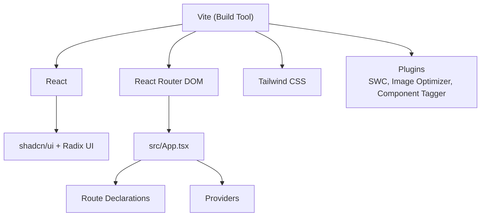

**Diagram sources**
- [package.json:15-69](file://package.json#L15-L69)
- [vite.config.ts:16-25](file://vite.config.ts#L16-L25)
- [src/App.tsx:147-158](file://src/App.tsx#L147-L158)

**Section sources**
- [package.json:15-69](file://package.json#L15-L69)
- [vite.config.ts:16-25](file://vite.config.ts#L16-L25)
- [src/App.tsx:147-158](file://src/App.tsx#L147-L158)

## Performance Considerations
- Code splitting and chunking are configured to separate vendor libraries, UI libraries, and Supabase dependencies, reducing initial bundle size and improving load performance.
- Image optimization is enabled via a Vite plugin to reduce payload sizes for images.
- Provider setup occurs once at the shell level, minimizing re-renders across pages.

**Updated** The Assessment page now implements parallel processing for improved performance:
- Database insertion and GHL synchronization run concurrently using Promise.allSettled
- Direct HTTP fetch bypasses Supabase SDK AbortError issues
- Affiliate lead tracking is fire-and-forget for non-blocking user experience

**Updated** The ReferralRedirect system provides efficient referral attribution:
- Clean URL structure (/r/:ref) for better SEO and user experience
- localStorage-based storage with 30-day expiry for referral data
- Seamless integration with Assessment page and GHL CRM

**Updated** The Credit Intake form implements efficient state management and validation:
- Zod schemas provide immediate client-side validation feedback
- Progressive disclosure reduces cognitive load and improves conversion rates
- Edge function integration minimizes server-side processing time

**Updated** The Thank You page implements intelligent polling with configurable limits:
- Maximum 10 polling attempts with 3-second intervals
- Graceful fallback for processing delays
- Optimized loading states and user feedback

**Updated** The Unsubscribe page implements efficient token validation:
- Direct HTTP fetch for token verification
- State management for different validation outcomes
- User-friendly error handling and success states

**Updated** The new admin pages implement optimized data fetching and display:
- AdminAffiliates: Efficient parallel processing for lead counts and earnings calculation
- AdminLeads: Real-time statistics calculation and enhanced filtering
- AdminCommissions: Bulk action selection with efficient state management
- AdminAffiliateDetail: Tab-based lazy loading for improved performance
- AdminLeadDetailDrawer: Right-side drawer with optimized rendering
- NotificationBell: Real-time subscriptions with efficient state management

**Updated** The integrated notification system provides:
- Real-time PostgreSQL Realtime subscriptions for instant notifications
- Efficient notification panel with 50-item limit
- Mark all read and clear all functionality
- Type-specific icons and color coding

Recommendations:
- Lazy-load heavy page components using React.lazy and Suspense boundaries around route elements.
- Defer non-critical resources and leverage browser caching strategies.
- Monitor Largest Contentful Paint (LCP) and First Input Delay (FID) metrics post-deployment.
- Consider implementing retry logic for edge function calls in production environments.

**Section sources**
- [vite.config.ts:31-41](file://vite.config.ts#L31-L41)
- [vite.config.ts:19-24](file://vite.config.ts#L19-L24)
- [src/App.tsx:147-158](file://src/App.tsx#L147-L158)
- [src/pages/Assessment.tsx:161-224](file://src/pages/Assessment.tsx#L161-L224)
- [src/pages/ReferralRedirect.tsx:1-7](file://src/pages/ReferralRedirect.tsx#L1-L7)
- [src/lib/referralTracking.ts:13-23](file://src/lib/referralTracking.ts#L13-L23)
- [src/pages/CreditIntake.tsx:102-122](file://src/pages/CreditIntake.tsx#L102-L122)
- [src/pages/ThankYou.tsx:26-80](file://src/pages/ThankYou.tsx#L26-L80)
- [src/pages/Unsubscribe.tsx:16-56](file://src/pages/Unsubscribe.tsx#L16-L56)
- [src/pages/admin/AdminAffiliates.tsx:62-86](file://src/pages/admin/AdminAffiliates.tsx#L62-L86)
- [src/pages/admin/AdminLeads.tsx:162-174](file://src/pages/admin/AdminLeads.tsx#L162-L174)
- [src/pages/admin/AdminCommissions.tsx:141-152](file://src/pages/admin/AdminCommissions.tsx#L141-L152)
- [src/pages/admin/AdminAffiliateDetail.tsx:42-65](file://src/pages/admin/AdminAffiliateDetail.tsx#L42-L65)
- [src/components/admin/AdminLeadDetailDrawer.tsx:43-133](file://src/components/admin/AdminLeadDetailDrawer.tsx#L43-L133)
- [src/components/NotificationBell.tsx:36-96](file://src/components/NotificationBell.tsx#L36-L96)

## Troubleshooting Guide
Common issues and resolutions:
- Navigation does not scroll to top after route change
  - Ensure the ScrollToTop component is mounted within the router context and that it receives location updates.
  - Reference: [src/components/ScrollToTop.tsx:1-14](file://src/components/ScrollToTop.tsx#L1-L14)
- Active/pending styles not applied to navigation links
  - Verify the custom NavLink wrapper is used consistently and that active/pending class names are provided.
  - Reference: [src/components/NavLink.tsx:1-28](file://src/components/NavLink.tsx#L1-L28)
- Portal layout not rendering for authenticated routes
  - Confirm the portal layout route is nested and guarded by an authentication mechanism.
  - Reference: [src/components/portal/PortalLayout.tsx:1-28](file://src/components/portal/PortalLayout.tsx#L1-L28)
- Admin layout not rendering for authorized users
  - Verify the admin layout route is properly nested and guarded by AdminGuard.
  - Reference: [src/components/admin/AdminLayout.tsx:1-50](file://src/components/admin/AdminLayout.tsx#L1-L50)
- SEO metadata not updating per page
  - Integrate a head management solution to dynamically update meta tags for each route.
  - References: [index.html:23-39](file://index.html#L23-L39)
- **Referral redirect not working**
  - **Issue**: Referral links not redirecting to Assessment page
  - **Solution**: Verify ReferralRedirect route is properly configured, check localStorage for referral data, ensure Assessment page captures referral on mount
  - Reference: [src/pages/ReferralRedirect.tsx:1-7](file://src/pages/ReferralRedirect.tsx#L1-L7)
- **Referral tracking not persisting**
  - **Issue**: Referral data not stored in localStorage or expiring prematurely
  - **Solution**: Check localStorage quota, verify 30-day expiry calculation, ensure captureReferral function is called on Assessment page mount
  - Reference: [src/lib/referralTracking.ts:13-23](file://src/lib/referralTracking.ts#L13-L23)
- **Assessment page GHL integration failures**
  - **Issue**: GHL synchronization errors or timeouts
  - **Solution**: Check edge function logs in Supabase dashboard, verify API keys are configured, ensure network connectivity to LeadConnectorHQ
  - Reference: [src/pages/Assessment.tsx:176-214](file://src/pages/Assessment.tsx#L176-L214)
- **Credit Intake form submission failures**
  - **Issue**: Scorexer webhook integration errors or SSN validation failures
  - **Solution**: Verify SCOREXER_ZAPIER_WEBHOOK_URL environment variable, check SSN formatting, ensure GHL API credentials are configured
  - Reference: [supabase/functions/scorexer-intake/index.ts:22-26](file://supabase/functions/scorexer-intake/index.ts#L22-L26)
- **Parallel processing not working**
  - **Issue**: Database insertion blocking while GHL sync processes
  - **Solution**: Verify Promise.allSettled implementation and ensure both promises are properly awaited
  - Reference: [src/pages/Assessment.tsx:216-217](file://src/pages/Assessment.tsx#L216-L217)
- **Affiliate lead tracking not recording**
  - **Issue**: Affiliate IDs not being captured or processed
  - **Solution**: Check localStorage for referral data, verify getReferralAffiliateId function, ensure affiliate webhook is configured
  - Reference: [src/lib/referralTracking.ts:28-44](file://src/lib/referralTracking.ts#L28-L44)
- **Thank You page order polling failures**
  - **Issue**: Order not found after multiple polling attempts
  - **Solution**: Verify fetch-order edge function is deployed, check Shopify webhook processing, monitor Supabase function logs
  - Reference: [src/pages/ThankYou.tsx:59-72](file://src/pages/ThankYou.tsx#L59-L72)
- **Unsubscribe page token validation failures**
  - **Issue**: Invalid or expired unsubscribe tokens
  - **Solution**: Verify token generation process, check handle-email-unsubscribe function, ensure proper API key configuration
  - Reference: [src/pages/Unsubscribe.tsx:16-38](file://src/pages/Unsubscribe.tsx#L16-L38)
- **Email suppression not working**
  - **Issue**: Subscribers still receiving emails after unsubscribing
  - **Solution**: Check handle-email-unsubscribe edge function logs, verify email infrastructure integration, confirm suppression list updates
  - Reference: [supabase/functions/handle-email-unsubscribe/index.ts](file://supabase/functions/handle-email-unsubscribe/index.ts)
- **AdminAffiliateDetail page loading issues**
  - **Issue**: Affiliate data not loading or displaying incorrectly
  - **Solution**: Verify Supabase connection, check affiliate ID parameter, ensure all tab components are properly imported and rendered
  - Reference: [src/pages/admin/AdminAffiliateDetail.tsx:42-65](file://src/pages/admin/AdminAffiliateDetail.tsx#L42-L65)
- **AdminAffiliates sorting not working**
  - **Issue**: Sorting columns not responding or incorrect sorting behavior
  - **Solution**: Verify sortField and sortDir state management, check column click handlers, ensure proper data comparison logic
  - Reference: [src/pages/admin/AdminAffiliates.tsx:97-104](file://src/pages/admin/AdminAffiliates.tsx#L97-L104)
- **AdminLeads filter not working**
  - **Issue**: Search or stage filters not affecting results
  - **Solution**: Verify filter state updates, check filteredAffiliates computation, ensure proper search term matching
  - Reference: [src/pages/admin/AdminLeads.tsx:195](file://src/pages/admin/AdminLeads.tsx#L195)
- **AdminCommissions bulk actions failing**
  - **Issue**: Bulk selection or status updates not working
  - **Solution**: Verify selectedCommissions state management, check updateCommissionStatus function, ensure proper error handling
  - Reference: [src/pages/admin/AdminCommissions.tsx:165-189](file://src/pages/admin/AdminCommissions.tsx#L165-L189)
- **AdminLeadDetailDrawer not displaying**
  - **Issue**: Lead detail drawer not opening or showing empty content
  - **Solution**: Verify lead object structure, check drawer props passing, ensure proper conditional rendering
  - Reference: [src/components/admin/AdminLeadDetailDrawer.tsx:43-133](file://src/components/admin/AdminLeadDetailDrawer.tsx#L43-L133)
- **NotificationBell not showing notifications**
  - **Issue**: Notification bell not displaying unread count or notifications
  - **Solution**: Verify user authentication, check Supabase realtime subscriptions, ensure proper user ID prop passing
  - Reference: [src/components/NotificationBell.tsx:30-45](file://src/components/NotificationBell.tsx#L30-L45)
- **AdminLayout notification integration issues**
  - **Issue**: Notification bell not appearing in admin layout
  - **Solution**: Verify AdminLayout imports NotificationBell, check user authentication context, ensure proper conditional rendering
  - Reference: [src/components/admin/AdminLayout.tsx:30-35](file://src/components/admin/AdminLayout.tsx#L30-L35)

**Section sources**
- [src/components/ScrollToTop.tsx:1-14](file://src/components/ScrollToTop.tsx#L1-L14)
- [src/components/NavLink.tsx:1-28](file://src/components/NavLink.tsx#L1-L28)
- [src/components/portal/PortalLayout.tsx:1-28](file://src/components/portal/PortalLayout.tsx#L1-L28)
- [src/components/admin/AdminLayout.tsx:1-50](file://src/components/admin/AdminLayout.tsx#L1-L50)
- [index.html:23-39](file://index.html#L23-L39)
- [src/pages/ReferralRedirect.tsx:1-7](file://src/pages/ReferralRedirect.tsx#L1-L7)
- [src/lib/referralTracking.ts:13-23](file://src/lib/referralTracking.ts#L13-L23)
- [src/pages/Assessment.tsx:176-214](file://src/pages/Assessment.tsx#L176-L214)
- [src/pages/Assessment.tsx:216-217](file://src/pages/Assessment.tsx#L216-L217)
- [src/lib/referralTracking.ts:28-44](file://src/lib/referralTracking.ts#L28-L44)
- [supabase/functions/scorexer-intake/index.ts:22-26](file://supabase/functions/scorexer-intake/index.ts#L22-L26)
- [src/pages/ThankYou.tsx:59-72](file://src/pages/ThankYou.tsx#L59-L72)
- [src/pages/Unsubscribe.tsx:16-38](file://src/pages/Unsubscribe.tsx#L16-L38)
- [supabase/functions/handle-email-unsubscribe/index.ts](file://supabase/functions/handle-email-unsubscribe/index.ts)
- [src/pages/admin/AdminAffiliateDetail.tsx:42-65](file://src/pages/admin/AdminAffiliateDetail.tsx#L42-L65)
- [src/pages/admin/AdminAffiliates.tsx:97-104](file://src/pages/admin/AdminAffiliates.tsx#L97-L104)
- [src/pages/admin/AdminLeads.tsx:195](file://src/pages/admin/AdminLeads.tsx#L195)
- [src/pages/admin/AdminCommissions.tsx:165-189](file://src/pages/admin/AdminCommissions.tsx#L165-L189)
- [src/components/admin/AdminLeadDetailDrawer.tsx:43-133](file://src/components/admin/AdminLeadDetailDrawer.tsx#L43-L133)
- [src/components/NotificationBell.tsx:30-45](file://src/components/NotificationBell.tsx#L30-L45)
- [src/components/admin/AdminLayout.tsx:30-35](file://src/components/admin/AdminLayout.tsx#L30-L35)

## Conclusion
The Ryland application employs a clean, centralized routing architecture with shared layouts and navigation utilities. Providers establish a robust foundation for state and UI behavior, while responsive and performance configurations support scalable growth. The new ReferralRedirect route provides clean URL structure for referral links, seamlessly integrating with the Assessment page and GHL CRM for enhanced attribution tracking. The removal of the old PortalCalculator route streamlines portal navigation, focusing on core functionality for partners. The Assessment page demonstrates advanced integration patterns with parallel processing capabilities that improve user experience while maintaining reliable data synchronization. The enhanced Thank You page provides sophisticated order processing with polling mechanisms and integration with the fetch-order edge function. The new Unsubscribe page delivers comprehensive email management with token-based validation and integration with the email suppression system. The addition of comprehensive admin portal functionality provides secure access control, detailed affiliate management interfaces, enhanced lead tracking capabilities, robust commission management features, and integrated notification system. The new AdminAffiliateDetail page offers a tabbed interface for comprehensive affiliate oversight with five distinct tabs covering profile, commissions, leads, payouts, and settings. The enhanced AdminAffiliates page provides improved sorting, commission rate visualization, and comprehensive statistics. The AdminLeadDetailDrawer offers detailed lead information viewing with contact details, pipeline status, commission information, and assignment details. The integrated NotificationBell system provides real-time admin notifications with type-specific icons and color coding. The streamlined portal navigation removes redundant links while maintaining essential functionality for partner portal users. The enhanced admin interface demonstrates comprehensive affiliate management capabilities with improved user experience and accessibility. By following the patterns outlined here—consistent route declarations, shared layouts, SEO-aware meta management, robust integration architectures, comprehensive email management, strong security practices, enhanced admin capabilities, and integrated notification system—you can reliably implement new pages, optimize performance, and deliver a seamless user experience across desktop and mobile devices.

[No sources needed since this section summarizes without analyzing specific files]

## Appendices
- Quick reference for adding a new static page:
  - Create the page component.
  - Register a route before the catch-all.
  - Use the custom NavLink for navigation.
  - Apply responsive utilities from Tailwind and the mobile hook where appropriate.
- **Referral redirect integration checklist**:
  - Verify ReferralRedirect route is properly configured in App.tsx
  - Test referral URL structure (/r/:ref) and redirection logic
  - Validate localStorage storage with 30-day expiry
  - Test Assessment page referral capture on mount
  - Verify GHL CRM integration with affiliate tags
  - Test edge case scenarios (invalid refs, expired data)
- **Assessment page integration checklist**:
  - Verify Supabase Edge Functions are deployed and configured
  - Test parallel processing implementation with network throttling
  - Validate affiliate tracking integration
  - Monitor GHL API response codes and error handling
  - Implement proper error boundaries for edge function failures
- **Credit Intake form integration checklist**:
  - Verify SCOREXER_ZAPIER_WEBHOOK_URL environment variable is configured
  - Test SSN validation and formatting logic
  - Validate GHL API credentials for contact synchronization
  - Test multi-step form navigation and validation
  - Verify edge function error handling and logging
  - Test success state and user feedback mechanisms
- **Thank You page integration checklist**:
  - Verify fetch-order edge function is deployed and functioning
  - Test polling mechanism with various order processing scenarios
  - Validate download token generation and access
  - Test error handling for processing delays and failures
  - Verify Supabase function logs and monitoring
- **Unsubscribe page integration checklist**:
  - Verify handle-email-unsubscribe edge function is deployed
  - Test token validation for various scenarios (valid, invalid, expired)
  - Validate email suppression list updates
  - Test user feedback for success, error, and already unsubscribed states
  - Verify API key configuration and security headers
  - Test integration with email infrastructure systems
- **Admin portal integration checklist**:
  - Verify AdminGuard is properly protecting admin routes
  - Test affiliate detail tab navigation and data loading
  - Validate admin statistics calculations and display
  - Test lead detail drawer functionality and information display
  - Verify commission status updates and bulk action handling
  - Test admin sidebar navigation and responsive behavior
  - Verify proper error handling for admin data operations
  - Test NotificationBell integration and real-time notifications
  - Verify affiliate detail tabs (Profile, Commissions, Leads, Payouts, Settings)
  - Test AdminLeadDetailDrawer comprehensive lead information display
- **Notification system integration checklist**:
  - Verify NotificationBell component is properly integrated into AdminLayout
  - Test real-time PostgreSQL Realtime subscriptions
  - Verify notification types and color coding
  - Test mark all read and clear all functionality
  - Verify notification panel display and interaction
  - Test user authentication context for notification filtering
  - Verify proper cleanup of realtime subscriptions on component unmount

[No sources needed since this section provides general guidance]