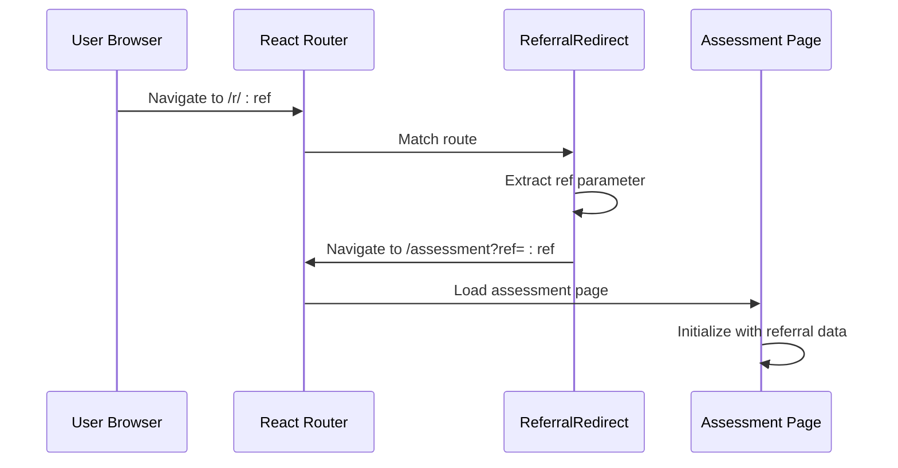
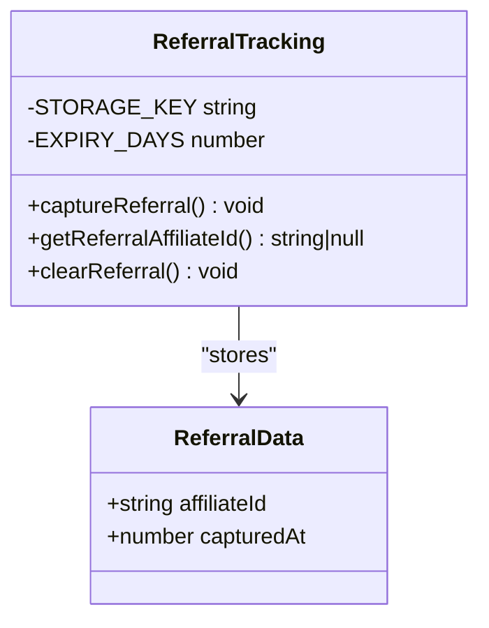
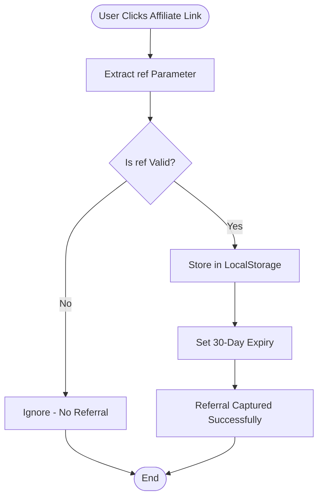
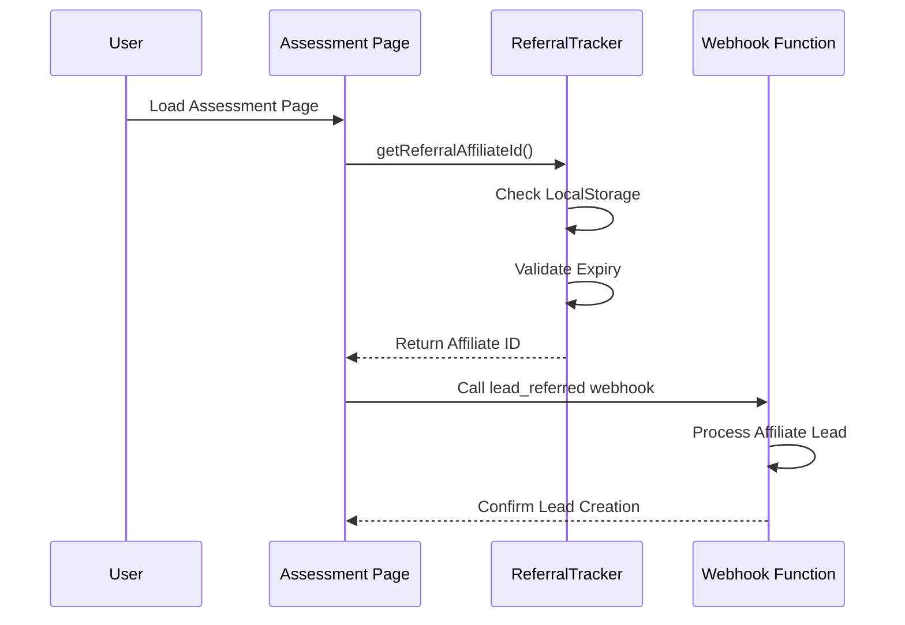
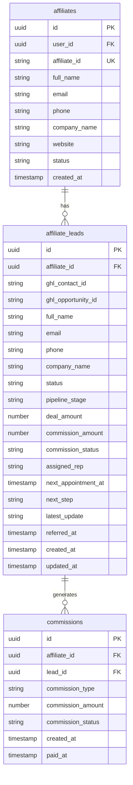
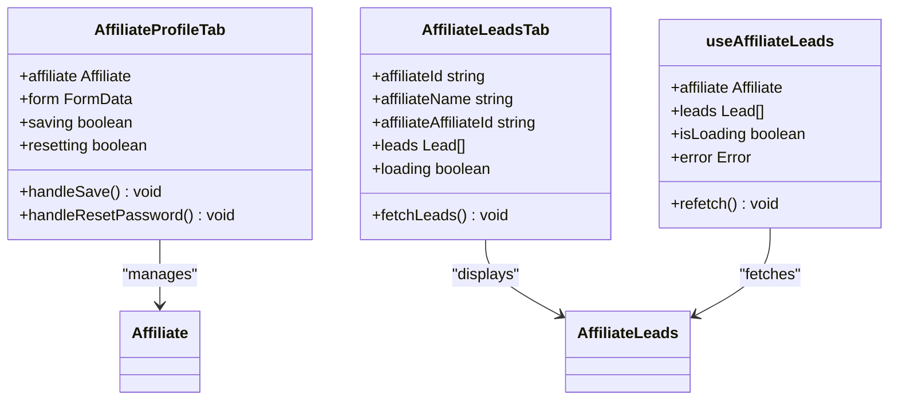
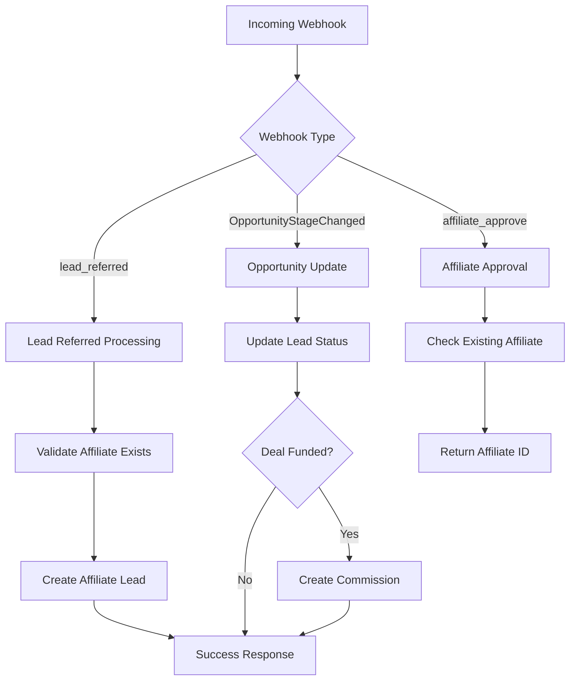
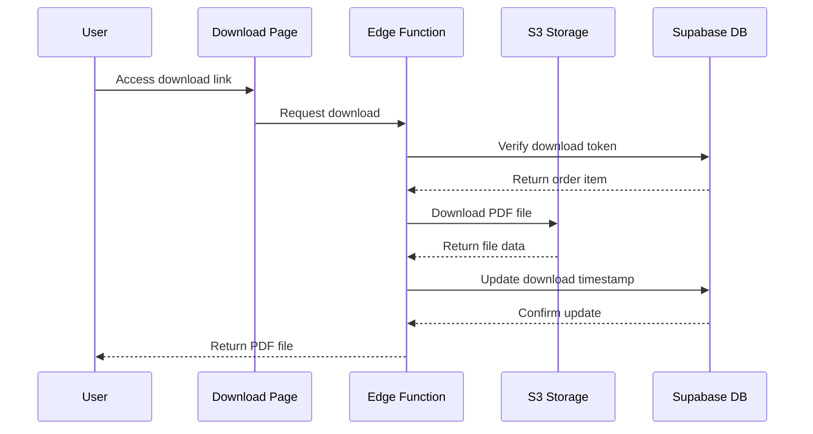
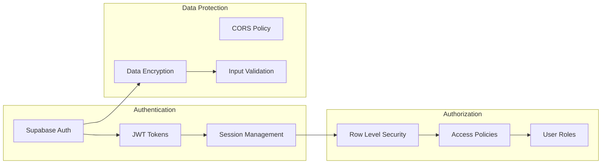

# Referral Redirect System

<cite>
**Referenced Files in This Document**
- [ReferralRedirect.tsx](file://src/pages/ReferralRedirect.tsx)
- [referralTracking.ts](file://src/lib/referralTracking.ts)
- [App.tsx](file://src/App.tsx)
- [Assessment.tsx](file://src/pages/Assessment.tsx)
- [AffiliateProfileTab.tsx](file://src/components/admin/affiliate-detail/AffiliateProfileTab.tsx)
- [AffiliateLeadsTab.tsx](file://src/components/admin/affiliate-detail/AffiliateLeadsTab.tsx)
- [useAffiliateLeads.ts](file://src/hooks/useAffiliateLeads.ts)
- [leads.ts](file://src/types/leads.ts)
- [index.ts](file://supabase/functions/ghl-affiliate-webhook/index.ts)
- [index.ts](file://supabase/functions/create-partner-account/index.ts)
- [index.ts](file://supabase/functions/download-ebook/index.ts)
- [635fecdc-5214-464e-93b5-b88f56743424.sql](file://supabase/migrations/20260319010259_635fecdc-5214-464e-93b5-b88f56743424.sql)
- [4e5f50a6-8cb3-40d1-b56d-a5bacde2a132.sql](file://supabase/migrations/20260319194628_4e5f50a6-8cb3-40d1-b56d-a5bacde2a132.sql)
</cite>

## Table of Contents
1. [Introduction](#introduction)
2. [System Architecture](#system-architecture)
3. [Core Components](#core-components)
4. [Referral Flow Implementation](#referral-flow-implementation)
5. [Data Storage and Management](#data-storage-and-management)
6. [Admin and Affiliate Portal Integration](#admin-and-affiliate-portal-integration)
7. [Supabase Functions and Webhooks](#supabase-functions-and-webhooks)
8. [Performance and Scalability](#performance-and-scalability)
9. [Security Considerations](#security-considerations)
10. [Troubleshooting Guide](#troubleshooting-guide)
11. [Conclusion](#conclusion)

## Introduction

The Referral Redirect System is a comprehensive referral tracking and attribution mechanism designed for the Ryland Partners platform. This system enables affiliates to track and monetize referrals through a sophisticated multi-touch attribution model that captures referral data, maintains 30-day cookie persistence, and integrates with both frontend and backend systems for seamless lead management and commission tracking.

The system operates on three primary pillars: frontend redirection, local storage persistence, and backend webhook processing. It provides real-time attribution tracking, automated lead generation, and comprehensive commission management for the affiliate marketing program.

## System Architecture

The referral system follows a distributed architecture with clear separation of concerns across frontend, backend, and database layers:

```mermaid
graph TB
subgraph "Frontend Layer"
RR[ReferralRedirect Component]
RT[Referral Tracking Library]
AS[Assessment Page]
end
subgraph "Routing Layer"
APP[React Router]
RPATH[/r/:ref Route]
end
subgraph "Backend Layer"
WF[Webhook Function]
CA[Create Account Function]
DE[Download Function]
end
subgraph "Database Layer"
AL[affiliate_leads Table]
AF[affiliates Table]
CI[commissions Table]
end
subgraph "Storage Layer"
LS[LocalStorage]
SS[S3 Storage]
end
RR --> APP
APP --> RPATH
RPATH --> RT
RT --> LS
AS --> WF
WF --> AL
WF --> CI
CA --> AF
DE --> SS
```

**Diagram sources**
- [ReferralRedirect.tsx:1-7](file://src/pages/ReferralRedirect.tsx#L1-L7)
- [referralTracking.ts:1-52](file://src/lib/referralTracking.ts#L1-L52)
- [App.tsx:118](file://src/App.tsx#L118)

**Section sources**
- [ReferralRedirect.tsx:1-7](file://src/pages/ReferralRedirect.tsx#L1-L7)
- [referralTracking.ts:1-52](file://src/lib/referralTracking.ts#L1-L52)
- [App.tsx:118](file://src/App.tsx#L118)

## Core Components

### Frontend Referral Redirect Component

The ReferralRedirect component serves as the primary entry point for referral traffic, providing seamless redirection from affiliate links to the assessment page while preserving referral attribution data.



**Diagram sources**
- [ReferralRedirect.tsx:3-6](file://src/pages/ReferralRedirect.tsx#L3-L6)
- [App.tsx:118](file://src/App.tsx#L118)

### Referral Tracking Library

The referral tracking library implements a robust 30-day cookie-based attribution system with automatic cleanup and validation mechanisms.



**Diagram sources**
- [referralTracking.ts:4-51](file://src/lib/referralTracking.ts#L4-L51)

**Section sources**
- [ReferralRedirect.tsx:1-7](file://src/pages/ReferralRedirect.tsx#L1-L7)
- [referralTracking.ts:1-52](file://src/lib/referralTracking.ts#L1-L52)

## Referral Flow Implementation

### Initial Referral Capture

The referral capture process begins when users arrive via affiliate links containing referral parameters. The system implements a two-tier validation and storage mechanism:



**Diagram sources**
- [referralTracking.ts:13-23](file://src/lib/referralTracking.ts#L13-L23)

### Assessment Page Integration

When users reach the assessment page, the system automatically detects and applies referral attribution:



**Diagram sources**
- [Assessment.tsx:198-210](file://src/pages/Assessment.tsx#L198-L210)
- [referralTracking.ts:28-44](file://src/lib/referralTracking.ts#L28-L44)

**Section sources**
- [Assessment.tsx:198-210](file://src/pages/Assessment.tsx#L198-L210)
- [referralTracking.ts:13-51](file://src/lib/referralTracking.ts#L13-L51)

## Data Storage and Management

### Local Storage Architecture

The referral system utilizes browser local storage for persistent referral tracking with automatic cleanup mechanisms:

| Storage Key | Purpose | Expiration | Data Type |
|-------------|---------|------------|-----------|
| rp_ref | Referral tracking data | 30 days | JSON-encoded ReferralData |
| affiliateId | Current affiliate identifier | Session | String |
| lastVisit | Last visit timestamp | Session | Number |

### Database Schema Integration

The system integrates with Supabase PostgreSQL for comprehensive lead and commission management:



**Diagram sources**
- [AffiliateLeadsTab.tsx:18-38](file://src/components/admin/affiliate-detail/AffiliateLeadsTab.tsx#L18-L38)
- [leads.ts:1-23](file://src/types/leads.ts#L1-L23)

**Section sources**
- [AffiliateLeadsTab.tsx:18-38](file://src/components/admin/affiliate-detail/AffiliateLeadsTab.tsx#L18-L38)
- [leads.ts:1-43](file://src/types/leads.ts#L1-L43)

## Admin and Affiliate Portal Integration

### Affiliate Dashboard Components

The system provides comprehensive dashboard components for both administrators and affiliates to manage referral relationships:



**Diagram sources**
- [AffiliateProfileTab.tsx:30-173](file://src/components/admin/affiliate-detail/AffiliateProfileTab.tsx#L30-L173)
- [AffiliateLeadsTab.tsx:40-133](file://src/components/admin/affiliate-detail/AffiliateLeadsTab.tsx#L40-L133)
- [useAffiliateLeads.ts:6-31](file://src/hooks/useAffiliateLeads.ts#L6-L31)

### Real-Time Lead Management

The affiliate portal provides real-time lead management capabilities with comprehensive filtering and status tracking:

| Feature | Description | Status |
|---------|-------------|--------|
| Lead Filtering | Filter by status, stage, date range | ✅ Implemented |
| Commission Tracking | View pending and paid commissions | ✅ Implemented |
| Lead Assignment | Assign leads to sales representatives | ✅ Planned |
| Stage Automation | Automatic stage progression | ✅ Planned |
| Export Capabilities | CSV export of lead data | ✅ Planned |

**Section sources**
- [AffiliateProfileTab.tsx:30-173](file://src/components/admin/affiliate-detail/AffiliateProfileTab.tsx#L30-L173)
- [AffiliateLeadsTab.tsx:40-133](file://src/components/admin/affiliate-detail/AffiliateLeadsTab.tsx#L40-L133)
- [useAffiliateLeads.ts:6-31](file://src/hooks/useAffiliateLeads.ts#L6-L31)

## Supabase Functions and Webhooks

### Webhook Processing System

The system implements a comprehensive webhook processing architecture for handling affiliate-related events:



**Diagram sources**
- [index.ts:131-167](file://supabase/functions/ghl-affiliate-webhook/index.ts#L131-L167)
- [index.ts:74-129](file://supabase/functions/ghl-affiliate-webhook/index.ts#L74-L129)

### Download System Integration

The system integrates with Supabase Edge Functions for secure content delivery:



**Diagram sources**
- [index.ts:13-84](file://supabase/functions/download-ebook/index.ts#L13-L84)

**Section sources**
- [index.ts:131-167](file://supabase/functions/ghl-affiliate-webhook/index.ts#L131-L167)
- [index.ts:74-129](file://supabase/functions/ghl-affiliate-webhook/index.ts#L74-L129)
- [index.ts:13-84](file://supabase/functions/download-ebook/index.ts#L13-L84)

## Performance and Scalability

### Caching Strategy

The system implements a multi-layer caching strategy to optimize performance:

| Layer | Cache Type | TTL | Purpose |
|-------|------------|-----|---------|
| Frontend | LocalStorage | 30 days | Referral attribution |
| Frontend | React Query | 5 minutes | Affiliate data |
| Backend | Edge Function | 1 minute | Webhook processing |
| Database | Row Level Security | N/A | Access control |

### Scalability Considerations

The system is designed for horizontal scalability with the following considerations:

- **Database Scaling**: Supabase managed Postgres with automatic scaling
- **Edge Functions**: Stateless functions with automatic scaling
- **Storage**: S3-compatible storage with global CDN
- **Caching**: Multi-tier caching strategy for optimal performance

## Security Considerations

### Access Control

The system implements comprehensive security measures:



**Diagram sources**
- [4e5f50a6-8cb3-40d1-b56d-a5bacde2a132.sql:1-5](file://supabase/migrations/20260319194628_4e5f50a6-8cb3-40d1-b56d-a5bacde2a132.sql#L1-L5)
- [635fecdc-5214-464e-93b5-b88f56743424.sql:1-8](file://supabase/migrations/20260319010259_635fecdc-5214-464e-93b5-b88f56743424.sql#L1-L8)

### Data Privacy

The system complies with data privacy regulations through:

- **GDPR Compliance**: Right to erasure and data portability
- **CCPA Compliance**: California Consumer Privacy Act compliance
- **Data Minimization**: Only collect necessary referral data
- **Secure Storage**: Encrypted local storage and database

**Section sources**
- [4e5f50a6-8cb3-40d1-b56d-a5bacde2a132.sql:1-5](file://supabase/migrations/20260319194628_4e5f50a6-8cb3-40d1-b56d-a5bacde2a132.sql#L1-L5)
- [635fecdc-5214-464e-93b5-b88f56743424.sql:1-8](file://supabase/migrations/20260319010259_635fecdc-5214-464e-93b5-b88f56743424.sql#L1-L8)

## Troubleshooting Guide

### Common Issues and Solutions

| Issue | Symptoms | Solution |
|-------|----------|----------|
| Referral Not Tracking | Referral parameter ignored | Check localStorage availability and browser compatibility |
| Lead Not Created | No affiliate lead in portal | Verify webhook connectivity and affiliate validation |
| Commission Not Generated | Missing commission records | Check deal amount threshold and pipeline stage |
| Download Failures | PDF download errors | Verify S3 permissions and file existence |

### Debugging Tools

The system provides comprehensive debugging capabilities:

- **Console Logging**: Detailed error messages in browser console
- **Network Monitoring**: Track webhook requests and responses
- **Database Queries**: Monitor Supabase query performance
- **Storage Access**: Verify S3 bucket permissions and file access

### Performance Monitoring

Key performance indicators to monitor:

- **Referral Capture Rate**: Percentage of successful referral captures
- **Webhook Processing Time**: Average time for webhook processing
- **Database Query Performance**: Slow query identification
- **Storage Access Patterns**: File download performance metrics

**Section sources**
- [index.ts:131-167](file://supabase/functions/ghl-affiliate-webhook/index.ts#L131-L167)
- [index.ts:13-84](file://supabase/functions/download-ebook/index.ts#L13-L84)

## Conclusion

The Referral Redirect System represents a comprehensive solution for managing affiliate marketing programs with robust attribution tracking, real-time lead management, and automated commission processing. The system's modular architecture ensures scalability, maintainability, and security while providing a seamless experience for both affiliates and administrators.

Key strengths of the system include:

- **Seamless User Experience**: Transparent referral tracking without user friction
- **Robust Attribution**: 30-day cookie persistence with automatic cleanup
- **Real-time Processing**: Immediate lead creation and commission tracking
- **Comprehensive Management**: Full suite of tools for affiliate and admin management
- **Scalable Architecture**: Built for growth with Supabase infrastructure

The system provides a solid foundation for expanding the affiliate marketing program while maintaining high standards for performance, security, and user experience.