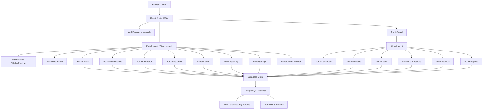
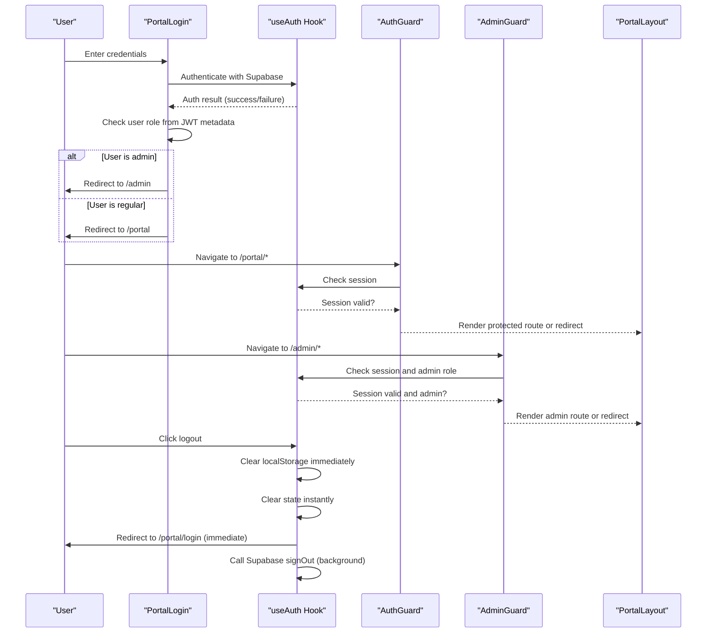
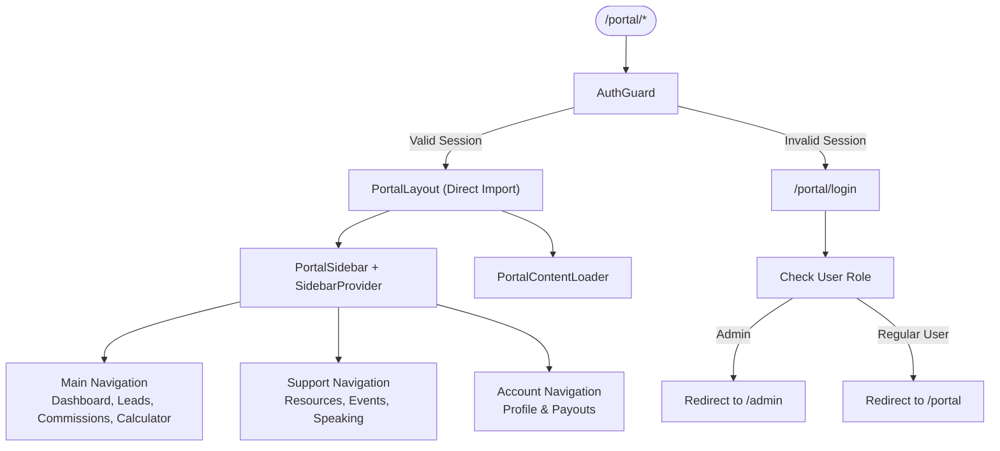
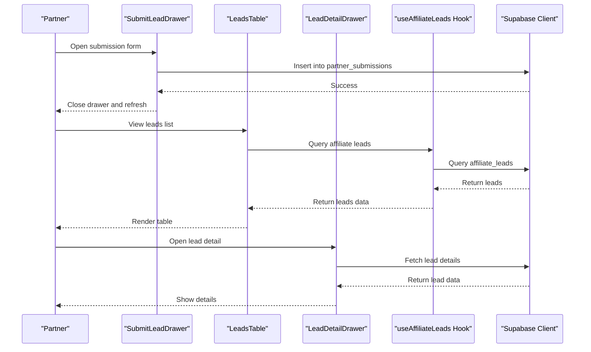
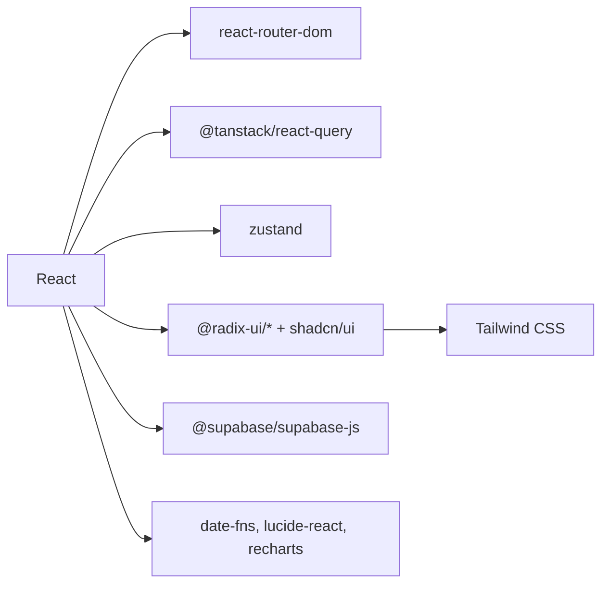

# Partner Portal System

<cite>
**Referenced Files in This Document**
- [README.md](file://README.md)
- [package.json](file://package.json)
- [App.tsx](file://src/App.tsx)
- [main.tsx](file://src/main.tsx)
- [plan.md](file://.lovable/plan.md)
- [PartnerSignupForm.tsx](file://src/components/PartnerSignupForm.tsx)
- [PortalLogin.tsx](file://src/pages/portal/PortalLogin.tsx)
- [AuthGuard.tsx](file://src/components/portal/AuthGuard.tsx)
- [PortalLayout.tsx](file://src/components/portal/PortalLayout.tsx)
- [PortalSidebar.tsx](file://src/components/portal/PortalSidebar.tsx)
- [PortalContentLoader.tsx](file://src/components/portal/PortalContentLoader.tsx)
- [LeadsTable.tsx](file://src/components/portal/LeadsTable.tsx)
- [LeadDetailDrawer.tsx](file://src/components/portal/LeadDetailDrawer.tsx)
- [SubmitLeadDrawer.tsx](file://src/components/portal/SubmitLeadDrawer.tsx)
- [PortalDashboard.tsx](file://src/pages/portal/PortalDashboard.tsx)
- [useAuth.tsx](file://src/hooks/useAuth.tsx)
- [useAffiliateLeads.ts](file://src/hooks/useAffiliateLeads.ts)
- [client.ts](file://src/integrations/supabase/client.ts)
- [types.ts](file://src/integrations/supabase/types.ts)
- [referralTracking.ts](file://src/lib/referralTracking.ts)
- [20260218185908_476bc8f8-75cd-4ec2-b0bf-216f9b5215cf.sql](file://supabase/migrations/20260218185908_476bc8f8-75cd-4ec2-b0bf-216f9b5215cf.sql)
- [20260319003239_bed3153f-8413-4f10-80d1-273b1c1bb805.sql](file://supabase/migrations/20260319003239_bed3153f-8413-4f10-80d1-273b1c1bb805.sql)
- [20260320000000_admin_policies.sql](file://supabase/migrations/20260320000000_admin_policies.sql)
- [20260324201245_4681ef67-2bf0-4686-a4b6-1ae6c54189f9.sql](file://supabase/migrations/20260324201245_4681ef67-2bf0-4686-a4b6-1ae6c54189f9.sql)
- [sidebar.tsx](file://src/components/ui/sidebar.tsx)
</cite>

## Update Summary
**Changes Made**
- Enhanced portal navigation with affiliate-specific naming conventions (affiliateMainNav, affiliateSupportNav, affiliateAccountNav)
- Implemented automatic role-based redirection in portal login system
- Improved admin role detection with dedicated AdminGuard component
- Enhanced sidebar navigation structure with categorized affiliate menu groups
- Added comprehensive role-based access control system with admin policies

## Table of Contents
1. [Introduction](#introduction)
2. [Project Structure](#project-structure)
3. [Core Components](#core-components)
4. [Architecture Overview](#architecture-overview)
5. [Detailed Component Analysis](#detailed-component-analysis)
6. [Dependency Analysis](#dependency-analysis)
7. [Performance Considerations](#performance-considerations)
8. [Security and Compliance](#security-and-compliance)
9. [Troubleshooting Guide](#troubleshooting-guide)
10. [Conclusion](#conclusion)

## Introduction
This document describes the Partner Portal System and Administrative Interface for the Ryland project. It explains the portal architecture including dashboard functionality, lead management, calculator tools, and commission tracking. It documents the authentication and authorization system, role-based access control, secure portal navigation, and implementation details for each portal feature. It also covers data visualization components, reporting capabilities, extension points, customization approaches, affiliate marketing integrations, and security considerations with data privacy and compliance requirements.

## Project Structure
The project is a React application using Vite, TypeScript, and Supabase for authentication and database operations. The portal routes are nested under `/portal` and protected by an authentication guard. Key areas include:
- Authentication and routing setup in the main application shell
- Partner onboarding and signup forms
- Portal layout, sidebar, and route-based views
- Lead capture and management components
- Supabase client integration and Row Level Security policies
- Admin interface with role-based access control

```mermaid
graph TB
subgraph "Application Shell"
MAIN["main.tsx"]
APP["App.tsx"]
END
subgraph "Routing"
ROUTER["React Router DOM"]
AUTH_PROVIDER["AuthProvider"]
QUERY_CLIENT["QueryClientProvider"]
END
subgraph "Public Pages"
PARTNERS["Partners.tsx"]
SIGNUP["PartnerSignupForm.tsx"]
END
subgraph "Portal"
PORTAL_LOGIN["PortalLogin.tsx"]
AUTH_GUARD["AuthGuard.tsx"]
PORTAL_LAYOUT["PortalLayout.tsx (Direct Import)"]
PORTAL_SIDEBAR["PortalSidebar.tsx"]
PORTAL_CONTENT_LOADER["PortalContentLoader.tsx"]
DASHBOARD["PortalDashboard.tsx"]
LEADS["PortalLeads.tsx"]
COMMISSIONS["PortalCommissions.tsx"]
CALCULATOR["PortalCalculator.tsx"]
RESOURCES["PortalResources.tsx"]
EVENTS["PortalEvents.tsx"]
SPEAKING["PortalSpeaking.tsx"]
SETTINGS["PortalSettings.tsx"]
END
subgraph "Admin Interface"
ADMIN_GUARD["AdminGuard.tsx"]
ADMIN_LAYOUT["AdminLayout.tsx"]
ADMIN_DASHBOARD["AdminDashboard.tsx"]
ADMIN_AFFILIATES["AdminAffiliates.tsx"]
ADMIN_LEADS["AdminLeads.tsx"]
ADMIN_COMMISSIONS["AdminCommissions.tsx"]
ADMIN_PAYOUTS["AdminPayouts.tsx"]
ADMIN_REPORTS["AdminReports.tsx"]
END
subgraph "Integrations"
SUPABASE_CLIENT["integrations/supabase/client.ts"]
SUPABASE_TYPES["integrations/supabase/types.ts"]
RLS_POLICY["partner_submissions RLS Policy"]
ADMIN_POLICIES["Admin RLS Policies"]
END
MAIN --> APP
APP --> ROUTER
APP --> AUTH_PROVIDER
APP --> QUERY_CLIENT
ROUTER --> PARTNERS
PARTNERS --> SIGNUP
ROUTER --> PORTAL_LOGIN
PORTAL_LOGIN --> AUTH_GUARD
AUTH_GUARD --> PORTAL_LAYOUT
PORTAL_LAYOUT --> PORTAL_SIDEBAR
PORTAL_LAYOUT --> PORTAL_CONTENT_LOADER
PORTAL_LAYOUT --> DASHBOARD
PORTAL_LAYOUT --> LEADS
PORTAL_LAYOUT --> COMMISSIONS
PORTAL_LAYOUT --> CALCULATOR
PORTAL_LAYOUT --> RESOURCES
PORTAL_LAYOUT --> EVENTS
PORTAL_LAYOUT --> SPEAKING
PORTAL_LAYOUT --> SETTINGS
PORTAL_LOGIN --> SUPABASE_CLIENT
AUTH_GUARD --> SUPABASE_CLIENT
LEADS --> SUPABASE_CLIENT
ADMIN_GUARD --> ADMIN_LAYOUT
ADMIN_LAYOUT --> ADMIN_DASHBOARD
ADMIN_LAYOUT --> ADMIN_AFFILIATES
ADMIN_LAYOUT --> ADMIN_LEADS
ADMIN_LAYOUT --> ADMIN_COMMISSIONS
ADMIN_LAYOUT --> ADMIN_PAYOUTS
ADMIN_LAYOUT --> ADMIN_REPORTS
SUPABASE_CLIENT --> RLS_POLICY
SUPABASE_CLIENT --> ADMIN_POLICIES
```

**Diagram sources**
- [main.tsx:1-7](file://src/main.tsx#L1-L7)
- [App.tsx:1-134](file://src/App.tsx#L1-L134)
- [PartnerSignupForm.tsx:102-128](file://src/components/PartnerSignupForm.tsx#L102-L128)
- [PortalLogin.tsx:123-139](file://src/pages/portal/PortalLogin.tsx#L123-L139)
- [AuthGuard.tsx](file://src/components/portal/AuthGuard.tsx)
- [PortalLayout.tsx:1-49](file://src/components/portal/PortalLayout.tsx#L1-L49)
- [PortalSidebar.tsx:1-134](file://src/components/portal/PortalSidebar.tsx#L1-L134)
- [PortalContentLoader.tsx:1-44](file://src/components/portal/PortalContentLoader.tsx#L1-L44)
- [client.ts](file://src/integrations/supabase/client.ts)
- [20260218185908_476bc8f8-75cd-4ec2-b0bf-216f9b5215cf.sql:1-18](file://supabase/migrations/20260218185908_476bc8f8-75cd-4ec2-b0bf-216f9b5215cf.sql#L1-L18)
- [20260320000000_admin_policies.sql:1-33](file://supabase/migrations/20260320000000_admin_policies.sql#L1-L33)
- [20260324201245_4681ef67-2bf0-4686-a4b6-1ae6c54189f9.sql:1-81](file://supabase/migrations/20260324201245_4681ef67-2bf0-4686-a4b6-1ae6c54189f9.sql#L1-L81)

**Section sources**
- [README.md:53-61](file://README.md#L53-L61)
- [package.json:15-69](file://package.json#L15-L69)
- [App.tsx:40-103](file://src/App.tsx#L40-L103)

## Core Components
- Authentication and Authorization
  - Supabase-based authentication with AuthProvider and useAuth hook
  - AuthGuard protects portal routes by checking session state
  - **Enhanced** Automatic role-based redirection in PortalLogin with admin detection
  - **New** AdminGuard component for comprehensive admin route protection
  - Passwordless login flow via reset-password mechanism
  - **Enhanced** Improved error handling with component unmounting detection for production reliability
  - **Enhanced** Faster logout responses with immediate localStorage cleanup and instant redirection
- Portal Layout and Navigation
  - **Enhanced** PortalLayout now uses direct import for improved performance and persistent sidebar state
  - **New** PortalContentLoader provides consistent loading skeletons for page transitions
  - **Enhanced** PortalSidebar integrated with shadcn/ui sidebar components featuring affiliate-specific naming
  - **Enhanced** SidebarProvider maintains state across route changes for seamless user experience
  - **Enhanced** Categorized navigation with affiliateMainNav, affiliateSupportNav, and affiliateAccountNav arrays
- Lead Management
  - LeadsTable displays lead records
  - SubmitLeadDrawer enables partners to submit new leads
  - LeadDetailDrawer shows detailed lead information
  - useAffiliateLeads hook for managing affiliate-specific leads
- Data Access and Security
  - Supabase client configured for database operations
  - Row Level Security policy on partner_submissions table allows anonymous inserts for lead submissions
  - **Enhanced** Comprehensive admin RLS policies for role-based data access
  - Enhanced affiliate data fetching with fallback mechanisms and improved error handling

**Section sources**
- [useAuth.tsx](file://src/hooks/useAuth.tsx)
- [useAffiliateLeads.ts](file://src/hooks/useAffiliateLeads.ts)
- [AuthGuard.tsx](file://src/components/portal/AuthGuard.tsx)
- [PortalLogin.tsx:33-42](file://src/pages/portal/PortalLogin.tsx#L33-L42)
- [AdminGuard.tsx:10-35](file://src/components/admin/AdminGuard.tsx#L10-L35)
- [PortalLayout.tsx:1-49](file://src/components/portal/PortalLayout.tsx#L1-L49)
- [PortalSidebar.tsx:21-36](file://src/components/portal/PortalSidebar.tsx#L21-L36)
- [PortalContentLoader.tsx:1-44](file://src/components/portal/PortalContentLoader.tsx#L1-L44)
- [LeadsTable.tsx](file://src/components/portal/LeadsTable.tsx)
- [SubmitLeadDrawer.tsx](file://src/components/portal/SubmitLeadDrawer.tsx)
- [LeadDetailDrawer.tsx](file://src/components/portal/LeadDetailDrawer.tsx)
- [client.ts](file://src/integrations/supabase/client.ts)
- [20260218185908_476bc8f8-75cd-4ec2-b0bf-216f9b5215cf.sql:1-18](file://supabase/migrations/20260218185908_476bc8f8-75cd-4ec2-b0bf-216f9b5215cf.sql#L1-L18)
- [20260320000000_admin_policies.sql:1-33](file://supabase/migrations/20260320000000_admin_policies.sql#L1-L33)
- [20260324201245_4681ef67-2bf0-4686-a4b6-1ae6c54189f9.sql:1-81](file://supabase/migrations/20260324201245_4681ef67-2bf0-4686-a4b6-1ae6c54189f9.sql#L1-L81)

## Architecture Overview
The portal follows a layered architecture with enhanced role-based access control:
- Presentation Layer: React components organized by feature (portal, admin, UI primitives, pages)
- Routing and Navigation: React Router DOM with nested routes under /portal and /admin
- Authentication and State: Supabase Auth with AuthProvider and useAuth hook
- Data Access: Supabase client with React Query for caching and optimistic updates
- Security: Supabase Row Level Security policies with comprehensive admin role management
- Role-Based Access Control: Dual protection system with AuthGuard for portal and AdminGuard for admin routes



**Diagram sources**
- [App.tsx:40-103](file://src/App.tsx#L40-L103)
- [useAuth.tsx](file://src/hooks/useAuth.tsx)
- [client.ts](file://src/integrations/supabase/client.ts)
- [types.ts](file://src/integrations/supabase/types.ts)
- [AdminGuard.tsx:10-35](file://src/components/admin/AdminGuard.tsx#L10-L35)

## Detailed Component Analysis

### Enhanced Authentication and Authorization System
- Provider Setup
  - AuthProvider wraps the app to manage authentication state
  - useAuth hook centralizes session checks and user data access
  - **Enhanced** Improved error handling with component unmounting detection to prevent memory leaks
- Login Flow
  - **Enhanced** PortalLogin now implements automatic role-based redirection
  - Checks user role from JWT token metadata and redirects to appropriate route
  - Administrators are redirected to /admin, regular users to /portal
  - Forgot password links initiate reset emails
- Route Protection
  - AuthGuard enforces session validation before rendering portal routes
  - **New** AdminGuard provides comprehensive admin route protection
  - AdminGuard checks both authentication and admin role status
- Supabase Integration
  - Supabase client initialized for auth and database operations
  - Types defined for type-safe database interactions
  - **Enhanced** Comprehensive admin RLS policies for role-based data access
  - Enhanced affiliate data fetching with improved error handling and component unmounting detection
- **Enhanced** Logout Optimization
  - **New** signOut function now performs immediate localStorage cleanup before any asynchronous operations
  - **New** Clears authentication state instantly to prevent flickering during navigation
  - **New** Redirects to login page immediately without waiting for Supabase response
  - **New** Calls Supabase signOut in background using fire-and-forget pattern to avoid blocking UI
  - **New** Prevents race conditions between local state cleanup and Supabase operations

**Updated** Enhanced authentication flow now provides automatic role-based redirection with faster logout responses and improved error handling for production environments through immediate localStorage cleanup, instant redirection, and background Supabase operations.



**Diagram sources**
- [PortalLogin.tsx:24-43](file://src/pages/portal/PortalLogin.tsx#L24-L43)
- [useAuth.tsx](file://src/hooks/useAuth.tsx)
- [AuthGuard.tsx](file://src/components/portal/AuthGuard.tsx)
- [AdminGuard.tsx:10-35](file://src/components/admin/AdminGuard.tsx)

**Section sources**
- [PortalLogin.tsx:24-43](file://src/pages/portal/PortalLogin.tsx#L24-L43)
- [useAuth.tsx](file://src/hooks/useAuth.tsx)
- [AuthGuard.tsx](file://src/components/portal/AuthGuard.tsx)
- [AdminGuard.tsx:10-35](file://src/components/admin/AdminGuard.tsx)
- [client.ts](file://src/integrations/supabase/client.ts)
- [types.ts](file://src/integrations/supabase/types.ts)
- [20260320000000_admin_policies.sql:1-33](file://supabase/migrations/20260320000000_admin_policies.sql#L1-L33)
- [20260324201245_4681ef67-2bf0-4686-a4b6-1ae6c54189f9.sql:1-81](file://supabase/migrations/20260324201245_4681ef67-2bf0-4686-a4b6-1ae6c54189f9.sql#L1-L81)

### Enhanced Portal Layout and Navigation
- **Enhanced** PortalLayout
  - **Changed** Converted from lazy loading to direct import for improved performance and persistent sidebar state
  - **New** Integrated Suspense-based loading system with PortalContentLoader fallback
  - **Enhanced** Uses SidebarProvider from shadcn/ui for persistent sidebar state across route changes
  - **Enhanced** Implements SidebarTrigger for responsive navigation controls
- **Enhanced** PortalSidebar
  - **Integrated** Uses shadcn/ui Sidebar components with persistent state management
  - **Enhanced** Maintains sidebar collapse/expand state across page transitions
  - **Enhanced** Provides responsive navigation with tooltip support for collapsed state
  - **Enhanced** Displays affiliate information and persistent navigation links
  - **Enhanced** **New** Categorized navigation structure with affiliateMainNav, affiliateSupportNav, and affiliateAccountNav arrays
  - **Enhanced** **New** Grouped navigation sections with proper labeling (Main, Support, Account)
- **New** PortalContentLoader
  - **New** Dedicated skeleton loader component for consistent loading states
  - **Enhanced** Provides realistic loading skeletons for dashboard, stats cards, and tables
  - **Enhanced** Used as fallback for Suspense boundary during page transitions

**Updated** The portal layout now provides a seamless user experience with persistent sidebar state, categorized navigation groups, and smooth page transitions through Suspense-based loading skeletons.



**Diagram sources**
- [App.tsx:94-103](file://src/App.tsx#L94-L103)
- [PortalLayout.tsx:1-49](file://src/components/portal/PortalLayout.tsx#L1-L49)
- [PortalSidebar.tsx:21-36](file://src/components/portal/PortalSidebar.tsx#L21-L36)
- [PortalContentLoader.tsx:1-44](file://src/components/portal/PortalContentLoader.tsx#L1-L44)
- [AuthGuard.tsx](file://src/components/portal/AuthGuard.tsx)
- [PortalLogin.tsx:33-42](file://src/pages/portal/PortalLogin.tsx#L33-L42)

**Section sources**
- [App.tsx:94-103](file://src/App.tsx#L94-L103)
- [PortalLayout.tsx:1-49](file://src/components/portal/PortalLayout.tsx#L1-L49)
- [PortalSidebar.tsx:21-36](file://src/components/portal/PortalSidebar.tsx#L21-L36)
- [PortalSidebar.tsx:110-114](file://src/components/portal/PortalSidebar.tsx#L110-L114)
- [PortalContentLoader.tsx:1-44](file://src/components/portal/PortalContentLoader.tsx#L1-L44)

### Enhanced Dashboard Functionality
- KPI Cards and Referral Link
  - Dashboard presents key metrics and partner referral link
  - **Enhanced** Fallback mechanism now uses user ID directly when affiliate data is unavailable
  - Integrates with affiliate marketing systems via referral tracking utilities
- Data Visualization
  - Recharts-based charts for trends and analytics
  - Customizable widgets for quick insights
- Reporting Capabilities
  - Exportable reports for leads and earnings
  - Filtering by date range and lead source
- **New** Reliability Improvements
  - Dashboard now includes a fallback mechanism that uses user ID directly when affiliate data is unavailable
  - Ensures functionality during database connectivity issues
  - Improved affiliate data fetching with better error handling and component unmounting detection

**Updated** The dashboard now provides enhanced reliability by falling back to user ID when affiliate data is unavailable, ensuring continuous functionality even during database connectivity issues.

**Section sources**
- [PortalDashboard.tsx:14-28](file://src/pages/portal/PortalDashboard.tsx#L14-L28)
- [PortalDashboard.tsx:30-53](file://src/pages/portal/PortalDashboard.tsx#L30-L53)
- [plan.md:18-38](file://.lovable/plan.md#L18-L38)
- [client.ts](file://src/integrations/supabase/client.ts)
- [types.ts](file://src/integrations/supabase/types.ts)

### Commission Tracking
- Earnings Table
  - Lists commission records with status, amount, and dates
- Calculation Logic
  - Configurable commission rates per lead type
  - Automatic calculation upon lead conversion
- Payout Management
  - Integration points for payout processing and tax documents

**Section sources**
- [PortalCommissions.tsx:16-30](file://src/pages/portal/PortalCommissions.tsx#L16-L30)
- [plan.md:18-38](file://.lovable/plan.md#L18-L38)
- [client.ts](file://src/integrations/supabase/client.ts)
- [types.ts](file://src/integrations/supabase/types.ts)

### Calculator Tools
- Placeholder Implementation
  - Calculator route exists for future financial modeling tools
- Extension Points
  - Integrate with external APIs or internal calculation engines
  - Persist calculations and shareable results

**Section sources**
- [App.tsx:98](file://src/App.tsx#L98)
- [plan.md:33](file://.lovable/plan.md#L33)

### Lead Management System
- Data Model
  - partner_submissions table captures lead entries with timestamps and metadata
  - RLS policy permits anonymous inserts for lead capture
  - **Enhanced** affiliate_leads table with comprehensive lead tracking
- UI Components
  - LeadsTable lists leads with filtering and sorting
  - SubmitLeadDrawer enables partners to add new leads
  - LeadDetailDrawer shows detailed lead information
  - **New** useAffiliateLeads hook for managing affiliate-specific leads
- Data Flow
  - Components query and mutate data via Supabase client
  - React Query manages caching and optimistic updates
  - **Enhanced** Improved error handling and component lifecycle management

**Updated** Enhanced lead management system with improved error handling and component lifecycle management for better reliability.



**Diagram sources**
- [LeadsTable.tsx](file://src/components/portal/LeadsTable.tsx)
- [SubmitLeadDrawer.tsx](file://src/components/portal/SubmitLeadDrawer.tsx)
- [LeadDetailDrawer.tsx](file://src/components/portal/LeadDetailDrawer.tsx)
- [useAffiliateLeads.ts](file://src/hooks/useAffiliateLeads.ts)
- [client.ts](file://src/integrations/supabase/client.ts)
- [20260218185908_476bc8f8-75cd-4ec2-b0bf-216f9b5215cf.sql:1-18](file://supabase/migrations/20260218185908_476bc8f8-75cd-4ec2-b0bf-216f9b5215cf.sql#L1-L18)

**Section sources**
- [LeadsTable.tsx](file://src/components/portal/LeadsTable.tsx)
- [SubmitLeadDrawer.tsx](file://src/components/portal/SubmitLeadDrawer.tsx)
- [LeadDetailDrawer.tsx](file://src/components/portal/LeadDetailDrawer.tsx)
- [useAffiliateLeads.ts](file://src/hooks/useAffiliateLeads.ts)
- [client.ts](file://src/integrations/supabase/client.ts)
- [20260218185908_476bc8f8-75cd-4ec2-b0bf-216f9b5215cf.sql:1-18](file://supabase/migrations/20260218185908_476bc8f8-75cd-4ec2-b0bf-216f9b5215cf.sql#L1-L18)

### Administrative Interface
- **Enhanced** Role-Based Access Control
  - **New** AdminGuard component provides comprehensive admin route protection
  - **New** useAdminRole hook for checking admin permissions
  - Supabase-based roles and permissions with dedicated admin policies
  - Admin-only routes and actions with proper authorization
- **Enhanced** Admin RLS Policies
  - Comprehensive row-level security policies for admin access
  - Admins can view and manage all affiliate data
  - Admins have full access to leads, commissions, payouts, and reports
- Audit Logging
  - Track partner actions and system changes
  - Admin activity monitoring and reporting
- Bulk Operations
  - Mass lead updates and commission adjustments
  - Admin user management and role assignments

**Updated** Enhanced administrative interface with comprehensive role-based access control, dedicated admin guards, and extensive RLS policies for secure admin operations.

**Section sources**
- [AdminGuard.tsx:10-35](file://src/components/admin/AdminGuard.tsx#L10-L35)
- [client.ts](file://src/integrations/supabase/client.ts)
- [types.ts](file://src/integrations/supabase/types.ts)
- [20260320000000_admin_policies.sql:1-33](file://supabase/migrations/20260320000000_admin_policies.sql#L1-L33)
- [20260324201245_4681ef67-2bf0-4686-a4b6-1ae6c54189f9.sql:1-81](file://supabase/migrations/20260324201245_4681ef67-2bf0-4686-a4b6-1ae6c54189f9.sql#L1-L81)

## Dependency Analysis
Key dependencies supporting the portal:
- React ecosystem: React, React Router DOM, Framer Motion, Zustand
- UI primitives: shadcn/ui components, Tailwind CSS
- Data and state: @tanstack/react-query, zustand
- Authentication and database: @supabase/supabase-js
- Utilities: date-fns, lucide-react, recharts



**Diagram sources**
- [package.json:15-69](file://package.json#L15-L69)

**Section sources**
- [package.json:15-69](file://package.json#L15-L69)

## Performance Considerations
- Client-Side Rendering
  - **Enhanced** PortalLayout now uses direct import instead of lazy loading for improved performance and persistent sidebar state
  - **Enhanced** Suspense-based loading system provides seamless transitions between pages
  - **New** PortalContentLoader component optimizes loading performance with consistent skeleton states
  - **Enhanced** Faster logout responses reduce perceived latency and improve user experience
  - **Enhanced** Role-based redirection eliminates redundant authentication checks
- Data Fetching
  - Configure React Query cache policies for optimal freshness vs. performance
  - Use background refetching for frequently changing metrics
  - **Enhanced** Improved error handling prevents unnecessary retries and memory leaks
  - **Enhanced** Component unmounting detection prevents memory leaks during network failures
- UI Responsiveness
  - Defer non-critical computations to Web Workers if needed
  - Optimize charts and tables with virtualization for large datasets
  - **Enhanced** Persistent sidebar state maintained across route changes without performance degradation
  - **Enhanced** Categorized navigation groups improve cognitive load and navigation speed
- Network Efficiency
  - Batch requests where possible
  - Implement retry and exponential backoff for transient failures
  - **Enhanced** Component unmounting detection prevents memory leaks during network failures
  - **Enhanced** Immediate localStorage cleanup during logout prevents race conditions
  - **Enhanced** Role-based redirection reduces unnecessary API calls for unauthorized users

**Updated** Enhanced performance considerations now include improved error handling, component lifecycle management, optimized loading states, faster logout responses, and efficient role-based redirection for better user experience.

## Security and Compliance
- Authentication and Authorization
  - Passwordless login reduces credential risks
  - AuthGuard ensures only authenticated users access portal routes
  - **Enhanced** AdminGuard provides comprehensive admin route protection
  - Supabase RLS policies restrict data access
  - **Enhanced** Comprehensive admin RLS policies for role-based data access
  - **Enhanced** Improved error handling prevents sensitive data exposure during failures
  - **Enhanced** Faster logout responses reduce session exposure windows
- Data Privacy
  - Minimize data collection to what is necessary for affiliate tracking
  - Implement data retention policies and secure deletion procedures
  - **Enhanced** Fallback mechanisms ensure functionality without compromising security
  - **Enhanced** Role-based data access limits information exposure
- Compliance
  - GDPR: Right to erasure, data portability, and consent management
  - Tax Compliance: W-9 and 1099-MISC generation for payouts
  - PCI-DSS: Avoid storing sensitive payment data; use third-party processors
  - **Enhanced** Admin RLS policies ensure proper audit trails for admin actions
- Secure Navigation
  - Enforce HTTPS and secure cookies
  - Implement CSRF protection for forms
  - Sanitize user inputs and escape outputs
  - **Enhanced** Role-based navigation prevents unauthorized route access

**Updated** Enhanced security measures now include comprehensive admin role detection, dedicated admin guards, extensive RLS policies, improved error handling, faster logout responses, and role-based navigation that prevents unauthorized access.

**Section sources**
- [AuthGuard.tsx](file://src/components/portal/AuthGuard.tsx)
- [AdminGuard.tsx:10-35](file://src/components/admin/AdminGuard.tsx#L10-L35)
- [client.ts](file://src/integrations/supabase/client.ts)
- [20260218185908_476bc8f8-75cd-4ec2-b0bf-216f9b5215cf.sql:13-18](file://supabase/migrations/20260218185908_476bc8f8-75cd-4ec2-b0bf-216f9b5215cf.sql#L13-L18)
- [20260320000000_admin_policies.sql:1-33](file://supabase/migrations/20260320000000_admin_policies.sql#L1-L33)
- [20260324201245_4681ef67-2bf0-4686-a4b6-1ae6c54189f9.sql:1-81](file://supabase/migrations/20260324201245_4681ef67-2bf0-4686-a4b6-1ae6c54189f9.sql#L1-L81)

## Troubleshooting Guide
- Login Issues
  - Verify passwordless reset email delivery
  - Check AuthGuard session state and redirect logic
  - **Enhanced** Verify role-based redirection in PortalLogin
  - **New** Check admin user metadata for proper role assignment
- Route Access Problems
  - Confirm nested route definitions under /portal and /admin
  - Ensure PortalLayout wraps child routes
  - **New** Verify AdminGuard is properly protecting admin routes
- **Enhanced** Navigation Issues
  - **New** Verify PortalSidebar uses affiliateMainNav, affiliateSupportNav, and affiliateAccountNav arrays
  - **New** Check that navigation groups are properly labeled (Main, Support, Account)
  - **New** Verify SidebarProvider maintains state across route changes
  - **New** Ensure PortalContentLoader is properly integrated with Suspense
- **Enhanced** Authentication Issues
  - **New** Verify signOut function performs immediate localStorage cleanup
  - **New** Check that logout redirects immediately without waiting for Supabase
  - **New** Monitor for component unmounting errors during authentication flows
  - **New** Verify AdminGuard properly checks both authentication and admin role
- Data Not Loading
  - Validate Supabase client initialization and connection
  - Check RLS policies for required permissions
  - **Enhanced** Monitor for component unmounting errors during network failures
  - **Enhanced** Verify admin RLS policies allow proper data access
- Lead Submission Failures
  - Inspect insert mutations and error handling
  - Review RLS policy for anonymous inserts
  - **New** Check affiliate data availability for lead submission
  - **New** Verify role-based access to lead management features
- **New** Dashboard Reliability Issues
  - Verify fallback mechanism is using user ID correctly
  - Monitor error logs for affiliate data fetching failures
  - Check component unmounting detection in useAuth hook
  - **New** Verify admin dashboard access with proper role checks
- **New** Loading State Issues
  - **New** Verify PortalContentLoader is properly configured as Suspense fallback
  - **New** Check that PortalLayout wraps Outlet with Suspense boundary
- **New** Logout Performance Issues
  - **New** Verify immediate localStorage cleanup occurs before navigation
  - **New** Check that Supabase signOut is called in background without blocking UI
- **New** Admin Access Issues
  - **New** Verify admin user metadata contains proper role assignment
  - **New** Check AdminGuard component for role verification logic
  - **New** Verify admin RLS policies are properly configured in database

**Updated** Added troubleshooting guidance for enhanced portal navigation features, loading states, authentication improvements, faster logout responses, role-based redirection, and comprehensive admin access control.

**Section sources**
- [PortalLogin.tsx:24-43](file://src/pages/portal/PortalLogin.tsx#L24-L43)
- [App.tsx:94-103](file://src/App.tsx#L94-L103)
- [client.ts](file://src/integrations/supabase/client.ts)
- [20260218185908_476bc8f8-75cd-4ec2-b0bf-216f9b5215cf.sql:13-18](file://supabase/migrations/20260218185908_476bc8f8-75cd-4ec2-b0bf-216f9b5215cf.sql#L13-L18)
- [AdminGuard.tsx:10-35](file://src/components/admin/AdminGuard.tsx#L10-L35)
- [20260320000000_admin_policies.sql:1-33](file://supabase/migrations/20260320000000_admin_policies.sql#L1-L33)
- [20260324201245_4681ef67-2bf0-4686-a4b6-1ae6c54189f9.sql:1-81](file://supabase/migrations/20260324201245_4681ef67-2bf0-4686-a4b6-1ae6c54189f9.sql#L1-L81)

## Conclusion
The Partner Portal System leverages a modern React stack with Supabase for authentication and data persistence. Its architecture supports secure, scalable partner experiences with dashboard insights, lead management, and commission tracking. The modular component design and clear separation of concerns enable easy extension and customization.

**Recent Enhancements** The system now includes significant improvements in navigation, authentication, role-based access control, and user experience:
- **Persistent Navigation**: PortalLayout uses direct import and SidebarProvider for seamless sidebar state maintenance
- **Enhanced Loading Experience**: Suspense-based system with PortalContentLoader provides smooth page transitions
- **Improved Performance**: Direct imports eliminate lazy loading overhead while maintaining responsive navigation
- **Better User Feedback**: Enhanced loading states and error handling improve overall user experience
- **Enhanced Authentication Flow**: Faster logout responses with immediate localStorage cleanup and instant redirection
- **Improved Error Handling**: Component unmounting detection prevents memory leaks and improves production reliability
- **Optimized Session Management**: Better localStorage session restoration with enhanced error handling
- **Enhanced Role-Based Access Control**: Automatic role-based redirection and comprehensive admin guards
- **Categorized Navigation**: Affiliate-specific naming conventions with organized navigation groups
- **Comprehensive Admin Security**: Extensive RLS policies and admin-only access controls

These enhancements ensure a more responsive and reliable partner portal experience while maintaining security and performance standards. The system continues to provide a robust foundation for affiliate marketing integrations and reporting with improved navigation, authentication, role-based access control, and comprehensive admin capabilities.