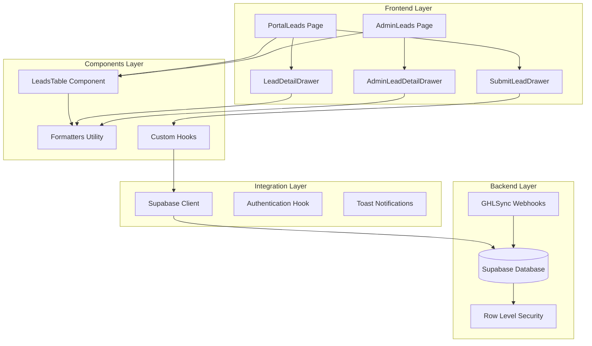
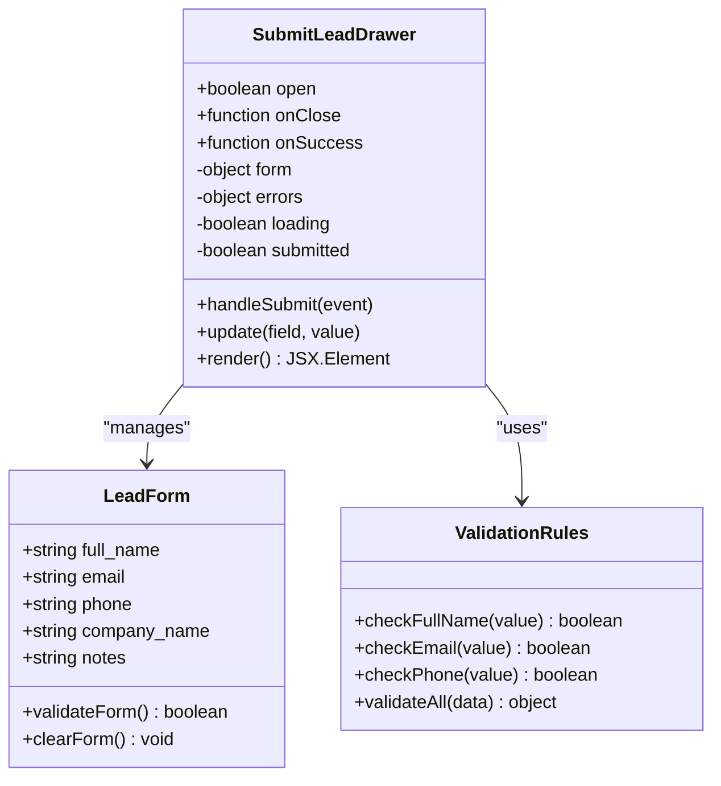
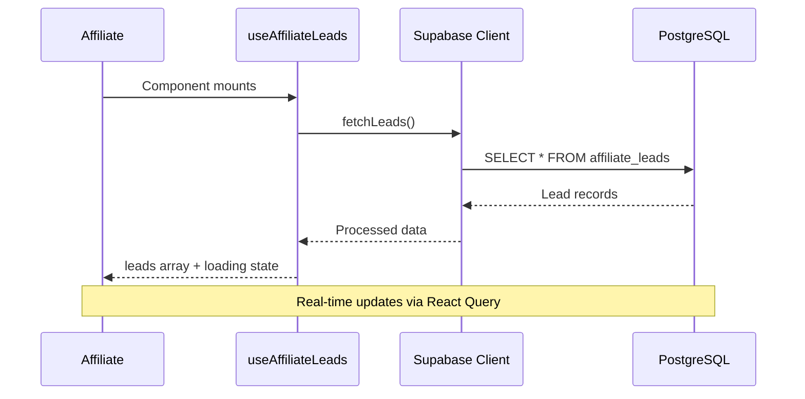
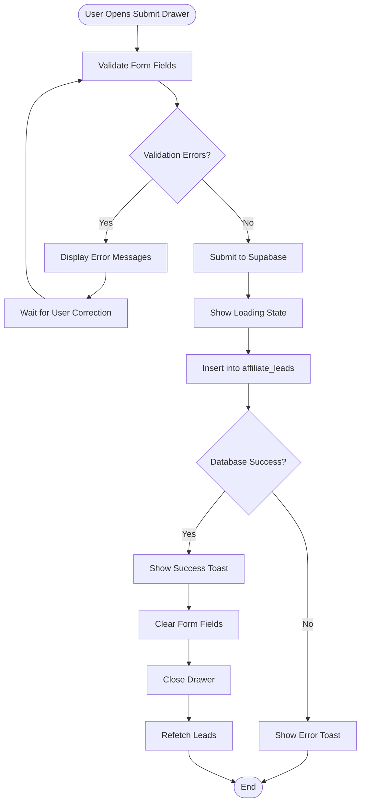
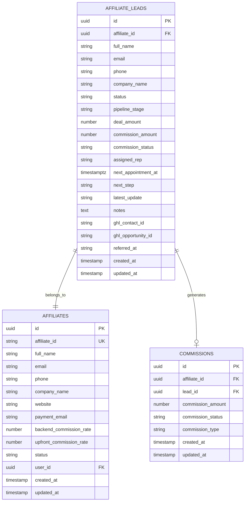
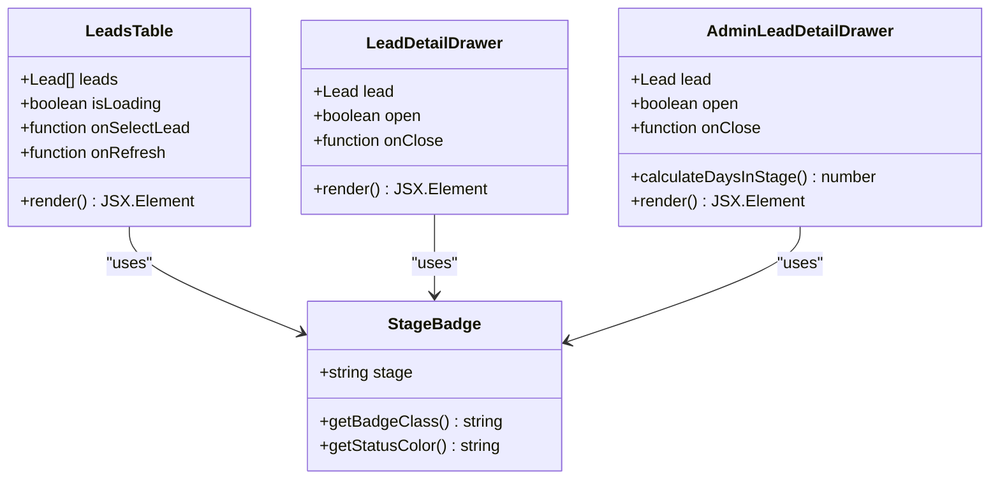
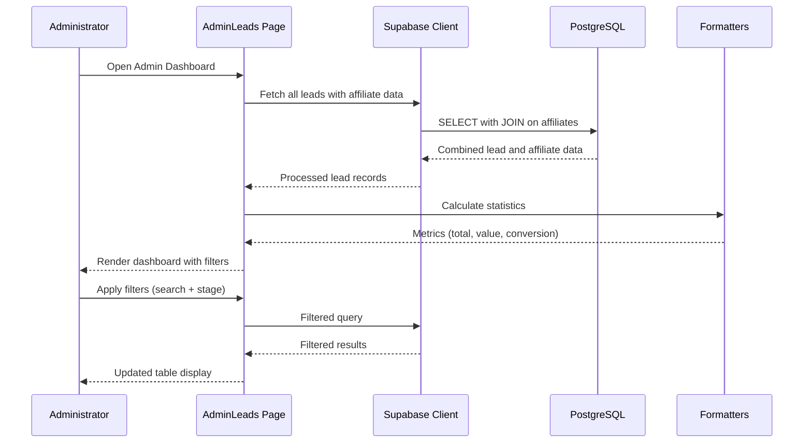
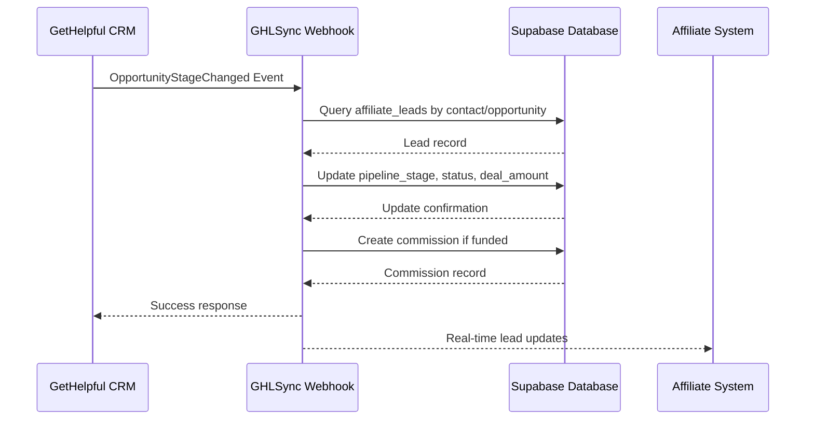
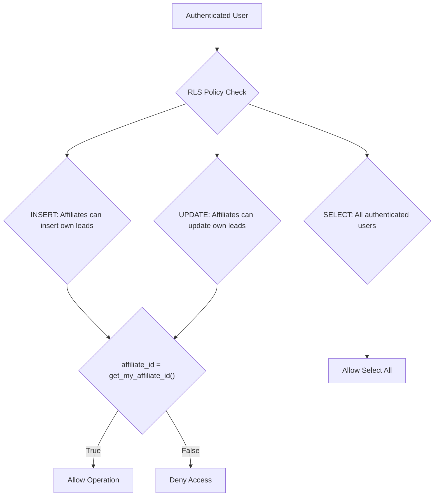

# Lead Submission Enhancements

<cite>
**Referenced Files in This Document**
- [SubmitLeadDrawer.tsx](file://src/components/portal/SubmitLeadDrawer.tsx)
- [leads.ts](file://src/types/leads.ts)
- [useAffiliateLeads.ts](file://src/hooks/useAffiliateLeads.ts)
- [AdminLeads.tsx](file://src/pages/admin/AdminLeads.tsx)
- [PortalLeads.tsx](file://src/pages/portal/PortalLeads.tsx)
- [LeadsTable.tsx](file://src/components/portal/LeadsTable.tsx)
- [LeadDetailDrawer.tsx](file://src/components/portal/LeadDetailDrawer.tsx)
- [AdminLeadDetailDrawer.tsx](file://src/components/admin/AdminLeadDetailDrawer.tsx)
- [client.ts](file://src/integrations/supabase/client.ts)
- [types.ts](file://src/integrations/supabase/types.ts)
- [formatters.ts](file://src/utils/formatters.ts)
- [20260319010259_635fecdc-5214-464e-93b5-b88f56743424.sql](file://supabase/migrations/20260319010259_635fecdc-5214-464e-93b5-b88f56743424.sql)
- [20260319185554_6f53c4fa-7f98-496d-afe9-1bf39f92ae3a.sql](file://supabase/migrations/20260319185554_6f53c4fa-7f98-496d-afe9-1bf39f92ae3a.sql)
- [20260319194628_4e5f50a6-8cb3-40d1-b56d-a5bacde2a132.sql](file://supabase/migrations/20260319194628_4e5f50a6-8cb3-40d1-b56d-a5bacde2a132.sql)
- [index.ts](file://supabase/functions/ghl-affiliate-webhook/index.ts)
</cite>

## Table of Contents
1. [Introduction](#introduction)
2. [System Architecture](#system-architecture)
3. [Core Components](#core-components)
4. [Lead Submission Workflow](#lead-submission-workflow)
5. [Data Model and Types](#data-model-and-types)
6. [Enhanced Features](#enhanced-features)
7. [Admin Dashboard](#admin-dashboard)
8. [Integration Points](#integration-points)
9. [Security and Access Control](#security-and-access-control)
10. [Performance Considerations](#performance-considerations)
11. [Troubleshooting Guide](#troubleshooting-guide)
12. [Conclusion](#conclusion)

## Introduction

The Lead Submission Enhancements system represents a comprehensive solution for managing affiliate-driven lead generation and tracking within the Ryland platform. This system enables affiliates to submit business owner referrals while providing administrators with powerful tools to monitor, manage, and optimize the entire lead lifecycle from initial submission to final funding.

The enhancement introduces a sophisticated lead management ecosystem that integrates seamlessly with the existing affiliate program, providing real-time tracking capabilities, automated commission calculations, and comprehensive reporting features. The system supports both manual lead submissions and automated webhooks from third-party CRM systems, ensuring flexibility and scalability for various business scenarios.

## System Architecture

The lead submission system follows a modern React-based architecture with TypeScript type safety and integrates with Supabase for database operations and authentication. The system is designed with clear separation of concerns, separating frontend components, backend functions, and database schemas.

**Diagram sources**
- [PortalLeads.tsx:12-61](file://src/pages/portal/PortalLeads.tsx#L12-L61)
- [AdminLeads.tsx:77-416](file://src/pages/admin/AdminLeads.tsx#L77-L416)
- [SubmitLeadDrawer.tsx:18-119](file://src/components/portal/SubmitLeadDrawer.tsx#L18-L119)

## Core Components

### Lead Submission Interface

The primary interface for lead submission is the `SubmitLeadDrawer` component, which provides a comprehensive form for affiliates to enter lead information. The component implements real-time validation, loading states, and error handling to ensure a smooth user experience.

**Diagram sources**
- [SubmitLeadDrawer.tsx:12-119](file://src/components/portal/SubmitLeadDrawer.tsx#L12-L119)

**Section sources**
- [SubmitLeadDrawer.tsx:18-119](file://src/components/portal/SubmitLeadDrawer.tsx#L18-L119)

### Lead Data Management

The system utilizes a centralized `useAffiliateLeads` hook that leverages React Query for efficient data fetching, caching, and synchronization. This hook provides automatic refetching capabilities and handles loading states gracefully.

**Diagram sources**
- [useAffiliateLeads.ts:6-31](file://src/hooks/useAffiliateLeads.ts#L6-L31)

**Section sources**
- [useAffiliateLeads.ts:6-31](file://src/hooks/useAffiliateLeads.ts#L6-L31)

## Lead Submission Workflow

The lead submission process follows a structured workflow that ensures data integrity and provides immediate feedback to users.

**Diagram sources**
- [SubmitLeadDrawer.tsx:38-77](file://src/components/portal/SubmitLeadDrawer.tsx#L38-L77)

### Form Validation Logic

The validation system implements comprehensive field checking with real-time feedback:

- **Required Fields**: Full name and email are mandatory
- **Email Validation**: Regex pattern ensures proper email format
- **Real-time Validation**: Field-specific validation triggers on change
- **Error State Management**: Individual field error tracking and clearing

**Section sources**
- [SubmitLeadDrawer.tsx:26-52](file://src/components/portal/SubmitLeadDrawer.tsx#L26-L52)

## Data Model and Types

The lead data model extends beyond basic contact information to support comprehensive pipeline tracking and commission management.

**Diagram sources**
- [types.ts:17-96](file://src/integrations/supabase/types.ts#L17-L96)
- [leads.ts:1-43](file://src/types/leads.ts#L1-L43)

### Enhanced Database Schema

Recent schema enhancements expand the lead tracking capabilities:

- **Company Information**: Added company_name field for business context
- **Commission Tracking**: Integrated commission_amount and commission_status fields
- **Assignment Management**: Support for assigned_rep field linking leads to representatives
- **Activity Tracking**: Next appointment scheduling and action tracking
- **Update History**: Latest_update field for activity logging

**Section sources**
- [20260319010259_635fecdc-5214-464e-93b5-b88f56743424.sql:1-8](file://supabase/migrations/20260319010259_635fecdc-5214-464e-93b5-b88f56743424.sql#L1-L8)

## Enhanced Features

### Comprehensive Lead Tracking

The system provides extensive lead tracking capabilities through dedicated components and utilities:

**Diagram sources**
- [LeadsTable.tsx:31-107](file://src/components/portal/LeadsTable.tsx#L31-L107)
- [LeadDetailDrawer.tsx:37-101](file://src/components/portal/LeadDetailDrawer.tsx#L37-L101)
- [AdminLeadDetailDrawer.tsx:43-134](file://src/components/admin/AdminLeadDetailDrawer.tsx#L43-L134)

### Advanced Filtering and Search

The admin interface provides sophisticated filtering capabilities:

- **Multi-field Search**: Search across name, email, and affiliate name
- **Stage-based Filtering**: Filter by pipeline stage with dropdown selection
- **Real-time Results**: Instant filtering as users type or change selections
- **Statistics Dashboard**: Real-time metrics including total leads, pipeline value, and conversion rates

**Section sources**
- [AdminLeads.tsx:77-416](file://src/pages/admin/AdminLeads.tsx#L77-L416)

## Admin Dashboard

The administrative interface offers comprehensive oversight of the entire lead management system.

**Diagram sources**
- [AdminLeads.tsx:94-179](file://src/pages/admin/AdminLeads.tsx#L94-L179)

### Administrative Capabilities

Administrators gain access to advanced features:

- **Lead Modification**: Edit lead information and pipeline stages
- **Communication Tools**: Direct email and phone access from lead records
- **Integration Links**: Connect to external systems like GHL (GetHelpful)
- **Bulk Operations**: Manage multiple leads simultaneously
- **Audit Trail**: Complete history of lead activities and updates

**Section sources**
- [AdminLeads.tsx:354-396](file://src/pages/admin/AdminLeads.tsx#L354-L396)

## Integration Points

### Third-party CRM Integration

The system supports seamless integration with external CRM systems through webhook processing:

**Diagram sources**
- [index.ts:74-129](file://supabase/functions/ghl-affiliate-webhook/index.ts#L74-L129)

### Automated Commission Processing

The webhook system automatically calculates and creates commission records when deals reach specific milestones:

- **Funding Detection**: Monitors for "Funded" pipeline stage or "won" status
- **Commission Calculation**: Applies predefined commission rates (currently 5%)
- **Automated Creation**: Creates commission records linked to affiliate and lead
- **Status Tracking**: Sets commission status to "pending" for processing

**Section sources**
- [index.ts:112-126](file://supabase/functions/ghl-affiliate-webhook/index.ts#L112-L126)

## Security and Access Control

The system implements robust security measures through Supabase's Row Level Security policies:

**Diagram sources**
- [20260319185554_6f53c4fa-7f98-496d-afe9-1bf39f92ae3a.sql:2-5](file://supabase/migrations/20260319185554_6f53c4fa-7f98-496d-afe9-1bf39f92ae3a.sql#L2-L5)
- [20260319194628_4e5f50a6-8cb3-40d1-b56d-a5bacde2a132.sql:1-5](file://supabase/migrations/20260319194628_4e5f50a6-8cb3-40d1-b56d-a5bacde2a132.sql#L1-L5)

### Security Features

- **Row Level Security**: Prevents users from accessing other affiliates' leads
- **Authentication Integration**: Leverages Supabase Auth for secure user sessions
- **Policy Enforcement**: Automatic enforcement of access controls at database level
- **Audit Logging**: Comprehensive tracking of all lead-related operations

**Section sources**
- [20260319185554_6f53c4fa-7f98-496d-afe9-1bf39f92ae3a.sql:2-5](file://supabase/migrations/20260319185554_6f53c4fa-7f98-496d-afe9-1bf39f92ae3a.sql#L2-L5)

## Performance Considerations

### Optimized Data Fetching

The system implements several performance optimizations:

- **React Query Caching**: Efficient caching of lead data with automatic refetching
- **Selective Loading**: Skeleton loaders for improved perceived performance
- **Memoization**: Optimized rendering through React.memo usage
- **Database Indexing**: Strategic indexing on frequently queried fields

### Scalability Features

- **Pagination Support**: Ready for pagination as lead volumes grow
- **Query Optimization**: Efficient database queries with selective field retrieval
- **Real-time Updates**: WebSocket connections for instant data synchronization
- **Caching Strategy**: Intelligent caching of static data like stage colors

**Section sources**
- [LeadsTable.tsx:32-40](file://src/components/portal/LeadsTable.tsx#L32-L40)
- [useAffiliateLeads.ts:14-27](file://src/hooks/useAffiliateLeads.ts#L14-L27)

## Troubleshooting Guide

### Common Issues and Solutions

**Lead Submission Failures**
- Verify affiliate authentication status
- Check network connectivity to Supabase
- Review browser console for JavaScript errors
- Confirm email format validation requirements

**Data Synchronization Issues**
- Monitor webhook endpoint health
- Verify database connection credentials
- Check row level security policy compliance
- Review Supabase logs for operation errors

**Performance Problems**
- Clear browser cache and reload page
- Check React Query cache status
- Monitor database query performance
- Verify component re-render optimization

### Debugging Tools

The system provides comprehensive debugging capabilities:

- **Toast Notifications**: Immediate feedback for all operations
- **Console Logging**: Detailed error messages in browser console
- **Database Auditing**: Complete audit trail of all lead operations
- **Real-time Monitoring**: Live updates of lead status changes

**Section sources**
- [SubmitLeadDrawer.tsx:67-76](file://src/components/portal/SubmitLeadDrawer.tsx#L67-L76)
- [AdminLeads.tsx:174-178](file://src/pages/admin/AdminLeads.tsx#L174-L178)

## Conclusion

The Lead Submission Enhancements system represents a comprehensive solution for modern affiliate lead management. Through its sophisticated architecture, robust security measures, and comprehensive feature set, the system provides both affiliates and administrators with powerful tools to optimize their lead generation and conversion processes.

Key strengths of the system include its real-time synchronization capabilities, comprehensive tracking features, automated commission processing, and flexible integration options. The modular design ensures maintainability and extensibility, while the security-first approach protects sensitive lead data and affiliate relationships.

Future enhancements could include expanded CRM integrations, advanced analytics dashboards, automated follow-up workflows, and mobile-optimized interfaces. The solid foundation established by this implementation provides an excellent base for continued evolution and growth.