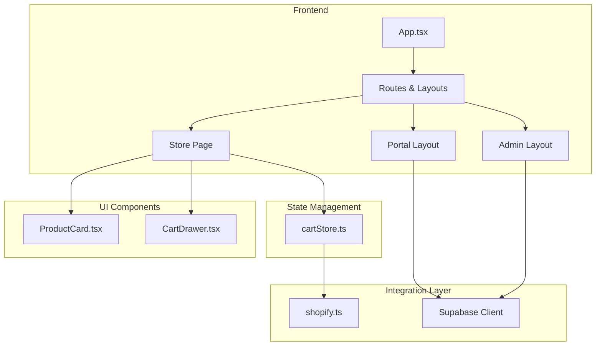
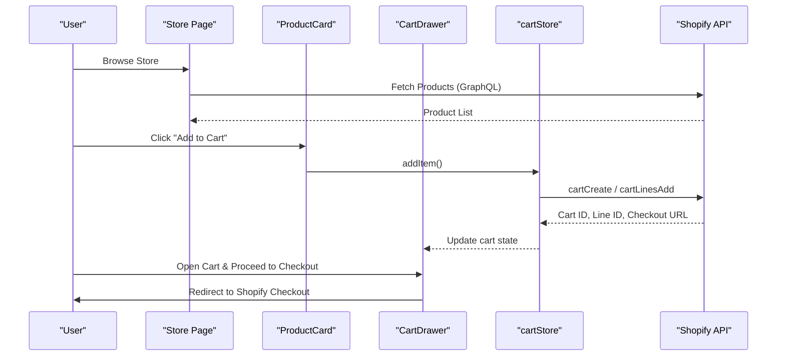
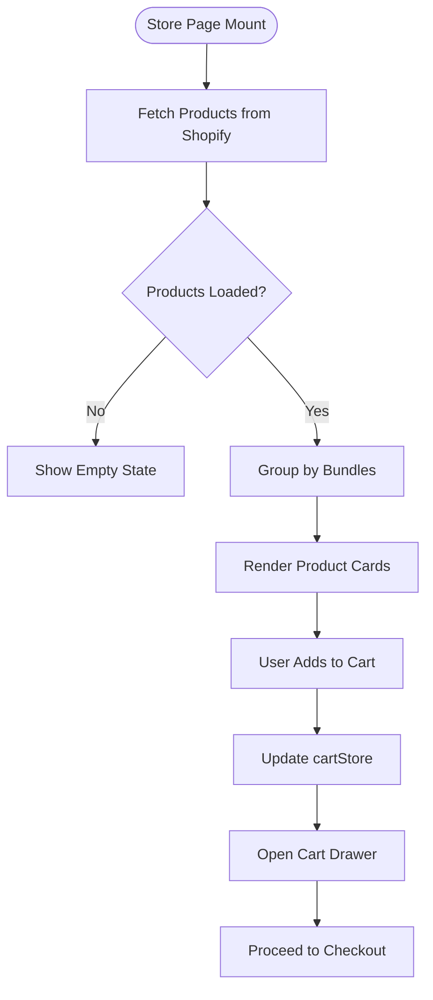
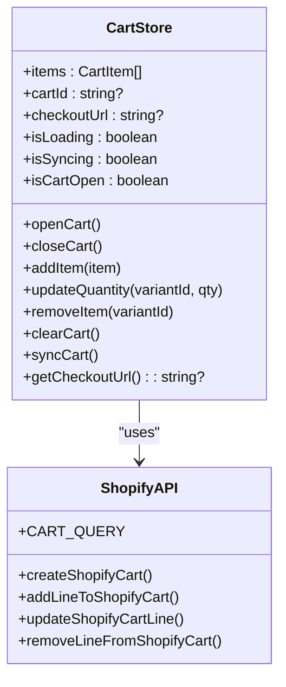
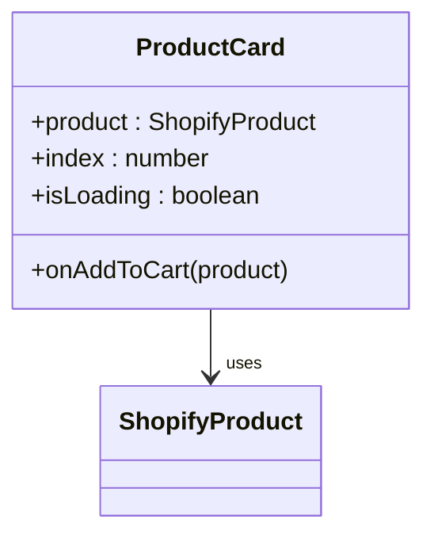
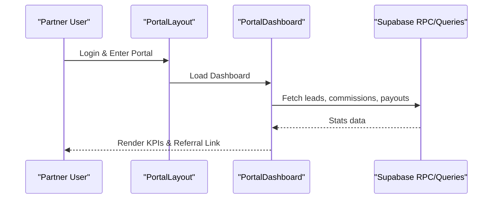
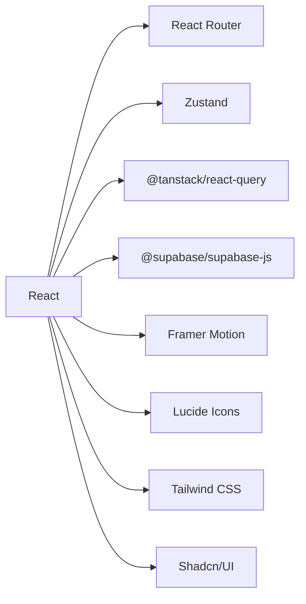

# Partner Store System

<cite>
**Referenced Files in This Document**
- [README.md](file://README.md)
- [package.json](file://package.json)
- [src/App.tsx](file://src/App.tsx)
- [src/main.tsx](file://src/main.tsx)
- [src/pages/Store.tsx](file://src/pages/Store.tsx)
- [src/stores/cartStore.ts](file://src/stores/cartStore.ts)
- [src/lib/shopify.ts](file://src/lib/shopify.ts)
- [src/components/store/ProductCard.tsx](file://src/components/store/ProductCard.tsx)
- [src/components/CartDrawer.tsx](file://src/components/CartDrawer.tsx)
- [src/data/productContent.ts](file://src/data/productContent.ts)
- [src/components/admin/AdminLayout.tsx](file://src/components/admin/AdminLayout.tsx)
- [src/pages/admin/AdminAffiliates.tsx](file://src/pages/admin/AdminAffiliates.tsx)
- [src/hooks/useAdminRole.ts](file://src/hooks/useAdminRole.ts)
- [src/components/portal/PortalLayout.tsx](file://src/components/portal/PortalLayout.tsx)
- [src/pages/portal/PortalDashboard.tsx](file://src/pages/portal/PortalDashboard.tsx)
</cite>

## Table of Contents
1. [Introduction](#introduction)
2. [Project Structure](#project-structure)
3. [Core Components](#core-components)
4. [Architecture Overview](#architecture-overview)
5. [Detailed Component Analysis](#detailed-component-analysis)
6. [Dependency Analysis](#dependency-analysis)
7. [Performance Considerations](#performance-considerations)
8. [Troubleshooting Guide](#troubleshooting-guide)
9. [Conclusion](#conclusion)

## Introduction
This document describes the Partner Store System, a digital commerce platform integrated with a partner/referral program. The system enables customers to browse and purchase digital products (eBooks, guides, bundles) while supporting partners who refer customers through unique referral links. It combines a React-based frontend with Shopify Storefront API for product catalog and cart management, Supabase for authentication and partner analytics, and a modular admin portal for oversight.

## Project Structure
The project follows a React + TypeScript architecture with a clear separation of concerns:
- Pages: Route-level components for Store, product details, funnel, and portal/admin areas
- Components: Reusable UI elements (navigation, cart drawer, product cards)
- Stores: Centralized state management for shopping cart using Zustand
- Lib: Utility modules for Shopify API integration and shared types
- Integrations: Supabase client and types for authentication and data
- Hooks: Custom hooks for authentication, cart synchronization, and admin role checks
- Data: Static product content mapping for product-specific metadata and bundles

**Diagram sources**
- [src/App.tsx:1-160](file://src/App.tsx#L1-L160)
- [src/pages/Store.tsx:1-204](file://src/pages/Store.tsx#L1-L204)
- [src/stores/cartStore.ts:1-179](file://src/stores/cartStore.ts#L1-L179)
- [src/lib/shopify.ts:1-299](file://src/lib/shopify.ts#L1-L299)
- [src/components/store/ProductCard.tsx:1-80](file://src/components/store/ProductCard.tsx#L1-L80)
- [src/components/CartDrawer.tsx:1-215](file://src/components/CartDrawer.tsx#L1-L215)
- [src/components/portal/PortalLayout.tsx:1-49](file://src/components/portal/PortalLayout.tsx#L1-L49)
- [src/components/admin/AdminLayout.tsx:1-41](file://src/components/admin/AdminLayout.tsx#L1-L41)

**Section sources**
- [src/App.tsx:1-160](file://src/App.tsx#L1-L160)
- [src/main.tsx:1-7](file://src/main.tsx#L1-L7)
- [package.json:1-96](file://package.json#L1-L96)

## Core Components
- Store Page: Fetches products from Shopify, groups them by predefined bundles, renders product cards, and integrates cart actions.
- Cart Drawer: Provides a slide-out cart panel with item management, quantity adjustments, and checkout redirection.
- Cart Store: Manages cart state, persists to localStorage, synchronizes with Shopify, and handles add/update/remove operations.
- Shopify Integration: Encapsulates GraphQL requests, product queries, cart mutations, and checkout URL formatting.
- Portal and Admin: Provide authenticated dashboards for partners and administrators, including analytics and affiliate management.

**Section sources**
- [src/pages/Store.tsx:1-204](file://src/pages/Store.tsx#L1-L204)
- [src/components/CartDrawer.tsx:1-215](file://src/components/CartDrawer.tsx#L1-L215)
- [src/stores/cartStore.ts:1-179](file://src/stores/cartStore.ts#L1-L179)
- [src/lib/shopify.ts:1-299](file://src/lib/shopify.ts#L1-L299)
- [src/components/portal/PortalLayout.tsx:1-49](file://src/components/portal/PortalLayout.tsx#L1-L49)
- [src/components/admin/AdminLayout.tsx:1-41](file://src/components/admin/AdminLayout.tsx#L1-L41)

## Architecture Overview
The system uses a layered architecture:
- Presentation Layer: React components and pages
- State Management: Zustand stores for cart and UI state
- Integration Layer: Shopify Storefront API for product and cart operations; Supabase for authentication and analytics
- Routing: React Router DOM with lazy-loaded routes and guards

**Diagram sources**
- [src/pages/Store.tsx:57-70](file://src/pages/Store.tsx#L57-L70)
- [src/components/store/ProductCard.tsx:63-70](file://src/components/store/ProductCard.tsx#L63-L70)
- [src/components/CartDrawer.tsx:18-24](file://src/components/CartDrawer.tsx#L18-L24)
- [src/stores/cartStore.ts:67-104](file://src/stores/cartStore.ts#L67-L104)
- [src/lib/shopify.ts:242-259](file://src/lib/shopify.ts#L242-L259)

## Detailed Component Analysis

### Store Page and Product Catalog
The Store page orchestrates product retrieval, bundling, and rendering:
- Fetches products via Shopify Storefront API
- Groups products by predefined bundles
- Renders ProductCard components with lazy-loading images
- Integrates CartDrawer for immediate checkout actions

**Diagram sources**
- [src/pages/Store.tsx:43-55](file://src/pages/Store.tsx#L43-L55)
- [src/pages/Store.tsx:81-82](file://src/pages/Store.tsx#L81-L82)
- [src/pages/Store.tsx:174-182](file://src/pages/Store.tsx#L174-L182)
- [src/pages/Store.tsx:57-70](file://src/pages/Store.tsx#L57-L70)

**Section sources**
- [src/pages/Store.tsx:31-204](file://src/pages/Store.tsx#L31-L204)
- [src/data/productContent.ts:22-800](file://src/data/productContent.ts#L22-L800)

### Cart Drawer and Cart Store
The cart system manages local state, persistence, and Shopify synchronization:
- addItem: Creates cart if none exists, otherwise adds line items
- updateQuantity: Adjusts item quantities or removes items when quantity reaches zero
- removeItem: Removes items and clears cart if empty
- syncCart: Validates cart presence on Shopify
- Persisted in localStorage via Zustand middleware

**Diagram sources**
- [src/stores/cartStore.ts:23-52](file://src/stores/cartStore.ts#L23-L52)
- [src/stores/cartStore.ts:54-179](file://src/stores/cartStore.ts#L54-L179)
- [src/lib/shopify.ts:178-299](file://src/lib/shopify.ts#L178-L299)

**Section sources**
- [src/components/CartDrawer.tsx:9-215](file://src/components/CartDrawer.tsx#L9-L215)
- [src/stores/cartStore.ts:1-179](file://src/stores/cartStore.ts#L1-L179)
- [src/lib/shopify.ts:1-299](file://src/lib/shopify.ts#L1-L299)

### Product Card Component
ProductCard renders individual items with:
- Lazy-loaded hero image
- Price display and "Instant Download" indicator
- Add to Cart button with loading state
- Animated entrance and hover effects

**Diagram sources**
- [src/components/store/ProductCard.tsx:6-11](file://src/components/store/ProductCard.tsx#L6-L11)
- [src/components/store/ProductCard.tsx:13-80](file://src/components/store/ProductCard.tsx#L13-L80)
- [src/lib/shopify.ts:8-51](file://src/lib/shopify.ts#L8-L51)

**Section sources**
- [src/components/store/ProductCard.tsx:1-80](file://src/components/store/ProductCard.tsx#L1-L80)
- [src/lib/shopify.ts:8-51](file://src/lib/shopify.ts#L8-L51)

### Portal and Admin Dashboards
- PortalLayout: Provides authenticated access for partners with sidebar navigation and responsive header
- PortalDashboard: Displays KPIs (total earned, leads in pipeline, next payout date), referral link generation, and quick links
- AdminLayout: Provides administrative access with sidebar and route protection
- AdminAffiliates: Lists affiliates, filters by status, sorts by metrics, and computes leads and earnings per affiliate

**Diagram sources**
- [src/components/portal/PortalLayout.tsx:10-49](file://src/components/portal/PortalLayout.tsx#L10-L49)
- [src/pages/portal/PortalDashboard.tsx:14-175](file://src/pages/portal/PortalDashboard.tsx#L14-L175)
- [src/pages/admin/AdminAffiliates.tsx:35-279](file://src/pages/admin/AdminAffiliates.tsx#L35-L279)

**Section sources**
- [src/components/portal/PortalLayout.tsx:1-49](file://src/components/portal/PortalLayout.tsx#L1-L49)
- [src/pages/portal/PortalDashboard.tsx:1-175](file://src/pages/portal/PortalDashboard.tsx#L1-L175)
- [src/components/admin/AdminLayout.tsx:1-41](file://src/components/admin/AdminLayout.tsx#L1-L41)
- [src/pages/admin/AdminAffiliates.tsx:1-279](file://src/pages/admin/AdminAffiliates.tsx#L1-L279)
- [src/hooks/useAdminRole.ts:1-69](file://src/hooks/useAdminRole.ts#L1-L69)

## Dependency Analysis
Key dependencies and their roles:
- React + React Router: Frontend routing and navigation
- @tanstack/react-query: Data fetching and caching for portal/admin
- @supabase/supabase-js: Authentication and database operations
- zustand: Lightweight state management for cart
- framer-motion: Animations for product cards and cart drawer
- lucide-react: Icons for UI elements
- Tailwind CSS + shadcn/ui: Styling and UI primitives

**Diagram sources**
- [package.json:15-71](file://package.json#L15-L71)

**Section sources**
- [package.json:1-96](file://package.json#L1-L96)

## Performance Considerations
- Lazy loading: Routes are lazy-loaded to reduce initial bundle size
- Local state persistence: Cart state persists in localStorage to minimize network calls
- Query caching: React Query caches data with configured staleTime and GC time
- Image optimization: Product images use responsive srcSet and lazy loading
- Minimal re-renders: Zustand selectors isolate cart state updates

Recommendations:
- Implement optimistic updates for cart operations to reduce perceived latency
- Debounce search/filter operations in admin and portal views
- Consider background sync for cart reconciliation to avoid blocking UI

**Section sources**
- [src/App.tsx:67-76](file://src/App.tsx#L67-L76)
- [src/stores/cartStore.ts:172-178](file://src/stores/cartStore.ts#L172-L178)
- [src/components/store/ProductCard.tsx:28-41](file://src/components/store/ProductCard.tsx#L28-L41)

## Troubleshooting Guide
Common issues and resolutions:
- Shopify API errors: The integration displays user-friendly messages for payment-required scenarios and logs HTTP errors
- Cart synchronization failures: The cart store detects "cart not found" errors and clears local state to recover
- Admin role checks: Uses RPC with retries and falls back to user metadata if RPC fails
- Portal/admin loading: Suspense boundaries ensure smooth loading states

**Section sources**
- [src/lib/shopify.ts:63-79](file://src/lib/shopify.ts#L63-L79)
- [src/stores/cartStore.ts:88-90](file://src/stores/cartStore.ts#L88-L90)
- [src/stores/cartStore.ts:142-144](file://src/stores/cartStore.ts#L142-L144)
- [src/hooks/useAdminRole.ts:30-62](file://src/hooks/useAdminRole.ts#L30-L62)
- [src/components/portal/PortalLayout.tsx:39-40](file://src/components/portal/PortalLayout.tsx#L39-L40)
- [src/components/admin/AdminLayout.tsx:31-34](file://src/components/admin/AdminLayout.tsx#L31-L34)

## Conclusion
The Partner Store System provides a robust, scalable solution for selling digital products while enabling a partner/referral ecosystem. Its modular architecture, efficient state management, and integration with Shopify and Supabase deliver a seamless experience for customers, partners, and administrators. The system is production-ready with thoughtful UX patterns, error handling, and performance optimizations.