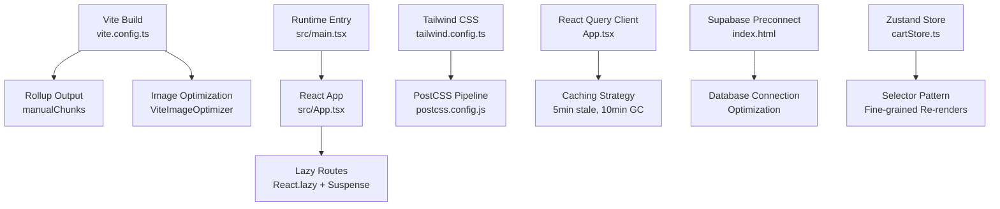
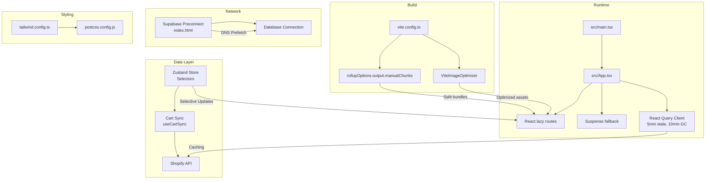
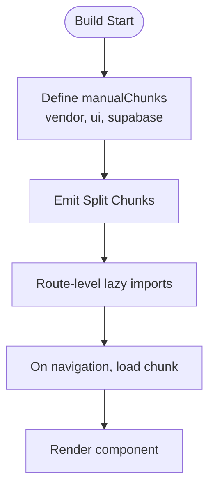
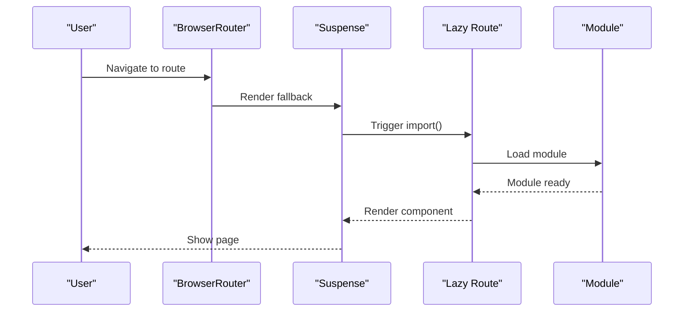
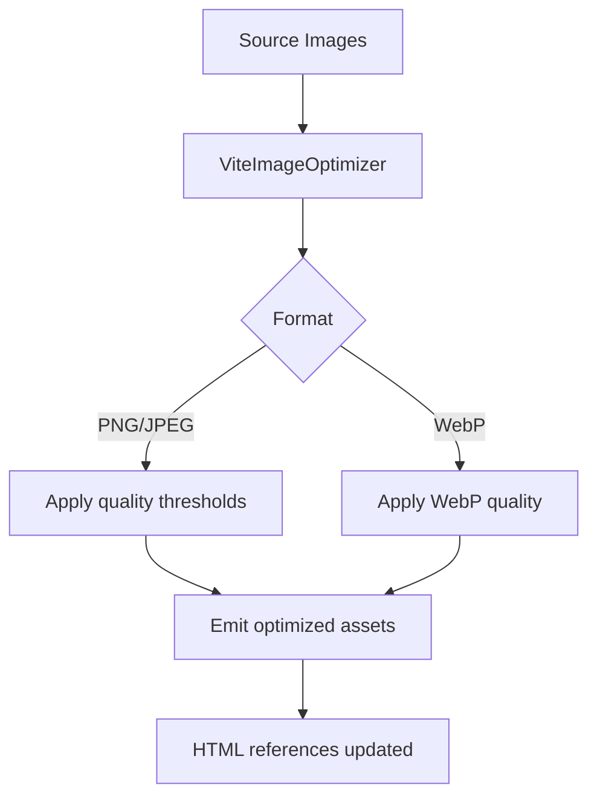
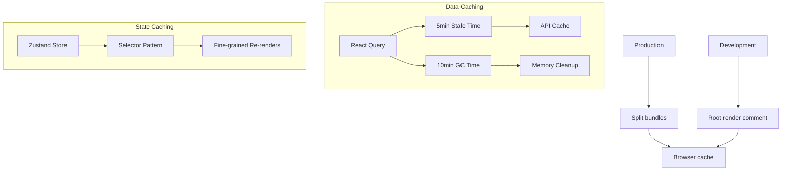
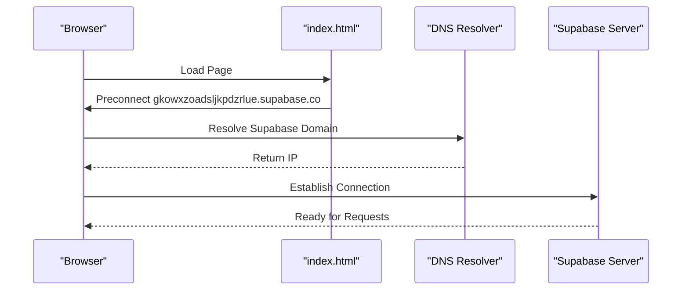
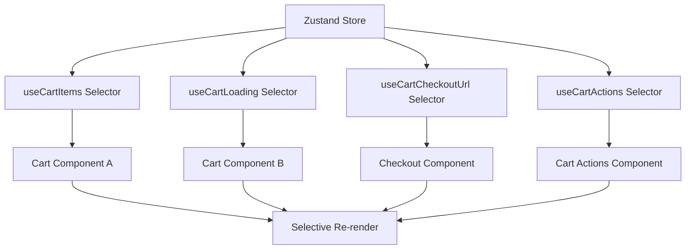
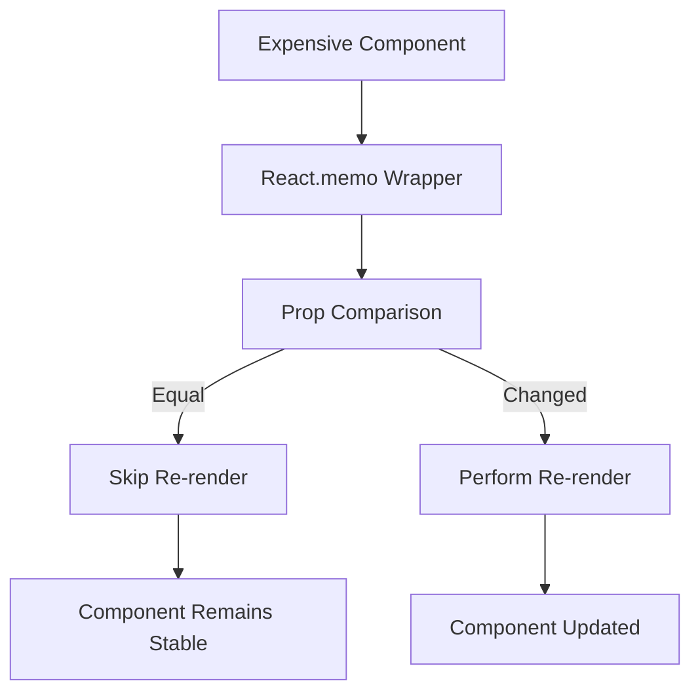
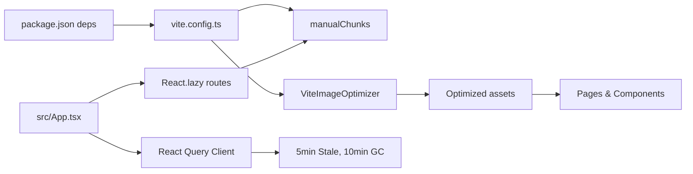

# Performance Optimization

<cite>
**Referenced Files in This Document**
- [README.md](file://README.md)
- [package.json](file://package.json)
- [vite.config.ts](file://vite.config.ts)
- [tailwind.config.ts](file://tailwind.config.ts)
- [postcss.config.js](file://postcss.config.js)
- [eslint.config.js](file://eslint.config.js)
- [src/main.tsx](file://src/main.tsx)
- [src/App.tsx](file://src/App.tsx)
- [src/pages/Index.tsx](file://src/pages/Index.tsx)
- [src/components/funnel/FunnelLayout.tsx](file://src/components/funnel/FunnelLayout.tsx)
- [src/integrations/supabase/client.ts](file://src/integrations/supabase/client.ts)
- [src/stores/cartStore.ts](file://src/stores/cartStore.ts)
- [src/hooks/useCartSync.ts](file://src/hooks/useCartSync.ts)
- [index.html](file://index.html)
- [src/components/portal/LeadsTable.tsx](file://src/components/portal/LeadsTable.tsx)
- [src/components/store/ProductCard.tsx](file://src/components/store/ProductCard.tsx)
</cite>

## Update Summary
**Changes Made**
- Added comprehensive React Query caching strategies with 5-minute stale time and 10-minute garbage collection time
- Integrated Supabase preconnect optimization for improved database connection performance
- Implemented Zustand store selectors for fine-grained re-render control
- Added component memoization techniques for performance optimization
- Enhanced caching strategies with separate selectors for better performance

## Table of Contents
1. [Introduction](#introduction)
2. [Project Structure](#project-structure)
3. [Core Components](#core-components)
4. [Architecture Overview](#architecture-overview)
5. [Detailed Component Analysis](#detailed-component-analysis)
6. [Dependency Analysis](#dependency-analysis)
7. [Performance Considerations](#performance-considerations)
8. [Troubleshooting Guide](#troubleshooting-guide)
9. [Conclusion](#conclusion)
10. [Appendices](#appendices)

## Introduction
This document focuses on performance optimization techniques and strategies for the Ryland application. It explains how the project leverages modern tooling and React patterns to achieve fast builds, efficient runtime performance, and strong Core Web Vitals. Topics include bundle optimization, code splitting, lazy loading, image optimization, asset compression, caching strategies, performance monitoring, profiling, bottleneck identification, and Progressive Web App readiness.

**Updated** The application now includes comprehensive performance optimizations including React Query caching strategies, Supabase preconnect optimization, Zustand store selectors for fine-grained re-render control, and component memoization techniques.

## Project Structure
The project is a Vite + React + TypeScript application configured with Tailwind CSS and PostCSS. The build pipeline is optimized for production with manual chunking and image compression. The application uses React.lazy for route-level code splitting and Suspense for graceful loading states.

**Diagram sources**
- [vite.config.ts:31-41](file://vite.config.ts#L31-L41)
- [src/App.tsx:53-62](file://src/App.tsx#L53-L62)
- [index.html:17](file://index.html#L17)
- [src/stores/cartStore.ts:37-48](file://src/stores/cartStore.ts#L37-L48)

**Section sources**
- [README.md:53-61](file://README.md#L53-L61)
- [package.json:15-69](file://package.json#L15-L69)
- [vite.config.ts:1-43](file://vite.config.ts#L1-L43)
- [tailwind.config.ts:1-97](file://tailwind.config.ts#L1-L97)
- [postcss.config.js:1-7](file://postcss.config.js#L1-L7)
- [src/main.tsx:1-7](file://src/main.tsx#L1-L7)
- [src/App.tsx:1-124](file://src/App.tsx#L1-L124)

## Core Components
- Build and bundling: Vite with Rollup manual chunking separates vendor, UI, and Supabase bundles to improve caching and parallel loading.
- Image optimization: ViteImageOptimizer compresses PNG/JPEG/WebP assets during build.
- Routing and lazy loading: Route-level lazy imports with Suspense fallbacks minimize initial JavaScript payload.
- Styling pipeline: Tailwind scanning and PostCSS autoprefixing streamline CSS delivery.
- Runtime entry: Minimal root creation with explicit cache-busting comment.
- **New**: React Query caching: Configured with 5-minute stale time and 10-minute garbage collection time for optimal data freshness and memory management.
- **New**: Supabase preconnect: DNS prefetching for database connections reduces latency.
- **New**: Zustand selectors: Fine-grained re-render control prevents unnecessary component updates.
- **New**: Component memoization: Strategic memoization of expensive components improves rendering performance.

Practical implications:
- Smaller initial chunks improve Time to Interactive.
- Lazy routes defer heavy components until navigation.
- Compressed images reduce transfer size and render time.
- Intelligent caching reduces network requests and improves response times.
- Selective re-renders minimize CPU usage and improve smoothness.

**Section sources**
- [vite.config.ts:31-41](file://vite.config.ts#L31-L41)
- [vite.config.ts:19-24](file://vite.config.ts#L19-L24)
- [src/App.tsx:11-50](file://src/App.tsx#L11-L50)
- [tailwind.config.ts:4-5](file://tailwind.config.ts#L4-L5)
- [postcss.config.js:1-6](file://postcss.config.js#L1-L6)
- [src/main.tsx:5-6](file://src/main.tsx#L5-L6)
- [src/App.tsx:53-62](file://src/App.tsx#L53-L62)
- [index.html:17](file://index.html#L17)
- [src/stores/cartStore.ts:37-48](file://src/stores/cartStore.ts#L37-L48)

## Architecture Overview
The performance architecture centers on three pillars:
- Build-time optimization: chunk separation and image compression.
- Runtime optimization: lazy loading and minimal initial bundle.
- Asset pipeline: Tailwind scanning and PostCSS processing.
- **New**: Data layer optimization: React Query caching and intelligent data management.
- **New**: Network optimization: Preconnect strategies and selective re-renders.

**Diagram sources**
- [vite.config.ts:31-41](file://vite.config.ts#L31-L41)
- [vite.config.ts:19-24](file://vite.config.ts#L19-L24)
- [src/App.tsx:11-50](file://src/App.tsx#L11-L50)
- [src/App.tsx:53-62](file://src/App.tsx#L53-L62)
- [src/stores/cartStore.ts:37-48](file://src/stores/cartStore.ts#L37-L48)
- [src/hooks/useCartSync.ts:1-15](file://src/hooks/useCartSync.ts#L1-L15)
- [index.html:17](file://index.html#L17)

## Detailed Component Analysis

### Bundle Optimization and Code Splitting
- Manual chunking groups frequently shared libraries into dedicated chunks for better caching and reuse.
- Route-level lazy loading defers rendering of non-critical pages until navigation.

**Diagram sources**
- [vite.config.ts:34-39](file://vite.config.ts#L34-L39)
- [src/App.tsx:11-50](file://src/App.tsx#L11-L50)

**Section sources**
- [vite.config.ts:31-41](file://vite.config.ts#L31-L41)
- [src/App.tsx:11-50](file://src/App.tsx#L11-L50)

### Lazy Loading Implementation
- Suspense wraps the routing tree to show a minimal fallback while lazy modules load.
- Lazy imports are used across all major routes to reduce initial JS.

**Diagram sources**
- [src/App.tsx:63-107](file://src/App.tsx#L63-L107)
- [src/App.tsx:11-50](file://src/App.tsx#L11-L50)

**Section sources**
- [src/App.tsx:11-50](file://src/App.tsx#L11-L50)
- [src/App.tsx:63-107](file://src/App.tsx#L63-L107)

### Image Optimization and Asset Compression
- ViteImageOptimizer compresses PNG/JPEG/WebP assets with configurable quality settings during build.
- The homepage demonstrates best practices: fetchPriority for hero images, loading="lazy" for below-the-fold images, and modern formats like WebP.

**Diagram sources**
- [vite.config.ts:19-24](file://vite.config.ts#L19-L24)
- [src/pages/Index.tsx:145-155](file://src/pages/Index.tsx#L145-L155)
- [src/pages/Index.tsx:24-28](file://src/pages/Index.tsx#L24-L28)

**Section sources**
- [vite.config.ts:19-24](file://vite.config.ts#L19-L24)
- [src/pages/Index.tsx:145-155](file://src/pages/Index.tsx#L145-L155)
- [src/pages/Index.tsx:24-28](file://src/pages/Index.tsx#L24-L28)

### Caching Strategies
- Split bundles enable long-term caching of vendor/UI chunks while application code can be cache-busted via versioning.
- Explicit cache-busting comment in the root entry ensures fresh initial loads during development and controlled updates in production.
- **New**: React Query caching with 5-minute stale time and 10-minute garbage collection time optimizes data freshness and memory usage.
- **New**: Zustand store selectors prevent unnecessary re-renders by subscribing to specific state slices.

**Diagram sources**
- [src/main.tsx:5-6](file://src/main.tsx#L5-L6)
- [vite.config.ts:34-39](file://vite.config.ts#L34-L39)
- [src/App.tsx:53-62](file://src/App.tsx#L53-L62)
- [src/stores/cartStore.ts:37-48](file://src/stores/cartStore.ts#L37-L48)

**Section sources**
- [src/main.tsx:5-6](file://src/main.tsx#L5-L6)
- [vite.config.ts:34-39](file://vite.config.ts#L34-L39)
- [src/App.tsx:53-62](file://src/App.tsx#L53-L62)
- [src/stores/cartStore.ts:37-48](file://src/stores/cartStore.ts#L37-L48)

### Network Optimization
- **New**: Supabase preconnect optimization reduces DNS lookup time and connection establishment latency.
- **New**: Strategic preconnect to `gkowxzoadsljkpdzrlue.supabase.co` improves database connectivity performance.

**Diagram sources**
- [index.html:17](file://index.html#L17)

**Section sources**
- [index.html:17](file://index.html#L17)

### State Management Optimization
- **New**: Zustand store selectors provide fine-grained re-render control, preventing unnecessary component updates when only specific state slices change.
- **New**: Separate selectors for cart items, loading states, and checkout URLs ensure components only re-render when their specific data changes.

**Diagram sources**
- [src/stores/cartStore.ts:37-48](file://src/stores/cartStore.ts#L37-L48)

**Section sources**
- [src/stores/cartStore.ts:37-48](file://src/stores/cartStore.ts#L37-L48)

### Component Memoization Techniques
- **New**: Strategic component memoization prevents unnecessary re-renders of expensive components.
- **New**: `LeadsTable` uses React.memo to optimize table rendering performance.
- **New**: `ProductCard` implements lazy loading for images and animation optimizations.

**Diagram sources**
- [src/components/portal/LeadsTable.tsx:147](file://src/components/portal/LeadsTable.tsx#L147)
- [src/components/store/ProductCard.tsx:13](file://src/components/store/ProductCard.tsx#L13)

**Section sources**
- [src/components/portal/LeadsTable.tsx:147](file://src/components/portal/LeadsTable.tsx#L147)
- [src/components/store/ProductCard.tsx:13](file://src/components/store/ProductCard.tsx#L13)

### Performance Monitoring and Profiling
Recommended practices aligned with the project stack:
- Use React DevTools Profiler to identify expensive renders and long tasks.
- Measure Core Web Vitals in real browsers and headless environments.
- Monitor bundle sizes and transfer sizes with Vite's build analyzer.
- Track runtime metrics such as TTFB, LCP, FID, and CLS in production.
- **New**: Monitor React Query cache hit rates and garbage collection effectiveness.
- **New**: Track Zustand selector performance and re-render frequency.

### Bottleneck Identification
Common bottlenecks and mitigations:
- Heavy initial bundle: addressed by manual chunking and lazy routes.
- Large images: addressed by ViteImageOptimizer and lazy loading attributes.
- Excessive re-renders: addressed with React.memo, useMemo, and useCallback where appropriate.
- Unoptimized CSS: rely on Tailwind scanning and PostCSS to ship only used styles.
- **New**: Network latency: addressed with preconnect optimization and caching strategies.
- **New**: State synchronization: addressed with selective re-render patterns.

### Practical Examples
- Optimizing React component rendering:
  - Wrap expensive lists or panels with memoization.
  - Defer non-critical effects and data fetching to after hydration.
  - Use separate selectors for state management to prevent unnecessary re-renders.
- Reducing bundle size:
  - Keep manualChunks minimal and cohesive; avoid over-splitting.
  - Prefer lightweight alternatives for animations and media.
- Improving runtime performance:
  - Use loading="lazy" and fetchPriority="high" strategically.
  - Minimize layout thrashing by batching DOM reads/writes.
  - Implement caching strategies with appropriate stale and garbage collection times.
  - Use preconnect optimization for critical third-party resources.

### Mobile Performance Considerations
- Lazy-load offscreen images and videos.
- Prefer responsive images and modern formats.
- Minimize main-thread work during critical interactions.
- Use reduced-motion preferences and throttle animations on low-power devices.
- **New**: Leverage caching strategies for offline scenarios and reduced network usage.

### Core Web Vitals Optimization
- Largest Contentful Paint (LCP): prioritize above-the-fold content, defer non-critical assets, and optimize images.
- First Input Delay (FID): reduce main-thread blocking, split bundles, and keep initial JS small.
- Cumulative Layout Shift (CLS): reserve space for images, avoid dynamic injected content above the fold, and pre-allocate layout areas.
- **New**: Optimize cache hit rates to improve LCP and FID performance.

### Progressive Web App Features
- Add a service worker for offline caching and background sync.
- Implement a manifest for installability and home screen presence.
- Use HTTP caching headers and immutable caching for static assets.
- Ensure HTTPS and reliable network handling.
- **New**: Leverage React Query caching for offline-first experiences.

## Dependency Analysis
The project's performance depends on a tight coupling between build configuration and runtime behavior. The following diagram highlights key relationships.

**Diagram sources**
- [package.json:15-69](file://package.json#L15-L69)
- [vite.config.ts:31-41](file://vite.config.ts#L31-L41)
- [src/App.tsx:11-50](file://src/App.tsx#L11-L50)
- [src/App.tsx:53-62](file://src/App.tsx#L53-L62)

**Section sources**
- [package.json:15-69](file://package.json#L15-L69)
- [vite.config.ts:31-41](file://vite.config.ts#L31-L41)
- [src/App.tsx:11-50](file://src/App.tsx#L11-L50)
- [src/App.tsx:53-62](file://src/App.tsx#L53-L62)

## Performance Considerations
- Bundle budgets: set limits per chunk and monitor growth across releases.
- Monitoring setup: integrate field reporting for LCP/FID/CLS and synthetic checks.
- Continuous improvement: automate bundle analysis in CI and enforce budgets.
- **New**: React Query cache monitoring: track cache hit rates and adjust stale/gc times.
- **New**: State management optimization: monitor selector performance and re-render frequency.
- **New**: Network optimization: measure preconnect benefits and connection latency improvements.

## Troubleshooting Guide
- Slow initial load:
  - Verify manualChunks are effective and not overly fragmented.
  - Confirm lazy routes are used for non-critical pages.
- Large images:
  - Ensure ViteImageOptimizer is enabled and assets are served compressed.
  - Audit images for unnecessary sizes and formats.
- Rendering jank:
  - Reduce re-renders with memoization and stable props.
  - Defer heavy computations to Web Workers or idle callbacks.
  - **New**: Check React Query cache effectiveness and adjust stale/gc times.
  - **New**: Monitor Zustand selector usage and ensure proper separation of concerns.
- Network latency:
  - **New**: Verify preconnect optimization is working correctly.
  - **New**: Monitor database connection establishment times.

## Conclusion
Ryland's performance foundation combines strategic bundling, route-level lazy loading, and image compression. The recent additions of React Query caching strategies, Supabase preconnect optimization, Zustand store selectors, and component memoization techniques significantly enhance application responsiveness and reduce unnecessary network requests. By maintaining clean chunk boundaries, leveraging Suspense, optimizing assets, and implementing intelligent caching patterns, the application achieves faster initial loads, smoother interactions, and improved user experience. Extending this baseline with robust monitoring, budgets, and PWA features will further strengthen runtime performance and user experience.

## Appendices
- Build scripts and toolchain:
  - Development server, production build, and preview commands are defined in the project scripts.
  - ESLint and Vitest configurations support code quality and testing.

**Section sources**
- [package.json:6-14](file://package.json#L6-L14)
- [eslint.config.js:1-27](file://eslint.config.js#L1-L27)
- [README.md:23-36](file://README.md#L23-L36)