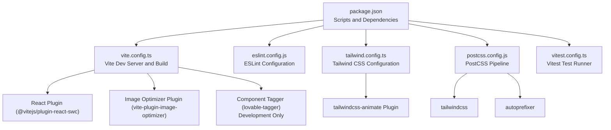
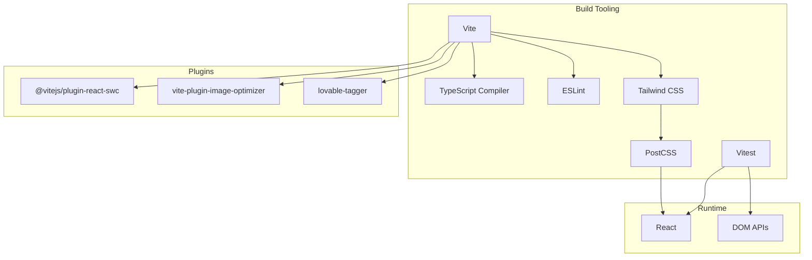
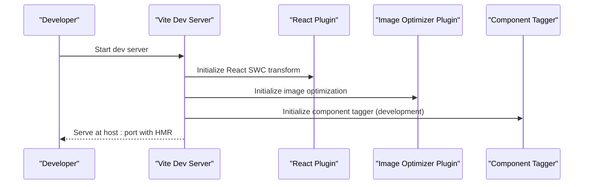
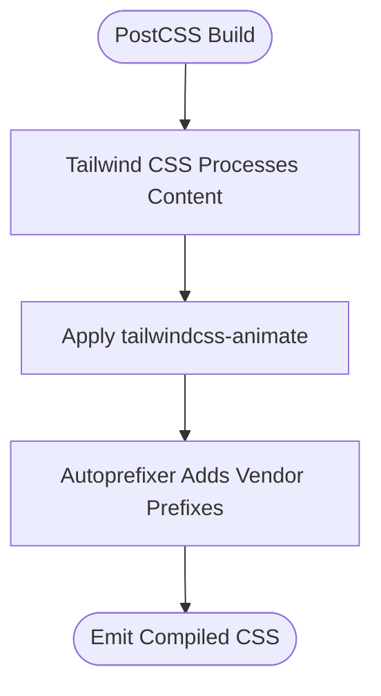
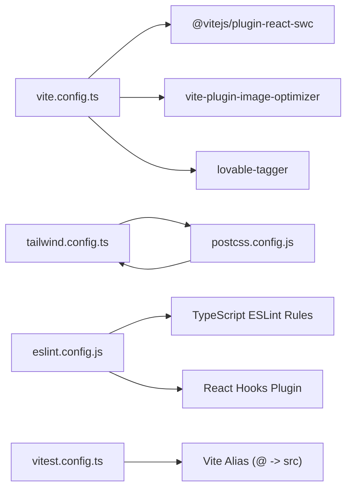

# Project Configuration

<cite>
**Referenced Files in This Document**
- [README.md](file://README.md)
- [package.json](file://package.json)
- [vite.config.ts](file://vite.config.ts)
- [eslint.config.js](file://eslint.config.js)
- [tailwind.config.ts](file://tailwind.config.ts)
- [postcss.config.js](file://postcss.config.js)
- [vitest.config.ts](file://vitest.config.ts)
</cite>

## Table of Contents
1. [Introduction](#introduction)
2. [Project Structure](#project-structure)
3. [Core Components](#core-components)
4. [Architecture Overview](#architecture-overview)
5. [Detailed Component Analysis](#detailed-component-analysis)
6. [Dependency Analysis](#dependency-analysis)
7. [Performance Considerations](#performance-considerations)
8. [Troubleshooting Guide](#troubleshooting-guide)
9. [Conclusion](#conclusion)

## Introduction
This section documents the project’s configuration and build system setup. It explains how Vite is configured for development and production, how TypeScript integrates with the build pipeline, how ESLint enforces code quality, how Tailwind CSS and PostCSS are integrated, and how Vitest is configured for testing. It also provides practical guidance for customizing build settings, adding new development tools, and resolving common issues.

## Project Structure
The project is a Vite + React + TypeScript application with additional tooling for linting, styling, and testing. The repository root contains the primary configuration files and scripts defined in the package manifest.

**Diagram sources**
- [package.json:6-14](file://package.json#L6-L14)
- [vite.config.ts:1-43](file://vite.config.ts#L1-L43)
- [eslint.config.js:1-27](file://eslint.config.js#L1-L27)
- [tailwind.config.ts:1-97](file://tailwind.config.ts#L1-L97)
- [postcss.config.js:1-7](file://postcss.config.js#L1-L7)
- [vitest.config.ts:1-17](file://vitest.config.ts#L1-L17)

**Section sources**
- [README.md:53-61](file://README.md#L53-L61)
- [package.json:6-14](file://package.json#L6-L14)

## Core Components
- Vite configuration defines the development server, plugins, path aliases, and build chunking strategy.
- ESLint configuration enforces TypeScript and React-specific rules with recommended defaults and custom overrides.
- Tailwind CSS configuration sets content paths, theme extensions, animations, and plugins.
- PostCSS configuration wires Tailwind and Autoprefixer into the build pipeline.
- Vitest configuration aligns the test environment with DOM APIs and resolves module aliases.

**Section sources**
- [vite.config.ts:8-42](file://vite.config.ts#L8-L42)
- [eslint.config.js:7-26](file://eslint.config.js#L7-L26)
- [tailwind.config.ts:3-96](file://tailwind.config.ts#L3-L96)
- [postcss.config.js:1-7](file://postcss.config.js#L1-L7)
- [vitest.config.ts:5-16](file://vitest.config.ts#L5-L16)

## Architecture Overview
The build and development pipeline integrates Vite, TypeScript, ESLint, Tailwind CSS, PostCSS, and Vitest. Vite orchestrates development and bundling, while plugins handle React transforms, image optimization, and component tagging during development. Tailwind CSS and PostCSS process styles, and Vitest runs unit and component tests.

**Diagram sources**
- [vite.config.ts:1-43](file://vite.config.ts#L1-L43)
- [eslint.config.js:1-27](file://eslint.config.js#L1-L27)
- [tailwind.config.ts:1-97](file://tailwind.config.ts#L1-L97)
- [postcss.config.js:1-7](file://postcss.config.js#L1-L7)
- [vitest.config.ts:1-17](file://vitest.config.ts#L1-L17)

## Detailed Component Analysis

### Vite Configuration
Purpose:
- Configure the development server (host, port, HMR overlay).
- Load plugins for React, image optimization, and component tagging in development.
- Set module alias for the src directory.
- Split bundles into vendor, UI, and Supabase chunks for improved caching and load performance.

Key settings:
- Development server: host, port, and HMR overlay disabled.
- Plugins: React SWC, image optimizer, and component tagger (development-only).
- Aliasing: @ resolves to ./src.
- Build chunking: manualChunks groups frequently used libraries into named chunks.

Customization scenarios:
- Change dev server host/port or disable HMR overlay.
- Add or remove plugins (e.g., PWA, Sentry, or additional image processing).
- Adjust manualChunks to reflect evolving dependencies.
- Introduce environment-specific configurations using Vite modes.

Practical examples:
- To enable HTTPS in development, add a server.https option.
- To proxy API requests, add server.proxy entries.
- To add a new plugin, import it and append to the plugins array.
- To adjust chunk sizes, modify the manualChunks mapping.

**Section sources**
- [vite.config.ts:8-42](file://vite.config.ts#L8-L42)

#### Vite Development Server Flow

**Diagram sources**
- [vite.config.ts:8-25](file://vite.config.ts#L8-L25)

### TypeScript Configuration
Purpose:
- Define compiler options and project settings for type-safe builds.
- Enable JSX, module resolution, and strictness aligned with React and Vite.

Common customization scenarios:
- Switch target/Module (e.g., from ES2020 to a newer ECMAScript version).
- Enable experimental decorators or JSX transforms if needed.
- Add path mapping or baseUrl for monorepo-style setups.
- Integrate incremental builds or solution-style projects if expanding to multiple packages.

Note: The repository does not include a tsconfig.json file. Ensure TypeScript settings are configured via Vite’s TypeScript integration and any project-specific tsconfig files if added later.

**Section sources**
- [README.md:58](file://README.md#L58)

### ESLint Configuration
Purpose:
- Enforce code quality and React-specific best practices.
- Extend recommended TypeScript and ESLint rules.
- Configure React Hooks and React Refresh plugins.
- Ignore built artifacts and set browser globals.

Key settings:
- Extends: base recommended rules and TypeScript recommended rules.
- Files: targets TypeScript and TSX files.
- Plugins: React Hooks and React Refresh.
- Rules: recommended hooks rules plus a permissive export rule for React Refresh.

Customization scenarios:
- Tighten unused variable rules by re-enabling the no-unused-vars rule.
- Add framework-specific plugins (e.g., testing-library) and configure their rules.
- Adjust parser options for JSX or experimental syntax.
- Introduce shared configs or flat config composition for larger teams.

**Section sources**
- [eslint.config.js:7-26](file://eslint.config.js#L7-L26)

### Tailwind CSS and PostCSS Integration
Purpose:
- Configure Tailwind’s content scanning, theme, animations, and plugins.
- Wire Tailwind and Autoprefixer into the PostCSS pipeline.

Key settings:
- Content paths: scan pages, components, app, and src directories.
- Theme: container centering, paddings, color palette using CSS variables, border radius, keyframes, and animations.
- Plugins: tailwindcss-animate for advanced transitions.

PostCSS pipeline:
- Tailwind CSS processes design tokens and utilities.
- Autoprefixer adds vendor prefixes for supported browsers.

Customization scenarios:
- Add new color scales, spacing units, or font families in theme.extend.
- Introduce additional Tailwind plugins (e.g., forms, typography).
- Adjust content globs to include new component locations.
- Tune animation durations or easing curves.

**Section sources**
- [tailwind.config.ts:3-96](file://tailwind.config.ts#L3-L96)
- [postcss.config.js:1-7](file://postcss.config.js#L1-L7)

#### Tailwind and PostCSS Flow

**Diagram sources**
- [tailwind.config.ts:95](file://tailwind.config.ts#L95)
- [postcss.config.js:2-5](file://postcss.config.js#L2-L5)

### Vitest Configuration
Purpose:
- Configure the test runner with JSDOM environment and global settings.
- Align module aliasing with Vite’s alias for seamless imports in tests.
- Set up test file discovery and optional setup files.

Key settings:
- Environment: jsdom for DOM APIs.
- Globals: enable describe, it, expect globally.
- Setup files: optional initialization script for tests.
- Include pattern: discover test/spec files under src.

Customization scenarios:
- Add coverage collection or reporters.
- Introduce setup files for mocking or test utilities.
- Adjust include/exclude patterns for test organization.
- Integrate additional plugins (e.g., MSW, Testing Library).

**Section sources**
- [vitest.config.ts:5-16](file://vitest.config.ts#L5-L16)

## Dependency Analysis
The configuration files depend on each other as follows:
- Vite depends on React SWC, image optimizer, and component tagger (development).
- Tailwind CSS relies on PostCSS to apply Autoprefixer and process design tokens.
- ESLint consumes TypeScript rules and React plugins to analyze source files.
- Vitest mirrors Vite’s alias and environment for consistent testing.

**Diagram sources**
- [vite.config.ts:1-43](file://vite.config.ts#L1-L43)
- [tailwind.config.ts:1-97](file://tailwind.config.ts#L1-L97)
- [postcss.config.js:1-7](file://postcss.config.js#L1-L7)
- [eslint.config.js:1-27](file://eslint.config.js#L1-L27)
- [vitest.config.ts:1-17](file://vitest.config.ts#L1-L17)

**Section sources**
- [package.json:15-93](file://package.json#L15-L93)

## Performance Considerations
- Bundle splitting: manualChunks separates vendor, UI, and Supabase dependencies to improve caching and initial load performance.
- Image optimization: the image optimizer plugin reduces asset sizes during development and build.
- HMR overlay: disabling the overlay can reduce noise during development but keep HMR enabled for fast updates.
- Tailwind purging: ensure content globs are accurate to avoid shipping unused CSS.

[No sources needed since this section provides general guidance]

## Troubleshooting Guide
- Vite dev server not starting:
  - Verify host/port availability and firewall settings.
  - Confirm plugins are installed and compatible with current Vite version.
- HMR not working:
  - Check HMR overlay settings and network connectivity.
  - Ensure client and server versions match.
- Tailwind utilities missing:
  - Confirm content paths include all relevant files.
  - Re-run build after adding new content directories.
- ESLint errors in TypeScript files:
  - Ensure TypeScript ESLint plugins are installed and configured.
  - Verify file extensions and glob patterns in ESLint config.
- Vitest failing with DOM errors:
  - Confirm jsdom environment is active and setup files are correct.
  - Align alias paths between Vite and Vitest configs.

**Section sources**
- [vite.config.ts:9-15](file://vite.config.ts#L9-L15)
- [tailwind.config.ts:5](file://tailwind.config.ts#L5)
- [eslint.config.js:10-11](file://eslint.config.js#L10-L11)
- [vitest.config.ts:8-10](file://vitest.config.ts#L8-L10)

## Conclusion
This project’s configuration leverages Vite for a fast development experience, TypeScript for type safety, ESLint for code quality, Tailwind CSS with PostCSS for styling, and Vitest for testing. The provided configuration files offer a solid foundation that can be extended with additional plugins, stricter lint rules, and tailored build optimizations as the project evolves.

[No sources needed since this section summarizes without analyzing specific files]