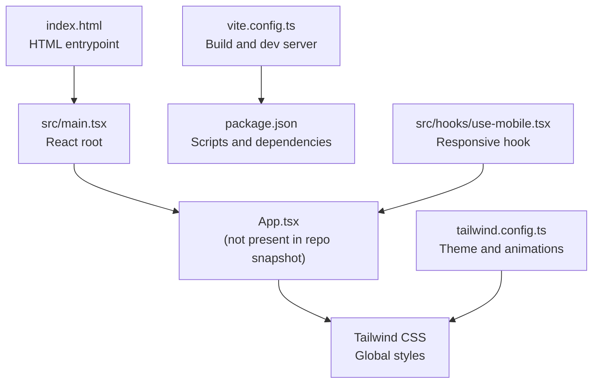
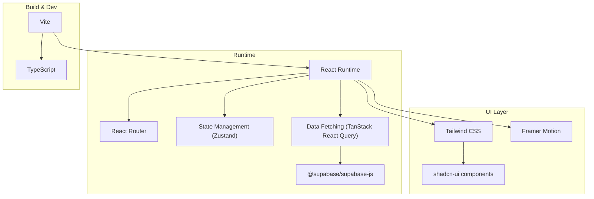
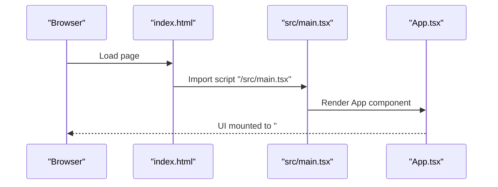
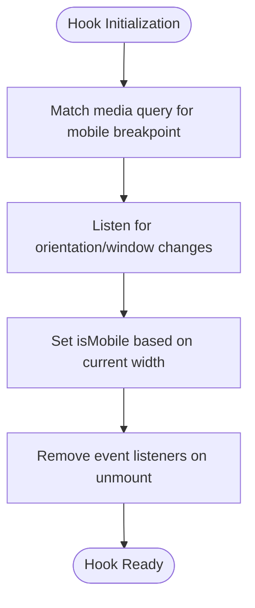
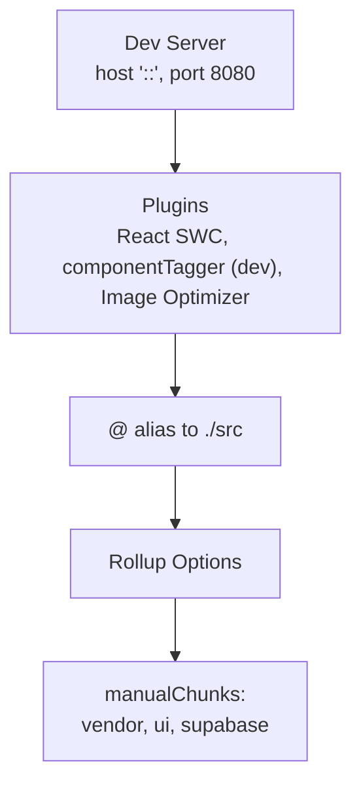
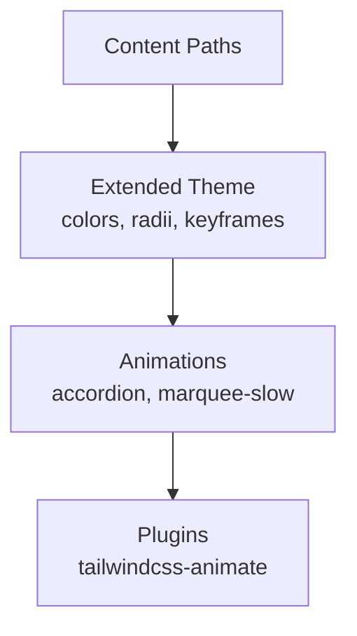
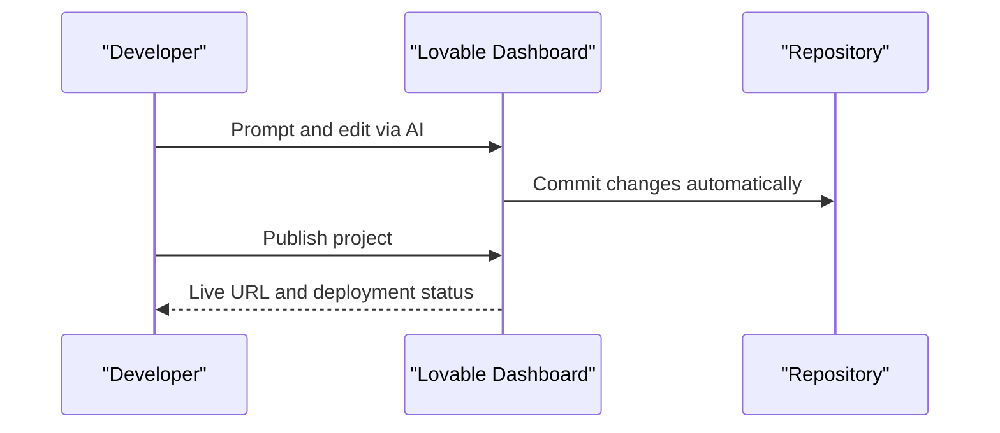
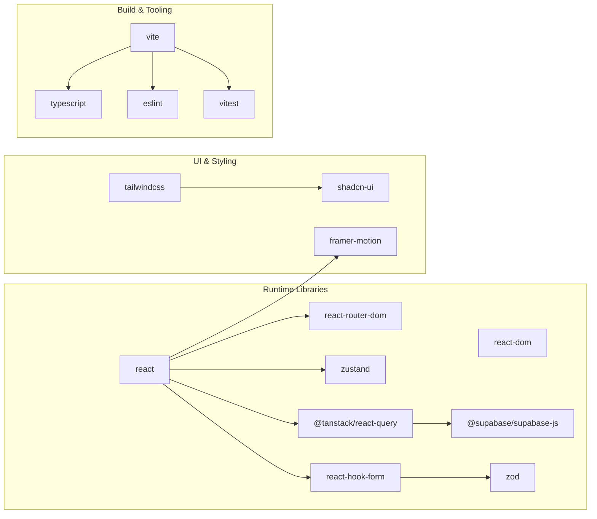

# Project Overview

<cite>
**Referenced Files in This Document**
- [README.md](file://README.md)
- [package.json](file://package.json)
- [vite.config.ts](file://vite.config.ts)
- [tailwind.config.ts](file://tailwind.config.ts)
- [index.html](file://index.html)
- [src/main.tsx](file://src/main.tsx)
- [src/hooks/use-mobile.tsx](file://src/hooks/use-mobile.tsx)
</cite>

## Table of Contents
1. [Introduction](#introduction)
2. [Project Structure](#project-structure)
3. [Core Components](#core-components)
4. [Architecture Overview](#architecture-overview)
5. [Detailed Component Analysis](#detailed-component-analysis)
6. [Dependency Analysis](#dependency-analysis)
7. [Performance Considerations](#performance-considerations)
8. [Troubleshooting Guide](#troubleshooting-guide)
9. [Conclusion](#conclusion)

## Introduction
Ryland is an AI-assisted business web application designed to deliver funding and credit repair services within the Lovable platform ecosystem. It is a modern, responsive React application built with TypeScript, optimized for rapid development and deployment. The project emphasizes developer productivity through Lovable’s AI-powered authoring and collaboration features, while maintaining a clean, scalable architecture suitable for enterprise-grade business applications.

Key characteristics:
- Purpose: AI-assisted business web application for business funding and credit repair services
- Platform: Built on the Lovable platform ecosystem for streamlined development and publishing
- Technologies: React, TypeScript, Vite, shadcn-ui, and Tailwind CSS
- Deployment: Publish-ready through Lovable with optional custom domain support

This document provides both conceptual overviews for stakeholders and technical details for developers, aligning with terminology used in the codebase such as Lovable integration, AI-assisted development, and business-focused web application architecture.

## Project Structure
The project follows a conventional React + TypeScript setup with Vite as the build tool and Tailwind CSS for styling. The repository includes minimal source scaffolding, enabling rapid iteration via Lovable’s AI-driven authoring.

High-level structure:
- Root configuration: Vite, Tailwind, and HTML entry point
- Source entry: React root rendering into the DOM
- Hooks: Responsive device detection for mobile-first UI
- Dependencies: React ecosystem, UI primitives, state management, routing, and Supabase client

**Diagram sources**
- [index.html:1-51](file://index.html#L1-L51)
- [src/main.tsx:1-6](file://src/main.tsx#L1-L6)
- [vite.config.ts:1-43](file://vite.config.ts#L1-L43)
- [tailwind.config.ts:1-97](file://tailwind.config.ts#L1-L97)
- [package.json:1-95](file://package.json#L1-L95)
- [src/hooks/use-mobile.tsx:1-19](file://src/hooks/use-mobile.tsx#L1-L19)

**Section sources**
- [README.md:1-74](file://README.md#L1-L74)
- [index.html:1-51](file://index.html#L1-L51)
- [src/main.tsx:1-6](file://src/main.tsx#L1-L6)
- [vite.config.ts:1-43](file://vite.config.ts#L1-L43)
- [tailwind.config.ts:1-97](file://tailwind.config.ts#L1-L97)
- [package.json:1-95](file://package.json#L1-L95)
- [src/hooks/use-mobile.tsx:1-19](file://src/hooks/use-mobile.tsx#L1-L19)

## Core Components
- Lovable integration: The project is provisioned as a Lovable project, enabling AI-assisted authoring and automatic commits from the Lovable interface.
- AI-assisted development: Changes made via Lovable are committed automatically to the repository, accelerating feature delivery and collaborative workflows.
- Business-focused web application architecture: Built with React and TypeScript for type safety, Vite for fast builds and hot module replacement, and shadcn-ui/Tailwind for a cohesive UI system.
- Rapid development configuration: Scripts for development, building, linting, testing, and previewing streamline local workflows.

Practical usage patterns for business users:
- Funding solutions: Present high-limit business credit lines with promotional terms and streamlined eligibility checks.
- Credit repair services: Offer transparent, no-hard-pull assessments and educational resources to improve business credit health.
- Digital economy alignment: Support digital-first workflows, responsive design, and integrations with backend services (e.g., Supabase) for secure data handling.

**Section sources**
- [README.md:1-74](file://README.md#L1-L74)
- [package.json:1-95](file://package.json#L1-L95)
- [vite.config.ts:1-43](file://vite.config.ts#L1-L43)

## Architecture Overview
The application architecture centers on a React-based frontend with a focus on modularity, performance, and maintainability. Vite manages development and production builds, while Tailwind CSS provides a consistent design system. The responsive hook ensures optimal experiences across devices.

**Diagram sources**
- [package.json:15-69](file://package.json#L15-L69)
- [vite.config.ts:1-43](file://vite.config.ts#L1-L43)
- [tailwind.config.ts:1-97](file://tailwind.config.ts#L1-L97)

**Section sources**
- [package.json:15-69](file://package.json#L15-L69)
- [vite.config.ts:1-43](file://vite.config.ts#L1-L43)
- [tailwind.config.ts:1-97](file://tailwind.config.ts#L1-L97)

## Detailed Component Analysis

### Application Entry Point
The application bootstraps via a minimal React root that mounts the main application component into the DOM. This pattern enables quick iteration and clear separation of concerns.

**Diagram sources**
- [index.html:47-48](file://index.html#L47-L48)
- [src/main.tsx:1-6](file://src/main.tsx#L1-L6)

**Section sources**
- [index.html:47-48](file://index.html#L47-L48)
- [src/main.tsx:1-6](file://src/main.tsx#L1-L6)

### Responsive Hook for Mobile-First Design
The responsive hook detects mobile breakpoints and updates state accordingly, supporting a mobile-first UI strategy aligned with business user needs across devices.

**Diagram sources**
- [src/hooks/use-mobile.tsx:1-19](file://src/hooks/use-mobile.tsx#L1-L19)

**Section sources**
- [src/hooks/use-mobile.tsx:1-19](file://src/hooks/use-mobile.tsx#L1-L19)

### Build and Chunking Strategy
Vite configuration defines development server settings, plugin composition, path aliases, and Rollup chunking to optimize bundle sizes for vendor libraries, UI libraries, and Supabase client usage.

**Diagram sources**
- [vite.config.ts:8-42](file://vite.config.ts#L8-L42)

**Section sources**
- [vite.config.ts:8-42](file://vite.config.ts#L8-L42)

### Tailwind Theme and Animations
Tailwind configuration extends color palettes, radii, keyframes, and animations to support motion-safe UI patterns and consistent theming across components.

**Diagram sources**
- [tailwind.config.ts:4-96](file://tailwind.config.ts#L4-L96)

**Section sources**
- [tailwind.config.ts:4-96](file://tailwind.config.ts#L4-L96)

### Lovable Integration and Publishing
Lovable provides AI-assisted authoring and automatic commits, simplifying collaboration and reducing friction for iterative development. Publishing is supported directly from the Lovable dashboard with optional custom domain configuration.

**Diagram sources**
- [README.md:11-16](file://README.md#L11-L16)
- [README.md:63-73](file://README.md#L63-L73)

**Section sources**
- [README.md:11-16](file://README.md#L11-L16)
- [README.md:63-73](file://README.md#L63-L73)

## Dependency Analysis
The project leverages a curated set of dependencies to balance developer experience, UI consistency, and runtime performance. Key categories include:
- React ecosystem: React, React DOM, React Router
- UI primitives and design system: shadcn-ui, Tailwind CSS, Framer Motion
- State and data fetching: Zustand, TanStack React Query
- Backend connectivity: @supabase/supabase-js
- Form handling and validation: react-hook-form, @hookform/resolvers, Zod
- Tooling and testing: Vite, TypeScript, Vitest, ESLint

**Diagram sources**
- [package.json:15-69](file://package.json#L15-L69)
- [package.json:71-93](file://package.json#L71-L93)

**Section sources**
- [package.json:15-69](file://package.json#L15-L69)
- [package.json:71-93](file://package.json#L71-L93)

## Performance Considerations
- Bundle splitting: Vite’s manualChunks configuration groups vendor, UI, and Supabase dependencies to improve caching and reduce initial load times.
- Asset optimization: Image optimizer plugin reduces payload sizes for images during development and build.
- Development experience: Host binding to "::" and HMR overlay disabled improve stability in containerized or remote environments.
- CSS scope: Tailwind’s content scanning targets pages, components, app, and src directories to minimize unused styles.

Recommendations:
- Monitor chunk sizes and adjust manualChunks as the application grows.
- Leverage lazy loading for route-level code splits.
- Keep UI library usage scoped to areas that benefit most from motion and interactivity.

**Section sources**
- [vite.config.ts:31-41](file://vite.config.ts#L31-L41)
- [vite.config.ts:19-24](file://vite.config.ts#L19-L24)
- [tailwind.config.ts:4-5](file://tailwind.config.ts#L4-L5)

## Troubleshooting Guide
Common setup and development issues:
- Node.js and npm prerequisites: Ensure Node.js and npm are installed and managed via nvm as recommended.
- Local development steps: Clone the repository, install dependencies, and start the dev server using the documented commands.
- Lovable integration: Changes made via Lovable are committed automatically; verify repository synchronization if edits do not appear locally.
- Publishing and domains: Use the Lovable dashboard to publish and configure custom domains per platform documentation.

Deployment and publishing:
- Publishing: Open the Lovable project page and select Share -> Publish to deploy the application.
- Custom domains: Configure domains under Project > Settings > Domains for branded URLs.

**Section sources**
- [README.md:23-37](file://README.md#L23-L37)
- [README.md:63-73](file://README.md#L63-L73)

## Conclusion
Ryland represents a modern, AI-assisted business web application tailored for funding and credit repair services. Its architecture, built with React, TypeScript, Vite, and Tailwind CSS, aligns with the Lovable platform ecosystem to accelerate development and simplify deployment. The project’s configuration supports rapid iteration, performance-conscious bundling, and responsive design—ensuring a strong foundation for delivering business-focused solutions in a competitive digital economy.