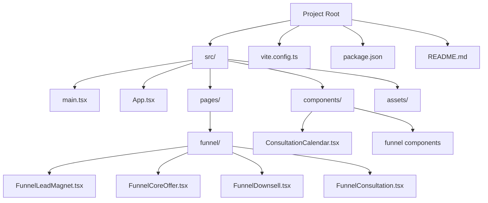
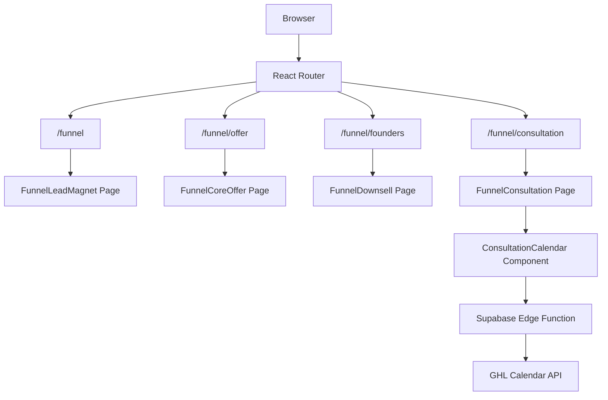
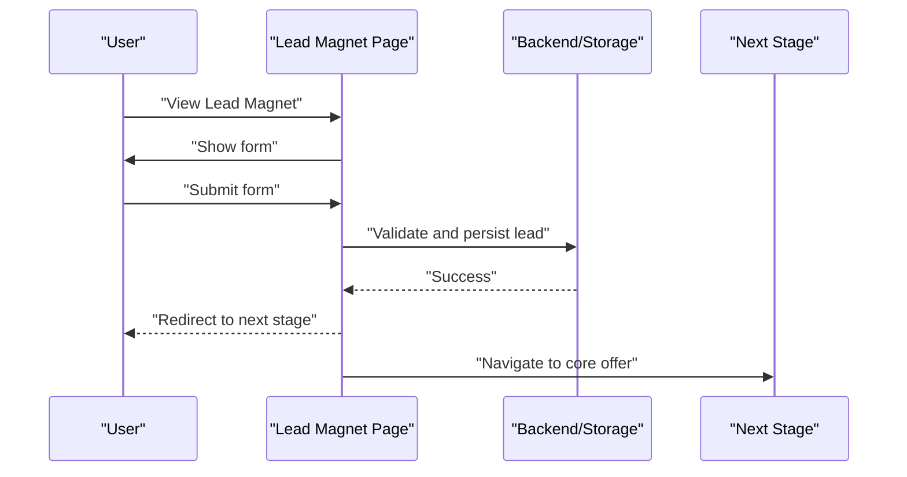
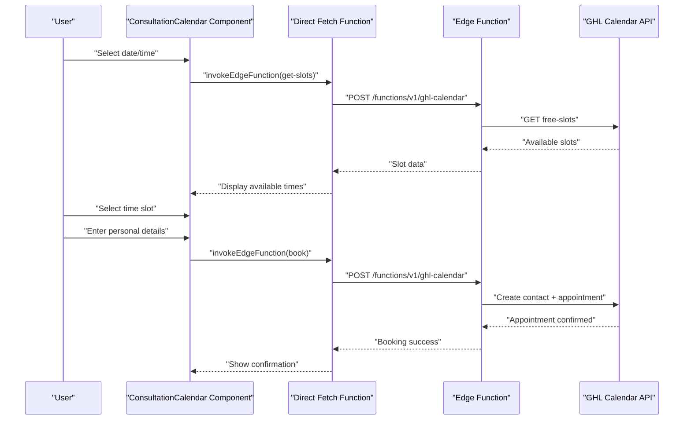
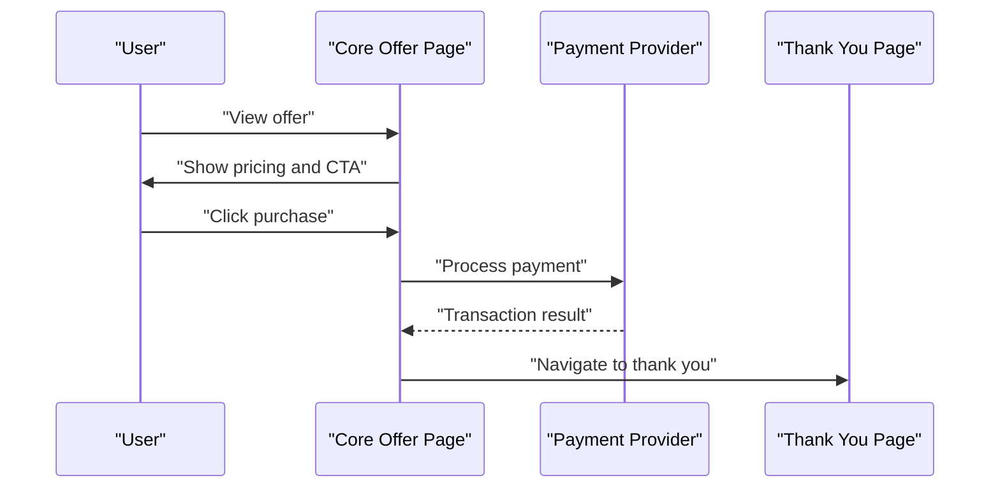
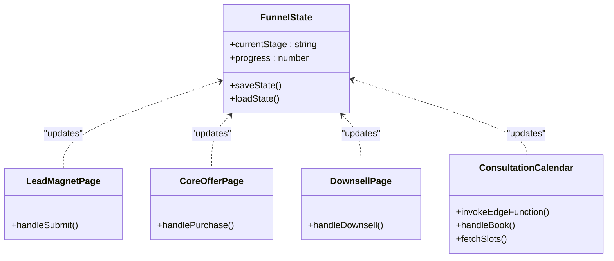
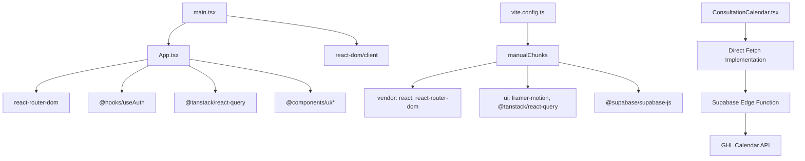

# Sales Funnel Pages

<cite>
**Referenced Files in This Document**
- [README.md](file://README.md)
- [package.json](file://package.json)
- [vite.config.ts](file://vite.config.ts)
- [src/main.tsx](file://src/main.tsx)
- [src/App.tsx](file://src/App.tsx)
- [src/components/funnel/ConsultationCalendar.tsx](file://src/components/funnel/ConsultationCalendar.tsx)
- [supabase/functions/ghl-calendar/index.ts](file://supabase/functions/ghl-calendar/index.ts)
</cite>

## Update Summary
**Changes Made**
- Enhanced ConsultationCalendar component documentation with new direct fetch implementation details
- Added comprehensive edge function communication architecture explanation
- Updated error handling and debugging capabilities documentation
- Expanded consultation booking stage implementation details
- Added edge function environment configuration and security considerations

## Table of Contents
1. [Introduction](#introduction)
2. [Project Structure](#project-structure)
3. [Core Components](#core-components)
4. [Architecture Overview](#architecture-overview)
5. [Detailed Component Analysis](#detailed-component-analysis)
6. [Enhanced Consultation Booking Implementation](#enhanced-consultation-booking-implementation)
7. [Edge Function Communication Architecture](#edge-function-communication-architecture)
8. [Dependency Analysis](#dependency-analysis)
9. [Performance Considerations](#performance-considerations)
10. [Troubleshooting Guide](#troubleshooting-guide)
11. [Conclusion](#conclusion)
12. [Appendices](#appendices)

## Introduction
This document explains the sales funnel implementation and conversion optimization pages for the project. The funnel follows a classic lead-to-sale progression: lead magnet capture, consultation booking, core offer presentation, and downsell conversion. The application is a React-based single-page application using routing to present funnel stages and other marketing/ecommerce pages. The funnel routes are defined in the application's routing configuration, enabling structured user journeys and analytics-friendly URLs.

**Updated** Enhanced with new ConsultationCalendar component featuring direct edge function communication for improved reliability and debugging capabilities.

## Project Structure
The project is a Vite + React application with TypeScript and Tailwind CSS. Routing is handled by React Router DOM, and global providers include authentication and query caching. The funnel pages are lazily loaded to optimize initial load performance.



**Diagram sources**
- [src/App.tsx:77-80](file://src/App.tsx#L77-L80)
- [src/App.tsx:24-27](file://src/App.tsx#L24-L27)
- [vite.config.ts:26-30](file://vite.config.ts#L26-L30)
- [src/components/funnel/ConsultationCalendar.tsx:10-12](file://src/components/funnel/ConsultationCalendar.tsx#L10-L12)

**Section sources**
- [README.md:53-74](file://README.md#L53-L74)
- [package.json:1-95](file://package.json#L1-L95)
- [vite.config.ts:1-43](file://vite.config.ts#L1-L43)
- [src/main.tsx:1-7](file://src/main.tsx#L1-L7)
- [src/App.tsx:113-124](file://src/App.tsx#L113-L124)

## Core Components
- Routing and Lazy Loading: Funnel pages are imported lazily to reduce initial bundle size and improve perceived performance.
- Providers: Authentication provider, query client provider, and tooltip provider wrap the app to support funnel features like cart synchronization, user state, and UI interactions.
- Funnel Routes: Dedicated routes for lead magnet, core offer, downsell, and consultation booking enable clear navigation and deep-linking.
- Enhanced Consultation Calendar: New ConsultationCalendar component with direct edge function communication for reliable calendar booking.

**Updated** Added ConsultationCalendar component with advanced edge function integration and improved error handling.

Implementation highlights:
- Lazy route definitions for funnel pages are declared alongside other pages.
- The funnel routes are mounted under the "/funnel" namespace, aligning with the funnel architecture.
- Global providers ensure consistent state and UX across funnel stages.
- ConsultationCalendar uses direct fetch implementation to avoid Supabase SDK AbortError issues.

**Section sources**
- [src/App.tsx:11-51](file://src/App.tsx#L11-L51)
- [src/App.tsx:77-80](file://src/App.tsx#L77-L80)
- [src/App.tsx:113-121](file://src/App.tsx#L113-L121)
- [src/components/funnel/ConsultationCalendar.tsx:10-12](file://src/components/funnel/ConsultationCalendar.tsx#L10-L12)

## Architecture Overview
The funnel architecture is URL-driven and page-based. Users move through stages by navigating between funnel routes. Each stage is a separate page component that encapsulates its own form, content, and conversion logic. The router ensures deterministic navigation and supports analytics tagging and A/B testing by treating each stage as a distinct page.

**Updated** Enhanced with ConsultationCalendar component that communicates directly with Supabase edge functions for reliable calendar operations.



**Diagram sources**
- [src/App.tsx:77-80](file://src/App.tsx#L77-L80)
- [src/components/funnel/ConsultationCalendar.tsx:14-27](file://src/components/funnel/ConsultationCalendar.tsx#L14-L27)
- [supabase/functions/ghl-calendar/index.ts:16-190](file://supabase/functions/ghl-calendar/index.ts#L16-L190)

## Detailed Component Analysis
This section outlines the funnel stages and recommended implementation patterns. While the actual page components are not included in this repository snapshot, the routing and structure provide a clear blueprint for building each stage.

### Funnel Lead Magnet Stage
Purpose: Capture contact information in exchange for a lead magnet to seed the funnel.
Recommended implementation pattern:
- Landing page with headline, value proposition, and opt-in form.
- Form validation and submission handling using a form library.
- Redirect to the next stage upon successful submission.
- Analytics: track form views, submissions, and conversion rates per variant.



**Diagram sources**
- [src/App.tsx:77-77](file://src/App.tsx#L77-L77)

### Enhanced Funnel Consultation Booking Stage
**Updated** The ConsultationCalendar component now features a robust direct edge function communication system.

Purpose: Schedule a free consultation to qualify leads and increase conversion.
Recommended implementation pattern:
- Direct fetch implementation to avoid Supabase SDK AbortError issues.
- Comprehensive error handling with detailed debugging capabilities.
- Real-time calendar availability checking with timezone support.
- Multi-step booking process with validation and confirmation.



**Diagram sources**
- [src/components/funnel/ConsultationCalendar.tsx:65-85](file://src/components/funnel/ConsultationCalendar.tsx#L65-L85)
- [src/components/funnel/ConsultationCalendar.tsx:120-158](file://src/components/funnel/ConsultationCalendar.tsx#L120-L158)
- [src/components/funnel/ConsultationCalendar.tsx:14-27](file://src/components/funnel/ConsultationCalendar.tsx#L14-L27)
- [supabase/functions/ghl-calendar/index.ts:52-84](file://supabase/functions/ghl-calendar/index.ts#L52-L84)
- [supabase/functions/ghl-calendar/index.ts:86-183](file://supabase/functions/ghl-calendar/index.ts#L86-L183)

### Funnel Core Offer Presentation Stage
Purpose: Present the primary product/service with persuasive copy, testimonials, and urgency cues.
Recommended implementation pattern:
- Clear pricing display and payment flow.
- Social proof and scarcity messaging.
- One-click upsell or cross-sell options.



**Diagram sources**
- [src/App.tsx:79-79](file://src/App.tsx#L79-L79)

### Funnel Downsell Conversion Stage
Purpose: Present a lower-priced alternative to convert users who did not purchase the core offer.
Recommended implementation pattern:
- Emphasize value and savings.
- Use dynamic content to personalize the downsell offer.
- Track conversion lift and adjust messaging.


**Diagram sources**
- [src/App.tsx:79-79](file://src/App.tsx#L79-L79)

### Funnel Layout System and Progress Tracking
Recommended implementation pattern:
- Centralized funnel state management to track current stage and user progress.
- Progress indicators and breadcrumbs to guide users.
- Persistent storage of funnel state to resume interrupted journeys.



[No sources needed since this diagram shows conceptual workflow, not actual code structure]

### User Journey Optimization
- Navigation: Ensure clear CTAs and minimal friction between stages.
- Personalization: Use behavioral data to tailor messaging and offers.
- Retargeting: Integrate with analytics and advertising platforms to re-engage lapsed users.
- **Enhanced Consultation Flow**: Streamlined booking process with real-time availability and immediate confirmation.

[No sources needed since this section doesn't analyze specific files]

## Enhanced Consultation Booking Implementation
**New Section** The ConsultationCalendar component represents a significant enhancement to the funnel's consultation booking process, featuring advanced edge function communication and comprehensive error handling.

### Direct Edge Function Communication
The component implements a direct fetch-based approach to communicate with Supabase edge functions, avoiding potential issues with the Supabase SDK's AbortError:

```typescript
// Direct fetch implementation to avoid SDK AbortError
const SUPABASE_URL = import.meta.env.VITE_SUPABASE_URL as string;
const SUPABASE_KEY = import.meta.env.VITE_SUPABASE_PUBLISHABLE_KEY as string;

async function invokeEdgeFunction(name: string, body: Record<string, unknown>) {
  const res = await fetch(`${SUPABASE_URL}/functions/v1/${name}`, {
    method: "POST",
    headers: {
      "Content-Type": "application/json",
      "Authorization": `Bearer ${SUPABASE_KEY}`,
      "apikey": SUPABASE_KEY,
    },
    body: JSON.stringify(body),
  });
  const data = await res.json();
  if (!res.ok) throw new Error(data?.error || `HTTP ${res.status}`);
  return data;
}
```

### Multi-Step Booking Process
The component implements a sophisticated three-step booking process:

1. **Date & Time Selection**: Calendar interface with availability checking
2. **Personal Details Collection**: Form validation with required fields
3. **Confirmation**: Success screen with booking details

### Advanced Error Handling and Debugging
Comprehensive error handling with detailed logging and user feedback:

- Network error detection and recovery
- Input validation with real-time feedback
- Detailed console logging for debugging
- Graceful degradation when services are unavailable

**Section sources**
- [src/components/funnel/ConsultationCalendar.tsx:10-27](file://src/components/funnel/ConsultationCalendar.tsx#L10-L27)
- [src/components/funnel/ConsultationCalendar.tsx:65-85](file://src/components/funnel/ConsultationCalendar.tsx#L65-L85)
- [src/components/funnel/ConsultationCalendar.tsx:120-158](file://src/components/funnel/ConsultationCalendar.tsx#L120-L158)

## Edge Function Communication Architecture
**New Section** The ConsultationCalendar component communicates with Supabase edge functions through a secure, direct fetch implementation that bypasses the Supabase SDK.

### Edge Function Implementation
The `ghl-calendar` edge function handles two primary actions: slot retrieval and appointment booking:

#### Slot Retrieval (`action: "get-slots"`)
- Validates input parameters (startDate, endDate, timezone)
- Queries the GHL Calendar API for available time slots
- Returns formatted slot data for the calendar component

#### Appointment Booking (`action: "book"`)
- Creates or updates contact information in GHL
- Books appointment with comprehensive validation
- Handles duplicate contact scenarios gracefully
- Returns appointment confirmation details

### Security and Environment Configuration
The edge function uses environment variables for secure API access:

```typescript
const apiKey = Deno.env.get("GHL_API_KEY");
const locationId = Deno.env.get("GHL_LOCATION_ID");
const calendarId = Deno.env.get("GHL_CALENDAR_ID");
```

### Input Validation and Error Handling
Comprehensive input validation prevents security vulnerabilities and ensures data integrity:

- Length validation for all input fields
- Type checking for critical parameters
- Proper error responses with detailed messages
- Structured logging for debugging purposes

**Section sources**
- [supabase/functions/ghl-calendar/index.ts:16-190](file://supabase/functions/ghl-calendar/index.ts#L16-L190)
- [supabase/functions/ghl-calendar/index.ts:52-84](file://supabase/functions/ghl-calendar/index.ts#L52-L84)
- [supabase/functions/ghl-calendar/index.ts:86-183](file://supabase/functions/ghl-calendar/index.ts#L86-L183)

## Dependency Analysis
The application leverages a set of modern frontend dependencies that support the funnel implementation and optimization needs.



**Diagram sources**
- [src/App.tsx:6-8](file://src/App.tsx#L6-L8)
- [src/main.tsx:1-3](file://src/main.tsx#L1-L3)
- [vite.config.ts:34-38](file://vite.config.ts#L34-L38)
- [package.json:15-69](file://package.json#L15-L69)
- [src/components/funnel/ConsultationCalendar.tsx:10-27](file://src/components/funnel/ConsultationCalendar.tsx#L10-L27)

**Section sources**
- [package.json:15-69](file://package.json#L15-L69)
- [vite.config.ts:31-41](file://vite.config.ts#L31-L41)
- [src/App.tsx:6-8](file://src/App.tsx#L6-L8)

## Performance Considerations
- Lazy loading: Funnel pages are lazy-loaded to minimize initial payload and improve first paint.
- Code splitting: Vite manual chunks separate vendor, UI, and Supabase dependencies for efficient caching.
- Image optimization: Built-in image optimization reduces asset sizes without sacrificing quality.
- React hydration: Ensure server-side rendering or proper hydration is configured if deploying to static hosting.
- **Enhanced Edge Function Performance**: Direct fetch implementation reduces overhead and improves reliability compared to SDK-based approaches.

**Updated** Added performance benefits of direct edge function communication.

[No sources needed since this section provides general guidance]

## Troubleshooting Guide
- Routing issues: Verify that funnel routes are defined and ordered correctly in the route tree to avoid conflicts with catch-all routes.
- Provider order: Ensure authentication and query providers wrap the routing layer to maintain state across funnel transitions.
- Dev server: Use the provided development script to run the app locally and test funnel navigation end-to-end.
- **Consultation Calendar Issues**: Check browser console for edge function errors, verify environment variables are properly configured, and ensure network connectivity to Supabase functions.
- **Edge Function Debugging**: Monitor server logs for detailed error messages and input validation failures.

**Updated** Added troubleshooting guidance for ConsultationCalendar component and edge function communication.

**Section sources**
- [src/App.tsx:104-106](file://src/App.tsx#L104-L106)
- [src/App.tsx:113-121](file://src/App.tsx#L113-L121)
- [README.md:25-37](file://README.md#L25-L37)
- [src/components/funnel/ConsultationCalendar.tsx:79-84](file://src/components/funnel/ConsultationCalendar.tsx#L79-L84)

## Conclusion
The application provides a solid foundation for a sales funnel by structuring funnel stages as dedicated, lazy-loaded pages behind a clean routing scheme. The enhanced ConsultationCalendar component demonstrates advanced implementation patterns for edge function communication, error handling, and user experience optimization. By implementing stage-specific conversion strategies, progress tracking, and performance optimizations, teams can build effective lead-to-sale funnels that scale and adapt to user behavior.

**Updated** Enhanced conclusion reflects the improved ConsultationCalendar component and edge function architecture.

[No sources needed since this section summarizes without analyzing specific files]

## Appendices
- Compliance considerations: Include privacy policy, terms of service, and CCPA links as part of the funnel footer or legal notices to meet regulatory requirements.
- Mobile optimization: Use responsive design patterns and mobile-first forms to improve conversion on smaller screens.
- A/B testing: Treat each funnel stage as a separate experiment and track key metrics such as conversion rate, time-on-page, and bounce rate to inform iterative improvements.
- **Edge Function Security**: Implement proper environment variable management, input validation, and error handling in edge functions to ensure secure and reliable operation.
- **Debugging Best Practices**: Utilize comprehensive logging, structured error responses, and monitoring tools to identify and resolve issues quickly.

**Updated** Added edge function security and debugging best practices.

[No sources needed since this section provides general guidance]