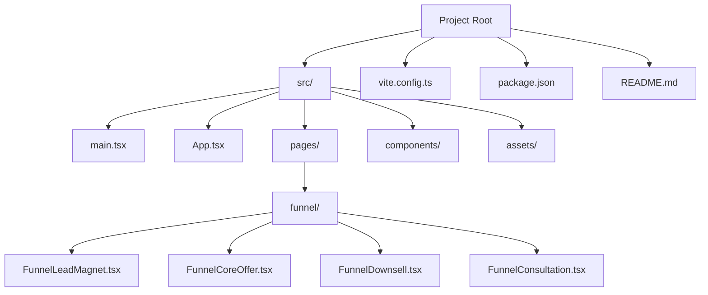
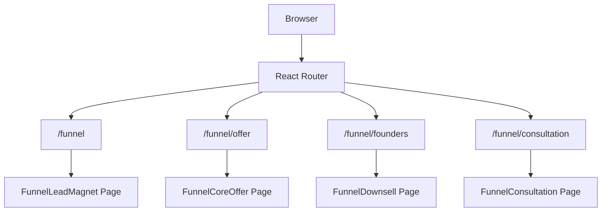
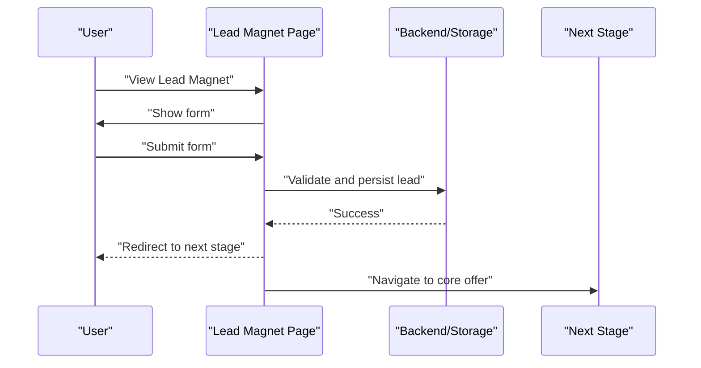
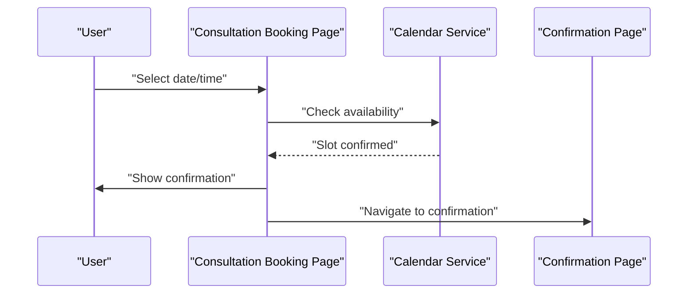
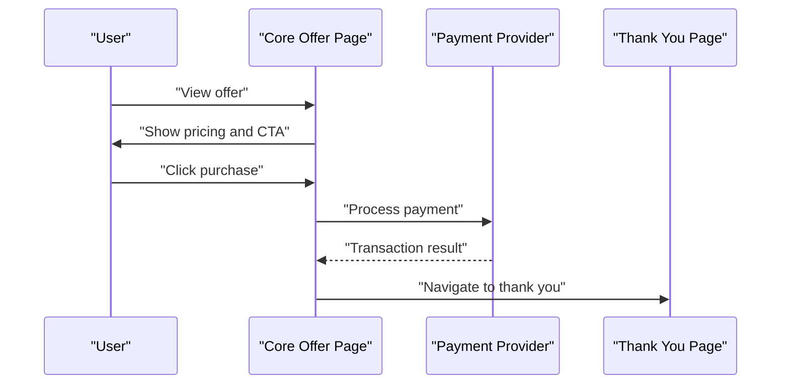
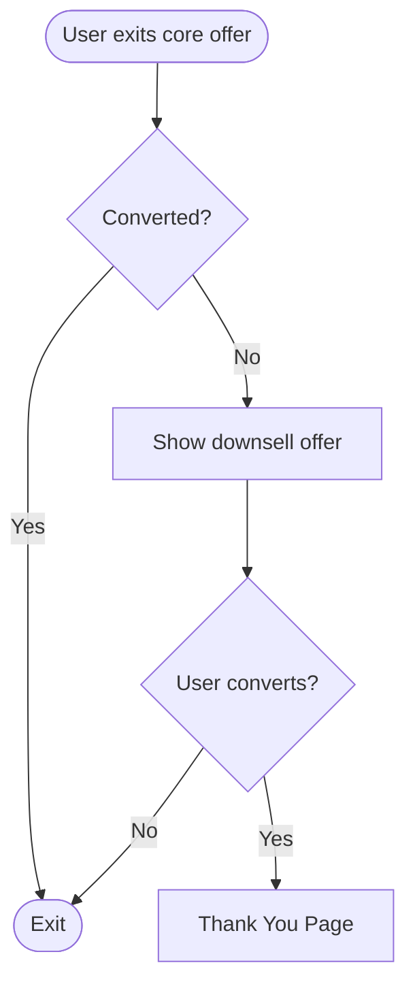
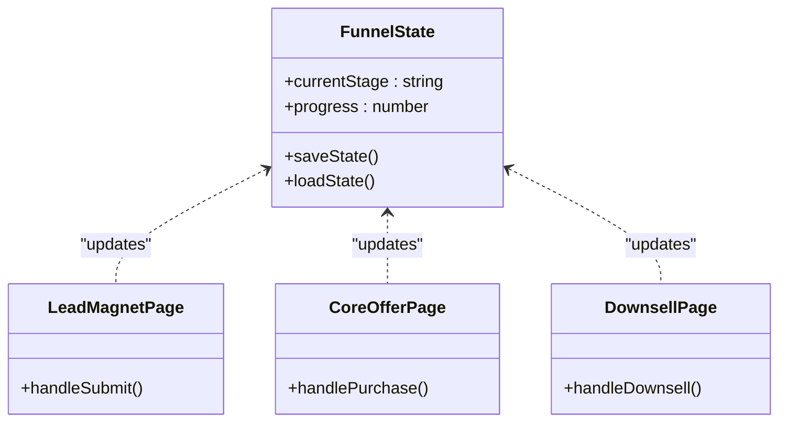
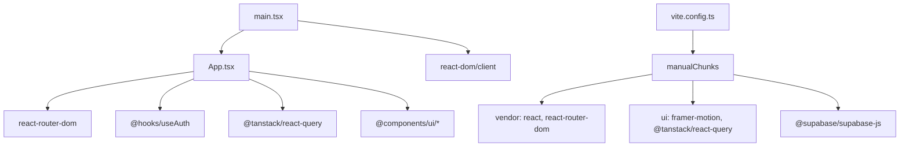

# Sales Funnel Pages

<cite>
**Referenced Files in This Document**
- [README.md](file://README.md)
- [package.json](file://package.json)
- [vite.config.ts](file://vite.config.ts)
- [src/main.tsx](file://src/main.tsx)
- [src/App.tsx](file://src/App.tsx)
</cite>

## Table of Contents
1. [Introduction](#introduction)
2. [Project Structure](#project-structure)
3. [Core Components](#core-components)
4. [Architecture Overview](#architecture-overview)
5. [Detailed Component Analysis](#detailed-component-analysis)
6. [Dependency Analysis](#dependency-analysis)
7. [Performance Considerations](#performance-considerations)
8. [Troubleshooting Guide](#troubleshooting-guide)
9. [Conclusion](#conclusion)
10. [Appendices](#appendices)

## Introduction
This document explains the sales funnel implementation and conversion optimization pages for the project. The funnel follows a classic lead-to-sale progression: lead magnet capture, consultation booking, core offer presentation, and downsell conversion. The application is a React-based single-page application using routing to present funnel stages and other marketing/ecommerce pages. The funnel routes are defined in the application’s routing configuration, enabling structured user journeys and analytics-friendly URLs.

## Project Structure
The project is a Vite + React application with TypeScript and Tailwind CSS. Routing is handled by React Router DOM, and global providers include authentication and query caching. The funnel pages are lazily loaded to optimize initial load performance.

**Diagram sources**
- [src/App.tsx:77-80](file://src/App.tsx#L77-L80)
- [src/App.tsx:24-27](file://src/App.tsx#L24-L27)
- [vite.config.ts:26-30](file://vite.config.ts#L26-L30)

**Section sources**
- [README.md:53-74](file://README.md#L53-L74)
- [package.json:1-95](file://package.json#L1-L95)
- [vite.config.ts:1-43](file://vite.config.ts#L1-L43)
- [src/main.tsx:1-7](file://src/main.tsx#L1-L7)
- [src/App.tsx:113-124](file://src/App.tsx#L113-L124)

## Core Components
- Routing and Lazy Loading: Funnel pages are imported lazily to reduce initial bundle size and improve perceived performance.
- Providers: Authentication provider, query client provider, and tooltip provider wrap the app to support funnel features like cart synchronization, user state, and UI interactions.
- Funnel Routes: Dedicated routes for lead magnet, core offer, downsell, and consultation booking enable clear navigation and deep-linking.

Implementation highlights:
- Lazy route definitions for funnel pages are declared alongside other pages.
- The funnel routes are mounted under the "/funnel" namespace, aligning with the funnel architecture.
- Global providers ensure consistent state and UX across funnel stages.

**Section sources**
- [src/App.tsx:11-51](file://src/App.tsx#L11-L51)
- [src/App.tsx:77-80](file://src/App.tsx#L77-L80)
- [src/App.tsx:113-121](file://src/App.tsx#L113-L121)

## Architecture Overview
The funnel architecture is URL-driven and page-based. Users move through stages by navigating between funnel routes. Each stage is a separate page component that encapsulates its own form, content, and conversion logic. The router ensures deterministic navigation and supports analytics tagging and A/B testing by treating each stage as a distinct page.

**Diagram sources**
- [src/App.tsx:77-80](file://src/App.tsx#L77-L80)

## Detailed Component Analysis
This section outlines the funnel stages and recommended implementation patterns. While the actual page components are not included in this repository snapshot, the routing and structure provide a clear blueprint for building each stage.

### Funnel Lead Magnet Stage
Purpose: Capture contact information in exchange for a lead magnet to seed the funnel.
Recommended implementation pattern:
- Landing page with headline, value proposition, and opt-in form.
- Form validation and submission handling using a form library.
- Redirect to the next stage upon successful submission.
- Analytics: track form views, submissions, and conversion rates per variant.

**Diagram sources**
- [src/App.tsx:77-77](file://src/App.tsx#L77-L77)

### Funnel Consultation Booking Stage
Purpose: Schedule a free consultation to qualify leads and increase conversion.
Recommended implementation pattern:
- Calendar integration and timezone handling.
- Pre-call questionnaire to gather context.
- Confirmation page with next steps and upsell/downsell messaging.

**Diagram sources**
- [src/App.tsx:80-80](file://src/App.tsx#L80-L80)

### Funnel Core Offer Presentation Stage
Purpose: Present the primary product/service with persuasive copy, testimonials, and urgency cues.
Recommended implementation pattern:
- Clear pricing display and payment flow.
- Social proof and scarcity messaging.
- One-click upsell or cross-sell options.

**Diagram sources**
- [src/App.tsx:79-79](file://src/App.tsx#L79-L79)

### Funnel Downsell Conversion Stage
Purpose: Present a lower-priced alternative to convert users who did not purchase the core offer.
Recommended implementation pattern:
- Emphasize value and savings.
- Use dynamic content to personalize the downsell offer.
- Track conversion lift and adjust messaging.

**Diagram sources**
- [src/App.tsx:79-79](file://src/App.tsx#L79-L79)

### Funnel Layout System and Progress Tracking
Recommended implementation pattern:
- Centralized funnel state management to track current stage and user progress.
- Progress indicators and breadcrumbs to guide users.
- Persistent storage of funnel state to resume interrupted journeys.

[No sources needed since this diagram shows conceptual workflow, not actual code structure]

### User Journey Optimization
- Navigation: Ensure clear CTAs and minimal friction between stages.
- Personalization: Use behavioral data to tailor messaging and offers.
- Retargeting: Integrate with analytics and advertising platforms to re-engage lapsed users.

[No sources needed since this section doesn't analyze specific files]

## Dependency Analysis
The application leverages a set of modern frontend dependencies that support the funnel implementation and optimization needs.

**Diagram sources**
- [src/App.tsx:6-8](file://src/App.tsx#L6-L8)
- [src/main.tsx:1-3](file://src/main.tsx#L1-L3)
- [vite.config.ts:34-38](file://vite.config.ts#L34-L38)
- [package.json:15-69](file://package.json#L15-L69)

**Section sources**
- [package.json:15-69](file://package.json#L15-L69)
- [vite.config.ts:31-41](file://vite.config.ts#L31-L41)
- [src/App.tsx:6-8](file://src/App.tsx#L6-L8)

## Performance Considerations
- Lazy loading: Funnel pages are lazy-loaded to minimize initial payload and improve first paint.
- Code splitting: Vite manual chunks separate vendor, UI, and Supabase dependencies for efficient caching.
- Image optimization: Built-in image optimization reduces asset sizes without sacrificing quality.
- React hydration: Ensure server-side rendering or proper hydration is configured if deploying to static hosting.

[No sources needed since this section provides general guidance]

## Troubleshooting Guide
- Routing issues: Verify that funnel routes are defined and ordered correctly in the route tree to avoid conflicts with catch-all routes.
- Provider order: Ensure authentication and query providers wrap the routing layer to maintain state across funnel transitions.
- Dev server: Use the provided development script to run the app locally and test funnel navigation end-to-end.

**Section sources**
- [src/App.tsx:104-106](file://src/App.tsx#L104-L106)
- [src/App.tsx:113-121](file://src/App.tsx#L113-L121)
- [README.md:25-37](file://README.md#L25-L37)

## Conclusion
The application provides a solid foundation for a sales funnel by structuring funnel stages as dedicated, lazy-loaded pages behind a clean routing scheme. By implementing stage-specific conversion strategies, progress tracking, and performance optimizations, teams can build effective lead-to-sale funnels that scale and adapt to user behavior.

[No sources needed since this section summarizes without analyzing specific files]

## Appendices
- Compliance considerations: Include privacy policy, terms of service, and CCPA links as part of the funnel footer or legal notices to meet regulatory requirements.
- Mobile optimization: Use responsive design patterns and mobile-first forms to improve conversion on smaller screens.
- A/B testing: Treat each funnel stage as a separate experiment and track key metrics such as conversion rate, time-on-page, and bounce rate to inform iterative improvements.

[No sources needed since this section provides general guidance]