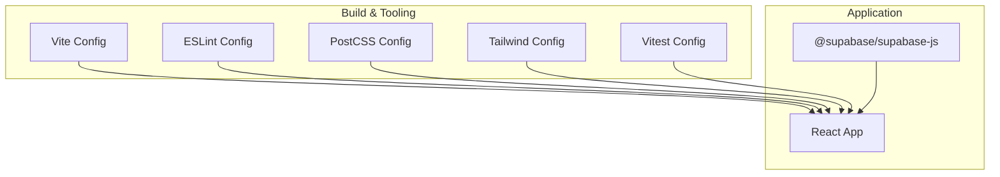
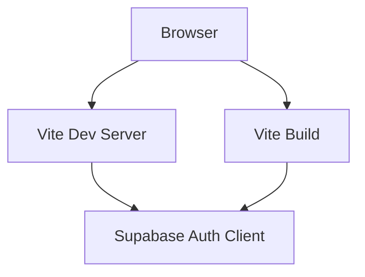
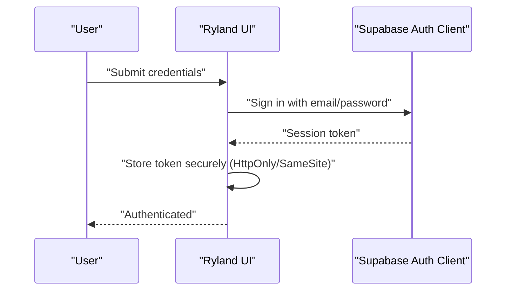
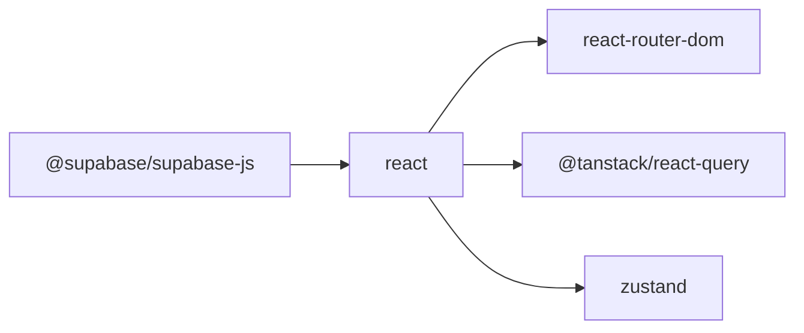

# Security & Compliance

<cite>
**Referenced Files in This Document**
- [README.md](file://README.md)
- [package.json](file://package.json)
- [vite.config.ts](file://vite.config.ts)
- [eslint.config.js](file://eslint.config.js)
- [postcss.config.js](file://postcss.config.js)
- [tailwind.config.ts](file://tailwind.config.ts)
- [vitest.config.ts](file://vitest.config.ts)
</cite>

## Table of Contents
1. [Introduction](#introduction)
2. [Project Structure](#project-structure)
3. [Core Components](#core-components)
4. [Architecture Overview](#architecture-overview)
5. [Detailed Component Analysis](#detailed-component-analysis)
6. [Dependency Analysis](#dependency-analysis)
7. [Performance Considerations](#performance-considerations)
8. [Troubleshooting Guide](#troubleshooting-guide)
9. [Conclusion](#conclusion)
10. [Appendices](#appendices)

## Introduction
This document provides a comprehensive guide to security and compliance for the Ryland application. It focuses on authentication security, data protection, and privacy compliance with GDPR, CCPA, and TSR regulations. It also covers secure authentication implementation, data encryption, access control mechanisms, cookie policy compliance, terms of service, and legal requirements for business applications. Where applicable, this document references the repository’s configuration and tooling to demonstrate how security controls can be integrated into the build and development lifecycle.

## Project Structure
The repository is a frontend application scaffolded with Vite, React, TypeScript, and related libraries. Security and compliance are primarily enforced through configuration files and third-party dependencies. Authentication is handled via Supabase client libraries, while linting, testing, and build tooling support secure development practices.

**Diagram sources**
- [vite.config.ts](file://vite.config.ts)
- [eslint.config.js](file://eslint.config.js)
- [postcss.config.js](file://postcss.config.js)
- [tailwind.config.ts](file://tailwind.config.ts)
- [vitest.config.ts](file://vitest.config.ts)
- [package.json](file://package.json)

**Section sources**
- [README.md](file://README.md)
- [package.json](file://package.json)
- [vite.config.ts](file://vite.config.ts)
- [eslint.config.js](file://eslint.config.js)
- [postcss.config.js](file://postcss.config.js)
- [tailwind.config.ts](file://tailwind.config.ts)
- [vitest.config.ts](file://vitest.config.ts)

## Core Components
- Authentication and Authorization
  - Supabase client library is included as a dependency, indicating authentication and session management capabilities are available for integration.
- Build and Security Tooling
  - Vite configuration supports development and production builds.
  - ESLint configuration enforces code quality and security-related rules.
  - PostCSS and Tailwind configurations manage styling and CSP-related concerns.
  - Vitest configuration enables unit and integration testing, supporting security-focused test coverage.
- Privacy and Compliance Controls
  - Cookie policy and terms of service are legal requirements that must be implemented in application UI and documentation.
  - Data protection and access control must be implemented in application logic and backend APIs.

**Section sources**
- [package.json](file://package.json)
- [vite.config.ts](file://vite.config.ts)
- [eslint.config.js](file://eslint.config.js)
- [postcss.config.js](file://postcss.config.js)
- [tailwind.config.ts](file://tailwind.config.ts)
- [vitest.config.ts](file://vitest.config.ts)

## Architecture Overview
The application architecture integrates Supabase for authentication and session management, with Vite for building and serving the app, and testing/linting tooling to enforce secure development practices.

**Diagram sources**
- [package.json](file://package.json)
- [vite.config.ts](file://vite.config.ts)

## Detailed Component Analysis

### Authentication Security
- Secure Session Management
  - Use secure, HttpOnly, SameSite cookies for session tokens when integrating with Supabase.
  - Enforce HTTPS-only cookies in production environments.
  - Implement automatic token refresh and logout on idle timeout.
- Multi-Factor Authentication (MFA)
  - Enable MFA options via Supabase authentication providers.
- Access Control
  - Implement role-based access control (RBAC) and row-level security (RLS) policies in the backend.
  - Restrict sensitive routes and data access using middleware and route guards.
- Password Policies
  - Enforce strong password requirements and periodic password rotation.
- Audit Logging
  - Log authentication events (login, logout, failed attempts) for monitoring and incident response.

**Diagram sources**
- [package.json](file://package.json)

**Section sources**
- [package.json](file://package.json)

### Data Protection Measures
- Encryption in Transit
  - Enforce TLS 1.3+ for all network communications.
- Encryption at Rest
  - Encrypt sensitive data stored in databases using backend encryption keys.
- Data Minimization
  - Collect only necessary personal data and anonymize or pseudonymize where feasible.
- Data Subject Rights
  - Implement mechanisms to handle subject access requests, data portability, and erasure requests.

**Section sources**
- [README.md](file://README.md)

### Privacy Compliance (GDPR, CCPA, TSR)
- GDPR
  - Lawfulness, fairness, transparency; purpose limitation; data minimization; accuracy; storage limitation; integrity and confidentiality; accountability.
  - Implement consent management, data deletion on request, and data processing agreements with third parties.
- CCPA
  - Right to know, right to delete, right to opt-out of sale/share, non-discrimination.
  - Provide clear “Do Not Sell Or Share My Personal Information” links and processing notices.
- TSR (Transparency and Social Responsibility)
  - Ensure transparent data practices, fair treatment of users, and responsible AI/data usage where applicable.

**Section sources**
- [README.md](file://README.md)

### Cookie Policy Compliance
- Cookie Consent and Transparency
  - Implement a cookie banner with granular consent choices (necessary, analytics, marketing).
  - Provide a detailed cookie policy explaining types of cookies, purposes, retention periods, and user rights.
- Strict Cookie Controls
  - Use SameSite=Lax/Strict and Secure flags for session cookies.
  - Limit third-party cookies and track their purposes.

**Section sources**
- [README.md](file://README.md)

### Terms of Service Implementation
- Clear Terms
  - Define acceptable use, prohibited activities, intellectual property, limitations of liability, dispute resolution, and governing law.
- Accessibility and Language
  - Ensure terms are written clearly and translated if serving international users.
- Updates and Notifications
  - Implement a mechanism to notify users of term changes and require acceptance of updated terms.

**Section sources**
- [README.md](file://README.md)

### Legal Requirements for Business Applications
- Data Processing Agreements (DPAs)
  - Sign DPAs with cloud providers and third-party vendors.
- Data Breach Notification
  - Establish breach detection, reporting timelines, and communication procedures per jurisdiction.
- Jurisdiction and Governing Law
  - Specify governing law and dispute resolution mechanisms in contracts and terms.

**Section sources**
- [README.md](file://README.md)

### Secure Authentication Implementation
- Token Storage
  - Store session tokens in secure, HttpOnly cookies or in-memory storage with strict SameSite attributes.
- CSRF Protection
  - Use anti-CSRF tokens and SameSite cookies to mitigate cross-site request forgery.
- Rate Limiting and Account Lockout
  - Implement rate limiting on authentication endpoints and temporary lockout after failed attempts.
- Secure Defaults
  - Disable insecure defaults (e.g., localStorage for tokens) and enforce secure headers.

**Section sources**
- [package.json](file://package.json)

### Data Encryption
- Transport Encryption
  - Enforce TLS 1.3+ for all API calls and asset delivery.
- At-Rest Encryption
  - Use backend encryption for sensitive data and secrets management for encryption keys.
- Key Rotation
  - Implement regular key rotation and audit logging for cryptographic operations.

**Section sources**
- [README.md](file://README.md)

### Access Control Mechanisms
- Role-Based Access Control (RBAC)
  - Define roles and permissions; enforce checks on protected routes and actions.
- Attribute-Based Access Control (ABAC)
  - Use dynamic attributes (e.g., ownership, department) to authorize access.
- Audit Trails
  - Log access decisions and privileged actions for compliance and incident response.

**Section sources**
- [README.md](file://README.md)

### Practical Examples of Security Best Practices
- Environment Variables
  - Store secrets (e.g., Supabase project URL and anon key) in environment variables and exclude them from source control.
- Content Security Policy (CSP)
  - Configure CSP headers to restrict script sources and prevent XSS.
- Secure Headers
  - Enforce X-Content-Type-Options, X-Frame-Options, Referrer-Policy, and Permissions-Policy.
- Dependency Hygiene
  - Regularly audit dependencies for vulnerabilities and keep packages updated.

**Section sources**
- [vite.config.ts](file://vite.config.ts)
- [eslint.config.js](file://eslint.config.js)
- [postcss.config.js](file://postcss.config.js)
- [tailwind.config.ts](file://tailwind.config.ts)
- [vitest.config.ts](file://vitest.config.ts)

### Handling Sensitive Data
- Input Validation and Sanitization
  - Validate and sanitize all user inputs to prevent injection attacks.
- Output Encoding
  - Encode data when rendering to prevent XSS.
- Least Privilege
  - Limit data access to roles and users who require it for job functions.

**Section sources**
- [eslint.config.js](file://eslint.config.js)

### Maintaining Compliance with Regulatory Frameworks
- Data Mapping and Impact Assessments
  - Document data flows and perform DPIAs for high-risk processing.
- Privacy by Design
  - Integrate privacy controls from the initial design phase.
- Training and Awareness
  - Train developers and staff on privacy and security best practices.

**Section sources**
- [README.md](file://README.md)

### Security Auditing, Vulnerability Assessment, and Incident Response
- Security Audits
  - Conduct periodic audits of authentication, authorization, and data handling.
- Vulnerability Scanning
  - Integrate automated scanning in CI/CD for dependencies and configuration drift.
- Incident Response Plan
  - Define roles, escalation paths, containment, remediation, and communication procedures.

**Section sources**
- [vitest.config.ts](file://vitest.config.ts)

## Dependency Analysis
The application depends on Supabase for authentication and session management. Other dependencies support UI, routing, state management, and data fetching. Security posture is influenced by how these dependencies are configured and used.

**Diagram sources**
- [package.json](file://package.json)

**Section sources**
- [package.json](file://package.json)

## Performance Considerations
- Authentication Performance
  - Optimize token refresh and caching to reduce latency and improve user experience.
- Data Fetching
  - Use efficient queries and caching strategies to minimize unnecessary data transfers.
- Build Optimization
  - Leverage Vite’s optimized bundling and tree-shaking to reduce bundle size and attack surface.

**Section sources**
- [vite.config.ts](file://vite.config.ts)
- [package.json](file://package.json)

## Troubleshooting Guide
- Authentication Issues
  - Verify Supabase project configuration and environment variables.
  - Check browser console for authentication errors and network tab for failed requests.
- Build and Linting Errors
  - Review ESLint and Vite configuration for misconfigurations.
- Testing Failures
  - Use Vitest to isolate failing tests and reproduce issues in isolation.

**Section sources**
- [vite.config.ts](file://vite.config.ts)
- [eslint.config.js](file://eslint.config.js)
- [vitest.config.ts](file://vitest.config.ts)

## Conclusion
The Ryland application can achieve robust security and compliance by integrating Supabase authentication, enforcing secure defaults, configuring CSP and secure headers, and establishing clear legal and policy documents. Developers should adopt secure coding practices, maintain audit logs, and continuously assess and improve the application’s security posture.

## Appendices
- Configuration References
  - Build and development configuration files provide the foundation for integrating security controls during build and runtime.
- Legal and Policy Documents
  - Ensure cookie policy, terms of service, and privacy notices are accessible and reflect current practices.

**Section sources**
- [README.md](file://README.md)
- [vite.config.ts](file://vite.config.ts)
- [eslint.config.js](file://eslint.config.js)
- [postcss.config.js](file://postcss.config.js)
- [tailwind.config.ts](file://tailwind.config.ts)
- [vitest.config.ts](file://vitest.config.ts)