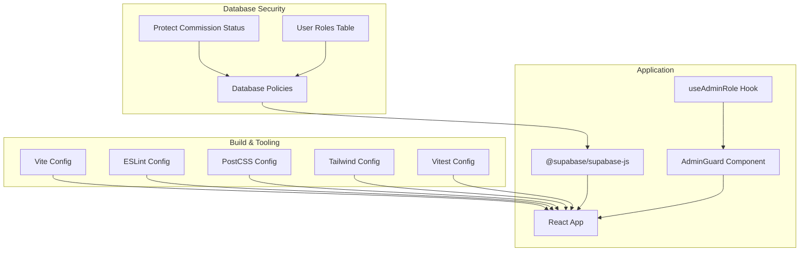
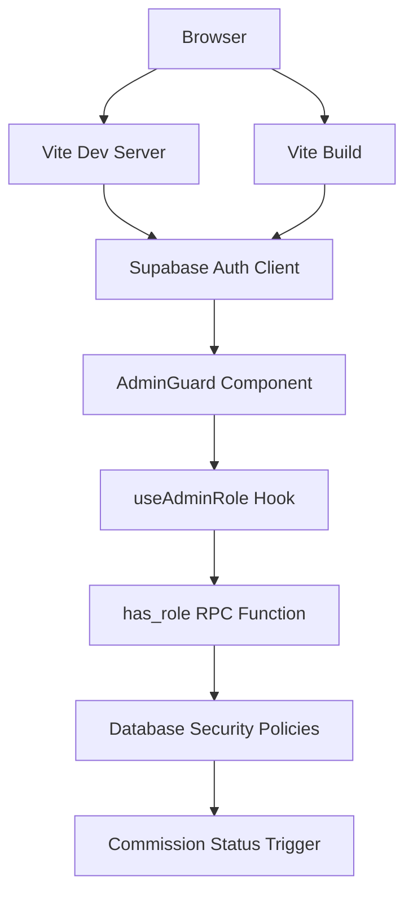
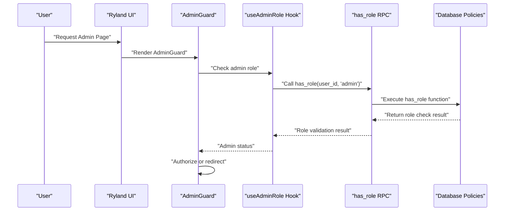
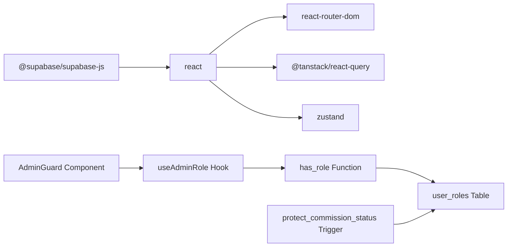

# Security & Compliance

<cite>
**Referenced Files in This Document**
- [README.md](file://README.md)
- [package.json](file://package.json)
- [vite.config.ts](file://vite.config.ts)
- [eslint.config.js](file://eslint.config.js)
- [postcss.config.js](file://postcss.config.js)
- [tailwind.config.ts](file://tailwind.config.ts)
- [vitest.config.ts](file://vitest.config.ts)
- [AdminGuard.tsx](file://src/components/admin/AdminGuard.tsx)
- [useAdminRole.ts](file://src/hooks/useAdminRole.ts)
- [AdminAffiliates.tsx](file://src/pages/admin/AdminAffiliates.tsx)
- [20260324201245_4681ef67-2bf0-4686-a4b6-1ae6c54189f9.sql](file://supabase/migrations/20260324201245_4681ef67-2bf0-4686-a4b6-1ae6c54189f9.sql)
- [20260325042306_4ee0e761-11f9-4bbb-a6b4-4438b51fe81b.sql](file://supabase/migrations/20260325042306_4ee0e761-11f9-4bbb-a6b4-4438b51fe81b.sql)
- [20260320000000_admin_policies.sql](file://supabase/migrations/20260320000000_admin_policies.sql)
- [index.ts](file://supabase/functions/ghl-affiliate-webhook/index.ts)
</cite>

## Update Summary
**Changes Made**
- Enhanced database security policies with comprehensive admin role management system
- Added trigger protection for commission_status updates on affiliate_leads
- Implemented robust user_roles table with security policies preventing authenticated users from updating/deleting entries
- Integrated server-side role checking through has_role security function
- Strengthened access control mechanisms with multiple layers of security enforcement

## Table of Contents
1. [Introduction](#introduction)
2. [Project Structure](#project-structure)
3. [Core Components](#core-components)
4. [Architecture Overview](#architecture-overview)
5. [Detailed Component Analysis](#detailed-component-analysis)
6. [Dependency Analysis](#dependency-analysis)
7. [Performance Considerations](#performance-considerations)
8. [Troubleshooting Guide](#troubleshooting-guide)
9. [Conclusion](#conclusion)
10. [Appendices](#appendices)

## Introduction
This document provides a comprehensive guide to security and compliance for the Ryland application. It focuses on authentication security, data protection, and privacy compliance with GDPR, CCPA, and TSR regulations. The application now features enhanced security policies including a comprehensive admin role management system, database-level protections, and trigger-based security enforcement. Where applicable, this document references the repository's configuration and tooling to demonstrate how security controls can be integrated into the build and development lifecycle.

## Project Structure
The repository is a frontend application scaffolded with Vite, React, TypeScript, and related libraries. Security and compliance are primarily enforced through configuration files, Supabase database policies, and custom security functions. Authentication is handled via Supabase client libraries, while comprehensive admin role management and database-level security policies provide robust access control mechanisms.

**Diagram sources**
- [vite.config.ts](file://vite.config.ts)
- [eslint.config.js](file://eslint.config.js)
- [postcss.config.js](file://postcss.config.js)
- [tailwind.config.ts](file://tailwind.config.ts)
- [vitest.config.ts](file://vitest.config.ts)
- [package.json](file://package.json)
- [AdminGuard.tsx](file://src/components/admin/AdminGuard.tsx)
- [useAdminRole.ts](file://src/hooks/useAdminRole.ts)
- [20260324201245_4681ef67-2bf0-4686-a4b6-1ae6c54189f9.sql](file://supabase/migrations/20260324201245_4681ef67-2bf0-4686-a4b6-1ae6c54189f9.sql)
- [20260325042306_4ee0e761-11f9-4bbb-a6b4-4438b51fe81b.sql](file://supabase/migrations/20260325042306_4ee0e761-11f9-4bbb-a6b4-4438b51fe81b.sql)

**Section sources**
- [README.md](file://README.md)
- [package.json](file://package.json)
- [vite.config.ts](file://vite.config.ts)
- [eslint.config.js](file://eslint.config.js)
- [postcss.config.js](file://postcss.config.js)
- [tailwind.config.ts](file://tailwind.config.ts)
- [vitest.config.ts](file://vitest.config.ts)

## Core Components
- **Enhanced Authentication and Authorization**
  - Comprehensive admin role management system with has_role security function
  - Supabase client library for authentication and session management
  - Server-side role validation through database RPC calls
- **Advanced Database Security**
  - User roles table with security policies preventing authenticated users from updating/deleting entries
  - Trigger-based protection for commission_status updates on affiliate_leads
  - Multiple RLS policies across key tables (affiliates, affiliate_leads, commissions, payouts)
- **Build and Security Tooling**
  - Vite configuration supports development and production builds
  - ESLint configuration enforces code quality and security-related rules
  - PostCSS and Tailwind configurations manage styling and CSP-related concerns
  - Vitest configuration enables unit and integration testing, supporting security-focused test coverage
- **Privacy and Compliance Controls**
  - Cookie policy and terms of service are legal requirements that must be implemented in application UI and documentation
  - Data protection and access control must be implemented in application logic and backend APIs

**Section sources**
- [package.json](file://package.json)
- [vite.config.ts](file://vite.config.ts)
- [eslint.config.js](file://eslint.config.js)
- [postcss.config.js](file://postcss.config.js)
- [tailwind.config.ts](file://tailwind.config.ts)
- [vitest.config.ts](file://vitest.config.ts)
- [useAdminRole.ts](file://src/hooks/useAdminRole.ts)
- [AdminGuard.tsx](file://src/components/admin/AdminGuard.tsx)
- [20260324201245_4681ef67-2bf0-4686-a4b6-1ae6c54189f9.sql](file://supabase/migrations/20260324201245_4681ef67-2bf0-4686-a4b6-1ae6c54189f9.sql)
- [20260325042306_4ee0e761-11f9-4bbb-a6b4-4438b51fe81b.sql](file://supabase/migrations/20260325042306_4ee0e761-11f9-4bbb-a6b4-4438b51fe81b.sql)

## Architecture Overview
The application architecture integrates Supabase for authentication and session management, with comprehensive database-level security policies and trigger-based enforcement. The frontend implements admin role guards that delegate role validation to the database through secure RPC calls, ensuring that security decisions are made server-side and cannot be bypassed by client-side manipulation.

**Diagram sources**
- [package.json](file://package.json)
- [vite.config.ts](file://vite.config.ts)
- [AdminGuard.tsx](file://src/components/admin/AdminGuard.tsx)
- [useAdminRole.ts](file://src/hooks/useAdminRole.ts)
- [20260324201245_4681ef67-2bf0-4686-a4b6-1ae6c54189f9.sql](file://supabase/migrations/20260324201245_4681ef67-2bf0-4686-a4b6-1ae6c54189f9.sql)
- [20260325042306_4ee0e761-11f9-4bbb-a6b4-4438b51fe81b.sql](file://supabase/migrations/20260325042306_4ee0e761-11f9-4bbb-a6b4-4438b51fe81b.sql)

## Detailed Component Analysis

### Enhanced Authentication Security
- **Comprehensive Admin Role Management System**
  - Implementation of user_roles table with app_role enum ('admin', 'user')
  - Security definer function has_role() for server-side role validation
  - Policies preventing authenticated users from updating/deleting user_roles entries
  - Client-side useAdminRole hook that always trusts server-side RPC results
- **Secure Session Management**
  - Use secure, HttpOnly, SameSite cookies for session tokens when integrating with Supabase
  - Enforce HTTPS-only cookies in production environments
  - Implement automatic token refresh and logout on idle timeout
- **Multi-Factor Authentication (MFA)**
  - Enable MFA options via Supabase authentication providers
- **Access Control**
  - Implement role-based access control (RBAC) with has_role security function
  - Row-level security (RLS) policies on key tables with admin privileges
  - Restrict sensitive routes and data access using AdminGuard component and route guards
- **Password Policies**
  - Enforce strong password requirements and periodic password rotation
- **Audit Logging**
  - Log authentication events (login, logout, failed attempts) for monitoring and incident response

**Diagram sources**
- [AdminGuard.tsx](file://src/components/admin/AdminGuard.tsx)
- [useAdminRole.ts](file://src/hooks/useAdminRole.ts)
- [20260324201245_4681ef67-2bf0-4686-a4b6-1ae6c54189f9.sql](file://supabase/migrations/20260324201245_4681ef67-2bf0-4686-a4b6-1ae6c54189f9.sql)

**Section sources**
- [AdminGuard.tsx](file://src/components/admin/AdminGuard.tsx)
- [useAdminRole.ts](file://src/hooks/useAdminRole.ts)
- [20260324201245_4681ef67-2bf0-4686-a4b6-1ae6c54189f9.sql](file://supabase/migrations/20260324201245_4681ef67-2bf0-4686-a4b6-1ae6c54189f9.sql)
- [20260325042306_4ee0e761-11f9-4bbb-a6b4-4438b51fe81b.sql](file://supabase/migrations/20260325042306_4ee0e761-11f9-4bbb-a6b4-4438b51fe81b.sql)

### Advanced Database Security Policies
- **User Roles Management**
  - Dedicated user_roles table with UUID primary key and unique constraints
  - Security policies blocking authenticated users from UPDATE/DELETE operations
  - has_role function for server-side role validation with SECURITY DEFINER
- **Trigger-Based Protection**
  - protect_commission_status function prevents non-admin users from changing commission_status
  - enforce_commission_status_admin trigger validates role before UPDATE operations
  - Comprehensive RLS policies across affiliates, affiliate_leads, commissions, and payouts tables
- **Administrative Access Control**
  - AdminGuard component ensures only authorized users access admin routes
  - Server-side RPC calls validate admin status before granting access
  - Multiple indexes optimize admin query performance while maintaining security

**Updated** Enhanced security policies now include comprehensive admin role management with database-level enforcement and trigger-based protection mechanisms.

**Section sources**
- [20260324201245_4681ef67-2bf0-4686-a4b6-1ae6c54189f9.sql](file://supabase/migrations/20260324201245_4681ef67-2bf0-4686-a4b6-1ae6c54189f9.sql)
- [20260325042306_4ee0e761-11f9-4bbb-a6b4-4438b51fe81b.sql](file://supabase/migrations/20260325042306_4ee0e761-11f9-4bbb-a6b4-4438b51fe81b.sql)
- [20260320000000_admin_policies.sql](file://supabase/migrations/20260320000000_admin_policies.sql)

### Data Protection Measures
- **Encryption in Transit**
  - Enforce TLS 1.3+ for all network communications
- **Encryption at Rest**
  - Encrypt sensitive data stored in databases using backend encryption keys
- **Data Minimization**
  - Collect only necessary personal data and anonymize or pseudonymize where feasible
- **Data Subject Rights**
  - Implement mechanisms to handle subject access requests, data portability, and erasure requests

**Section sources**
- [README.md](file://README.md)

### Privacy Compliance (GDPR, CCPA, TSR)
- **GDPR**
  - Lawfulness, fairness, transparency; purpose limitation; data minimization; accuracy; storage limitation; integrity and confidentiality; accountability
  - Implement consent management, data deletion on request, and data processing agreements with third parties
- **CCPA**
  - Right to know, right to delete, right to opt-out of sale/share, non-discrimination
  - Provide clear "Do Not Sell Or Share My Personal Information" links and processing notices
- **TSR (Transparency and Social Responsibility)**
  - Ensure transparent data practices, fair treatment of users, and responsible AI/data usage where applicable

**Section sources**
- [README.md](file://README.md)

### Cookie Policy Compliance
- **Cookie Consent and Transparency**
  - Implement a cookie banner with granular consent choices (necessary, analytics, marketing)
  - Provide a detailed cookie policy explaining types of cookies, purposes, retention periods, and user rights
- **Strict Cookie Controls**
  - Use SameSite=Lax/Strict and Secure flags for session cookies
  - Limit third-party cookies and track their purposes

**Section sources**
- [README.md](file://README.md)

### Terms of Service Implementation
- **Clear Terms**
  - Define acceptable use, prohibited activities, intellectual property, limitations of liability, dispute resolution, and governing law
- **Accessibility and Language**
  - Ensure terms are written clearly and translated if serving international users
- **Updates and Notifications**
  - Implement a mechanism to notify users of term changes and require acceptance of updated terms

**Section sources**
- [README.md](file://README.md)

### Legal Requirements for Business Applications
- **Data Processing Agreements (DPAs)**
  - Sign DPAs with cloud providers and third-party vendors
- **Data Breach Notification**
  - Establish breach detection, reporting timelines, and communication procedures per jurisdiction
- **Jurisdiction and Governing Law**
  - Specify governing law and dispute resolution mechanisms in contracts and terms

**Section sources**
- [README.md](file://README.md)

### Secure Authentication Implementation
- **Token Storage**
  - Store session tokens in secure, HttpOnly cookies or in-memory storage with strict SameSite attributes
- **CSRF Protection**
  - Use anti-CSRF tokens and SameSite cookies to mitigate cross-site request forgery
- **Rate Limiting and Account Lockout**
  - Implement rate limiting on authentication endpoints and temporary lockout after failed attempts
- **Secure Defaults**
  - Disable insecure defaults (e.g., localStorage for tokens) and enforce secure headers

**Section sources**
- [package.json](file://package.json)

### Data Encryption
- **Transport Encryption**
  - Enforce TLS 1.3+ for all API calls and asset delivery
- **At-Rest Encryption**
  - Use backend encryption for sensitive data and secrets management for encryption keys
- **Key Rotation**
  - Implement regular key rotation and audit logging for cryptographic operations

**Section sources**
- [README.md](file://README.md)

### Access Control Mechanisms
- **Enhanced Role-Based Access Control (RBAC)**
  - Comprehensive user_roles table with has_role security function
  - Multiple RLS policies across key application tables
  - Server-side role validation through database RPC calls
- **Attribute-Based Access Control (ABAC)**
  - Use dynamic attributes (e.g., ownership, department) to authorize access
- **Audit Trails**
  - Log access decisions and privileged actions for compliance and incident response

**Updated** Access control now includes comprehensive admin role management with database-level enforcement and trigger-based security mechanisms.

**Section sources**
- [20260324201245_4681ef67-2bf0-4686-a4b6-1ae6c54189f9.sql](file://supabase/migrations/20260324201245_4681ef67-2bf0-4686-a4b6-1ae6c54189f9.sql)
- [20260325042306_4ee0e761-11f9-4bbb-a6b4-4438b51fe81b.sql](file://supabase/migrations/20260325042306_4ee0e761-11f9-4bbb-a6b4-4438b51fe81b.sql)

### Practical Examples of Security Best Practices
- **Environment Variables**
  - Store secrets (e.g., Supabase project URL and anon key) in environment variables and exclude them from source control
- **Content Security Policy (CSP)**
  - Configure CSP headers to restrict script sources and prevent XSS
- **Secure Headers**
  - Enforce X-Content-Type-Options, X-Frame-Options, Referrer-Policy, and Permissions-Policy
- **Dependency Hygiene**
  - Regularly audit dependencies for vulnerabilities and keep packages updated
- **Server-Side Role Validation**
  - Always delegate role checks to the database through RPC calls rather than trusting client-side metadata

**Updated** Added server-side role validation as a critical security practice, emphasizing the importance of never trusting client-side metadata for security decisions.

**Section sources**
- [vite.config.ts](file://vite.config.ts)
- [eslint.config.js](file://eslint.config.js)
- [postcss.config.js](file://postcss.config.js)
- [tailwind.config.ts](file://tailwind.config.ts)
- [vitest.config.ts](file://vitest.config.ts)
- [useAdminRole.ts](file://src/hooks/useAdminRole.ts)

### Handling Sensitive Data
- **Input Validation and Sanitization**
  - Validate and sanitize all user inputs to prevent injection attacks
- **Output Encoding**
  - Encode data when rendering to prevent XSS
- **Least Privilege**
  - Limit data access to roles and users who require it for job functions
- **Trigger-Based Data Protection**
  - Use database triggers to prevent unauthorized modifications to sensitive fields like commission_status

**Updated** Enhanced with trigger-based data protection mechanisms that provide database-level enforcement of security policies.

**Section sources**
- [eslint.config.js](file://eslint.config.js)
- [20260325042306_4ee0e761-11f9-4bbb-a6b4-4438b51fe81b.sql](file://supabase/migrations/20260325042306_4ee0e761-11f9-4bbb-a6b4-4438b51fe81b.sql)

### Maintaining Compliance with Regulatory Frameworks
- **Data Mapping and Impact Assessments**
  - Document data flows and perform DPIAs for high-risk processing
- **Privacy by Design**
  - Integrate privacy controls from the initial design phase
- **Training and Awareness**
  - Train developers and staff on privacy and security best practices
- **Security by Design**
  - Implement comprehensive security policies at the database level with multiple enforcement points

**Updated** Enhanced with database-level security policies and trigger-based enforcement as part of privacy by design implementation.

**Section sources**
- [README.md](file://README.md)

### Security Auditing, Vulnerability Assessment, and Incident Response
- **Security Audits**
  - Conduct periodic audits of authentication, authorization, and data handling
  - Regularly review database policies and trigger functions for security effectiveness
- **Vulnerability Scanning**
  - Integrate automated scanning in CI/CD for dependencies and configuration drift
- **Incident Response Plan**
  - Define roles, escalation paths, containment, remediation, and communication procedures
- **Database Security Monitoring**
  - Monitor role assignment changes and trigger execution for suspicious activity

**Updated** Added database security monitoring as part of comprehensive security auditing and incident response procedures.

**Section sources**
- [vitest.config.ts](file://vitest.config.ts)
- [20260324201245_4681ef67-2bf0-4686-a4b6-1ae6c54189f9.sql](file://supabase/migrations/20260324201245_4681ef67-2bf0-4686-a4b6-1ae6c54189f9.sql)
- [20260325042306_4ee0e761-11f9-4bbb-a6b4-4438b51fe81b.sql](file://supabase/migrations/20260325042306_4ee0e761-11f9-4bbb-a6b4-4438b51fe81b.sql)

## Dependency Analysis
The application depends on Supabase for authentication and session management, with enhanced database security through custom policies and triggers. The frontend components integrate with the database through secure RPC calls and role validation functions. Other dependencies support UI, routing, state management, and data fetching. Security posture is significantly strengthened by the combination of client-side guards and server-side database enforcement.

**Diagram sources**
- [package.json](file://package.json)
- [AdminGuard.tsx](file://src/components/admin/AdminGuard.tsx)
- [useAdminRole.ts](file://src/hooks/useAdminRole.ts)
- [20260324201245_4681ef67-2bf0-4686-a4b6-1ae6c54189f9.sql](file://supabase/migrations/20260324201245_4681ef67-2bf0-4686-a4b6-1ae6c54189f9.sql)
- [20260325042306_4ee0e761-11f9-4bbb-a6b4-4438b51fe81b.sql](file://supabase/migrations/20260325042306_4ee0e761-11f9-4bbb-a6b4-4438b51fe81b.sql)

**Section sources**
- [package.json](file://package.json)

## Performance Considerations
- **Authentication Performance**
  - Optimize token refresh and caching to reduce latency and improve user experience
  - Server-side role validation through RPC calls adds minimal overhead while providing security benefits
- **Database Query Optimization**
  - Multiple indexes on status columns improve admin query performance
  - Efficient RLS policies minimize query execution overhead
- **Data Fetching**
  - Use efficient queries and caching strategies to minimize unnecessary data transfers
- **Build Optimization**
  - Leverage Vite's optimized bundling and tree-shaking to reduce bundle size and attack surface

**Updated** Enhanced with considerations for database performance optimization through strategic indexing and efficient RLS policies.

**Section sources**
- [vite.config.ts](file://vite.config.ts)
- [package.json](file://package.json)
- [20260320000000_admin_policies.sql](file://supabase/migrations/20260320000000_admin_policies.sql)

## Troubleshooting Guide
- **Authentication Issues**
  - Verify Supabase project configuration and environment variables
  - Check browser console for authentication errors and network tab for failed requests
  - Ensure has_role function is properly deployed and accessible
- **Admin Role Issues**
  - Verify user_roles table contains correct role assignments
  - Check that protect_commission_status trigger is active and functioning
  - Review AdminGuard component for proper role validation
- **Build and Linting Errors**
  - Review ESLint and Vite configuration for misconfigurations
- **Testing Failures**
  - Use Vitest to isolate failing tests and reproduce issues in isolation
- **Database Security Issues**
  - Verify RLS policies are enabled and properly configured
  - Check trigger functions for syntax errors or permission issues

**Updated** Added troubleshooting guidance for database security components including user_roles table, has_role function, and protect_commission_status trigger.

**Section sources**
- [vite.config.ts](file://vite.config.ts)
- [eslint.config.js](file://eslint.config.js)
- [vitest.config.ts](file://vitest.config.ts)
- [useAdminRole.ts](file://src/hooks/useAdminRole.ts)
- [AdminGuard.tsx](file://src/components/admin/AdminGuard.tsx)
- [20260324201245_4681ef67-2bf0-4686-a4b6-1ae6c54189f9.sql](file://supabase/migrations/20260324201245_4681ef67-2bf0-4686-a4b6-1ae6c54189f9.sql)
- [20260325042306_4ee0e761-11f9-4bbb-a6b4-4438b51fe81b.sql](file://supabase/migrations/20260325042306_4ee0e761-11f9-4bbb-a6b4-4438b51fe81b.sql)

## Conclusion
The Ryland application achieves robust security and compliance through a multi-layered approach combining frontend admin guards, server-side role validation, comprehensive database policies, and trigger-based enforcement mechanisms. The enhanced security system provides strong protection against unauthorized access while maintaining flexibility for legitimate administrative operations. Developers should adopt secure coding practices, maintain audit logs, continuously assess and improve the application's security posture, and leverage the comprehensive database-level security controls for optimal protection.

## Appendices
- **Configuration References**
  - Build and development configuration files provide the foundation for integrating security controls during build and runtime
  - Database security policies and triggers provide additional layers of protection beyond client-side controls
- **Legal and Policy Documents**
  - Ensure cookie policy, terms of service, and privacy notices are accessible and reflect current practices
  - Database security policies should be documented and audited regularly for compliance

**Updated** Enhanced with database security policy documentation and trigger-based enforcement mechanisms as part of comprehensive security controls.

**Section sources**
- [README.md](file://README.md)
- [vite.config.ts](file://vite.config.ts)
- [eslint.config.js](file://eslint.config.js)
- [postcss.config.js](file://postcss.config.js)
- [tailwind.config.ts](file://tailwind.config.ts)
- [vitest.config.ts](file://vitest.config.ts)
- [20260324201245_4681ef67-2bf0-4686-a4b6-1ae6c54189f9.sql](file://supabase/migrations/20260324201245_4681ef67-2bf0-4686-a4b6-1ae6c54189f9.sql)
- [20260325042306_4ee0e761-11f9-4bbb-a6b4-4438b51fe81b.sql](file://supabase/migrations/20260325042306_4ee0e761-11f9-4bbb-a6b4-4438b51fe81b.sql)