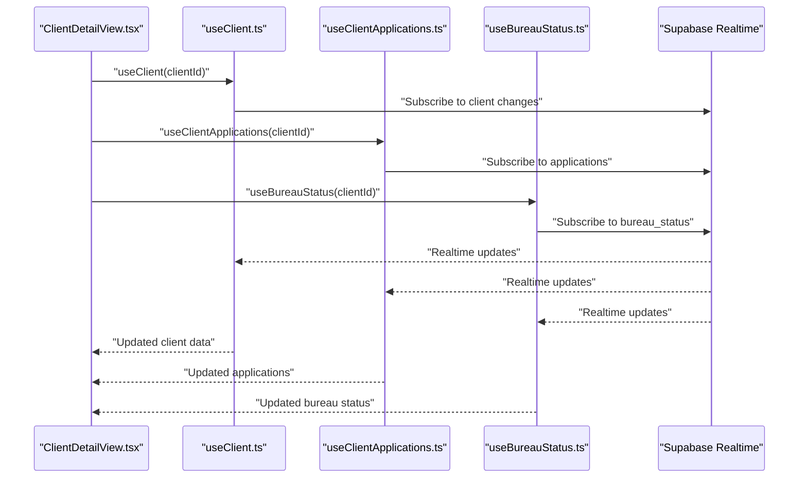
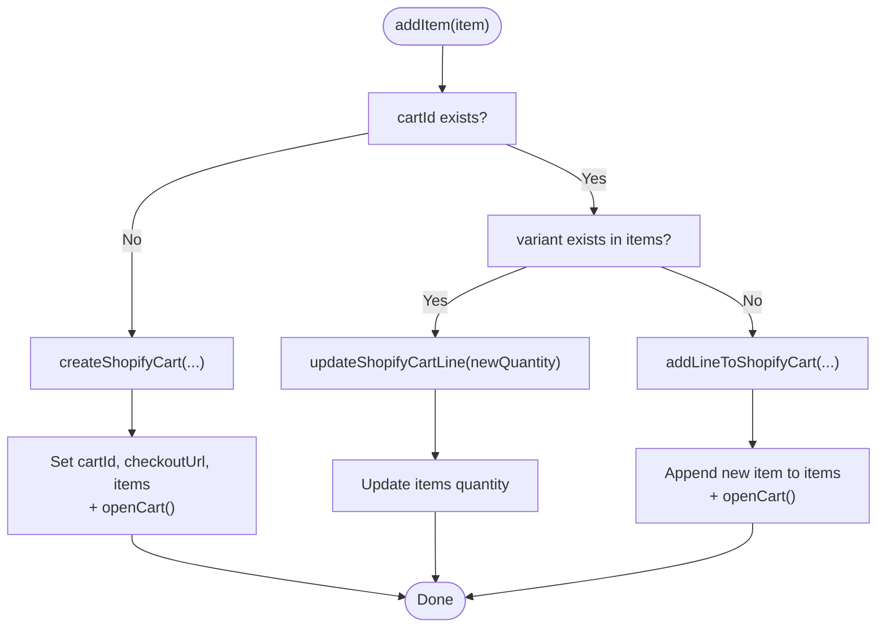
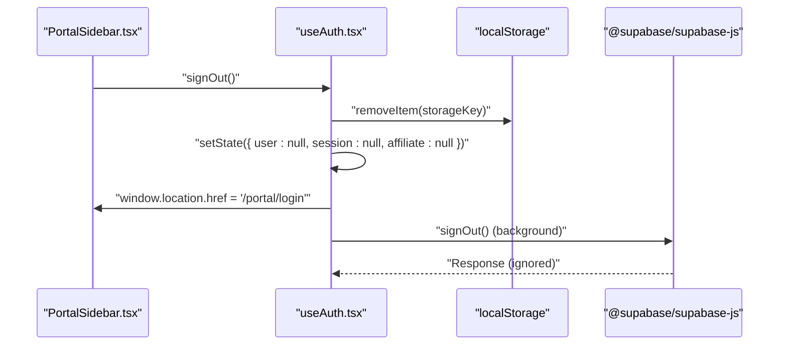
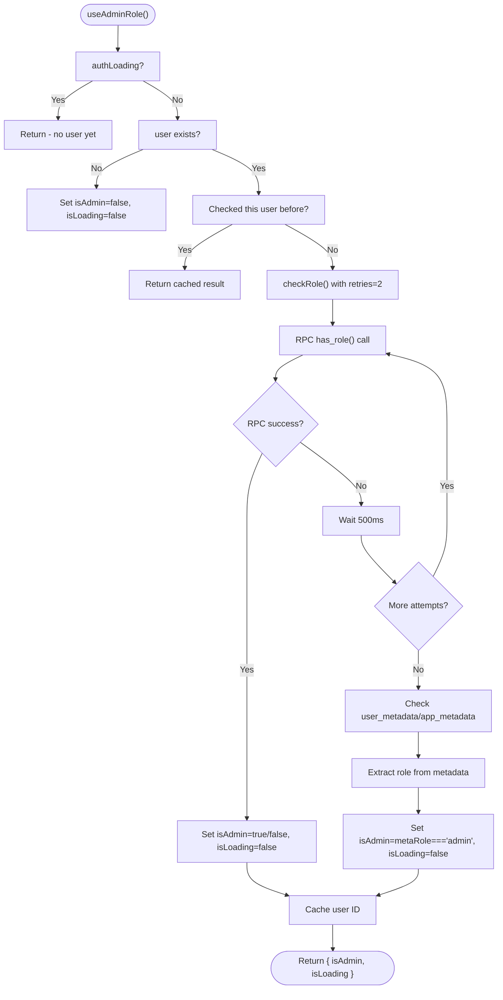
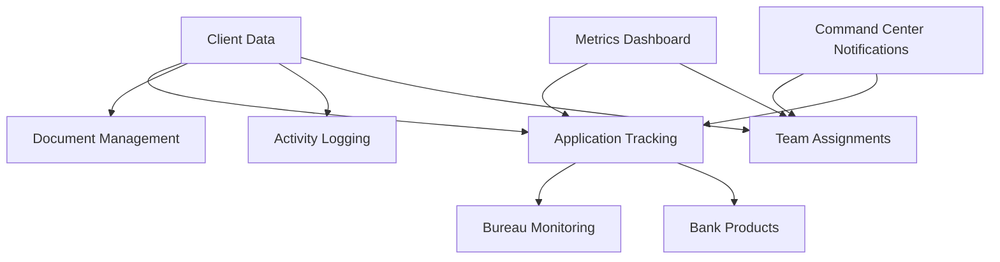
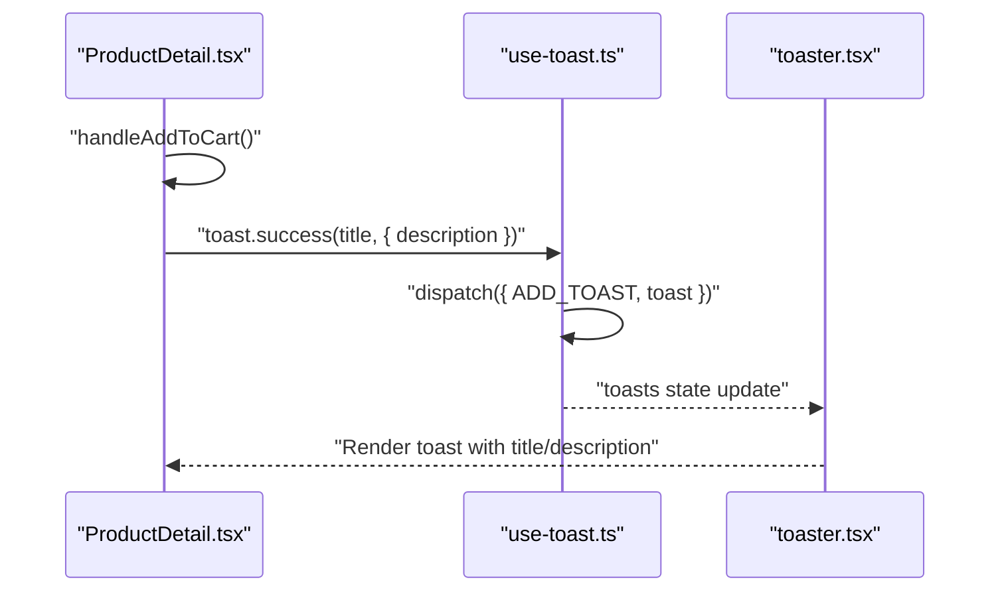
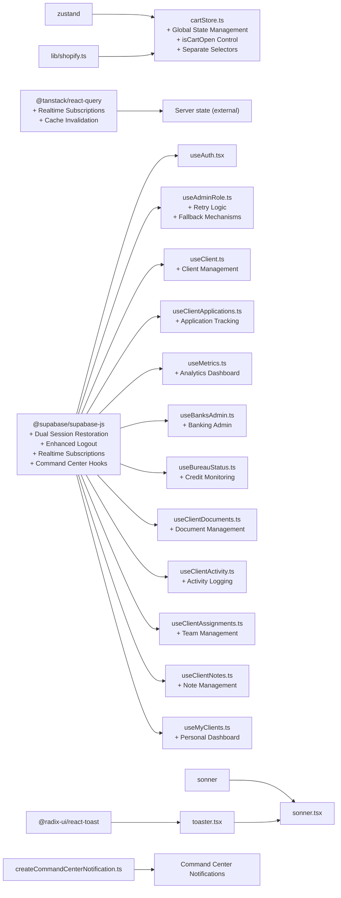

# State Management

<cite>
**Referenced Files in This Document**
- [package.json](file://package.json)
- [README.md](file://README.md)
- [src/main.tsx](file://src/main.tsx)
- [src/App.tsx](file://src/App.tsx)
- [src/stores/cartStore.ts](file://src/stores/cartStore.ts)
- [src/hooks/useCartSync.ts](file://src/hooks/useCartSync.ts)
- [src/lib/shopify.ts](file://src/lib/shopify.ts)
- [src/hooks/useAuth.tsx](file://src/hooks/useAuth.tsx)
- [src/hooks/useAdminRole.ts](file://src/hooks/useAdminRole.ts)
- [src/pages/ProductDetail.tsx](file://src/pages/ProductDetail.tsx)
- [src/components/ui/sonner.tsx](file://src/components/ui/sonner.tsx)
- [src/hooks/use-toast.ts](file://src/hooks/use-toast.ts)
- [src/components/ui/toaster.tsx](file://src/components/ui/toaster.tsx)
- [src/components/CartDrawer.tsx](file://src/components/CartDrawer.tsx)
- [src/pages/Store.tsx](file://src/pages/Store.tsx)
- [src/components/ui/toast.tsx](file://src/components/ui/toast.tsx)
- [src/components/portal/AuthGuard.tsx](file://src/components/portal/AuthGuard.tsx)
- [src/components/portal/PortalSidebar.tsx](file://src/components/portal/PortalSidebar.tsx)
- [src/pages/portal/PortalLogin.tsx](file://src/pages/portal/PortalLogin.tsx)
- [src/hooks/useClient.ts](file://src/hooks/useClient.ts)
- [src/hooks/useClientApplications.ts](file://src/hooks/useClientApplications.ts)
- [src/hooks/useMetrics.ts](file://src/hooks/useMetrics.ts)
- [src/hooks/useBanksAdmin.ts](file://src/hooks/useBanksAdmin.ts)
- [src/hooks/useBureauStatus.ts](file://src/hooks/useBureauStatus.ts)
- [src/hooks/useClientActivity.ts](file://src/hooks/useClientActivity.ts)
- [src/hooks/useClientAssignments.ts](file://src/hooks/useClientAssignments.ts)
- [src/hooks/useClientDocuments.ts](file://src/hooks/useClientDocuments.ts)
- [src/hooks/useClientNotes.ts](file://src/hooks/useClientNotes.ts)
- [src/hooks/useMyClients.ts](file://src/hooks/useMyClients.ts)
- [src/utils/createCommandCenterNotification.ts](file://src/utils/createCommandCenterNotification.ts)
</cite>

## Update Summary
**Changes Made**
- Expanded state management architecture with comprehensive Command Center hook library
- Added specialized hooks for client management, applications, metrics, banking administration, and bureau status
- Integrated Supabase Realtime subscriptions for live state synchronization
- Implemented comprehensive client lifecycle management with activity logging and notifications
- Enhanced metrics dashboard with performance analytics and reporting capabilities
- Added document management system with upload, replace, and version control
- Integrated notification system for Command Center activities and alerts

## Table of Contents
1. [Introduction](#introduction)
2. [Project Structure](#project-structure)
3. [Core Components](#core-components)
4. [Architecture Overview](#architecture-overview)
5. [Detailed Component Analysis](#detailed-component-analysis)
6. [Dependency Analysis](#dependency-analysis)
7. [Performance Considerations](#performance-considerations)
8. [Troubleshooting Guide](#troubleshooting-guide)
9. [Conclusion](#conclusion)

## Introduction
This document explains the state management architecture in the Ryland application. The system uses a dual-state approach:
- Local state managed by Zustand for client-side concerns such as the shopping cart and UI state.
- Server state managed by React Query for remote data fetching, caching, and synchronization with Supabase.

The architecture now includes comprehensive Command Center functionality with specialized hooks for client management, applications, metrics, banking administration, and bureau status management. It documents cart state management, authentication state handling, toast notification system, and the expanded hook library for advanced state management patterns.

**Updated** The state management system now encompasses a complete Command Center ecosystem with specialized hooks for client lifecycle management, application tracking, metrics analytics, document management, and real-time notifications. The architecture leverages Supabase Realtime subscriptions for live state synchronization and implements comprehensive activity logging for audit trails.

## Project Structure
The project is a React + TypeScript application using Vite. State management is implemented through:
- Zustand stores under src/stores/ with enhanced selector functions and controlled component patterns
- Comprehensive hook library under src/hooks/ including specialized Command Center hooks
- UI toast components under src/components/ui/
- Supabase integration under src/integrations/supabase/ with Realtime subscriptions
- Command Center utilities under src/utils/ for notifications and formatting

```mermaid
graph TB
subgraph "UI Layer"
PD["ProductDetail.tsx<br/>+ Auto-open Pattern"]
CD["CartDrawer.tsx<br/>+ Controlled Component"]
SONNER["components/ui/sonner.tsx"]
TOASTER["components/ui/toaster.tsx"]
PS["PortalSidebar.tsx"]
PL["PortalLogin.tsx"]
AG["AuthGuard.tsx"]
END
subgraph "Enhanced State Stores"
CART["stores/cartStore.ts<br/>+ Global State Management<br/>+ isCartOpen Control<br/>+ Separate Selectors"]
AUTH["hooks/useAuth.tsx<br/>+ Dual Session Restoration<br/>+ Enhanced Logout"]
ADMINROLE["hooks/useAdminRole.ts<br/>+ Retry Logic<br/>+ Fallback Mechanisms"]
END
subgraph "Command Center Hooks"
CLIENT["hooks/useClient.ts<br/>+ Client Management<br/>+ Stage Tracking"]
APPS["hooks/useClientApplications.ts<br/>+ Application Lifecycle<br/>+ Bureau Status"]
METRICS["hooks/useMetrics.ts<br/>+ Analytics Dashboard<br/>+ Performance Metrics"]
BANKS["hooks/useBanksAdmin.ts<br/>+ Banking Administration<br/>+ Product Management"]
BUREAU["hooks/useBureauStatus.ts<br/>+ Credit Monitoring<br/>+ Inquiry Removal"]
DOCS["hooks/useClientDocuments.ts<br/>+ Document Management<br/>+ Version Control"]
ACTIVITY["hooks/useClientActivity.ts<br/>+ Audit Trail<br/>+ Activity Logging"]
ASSIGN["hooks/useClientAssignments.ts<br/>+ Team Management<br/>+ Notifications"]
NOTES["hooks/useClientNotes.ts<br/>+ Client Notes<br/>+ Collaboration"]
MYCLIENTS["hooks/useMyClients.ts<br/>+ Personal Dashboard<br/>+ Filter & Sort"]
END
subgraph "External Services"
SUPABASE["@supabase/supabase-js<br/>+ localStorage Sync<br/>+ Realtime Subscriptions"]
UTILS["utils/createCommandCenterNotification.ts<br/>+ Notification System"]
SHOP["lib/shopify.ts"]
END
PD --> CART
CD --> CART
SONNER --> TOASTER
PS --> AUTH
PL --> AUTH
AG --> AUTH
CART --> SHOP
AUTH --> SUPABASE
ADMINROLE --> SUPABASE
CLIENT --> SUPABASE
APPS --> SUPABASE
METRICS --> SUPABASE
BANKS --> SUPABASE
BUREAU --> SUPABASE
DOCS --> SUPABASE
ACTIVITY --> SUPABASE
ASSIGN --> SUPABASE
NOTES --> SUPABASE
MYCLIENTS --> SUPABASE
UTILS --> SUPABASE
```

**Diagram sources**
- [src/pages/ProductDetail.tsx:210-224](file://src/pages/ProductDetail.tsx#L210-L224)
- [src/components/CartDrawer.tsx:1-215](file://src/components/CartDrawer.tsx#L1-L215)
- [src/components/ui/sonner.tsx:1-27](file://src/components/ui/sonner.tsx#L1-L27)
- [src/components/ui/toaster.tsx:1-24](file://src/components/ui/toaster.tsx#L1-L24)
- [src/stores/cartStore.ts:29-65](file://src/stores/cartStore.ts#L29-L65)
- [src/hooks/useAuth.tsx:71-120](file://src/hooks/useAuth.tsx#L71-L120)
- [src/hooks/useAdminRole.ts:30-62](file://src/hooks/useAdminRole.ts#L30-L62)
- [src/lib/shopify.ts:54-104](file://src/lib/shopify.ts#L54-L104)
- [src/components/portal/PortalSidebar.tsx:41-120](file://src/components/portal/PortalSidebar.tsx#L41-L120)
- [src/pages/portal/PortalLogin.tsx:20-35](file://src/pages/portal/PortalLogin.tsx#L20-L35)
- [src/components/portal/AuthGuard.tsx:10-27](file://src/components/portal/AuthGuard.tsx#L10-L27)
- [src/hooks/useClient.ts:227-278](file://src/hooks/useClient.ts#L227-L278)
- [src/hooks/useClientApplications.ts:484-549](file://src/hooks/useClientApplications.ts#L484-L549)
- [src/hooks/useMetrics.ts:557-563](file://src/hooks/useMetrics.ts#L557-L563)
- [src/hooks/useBanksAdmin.ts:173-244](file://src/hooks/useBanksAdmin.ts#L173-L244)
- [src/hooks/useBureauStatus.ts:278-385](file://src/hooks/useBureauStatus.ts#L278-L385)
- [src/hooks/useClientDocuments.ts:367-437](file://src/hooks/useClientDocuments.ts#L367-L437)
- [src/hooks/useClientActivity.ts:105-136](file://src/hooks/useClientActivity.ts#L105-L136)
- [src/hooks/useClientAssignments.ts:128-179](file://src/hooks/useClientAssignments.ts#L128-L179)
- [src/hooks/useClientNotes.ts:103-143](file://src/hooks/useClientNotes.ts#L103-L143)
- [src/hooks/useMyClients.ts:170-197](file://src/hooks/useMyClients.ts#L170-L197)
- [src/utils/createCommandCenterNotification.ts](file://src/utils/createCommandCenterNotification.ts)

**Section sources**
- [README.md:53-74](file://README.md#L53-L74)
- [package.json:15-95](file://package.json#L15-L95)

## Core Components
- Zustand cart store: Manages cart items, cart ID, checkout URL, loading states, and **enhanced with isCartOpen state management** for controlled cart drawer components. Provides actions to add/update/remove items, synchronize with Shopify, and control cart drawer visibility. **Enhanced** with separate selector functions for improved performance.
- Authentication hook: Implements dual-session restoration using synchronous localStorage checks followed by asynchronous Supabase listeners, with enhanced error handling and AbortController support for affiliate data fetching. **Enhanced** with immediate logout functionality including localStorage cleanup and instant redirect.
- **New** Admin role hook: Implements retry logic for role verification using Supabase RPC calls with fallback mechanisms using user metadata when RPC calls fail.
- **New** Client management hooks: Comprehensive client lifecycle management with stage tracking, assignment management, and activity logging.
- **New** Application tracking hooks: Full application lifecycle management including status updates, bureau status monitoring, and automated task creation.
- **New** Metrics dashboard hooks: Advanced analytics with performance metrics, conversion rates, pipeline value, and team performance tracking.
- **New** Banking administration hooks: Complete bank management system with CRUD operations, bulk imports, and product configuration.
- **New** Bureau status hooks: Credit monitoring system with inquiry tracking, pause/unpause functionality, and automated notifications.
- **New** Document management hooks: Secure document storage with upload, replacement, version control, and access management.
- **New** Activity logging hooks: Comprehensive audit trail with real-time notifications and detailed action tracking.
- **New** Notification system: Command Center specific notifications with user targeting and contextual messaging.
- Toast system: A lightweight toast manager with a reducer-driven store and UI components for rendering notifications.

Key implementation references:
- Cart store definition and actions: [src/stores/cartStore.ts:23-171](file://src/stores/cartStore.ts#L23-L171)
- Cart synchronization hook: [src/hooks/useCartSync.ts:1-16](file://src/hooks/useCartSync.ts#L1-L16)
- Shopify API wrapper: [src/lib/shopify.ts:54-104](file://src/lib/shopify.ts#L54-L104)
- Auth provider and context: [src/hooks/useAuth.tsx:32-176](file://src/hooks/useAuth.tsx#L32-L176)
- Admin role hook: [src/hooks/useAdminRole.ts:5-68](file://src/hooks/useAdminRole.ts#L5-L68)
- Client management: [src/hooks/useClient.ts:227-278](file://src/hooks/useClient.ts#L227-L278)
- Application tracking: [src/hooks/useClientApplications.ts:484-549](file://src/hooks/useClientApplications.ts#L484-L549)
- Metrics dashboard: [src/hooks/useMetrics.ts:557-563](file://src/hooks/useMetrics.ts#L557-L563)
- Banking admin: [src/hooks/useBanksAdmin.ts:173-244](file://src/hooks/useBanksAdmin.ts#L173-L244)
- Bureau status: [src/hooks/useBureauStatus.ts:278-385](file://src/hooks/useBureauStatus.ts#L278-L385)
- Document management: [src/hooks/useClientDocuments.ts:367-437](file://src/hooks/useClientDocuments.ts#L367-L437)
- Activity logging: [src/hooks/useClientActivity.ts:105-136](file://src/hooks/useClientActivity.ts#L105-L136)
- Assignment management: [src/hooks/useClientAssignments.ts:128-179](file://src/hooks/useClientAssignments.ts#L128-L179)
- Note management: [src/hooks/useClientNotes.ts:103-143](file://src/hooks/useClientNotes.ts#L103-L143)
- My clients dashboard: [src/hooks/useMyClients.ts:170-197](file://src/hooks/useMyClients.ts#L170-L197)
- Toast manager and UI: [src/hooks/use-toast.ts:1-186](file://src/hooks/use-toast.ts#L1-L186), [src/components/ui/sonner.tsx:1-27](file://src/components/ui/sonner.tsx#L1-L27), [src/components/ui/toaster.tsx:1-24](file://src/components/ui/toaster.tsx#L1-L24)

**Section sources**
- [src/stores/cartStore.ts:1-179](file://src/stores/cartStore.ts#L1-L179)
- [src/hooks/useCartSync.ts:1-16](file://src/hooks/useCartSync.ts#L1-L16)
- [src/lib/shopify.ts:54-104](file://src/lib/shopify.ts#L54-L104)
- [src/hooks/useAuth.tsx:1-176](file://src/hooks/useAuth.tsx#L1-L176)
- [src/hooks/useAdminRole.ts:1-69](file://src/hooks/useAdminRole.ts#L1-L69)
- [src/hooks/useClient.ts:1-278](file://src/hooks/useClient.ts#L1-L278)
- [src/hooks/useClientApplications.ts:1-614](file://src/hooks/useClientApplications.ts#L1-L614)
- [src/hooks/useMetrics.ts:1-566](file://src/hooks/useMetrics.ts#L1-L566)
- [src/hooks/useBanksAdmin.ts:1-267](file://src/hooks/useBanksAdmin.ts#L1-L267)
- [src/hooks/useBureauStatus.ts:1-438](file://src/hooks/useBureauStatus.ts#L1-L438)
- [src/hooks/useClientDocuments.ts:1-456](file://src/hooks/useClientDocuments.ts#L1-L456)
- [src/hooks/useClientActivity.ts:1-197](file://src/hooks/useClientActivity.ts#L1-L197)
- [src/hooks/useClientAssignments.ts:1-179](file://src/hooks/useClientAssignments.ts#L1-L179)
- [src/hooks/useClientNotes.ts:1-143](file://src/hooks/useClientNotes.ts#L1-L143)
- [src/hooks/useMyClients.ts:1-197](file://src/hooks/useMyClients.ts#L1-L197)
- [src/hooks/use-toast.ts:1-186](file://src/hooks/use-toast.ts#L1-L186)
- [src/components/ui/sonner.tsx:1-27](file://src/components/ui/sonner.tsx#L1-L27)
- [src/components/ui/toaster.tsx:1-24](file://src/components/ui/toaster.tsx#L1-L24)

## Architecture Overview
The state architecture separates concerns with enhanced Command Center functionality:
- Local Zustand store for cart and UI state with persistence and **enhanced selector functions** for fine-grained re-render control.
- Server state via Supabase with **Realtime subscriptions** for live state synchronization across components.
- Authentication state via Supabase with **dual-session restoration** (localStorage + Supabase listeners) and background affiliate metadata loading.
- **New** Comprehensive client lifecycle management with stage tracking, assignment management, and activity logging.
- **New** Application tracking system with status updates, bureau monitoring, and automated task creation.
- **New** Metrics dashboard with performance analytics, conversion tracking, and team performance monitoring.
- **New** Document management system with secure storage, version control, and access management.
- **New** Notification system for Command Center activities and alerts.
- **New** Banking administration system with CRUD operations and bulk management.
- **New** Bureau status monitoring with inquiry tracking and automated notifications.



**Diagram sources**
- [src/hooks/useClient.ts:227-233](file://src/hooks/useClient.ts#L227-L233)
- [src/hooks/useClientApplications.ts:484-489](file://src/hooks/useClientApplications.ts#L484-L489)
- [src/hooks/useBureauStatus.ts:278-290](file://src/hooks/useBureauStatus.ts#L278-L290)

## Detailed Component Analysis

### Cart State Management (Zustand) - Enhanced Implementation
The cart store encapsulates:
- Items, cartId, checkoutUrl, isLoading, isSyncing, **isCartOpen**
- Actions: addItem, updateQuantity, removeItem, clearCart, **openCart**, **closeCart**, **setCartOpen**, syncCart, getCheckoutUrl
- Persistence: Uses Zustand persist middleware with localStorage and partialize to persist only relevant fields
- **Enhanced** selector functions for improved performance and fine-grained re-render control

**Updated** The cart store now provides four separate selector functions:
- `useCartItems`: Selects only the items array for components that only need cart contents
- `useCartLoading`: Selects only the isLoading flag for components that need loading state
- `useCartCheckoutUrl`: Selects only the checkoutUrl for components that need checkout functionality
- `useCartActions`: Selects only the action functions for components that need cart manipulation

**Enhanced** Controlled component state management:
- `isCartOpen`: Boolean state for controlling cart drawer visibility
- `openCart()`: Action to set isCartOpen to true
- `closeCart()`: Action to set isCartOpen to false  
- `setCartOpen(open: boolean)`: Action to programmatically control cart drawer state

Implementation highlights:
- addItem handles creation of a new cart, merging with existing items, or adding a new line with enhanced error handling.
- updateQuantity and removeItem delegate to Shopify mutation helpers and update state accordingly with improved empty cart detection.
- syncCart fetches current cart from Shopify and clears local state if empty or missing, with better error handling.
- Loading flags are toggled around async operations to reflect progress in UI.
- Empty cart handling logic ensures proper cleanup when cart becomes empty after item removal.
- **New** Controlled component pattern allows external components to manage cart drawer visibility through global state.



**Diagram sources**
- [src/stores/cartStore.ts:73-80](file://src/stores/cartStore.ts#L73-L80)
- [src/stores/cartStore.ts:82-98](file://src/stores/cartStore.ts#L82-L98)

**Section sources**
- [src/stores/cartStore.ts:1-179](file://src/stores/cartStore.ts#L1-L179)
- [src/lib/shopify.ts:54-104](file://src/lib/shopify.ts#L54-L104)

### Enhanced Authentication State Handling (Supabase) - Dual Session Restoration
The AuthProvider implements a sophisticated dual-session restoration approach:
- **Synchronous localStorage restoration**: Immediately attempts to restore session from localStorage before any async operations
- **Asynchronous Supabase listeners**: Falls back to Supabase auth state change listeners for login/logout events
- **Enhanced error handling**: Improved error management with AbortController support for affiliate data fetching
- **Background affiliate loading**: Affiliate metadata is fetched asynchronously after initial session restoration
- **Enhanced logout functionality**: Immediate localStorage cleanup, synchronous state clearing, and instant redirect

**Updated** Key improvements in the authentication system:
- `restoreSessionFromStorage()`: Synchronously searches localStorage for Supabase auth tokens and restores session immediately
- `cancelled` flag: Prevents state updates after component unmounting
- Enhanced `fetchAffiliate()` with AbortController support and graceful error handling
- **Enhanced** `signOut()` function with immediate localStorage cleanup, synchronous state clearing, and instant redirect:
  - Clears Supabase auth tokens from localStorage first (immediate)
  - Sets user, session, and affiliate to null immediately
  - Redirects to `/portal/login` without waiting for Supabase response
  - Calls Supabase signOut in background (fire and forget)
- Improved logging and debugging capabilities throughout the authentication flow



**Diagram sources**
- [src/components/portal/PortalSidebar.tsx:120](file://src/components/portal/PortalSidebar.tsx#L120)
- [src/hooks/useAuth.tsx:155-176](file://src/hooks/useAuth.tsx#L155-L176)

**Section sources**
- [src/hooks/useAuth.tsx:1-176](file://src/hooks/useAuth.tsx#L1-L176)

### New Admin Role State Management - Retry Logic and Fallback Mechanisms
The useAdminRole hook implements a robust role verification system:
- **Retry logic**: Attempts role verification up to 2 times with 500ms delays between attempts
- **Fallback mechanisms**: Uses user metadata (user_metadata or app_metadata) as last resort when RPC calls fail
- **Efficient caching**: Tracks checked user IDs to avoid redundant RPC calls
- **Loading state management**: Properly handles loading states during role verification

**Updated** Key features of the admin role hook:
- `checkRole(retries = 2)`: Main verification function with retry logic
- `checkedUserIdRef`: Ref to cache previously verified user IDs
- **Fallback mechanism**: Extracts role from `user.user_metadata?.role || user.app_metadata?.role` when RPC fails
- **Loading optimization**: Returns immediately if auth is still loading or if user hasn't changed



**Diagram sources**
- [src/hooks/useAdminRole.ts:30-62](file://src/hooks/useAdminRole.ts#L30-L62)

**Section sources**
- [src/hooks/useAdminRole.ts:1-69](file://src/hooks/useAdminRole.ts#L1-L69)

### Comprehensive Client Management System
The client management system provides complete lifecycle management through specialized hooks:

#### Client Data Management
- **useClient**: Fetches client data with assignments and handles soft deletion
- **useUpdateClient**: Updates client fields with automatic cache invalidation
- **useChangeClientStage**: Changes client stage with activity logging
- **useArchiveClient**: Soft deletes clients with cascade invalidation

#### Application Lifecycle Management
- **useClientApplications**: Full application tracking with status updates
- **useBanks**: Bank product catalog management
- **useBureauStatus**: Credit monitoring with inquiry tracking
- **useCreateApplication**: Application creation with automated workflows
- **useUpdateApplicationStatus**: Status management with notifications

#### Metrics and Analytics
- **useMetrics**: Comprehensive dashboard with conversion rates, pipeline value, and team performance
- **useMyClients**: Personal dashboard with filtering and sorting capabilities

#### Document and Activity Management
- **useClientDocuments**: Secure document storage with upload/replacement
- **useClientActivity**: Complete audit trail with user attribution
- **useClientNotes**: Collaborative note-taking system
- **useClientAssignments**: Team assignment management with notifications

#### Real-Time Synchronization
- **Supabase Realtime subscriptions** for live updates across all client-related data
- **Automatic cache invalidation** on mutations
- **Background activity logging** for compliance and audit purposes



**Diagram sources**
- [src/hooks/useClient.ts:227-278](file://src/hooks/useClient.ts#L227-L278)
- [src/hooks/useClientApplications.ts:484-549](file://src/hooks/useClientApplications.ts#L484-L549)
- [src/hooks/useMetrics.ts:557-563](file://src/hooks/useMetrics.ts#L557-L563)
- [src/hooks/useClientDocuments.ts:367-437](file://src/hooks/useClientDocuments.ts#L367-L437)
- [src/hooks/useClientActivity.ts:105-136](file://src/hooks/useClientActivity.ts#L105-L136)
- [src/hooks/useClientAssignments.ts:128-179](file://src/hooks/useClientAssignments.ts#L128-L179)

**Section sources**
- [src/hooks/useClient.ts:1-278](file://src/hooks/useClient.ts#L1-L278)
- [src/hooks/useClientApplications.ts:1-614](file://src/hooks/useClientApplications.ts#L1-L614)
- [src/hooks/useMetrics.ts:1-566](file://src/hooks/useMetrics.ts#L1-L566)
- [src/hooks/useBanksAdmin.ts:1-267](file://src/hooks/useBanksAdmin.ts#L1-L267)
- [src/hooks/useBureauStatus.ts:1-438](file://src/hooks/useBureauStatus.ts#L1-L438)
- [src/hooks/useClientDocuments.ts:1-456](file://src/hooks/useClientDocuments.ts#L1-L456)
- [src/hooks/useClientActivity.ts:1-197](file://src/hooks/useClientActivity.ts#L1-L197)
- [src/hooks/useClientAssignments.ts:1-179](file://src/hooks/useClientAssignments.ts#L1-L179)
- [src/hooks/useClientNotes.ts:1-143](file://src/hooks/useClientNotes.ts#L1-L143)
- [src/hooks/useMyClients.ts:1-197](file://src/hooks/useMyClients.ts#L1-L197)

### Toast Notification System
The toast system consists of:
- A reducer-driven store in a custom hook that manages an in-memory queue of toasts
- UI components built on Radix UI primitives
- A Sonner-based Toaster for theme-aware rendering

Highlights:
- Single-toast limit enforced by the reducer
- Automatic dismissal timers per toast
- Dismiss-all and dismiss-specific behaviors
- UI renders toasts and viewport



**Diagram sources**
- [src/pages/ProductDetail.tsx:210-223](file://src/pages/ProductDetail.tsx#L210-L223)
- [src/hooks/use-toast.ts:137-164](file://src/hooks/use-toast.ts#L137-L164)
- [src/components/ui/toaster.tsx:4-23](file://src/components/ui/toaster.tsx#L4-L23)

**Section sources**
- [src/hooks/use-toast.ts:1-186](file://src/hooks/use-toast.ts#L1-L186)
- [src/components/ui/sonner.tsx:1-27](file://src/components/ui/sonner.tsx#L1-L27)
- [src/components/ui/toaster.tsx:1-24](file://src/components/ui/toaster.tsx#L1-L24)

### State Synchronization Patterns
- Cart synchronization on visibility change: A dedicated hook triggers cart sync when the page becomes visible, ensuring local state reflects server state after potential external edits.
- **Enhanced** Controlled component pattern: Cart drawer is now a controlled component using global state from cartStore for consistent behavior across the application.
- **Enhanced** Dual authentication session restoration: Auth state is immediately restored from localStorage (synchronous) before relying on Supabase listeners (asynchronous).
- **Enhanced** Selector-based component patterns: Components now use specific selector functions to minimize re-renders and improve performance.
- **Enhanced** Logout synchronization: Logout operations now provide immediate state synchronization across the application.
- **Enhanced** Controlled component data flow through global state management.
- **New** Supabase Realtime subscriptions for live state synchronization across all Command Center components.
- **New** Comprehensive cache invalidation strategy for maintaining data consistency.
- **New** Automated activity logging and notification system for audit trails.
- **New** Document version control with secure storage integration.

**Updated** Auto-open functionality patterns:
- **Pattern 1**: Direct state access - `useCartStore.getState().openCart()` for immediate cart opening
- **Pattern 2**: Selector-based access - `openCart()` for cleaner component integration
- Both patterns ensure cart drawer opens automatically after adding items to improve user experience

**New** Real-time synchronization patterns:
- **Pattern 1**: Supabase Realtime subscriptions for live updates
- **Pattern 2**: Automatic cache invalidation on mutations
- **Pattern 3**: Background activity logging for compliance
- **Pattern 4**: User notification system for important events

References:
- Visibility-based sync: [src/hooks/useCartSync.ts:1-16](file://src/hooks/useCartSync.ts#L1-L16)
- Controlled cart drawer: [src/components/CartDrawer.tsx:10-12](file://src/components/CartDrawer.tsx#L10-L12)
- Auto-open pattern 1: [src/pages/ProductDetail.tsx:223](file://src/pages/ProductDetail.tsx#L223)
- Auto-open pattern 2: [src/pages/Store.tsx:69](file://src/pages/Store.tsx#L69)
- Dual session restoration: [src/hooks/useAuth.tsx:71-120](file://src/hooks/useAuth.tsx#L71-L120)
- Enhanced logout: [src/hooks/useAuth.tsx:155-176](file://src/hooks/useAuth.tsx#L155-L176)
- Admin role retry logic: [src/hooks/useAdminRole.ts:30-62](file://src/hooks/useAdminRole.ts#L30-L62)
- Client management hooks: [src/hooks/useClient.ts:227-278](file://src/hooks/useClient.ts#L227-L278)
- Application tracking hooks: [src/hooks/useClientApplications.ts:484-549](file://src/hooks/useClientApplications.ts#L484-L549)
- Metrics dashboard hooks: [src/hooks/useMetrics.ts:557-563](file://src/hooks/useMetrics.ts#L557-L563)
- Real-time subscriptions: [src/hooks/useBureauStatus.ts:303-326](file://src/hooks/useBureauStatus.ts#L303-L326)

**Section sources**
- [src/hooks/useCartSync.ts:1-16](file://src/hooks/useCartSync.ts#L1-L16)
- [src/components/CartDrawer.tsx:10-12](file://src/components/CartDrawer.tsx#L10-L12)
- [src/pages/ProductDetail.tsx:223](file://src/pages/ProductDetail.tsx#L223)
- [src/pages/Store.tsx:69](file://src/pages/Store.tsx#L69)
- [src/hooks/useAuth.tsx:71-120](file://src/hooks/useAuth.tsx#L71-L120)
- [src/hooks/useAuth.tsx:155-176](file://src/hooks/useAuth.tsx#L155-L176)
- [src/hooks/useAdminRole.ts:30-62](file://src/hooks/useAdminRole.ts#L30-L62)
- [src/hooks/useClient.ts:227-278](file://src/hooks/useClient.ts#L227-L278)
- [src/hooks/useClientApplications.ts:484-549](file://src/hooks/useClientApplications.ts#L484-L549)
- [src/hooks/useMetrics.ts:557-563](file://src/hooks/useMetrics.ts#L557-L563)
- [src/hooks/useBureauStatus.ts:303-326](file://src/hooks/useBureauStatus.ts#L303-L326)

### Data Fetching Strategies
- Shopify storefront queries are executed via a wrapper that handles errors and returns structured data.
- Cart sync uses a storefront query to reconcile local state with server state.
- Product detail pages trigger async operations to add items to the cart and show toasts upon completion.
- **Enhanced** Selector functions provide better separation of concerns and improved component performance.
- **Enhanced** Affiliate data fetching with AbortController support for better cleanup and error handling.
- **Enhanced** Logout data fetching with immediate cleanup and background processing.
- **Enhanced** Controlled component data flow through global state management.
- **Enhanced** Admin role verification with retry logic and fallback mechanisms.
- **New** Supabase Realtime subscriptions for live data synchronization.
- **New** Comprehensive cache invalidation strategy for maintaining data consistency.
- **New** Background activity logging for compliance and audit trails.
- **New** Document version control with secure storage integration.

**Updated** Auto-open functionality implementations:
- **Direct state access pattern**: `useCartStore.getState().openCart()` - immediate cart opening without selector overhead
- **Selector-based pattern**: `openCart()` - cleaner integration with component state management
- Both patterns leverage the global cart store for consistent behavior across different contexts

**New** Command Center data fetching patterns:
- **Pattern 1**: React Query with automatic cache management
- **Pattern 2**: Supabase Realtime subscriptions for live updates
- **Pattern 3**: Background activity logging with user attribution
- **Pattern 4**: Document storage with progress tracking

References:
- Shopify API request and error handling: [src/lib/shopify.ts:54-79](file://src/lib/shopify.ts#L54-L79)
- Cart sync via storefront query: [src/stores/cartStore.ts:155-170](file://src/stores/cartStore.ts#L155-L170)
- Add-to-cart flow with toast: [src/pages/ProductDetail.tsx:210-223](file://src/pages/ProductDetail.tsx#L210-L223)
- Auto-open pattern 1: [src/pages/ProductDetail.tsx:223](file://src/pages/ProductDetail.tsx#L223)
- Auto-open pattern 2: [src/pages/Store.tsx:69](file://src/pages/Store.tsx#L69)
- Enhanced logout: [src/hooks/useAuth.tsx:155-176](file://src/hooks/useAuth.tsx#L155-L176)
- Admin role retry logic: [src/hooks/useAdminRole.ts:30-62](file://src/hooks/useAdminRole.ts#L30-L62)
- Client management patterns: [src/hooks/useClient.ts:227-278](file://src/hooks/useClient.ts#L227-L278)
- Application tracking patterns: [src/hooks/useClientApplications.ts:484-549](file://src/hooks/useClientApplications.ts#L484-L549)
- Metrics dashboard patterns: [src/hooks/useMetrics.ts:557-563](file://src/hooks/useMetrics.ts#L557-L563)

**Section sources**
- [src/lib/shopify.ts:54-104](file://src/lib/shopify.ts#L54-L104)
- [src/stores/cartStore.ts:155-170](file://src/stores/cartStore.ts#L155-L170)
- [src/pages/ProductDetail.tsx:210-223](file://src/pages/ProductDetail.tsx#L210-L223)
- [src/pages/ProductDetail.tsx:223](file://src/pages/ProductDetail.tsx#L223)
- [src/pages/Store.tsx:69](file://src/pages/Store.tsx#L69)
- [src/hooks/useAuth.tsx:155-176](file://src/hooks/useAuth.tsx#L155-L176)
- [src/hooks/useAdminRole.ts:30-62](file://src/hooks/useAdminRole.ts#L30-L62)
- [src/hooks/useClient.ts:227-278](file://src/hooks/useClient.ts#L227-L278)
- [src/hooks/useClientApplications.ts:484-549](file://src/hooks/useClientApplications.ts#L484-L549)
- [src/hooks/useMetrics.ts:557-563](file://src/hooks/useMetrics.ts#L557-L563)

### State Persistence
- Cart persistence: The cart store persists items, cartId, and checkoutUrl to localStorage using Zustand's persist middleware with a partialize function to minimize persisted payload.
- **Enhanced** Authentication persistence: Session restoration now prioritizes localStorage for immediate availability, reducing blank screen issues during page refreshes.
- **Enhanced** Logout persistence: Immediate localStorage cleanup ensures complete session termination across browser sessions.
- **Enhanced** Controlled component persistence: Cart drawer state is maintained globally through the cart store, ensuring consistent behavior across page reloads.
- **Enhanced** Admin role caching: Role verification results are cached per user ID to avoid redundant RPC calls.
- **New** Supabase Realtime persistence: Live state synchronization across browser tabs and windows.
- **New** Cache invalidation persistence: Automatic data consistency maintenance across all connected components.
- **New** Document storage persistence: Secure file storage with version control and access management.
- **New** Activity logging persistence: Comprehensive audit trail with user attribution and timestamping.

References:
- Persist config and partialize: [src/stores/cartStore.ts:172-178](file://src/stores/cartStore.ts#L172-L178)

**Section sources**
- [src/stores/cartStore.ts:172-178](file://src/stores/cartStore.ts#L172-L178)
- [src/hooks/useAuth.tsx:71-120](file://src/hooks/useAuth.tsx#L71-L120)
- [src/hooks/useAuth.tsx:155-176](file://src/hooks/useAuth.tsx#L155-L176)
- [src/hooks/useAdminRole.ts:25-28](file://src/hooks/useAdminRole.ts#L25-L28)
- [src/hooks/useBureauStatus.ts:303-326](file://src/hooks/useBureauStatus.ts#L303-L326)

### Practical Examples and Custom Hooks
- Cart sync hook: Demonstrates subscribing to visibility changes and invoking a store action.
  - Reference: [src/hooks/useCartSync.ts:1-16](file://src/hooks/useCartSync.ts#L1-L16)
- Toast usage: Demonstrates calling toast.success with a description and integrating with UI.
  - Reference: [src/pages/ProductDetail.tsx:210-223](file://src/pages/ProductDetail.tsx#L210-L223)
- Auth provider: Demonstrates context creation, dual-session restoration, subscription to auth events, and background data fetching.
  - Reference: [src/hooks/useAuth.tsx:32-134](file://src/hooks/useAuth.tsx#L32-L134)
- **Enhanced** Selector usage: Components now use specific selector functions for optimal performance.
  - Reference: [src/components/CartDrawer.tsx:10-12](file://src/components/CartDrawer.tsx#L10-L12)
  - Reference: [src/pages/ProductDetail.tsx:192-194](file://src/pages/ProductDetail.tsx#L192-L194)
- **Enhanced** Controlled component patterns: Cart drawer now uses controlled component pattern with global state management.
  - Reference: [src/components/CartDrawer.tsx:27](file://src/components/CartDrawer.tsx#L27)
- **Enhanced** Auto-open functionality: Demonstrates immediate session termination with localStorage cleanup and instant redirect.
  - Reference: [src/pages/ProductDetail.tsx:223](file://src/pages/ProductDetail.tsx#L223)
  - Reference: [src/pages/Store.tsx:69](file://src/pages/Store.tsx#L69)
  - Reference: [src/hooks/useAuth.tsx:155-176](file://src/hooks/useAuth.tsx#L155-L176)
- **Enhanced** Admin role hook usage: Demonstrates retry logic and fallback mechanisms for role verification.
  - Reference: [src/hooks/useAdminRole.ts:5-68](file://src/hooks/useAdminRole.ts#L5-L68)
- **New** Client management hook usage: Demonstrates comprehensive client lifecycle management.
  - Reference: [src/hooks/useClient.ts:227-278](file://src/hooks/useClient.ts#L227-L278)
- **New** Application tracking hook usage: Demonstrates full application lifecycle with status updates.
  - Reference: [src/hooks/useClientApplications.ts:484-549](file://src/hooks/useClientApplications.ts#L484-L549)
- **New** Metrics dashboard hook usage: Demonstrates comprehensive analytics and reporting.
  - Reference: [src/hooks/useMetrics.ts:557-563](file://src/hooks/useMetrics.ts#L557-L563)
- **New** Document management hook usage: Demonstrates secure document storage and version control.
  - Reference: [src/hooks/useClientDocuments.ts:367-437](file://src/hooks/useClientDocuments.ts#L367-L437)
- **New** Real-time synchronization patterns: Demonstrates Supabase Realtime subscriptions for live updates.
  - Reference: [src/hooks/useBureauStatus.ts:303-326](file://src/hooks/useBureauStatus.ts#L303-L326)

**Section sources**
- [src/hooks/useCartSync.ts:1-16](file://src/hooks/useCartSync.ts#L1-L16)
- [src/pages/ProductDetail.tsx:210-223](file://src/pages/ProductDetail.tsx#L210-L223)
- [src/hooks/useAuth.tsx:32-134](file://src/hooks/useAuth.tsx#L32-L134)
- [src/components/CartDrawer.tsx:10-12](file://src/components/CartDrawer.tsx#L10-L12)
- [src/pages/ProductDetail.tsx:192-194](file://src/pages/ProductDetail.tsx#L192-L194)
- [src/components/CartDrawer.tsx:27](file://src/components/CartDrawer.tsx#L27)
- [src/pages/ProductDetail.tsx:223](file://src/pages/ProductDetail.tsx#L223)
- [src/pages/Store.tsx:69](file://src/pages/Store.tsx#L69)
- [src/hooks/useAuth.tsx:155-176](file://src/hooks/useAuth.tsx#L155-L176)
- [src/hooks/useAdminRole.ts:5-68](file://src/hooks/useAdminRole.ts#L5-L68)
- [src/hooks/useClient.ts:227-278](file://src/hooks/useClient.ts#L227-L278)
- [src/hooks/useClientApplications.ts:484-549](file://src/hooks/useClientApplications.ts#L484-L549)
- [src/hooks/useMetrics.ts:557-563](file://src/hooks/useMetrics.ts#L557-L563)
- [src/hooks/useClientDocuments.ts:367-437](file://src/hooks/useClientDocuments.ts#L367-L437)
- [src/hooks/useBureauStatus.ts:303-326](file://src/hooks/useBureauStatus.ts#L303-L326)

## Dependency Analysis
The state management stack relies on:
- Zustand for local state and persistence with **enhanced selector functions** and **controlled component patterns**
- React Query for server state orchestration with **Realtime subscriptions** and **cache invalidation**
- Supabase for authentication, database, and **Realtime subscriptions** with **dual-session restoration**
- **New** Comprehensive Command Center hooks for client management, applications, metrics, and document management
- **New** Supabase Realtime subscriptions for live state synchronization
- **New** Notification system for Command Center activities and alerts
- Shopify storefront API for cart and product data
- Radix UI and Sonner for toast UI



**Diagram sources**
- [package.json:45-69](file://package.json#L45-L69)
- [src/stores/cartStore.ts:29-65](file://src/stores/cartStore.ts#L29-L65)
- [src/hooks/useAuth.tsx:1-176](file://src/hooks/useAuth.tsx#L1-L176)
- [src/hooks/useAdminRole.ts:1-69](file://src/hooks/useAdminRole.ts#L1-L69)
- [src/hooks/useClient.ts:1-278](file://src/hooks/useClient.ts#L1-L278)
- [src/hooks/useClientApplications.ts:1-614](file://src/hooks/useClientApplications.ts#L1-L614)
- [src/hooks/useMetrics.ts:1-566](file://src/hooks/useMetrics.ts#L1-L566)
- [src/hooks/useBanksAdmin.ts:1-267](file://src/hooks/useBanksAdmin.ts#L1-L267)
- [src/hooks/useBureauStatus.ts:1-438](file://src/hooks/useBureauStatus.ts#L1-L438)
- [src/hooks/useClientDocuments.ts:1-456](file://src/hooks/useClientDocuments.ts#L1-L456)
- [src/hooks/useClientActivity.ts:1-197](file://src/hooks/useClientActivity.ts#L1-L197)
- [src/hooks/useClientAssignments.ts:1-179](file://src/hooks/useClientAssignments.ts#L1-L179)
- [src/hooks/useClientNotes.ts:1-143](file://src/hooks/useClientNotes.ts#L1-L143)
- [src/hooks/useMyClients.ts:1-197](file://src/hooks/useMyClients.ts#L1-L197)
- [src/lib/shopify.ts:54-104](file://src/lib/shopify.ts#L54-L104)
- [src/components/ui/toaster.tsx:1-24](file://src/components/ui/toaster.tsx#L1-L24)
- [src/components/ui/sonner.tsx:1-27](file://src/components/ui/sonner.tsx#L1-L27)
- [src/utils/createCommandCenterNotification.ts](file://src/utils/createCommandCenterNotification.ts)

**Section sources**
- [package.json:45-69](file://package.json#L45-L69)

## Performance Considerations
- **Enhanced** Minimize re-renders by using separate selector functions that select only necessary slices of state in components.
- **Enhanced** Dual-session restoration eliminates blank screen issues during page refreshes by prioritizing synchronous localStorage checks.
- **Enhanced** Immediate logout functionality provides instant user feedback and reduces perceived latency.
- **Enhanced** Controlled component pattern reduces prop drilling and improves state consistency across components.
- **Enhanced** Auto-open functionality uses both direct state access and selector-based patterns for optimal performance.
- **Enhanced** Admin role caching prevents redundant RPC calls by tracking checked user IDs.
- **Enhanced** Retry logic in admin role verification balances reliability with performance by limiting retry attempts.
- **Enhanced** Supabase Realtime subscriptions provide efficient live updates with automatic connection management.
- **Enhanced** Comprehensive cache invalidation strategy maintains data consistency without manual intervention.
- **Enhanced** Background activity logging minimizes UI blocking and improves user experience.
- **Enhanced** Document version control with secure storage reduces bandwidth usage and improves performance.
- Use optimistic updates for cart operations and reconcile with server state via sync.
- Debounce or batch frequent updates (e.g., quantity changes) to reduce network calls.
- Keep persisted state minimal (already partially persisted) to reduce storage overhead.
- Avoid blocking UI on long-running background tasks; load affiliate data after initial auth state is ready.
- Use loading flags to prevent duplicate requests during ongoing operations.
- **Enhanced** Leverage the new selector functions (useCartItems, useCartLoading, useCartCheckoutUrl, useCartActions) for optimal component performance.
- **Enhanced** Empty cart handling logic ensures efficient cleanup when cart becomes empty after item removal.
- **Enhanced** Enhanced error handling with AbortController support prevents memory leaks and improves cleanup.
- **Enhanced** Background Supabase signOut ensures complete session termination without blocking the UI.
- **Enhanced** Controlled component state management ensures consistent cart drawer behavior across the application.
- **Enhanced** Fallback mechanisms in admin role verification ensure graceful degradation when RPC calls fail.
- **New** React Query with automatic cache management reduces redundant network requests.
- **New** Supabase Realtime subscriptions with connection pooling optimize network usage.
- **New** Background notification processing prevents UI blocking during high-volume events.
- **New** Document storage with progress tracking provides better user feedback during uploads.

## Troubleshooting Guide
Common issues and remedies:
- Cart not syncing after external edits
  - Ensure visibility-based sync is active and cartId is present.
  - Verify storefront query returns expected cart data.
  - References: [src/hooks/useCartSync.ts:1-16](file://src/hooks/useCartSync.ts#L1-L16), [src/stores/cartStore.ts:155-170](file://src/stores/cartStore.ts#L155-L170)
- **Enhanced** Cart drawer not opening automatically after adding items
  - Verify auto-open pattern is implemented correctly (`useCartStore.getState().openCart()` or `openCart()`).
  - Check that cart store is properly initialized and items are being added successfully.
  - Ensure cart drawer is using controlled component pattern with `isCartOpen` state.
  - References: [src/pages/ProductDetail.tsx:223](file://src/pages/ProductDetail.tsx#L223), [src/pages/Store.tsx:69](file://src/pages/Store.tsx#L69), [src/components/CartDrawer.tsx:10-12](file://src/components/CartDrawer.tsx#L10-L12)
- Toasts not appearing
  - Confirm Toaster is rendered and the toast manager is initialized.
  - Verify that toast.success is called with proper arguments.
  - References: [src/components/ui/toaster.tsx:4-23](file://src/components/ui/toaster.tsx#L4-L23), [src/pages/ProductDetail.tsx:210-223](file://src/pages/ProductDetail.tsx#L210-L223)
- **Enhanced** Authentication state not updating
  - Check dual-session restoration logic and localStorage parsing.
  - Ensure component cancellation flag prevents state updates after unmount.
  - Verify affiliate fetch error handling with AbortController support.
  - References: [src/hooks/useAuth.tsx:71-120](file://src/hooks/useAuth.tsx#L71-L120), [src/hooks/useAuth.tsx:122-142](file://src/hooks/useAuth.tsx#L122-L142)
- **Enhanced** Logout not working properly
  - Verify localStorage cleanup is successful before state clearing.
  - Check that redirect occurs immediately without waiting for Supabase response.
  - Ensure background Supabase signOut doesn't block UI.
  - References: [src/hooks/useAuth.tsx:155-176](file://src/hooks/useAuth.tsx#L155-L176)
- **Enhanced** Admin role verification failing
  - Check retry logic and ensure RPC calls are properly configured.
  - Verify fallback mechanism works with user metadata extraction.
  - Ensure user ID caching prevents redundant calls.
  - References: [src/hooks/useAdminRole.ts:30-62](file://src/hooks/useAdminRole.ts#L30-L62)
- Shopify API errors
  - Inspect error handling in the API wrapper and surface user-friendly messages.
  - References: [src/lib/shopify.ts:54-79](file://src/lib/shopify.ts#L54-L79)
- **Enhanced** Selector function performance issues
  - Ensure components are using the appropriate selector functions for their needs.
  - Verify that components aren't mixing selector functions incorrectly.
  - References: [src/stores/cartStore.ts:42-52](file://src/stores/cartStore.ts#L42-L52)
- **Enhanced** Blank screen issues during page refresh
  - Verify localStorage restoration is working correctly.
  - Check that Supabase listeners are properly unsubscribed.
  - References: [src/hooks/useAuth.tsx:71-120](file://src/hooks/useAuth.tsx#L71-L120)
- **Enhanced** Controlled component state inconsistencies
  - Ensure cart drawer is properly bound to `isCartOpen` state from cart store.
  - Verify that `onOpenChange` handler is correctly updating the store state.
  - Check for conflicting state management between local and global components.
  - References: [src/components/CartDrawer.tsx:27](file://src/components/CartDrawer.tsx#L27), [src/stores/cartStore.ts:63-65](file://src/stores/cartStore.ts#L63-L65)
- **New** Command Center data not updating in real-time
  - Verify Supabase Realtime subscriptions are active and properly configured.
  - Check that cache invalidation is working correctly after mutations.
  - Ensure user has proper permissions for Realtime channels.
  - References: [src/hooks/useBureauStatus.ts:303-326](file://src/hooks/useBureauStatus.ts#L303-L326)
- **New** Client data inconsistencies
  - Verify cache invalidation is triggered on all client-related mutations.
  - Check that Realtime subscriptions are properly cleaned up on component unmount.
  - Ensure activity logging is working correctly for audit trails.
  - References: [src/hooks/useClient.ts:227-278](file://src/hooks/useClient.ts#L227-L278), [src/hooks/useClientActivity.ts:105-136](file://src/hooks/useClientActivity.ts#L105-L136)
- **New** Application tracking issues
  - Verify that application status updates trigger proper cache invalidation.
  - Check that bureau status changes are properly synchronized.
  - Ensure automated task creation is working for pending applications.
  - References: [src/hooks/useClientApplications.ts:484-549](file://src/hooks/useClientApplications.ts#L484-L549)
- **New** Document upload failures
  - Verify file validation is working correctly.
  - Check that storage permissions are properly configured.
  - Ensure progress callbacks are functioning for user feedback.
  - References: [src/hooks/useClientDocuments.ts:367-437](file://src/hooks/useClientDocuments.ts#L367-L437)
- **New** Metrics dashboard performance issues
  - Verify that cache is properly configured for metrics queries.
  - Check that staleTime is appropriately set for different metric types.
  - Ensure that complex calculations are optimized and memoized.
  - References: [src/hooks/useMetrics.ts:557-563](file://src/hooks/useMetrics.ts#L557-L563)

**Section sources**
- [src/hooks/useCartSync.ts:1-16](file://src/hooks/useCartSync.ts#L1-L16)
- [src/stores/cartStore.ts:155-170](file://src/stores/cartStore.ts#L155-L170)
- [src/pages/ProductDetail.tsx:223](file://src/pages/ProductDetail.tsx#L223)
- [src/pages/Store.tsx:69](file://src/pages/Store.tsx#L69)
- [src/components/CartDrawer.tsx:10-12](file://src/components/CartDrawer.tsx#L10-L12)
- [src/components/ui/toaster.tsx:4-23](file://src/components/ui/toaster.tsx#L4-L23)
- [src/pages/ProductDetail.tsx:210-223](file://src/pages/ProductDetail.tsx#L210-L223)
- [src/hooks/useAuth.tsx:71-120](file://src/hooks/useAuth.tsx#L71-L120)
- [src/hooks/useAuth.tsx:155-176](file://src/hooks/useAuth.tsx#L155-L176)
- [src/hooks/useAdminRole.ts:30-62](file://src/hooks/useAdminRole.ts#L30-L62)
- [src/lib/shopify.ts:54-79](file://src/lib/shopify.ts#L54-L79)
- [src/stores/cartStore.ts:42-52](file://src/stores/cartStore.ts#L42-L52)
- [src/components/CartDrawer.tsx:27](file://src/components/CartDrawer.tsx#L27)
- [src/stores/cartStore.ts:63-65](file://src/stores/cartStore.ts#L63-L65)
- [src/hooks/useBureauStatus.ts:303-326](file://src/hooks/useBureauStatus.ts#L303-L326)
- [src/hooks/useClient.ts:227-278](file://src/hooks/useClient.ts#L227-L278)
- [src/hooks/useClientActivity.ts:105-136](file://src/hooks/useClientActivity.ts#L105-L136)
- [src/hooks/useClientApplications.ts:484-549](file://src/hooks/useClientApplications.ts#L484-L549)
- [src/hooks/useClientDocuments.ts:367-437](file://src/hooks/useClientDocuments.ts#L367-L437)
- [src/hooks/useMetrics.ts:557-563](file://src/hooks/useMetrics.ts#L557-L563)

## Conclusion
Ryland's state management combines Zustand for robust local state and persistence with **enhanced selector functions** for improved performance, **controlled component patterns** for consistent UI behavior, Supabase for **dual-session authentication** with synchronous localStorage restoration, and a custom toast system for user feedback. The cart store integrates with Shopify via targeted mutations and sync operations, while the auth provider ensures responsive UX through immediate session restoration and background data loading.

**Updated** The state management system now encompasses a complete Command Center ecosystem with specialized hooks for comprehensive client lifecycle management, application tracking, metrics analytics, document management, and real-time notifications. The architecture leverages Supabase Realtime subscriptions for live state synchronization, implements comprehensive activity logging for audit trails, and provides a robust notification system for Command Center activities.

The cart drawer now implements a controlled component pattern with global state management via cartStore, providing enhanced auto-open functionality after adding items through both direct state access and selector-based patterns. The authentication system now provides an enhanced logout experience with immediate localStorage cleanup, synchronous state clearing, and instant redirect to `/portal/login`, eliminating delays and ensuring complete session termination. The logout functionality follows the same pattern as the dual-session restoration approach, prioritizing immediate user feedback and complete state cleanup before performing background cleanup operations.

The new selector functions (useCartItems, useCartLoading, useCartCheckoutUrl, useCartActions) provide fine-grained re-render control and significantly improve component performance. The enhanced authentication system addresses blank screen issues during page refreshes through dual-session restoration, while improved error handling and AbortController support ensure better resource management. The controlled component state management ensures consistent cart drawer behavior across the application, improving user experience and reducing prop drilling complexity.

**New** The addition of comprehensive Command Center hooks provides complete functionality for client management, application tracking, metrics analytics, document management, and real-time notifications. The system implements Supabase Realtime subscriptions for live state synchronization, comprehensive cache invalidation for data consistency, and automated activity logging for compliance. The notification system enables targeted messaging for important events and alerts.

Following the recommended patterns and best practices will help maintain scalability and reliability as the application evolves, with the enhanced Command Center functionality providing a solid foundation for advanced state management requirements.