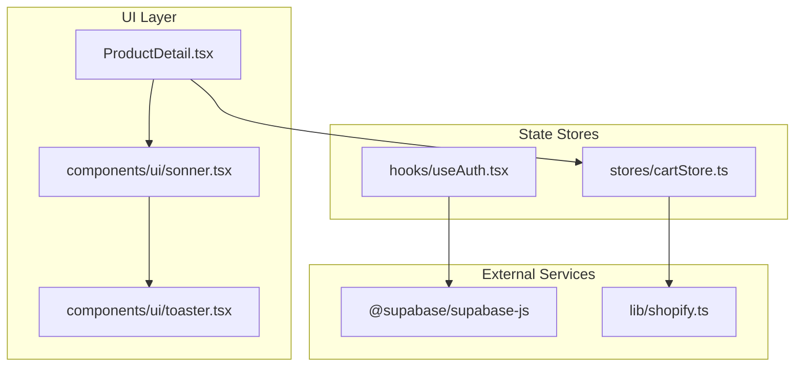
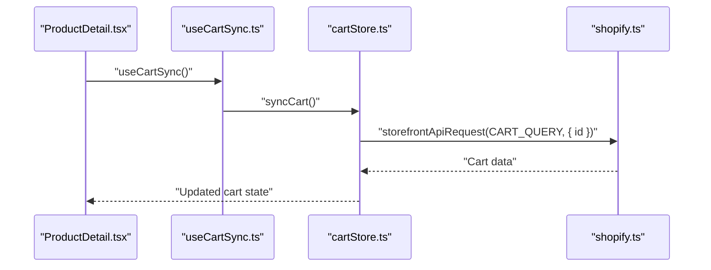
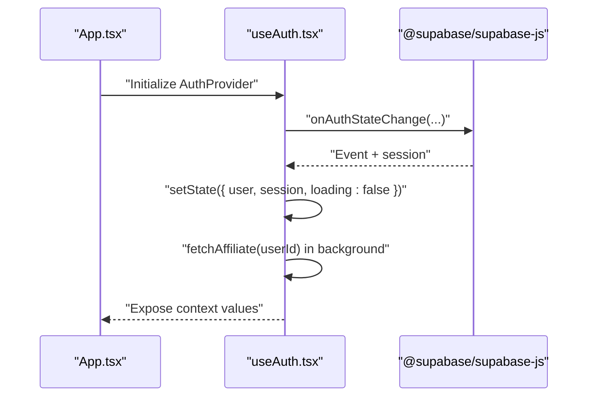
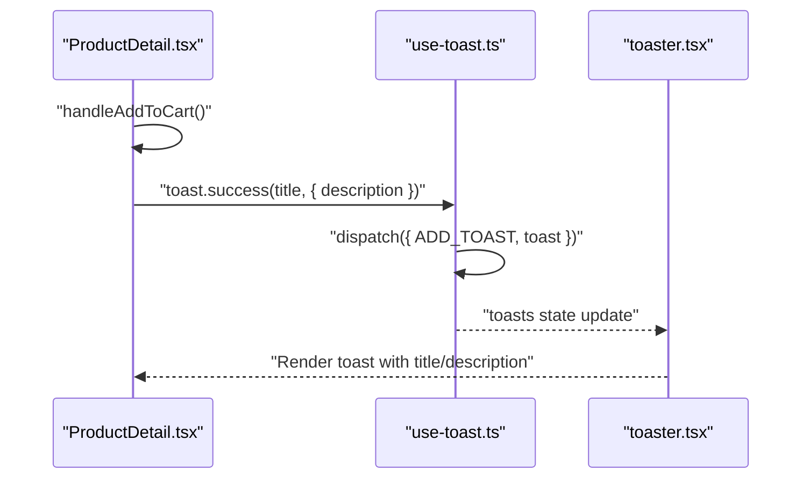
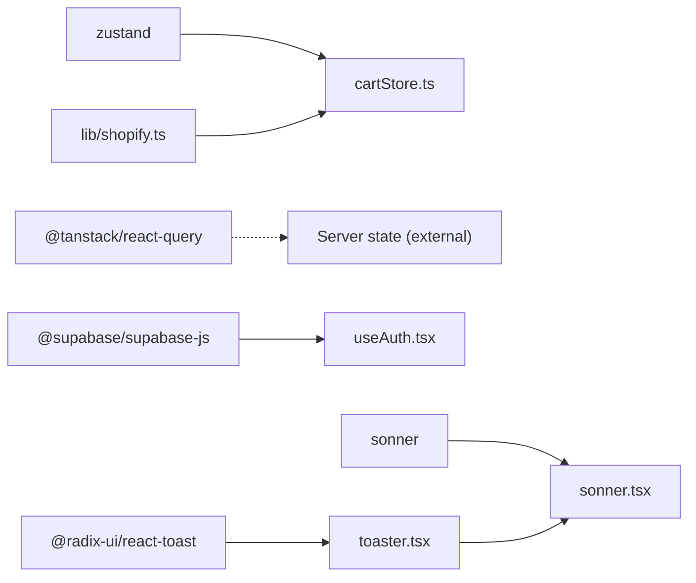

# State Management

<cite>
**Referenced Files in This Document**
- [package.json](file://package.json)
- [README.md](file://README.md)
- [src/main.tsx](file://src/main.tsx)
- [src/App.tsx](file://src/App.tsx)
- [src/stores/cartStore.ts](file://src/stores/cartStore.ts)
- [src/hooks/useCartSync.ts](file://src/hooks/useCartSync.ts)
- [src/lib/shopify.ts](file://src/lib/shopify.ts)
- [src/hooks/useAuth.tsx](file://src/hooks/useAuth.tsx)
- [src/pages/ProductDetail.tsx](file://src/pages/ProductDetail.tsx)
- [src/components/ui/sonner.tsx](file://src/components/ui/sonner.tsx)
- [src/hooks/use-toast.ts](file://src/hooks/use-toast.ts)
- [src/components/ui/toaster.tsx](file://src/components/ui/toaster.tsx)
</cite>

## Table of Contents
1. [Introduction](#introduction)
2. [Project Structure](#project-structure)
3. [Core Components](#core-components)
4. [Architecture Overview](#architecture-overview)
5. [Detailed Component Analysis](#detailed-component-analysis)
6. [Dependency Analysis](#dependency-analysis)
7. [Performance Considerations](#performance-considerations)
8. [Troubleshooting Guide](#troubleshooting-guide)
9. [Conclusion](#conclusion)

## Introduction
This document explains the state management architecture in the Ryland application. The system uses a dual-state approach:
- Local state managed by Zustand for client-side concerns such as the shopping cart and UI state.
- Server state managed by React Query for remote data fetching, caching, and synchronization with Shopify.

It documents cart state management, authentication state handling, and the toast notification system. It also covers state synchronization patterns, data fetching strategies, persistence, performance considerations, debugging, and best practices for scalability.

## Project Structure
The project is a React + TypeScript application using Vite. State management is implemented primarily in:
- Zustand stores under src/stores/
- Custom hooks under src/hooks/
- UI toast components under src/components/ui/
- Shopify integration under src/lib/shopify.ts

**Diagram sources**
- [src/pages/ProductDetail.tsx:201-243](file://src/pages/ProductDetail.tsx#L201-L243)
- [src/components/ui/sonner.tsx:1-27](file://src/components/ui/sonner.tsx#L1-L27)
- [src/components/ui/toaster.tsx:1-24](file://src/components/ui/toaster.tsx#L1-L24)
- [src/stores/cartStore.ts:1-153](file://src/stores/cartStore.ts#L1-L153)
- [src/hooks/useAuth.tsx:1-142](file://src/hooks/useAuth.tsx#L1-L142)
- [src/lib/shopify.ts:54-104](file://src/lib/shopify.ts#L54-L104)

**Section sources**
- [README.md:53-74](file://README.md#L53-L74)
- [package.json:15-95](file://package.json#L15-L95)

## Core Components
- Zustand cart store: Manages cart items, cart ID, checkout URL, loading states, and persistence to localStorage. Provides actions to add/update/remove items and to synchronize with Shopify.
- Authentication hook: Wraps Supabase auth state, exposes sign-in/sign-out/update-password, and fetches affiliate metadata.
- Toast system: A lightweight toast manager with a reducer-driven store and UI components for rendering notifications.

Key implementation references:
- Cart store definition and actions: [src/stores/cartStore.ts:37-153](file://src/stores/cartStore.ts#L37-L153)
- Cart synchronization hook: [src/hooks/useCartSync.ts:1-15](file://src/hooks/useCartSync.ts#L1-L15)
- Shopify API wrapper: [src/lib/shopify.ts:54-104](file://src/lib/shopify.ts#L54-L104)
- Auth provider and context: [src/hooks/useAuth.tsx:32-134](file://src/hooks/useAuth.tsx#L32-L134)
- Toast manager and UI: [src/hooks/use-toast.ts:1-186](file://src/hooks/use-toast.ts#L1-L186), [src/components/ui/sonner.tsx:1-27](file://src/components/ui/sonner.tsx#L1-L27), [src/components/ui/toaster.tsx:1-24](file://src/components/ui/toaster.tsx#L1-L24)

**Section sources**
- [src/stores/cartStore.ts:1-153](file://src/stores/cartStore.ts#L1-L153)
- [src/hooks/useCartSync.ts:1-15](file://src/hooks/useCartSync.ts#L1-L15)
- [src/lib/shopify.ts:54-104](file://src/lib/shopify.ts#L54-L104)
- [src/hooks/useAuth.tsx:1-142](file://src/hooks/useAuth.tsx#L1-L142)
- [src/hooks/use-toast.ts:1-186](file://src/hooks/use-toast.ts#L1-L186)
- [src/components/ui/sonner.tsx:1-27](file://src/components/ui/sonner.tsx#L1-L27)
- [src/components/ui/toaster.tsx:1-24](file://src/components/ui/toaster.tsx#L1-L24)

## Architecture Overview
The state architecture separates concerns:
- Local Zustand store for cart and UI state with persistence.
- Server state via Shopify storefront API calls integrated into the cart store.
- Authentication state via Supabase with background affiliate metadata loading.
- Notifications via a custom toast manager with Radix UI primitives and Sonner.

**Diagram sources**
- [src/pages/ProductDetail.tsx:201-243](file://src/pages/ProductDetail.tsx#L201-L243)
- [src/hooks/useCartSync.ts:1-15](file://src/hooks/useCartSync.ts#L1-L15)
- [src/stores/cartStore.ts:130-145](file://src/stores/cartStore.ts#L130-L145)
- [src/lib/shopify.ts:54-104](file://src/lib/shopify.ts#L54-L104)

## Detailed Component Analysis

### Cart State Management (Zustand)
The cart store encapsulates:
- Items, cartId, checkoutUrl, isLoading, isSyncing
- Actions: addItem, updateQuantity, removeItem, clearCart, syncCart, getCheckoutUrl
- Persistence: Uses Zustand persist middleware with localStorage and partialize to persist only relevant fields

Implementation highlights:
- addItem handles creation of a new cart, merging with existing items, or adding a new line.
- updateQuantity and removeItem delegate to Shopify mutation helpers and update state accordingly.
- syncCart fetches current cart from Shopify and clears local state if empty or missing.
- Loading flags are toggled around async operations to reflect progress in UI.

**Diagram sources**
- [src/stores/cartStore.ts:46-83](file://src/stores/cartStore.ts#L46-L83)

**Section sources**
- [src/stores/cartStore.ts:1-153](file://src/stores/cartStore.ts#L1-L153)
- [src/lib/shopify.ts:54-104](file://src/lib/shopify.ts#L54-L104)

### Authentication State Handling (Supabase)
The AuthProvider:
- Subscribes to Supabase auth state changes
- Sets user/session immediately for guards
- Fetches affiliate metadata in the background with a timeout
- Exposes signIn, signOut, updatePassword, and state accessors

**Diagram sources**
- [src/hooks/useAuth.tsx:68-112](file://src/hooks/useAuth.tsx#L68-L112)

**Section sources**
- [src/hooks/useAuth.tsx:1-142](file://src/hooks/useAuth.tsx#L1-L142)

### Toast Notification System
The toast system consists of:
- A reducer-driven store in a custom hook that manages an in-memory queue of toasts
- UI components built on Radix UI primitives
- A Sonner-based Toaster for theme-aware rendering

Highlights:
- Single-toast limit enforced by the reducer
- Automatic dismissal timers per toast
- Dismiss-all and dismiss-specific behaviors
- UI renders toasts and viewport

**Diagram sources**
- [src/pages/ProductDetail.tsx:210-223](file://src/pages/ProductDetail.tsx#L210-L223)
- [src/hooks/use-toast.ts:137-164](file://src/hooks/use-toast.ts#L137-L164)
- [src/components/ui/toaster.tsx:4-23](file://src/components/ui/toaster.tsx#L4-L23)

**Section sources**
- [src/hooks/use-toast.ts:1-186](file://src/hooks/use-toast.ts#L1-L186)
- [src/components/ui/sonner.tsx:1-27](file://src/components/ui/sonner.tsx#L1-L27)
- [src/components/ui/toaster.tsx:1-24](file://src/components/ui/toaster.tsx#L1-L24)

### State Synchronization Patterns
- Cart synchronization on visibility change: A dedicated hook triggers cart sync when the page becomes visible, ensuring local state reflects server state after potential external edits.
- Background affiliate loading: Auth state is set promptly while affiliate data is fetched asynchronously to avoid blocking navigation.

References:
- Visibility-based sync: [src/hooks/useCartSync.ts:1-15](file://src/hooks/useCartSync.ts#L1-L15)
- Background affiliate fetch: [src/hooks/useAuth.tsx:76-85](file://src/hooks/useAuth.tsx#L76-L85)

**Section sources**
- [src/hooks/useCartSync.ts:1-15](file://src/hooks/useCartSync.ts#L1-L15)
- [src/hooks/useAuth.tsx:65-85](file://src/hooks/useAuth.tsx#L65-L85)

### Data Fetching Strategies
- Shopify storefront queries are executed via a wrapper that handles errors and returns structured data.
- Cart sync uses a storefront query to reconcile local state with server state.
- Product detail pages trigger async operations to add items to the cart and show toasts upon completion.

References:
- Shopify API request and error handling: [src/lib/shopify.ts:54-79](file://src/lib/shopify.ts#L54-L79)
- Cart sync via storefront query: [src/stores/cartStore.ts:130-145](file://src/stores/cartStore.ts#L130-L145)
- Add-to-cart flow with toast: [src/pages/ProductDetail.tsx:210-223](file://src/pages/ProductDetail.tsx#L210-L223)

**Section sources**
- [src/lib/shopify.ts:54-104](file://src/lib/shopify.ts#L54-L104)
- [src/stores/cartStore.ts:130-145](file://src/stores/cartStore.ts#L130-L145)
- [src/pages/ProductDetail.tsx:210-223](file://src/pages/ProductDetail.tsx#L210-L223)

### State Persistence
- Cart persistence: The cart store persists items, cartId, and checkoutUrl to localStorage using Zustand’s persist middleware with a partialize function to minimize persisted payload.
- No explicit persistence is shown for the auth context; user/session are restored via Supabase on app init.

References:
- Persist config and partialize: [src/stores/cartStore.ts:147-152](file://src/stores/cartStore.ts#L147-L152)

**Section sources**
- [src/stores/cartStore.ts:147-152](file://src/stores/cartStore.ts#L147-L152)

### Practical Examples and Custom Hooks
- Cart sync hook: Demonstrates subscribing to visibility changes and invoking a store action.
  - Reference: [src/hooks/useCartSync.ts:1-15](file://src/hooks/useCartSync.ts#L1-L15)
- Toast usage: Demonstrates calling toast.success with a description and integrating with UI.
  - Reference: [src/pages/ProductDetail.tsx:210-223](file://src/pages/ProductDetail.tsx#L210-L223)
- Auth provider: Demonstrates context creation, subscription to auth events, and background data fetching.
  - Reference: [src/hooks/useAuth.tsx:32-134](file://src/hooks/useAuth.tsx#L32-L134)

**Section sources**
- [src/hooks/useCartSync.ts:1-15](file://src/hooks/useCartSync.ts#L1-L15)
- [src/pages/ProductDetail.tsx:210-223](file://src/pages/ProductDetail.tsx#L210-L223)
- [src/hooks/useAuth.tsx:32-134](file://src/hooks/useAuth.tsx#L32-L134)

## Dependency Analysis
The state management stack relies on:
- Zustand for local state and persistence
- React Query for server state orchestration (not shown in current files; present in dependencies)
- Supabase for authentication and session management
- Shopify storefront API for cart and product data
- Radix UI and Sonner for toast UI

**Diagram sources**
- [package.json:45-69](file://package.json#L45-L69)
- [src/stores/cartStore.ts:1-153](file://src/stores/cartStore.ts#L1-L153)
- [src/hooks/useAuth.tsx:1-142](file://src/hooks/useAuth.tsx#L1-L142)
- [src/lib/shopify.ts:54-104](file://src/lib/shopify.ts#L54-L104)
- [src/components/ui/toaster.tsx:1-24](file://src/components/ui/toaster.tsx#L1-L24)
- [src/components/ui/sonner.tsx:1-27](file://src/components/ui/sonner.tsx#L1-L27)

**Section sources**
- [package.json:45-69](file://package.json#L45-L69)

## Performance Considerations
- Minimize re-renders by selecting only necessary slices of state in components.
- Use optimistic updates for cart operations and reconcile with server state via sync.
- Debounce or batch frequent updates (e.g., quantity changes) to reduce network calls.
- Keep persisted state minimal (already partially persisted) to reduce storage overhead.
- Avoid blocking UI on long-running background tasks; load affiliate data after initial auth state is ready.
- Use loading flags to prevent duplicate requests during ongoing operations.

## Troubleshooting Guide
Common issues and remedies:
- Cart not syncing after external edits
  - Ensure visibility-based sync is active and cartId is present.
  - Verify storefront query returns expected cart data.
  - References: [src/hooks/useCartSync.ts:1-15](file://src/hooks/useCartSync.ts#L1-L15), [src/stores/cartStore.ts:130-145](file://src/stores/cartStore.ts#L130-L145)
- Toasts not appearing
  - Confirm Toaster is rendered and the toast manager is initialized.
  - Verify that toast.success is called with proper arguments.
  - References: [src/components/ui/toaster.tsx:4-23](file://src/components/ui/toaster.tsx#L4-L23), [src/pages/ProductDetail.tsx:210-223](file://src/pages/ProductDetail.tsx#L210-L223)
- Authentication state not updating
  - Check auth state subscription and session restoration.
  - Ensure affiliate fetch does not overwrite state prematurely.
  - References: [src/hooks/useAuth.tsx:68-112](file://src/hooks/useAuth.tsx#L68-L112), [src/hooks/useAuth.tsx:76-85](file://src/hooks/useAuth.tsx#L76-L85)
- Shopify API errors
  - Inspect error handling in the API wrapper and surface user-friendly messages.
  - References: [src/lib/shopify.ts:54-79](file://src/lib/shopify.ts#L54-L79)

**Section sources**
- [src/hooks/useCartSync.ts:1-15](file://src/hooks/useCartSync.ts#L1-L15)
- [src/stores/cartStore.ts:130-145](file://src/stores/cartStore.ts#L130-L145)
- [src/components/ui/toaster.tsx:4-23](file://src/components/ui/toaster.tsx#L4-L23)
- [src/pages/ProductDetail.tsx:210-223](file://src/pages/ProductDetail.tsx#L210-L223)
- [src/hooks/useAuth.tsx:68-112](file://src/hooks/useAuth.tsx#L68-L112)
- [src/lib/shopify.ts:54-79](file://src/lib/shopify.ts#L54-L79)

## Conclusion
Ryland’s state management combines Zustand for robust local state and persistence, Supabase for authentication, and a custom toast system for user feedback. The cart store integrates with Shopify via targeted mutations and sync operations, while the auth provider ensures responsive UX through background data loading. Following the recommended patterns and best practices will help maintain scalability and reliability as the application evolves.