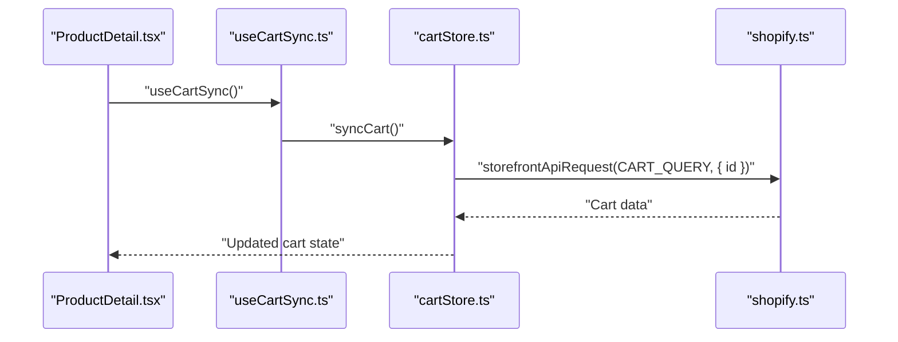
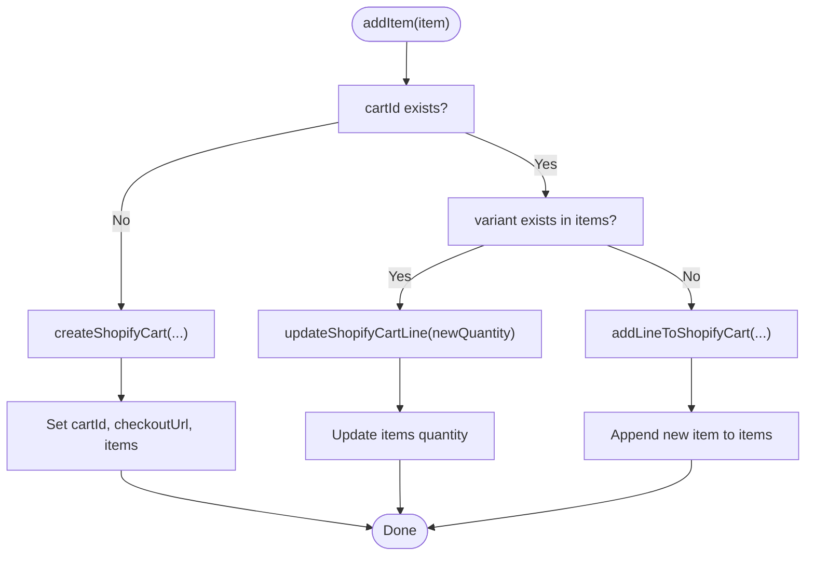
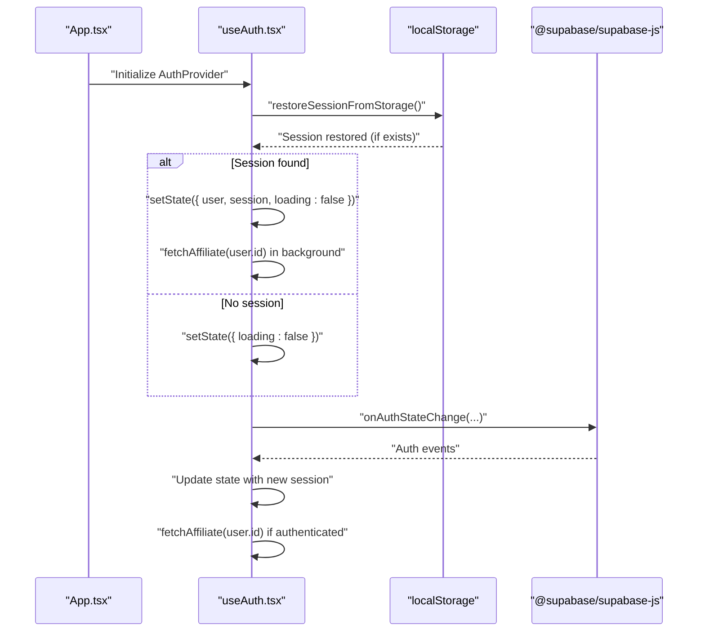
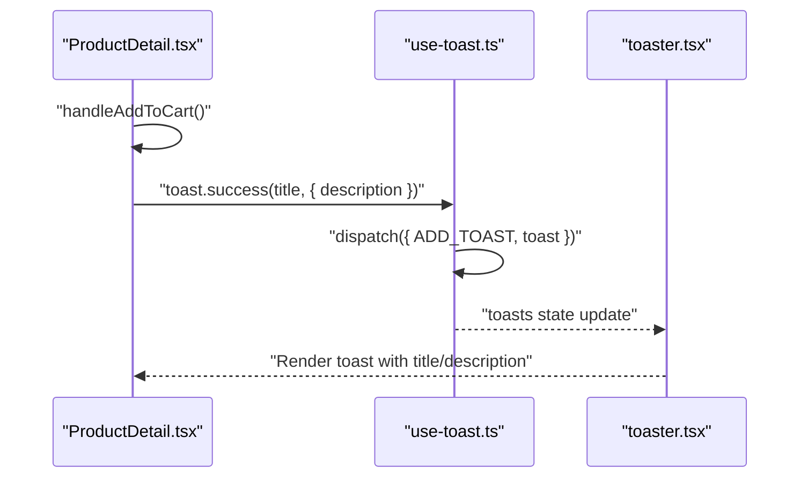
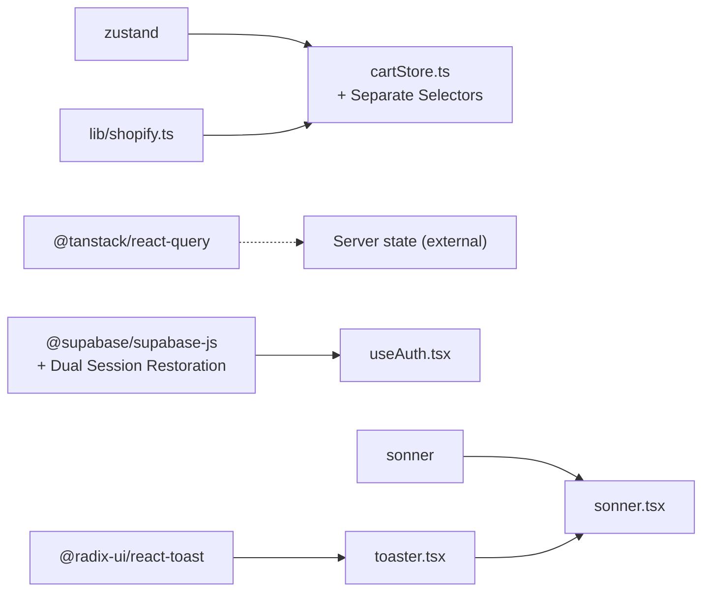

# State Management

<cite>
**Referenced Files in This Document**
- [package.json](file://package.json)
- [README.md](file://README.md)
- [src/main.tsx](file://src/main.tsx)
- [src/App.tsx](file://src/App.tsx)
- [src/stores/cartStore.ts](file://src/stores/cartStore.ts)
- [src/hooks/useCartSync.ts](file://src/hooks/useCartSync.ts)
- [src/lib/shopify.ts](file://src/lib/shopify.ts)
- [src/hooks/useAuth.tsx](file://src/hooks/useAuth.tsx)
- [src/pages/ProductDetail.tsx](file://src/pages/ProductDetail.tsx)
- [src/components/ui/sonner.tsx](file://src/components/ui/sonner.tsx)
- [src/hooks/use-toast.ts](file://src/hooks/use-toast.ts)
- [src/components/ui/toaster.tsx](file://src/components/ui/toaster.tsx)
- [src/components/CartDrawer.tsx](file://src/components/CartDrawer.tsx)
- [src/pages/Store.tsx](file://src/pages/Store.tsx)
- [src/components/ui/toast.tsx](file://src/components/ui/toast.tsx)
</cite>

## Update Summary
**Changes Made**
- Enhanced authentication system with improved session restoration using dual approach (localStorage + Supabase)
- Implemented synchronous localStorage restoration before falling back to Supabase listeners
- Added AbortController support for better affiliate data fetching with enhanced error handling
- Refined cart store implementation with separate selector functions for improved performance
- Added fine-grained re-render control through dedicated hooks (useCartItems, useCartLoading, useCartCheckoutUrl, useCartActions)
- Updated component usage patterns to leverage new selector functions for optimal performance

## Table of Contents
1. [Introduction](#introduction)
2. [Project Structure](#project-structure)
3. [Core Components](#core-components)
4. [Architecture Overview](#architecture-overview)
5. [Detailed Component Analysis](#detailed-component-analysis)
6. [Dependency Analysis](#dependency-analysis)
7. [Performance Considerations](#performance-considerations)
8. [Troubleshooting Guide](#troubleshooting-guide)
9. [Conclusion](#conclusion)

## Introduction
This document explains the state management architecture in the Ryland application. The system uses a dual-state approach:
- Local state managed by Zustand for client-side concerns such as the shopping cart and UI state.
- Server state managed by React Query for remote data fetching, caching, and synchronization with Shopify.

It documents cart state management, authentication state handling, and the toast notification system. It also covers state synchronization patterns, data fetching strategies, persistence, performance considerations, debugging, and best practices for scalability.

**Updated** The authentication system now implements a sophisticated dual-session restoration approach combining synchronous localStorage checks with asynchronous Supabase listeners, eliminating blank screen issues during page refreshes. The cart store provides enhanced selector functions for improved performance and fine-grained re-render control.

## Project Structure
The project is a React + TypeScript application using Vite. State management is implemented primarily in:
- Zustand stores under src/stores/ with enhanced selector functions
- Custom hooks under src/hooks/
- UI toast components under src/components/ui/
- Shopify integration under src/lib/shopify.ts
- Supabase authentication under src/integrations/supabase/

```mermaid
graph TB
subgraph "UI Layer"
PD["ProductDetail.tsx"]
CD["CartDrawer.tsx"]
SONNER["components/ui/sonner.tsx"]
TOASTER["components/ui/toaster.tsx"]
END
subgraph "Enhanced State Stores"
CART["stores/cartStore.ts<br/>+ Separate Selectors"]
AUTH["hooks/useAuth.tsx<br/>+ Dual Session Restoration"]
END
subgraph "External Services"
SUPABASE["@supabase/supabase-js<br/>+ localStorage Sync"]
SHOP["lib/shopify.ts"]
END
PD --> CART
CD --> CART
SONNER --> TOASTER
CART --> SHOP
AUTH --> SUPABASE
```

**Diagram sources**
- [src/pages/ProductDetail.tsx:201-243](file://src/pages/ProductDetail.tsx#L201-L243)
- [src/components/CartDrawer.tsx:1-214](file://src/components/CartDrawer.tsx#L1-L214)
- [src/components/ui/sonner.tsx:1-27](file://src/components/ui/sonner.tsx#L1-L27)
- [src/components/ui/toaster.tsx:1-24](file://src/components/ui/toaster.tsx#L1-L24)
- [src/stores/cartStore.ts:37-48](file://src/stores/cartStore.ts#L37-L48)
- [src/hooks/useAuth.tsx:71-120](file://src/hooks/useAuth.tsx#L71-L120)
- [src/lib/shopify.ts:54-104](file://src/lib/shopify.ts#L54-L104)

**Section sources**
- [README.md:53-74](file://README.md#L53-L74)
- [package.json:15-95](file://package.json#L15-L95)

## Core Components
- Zustand cart store: Manages cart items, cart ID, checkout URL, loading states, and persistence to localStorage. Provides actions to add/update/remove items and to synchronize with Shopify. **Enhanced** with separate selector functions for improved performance.
- Authentication hook: Implements dual-session restoration using synchronous localStorage checks followed by asynchronous Supabase listeners, with enhanced error handling and AbortController support for affiliate data fetching.
- Toast system: A lightweight toast manager with a reducer-driven store and UI components for rendering notifications.

Key implementation references:
- Cart store definition and actions: [src/stores/cartStore.ts:37-171](file://src/stores/cartStore.ts#L37-L171)
- Cart synchronization hook: [src/hooks/useCartSync.ts:1-16](file://src/hooks/useCartSync.ts#L1-L16)
- Shopify API wrapper: [src/lib/shopify.ts:54-104](file://src/lib/shopify.ts#L54-L104)
- Auth provider and context: [src/hooks/useAuth.tsx:32-134](file://src/hooks/useAuth.tsx#L32-L134)
- Toast manager and UI: [src/hooks/use-toast.ts:1-186](file://src/hooks/use-toast.ts#L1-L186), [src/components/ui/sonner.tsx:1-27](file://src/components/ui/sonner.tsx#L1-L27), [src/components/ui/toaster.tsx:1-24](file://src/components/ui/toaster.tsx#L1-L24)

**Section sources**
- [src/stores/cartStore.ts:1-171](file://src/stores/cartStore.ts#L1-L171)
- [src/hooks/useCartSync.ts:1-16](file://src/hooks/useCartSync.ts#L1-L16)
- [src/lib/shopify.ts:54-104](file://src/lib/shopify.ts#L54-L104)
- [src/hooks/useAuth.tsx:1-179](file://src/hooks/useAuth.tsx#L1-L179)
- [src/hooks/use-toast.ts:1-186](file://src/hooks/use-toast.ts#L1-L186)
- [src/components/ui/sonner.tsx:1-27](file://src/components/ui/sonner.tsx#L1-L27)
- [src/components/ui/toaster.tsx:1-24](file://src/components/ui/toaster.tsx#L1-L24)

## Architecture Overview
The state architecture separates concerns:
- Local Zustand store for cart and UI state with persistence and **enhanced selector functions** for fine-grained re-render control.
- Server state via Shopify storefront API calls integrated into the cart store.
- Authentication state via Supabase with **dual-session restoration** (localStorage + Supabase listeners) and background affiliate metadata loading.
- Notifications via a custom toast manager with Radix UI primitives and Sonner.



**Diagram sources**
- [src/pages/ProductDetail.tsx:201-243](file://src/pages/ProductDetail.tsx#L201-L243)
- [src/hooks/useCartSync.ts:1-16](file://src/hooks/useCartSync.ts#L1-L16)
- [src/stores/cartStore.ts:147-162](file://src/stores/cartStore.ts#L147-L162)
- [src/lib/shopify.ts:54-104](file://src/lib/shopify.ts#L54-L104)

## Detailed Component Analysis

### Cart State Management (Zustand) - Enhanced Implementation
The cart store encapsulates:
- Items, cartId, checkoutUrl, isLoading, isSyncing
- Actions: addItem, updateQuantity, removeItem, clearCart, syncCart, getCheckoutUrl
- Persistence: Uses Zustand persist middleware with localStorage and partialize to persist only relevant fields
- **Enhanced** selector functions for improved performance and fine-grained re-render control

**Updated** The cart store now provides four separate selector functions:
- `useCartItems`: Selects only the items array for components that only need cart contents
- `useCartLoading`: Selects only the isLoading flag for components that need loading state
- `useCartCheckoutUrl`: Selects only the checkoutUrl for components that need checkout functionality
- `useCartActions`: Selects only the action functions for components that need cart manipulation

Implementation highlights:
- addItem handles creation of a new cart, merging with existing items, or adding a new line with enhanced error handling.
- updateQuantity and removeItem delegate to Shopify mutation helpers and update state accordingly with improved empty cart detection.
- syncCart fetches current cart from Shopify and clears local state if empty or missing, with better error handling.
- Loading flags are toggled around async operations to reflect progress in UI.
- Empty cart handling logic ensures proper cleanup when cart becomes empty after item removal.



**Diagram sources**
- [src/stores/cartStore.ts:59-96](file://src/stores/cartStore.ts#L59-L96)

**Section sources**
- [src/stores/cartStore.ts:1-171](file://src/stores/cartStore.ts#L1-L171)
- [src/lib/shopify.ts:54-104](file://src/lib/shopify.ts#L54-L104)

### Enhanced Authentication State Handling (Supabase) - Dual Session Restoration
The AuthProvider implements a sophisticated dual-session restoration approach:
- **Synchronous localStorage restoration**: Immediately attempts to restore session from localStorage before any async operations
- **Asynchronous Supabase listeners**: Falls back to Supabase auth state change listeners for login/logout events
- **Enhanced error handling**: Improved error management with AbortController support for affiliate data fetching
- **Background affiliate loading**: Affiliate metadata is fetched asynchronously after initial session restoration

**Updated** Key improvements in the authentication system:
- `restoreSessionFromStorage()`: Synchronously searches localStorage for Supabase auth tokens and restores session immediately
- `cancelled` flag: Prevents state updates after component unmounting
- Enhanced `fetchAffiliate()` with AbortController support and graceful error handling
- Improved logging and debugging capabilities throughout the authentication flow



**Diagram sources**
- [src/hooks/useAuth.tsx:71-120](file://src/hooks/useAuth.tsx#L71-L120)
- [src/hooks/useAuth.tsx:122-142](file://src/hooks/useAuth.tsx#L122-L142)

**Section sources**
- [src/hooks/useAuth.tsx:1-179](file://src/hooks/useAuth.tsx#L1-L179)

### Toast Notification System
The toast system consists of:
- A reducer-driven store in a custom hook that manages an in-memory queue of toasts
- UI components built on Radix UI primitives
- A Sonner-based Toaster for theme-aware rendering

Highlights:
- Single-toast limit enforced by the reducer
- Automatic dismissal timers per toast
- Dismiss-all and dismiss-specific behaviors
- UI renders toasts and viewport



**Diagram sources**
- [src/pages/ProductDetail.tsx:210-223](file://src/pages/ProductDetail.tsx#L210-L223)
- [src/hooks/use-toast.ts:137-164](file://src/hooks/use-toast.ts#L137-L164)
- [src/components/ui/toaster.tsx:4-23](file://src/components/ui/toaster.tsx#L4-L23)

**Section sources**
- [src/hooks/use-toast.ts:1-186](file://src/hooks/use-toast.ts#L1-L186)
- [src/components/ui/sonner.tsx:1-27](file://src/components/ui/sonner.tsx#L1-L27)
- [src/components/ui/toaster.tsx:1-24](file://src/components/ui/toaster.tsx#L1-L24)

### State Synchronization Patterns
- Cart synchronization on visibility change: A dedicated hook triggers cart sync when the page becomes visible, ensuring local state reflects server state after potential external edits.
- **Enhanced** Dual authentication session restoration: Auth state is immediately restored from localStorage (synchronous) before relying on Supabase listeners (asynchronous).
- **Enhanced** selector-based component patterns: Components now use specific selector functions to minimize re-renders and improve performance.

References:
- Visibility-based sync: [src/hooks/useCartSync.ts:1-16](file://src/hooks/useCartSync.ts#L1-L16)
- Dual session restoration: [src/hooks/useAuth.tsx:71-120](file://src/hooks/useAuth.tsx#L71-L120)

**Section sources**
- [src/hooks/useCartSync.ts:1-16](file://src/hooks/useCartSync.ts#L1-L16)
- [src/hooks/useAuth.tsx:71-120](file://src/hooks/useAuth.tsx#L71-L120)

### Data Fetching Strategies
- Shopify storefront queries are executed via a wrapper that handles errors and returns structured data.
- Cart sync uses a storefront query to reconcile local state with server state.
- Product detail pages trigger async operations to add items to the cart and show toasts upon completion.
- **Enhanced** selector functions provide better separation of concerns and improved component performance.
- **Enhanced** affiliate data fetching with AbortController support for better cleanup and error handling.

References:
- Shopify API request and error handling: [src/lib/shopify.ts:54-79](file://src/lib/shopify.ts#L54-L79)
- Cart sync via storefront query: [src/stores/cartStore.ts:147-162](file://src/stores/cartStore.ts#L147-L162)
- Add-to-cart flow with toast: [src/pages/ProductDetail.tsx:210-223](file://src/pages/ProductDetail.tsx#L210-L223)

**Section sources**
- [src/lib/shopify.ts:54-104](file://src/lib/shopify.ts#L54-L104)
- [src/stores/cartStore.ts:147-162](file://src/stores/cartStore.ts#L147-L162)
- [src/pages/ProductDetail.tsx:210-223](file://src/pages/ProductDetail.tsx#L210-L223)

### State Persistence
- Cart persistence: The cart store persists items, cartId, and checkoutUrl to localStorage using Zustand's persist middleware with a partialize function to minimize persisted payload.
- **Enhanced** Authentication persistence: Session restoration now prioritizes localStorage for immediate availability, reducing blank screen issues during page refreshes.
- No explicit persistence is shown for the auth context beyond the dual-session restoration approach.

References:
- Persist config and partialize: [src/stores/cartStore.ts:164-169](file://src/stores/cartStore.ts#L164-L169)

**Section sources**
- [src/stores/cartStore.ts:164-169](file://src/stores/cartStore.ts#L164-L169)
- [src/hooks/useAuth.tsx:71-120](file://src/hooks/useAuth.tsx#L71-L120)

### Practical Examples and Custom Hooks
- Cart sync hook: Demonstrates subscribing to visibility changes and invoking a store action.
  - Reference: [src/hooks/useCartSync.ts:1-16](file://src/hooks/useCartSync.ts#L1-L16)
- Toast usage: Demonstrates calling toast.success with a description and integrating with UI.
  - Reference: [src/pages/ProductDetail.tsx:210-223](file://src/pages/ProductDetail.tsx#L210-L223)
- Auth provider: Demonstrates context creation, dual-session restoration, subscription to auth events, and background data fetching.
  - Reference: [src/hooks/useAuth.tsx:32-134](file://src/hooks/useAuth.tsx#L32-L134)
- **Enhanced** selector usage: Components now use specific selector functions for optimal performance.
  - Reference: [src/components/CartDrawer.tsx:11](file://src/components/CartDrawer.tsx#L11)
  - Reference: [src/pages/ProductDetail.tsx:192-194](file://src/pages/ProductDetail.tsx#L192-L194)

**Section sources**
- [src/hooks/useCartSync.ts:1-16](file://src/hooks/useCartSync.ts#L1-L16)
- [src/pages/ProductDetail.tsx:210-223](file://src/pages/ProductDetail.tsx#L210-L223)
- [src/hooks/useAuth.tsx:32-134](file://src/hooks/useAuth.tsx#L32-L134)
- [src/components/CartDrawer.tsx:11](file://src/components/CartDrawer.tsx#L11)
- [src/pages/ProductDetail.tsx:192-194](file://src/pages/ProductDetail.tsx#L192-L194)

## Dependency Analysis
The state management stack relies on:
- Zustand for local state and persistence with **enhanced selector functions**
- React Query for server state orchestration (not shown in current files; present in dependencies)
- Supabase for authentication and session management with **dual-session restoration**
- Shopify storefront API for cart and product data
- Radix UI and Sonner for toast UI



**Diagram sources**
- [package.json:45-69](file://package.json#L45-L69)
- [src/stores/cartStore.ts:37-48](file://src/stores/cartStore.ts#L37-L48)
- [src/hooks/useAuth.tsx:1-179](file://src/hooks/useAuth.tsx#L1-L179)
- [src/lib/shopify.ts:54-104](file://src/lib/shopify.ts#L54-L104)
- [src/components/ui/toaster.tsx:1-24](file://src/components/ui/toaster.tsx#L1-L24)
- [src/components/ui/sonner.tsx:1-27](file://src/components/ui/sonner.tsx#L1-L27)

**Section sources**
- [package.json:45-69](file://package.json#L45-L69)

## Performance Considerations
- **Enhanced** Minimize re-renders by using separate selector functions that select only necessary slices of state in components.
- **Enhanced** Dual-session restoration eliminates blank screen issues during page refreshes by prioritizing synchronous localStorage checks.
- Use optimistic updates for cart operations and reconcile with server state via sync.
- Debounce or batch frequent updates (e.g., quantity changes) to reduce network calls.
- Keep persisted state minimal (already partially persisted) to reduce storage overhead.
- Avoid blocking UI on long-running background tasks; load affiliate data after initial auth state is ready.
- Use loading flags to prevent duplicate requests during ongoing operations.
- **New** Leverage the new selector functions (useCartItems, useCartLoading, useCartCheckoutUrl, useCartActions) for optimal component performance.
- **New** Empty cart handling logic ensures efficient cleanup when cart becomes empty after item removal.
- **New** Enhanced error handling with AbortController support prevents memory leaks and improves cleanup.

## Troubleshooting Guide
Common issues and remedies:
- Cart not syncing after external edits
  - Ensure visibility-based sync is active and cartId is present.
  - Verify storefront query returns expected cart data.
  - References: [src/hooks/useCartSync.ts:1-16](file://src/hooks/useCartSync.ts#L1-L16), [src/stores/cartStore.ts:147-162](file://src/stores/cartStore.ts#L147-L162)
- Toasts not appearing
  - Confirm Toaster is rendered and the toast manager is initialized.
  - Verify that toast.success is called with proper arguments.
  - References: [src/components/ui/toaster.tsx:4-23](file://src/components/ui/toaster.tsx#L4-L23), [src/pages/ProductDetail.tsx:210-223](file://src/pages/ProductDetail.tsx#L210-L223)
- **Enhanced** Authentication state not updating
  - Check dual-session restoration logic and localStorage parsing.
  - Ensure component cancellation flag prevents state updates after unmount.
  - Verify affiliate fetch error handling with AbortController support.
  - References: [src/hooks/useAuth.tsx:71-120](file://src/hooks/useAuth.tsx#L71-L120), [src/hooks/useAuth.tsx:122-142](file://src/hooks/useAuth.tsx#L122-L142)
- Shopify API errors
  - Inspect error handling in the API wrapper and surface user-friendly messages.
  - References: [src/lib/shopify.ts:54-79](file://src/lib/shopify.ts#L54-L79)
- **New** Selector function performance issues
  - Ensure components are using the appropriate selector functions for their needs.
  - Verify that components aren't mixing selector functions incorrectly.
  - References: [src/stores/cartStore.ts:37-48](file://src/stores/cartStore.ts#L37-L48)
- **New** Blank screen issues during page refresh
  - Verify localStorage restoration is working correctly.
  - Check that Supabase listeners are properly unsubscribed.
  - References: [src/hooks/useAuth.tsx:71-120](file://src/hooks/useAuth.tsx#L71-L120)

**Section sources**
- [src/hooks/useCartSync.ts:1-16](file://src/hooks/useCartSync.ts#L1-L16)
- [src/stores/cartStore.ts:147-162](file://src/stores/cartStore.ts#L147-L162)
- [src/components/ui/toaster.tsx:4-23](file://src/components/ui/toaster.tsx#L4-L23)
- [src/pages/ProductDetail.tsx:210-223](file://src/pages/ProductDetail.tsx#L210-L223)
- [src/hooks/useAuth.tsx:71-120](file://src/hooks/useAuth.tsx#L71-L120)
- [src/lib/shopify.ts:54-79](file://src/lib/shopify.ts#L54-L79)
- [src/stores/cartStore.ts:37-48](file://src/stores/cartStore.ts#L37-L48)

## Conclusion
Ryland's state management combines Zustand for robust local state and persistence with **enhanced selector functions** for improved performance, Supabase for **dual-session authentication** with synchronous localStorage restoration, and a custom toast system for user feedback. The cart store integrates with Shopify via targeted mutations and sync operations, while the auth provider ensures responsive UX through immediate session restoration and background data loading. The new selector functions (useCartItems, useCartLoading, useCartCheckoutUrl, useCartActions) provide fine-grained re-render control and significantly improve component performance. The enhanced authentication system addresses blank screen issues during page refreshes through dual-session restoration, while improved error handling and AbortController support ensure better resource management. Following the recommended patterns and best practices will help maintain scalability and reliability as the application evolves.