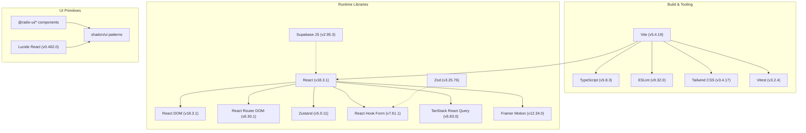
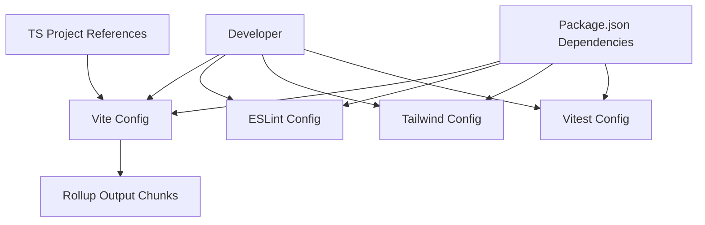
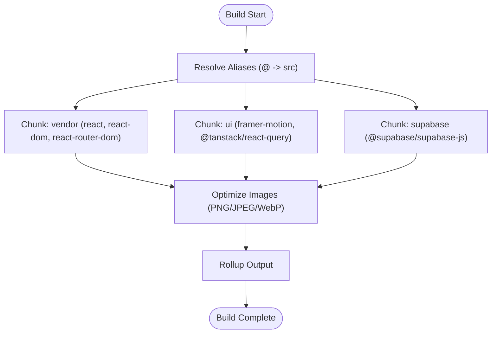
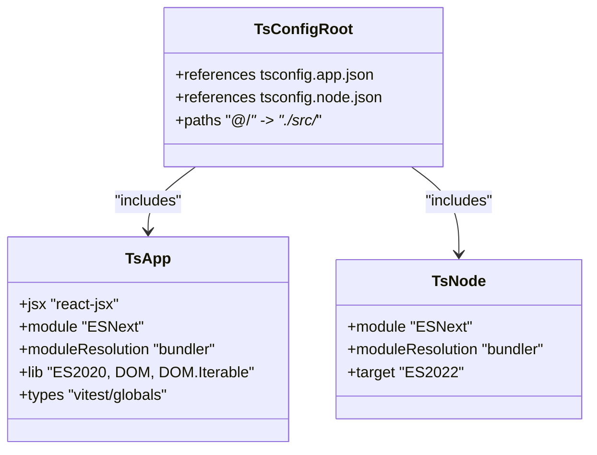
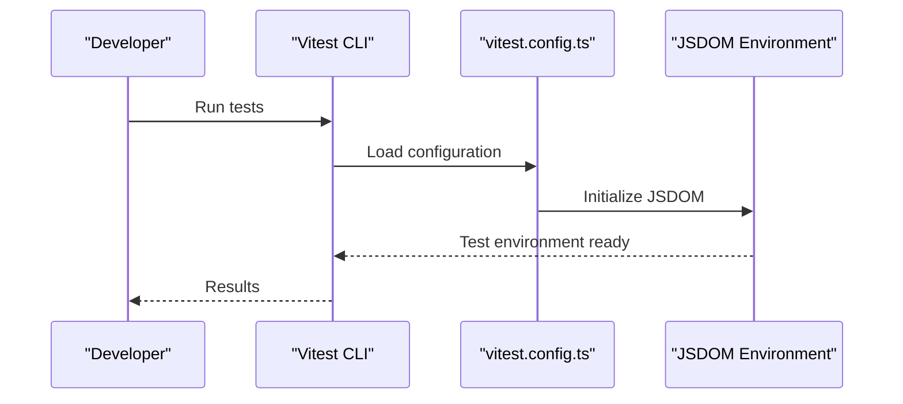
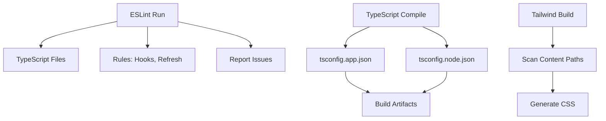

# Technology Stack & Dependencies

<cite>
**Referenced Files in This Document**
- [package.json](file://package.json)
- [vite.config.ts](file://vite.config.ts)
- [eslint.config.js](file://eslint.config.js)
- [tailwind.config.ts](file://tailwind.config.ts)
- [tsconfig.json](file://tsconfig.json)
- [tsconfig.app.json](file://tsconfig.app.json)
- [tsconfig.node.json](file://tsconfig.node.json)
- [vitest.config.ts](file://vitest.config.ts)
- [README.md](file://README.md)
</cite>

## Table of Contents
1. [Introduction](#introduction)
2. [Project Structure](#project-structure)
3. [Core Technologies](#core-technologies)
4. [Architecture Overview](#architecture-overview)
5. [Detailed Component Analysis](#detailed-component-analysis)
6. [Dependency Management Strategies](#dependency-management-strategies)
7. [Performance Considerations](#performance-considerations)
8. [Development Tools](#development-tools)
9. [Troubleshooting Guide](#troubleshooting-guide)
10. [Conclusion](#conclusion)

## Introduction
This document explains the technology stack and dependencies used in the Ryland project. It focuses on the core technologies—React 18.3.1, TypeScript, Vite, shadcn/ui, and Tailwind CSS—and documents how they integrate into the application architecture. It also covers dependency management strategies, version compatibility, rationale for technology choices, and guidance for updating dependencies safely while avoiding conflicts. Finally, it outlines development tools including ESLint configuration, build optimization, and testing frameworks.

## Project Structure
The project follows a modern frontend architecture centered around Vite for bundling and development, TypeScript for type safety, and React for UI composition. Utility libraries and UI primitives are integrated through Radix UI-based components and shadcn/ui patterns, styled with Tailwind CSS. The configuration files define build behavior, linting rules, and testing environments.

**Diagram sources**
- [vite.config.ts:1-43](file://vite.config.ts#L1-L43)
- [package.json:15-93](file://package.json#L15-L93)
- [tsconfig.json:1-24](file://tsconfig.json#L1-L24)
- [eslint.config.js:1-27](file://eslint.config.js#L1-L27)
- [tailwind.config.ts:1-97](file://tailwind.config.ts#L1-L97)
- [vitest.config.ts:1-17](file://vitest.config.ts#L1-L17)

**Section sources**
- [README.md:53-61](file://README.md#L53-L61)
- [package.json:15-93](file://package.json#L15-L93)
- [vite.config.ts:1-43](file://vite.config.ts#L1-L43)
- [tsconfig.json:1-24](file://tsconfig.json#L1-L24)
- [eslint.config.js:1-27](file://eslint.config.js#L1-L27)
- [tailwind.config.ts:1-97](file://tailwind.config.ts#L1-L97)
- [vitest.config.ts:1-17](file://vitest.config.ts#L1-L17)

## Core Technologies
- React 18.3.1: Core UI library providing component model and concurrent features.
- TypeScript 5.8.3: Type system for improved developer experience and runtime safety.
- Vite 5.4.19: Fast build tool and dev server with optimized HMR.
- shadcn/ui: UI component library built on Radix UI with Tailwind styling.
- Tailwind CSS 3.4.17: Utility-first CSS framework enabling rapid UI development.

Rationale:
- React and TypeScript provide a robust foundation for scalable UI development.
- Vite offers fast cold starts and efficient rebuilds, essential for developer productivity.
- shadcn/ui and Tailwind enable consistent, themeable UI with minimal custom CSS.
- The combination emphasizes DX (developer experience), maintainability, and performance.

**Section sources**
- [README.md:53-61](file://README.md#L53-L61)
- [package.json:56-61](file://package.json#L56-L61)
- [package.json:89-91](file://package.json#L89-L91)
- [tailwind.config.ts:1-97](file://tailwind.config.ts#L1-L97)

## Architecture Overview
The application architecture integrates build-time tooling (Vite), type checking (TypeScript), linting (ESLint), styling (Tailwind), and UI primitives (Radix/shadcn/ui). Runtime libraries handle routing, forms, state, data fetching, and animations. The build pipeline groups vendor bundles for optimal caching and loading.

**Diagram sources**
- [vite.config.ts:1-43](file://vite.config.ts#L1-L43)
- [tsconfig.json:1-24](file://tsconfig.json#L1-L24)
- [tsconfig.app.json:1-35](file://tsconfig.app.json#L1-L35)
- [tsconfig.node.json:1-23](file://tsconfig.node.json#L1-L23)
- [eslint.config.js:1-27](file://eslint.config.js#L1-L27)
- [tailwind.config.ts:1-97](file://tailwind.config.ts#L1-L97)
- [vitest.config.ts:1-17](file://vitest.config.ts#L1-L17)
- [package.json:15-93](file://package.json#L15-L93)

## Detailed Component Analysis

### React Ecosystem
- React and React DOM: Core rendering and DOM hydration.
- React Router DOM: Declarative client-side routing.
- React Hook Form + Zod: Form state management with schema-driven validation.
- Zustand: Lightweight global state management.
- TanStack React Query: Server state and caching for data fetching.
- Framer Motion: Animation primitives for smooth UI transitions.

Integration patterns:
- React components consume hooks from React Hook Form and Zustand.
- TanStack React Query manages data fetching and caching; Supabase JS provides backend connectivity.
- Animations are applied via Framer Motion components layered over shadcn/ui primitives.

**Section sources**
- [package.json:56-61](file://package.json#L56-L61)
- [package.json:16-69](file://package.json#L16-L69)

### UI Primitives and Design System
- Radix UI: Accessible base primitives for dialogs, menus, tooltips, and more.
- shadcn/ui: Styled variants of Radix UI components using Tailwind classes.
- Lucide React: SVG icon library integrated with the design system.
- Tailwind CSS: Utility classes and theme tokens for consistent styling.

Implementation highlights:
- Tailwind configuration defines color palettes, spacing, typography, and custom animations.
- Content scanning targets pages, components, app, and src directories to scope generated CSS.
- Plugins extend Tailwind with additional utilities and animations.

**Section sources**
- [package.json:17-44](file://package.json#L17-L44)
- [package.json:54-54](file://package.json#L54-L54)
- [tailwind.config.ts:1-97](file://tailwind.config.ts#L1-L97)

### Build Tooling and Optimization
- Vite: Development server with HMR and production builds.
- Rollup chunking: Manual chunks group vendor libraries, UI libraries, and Supabase SDK for cache-friendly delivery.
- Image optimization plugin: Compresses PNG/JPEG/WebP assets during build.
- Path aliases: @ resolves to ./src for cleaner imports.

**Diagram sources**
- [vite.config.ts:26-41](file://vite.config.ts#L26-L41)
- [vite.config.ts:16-25](file://vite.config.ts#L16-L25)

**Section sources**
- [vite.config.ts:1-43](file://vite.config.ts#L1-L43)

### Type System and Configuration
- Root tsconfig orchestrates app and node configurations.
- tsconfig.app enforces JSX, module resolution, and DOM-related libs for browser builds.
- tsconfig.node configures bundler module resolution for Vite config and tooling.
- Path aliases are unified across configs for consistent imports.

**Diagram sources**
- [tsconfig.json:1-24](file://tsconfig.json#L1-L24)
- [tsconfig.app.json:1-35](file://tsconfig.app.json#L1-L35)
- [tsconfig.node.json:1-23](file://tsconfig.node.json#L1-L23)

**Section sources**
- [tsconfig.json:1-24](file://tsconfig.json#L1-L24)
- [tsconfig.app.json:1-35](file://tsconfig.app.json#L1-L35)
- [tsconfig.node.json:1-23](file://tsconfig.node.json#L1-L23)

### Testing Framework
- Vitest: Unit and component testing with JSDOM environment.
- Setup files and include patterns target src tests.
- React plugin aligns testing with Vite’s build pipeline.

**Diagram sources**
- [vitest.config.ts:1-17](file://vitest.config.ts#L1-L17)

**Section sources**
- [vitest.config.ts:1-17](file://vitest.config.ts#L1-L17)
- [package.json:12-13](file://package.json#L12-L13)

## Dependency Management Strategies
- Version pinning: Dependencies specify caret ranges, enabling minor/patch updates while maintaining stability.
- Major version alignment: React 18.x and React DOM 18.x are aligned; related libraries should match this ecosystem.
- Toolchain consistency: Vite, TypeScript, and ESLint versions are coordinated to avoid breaking changes.
- UI primitive ecosystem: Radix UI packages are kept in sync; shadcn/ui relies on these for accessibility and behavior.
- Backend integration: Supabase JS version should be compatible with the project’s runtime and bundler settings.

Compatibility requirements:
- React 18.3.1 requires compatible ReactDOM and related ecosystem packages.
- Vite 5.x works with TypeScript 5.x and modern bundler settings.
- Tailwind 3.x integrates with PostCSS and autoprefixer; ensure versions are compatible.
- ESLint 9.x uses flat config; ensure plugin versions support flat config.

Rationale for choices:
- React 18 provides concurrent rendering and automatic batching.
- TypeScript improves code reliability and refactoring safety.
- Vite accelerates development and build performance.
- shadcn/ui and Tailwind streamline design system creation and maintenance.
- Radix UI ensures accessible base components.

**Section sources**
- [package.json:56-61](file://package.json#L56-L61)
- [package.json:89-91](file://package.json#L89-L91)
- [package.json:71-93](file://package.json#L71-L93)
- [package.json:17-44](file://package.json#L17-L44)

## Performance Considerations
- Bundle splitting: Vendor/UI/Supa chunks reduce initial payload and improve caching.
- Image optimization: Built-in plugin reduces asset sizes without sacrificing quality.
- HMR tuning: Disabling overlays in development can reduce noise and improve focus.
- Tree shaking: Modern module resolution and bundler settings help eliminate unused code.

Recommendations:
- Monitor bundle sizes after adding new dependencies.
- Keep Radix UI and shadcn/ui versions aligned to prevent duplicated styles or behaviors.
- Use lazy loading for heavy components and routes.

**Section sources**
- [vite.config.ts:31-41](file://vite.config.ts#L31-L41)
- [vite.config.ts:19-24](file://vite.config.ts#L19-L24)
- [vite.config.ts:12-14](file://vite.config.ts#L12-L14)

## Development Tools
- ESLint (flat config): Enforces TypeScript and React refresh best practices; disables overly strict rules for practicality.
- TypeScript: Strictness is relaxed in app config for faster iteration; node config remains strict for tooling.
- Tailwind: Scans component directories to generate scoped CSS; includes animation plugin.
- Vitest: JSDOM-based testing aligned with React components.

**Diagram sources**
- [eslint.config.js:1-27](file://eslint.config.js#L1-L27)
- [tsconfig.json:1-24](file://tsconfig.json#L1-L24)
- [tsconfig.app.json:1-35](file://tsconfig.app.json#L1-L35)
- [tsconfig.node.json:1-23](file://tsconfig.node.json#L1-L23)
- [tailwind.config.ts:4-5](file://tailwind.config.ts#L4-L5)

**Section sources**
- [eslint.config.js:1-27](file://eslint.config.js#L1-L27)
- [tsconfig.json:1-24](file://tsconfig.json#L1-L24)
- [tsconfig.app.json:1-35](file://tsconfig.app.json#L1-L35)
- [tsconfig.node.json:1-23](file://tsconfig.node.json#L1-L23)
- [tailwind.config.ts:1-97](file://tailwind.config.ts#L1-L97)
- [vitest.config.ts:1-17](file://vitest.config.ts#L1-L17)

## Troubleshooting Guide
Common issues and resolutions:
- HMR overlay distractions: Disable overlay in development server settings.
- Path alias mismatches: Ensure @ alias resolves to ./src in Vite, ESLint, and TypeScript configs.
- Tailwind purge/content gaps: Verify content paths include all component directories.
- Test environment errors: Confirm JSDOM setup and include patterns in Vitest config.
- ESLint flat config errors: Align plugin versions with ESLint 9.x flat config expectations.

**Section sources**
- [vite.config.ts:9-15](file://vite.config.ts#L9-L15)
- [vite.config.ts:26-30](file://vite.config.ts#L26-L30)
- [tailwind.config.ts:4-5](file://tailwind.config.ts#L4-L5)
- [vitest.config.ts:7-12](file://vitest.config.ts#L7-L12)
- [eslint.config.js:1-27](file://eslint.config.js#L1-L27)

## Conclusion
The Ryland project leverages a cohesive technology stack emphasizing developer productivity, maintainability, and performance. React 18.3.1, TypeScript, Vite, shadcn/ui, and Tailwind CSS form a modern frontend foundation. The build pipeline, linting, and testing configurations reinforce best practices. By following the outlined dependency management strategies and compatibility guidelines, teams can update dependencies safely and keep the project healthy over time.