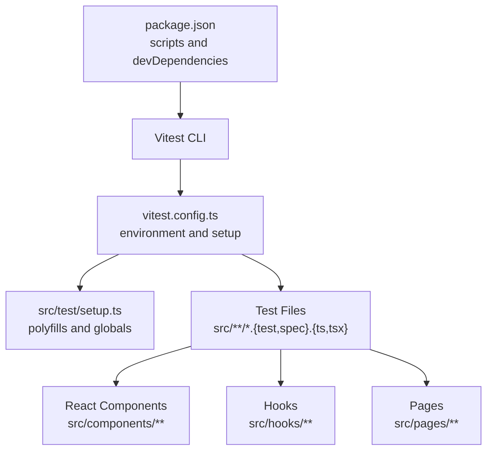
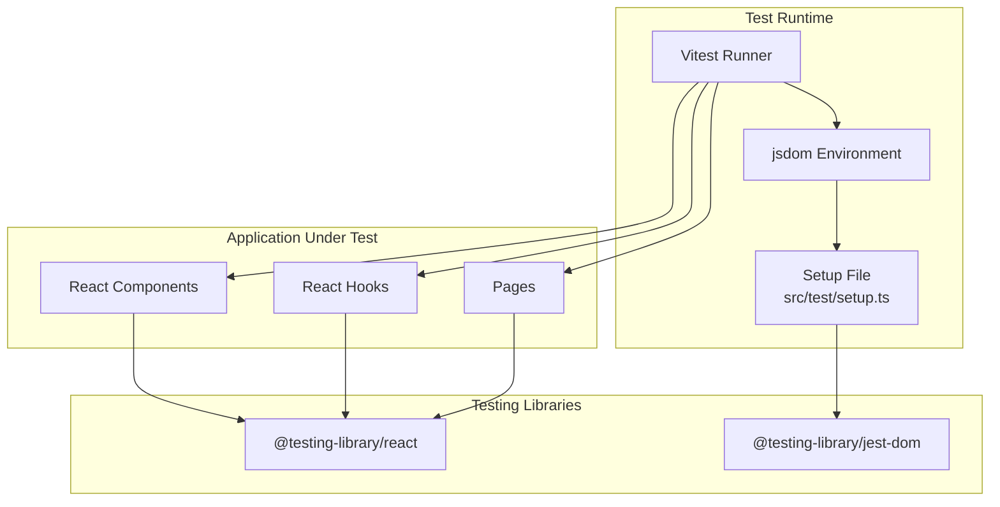
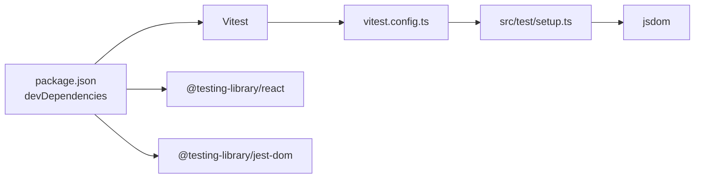

# Testing Strategy

<cite>
**Referenced Files in This Document**
- [README.md](file://README.md)
- [package.json](file://package.json)
- [vitest.config.ts](file://vitest.config.ts)
- [src/test/setup.ts](file://src/test/setup.ts)
- [src/test/example.test.ts](file://src/test/example.test.ts)
- [src/hooks/use-mobile.tsx](file://src/hooks/use-mobile.tsx)
- [src/pages/OptIn.tsx](file://src/pages/OptIn.tsx)
- [src/pages/Assessment.tsx](file://src/pages/Assessment.tsx)
- [src/components/ui/button.tsx](file://src/components/ui/button.tsx)
- [src/integrations/supabase/client.ts](file://src/integrations/supabase/client.ts)
</cite>

## Table of Contents
1. [Introduction](#introduction)
2. [Project Structure](#project-structure)
3. [Core Components](#core-components)
4. [Architecture Overview](#architecture-overview)
5. [Detailed Component Analysis](#detailed-component-analysis)
6. [Dependency Analysis](#dependency-analysis)
7. [Performance Considerations](#performance-considerations)
8. [Troubleshooting Guide](#troubleshooting-guide)
9. [Conclusion](#conclusion)
10. [Appendices](#appendices)

## Introduction
This document outlines the testing strategy and implementation for the Ryland application. It explains how Vitest and React Testing Library are configured and used, how to structure tests for React components, hooks, and async operations, and how to integrate testing into continuous integration. It also covers best practices for maintainable, reliable, and accessible tests.

## Project Structure
The repository includes a minimal but functional testing setup:
- Vitest configuration defines the jsdom environment, global APIs, a setup file, and test file inclusion patterns.
- A dedicated test setup file initializes DOM testing utilities and polyfills browser APIs commonly missing in jsdom.
- Example tests demonstrate basic assertions and describe blocks.
- The project uses React with TypeScript and integrates UI primitives and third-party libraries.

**Diagram sources**
- [package.json:12-13](file://package.json#L12-L13)
- [vitest.config.ts:5-16](file://vitest.config.ts#L5-L16)
- [src/test/setup.ts:1-15](file://src/test/setup.ts#L1-L15)

**Section sources**
- [README.md:53-61](file://README.md#L53-L61)
- [package.json:6-14](file://package.json#L6-L14)
- [vitest.config.ts:5-16](file://vitest.config.ts#L5-L16)
- [src/test/setup.ts:1-15](file://src/test/setup.ts#L1-L15)
- [src/test/example.test.ts:1-7](file://src/test/example.test.ts#L1-L7)

## Core Components
This section documents the testing framework setup and foundational utilities.

- Vitest configuration
  - Environment: jsdom for DOM APIs.
  - Globals enabled for expect matchers and describe/it blocks.
  - Setup file: src/test/setup.ts for polyfills and DOM extensions.
  - Test pattern: src/**/*.{test,spec}.{ts,tsx}.
  - Path alias: @ resolves to src for imports.

- Test setup utilities
  - Adds jest-dom matchers for DOM assertions.
  - Defines window.matchMedia to avoid runtime errors in tests.

- Example test
  - Demonstrates a passing assertion inside a describe block.

Practical guidance:
- Place all tests alongside source files with .test.ts or .test.tsx suffixes.
- Keep setup centralized in src/test/setup.ts to ensure consistent behavior across tests.
- Use describe blocks to group related tests and it blocks for individual assertions.

**Section sources**
- [vitest.config.ts:5-16](file://vitest.config.ts#L5-L16)
- [src/test/setup.ts:1-15](file://src/test/setup.ts#L1-L15)
- [src/test/example.test.ts:1-7](file://src/test/example.test.ts#L1-L7)

## Architecture Overview
The testing architecture centers on Vitest’s jsdom environment, React Testing Library helpers, and a shared setup file. Tests run against React components and hooks while leveraging DOM APIs and custom matchers.

**Diagram sources**
- [vitest.config.ts:5-16](file://vitest.config.ts#L5-L16)
- [src/test/setup.ts:1-15](file://src/test/setup.ts#L1-L15)
- [package.json:74-75](file://package.json#L74-L75)

## Detailed Component Analysis

### Testing React Components
Guidance:
- Render components under test using React Testing Library helpers.
- Query elements by role, label, or data attributes to avoid brittle selectors.
- Assert on visible text, ARIA attributes, and state changes.
- Prefer user-centric assertions over implementation details.

Example patterns:
- Button rendering and click simulation.
- Form field updates and submission handling.
- Conditional rendering based on props or state.

Relevant source references:
- Button primitive component for UI interactions.
- Form-based pages that manage user input and validation.

**Section sources**
- [src/components/ui/button.tsx](file://src/components/ui/button.tsx)
- [src/pages/OptIn.tsx:112-144](file://src/pages/OptIn.tsx#L112-L144)
- [src/pages/Assessment.tsx:364-390](file://src/pages/Assessment.tsx#L364-L390)

### Testing React Hooks
Guidance:
- Isolate hook logic by rendering a test component that consumes the hook.
- Mock browser APIs (e.g., window.matchMedia) in setup.ts.
- Verify returned state and side effects after interactions.

Example patterns:
- useIsMobile hook: assert initial state, media query change handler, and cleanup.

Relevant source references:
- Hook definition for responsive behavior.

**Section sources**
- [src/hooks/use-mobile.tsx:1-19](file://src/hooks/use-mobile.tsx#L1-L19)
- [src/test/setup.ts:3-15](file://src/test/setup.ts#L3-L15)

### Testing Async Operations
Guidance:
- Use waitFor or similar helpers to assert on asynchronous state changes.
- Mock external services (e.g., Supabase client) to control outcomes and timing.
- Test both success and error branches.

Example patterns:
- Form submission with loading states and error messages.
- Authentication flows using Supabase client.

Relevant source references:
- Supabase client integration for authentication and data operations.

**Section sources**
- [src/pages/OptIn.tsx:112-144](file://src/pages/OptIn.tsx#L112-L144)
- [src/integrations/supabase/client.ts](file://src/integrations/supabase/client.ts)

### Mocking External Dependencies
Guidance:
- Use Vitest mocks to replace module exports for services and APIs.
- Keep mock implementations minimal and focused on the tested behavior.
- Ensure mocks are reset between tests to avoid cross-test interference.

Example patterns:
- Mock Supabase client methods to simulate network responses.
- Stub global browser APIs in setup.ts for consistent behavior.

**Section sources**
- [src/test/setup.ts:1-15](file://src/test/setup.ts#L1-L15)
- [src/integrations/supabase/client.ts](file://src/integrations/supabase/client.ts)

### Testing User Interactions
Guidance:
- Simulate clicks, typing, and form submissions using React Testing Library events.
- Assert on UI changes, focus states, and accessibility attributes.
- Validate keyboard navigation and screen reader announcements.

Example patterns:
- Button clicks triggering navigation or actions.
- Input changes updating form state and validation messages.

**Section sources**
- [src/components/ui/button.tsx](file://src/components/ui/button.tsx)
- [src/pages/OptIn.tsx:112-144](file://src/pages/OptIn.tsx#L112-L144)
- [src/pages/Assessment.tsx:364-390](file://src/pages/Assessment.tsx#L364-L390)

### Accessibility Testing Approaches
Guidance:
- Use jest-dom matchers for ARIA attribute checks and color contrast validation.
- Add automated accessibility checks using axe-core or similar tools integrated with React Testing Library.
- Ensure labels, roles, and keyboard interactions are validated in tests.

Example patterns:
- Assert presence of aria-labels and roles on interactive elements.
- Verify focus management and keyboard operability.

**Section sources**
- [src/test/setup.ts:1](file://src/test/setup.ts#L1)
- [src/components/ui/button.tsx](file://src/components/ui/button.tsx)

## Dependency Analysis
The testing stack relies on Vitest, jsdom, React Testing Library, and jest-dom. These dependencies are declared in devDependencies and configured via vitest.config.ts and setup.ts.

**Diagram sources**
- [package.json:71-92](file://package.json#L71-L92)
- [vitest.config.ts:5-16](file://vitest.config.ts#L5-L16)
- [src/test/setup.ts:1-15](file://src/test/setup.ts#L1-L15)

**Section sources**
- [package.json:71-92](file://package.json#L71-L92)
- [vitest.config.ts:5-16](file://vitest.config.ts#L5-L16)
- [src/test/setup.ts:1-15](file://src/test/setup.ts#L1-L15)

## Performance Considerations
- Run tests in watch mode during development to iterate quickly.
- Use selective test filtering to focus on changed areas.
- Avoid heavy DOM queries; prefer querying by role or data attributes.
- Mock expensive external services to reduce flakiness and improve speed.
- Keep test fixtures small and deterministic.

## Troubleshooting Guide
Common issues and resolutions:
- Missing window.matchMedia
  - Cause: Browser API not available in jsdom.
  - Resolution: Define matchMedia in setup.ts as shown in the setup file.
- Jest DOM matchers unavailable
  - Cause: Missing jest-dom import.
  - Resolution: Import @testing-library/jest-dom in setup.ts.
- Aliasing issues
  - Cause: Imports resolving incorrectly in tests.
  - Resolution: Configure path alias in vitest.config.ts to point to src.

**Section sources**
- [src/test/setup.ts:1-15](file://src/test/setup.ts#L1-L15)
- [vitest.config.ts:13-15](file://vitest.config.ts#L13-L15)

## Conclusion
The Ryland application employs a pragmatic testing setup using Vitest and React Testing Library. By centralizing setup, structuring tests around user interactions, and mocking external dependencies, teams can write reliable, maintainable tests. Extending the strategy with accessibility checks and performance-aware practices ensures robust coverage across components, hooks, and async flows.

## Appendices
- Running tests
  - Use the test scripts defined in package.json to execute tests in run or watch modes.
- Adding new tests
  - Place .test.ts or .test.tsx files alongside source files.
  - Leverage setup.ts for shared utilities and polyfills.

**Section sources**
- [package.json:12-13](file://package.json#L12-L13)
- [src/test/example.test.ts:1-7](file://src/test/example.test.ts#L1-L7)