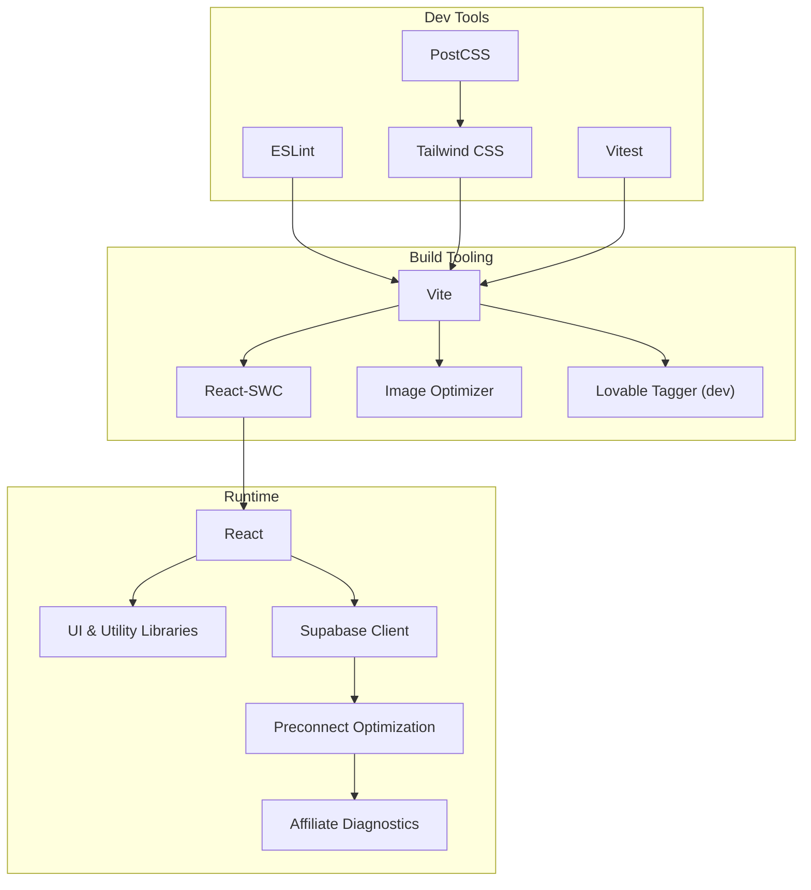
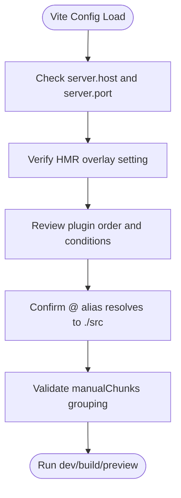
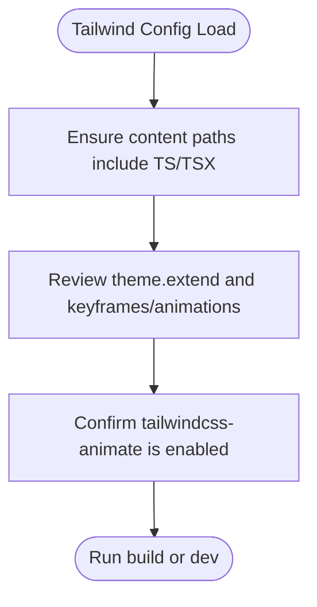
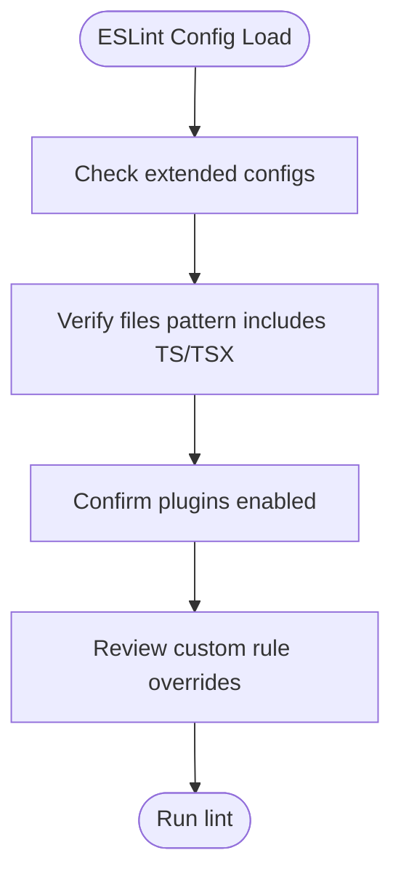
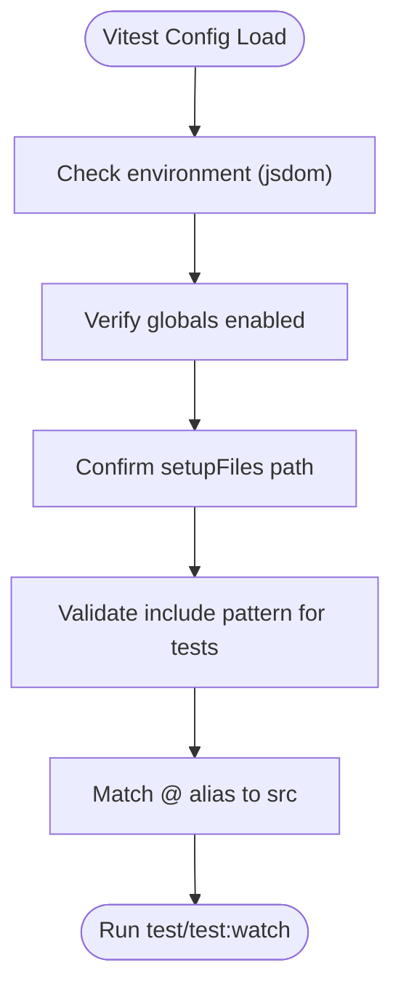
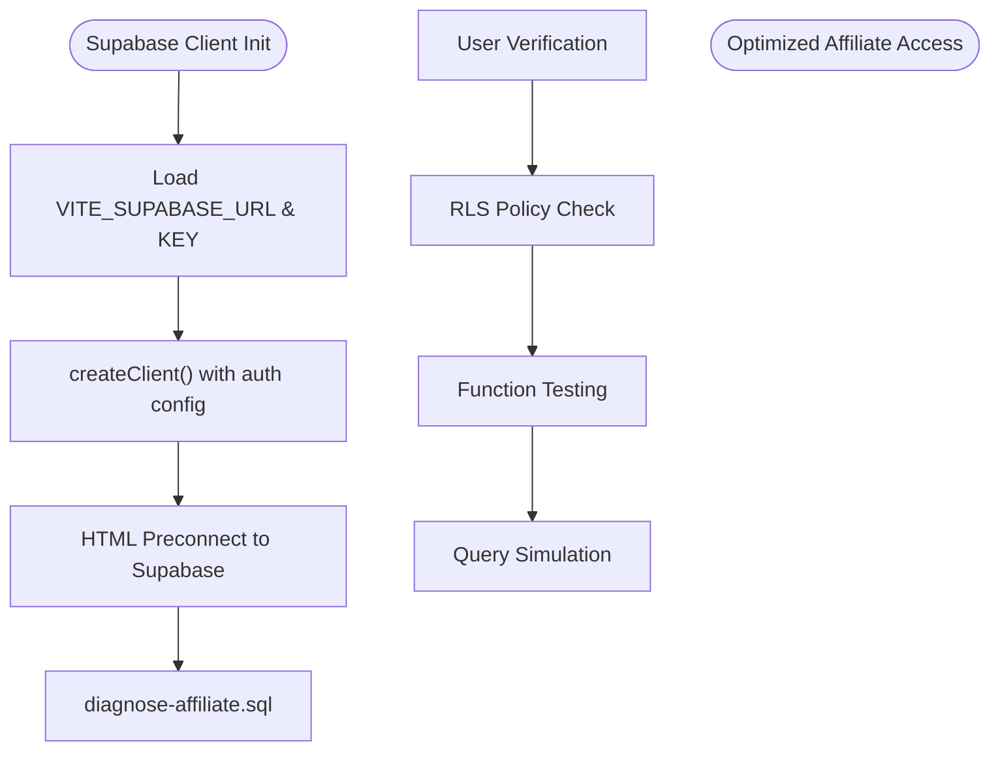
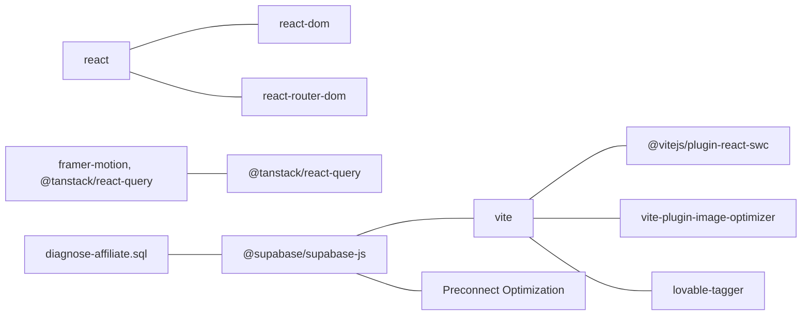

# Troubleshooting & FAQ

<cite>
**Referenced Files in This Document**
- [README.md](file://README.md)
- [package.json](file://package.json)
- [vite.config.ts](file://vite.config.ts)
- [tailwind.config.ts](file://tailwind.config.ts)
- [eslint.config.js](file://eslint.config.js)
- [postcss.config.js](file://postcss.config.js)
- [vitest.config.ts](file://vitest.config.ts)
- [index.html](file://index.html)
- [diagnose-affiliate.sql](file://supabase/diagnose-affiliate.sql)
- [client.ts](file://src/integrations/supabase/client.ts)
- [20260319185313_dca7f1ac-2647-4ed9-857f-2c536367875e.sql](file://supabase/migrations/20260319185313_dca7f1ac-2647-4ed9-857f-2c536367875e.sql)
- [20260319194628_4e5f50a6-8cb3-40d1-b56d-a5bacde2a132.sql](file://supabase/migrations/20260319194628_4e5f50a6-8cb3-40d1-b56d-a5bacde2a132.sql)
</cite>

## Table of Contents
1. [Introduction](#introduction)
2. [Project Structure](#project-structure)
3. [Core Components](#core-components)
4. [Architecture Overview](#architecture-overview)
5. [Detailed Component Analysis](#detailed-component-analysis)
6. [Dependency Analysis](#dependency-analysis)
7. [Performance Considerations](#performance-considerations)
8. [Troubleshooting Guide](#troubleshooting-guide)
9. [FAQ](#faq)
10. [Conclusion](#conclusion)
11. [Appendices](#appendices)

## Introduction
This section provides a practical troubleshooting guide and FAQ for the Ryland project. It focuses on resolving common development environment setup issues, build errors, and runtime problems. It also covers Vite configuration pitfalls, dependency conflicts, TypeScript compilation errors, debugging techniques, log analysis, and diagnostic tools. The guide now includes comprehensive coverage of affiliate access debugging using the new diagnostic script and Supabase preconnect optimizations for improved performance.

## Project Structure
The project is a Vite-powered React application with TypeScript, Tailwind CSS, and optional testing via Vitest. The configuration files define the development server, bundling strategy, plugin chain, and linting rules. The application integrates with Supabase for authentication and database operations, with performance optimizations including preconnect directives for Supabase endpoints.

```mermaid
graph TB
A["package.json<br/>Scripts and Dependencies"] --> B["vite.config.ts<br/>Vite Dev Server & Build"]
A --> C["tailwind.config.ts<br/>Tailwind Content & Theme"]
A --> D["postcss.config.js<br/>PostCSS Plugins"]
A --> E["eslint.config.js<br/>ESLint Rules"]
A --> F["vitest.config.ts<br/>Testing Setup"]
B --> G["React Plugin (@vitejs/plugin-react-swc)"]
B --> H["Lovable Tagger (dev)"]
B --> I["Image Optimizer Plugin"]
B --> J["Path Alias (@ -> src)"]
B --> K["Manual Chunks (vendor/ui/supabase)"]
C --> L["Content Paths (*.ts, *.tsx)"]
C --> M["Plugins (tailwindcss-animate)"]
N["index.html<br/>Preconnect & Prefetch"] --> O["Supabase Preconnect"]
N --> P["Font Preloads"]
Q["diagnose-affiliate.sql<br/>Affiliate Debug Script"] --> R["User Verification"]
Q --> S["RLS Policy Validation"]
Q --> T["Function Testing"]
U["src/integrations/supabase/client.ts<br/>Supabase Client"] --> V["Environment Variables"]
U --> W["Auto Refresh & Persistence"]
```

**Diagram sources**
- [package.json:6-14](file://package.json#L6-L14)
- [vite.config.ts:1-43](file://vite.config.ts#L1-L43)
- [tailwind.config.ts:1-97](file://tailwind.config.ts#L1-L97)
- [postcss.config.js:1-7](file://postcss.config.js#L1-L7)
- [eslint.config.js:1-27](file://eslint.config.js#L1-L27)
- [vitest.config.ts:1-17](file://vitest.config.ts#L1-L17)
- [index.html:15-18](file://index.html#L15-L18)
- [diagnose-affiliate.sql:1-51](file://supabase/diagnose-affiliate.sql#L1-L51)
- [client.ts:5-17](file://src/integrations/supabase/client.ts#L5-L17)

**Section sources**
- [README.md:53-61](file://README.md#L53-L61)
- [package.json:6-14](file://package.json#L6-L14)

## Core Components
- Vite configuration defines the dev server, HMR behavior, plugins, path aliases, and build chunking strategy.
- Tailwind configuration controls content scanning, theme extensions, and animations.
- ESLint configuration enforces TypeScript and React rules with recommended defaults and custom overrides.
- PostCSS configuration enables Tailwind and Autoprefixer.
- Vitest configuration sets up the testing environment, alias, and test file discovery.
- **Updated** Supabase integration with preconnect optimization and comprehensive affiliate debugging capabilities.

**Section sources**
- [vite.config.ts:8-42](file://vite.config.ts#L8-L42)
- [tailwind.config.ts:3-96](file://tailwind.config.ts#L3-L96)
- [eslint.config.js:7-26](file://eslint.config.js#L7-L26)
- [postcss.config.js:1-7](file://postcss.config.js#L1-L7)
- [vitest.config.ts:5-16](file://vitest.config.ts#L5-L16)
- [index.html:15-18](file://index.html#L15-L18)
- [diagnose-affiliate.sql:1-51](file://supabase/diagnose-affiliate.sql#L1-L51)

## Architecture Overview
The development stack integrates Vite for fast builds and HMR, React-SWC for JSX/TSX transpilation, Tailwind CSS for styling, and optional testing with Vitest. ESLint ensures code quality, while PostCSS applies Tailwind and Autoprefixer. **Updated** Supabase client provides authentication and database operations with preconnect optimization for improved performance.

**Diagram sources**
- [vite.config.ts:16-25](file://vite.config.ts#L16-L25)
- [tailwind.config.ts:95](file://tailwind.config.ts#L95)
- [postcss.config.js:1-7](file://postcss.config.js#L1-L7)
- [eslint.config.js:1-27](file://eslint.config.js#L1-L27)
- [vitest.config.ts:1-17](file://vitest.config.ts#L1-L17)
- [index.html:15-18](file://index.html#L15-L18)
- [diagnose-affiliate.sql:1-51](file://supabase/diagnose-affiliate.sql#L1-L51)

## Detailed Component Analysis

### Vite Configuration Analysis
Key areas to troubleshoot:
- Dev server host/port and HMR overlay settings.
- Plugin order and conditional plugins (e.g., component tagger).
- Path alias correctness for imports.
- Manual chunking strategy for vendor/UI/SupaBase bundles.

**Diagram sources**
- [vite.config.ts:9-25](file://vite.config.ts#L9-L25)
- [vite.config.ts:26-41](file://vite.config.ts#L26-L41)

**Section sources**
- [vite.config.ts:8-42](file://vite.config.ts#L8-L42)

### Tailwind Configuration Analysis
Focus areas:
- Content globs match your TS/TSX files.
- Theme extensions and animations configured.
- Plugins applied (tailwindcss-animate).

**Diagram sources**
- [tailwind.config.ts:4-5](file://tailwind.config.ts#L4-L5)
- [tailwind.config.ts:95](file://tailwind.config.ts#L95)

**Section sources**
- [tailwind.config.ts:3-96](file://tailwind.config.ts#L3-L96)

### ESLint Configuration Analysis
Highlights:
- Recommended base configs extended.
- React Hooks and React Refresh plugins enabled.
- Custom rule overrides (e.g., unused vars off).

**Diagram sources**
- [eslint.config.js:7-26](file://eslint.config.js#L7-L26)

**Section sources**
- [eslint.config.js:1-27](file://eslint.config.js#L1-L27)

### Vitest Configuration Analysis
Focus areas:
- Environment set to jsdom.
- Global setup and test file inclusion.
- Path alias aligned with Vite.

**Diagram sources**
- [vitest.config.ts:5-16](file://vitest.config.ts#L5-L16)

**Section sources**
- [vitest.config.ts:1-17](file://vitest.config.ts#L1-L17)

### Supabase Integration Analysis
**Updated** The Supabase integration now includes performance optimizations and comprehensive debugging capabilities:
- Preconnect directive for Supabase endpoint reduces connection latency.
- Dedicated diagnostic script for affiliate access issues.
- Environment-based client configuration with auto-refresh and persistence.
- Row Level Security policies for data access control.

**Diagram sources**
- [client.ts:5-17](file://src/integrations/supabase/client.ts#L5-L17)
- [index.html:17](file://index.html#L17)
- [diagnose-affiliate.sql:3-41](file://supabase/diagnose-affiliate.sql#L3-L41)

**Section sources**
- [client.ts:5-17](file://src/integrations/supabase/client.ts#L5-L17)
- [index.html:17](file://index.html#L17)
- [diagnose-affiliate.sql:1-51](file://supabase/diagnose-affiliate.sql#L1-L51)

## Dependency Analysis
The project relies on Vite, React, TypeScript, Tailwind CSS, Radix UI primitives, Supabase client, TanStack React Query, and others. Conflicts often arise from mismatched peer dependencies or incorrect plugin versions.

**Diagram sources**
- [package.json:6-14](file://package.json#L6-L14)
- [package.json:15-93](file://package.json#L15-L93)
- [package.json:71-93](file://package.json#L71-L93)
- [index.html:17](file://index.html#L17)
- [diagnose-affiliate.sql:1-51](file://supabase/diagnose-affiliate.sql#L1-L51)

**Section sources**
- [package.json:15-93](file://package.json#L15-L93)

## Performance Considerations
- Keep HMR overlay disabled in production-like previews to reduce noise.
- Use manualChunks to split large vendor/UI/SupaBase bundles.
- Optimize image assets with the image optimizer plugin.
- Ensure Tailwind content globs are precise to avoid scanning unnecessary files.
- **Updated** Implement Supabase preconnect in HTML head to reduce connection latency.
- **Updated** Use the affiliate diagnostic script to identify and resolve access performance issues.

## Troubleshooting Guide

### Development Environment Setup Problems
- Node.js and npm installation
  - Ensure Node.js is installed and managed via nvm if needed.
  - Verify availability of npm commands.
  - Reference: [README.md:21](file://README.md#L21)

- Cloning and initial setup
  - Clone the repository using the project's Git URL.
  - Navigate to the project directory and install dependencies.
  - Start the development server with auto-reload.
  - Reference: [README.md:25-37](file://README.md#L25-L37)

- IDE or Codespaces workflows
  - Work locally with your preferred IDE or use GitHub Codespaces.
  - Reference: [README.md:17-51](file://README.md#L17-L51)

**Section sources**
- [README.md:17-51](file://README.md#L17-L51)
- [README.md:25-37](file://README.md#L25-L37)

### Build Errors
- Vite build fails
  - Run the build script and inspect the output logs.
  - Confirm Vite version compatibility with plugins.
  - Reference: [package.json:8](file://package.json#L8), [vite.config.ts:1-43](file://vite.config.ts#L1-L43)

- Manual chunks configuration
  - If bundle splitting causes issues, adjust manualChunks groups.
  - Reference: [vite.config.ts:31-41](file://vite.config.ts#L31-L41)

- Image optimization plugin issues
  - Temporarily disable the image optimizer plugin to isolate the problem.
  - Reference: [vite.config.ts:19-24](file://vite.config.ts#L19-L24)

**Section sources**
- [package.json:8](file://package.json#L8)
- [vite.config.ts:31-41](file://vite.config.ts#L31-L41)
- [vite.config.ts:19-24](file://vite.config.ts#L19-L24)

### Runtime Issues
- HMR overlay and browser console
  - Disable HMR overlay in Vite config to reduce distraction.
  - Inspect browser console for runtime errors.
  - Reference: [vite.config.ts:12-14](file://vite.config.ts#L12-L14)

- Dev server host/port conflicts
  - Change server.host or server.port if the default port is in use.
  - Reference: [vite.config.ts:9-15](file://vite.config.ts#L9-L15)

- **Updated** Supabase connection performance
  - Verify preconnect directive is present in HTML head.
  - Check network tab for reduced connection latency to Supabase.
  - Reference: [index.html:17](file://index.html#L17)

**Section sources**
- [vite.config.ts:9-15](file://vite.config.ts#L9-L15)
- [vite.config.ts:12-14](file://vite.config.ts#L12-L14)
- [index.html:17](file://index.html#L17)

### Vite Configuration Problems
- Plugin order and conditions
  - Ensure React plugin is loaded before other plugins.
  - Conditional plugins (e.g., component tagger) should only run in development.
  - Reference: [vite.config.ts:16-25](file://vite.config.ts#L16-L25)

- Path alias misconfiguration
  - Confirm the @ alias resolves to the src directory.
  - Reference: [vite.config.ts:26-30](file://vite.config.ts#L26-L30)

**Section sources**
- [vite.config.ts:16-25](file://vite.config.ts#L16-L25)
- [vite.config.ts:26-30](file://vite.config.ts#L26-L30)

### Dependency Conflicts
- Peer dependency mismatches
  - Align versions of React, ReactDOM, and related libraries.
  - Reference: [package.json:56-61](file://package.json#L56-L61)

- Plugin version compatibility
  - Ensure Vite and plugin versions are compatible.
  - Reference: [package.json:91](file://package.json#L91), [package.json:79](file://package.json#L79)

- Conditional dev-only plugins
  - Remove or disable dev-only plugins when building for production.
  - Reference: [vite.config.ts:18](file://vite.config.ts#L18)

**Section sources**
- [package.json:56-61](file://package.json#L56-L61)
- [package.json:91](file://package.json#L91)
- [package.json:79](file://package.json#L79)
- [vite.config.ts:18](file://vite.config.ts#L18)

### TypeScript Compilation Errors
- Enable strictness gradually
  - Start with recommended rules and relax selectively.
  - Reference: [eslint.config.js:10-25](file://eslint.config.js#L10-L25)

- Unused variable rules
  - Adjust or disable unused variable rules if needed.
  - Reference: [eslint.config.js:23](file://eslint.config.js#L23)

- Test setup alignment
  - Ensure test setup files align with TypeScript expectations.
  - Reference: [vitest.config.ts:10](file://vitest.config.ts#L10)

**Section sources**
- [eslint.config.js:10-25](file://eslint.config.js#L10-L25)
- [eslint.config.js:23](file://eslint.config.js#L23)
- [vitest.config.ts:10](file://vitest.config.ts#L10)

### **Updated** Affiliate Access Debugging
**New Section** Comprehensive troubleshooting for affiliate access issues using the dedicated diagnostic script:

#### Using the Affiliate Diagnostic Script
1. Open Supabase SQL Editor with superuser privileges
2. Execute the diagnostic script to check:
   - User existence in auth.users table
   - Affiliate record verification
   - RLS policy validation
   - Function testing (get_my_affiliate_id)
   - Exact query simulation matching app behavior

#### Step-by-Step Affiliate Issue Resolution
1. **User Verification Phase**
   - Check if user exists in auth.users with correct ID format
   - Verify user account status and authentication state

2. **Affiliate Record Phase**
   - Confirm affiliate record exists for the user
   - Check affiliate status and required fields
   - Verify affiliate_id generation and linking

3. **RLS Policy Phase**
   - Enable row level security on affiliates table
   - Verify "Affiliates can view own record" policy
   - Check "Affiliates can update own record" policy
   - Validate get_my_affiliate_id function exists and works

4. **Query Simulation Phase**
   - Test exact query the app performs
   - Verify SELECT permissions for authenticated users
   - Check column access and data visibility

5. **Data Structure Phase**
   - Examine affiliate table structure and sample data
   - Verify required columns exist (full_name, email, status)
   - Check relationship with auth.users table

**Section sources**
- [diagnose-affiliate.sql:1-51](file://supabase/diagnose-affiliate.sql#L1-L51)

### **Updated** Supabase Performance Optimization
**New Section** Implementing preconnect optimization for improved Supabase performance:

#### Supabase Preconnect Implementation
1. Add preconnect link tags in HTML head for Supabase endpoint
2. Configure font preconnect for Google Fonts
3. Implement prefetch for critical assets
4. Monitor connection improvements in browser dev tools

#### Performance Monitoring Steps
1. Open browser developer tools
2. Navigate to Network tab
3. Clear previous requests
4. Reload the page
5. Observe reduced connection establishment time
6. Verify preconnect headers in response

**Section sources**
- [index.html:15-22](file://index.html#L15-L22)

### Debugging Techniques, Log Analysis, and Diagnostic Tools
- Use Vite's dev server logs to identify plugin or alias issues.
- Inspect browser console for runtime errors and warnings.
- Run ESLint to catch lint-time issues early.
- Use Vitest for unit/integration tests and jsdom environment.
- **Updated** Utilize the affiliate diagnostic script for comprehensive database access debugging.
- **Updated** Monitor Supabase connection performance using browser network tools.
- Reference: [vite.config.ts:9-15](file://vite.config.ts#L9-L15), [eslint.config.js:10-25](file://eslint.config.js#L10-L25), [vitest.config.ts:7-12](file://vitest.config.ts#L7-L12), [diagnose-affiliate.sql:1-51](file://supabase/diagnose-affiliate.sql#L1-L51)

**Section sources**
- [vite.config.ts:9-15](file://vite.config.ts#L9-L15)
- [eslint.config.js:10-25](file://eslint.config.js#L10-L25)
- [vitest.config.ts:7-12](file://vitest.config.ts#L7-L12)
- [diagnose-affiliate.sql:1-51](file://supabase/diagnose-affiliate.sql#L1-L51)

### Step-by-Step Resolution Guides

#### Resolve Vite Dev Server Port Conflict
1. Open the Vite configuration file.
2. Change the server.port value to an available port.
3. Save and restart the dev server.
- Reference: [vite.config.ts:11](file://vite.config.ts#L11)

#### Fix Path Alias Import Errors
1. Open the Vite configuration file.
2. Verify the @ alias points to the src directory.
3. Ensure imports use the @ prefix consistently.
- Reference: [vite.config.ts:28](file://vite.config.ts#L28)

#### Disable HMR Overlay for Cleaner Logs
1. Open the Vite configuration file.
2. Set the HMR overlay option to false.
3. Restart the dev server.
- Reference: [vite.config.ts:13](file://vite.config.ts#L13)

#### Resolve Image Optimization Plugin Issues
1. Temporarily remove or comment out the image optimizer plugin.
2. Re-run the dev/build process.
3. Re-enable the plugin and adjust quality settings if needed.
- Reference: [vite.config.ts:19-24](file://vite.config.ts#L19-L24)

#### Align Vitest with Vite Aliases
1. Open the Vitest configuration file.
2. Add or confirm the @ alias pointing to src.
3. Run tests again.
- Reference: [vitest.config.ts:14](file://vitest.config.ts#L14)

#### Fix Tailwind Content Scanning Issues
1. Open the Tailwind configuration file.
2. Ensure content globs include your TS/TSX directories.
3. Re-run the dev/build process.
- Reference: [tailwind.config.ts:5](file://tailwind.config.ts#L5)

#### Resolve ESLint Rule Conflicts
1. Review the ESLint configuration file.
2. Adjust or remove conflicting rules.
3. Re-run linting.
- Reference: [eslint.config.js:20-25](file://eslint.config.js#L20-L25)

#### **Updated** Implement Supabase Preconnect Optimization
1. Open the HTML file in the project root.
2. Add preconnect link tag for Supabase endpoint in the head section.
3. Add font preconnect tags for Google Fonts.
4. Implement prefetch for critical assets.
5. Test connection performance in browser dev tools.
- Reference: [index.html:15-22](file://index.html#L15-L22)

#### **Updated** Debug Affiliate Access Issues
1. Open Supabase SQL Editor with superuser privileges.
2. Copy and paste the diagnostic script into the editor.
3. Replace the user ID with the problematic user's ID.
4. Execute the script step by step.
5. Analyze results and address identified issues.
6. Re-test affiliate functionality in the application.
- Reference: [diagnose-affiliate.sql:1-51](file://supabase/diagnose-affiliate.sql#L1-L51)

**Section sources**
- [vite.config.ts:11](file://vite.config.ts#L11)
- [vite.config.ts:28](file://vite.config.ts#L28)
- [vite.config.ts:13](file://vite.config.ts#L13)
- [vite.config.ts:19-24](file://vite.config.ts#L19-L24)
- [vitest.config.ts:14](file://vitest.config.ts#L14)
- [tailwind.config.ts:5](file://tailwind.config.ts#L5)
- [eslint.config.js:20-25](file://eslint.config.js#L20-L25)
- [index.html:15-22](file://index.html#L15-L22)
- [diagnose-affiliate.sql:1-51](file://supabase/diagnose-affiliate.sql#L1-L51)

## FAQ

### Common Development Scenarios
- How do I start the development server?
  - Use the dev script defined in package.json.
  - Reference: [package.json:7](file://package.json#L7)

- How do I preview the production build locally?
  - Use the preview script after building.
  - Reference: [package.json:11](file://package.json#L11)

- How do I run tests?
  - Use the test or test:watch scripts.
  - Reference: [package.json:12-13](file://package.json#L12-L13)

**Section sources**
- [package.json:7](file://package.json#L7)
- [package.json:11](file://package.json#L11)
- [package.json:12-13](file://package.json#L12-L13)

### Deployment Issues
- How do I deploy the project?
  - Use the platform's publish workflow from the project dashboard.
  - Reference: [README.md:63-65](file://README.md#L63-L65)

- How do I connect a custom domain?
  - Configure domains in the project settings.
  - Reference: [README.md:67-73](file://README.md#L67-L73)

**Section sources**
- [README.md:63-65](file://README.md#L63-L65)
- [README.md:67-73](file://README.md#L67-L73)

### Performance Problems
- Why is the dev server slow?
  - Reduce content globs in Tailwind config.
  - Disable or tune the image optimizer plugin.
  - Reference: [tailwind.config.ts:5](file://tailwind.config.ts#L5), [vite.config.ts:19-24](file://vite.config.ts#L19-L24)

- Why are bundles large?
  - Adjust manualChunks to optimize vendor/UI/SupaBase separation.
  - Reference: [vite.config.ts:34-39](file://vite.config.ts#L34-L39)

- **Updated** Why is Supabase connection slow?
  - Verify preconnect directive is present in HTML head.
  - Check network tab for reduced connection establishment time.
  - Monitor browser dev tools for improved connection performance.
  - Reference: [index.html:17](file://index.html#L17)

**Section sources**
- [tailwind.config.ts:5](file://tailwind.config.ts#L5)
- [vite.config.ts:19-24](file://vite.config.ts#L19-L24)
- [vite.config.ts:34-39](file://vite.config.ts#L34-L39)
- [index.html:17](file://index.html#L17)

### **Updated** Affiliate Access Issues
**New Section** Frequently asked questions about affiliate access problems:

#### Why can't affiliates access their records?
- Check if the affiliate record exists in the affiliates table
- Verify RLS policies are enabled and properly configured
- Ensure get_my_affiliate_id function returns the correct affiliate ID
- Test the exact query the application uses to access affiliate data

#### How do I debug affiliate access problems?
- Use the diagnose-affiliate.sql script to step through the verification process
- Check user authentication status in auth.users table
- Verify row level security policies on affiliates table
- Test function execution and query simulation

#### What RLS policies should be in place?
- Affiliates can view own record (SELECT USING user_id = auth.uid())
- Affiliates can update own record (UPDATE USING user_id = auth.uid())
- get_my_affiliate_id function should return affiliate ID for current user
- Affiliate leads policies should use get_my_affiliate_id for access control

**Section sources**
- [diagnose-affiliate.sql:13-27](file://supabase/diagnose-affiliate.sql#L13-L27)
- [20260319185313_dca7f1ac-2647-4ed9-857f-2c536367875e.sql:10-18](file://supabase/migrations/20260319185313_dca7f1ac-2647-4ed9-857f-2c536367875e.sql#L10-L18)
- [20260319194628_4e5f50a6-8cb3-40d1-b56d-a5bacde2a132.sql:2-5](file://supabase/migrations/20260319194628_4e5f50a6-8cb3-40d1-b56d-a5bacde2a132.sql#L2-L5)

### Community Resources, Support Channels, and Escalation Procedures
- Use the platform's project dashboard for publishing and domain management.
- For advanced issues, consult the platform's documentation links and support channels referenced in the project README.
- **Updated** For database access issues, use the diagnose-affiliate.sql script for systematic debugging.
- **Updated** Monitor Supabase connection performance using browser network tools and preconnect optimization.
- Reference: [README.md:5](file://README.md#L5), [README.md:63-73](file://README.md#L63-L73), [diagnose-affiliate.sql:1-51](file://supabase/diagnose-affiliate.sql#L1-L51)

**Section sources**
- [README.md:5](file://README.md#L5)
- [README.md:63-73](file://README.md#L63-L73)
- [diagnose-affiliate.sql:1-51](file://supabase/diagnose-affiliate.sql#L1-L51)

## Conclusion
This guide consolidates actionable steps to resolve common development, build, and runtime issues in the Ryland project. **Updated** The guide now includes comprehensive affiliate access debugging capabilities through the dedicated diagnostic script and performance optimizations via Supabase preconnect implementation. By aligning Vite, Tailwind, ESLint, Vitest, and Supabase configurations with the project's dependencies and scripts, most problems can be quickly identified and resolved. The new diagnostic tools provide systematic approaches to troubleshooting affiliate access issues, while preconnect optimization improves Supabase connection performance. For persistent issues, leverage the platform's documentation and support resources.

## Appendices

### Quick Checklist
- Node.js and npm are installed and working.
- Dependencies are installed via the package manager.
- Dev server runs without port conflicts.
- Aliases resolve correctly in both Vite and Vitest.
- Tailwind content globs include TS/TSX files.
- ESLint rules are aligned with your workflow.
- Tests pass in the jsdom environment.
- **Updated** Supabase preconnect directive is present in HTML head.
- **Updated** Affiliate diagnostic script is available for debugging.
- **Updated** Supabase connection performance is monitored and optimized.