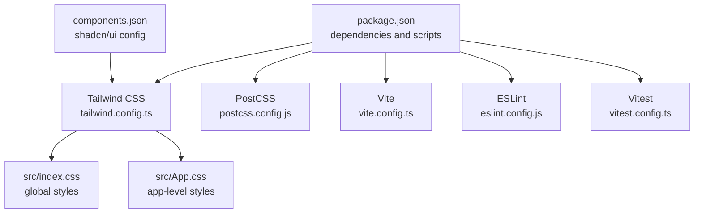
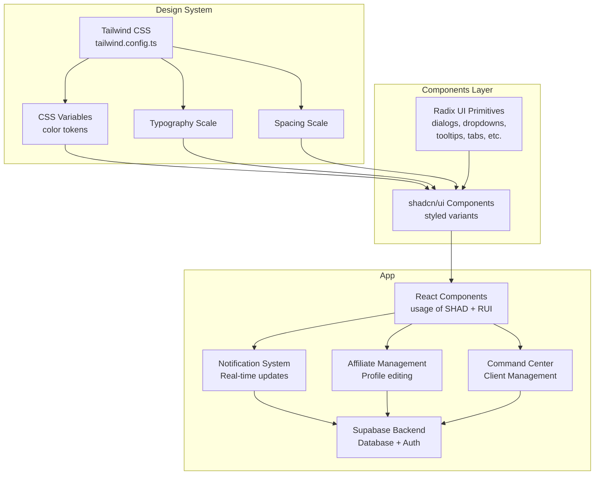
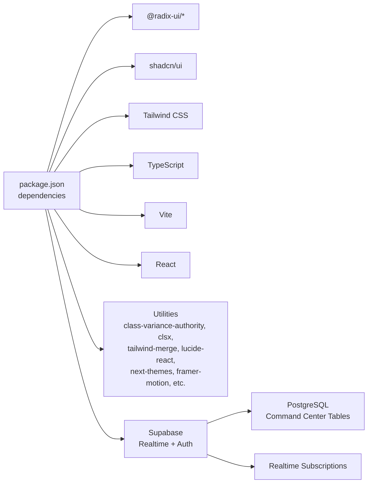

# UI Components & Design System

<cite>
**Referenced Files in This Document**
- [README.md](file://README.md)
- [package.json](file://package.json)
- [components.json](file://components.json)
- [tailwind.config.ts](file://tailwind.config.ts)
- [src/index.css](file://src/index.css)
- [src/App.css](file://src/App.css)
- [vite.config.ts](file://vite.config.ts)
- [postcss.config.js](file://postcss.config.js)
- [eslint.config.js](file://eslint.config.js)
- [vitest.config.ts](file://vitest.config.ts)
- [src/components/portal/LeadsTable.tsx](file://src/components/portal/LeadsTable.tsx)
- [src/pages/portal/PortalLeads.tsx](file://src/pages/portal/PortalLeads.tsx)
- [src/hooks/useAffiliateLeads.ts](file://src/hooks/useAffiliateLeads.ts)
- [src/types/leads.ts](file://src/types/leads.ts)
- [src/components/funnel/ConsultationCalendar.tsx](file://src/components/funnel/ConsultationCalendar.tsx)
- [src/components/funnel/PartnerOnboardingCalendar.tsx](file://src/components/funnel/PartnerOnboardingCalendar.tsx)
- [src/components/ui/calendar.tsx](file://src/components/ui/calendar.tsx)
- [src/integrations/supabase/client.ts](file://src/integrations/supabase/client.ts)
- [supabase/functions/ghl-calendar/index.ts](file://supabase/functions/ghl-calendar/index.ts)
- [src/pages/funnel/FunnelConsultation.tsx](file://src/pages/funnel/FunnelConsultation.tsx)
- [src/components/NotificationBell.tsx](file://src/components/NotificationBell.tsx)
- [src/components/admin/AdminLayout.tsx](file://src/components/admin/AdminLayout.tsx)
- [src/components/portal/PortalLayout.tsx](file://src/components/portal/PortalLayout.tsx)
- [src/components/admin/affiliate-detail/AffiliateProfileTab.tsx](file://src/components/admin/affiliate-detail/AffiliateProfileTab.tsx)
- [src/components/admin/affiliate-detail/AffiliateSettingsTab.tsx](file://src/components/admin/affiliate-detail/AffiliateSettingsTab.tsx)
- [src/pages/admin/AdminAffiliateDetail.tsx](file://src/pages/admin/AdminAffiliateDetail.tsx)
- [supabase/migrations/20260328_notifications.sql](file://supabase/migrations/20260328_notifications.sql)
- [src/components/command-center/CommandCenterLayout.tsx](file://src/components/command-center/CommandCenterLayout.tsx)
- [src/components/command-center/CommandCenterSidebar.tsx](file://src/components/command-center/CommandCenterSidebar.tsx)
- [src/components/command-center/CommandCenterGuard.tsx](file://src/components/command-center/CommandCenterGuard.tsx)
- [src/components/command-center/quick-info/AddressBlock.tsx](file://src/components/command-center/quick-info/AddressBlock.tsx)
- [src/components/command-center/quick-info/CopyField.tsx](file://src/components/command-center/quick-info/CopyField.tsx)
- [src/pages/command-center/QuickInfoCard.tsx](file://src/pages/command-center/QuickInfoCard.tsx)
- [src/hooks/useCommandCenterRole.ts](file://src/hooks/useCommandCenterRole.ts)
- [supabase/migrations/20260330000000_command_center_schema.sql](file://supabase/migrations/20260330000000_command_center_schema.sql)
</cite>

## Update Summary
**Changes Made**
- Added comprehensive documentation for the new Command Center interface with CommandCenterLayout, CommandCenterSidebar, and CommandCenterGuard components
- Documented specialized quick info components: AddressBlock and CopyField for client information display
- Enhanced role-based access control documentation with detailed permission matrix
- Updated database schema documentation to include Command Center tables and RLS policies
- Added QuickInfoCard component documentation with client information display patterns
- Expanded component integration patterns showing Command Center layout usage

## Table of Contents
1. [Introduction](#introduction)
2. [Project Structure](#project-structure)
3. [Core Components](#core-components)
4. [Architecture Overview](#architecture-overview)
5. [Detailed Component Analysis](#detailed-component-analysis)
6. [Command Center Interface](#command-center-interface)
7. [Quick Info Components](#quick-info-components)
8. [Role-Based Access Control](#role-based-access-control)
9. [Database Schema](#database-schema)
10. [Notification System](#notification-system)
11. [Affiliate Management Components](#affiliate-management-components)
12. [Dependency Analysis](#dependency-analysis)
13. [Performance Considerations](#performance-considerations)
14. [Troubleshooting Guide](#troubleshooting-guide)
15. [Conclusion](#conclusion)
16. [Appendices](#appendices)

## Introduction
This document describes the UI components and design system used in the Ryland application. The project is a Vite + React + TypeScript application that integrates shadcn/ui component library with Radix UI primitives and Tailwind CSS. It leverages design tokens, a color system, typography scale, and spacing conventions configured via Tailwind to provide accessible, customizable building blocks. The document explains how components are structured, how theming and composition work, and how to use and extend the design system effectively.

**Updated** The application now includes a comprehensive Command Center interface for funding management with role-based access control, specialized quick info components for client data display, and enhanced database schema supporting client management workflows.

## Project Structure
The repository includes configuration files for Tailwind CSS, PostCSS, ESLint, Vite, and Vitest, along with the shadcn/ui configuration. The application depends on numerous Radix UI primitives and shadcn/ui components, indicating a component-driven UI architecture.



**Diagram sources**
- [package.json:15-69](file://package.json#L15-L69)
- [tailwind.config.ts](file://tailwind.config.ts)
- [postcss.config.js](file://postcss.config.js)
- [vite.config.ts](file://vite.config.ts)
- [eslint.config.js](file://eslint.config.js)
- [vitest.config.ts](file://vitest.config.ts)
- [components.json:1-20](file://components.json#L1-L20)
- [src/index.css](file://src/index.css)
- [src/App.css](file://src/App.css)

**Section sources**
- [README.md:53-61](file://README.md#L53-L61)
- [package.json:15-69](file://package.json#L15-L69)
- [components.json:1-20](file://components.json#L1-L20)

## Core Components
The design system centers around:
- Radix UI primitives for accessible base components (e.g., dialogs, dropdowns, tooltips, tabs, sliders, switches, progress indicators).
- shadcn/ui components built on top of Radix UI and styled with Tailwind CSS, configured via components.json.
- Tailwind CSS for design tokens, color system, typography scale, and spacing conventions.

Key integration points:
- shadcn/ui configuration defines aliases and Tailwind settings, including CSS variables for base colors.
- Tailwind configuration controls the design system's foundational tokens and enables consistent theming.

**Section sources**
- [components.json:1-20](file://components.json#L1-L20)
- [package.json:17-43](file://package.json#L17-L43)
- [README.md:60](file://README.md#L60)

## Architecture Overview
The UI architecture composes Radix UI primitives into shadcn/ui components, which are themed and customized using Tailwind utilities. The design system is driven by:
- Tailwind CSS configuration for color palette, typography, and spacing.
- CSS variables for theme-aware tokens.
- Component aliases enabling consistent imports across the app.



**Diagram sources**
- [tailwind.config.ts](file://tailwind.config.ts)
- [components.json:6-12](file://components.json#L6-L12)
- [package.json:17-43](file://package.json#L17-L43)

## Detailed Component Analysis
This section outlines the component categories and their roles in the design system. While specific component APIs are not present in the repository snapshot, the integration pattern and customization approach are defined by the configuration and dependencies.

### Calendar Components and Integration
**Updated** The ConsultationCalendar component demonstrates advanced integration patterns with external calendar services through Supabase Edge Functions.

#### ConsultationCalendar Component
The ConsultationCalendar component provides a sophisticated booking interface with comprehensive logging and debugging capabilities:

- **Enhanced Logging System**: Implements detailed console logging with "[GHL Debug]" prefix for all API interactions
- **Direct Edge Function Integration**: Uses custom `invokeEdgeFunction` instead of Supabase SDK to avoid AbortError issues
- **Comprehensive Error Handling**: Structured try-catch blocks with detailed error messages and fallback mechanisms
- **Real-time Debugging**: Console logs for fetch requests, responses, and error conditions
- **Environment Variable Management**: Secure handling of Supabase credentials and API endpoints

Key features:
- **Multi-step Booking Process**: Three-step process (select date/time, enter details, confirmation)
- **Dynamic Slot Availability**: Real-time slot fetching with caching and retry mechanisms
- **Timezone Awareness**: Automatic timezone detection and handling
- **Session Storage Integration**: Persists lead information across component lifecycle
- **Animation Transitions**: Smooth transitions between booking steps using Framer Motion

#### Calendar UI Component
The Calendar component serves as the foundation for both consultation and partner onboarding calendars:

- **Shadcn/ui Integration**: Built on top of react-day-picker with Tailwind styling
- **Custom Styling**: Extensive customization of day selection, navigation, and appearance
- **Accessibility Compliance**: Full keyboard navigation and screen reader support
- **Responsive Design**: Adapts to different screen sizes and orientations

#### Edge Function Integration
The calendar system integrates with GHL (Get Human Life) calendar services through Supabase Edge Functions:

- **Dual Calendar Support**: Separate configurations for consultation and partner onboarding
- **Environment-based Routing**: Different calendar IDs based on calendar type
- **Comprehensive Logging**: Detailed request/response logging for debugging
- **Input Validation**: Strict validation of all incoming parameters
- **Error Propagation**: Proper error handling and user-friendly error messages

**Section sources**
- [src/components/funnel/ConsultationCalendar.tsx:13-38](file://src/components/funnel/ConsultationCalendar.tsx#L13-L38)
- [src/components/funnel/ConsultationCalendar.tsx:76-96](file://src/components/funnel/ConsultationCalendar.tsx#L76-L96)
- [src/components/funnel/ConsultationCalendar.tsx:131-169](file://src/components/funnel/ConsultationCalendar.tsx#L131-L169)
- [src/components/ui/calendar.tsx:10-51](file://src/components/ui/calendar.tsx#L10-L51)
- [supabase/functions/ghl-calendar/index.ts:16-145](file://supabase/functions/ghl-calendar/index.ts#L16-L145)

### Dialogs and Overlays
- Radix UI dialog and alert dialog provide accessible overlay patterns.
- shadcn/ui offers styled variants for consistent appearance and behavior.
- Composition: use Radix triggers and shadcn/ui dialog components together for accessible, themed modals.

Accessibility and customization:
- Ensure focus management and keyboard interactions align with Radix UI defaults.
- Customize sizes, paddings, and animations via Tailwind utilities and CSS variables.

**Section sources**
- [package.json:24-25](file://package.json#L24-L25)
- [package.json:18-19](file://package.json#L18-L19)

### Menus and Popovers
- Radix UI context menu, dropdown menu, hover card, and popover enable flexible overlay interactions.
- shadcn/ui provides styled variants for menus and popovers.

Composition patterns:
- Combine trigger elements with overlay components and apply consistent padding and typography scales.

**Section sources**
- [package.json:23-26](file://package.json#L23-L26)
- [package.json:26-27](file://package.json#L26-L27)

### Tabs and Navigation
- Radix UI tabs and navigation menu offer accessible tabbed interfaces and navigation patterns.
- shadcn/ui provides styled variants for consistent UX.

Customization:
- Adjust indicator styles, spacing, and typography using Tailwind utilities and CSS variables.

**Section sources**
- [package.json:29](file://package.json#L29)
- [package.json:39](file://package.json#L39)

### Form Controls
- Radix UI checkbox, radio group, switch, slider, select, and toggle components form the foundation of interactive forms.
- shadcn/ui adds styled variants and consistent spacing.

Accessibility:
- Ensure labels, ARIA attributes, and keyboard navigation are properly handled per Radix UI guidelines.

**Section sources**
- [package.json:21-22](file://package.json#L21-L22)
- [package.json:32-33](file://package.json#L32-L33)
- [package.json:34-38](file://package.json#L34-L38)
- [package.json:40](file://package.json#L40)

### Feedback and Indicators
- Radix UI progress and toast components provide feedback and status updates.
- shadcn/ui offers styled variants for progress bars and toast notifications.

Customization:
- Use color tokens and spacing scales to match brand guidelines.

**Section sources**
- [package.json:31](file://package.json#L31)
- [package.json:40](file://package.json#L40)

### Layout and Scroll Areas
- Radix UI scroll area and aspect ratio help manage layout constraints and proportions.
- shadcn/ui components integrate seamlessly with these primitives.

**Section sources**
- [package.json:19](file://package.json#L19)
- [package.json:33](file://package.json#L33)

### Component-Level Memoization Optimization
**Updated** The LeadsTable component demonstrates advanced performance optimization through React.memo wrapper and named function exports.

The LeadsTable component implements several performance optimization strategies:

- **Component-level memoization**: Wrapped with `React.memo()` to prevent unnecessary re-renders when props remain unchanged
- **Named function export**: Converted from default export to named function (`export default memo(LeadsTable)`) for better tree-shaking and debugging
- **Large dataset optimization**: Particularly beneficial for applications handling extensive lead data with frequent updates
- **State isolation**: Local state management (`approvingId`, `setApprovingId`) is scoped to component boundaries

Performance benefits:
- Reduced render cycles for static data tables
- Improved scrolling performance in large datasets
- Better memory usage patterns for frequently updated lists
- Enhanced user experience during bulk operations

**Section sources**
- [src/components/portal/LeadsTable.tsx:35-147](file://src/components/portal/LeadsTable.tsx#L35-L147)
- [src/pages/portal/PortalLeads.tsx:55](file://src/pages/portal/PortalLeads.tsx#L55)

### Theming and Composition Patterns
- CSS variables in Tailwind configuration enable theme-aware tokens.
- shadcn/ui aliases streamline imports and promote consistent usage across the app.

Responsive design:
- Apply responsive utilities from Tailwind to adjust spacing, typography, and component sizing.

Accessibility compliance:
- Follow Radix UI accessibility guidelines for focus order, ARIA roles, and keyboard interactions.

**Section sources**
- [components.json:6-12](file://components.json#L6-L12)
- [components.json:13-19](file://components.json#L13-L19)
- [tailwind.config.ts](file://tailwind.config.ts)

## Command Center Interface
**New** The Ryland application now includes a comprehensive Command Center interface designed for funding management workflows with role-based access control and specialized client information display components.

### CommandCenterLayout Component
The CommandCenterLayout serves as the primary layout container for the Command Center interface, providing a structured framework with sidebar navigation, top bar, and content area management.

#### Key Features
- **Guard Integration**: Wraps child components with CommandCenterGuard for role-based access control
- **Sidebar Provider**: Enables responsive sidebar functionality with SidebarProvider
- **Top Bar Navigation**: Includes sidebar trigger, branding, and user controls
- **Suspense Integration**: Provides loading states for route transitions
- **Notification Integration**: Seamlessly integrates NotificationBell component

#### Layout Structure
The layout follows a three-tier structure:
1. **Header**: Contains sidebar trigger, branding, and user controls
2. **Sidebar**: Collapsible navigation with role-based menu items
3. **Main Content**: Responsive content area with outlet routing

#### Responsive Behavior
- Mobile-first design with collapsible sidebar
- Adaptive spacing and typography scaling
- Touch-friendly navigation elements

**Section sources**
- [src/components/command-center/CommandCenterLayout.tsx:11-49](file://src/components/command-center/CommandCenterLayout.tsx#L11-L49)

### CommandCenterSidebar Component
The CommandCenterSidebar provides comprehensive navigation for the Command Center with role-based menu visibility and user profile management.

#### Menu Organization
The sidebar organizes navigation into three hierarchical sections:

**Overview Section**
- Pipeline Dashboard
- My Clients List
- Metrics Overview

**Management Section** (Visible to Managers and Admins)
- Inquiry Queue

**Admin Section** (Visible to Admins only)
- Bank Administration

#### Role-Based Visibility
Menu items dynamically adjust based on user roles:
- **Admin**: All menu items + Admin section
- **Manager**: Overview + Management sections
- **Specialist**: Overview section only

#### User Profile Integration
- Displays user initials with gradient background
- Shows user email and role information
- Provides logout functionality with Supabase integration

#### Styling and Theming
- Dark theme with slate-950 background
- Custom CSS variables for consistent theming
- Active state highlighting with emerald accent color

**Section sources**
- [src/components/command-center/CommandCenterSidebar.tsx:23-58](file://src/components/command-center/CommandCenterSidebar.tsx#L23-L58)
- [src/components/command-center/CommandCenterSidebar.tsx:100-195](file://src/components/command-center/CommandCenterSidebar.tsx#L100-L195)

### CommandCenterGuard Component
The CommandCenterGuard provides comprehensive access control for the Command Center interface, handling authentication, authorization, and error states.

#### Access Control Logic
The guard implements a multi-layered access control system:

1. **Authentication Check**: Verifies user login status
2. **Role Verification**: Validates user permissions via Supabase RPC calls
3. **Database Health Check**: Ensures Command Center tables are properly migrated
4. **Permission Granting**: Allows access based on role hierarchy (Admin > Manager > Specialist)

#### Error Handling and User Experience
The component provides intuitive error states:
- **Loading State**: Animated spinner with "Checking permissions..." message
- **Database Setup Required**: Clear guidance for running migrations
- **Access Denied**: Friendly error with explanation and navigation options

#### Role Resolution Strategy
The guard uses a progressive resolution approach:
1. Check user metadata for admin role (fast path)
2. Execute RPC calls to validate role membership
3. Fallback to user metadata if RPC calls fail
4. Set appropriate error messages for database issues

**Section sources**
- [src/components/command-center/CommandCenterGuard.tsx:10-91](file://src/components/command-center/CommandCenterGuard.tsx#L10-L91)

## Quick Info Components
**New** The Command Center includes specialized components for displaying and managing client information with copy-to-clipboard functionality and data formatting capabilities.

### AddressBlock Component
The AddressBlock component provides a comprehensive solution for displaying and managing address information with individual field copying capabilities.

#### Address Data Structure
The component accepts a standardized address object:
```typescript
interface Address {
  street?: string;
  city?: string;
  state?: string;
  zip?: string;
}
```

#### Copy Functionality
Individual address fields support granular copying:
- **Street Address**: Copy single line address
- **City/State/ZIP**: Copy combined city, state, and ZIP code
- **Full Address**: Copy complete formatted address

#### Visual Design
- **Grouped Display**: Addresses displayed in grouped sections
- **Hover Effects**: Copy buttons appear on hover with fade transitions
- **Empty State Handling**: Displays dash character for missing address fields
- **Responsive Layout**: Adapts to different screen sizes

#### Formatting Options
- **Single Line Format**: "123 Main St, City, ST 12345"
- **Multi-line Format**: "123 Main St\nCity, ST 12345"

**Section sources**
- [src/components/command-center/quick-info/AddressBlock.tsx:13-145](file://src/components/command-center/quick-info/AddressBlock.tsx#L13-L145)

### CopyField Component
The CopyField component provides a versatile solution for displaying and copying various data types with optional masking and formatting.

#### Supported Data Formats
The component supports multiple data formats with automatic formatting:
- **Currency**: "$50,000" format for numeric values
- **Phone Numbers**: "(555) 123-4567" format for phone numbers
- **SSN**: "123-45-6789" or masked format "***-**-6789"
- **Dates**: "MM/DD/YYYY" format for date values
- **Default**: Plain text display

#### Masking and Security
- **SSN Masking**: Optional masking of sensitive social security numbers
- **Toggle Functionality**: Eye icon allows revealing/hiding masked values
- **Secure Copy**: Copies underlying values regardless of display format

#### Interactive Features
- **Copy to Clipboard**: One-click copying with visual feedback
- **Hover States**: Buttons appear on hover with smooth transitions
- **Success Feedback**: Checkmark icon indicates successful copy operations
- **Error Handling**: Destructive toast notifications for copy failures

#### Display Logic
The component intelligently handles empty and invalid values:
- **Empty Values**: Display "—" dash character
- **Invalid Dates**: Return original value if date parsing fails
- **Formatted Display**: Shows human-readable format while copying raw values

**Section sources**
- [src/components/command-center/quick-info/CopyField.tsx:6-185](file://src/components/command-center/quick-info/CopyField.tsx#L6-L185)

### QuickInfoCard Component
The QuickInfoCard component serves as a comprehensive client information display interface combining AddressBlock and CopyField components with additional functionality.

#### Information Organization
The card displays client information in two-column layout:
- **Personal Information Column**: Individual client details
- **Business Information Column**: Company-related information

#### Information Categories
**Personal Information**
- Full legal name
- Date of birth (formatted)
- SSN (masked by default)
- Home address (with individual field copying)
- Personal phone (formatted)
- Personal email
- Stated personal income (formatted as currency)

**Business Information**
- Company legal name
- Business address (with individual field copying)
- Business phone (formatted)
- EIN
- DUNS
- Website
- Annual revenue (formatted as currency)
- Monthly deposits (formatted as currency)

#### Additional Features
- **Copy All Functionality**: One-click copying of all client information
- **Print Functionality**: Dedicated print mode with optimized layout
- **Loading States**: Skeleton loaders during data fetching
- **Error Handling**: Comprehensive error states and recovery options
- **Navigation**: Back button to client detail view

#### Print Optimization
The component includes print-specific styling:
- **Print Header**: Professional header with client name and timestamp
- **Print Footer**: Source attribution and footer information
- **Layout Optimization**: Two-column grid optimized for printed media
- **Hidden Elements**: Print-specific elements hidden on screen

**Section sources**
- [src/pages/command-center/QuickInfoCard.tsx:62-322](file://src/pages/command-center/QuickInfoCard.tsx#L62-L322)

## Role-Based Access Control
**Updated** The Command Center implements a comprehensive role-based access control system with three distinct roles and hierarchical permissions.

### Role Hierarchy and Permissions
The system defines three primary roles with increasing permissions:

**Admin Role**
- Full access to all Command Center features
- Can access Bank Admin functionality
- Can view and manage all client records
- Can assign roles to other users
- Has unrestricted database access

**Manager Role**
- Can access Management section items
- Can view and manage assigned client records
- Can access Inquiry Queue functionality
- Cannot access Bank Admin features
- Can view and manage team assignments

**Specialist Role**
- Basic access to Command Center
- Can view and manage assigned client records
- Limited to Overview section functionality
- Cannot access Management or Admin features

### Role Resolution Mechanism
The system uses a multi-stage role resolution process:

1. **Fast Path**: Check user metadata for admin role
2. **Database Validation**: Execute RPC calls to validate role membership
3. **Fallback**: Use user metadata if database validation fails
4. **Error Handling**: Provide meaningful error messages for setup issues

### Database Integration
Role validation integrates with Supabase database through RPC functions:
- **has_role**: Validates user membership in specific role
- **is_admin/is_manager/is_specialist**: Helper functions for role checking
- **Client Assignment**: Validates access to specific client records

### Access Control Implementation
Role-based access control is implemented at multiple levels:
- **UI Navigation**: Menu items dynamically show/hide based on role
- **Route Protection**: CommandCenterGuard validates access before rendering
- **Feature Availability**: Specific features are only available to authorized roles
- **Data Access**: Row-level security policies restrict data visibility

**Section sources**
- [src/hooks/useCommandCenterRole.ts:7-118](file://src/hooks/useCommandCenterRole.ts#L7-L118)
- [src/components/command-center/CommandCenterSidebar.tsx:50-58](file://src/components/command-center/CommandCenterSidebar.tsx#L50-L58)

## Database Schema
**Updated** The Command Center interface is supported by a comprehensive database schema with role-based access control and client management workflows.

### Core Tables
The schema defines eight primary tables supporting the Command Center functionality:

**funding_clients** - Core client record with comprehensive personal and business information
**client_assignments** - Many-to-many relationship between clients and users
**banks** - Master list of funding partners with product details
**funding_applications** - Application tracking for funding products
**client_documents** - Document management for client files
**client_tasks** - Task management for client workflows
**client_activity_log** - Audit trail for client interactions
**client_notes** - Internal notes for client management
**bureau_status** - Credit bureau monitoring and status tracking
**inquiry_removals** - Credit inquiry removal process tracking

### Row Level Security (RLS)
The schema implements comprehensive RLS policies:

**Admin Privileges**: Full access to all tables for administrators
**Manager/Specialist Access**: Read/write access limited to assigned clients
**Client Assignment**: Access controlled through client_assignments table
**Document Security**: Storage bucket policies for secure document access

### Indexing and Performance
The schema includes strategic indexing for performance:
- **Client Stage Index**: Optimizes pipeline dashboard queries
- **Assignment Indices**: Speeds up client assignment lookups
- **Application Status Index**: Improves application filtering
- **Task Management Indices**: Enhances task query performance

### Realtime Integration
The schema supports Supabase Realtime:
- **Publication Configuration**: Enables live updates for key tables
- **Trigger Functions**: Automatic timestamp updates
- **Change Notifications**: Real-time synchronization across clients

### Seed Data
The schema includes comprehensive seed data:
- **Bank Directory**: 10+ funding partners with product details
- **Client Stages**: Complete funding pipeline stages
- **Storage Configuration**: Document storage bucket setup

**Section sources**
- [supabase/migrations/20260330000000_command_center_schema.sql:37-870](file://supabase/migrations/20260330000000_command_center_schema.sql#L37-L870)

## Notification System
**Updated** The Ryland application includes a comprehensive notification system powered by Supabase Realtime, providing real-time updates and user-centric messaging.

### NotificationBell Component
The NotificationBell component serves as the central hub for user notifications, featuring a dropdown interface with comprehensive management capabilities.

#### Core Features
- **Real-time Updates**: Instant notification delivery via Supabase Realtime subscriptions
- **Multiple Notification Types**: Support for lead, commission, payout, system, and order notifications
- **Interactive Management**: Mark all read, clear notifications, and individual marking
- **Type-specific Styling**: Distinct icons, colors, and backgrounds for different notification types
- **Unread Tracking**: Visual indicators for unread notifications with intelligent counting

#### Technical Implementation
- **Supabase Integration**: Direct database queries and Realtime subscriptions for live updates
- **Local State Management**: Client-side state synchronization with server-side persistence
- **Click-to-Action**: Optional navigation links for actionable notifications
- **Performance Optimization**: Efficient rendering with loading states and empty state handling

#### Notification Types and Styling
The system supports five notification types with distinct visual treatments:

| Type | Icon | Color | Background |
|------|------|-------|------------|
| lead | Users | Blue-600 | Blue-50 |
| commission | DollarSign | Green-600 | Green-50 |
| payout | DollarSign | Amber-600 | Amber-50 |
| system | AlertCircle | Slate-600 | Slate-50 |
| order | ShoppingCart | Purple-600 | Purple-50 |

#### Real-time Subscription Management
The component establishes persistent Realtime connections for each user:

- **INSERT Events**: Automatically prepend new notifications to the list
- **UPDATE Events**: Sync read/unread status across all connected clients
- **DELETE Events**: Remove notifications when users clear them
- **Connection Cleanup**: Proper channel removal on component unmount

**Section sources**
- [src/components/NotificationBell.tsx:1-218](file://src/components/NotificationBell.tsx#L1-L218)
- [supabase/migrations/20260328_notifications.sql:1-61](file://supabase/migrations/20260328_notifications.sql#L1-L61)

### Database Schema and Security
The notification system is backed by a secure database schema with row-level security policies.

#### Database Structure
- **UUID Primary Keys**: Unique identifiers for notification persistence
- **User References**: Foreign key relationships to auth.users table
- **Type Classification**: Enum-like text field for notification categorization
- **Optional Links**: Support for navigation URLs within notifications
- **Timestamp Tracking**: Creation timestamps with timezone support

#### Security Policies
- **Row Level Security**: Enabled for user data isolation
- **View Permissions**: Users can only access their own notifications
- **Update/Delete Protection**: Prevent unauthorized modifications
- **Insert Restrictions**: Controlled creation through defined policies
- **Realtime Publication**: Supabase Realtime enabled for live updates

#### Helper Functions
The system includes database helper functions for consistent notification creation:

- **create_notification Function**: Standardized notification creation with type and link support
- **Flexible Parameters**: Supports all notification properties with sensible defaults
- **Security Context**: Executes with appropriate permissions for system-generated notifications

**Section sources**
- [supabase/migrations/20260328_notifications.sql:4-60](file://supabase/migrations/20260328_notifications.sql#L4-L60)

### Integration Patterns
The NotificationBell integrates seamlessly into the application's layout systems.

#### Admin Layout Integration
- **Positioning**: Integrated into the admin top navigation bar
- **User Context**: Receives authenticated user ID for personalized notifications
- **Consistent Styling**: Matches the admin theme with appropriate spacing and colors

#### Portal Layout Integration
- **Affiliate Context**: Works within both admin and affiliate portal layouts
- **Responsive Design**: Adapts to different screen sizes and orientations
- **Accessibility**: Maintains keyboard navigation and screen reader compatibility

#### Command Center Integration
- **User Context**: Integrated into CommandCenterLayout with user ID injection
- **Notification Scope**: Displays relevant notifications for funding workflows
- **Real-time Updates**: Provides instant updates for client activities and application status

**Section sources**
- [src/components/admin/AdminLayout.tsx:31](file://src/components/admin/AdminLayout.tsx#L31)
- [src/components/portal/PortalLayout.tsx:32](file://src/components/portal/PortalLayout.tsx#L32)
- [src/components/command-center/CommandCenterLayout.tsx:31](file://src/components/command-center/CommandCenterLayout.tsx#L31)

## Affiliate Management Components
**Updated** The affiliate management system has been enhanced with comprehensive profile editing capabilities and administrative controls.

### AffiliateProfileTab Component
The AffiliateProfileTab provides a dual-mode interface for viewing and editing affiliate profile information with robust validation and user feedback.

#### Editing Mode Features
- **Form Validation**: Required field validation with immediate user feedback
- **Real-time Changes**: Visual indicators for unsaved changes
- **Discard Confirmation**: AlertDialog for preventing accidental data loss
- **Loading States**: Visual feedback during save and reset operations
- **Success/Error Messaging**: Toast notifications for operation results

#### Profile Information Categories
The component organizes affiliate information into two main sections:

**Personal Information**
- Full Name (required)
- Email address
- Phone number with formatting
- Affiliate ID display
- Account status badge
- Join date display

**Business Information**
- Company name
- Website URL with external link handling
- Payment email for payouts
- GHL contact ID for CRM integration
- Referral link generation

#### Status Management
The system supports three affiliate statuses with appropriate visual indicators:
- **Approved**: Green badge with active status
- **Pending**: Yellow badge awaiting approval
- **Suspended**: Red badge with restricted access

#### Password Management
Integrated password reset functionality with:
- One-click reset email sending
- Loading states during reset operations
- User feedback through toast notifications
- Security-conscious redirect URLs

**Section sources**
- [src/components/admin/affiliate-detail/AffiliateProfileTab.tsx:1-304](file://src/components/admin/affiliate-detail/AffiliateProfileTab.tsx#L1-L304)

### AffiliateSettingsTab Component
The AffiliateSettingsTab focuses on administrative controls for commission rates, status management, and internal notes.

#### Commission Rate Management
Administrative interface for setting affiliate compensation:
- **Upfront Commission Rate**: Percentage paid when leads convert to funded clients
- **Backend Commission Rate**: Recurring percentage on subsequent revenue
- **Decimal Precision**: Support for half-percent increments (0.5% granularity)
- **Validation**: Input constraints ensuring realistic commission rates

#### Status Control Interface
Administrative actions for affiliate account management:
- **Approval Workflow**: Pending → Approved transitions
- **Suspension Controls**: Approved → Suspended with destructive styling
- **Reactivation**: Suspended → Approved restoration
- **Visual Feedback**: Status badges with appropriate color coding

#### Administrative Notes
Internal documentation system:
- **Rich Text Area**: Multi-line text input for detailed notes
- **Save Operations**: Individual save buttons for each setting type
- **Loading States**: Visual feedback during save operations
- **Success Confirmation**: Toast notifications for successful updates

**Section sources**
- [src/components/admin/affiliate-detail/AffiliateSettingsTab.tsx:1-187](file://src/components/admin/affiliate-detail/AffiliateSettingsTab.tsx#L1-L187)

### Affiliate Detail Page Integration
The affiliate detail page orchestrates multiple tabs for comprehensive affiliate management.

#### Tab Structure
The detail page provides five distinct management areas:
- **Profile**: Personal and business information editing
- **Commissions**: Commission rate and payment history
- **Leads**: Lead tracking and conversion analytics
- **Payouts**: Payment processing and tax documentation
- **Settings**: Administrative controls and status management

#### Data Flow
- **Centralized Fetching**: Single source of truth for affiliate data
- **Real-time Updates**: Tab content updates when parent components refresh
- **Error Handling**: Graceful degradation if individual tab data fails
- **Loading States**: Skeleton loaders for improved perceived performance

**Section sources**
- [src/pages/admin/AdminAffiliateDetail.tsx:144-177](file://src/pages/admin/AdminAffiliateDetail.tsx#L144-L177)

## Dependency Analysis
The UI stack relies on a set of core libraries that define the component ecosystem and styling pipeline.



**Diagram sources**
- [package.json:15-69](file://package.json#L15-L69)
- [supabase/functions/ghl-calendar/index.ts:16-145](file://supabase/functions/ghl-calendar/index.ts#L16-L145)

**Section sources**
- [package.json:15-69](file://package.json#L15-L69)

## Performance Considerations
**Updated** The application implements comprehensive performance optimization strategies across multiple layers, including the new Command Center interface and notification system.

### Command Center Performance
- **Role Resolution Optimization**: Fast-path user metadata checking reduces database calls
- **Lazy Loading**: Route-based lazy loading for Command Center components
- **State Management**: Efficient local state updates with proper cleanup
- **Memory Management**: Proper cleanup of Realtime subscriptions and event listeners

### Calendar Component Performance
- **Edge Function Optimization**: Direct fetch implementation avoids SDK AbortError and improves reliability
- **Caching Strategies**: Slot data caching prevents redundant API calls during month navigation
- **Loading States**: Skeleton loaders provide visual feedback during data fetching
- **Error Recovery**: Retry mechanisms and user-friendly error messages improve user experience

### Notification System Performance
- **Real-time Efficiency**: Supabase Realtime minimizes polling overhead
- **State Optimization**: Local state updates prevent unnecessary re-renders
- **Connection Management**: Proper channel cleanup prevents memory leaks
- **Limited Fetch Size**: Database queries limit to 50 most recent notifications

### Component-Level Optimizations
- **React.memo implementation**: The LeadsTable component uses `React.memo()` wrapper to prevent unnecessary re-renders when props remain unchanged
- **Named function exports**: Converted from default exports to named functions for improved tree-shaking and debugging capabilities
- **State management optimization**: Local state is scoped appropriately to minimize re-render triggers

### Data Flow Optimization
- **Efficient data fetching**: The useAffiliateLeads hook implements React Query for efficient caching and background updates
- **Conditional rendering**: Loading states and empty state handling prevent unnecessary DOM manipulation
- **Event delegation**: Click handlers are optimized to prevent event bubbling when not needed

### Large Dataset Handling
- **Virtualization considerations**: For extremely large datasets, consider implementing virtualized lists using libraries like react-window
- **Pagination strategies**: Implement server-side pagination for datasets exceeding 1000+ records
- **Memory management**: Proper cleanup of subscriptions and event listeners in useEffect hooks

### Rendering Performance
- **Minimal re-renders**: Use stable prop references and memoized callbacks to reduce component updates
- **Optimized loops**: Efficient map operations with stable keys and minimal component nesting
- **CSS-in-JS optimization**: Leverage Tailwind utility classes instead of dynamic styled components for better performance

### Command Center-Specific Optimizations
- **Role-based rendering**: Dynamic menu generation based on user roles reduces unnecessary DOM elements
- **Component composition**: Modular design allows for selective loading of functionality
- **State isolation**: Each component manages its own state to prevent cascading re-renders

Best practices:
- Monitor component render frequency using React DevTools Profiler
- Implement performance budgets for critical components
- Use React.lazy for non-critical components to improve initial load times
- Consider code splitting for large feature modules

**Section sources**
- [src/components/command-center/CommandCenterSidebar.tsx:35-48](file://src/components/command-center/CommandCenterSidebar.tsx#L35-L48)
- [src/components/funnel/ConsultationCalendar.tsx:13-38](file://src/components/funnel/ConsultationCalendar.tsx#L13-L38)
- [src/components/portal/LeadsTable.tsx:5](file://src/components/portal/LeadsTable.tsx#L5)
- [src/components/portal/LeadsTable.tsx:147](file://src/components/portal/LeadsTable.tsx#L147)
- [src/hooks/useAffiliateLeads.ts:6-30](file://src/hooks/useAffiliateLeads.ts#L6-L30)
- [src/components/NotificationBell.tsx:47-96](file://src/components/NotificationBell.tsx#L47-L96)

## Troubleshooting Guide
**Updated** Common issues and resolutions with enhanced Command Center debugging and notification system troubleshooting.

### Command Center Interface Issues
- **Role Access Problems**: Verify user metadata contains correct role information
- **Sidebar Navigation**: Check menu item visibility based on role hierarchy
- **Client Access Denied**: Review client_assignment relationships and RLS policies
- **Database Migration Errors**: Ensure all Command Center migrations have been applied

### Command Center Component Debugging
- **Guard Loading States**: Monitor loading indicators during role verification
- **Menu Visibility**: Verify role-based menu rendering logic
- **Sidebar State**: Check for proper sidebar collapse/expand functionality
- **User Profile**: Verify email and role display in sidebar footer

### Quick Info Component Issues
- **Address Formatting**: Check AddressBlock component for proper address object structure
- **Copy Functionality**: Verify navigator.clipboard API availability and permissions
- **SSN Masking**: Ensure proper masking/unmasking behavior for sensitive data
- **Print Functionality**: Test print-specific styling and layout optimization

### Role-Based Access Control Issues
- **Role Resolution**: Verify RPC function execution and user metadata fallback
- **Database Policies**: Check RLS policy application for all Command Center tables
- **Client Assignment**: Review client_assignments table for proper relationships
- **Permission Inheritance**: Ensure role hierarchy properly applies permissions

### Calendar Integration Issues
- **Edge Function Failures**: Check Supabase Edge Function logs for "[GHL Debug]" prefixed entries
- **API Authentication Errors**: Verify SUPABASE_URL and SUPABASE_PUBLISHABLE_KEY environment variables
- **Calendar Service Connectivity**: Monitor GHL API responses and error codes in edge function logs
- **Slot Availability Problems**: Review calendar service configuration and timezone settings

### Notification System Issues
- **Real-time Connection Failures**: Verify Supabase Realtime connectivity and authentication
- **Notification Delivery Problems**: Check database permissions and row-level security policies
- **Subscription Not Working**: Ensure proper channel naming and filter syntax
- **Performance Degradation**: Monitor database query performance and connection limits

### Component Performance Issues
- **Excessive re-renders**: Verify that components are properly memoized using React.memo wrapper
- **Large dataset lag**: Implement pagination or virtualization for tables with more than 100 records
- **Memory leaks**: Ensure proper cleanup of subscriptions and event listeners in useEffect hooks

### Calendar Component Debugging
- **Logging Verification**: Look for "[GHL Debug]" console messages in browser developer tools
- **Network Requests**: Check fetch requests to `/functions/v1/ghl-calendar` endpoint
- **Response Analysis**: Examine slot availability data structure and error responses
- **Timezone Issues**: Verify timezone parameter matches user's local timezone

### Component-Level Memoization Problems
- **Missing memoization**: Check that components using React.memo are exported as named functions
- **Prop comparison issues**: Ensure props passed to memoized components are stable references
- **Context provider conflicts**: Verify that memoized components aren't consuming unstable context values

### Shadcn/UI Integration Issues
- Missing shadcn/ui components after installation: verify aliases and Tailwind configuration in components.json and tailwind.config.ts
- Theme inconsistencies: ensure CSS variables are applied and Tailwind is generating utilities for the configured base color
- Accessibility regressions: confirm Radix UI ARIA attributes and focus management are intact when customizing components

### Edge Function Troubleshooting
- **Environment Variables**: Verify GHL_API_KEY, GHL_LOCATION_ID, and calendar ID environment variables
- **Request Validation**: Check that startDate, endDate, and timezone parameters are properly formatted
- **Response Processing**: Monitor slot data structure and error propagation from GHL API
- **Rate Limiting**: Implement retry logic for temporary GHL API errors

### Database and Security Issues
- **Permission Denied**: Verify user has proper permissions for Command Center tables access
- **RLS Policy Conflicts**: Check row-level security policies for Command Center table access restrictions
- **Realtime Publication Issues**: Ensure Command Center tables are included in supabase_realtime publication
- **Connection Limits**: Monitor Supabase connection limits for Realtime subscriptions
- **Migration Issues**: Verify all Command Center migrations have been successfully applied

### Performance Debugging
- Use React DevTools Profiler to identify components causing excessive re-renders
- Monitor bundle size using webpack-bundle-analyzer for optimization opportunities
- Implement performance monitoring in production using tools like Sentry or LogRocket
- Analyze network performance for calendar API calls and edge function responses
- Track database query performance for Command Center data retrieval and updates

**Section sources**
- [src/components/command-center/CommandCenterGuard.tsx:15-24](file://src/components/command-center/CommandCenterGuard.tsx#L15-L24)
- [src/components/command-center/CommandCenterSidebar.tsx:75-98](file://src/components/command-center/CommandCenterSidebar.tsx#L75-L98)
- [src/components/command-center/quick-info/AddressBlock.tsx:42-61](file://src/components/command-center/quick-info/AddressBlock.tsx#L42-L61)
- [src/components/command-center/quick-info/CopyField.tsx:117-136](file://src/components/command-center/quick-info/CopyField.tsx#L117-L136)
- [src/components/funnel/ConsultationCalendar.tsx:13-38](file://src/components/funnel/ConsultationCalendar.tsx#L13-L38)
- [supabase/functions/ghl-calendar/index.ts:83-131](file://supabase/functions/ghl-calendar/index.ts#L83-L131)
- [components.json:1-20](file://components.json#L1-L20)
- [tailwind.config.ts](file://tailwind.config.ts)
- [src/components/portal/LeadsTable.tsx:147](file://src/components/portal/LeadsTable.tsx#L147)
- [src/components/NotificationBell.tsx:47-96](file://src/components/NotificationBell.tsx#L47-L96)
- [supabase/migrations/20260328_notifications.sql:20-42](file://supabase/migrations/20260328_notifications.sql#L20-L42)
- [supabase/migrations/20260330000000_command_center_schema.sql:232-277](file://supabase/migrations/20260330000000_command_center_schema.sql#L232-L277)

## Conclusion
The Ryland application employs a robust UI design system that combines Radix UI primitives with shadcn/ui components and Tailwind CSS. The system emphasizes accessibility, customization, and consistency through a centralized configuration that defines color tokens, typography, and spacing. Recent enhancements to the ConsultationCalendar component demonstrate a commitment to comprehensive debugging and troubleshooting capabilities, particularly evident in the implementation of detailed logging, improved error handling, and enhanced edge function integration. These improvements significantly enhance the development experience and provide better visibility into calendar integration issues.

**Updated** The addition of the comprehensive Command Center interface represents a significant advancement in client management and funding workflows. The CommandCenterLayout, CommandCenterSidebar, and CommandCenterGuard components provide a secure, role-based interface for managing client relationships with sophisticated access control and real-time updates. The specialized quick info components (AddressBlock and CopyField) streamline client data management with intuitive copy-to-clipboard functionality and data formatting capabilities.

The notification system provides real-time, personalized notifications with sophisticated type-based styling and seamless integration with the Supabase Realtime infrastructure. The affiliate management system has been enhanced with powerful editing capabilities, validation, and administrative controls that streamline affiliate onboarding and management processes.

The comprehensive database schema with role-based access control ensures secure data management while supporting complex client workflows. The integration of these components creates a cohesive, professional user experience that supports both customer-facing and administrative workflows effectively.

By leveraging the provided aliases, CSS variables, performance optimization patterns, comprehensive logging infrastructure, the new Command Center interface, and the notification system, developers can compose accessible, responsive interfaces that align with the design system's guidelines while maintaining optimal performance characteristics and reliable integration with Supabase services.

## Appendices
- Global styles and app-level styling are defined in the CSS files referenced below.

**Section sources**
- [src/index.css](file://src/index.css)
- [src/App.css](file://src/App.css)