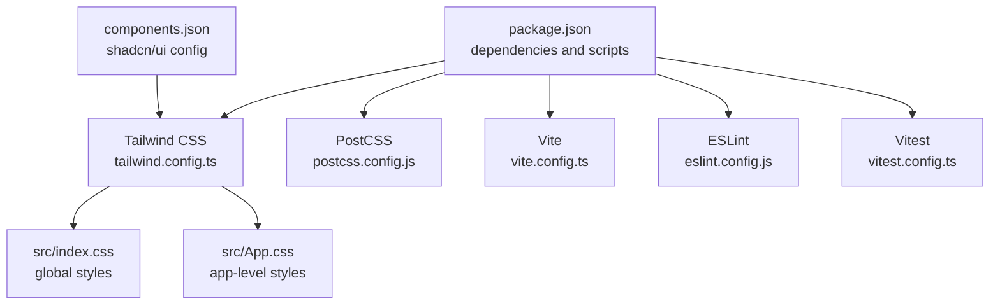
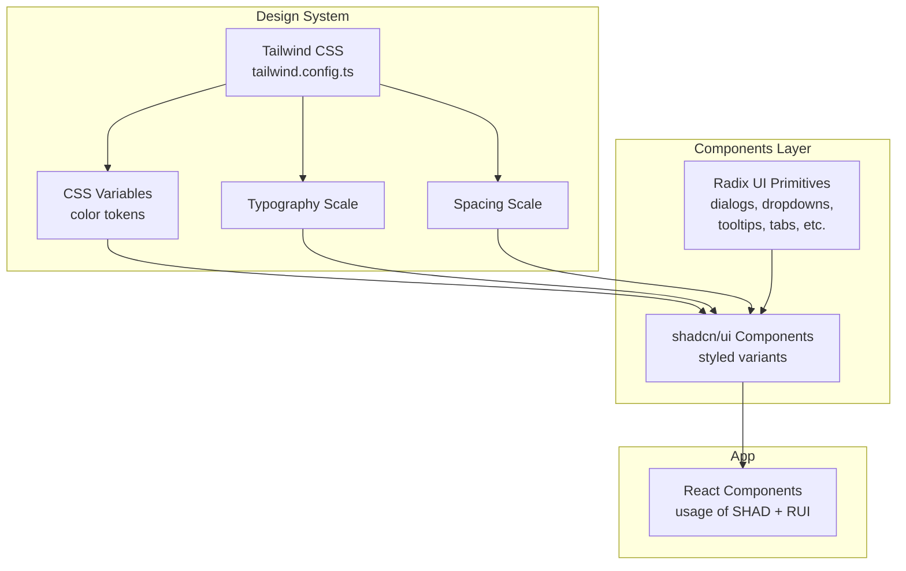
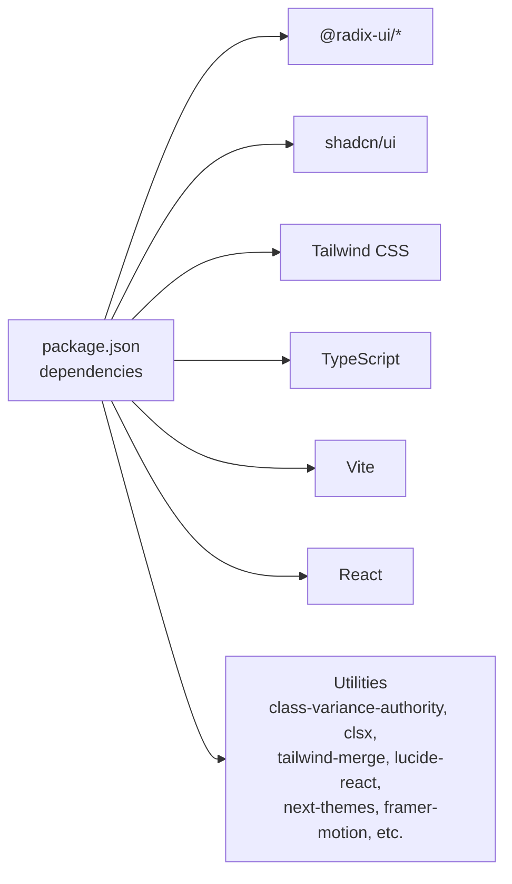

# UI Components & Design System

<cite>
**Referenced Files in This Document**
- [README.md](file://README.md)
- [package.json](file://package.json)
- [components.json](file://components.json)
- [tailwind.config.ts](file://tailwind.config.ts)
- [src/index.css](file://src/index.css)
- [src/App.css](file://src/App.css)
- [vite.config.ts](file://vite.config.ts)
- [postcss.config.js](file://postcss.config.js)
- [eslint.config.js](file://eslint.config.js)
- [vitest.config.ts](file://vitest.config.ts)
</cite>

## Table of Contents
1. [Introduction](#introduction)
2. [Project Structure](#project-structure)
3. [Core Components](#core-components)
4. [Architecture Overview](#architecture-overview)
5. [Detailed Component Analysis](#detailed-component-analysis)
6. [Dependency Analysis](#dependency-analysis)
7. [Performance Considerations](#performance-considerations)
8. [Troubleshooting Guide](#troubleshooting-guide)
9. [Conclusion](#conclusion)
10. [Appendices](#appendices)

## Introduction
This document describes the UI components and design system used in the Ryland application. The project is a Vite + React + TypeScript application that integrates shadcn/ui component library with Radix UI primitives and Tailwind CSS. It leverages design tokens, a color system, typography scale, and spacing conventions configured via Tailwind to provide accessible, customizable building blocks. The document explains how components are structured, how theming and composition work, and how to use and extend the design system effectively.

## Project Structure
The repository includes configuration files for Tailwind CSS, PostCSS, ESLint, Vite, and Vitest, along with the shadcn/ui configuration. The application depends on numerous Radix UI primitives and shadcn/ui components, indicating a component-driven UI architecture.

**Diagram sources**
- [package.json:15-69](file://package.json#L15-L69)
- [tailwind.config.ts](file://tailwind.config.ts)
- [postcss.config.js](file://postcss.config.js)
- [vite.config.ts](file://vite.config.ts)
- [eslint.config.js](file://eslint.config.js)
- [vitest.config.ts](file://vitest.config.ts)
- [components.json:1-20](file://components.json#L1-L20)
- [src/index.css](file://src/index.css)
- [src/App.css](file://src/App.css)

**Section sources**
- [README.md:53-61](file://README.md#L53-L61)
- [package.json:15-69](file://package.json#L15-L69)
- [components.json:1-20](file://components.json#L1-L20)

## Core Components
The design system centers around:
- Radix UI primitives for accessible base components (e.g., dialogs, dropdowns, tooltips, tabs, sliders, switches, progress indicators).
- shadcn/ui components built on top of Radix UI and styled with Tailwind CSS, configured via components.json.
- Tailwind CSS for design tokens, color system, typography scale, and spacing conventions.

Key integration points:
- shadcn/ui configuration defines aliases and Tailwind settings, including CSS variables for base colors.
- Tailwind configuration controls the design system’s foundational tokens and enables consistent theming.

**Section sources**
- [components.json:1-20](file://components.json#L1-L20)
- [package.json:17-43](file://package.json#L17-L43)
- [README.md:60](file://README.md#L60)

## Architecture Overview
The UI architecture composes Radix UI primitives into shadcn/ui components, which are themed and customized using Tailwind utilities. The design system is driven by:
- Tailwind CSS configuration for color palette, typography, and spacing.
- CSS variables for theme-aware tokens.
- Component aliases enabling consistent imports across the app.

**Diagram sources**
- [tailwind.config.ts](file://tailwind.config.ts)
- [components.json:6-12](file://components.json#L6-L12)
- [package.json:17-43](file://package.json#L17-L43)

## Detailed Component Analysis
This section outlines the component categories and their roles in the design system. While specific component APIs are not present in the repository snapshot, the integration pattern and customization approach are defined by the configuration and dependencies.

### Dialogs and Overlays
- Radix UI dialog and alert dialog provide accessible overlay patterns.
- shadcn/ui offers styled variants for consistent appearance and behavior.
- Composition: use Radix triggers and shadcn/ui dialog components together for accessible, themed modals.

Accessibility and customization:
- Ensure focus management and keyboard interactions align with Radix UI defaults.
- Customize sizes, paddings, and animations via Tailwind utilities and CSS variables.

**Section sources**
- [package.json:24-25](file://package.json#L24-L25)
- [package.json:18-19](file://package.json#L18-L19)

### Menus and Popovers
- Radix UI context menu, dropdown menu, hover card, and popover enable flexible overlay interactions.
- shadcn/ui provides styled variants for menus and popovers.

Composition patterns:
- Combine trigger elements with overlay components and apply consistent padding and typography scales.

**Section sources**
- [package.json:23-26](file://package.json#L23-L26)
- [package.json:26-27](file://package.json#L26-L27)

### Tabs and Navigation
- Radix UI tabs and navigation menu offer accessible tabbed interfaces and navigation patterns.
- shadcn/ui provides styled variants for consistent UX.

Customization:
- Adjust indicator styles, spacing, and typography using Tailwind utilities and CSS variables.

**Section sources**
- [package.json:29](file://package.json#L29)
- [package.json:39](file://package.json#L39)

### Form Controls
- Radix UI checkbox, radio group, switch, slider, select, and toggle components form the foundation of interactive forms.
- shadcn/ui adds styled variants and consistent spacing.

Accessibility:
- Ensure labels, ARIA attributes, and keyboard navigation are properly handled per Radix UI guidelines.

**Section sources**
- [package.json:21-22](file://package.json#L21-L22)
- [package.json:32-33](file://package.json#L32-L33)
- [package.json:34-38](file://package.json#L34-L38)
- [package.json:40](file://package.json#L40)

### Feedback and Indicators
- Radix UI progress and toast components provide feedback and status updates.
- shadcn/ui offers styled variants for progress bars and toast notifications.

Customization:
- Use color tokens and spacing scales to match brand guidelines.

**Section sources**
- [package.json:31](file://package.json#L31)
- [package.json:40](file://package.json#L40)

### Layout and Scroll Areas
- Radix UI scroll area and aspect ratio help manage layout constraints and proportions.
- shadcn/ui components integrate seamlessly with these primitives.

**Section sources**
- [package.json:19](file://package.json#L19)
- [package.json:33](file://package.json#L33)

### Theming and Composition Patterns
- CSS variables in Tailwind configuration enable theme-aware tokens.
- shadcn/ui aliases streamline imports and promote consistent usage across the app.

Responsive design:
- Apply responsive utilities from Tailwind to adjust spacing, typography, and component sizing.

Accessibility compliance:
- Follow Radix UI accessibility guidelines for focus order, ARIA roles, and keyboard interactions.

**Section sources**
- [components.json:6-12](file://components.json#L6-L12)
- [components.json:13-19](file://components.json#L13-L19)
- [tailwind.config.ts](file://tailwind.config.ts)

## Dependency Analysis
The UI stack relies on a set of core libraries that define the component ecosystem and styling pipeline.

**Diagram sources**
- [package.json:15-69](file://package.json#L15-L69)

**Section sources**
- [package.json:15-69](file://package.json#L15-L69)

## Performance Considerations
- Prefer lightweight primitives and avoid unnecessary re-renders by composing components efficiently.
- Use CSS variables and Tailwind utilities to minimize runtime style computations.
- Keep component trees shallow and leverage lazy loading for heavy overlays.

## Troubleshooting Guide
Common issues and resolutions:
- Missing shadcn/ui components after installation: verify aliases and Tailwind configuration in components.json and tailwind.config.ts.
- Theme inconsistencies: ensure CSS variables are applied and Tailwind is generating utilities for the configured base color.
- Accessibility regressions: confirm Radix UI ARIA attributes and focus management are intact when customizing components.

**Section sources**
- [components.json:1-20](file://components.json#L1-L20)
- [tailwind.config.ts](file://tailwind.config.ts)

## Conclusion
The Ryland application employs a robust UI design system that combines Radix UI primitives with shadcn/ui components and Tailwind CSS. The system emphasizes accessibility, customization, and consistency through a centralized configuration that defines color tokens, typography, and spacing. By leveraging the provided aliases and CSS variables, developers can compose accessible, responsive interfaces that align with the design system’s guidelines.

## Appendices
- Global styles and app-level styling are defined in the CSS files referenced below.

**Section sources**
- [src/index.css](file://src/index.css)
- [src/App.css](file://src/App.css)